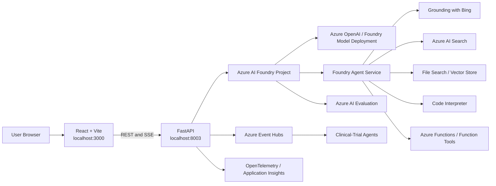

> **文档类型：** 动手实验
> **规范性术语：** **MUST**、**MUST NOT**、**SHOULD**、**SHOULD NOT** 和 **MAY** 是要求级别。
> **适用范围：** 固定 Azure AI Foundry 研讨会执行、模型和代理练习、RAG、可观测性、评估、应用部署和现代化评估。
> **例外流程：** 偏离要求需要记录风险评估、补偿控制、指定风险负责人和到期日期。

|控制领域|价值|
|---|---|
|文件编号 | `HOL-01` |
|负责人|云卓越中心 |
|审核周期|至少每年一次，并且在重大 SDK、提供商、安全性或源仓库发生更改之后 |
|证据|固定源提交、身份和身份验证结果、笔记本和 API 测试、评估报告、部署检查和清理证据 |

# 端到端 Azure AI Foundry

> **简要决定：** 使用固定的非生产 Azure AI Foundry 环境并在兼容性路径中执行研讨会，记录安全性、评估、部署和清理证据。

该实验室通过 Azure AI Foundry 研讨会的受控实施来指导云架构师、AI 工程师、应用开发人员和平台工程师。它保留了与已审查的源快照的兼容性，同时识别当前 Microsoft Foundry 项目所需的更改。

## 目的

本实验将 `Azure/ai-foundry-workshop` 仓库转换为受控、可重复的练习。您将：

1. 使用 Microsoft Entra ID 向 Azure 进行身份验证。
2. 将 Python 代码连接到 Azure AI Foundry 项目。
3. 调用已部署的大语言模型。
4. 生成嵌入。
5. 构建基本的检索增强生成工作流程。
6. 使用代码解释器、文件搜索、Bing grounding、Azure AI Search 和 Azure Functions 创建代理。
7. 启用跟踪和评估。
8. 在本地运行仓库的 FastAPI 和 React/Vite 应用。
9. 测试药物、文档和临床试验工作流程。
10. 查看仓库的 Azure Developer CLI 部署路径。

预计持续时间：**4–6 小时**，不包括 Azure 资源预配和故障排除。

## 推荐方法

按顺序完成实验，使用专用的非生产订阅或资源组，固定已审核的源提交，并保留下面定义的验收证据。复制已审阅的仓库时使用路径 A。仅当目标包括迁移仓库并重新测试每个受影响的 SDK 和代理 API 时，才选择路径 B。

请勿在此实验室中公开生产数据、生产凭证或不受限制的工具权限。将可选付费服务视为显式扩展，并在验证后删除临时资源。

## 关键兼容性声明

本实验室使用的仓库快照的最新更新日期为 **2025 年 4 月 30 日**。它使用早期基于 Hub 的 Azure AI Foundry 项目模型，并通过以下方式初始化客户端：
```python
AIProjectClient.from_connection_string(
    credential=DefaultAzureCredential(),
    conn_str=os.environ["PROJECT_CONNECTION_STRING"]
)
```
当前的 Microsoft Foundry 项目使用项目端点，例如：
```text
https://<foundry-resource>.services.ai.azure.com/api/projects/<project-name>
```
当前的 `azure-ai-projects` 2.x 代码使用 `endpoint=...` 构建客户端。

因此，选择一种执行路径：

### 路径 A — 仓库兼容

使用现有的**Foundry classic/基于 Hub 的项目**和`azure-ai-projects` 1.x。该路径以最少的代码更改运行仓库，并且是本文档中的主要路径。

### Track B — 当前 Foundry 现代化

使用当前的 Microsoft Foundry 项目、`azure-ai-projects>=2.0.0`、项目端点和迁移的代理/工具 API。这需要更改源。参见[附录A](#appendix-a-modernizing-the-repository-for-current-microsoft-foundry)。

不要安装最新的未固定的 SDK 并期望仓库保持稳定运行。这个假设是错误的。

## 仓库文档更正

该仓库包含矛盾的指令。本实验室将源代码视为权威。

|主题 |陈旧或矛盾的文档 |本实验室使用的源代码值 |
|---|---|---|
|前端框架 |一些文档说 Next.js | React 18 与 Vite |
|前端开发端口 |出现几个值 | `3000` |
|后端端口 | `8000` 和 `8003` 同时出现 | `8003` |
|前端包管理器 | npm 和 pnpm 都出现 |这里使用 npm 命令|
|本地后端协议|示例使用 `https://localhost:8003` | `http://localhost:8003` 除非配置 TLS |
|Bing 变量 |根示例使用 `GROUNDING_WITH_BING_CONNECTION_NAME` |后端代码读取 `BING_CONNECTION_NAME` |
|后端`.env`加载| README 意味着自动加载 |使用 `--env-file .env` 启动 Uvicorn |
|文档索引|没有明确记录|后端硬编码 `literature-index` |
| `azd` 基础设施 |描述为完整| Bicep 包含空白 AI 端点/模型值，需要审核 |

## 目标架构

## 可交付成果

在实验结束时，保留以下证据：

- 证明 Azure 身份验证成功的屏幕截图或终端输出。
- 快速启动笔记本的成功模型响应。
- 嵌入输出和一项相似性比较。
- RAG 响应基于检索到的内容。
- 至少两次成功执行代理工具。
- 一份跟踪日志或可观测性日志。
- 一项评估结果。
- 工作前端和后端健康检查。
- 一种经过测试的应用工作流程。
- 清理日志显示临时资源已被删除。

## 先决条件

### Azure 访问

您需要：

- 有效的 Azure 订阅；
- 创建或使用资源组的权限；
- 允许使用 Foundry 项目；
- 适当的项目角色，例如创建和运行代理所需的角色；
- 所选区域的模型配额；
- 访问 Azure AI Search；
- 可选择接入 Bing grounding；
- 可选择访问 Azure Event Hubs；
- 可选的 Azure Functions 访问权限。

### 所需的 Azure 资源

对于核心笔记本：

- 为 Track A Foundry classic/基于中心的项目；
- 聊天模型部署；
- 嵌入模型部署；
- Azure AI Search 服务和项目连接。

对于代理练习：

- 用于 Bing 笔记本和药物工作流程的 Bing grounding 连接；
- Azure AI Search 连接；
- 用于 Azure Functions 工具笔记本的 Azure Function；
- 上传文件用于文件搜索。

对于全栈试用工作流程：

- Event Hubs 命名空间；
- Event Hubs 名为`event-driven-agents`，除非您更改代码；
- 具有发送事件权限的连接字符串。

### 本地工具

在继续之前验证工具：
```bash
python --version
node --version
npm --version
git --version
az version
```
建议最低限度：

- Python 3.10 或更高版本；
- Node.js 18 或更高版本；
- 吉特；
- Azure CLI；
- 带有 Python 和 Jupyter 扩展的 Visual Studio Code；
- `uv`；
- npm。

### 成本控制

实验室可以通过以下方式产生费用：

- 部署的模型和令牌；
- Azure AI Search；
- Bing grounding；
- Event Hubs；
- Azure Functions；
- Application Insights；
- Container Apps；
- 静态网络应用。

使用专用资源组。除非有意保留环境，否则在实验结束后将其删除。

## 实验室：准备 Azure 资源

### 登录并选择订阅
```bash
az login
az account list --output table
az account set --subscription "<subscription-id-or-name>"
az account show --output table
```
通过条件：

- `az account show` 报告预期的订阅和租户。

### 创建或标识资源组
```bash
az group create \
  --name rg-ai-foundry-lab \
  --location canadacentral
```
当模型可用性或组织策略需要时，使用其他区域。

### 创建或选择 Foundry 项目

对于仓库兼容路径，请使用基于 Hub 的/经典项目，该项目公开具有以下常规结构的项目连接字符串：
```text
<region>.api.azureml.ms;<subscription-id>;<resource-group>;<workspace-or-project>
```
日志记录：
```text
PROJECT_CONNECTION_STRING=
TENANT_ID=
```
不要将这些值存储在源代码管理中。

### 部署聊天模型

部署仓库代理 API 支持的模型。

建议部署名称：
```text
gpt-4o-mini
```
准确记录部署名称：
```text
MODEL_DEPLOYMENT_NAME=gpt-4o-mini
```
部署名称不一定与模型目录名称相同。

### 部署嵌入模型

建议部署：
```text
text-embedding-3-small
```
日志记录：
```text
EMBEDDING_MODEL_DEPLOYMENT_NAME=text-embedding-3-small
```
### 创建 Azure AI Search

创建 Azure AI Search 服务并将其连接到 Foundry 项目。

最低实际要求：

- 支持您练习中使用的向量搜索功能的服务层；
- Foundry 项目可见的项目连接；
- 足以进行索引操作的身份或密钥权限。

### 配置 Bing grounding

在项目中创建 Bing grounding 连接。

记录连接名称：
```text
BING_CONNECTION_NAME=<connection-name>
```
仓库的后端读取 `BING_CONNECTION_NAME`。根 `.env.example` 使用不同的名称。将两个名称设置为相同的值以避免笔记本和应用行为不一致。

### 为可选试用工作流程创建 Event Hubs

创建 Event Hubs 命名空间和 Event Hubs，名称为：
```text
event-driven-agents
```
日志记录：
```text
EVENTHUB_CONNECTION_STRING=
EVENTHUB_NAME=event-driven-agents
CONSUMER_GROUP=$Default
```
### 验证角色分配

至少，您的登录身份必须能够使用 Foundry 项目和已部署的模型。

验证分配：
```bash
az role assignment list \
  --assignee "<your-user-object-id-or-email>" \
  --all \
  --output table
```
对于具有托管标识的 Azure AI Search，还需验证执行索引操作的标识所需的数据平面和服务平面角色。

## 实验室：克隆并固定仓库

### 克隆仓库
```bash
git clone https://github.com/Azure/ai-foundry-workshop.git
cd ai-foundry-workshop
```
### 使用经过审核的快照
```bash
git checkout 273c24c4336d0fb8778080646eb49b91e176bc1e
git status
```
预期结果：
```text
HEAD detached at 273c24c
nothing to commit, working tree clean
```
使用记录在案的提交可以防止对笔记本行为进行静默更改。

### 安装`uv`

Linux/macOS：
```bash
curl -LsSf https://astral.sh/uv/install.sh | sh
```
Windows PowerShell：
```powershell
powershell -ExecutionPolicy ByPass -c "irm https://astral.sh/uv/install.ps1 | iex"
```
如果没有立即找到 `uv`，请重新启动终端。

### 创建 Python 环境

Linux/macOS：
```bash
uv venv
source .venv/bin/activate
```
Windows PowerShell：
```powershell
uv venv
.venv\Scripts\Activate.ps1
```
### 安装笔记本依赖项
```bash
uv pip install -r requirements.txt
```
对于 Track A，在安装需求后强制使用经典兼容的项目 SDK：
```bash
uv pip install "azure-ai-projects==1.0.0"
```
然后检查环境：
```bash
python -m pip show azure-ai-projects
python -m pip check
```
通过条件：

- `azure-ai-projects` 报告 1.x 版本；
- `pip check` 报告没有依赖性冲突。

### 注册 Jupyter 内核
```bash
python -m ipykernel install \
  --user \
  --name ai-foundry-workshop \
  --display-name "Python (AI Foundry Workshop)"
```
## 实验：配置环境变量

### 创建`.env`

Linux/macOS：
```bash
cp .env.example .env
```
Windows PowerShell：
```powershell
Copy-Item .env.example .env
```
### 将文件替换为一致的配置
```dotenv
# Track A: classic/hub-based project
PROJECT_CONNECTION_STRING=<classic-project-connection-string>

# Model deployments
MODEL_DEPLOYMENT_NAME=<chat-model-deployment-name>
EMBEDDING_MODEL_DEPLOYMENT_NAME=<embedding-model-deployment-name>
SERVERLESS_MODEL_NAME=<optional-serverless-model-name>

# Microsoft Entra ID
TENANT_ID=<tenant-id>

# Set both names because repository components use different names
BING_CONNECTION_NAME=<bing-grounding-connection-name>
GROUNDING_WITH_BING_CONNECTION_NAME=<bing-grounding-connection-name>

# Tracing
AZURE_TRACING_GEN_AI_CONTENT_RECORDING_ENABLED=true
AZURE_SDK_TRACING_IMPLEMENTATION=opentelemetry

# Local full-stack application
VITE_API_URL=http://localhost:8003
VITE_DEFAULT_THEME=dark
VITE_API_VERSION=v1

# Development diagnostics
DEBUG=false
LOG_LEVEL=INFO
```
### 防止意外提交

验证 `.env` 是否被忽略：
```bash
git status --short
git check-ignore .env
```
如果不忽略`.env`，则在本地添加：
```bash
printf "\n.env\n" >> .git/info/exclude
```
不要提交凭据。

## 实验室：验证身份验证

### 登录到正确的租户
```bash
az login --tenant "<tenant-id>"
az account set --subscription "<subscription-id>"
az account show --query "{subscription:name,tenantId:tenantId,user:user.name}" --output table
```
### 测试令牌获取

在仓库根目录中创建 `validate_auth.py`：
```python
from azure.identity import DefaultAzureCredential

credential = DefaultAzureCredential()
token = credential.get_token("https://cognitiveservices.azure.com/.default")

print("Authentication succeeded.")
print(f"Token expires at Unix time: {token.expires_on}")
```
运行：
```bash
python validate_auth.py
```
通过条件：
```text
Authentication succeeded.
```
### 验证经典项目客户端

创建`validate_project.py`：
```python
import os
from dotenv import load_dotenv
from azure.ai.projects import AIProjectClient
from azure.identity import DefaultAzureCredential

load_dotenv()

connection_string = os.environ["PROJECT_CONNECTION_STRING"]

client = AIProjectClient.from_connection_string(
    credential=DefaultAzureCredential(),
    conn_str=connection_string,
)

print("AIProjectClient created successfully.")
print(type(client))
```
运行：
```bash
python validate_project.py
```
如果 `from_connection_string` 不存在，则您安装了当前的 2.x SDK，而不是与仓库兼容的 1.x SDK。

## 实验室：运行介绍笔记本

启动 JupyterLab：
```bash
jupyter lab
```
对于每台笔记本：

1.选择**Python（AI Foundry Workshop）**；
2.重启内核；
3.从上到下运行单元格；
4. 在第一个失败的单元上停止；
5.解决故障而不是盲目地运行后面的单元。

### 笔记本 1：身份验证

路径：
```text
1-introduction/1-authentication.ipynb
```
任务：

1.确认`.env`加载。
2. 通过 Azure CLI 登录。
3. 设置从连接字符串中提取的订阅；
4. 使用 `DefaultAzureCredential` 获取 Cognitive Services 令牌。

通过条件：
```text
Successfully acquired token!
```
### 笔记本2：环境设置

路径：
```text
1-introduction/2-environment_setup.ipynb
```
任务：

1. 验证所有必需的变量都存在。
2. 确认 Python 包导入；
3.确认项目客户端可以初始化；
4. 不要将机密值打印到共享笔记本输出中。

通过条件：

- 存在所需的变量；
- 项目客户端创构建功；
- 不显示任何凭证。

### 笔记本 3：快速入门

路径：
```text
1-introduction/3-quick_start.ipynb
```
任务：

1. 初始化项目客户端。
2. 获取 Chat Completions 客户端；
3.发送简单提示；
4.记录模型部署名称和响应；
5. 使用第二条系统指令重复该请求。

建议提示：
```text
Explain the difference between retrieval and generation in three sentences.
```
通过条件：

- 模型返回非空响应；
- 当系统指令改变时，响应逻辑地改变。

## 实验室：聊天完成、嵌入和 RAG

按顺序运行这些笔记本。

### 基本聊天完成

路径：
```text
2-notebooks/1-chat_completion/1-basic-chat-completion.ipynb
```
行动：

1. 运行基线请求。
2. 识别系统、用户和助手消息；
3.添加特定域系统提示；
4. 比较笔记本公开生成参数时的确定性响应和创造性响应；
5. 记录令牌或延迟信息（如果可用）。

测试提示：
```text
You are a cloud architecture reviewer. Identify three risks in exposing an LLM endpoint directly to the public internet.
```
通过标准：

- 响应包含三个技术上不同的风险；
- 助理遵循所要求的角色和输出限制。

### 嵌入

路径：
```text
2-notebooks/1-chat_completion/2-embeddings.ipynb
```
行动：

1. 生成至少三个句子的嵌入。
2. 打印向量长度；
3. 计算相关句子和不相关句子之间的相似度；
4.验证语义相关的文本具有较高的相似度得分。

建议输入：
```text
A: Azure AI Search supports vector retrieval.
B: Vector search retrieves semantically similar documents.
C: A virtual network routes IP packets between subnets.
```
通过标准：
```text
similarity(A, B) > similarity(A, C)
```
不要对嵌入尺寸进行硬编码。这取决于所选模型和配置。

### 基本 RAG

路径：
```text
2-notebooks/1-chat_completion/3-basic-rag.ipynb
```
行动：

1. 检查示例源文档。
2. 生成或加载文档块；
3. 创建嵌入；
4. 将文档存储或提交到配置的检索层；
5. 发出查询；
6. 在检查最终答案之前检查检索到的段落；
7. 确认检索到的文本支持答案。

所需验证：

- 运行一个可回答的问题；
- 运行一个源数据未涵盖的问题；
- 确认第二个响应没有捏造没有证据支持的事实。

通过标准：

- 检索相关段落；
- 最终答案使用检索到的上下文；
- 不支持的问题将被拒绝或合格。

### Phi-4 或替代模型

路径：
```text
2-notebooks/1-chat_completion/4-phi-4.ipynb
```
这个练习是可选的。仅当该模型在您所在的地区和订阅中可用时才运行它。

比较：

- 响应质量；
- 延迟；
- 令牌使用；
- 遵循指令。

不要根据单一提示就声称某个模型通常更优越。

## 实验室：代理开发

### 代理基础知识

路径：
```text
2-notebooks/2-agent_service/1-basics.ipynb
```
行动：

1. 创建具有明确指令的代理。
2.创建线程；
3.添加用户留言；
4. 创建并处理运行；
5. 检查状态转换；
6. 列出助手消息；
7.完成后删除代理。

通过条件：

- 运行以成功的终端状态结束；
- 检索辅助输出；
- 临时代理资源被删除。

### 代码解释器

路径：
```text
2-notebooks/2-agent_service/2-code_interpreter.ipynb
```
建议任务：
```text
Create a small dataset of monthly token usage, calculate the average, and generate a chart.
```
验证：

- 调用该工具；
——计算正确；
- 生成的文件或图表可访问；
- 代理在验证后被删除。

### 文件搜索

路径：
```text
2-notebooks/2-agent_service/3-file-search.ipynb
```
行动：

1. 使用非敏感 PDF 或文本文件。
2.上传文件；
3. 创建或附加向量存储；
4. 提出一个特定来源的问题；
5.检查引文或注释；
6.删除上传的文件和向量存储资源。

通过条件：

- 答案包含在上传文件中找到的信息；
- 答案不仅仅是通用模型知识。

### Bing grounding

路径：
```text
2-notebooks/2-agent_service/4-bing_grounding.ipynb
```
行动：

1. 验证 Bing 连接名称。
2. 创建 grounding 工具；
3. 提出当前信息问题；
4. 检查返回的 grounding 元数据；
5. 将其与无根据的答案进行比较。

通过条件：

- 工具成功执行；
- 答案包含 grounding 结果的证据。

### Azure AI Search 工具

路径：
```text
2-notebooks/2-agent_service/5-agents-aisearch.ipynb
```
行动：

1. 验证 Foundry 项目的默认 Azure AI Search 连接。
2.确定目标指标；
3. 验证向量和可检索字段；
4. 创建 AI 搜索工具；
5.提出一个可以从索引中回答的问题；
6.检查引文；
7. 测试不支持的查询。

通过标准：

- 答案基于索引内容；
- 引用指向检索到的来源；
- 不支持的查询是合格的。

### Azure Functions 工具

路径：
```text
2-notebooks/2-agent_service/6-agents-az-functions.ipynb
```
行动：

1. 部署或选择测试 Azure Function。
2.配置认证；
3. 准确定义功能工具架构；
4.通过代理调用函数；
5. 将代理参数与函数输入进行比较；
6. 确认函数结果反映在最终答案中。

通过条件：

- 工具输入与模式匹配；
- 函数调用成功；
- 最终响应使用函数输出。

## 实验室：可观测性和评估

### 可观测性

路径：
```text
2-notebooks/3-quality_attributes/1-Observability.ipynb
```
运行前：
```dotenv
AZURE_TRACING_GEN_AI_CONTENT_RECORDING_ENABLED=true
AZURE_SDK_TRACING_IMPLEMENTATION=opentelemetry
```
行动：

1. 配置跟踪。
2. 运行模型或代理请求；
3. 定位父 trace 和子 span；
4. 检查延迟和工具跨度；
5. 验证是否记录了提示和响应；
6. 当策略禁止存储提示时禁用内容录制。

要采集的证据：

- 链路追踪标识符；
- 总持续时间；
- 模型调用跨度；
- 工具调用范围；
- 测试受控故障时的错误 Span。

### 评估

路径：
```text
2-notebooks/3-quality_attributes/2-evaluation.ipynb
```
创建一个至少包含 5 条记录在案的小型评估数据集：
```json
{"query": "What is RAG?", "ground_truth": "RAG combines retrieval with generation."}
```
包括：

- 普通查询；
- 不明确的查询；
- 不支持的查询；
- 对抗性或指令冲突查询；
- 依赖于检索的查询。

评估笔记本会公开相关性、有据性、连贯性和相似性等指标。

通过标准：

- 评估完成且没有丢失日志记录；
- 手动检查低分示例；
- 不会根据无法解释的总分做出任何部署决策。

## 实验室：准备全栈应用

样本位于：
```text
3-ai-native-e2e-sample/
```
真实的本地拓扑为：
```text
Frontend: http://localhost:3000
Backend:  http://localhost:8003
```
### 配置后端
```bash
cd 3-ai-native-e2e-sample/backend
uv venv
```
激活环境。

Linux/macOS：
```bash
source .venv/bin/activate
```
Windows PowerShell：
```powershell
.venv\Scripts\Activate.ps1
```
安装依赖项：
```bash
uv pip install -r requirements.txt
uv pip install "azure-ai-projects==1.0.0"
python -m pip check
```
创建`.env`：
```bash
cp .env.example .env
```
使用这个更正后的后端配置：
```dotenv
PROJECT_CONNECTION_STRING=<classic-project-connection-string>
MODEL_DEPLOYMENT_NAME=<chat-model-deployment-name>

# Required by routers/medication.py but absent from backend/.env.example
BING_CONNECTION_NAME=<bing-grounding-connection-name>

EVENTHUB_CONNECTION_STRING=<event-hubs-connection-string>
EVENTHUB_NAME=event-driven-agents
CONSUMER_GROUP=$Default

AZURE_TRACING_GEN_AI_CONTENT_RECORDING_ENABLED=true
AZURE_SDK_TRACING_IMPLEMENTATION=opentelemetry
LOG_LEVEL=INFO
DEBUG=false
```
### 满足文档工作流程依赖

后端硬编码：
```text
literature-index
```
您必须：

- 创建并填充名为 `literature-index` 的 Azure AI Search 索引；或
- 更改代码以从环境变量中读取索引名称。

推荐补丁：
```python
index_name=os.getenv("AZURE_SEARCH_INDEX_NAME", "literature-index")
```
然后添加：
```dotenv
AZURE_SEARCH_INDEX_NAME=literature-index
```
Foundry 项目必须具有对项目客户端可见的默认 Azure AI Search 连接。

### 正确启动后端

应用本身无法可靠地加载 `.env`。显式传递文件：
```bash
uvicorn main:app \
  --reload \
  --host 0.0.0.0 \
  --port 8003 \
  --env-file .env
```
预期日志：
```text
Application startup complete.
Uvicorn running on http://0.0.0.0:8003
```
### 测试后端健康状况
```bash
curl http://localhost:8003/health
```
预期的：
```json
{"status":"ok"}
```
开放 API 文档：
```text
http://localhost:8003/docs
```
### 测试药物流

前端调用：
```text
POST /agents/medication/analyze_stream
```
测试：
```bash
curl -N \
  -X POST \
  "http://localhost:8003/agents/medication/analyze_stream" \
  -H "Content-Type: application/json" \
  -d '{"name":"Aspirin","notes":"General educational analysis only"}'
```
预期行为：

- 服务器发送的事件是流式传输的。
- 出现代理创建和运行状态消息。
- 调用 Bing grounding。
- 返回最终的结构化响应。

请勿将输出用作医疗建议。

###测试文学聊天
```bash
curl -N \
  -X POST \
  "http://localhost:8003/api/agents/literature-chat" \
  -H "Content-Type: application/json" \
  -d '{"message":"Summarize the main finding in the indexed literature."}'
```
如果 `No default Azure AI Search connection found` 失败，请修复项目连接。

如果由于 `literature-index` 缺失而失败，请创建或填充该索引。

###测试模拟
```bash
curl \
  -X POST \
  "http://localhost:8003/api/trials/simulate?num_events=3"
```
预计：

- 产生三个合成事件；
- 事件被发送到 Event Hubs；
- 响应报告成功。

如果未配置 Event Hubs，此工作流将失败，而运行状况和其他路由可能仍然有效。

## 实验室：运行前端

打开第二个终端：
```bash
cd ai-foundry-workshop/3-ai-native-e2e-sample/frontend
npm install
```
创建`.env.local`：
```dotenv
VITE_API_URL=http://localhost:8003
VITE_DEFAULT_THEME=dark
VITE_API_VERSION=v1
```
除非您已显式配置本地证书和启用 TLS 的后端，否则请勿使用 `https://localhost:8003`

开始投票：
```bash
npm run dev
```
预期的：
```text
Local: http://localhost:3000/
```
打开：
```text
http://localhost:3000
```
### 前端验证清单

- 页面加载时没有空白屏幕。
- 浏览器控制台不包含 CORS 错误。
- 药物请求接收流式传输的状态消息。
- 文档请求达到`/api/agents/literature-chat`。
- 试用请求到达`/api/trials/simulate`。
- 后端记录相应的请求。

### 常见的前端故障

症状：
```text
Failed to fetch
```
证实：
```bash
curl http://localhost:8003/health
```
然后检查：

- `.env.local` 使用 `http`，而不是 `https`；
- 后端位于端口 `8003` 上；
- 前端位于端口 `3000` 上；
- 后端 CORS 允许 `http://localhost:3000`;
- 浏览器不会阻止混合内容。

## 实验室：检查 Azure 部署

从端到端示例目录：
```bash
cd 3-ai-native-e2e-sample
azd auth login
azd init
azd provision
```
不要盲目运行`azd up`。

### 部署前需要进行审查

Bicep 模板包含空后端环境值：
```bicep
{
  name: 'AZURE_AI_PROJECT_ENDPOINT'
  value: ''
}
{
  name: 'MODEL_DEPLOYMENT_NAME'
  value: ''
}
```
这与后端源不匹配，后端源需要 `PROJECT_CONNECTION_STRING`。

基础设施还需要审查：

- Foundry 项目创建或链接；
- 模型部署；
- AI 搜索连接和索引；
- Bing 连接；
- Event Hubs；
- 后端机密；
- 托管身份和 RBAC；
- Application Insights；
- 前端 API 端点注入；
- 已部署前端主机名的 CORS。

### 最小部署修正

对于仓库兼容的部署，请传递：
```text
PROJECT_CONNECTION_STRING
MODEL_DEPLOYMENT_NAME
BING_CONNECTION_NAME
EVENTHUB_CONNECTION_STRING
EVENTHUB_NAME
CONSUMER_GROUP
```
将机密存储在 Key Vault 或 Container Apps 机密中。不要将机密直接放置在提交给 Git 的 Bicep 参数文件中。

### 审核后部署
```bash
azd up
```
然后验证：
```bash
azd env get-values
```
测试已部署的后端运行状况端点和前端 URL。

## 验证

|测试|预期结果 |通行证 |
|---|---|---|
| Azure CLI 身份验证 |正确的租户和订阅 | ○|
|令牌获取 |获取 Cognitive Services 令牌 | ○|
|经典项目客户端|从连接字符串创建客户端 | ○|
|基本聊天 |非空模型响应 | ○|
|嵌入 |相关文字相似度较大 | ○|
|基本 RAG |答案基于检索到的上下文 | ○|
|代理基础知识 |运行完成并删除代理 | ○|
|代码解释器 |工具执行并返回制品/结果 | ○|
|文件搜索 |答案使用上传的文件 | ○|
|Bing grounding |返回 grounding 当前答案 | ○|
| Azure AI Search |返回带有引用的索引内容 | ○|
| Azure Functions |函数工具执行成功 | ○|
|可观测性|轨迹和模型/工具跨度可见 | ○|
|评估|数据集评分和失败回顾 | ○|
|后端健康 | `{"status":"ok"}` | ○|
|用药流程 |返回最终结构化结果 | ○|
|文档工作流程|返回基于搜索的响应 | ○|
|试用工作流程|请求发布的合成事件 | ○|
|前端 | UI 加载并调用后端| ○|
|清理 |临时资源已删除 | ○|

## 故障排除

### `AIProjectClient` 没有 `from_connection_string`

原因：

- `azure-ai-projects` 2.x 已安装。

仓库兼容修复：
```bash
uv pip install --force-reinstall "azure-ai-projects==1.0.0"
python -m pip show azure-ai-projects
```
替代方案：

- 将代码迁移到 `AIProjectClient(endpoint=..., credential=...)`。

### 身份验证在 CLI 中成功，但在 Python 中失败

运行：
```bash
az account show
az account get-access-token \
  --resource https://cognitiveservices.azure.com/
```
然后重新启动笔记本内核。

另请验证：

- 正确的租户；
- 正确的订阅；
- 项目角色分配；
- 过时的服务主体变量不会覆盖 CLI 凭证。

### 未找到模型部署

该代码使用部署名称，而不是基本模型名称。

检查 Foundry 中的确切部署名称并更新：
```dotenv
MODEL_DEPLOYMENT_NAME=<exact-deployment-name>
```
### Bing 连接错误

后端需要：
```dotenv
BING_CONNECTION_NAME=<exact-project-connection-name>
```
仅设置 `GROUNDING_WITH_BING_CONNECTION_NAME` 对于后端来说是不够的。

### 没有默认的 Azure AI Search 连接

文档路由请求项目的默认 Azure AI Search 连接。

修复：

- 将 Azure AI Search 连接添加到项目；
- 使其成为该类型的默认连接；
- 验证执行身份可以读取它。

### `literature-index` 未找到

索引名称是硬编码的。

修复：

- 创建`literature-index`；或
- 修补路由以使用 `AZURE_SEARCH_INDEX_NAME`。

### 后端启动但缺少 `.env` 值

从以下开始：
```bash
uvicorn main:app --reload --port 8003 --env-file .env
```
### 前端调用 HTTPS 失败

设定：
```dotenv
VITE_API_URL=http://localhost:8003
```
编辑`.env.local`后重启 Vite。

### CORS 错误

后端目前允许：
```text
http://localhost:3000
```
如果使用其他端口，请更新`allow_origins`中的`backend/main.py`。

### 试验模拟失败

验证：
```dotenv
EVENTHUB_CONNECTION_STRING=
EVENTHUB_NAME=event-driven-agents
CONSUMER_GROUP=$Default
```
确认连接字符串具有发送权限。

### 代理运行仍处于排队状态

可能的原因：

- 模型配额耗尽；
- 代理服务不支持的模型；
- 区域能力；
- 部署类型不正确；
- 缺少工具连接；
- 不兼容的 SDK。

重试之前检查运行的 `last_error`。

## 安全和生产差距

该仓库是一个研讨会，而不是一个生产参考架构。生产使用前，地址：

- 托管身份而不是本地连接字符串；
- Key Vault；
- 私有端点和受控出口；
- FastAPI 路由上的身份验证和授权；
- 输入验证和输出过滤；
- 提示注入控制；
- 数据分类和保留；
- 内容安全；
- 租户隔离；
- 请求限制和预算；
- 模型和工具许可名单；
- 审计日志；
- 结构化评估门；
- 依赖性固定和软件构成分析；
- CI/CD 安全扫描；
- 灾难恢复；
- 删除重复的路由器注册；
- 消除硬编码索引名称；
- 适当的代理和线程清理；
- 医疗保健免责声明和监管数据控制。

## 清理

### 删除临时代理和文件

确保笔记本删除：

- 代理人；
- 支持的线程；
- 上传的文件；
- 向量存储；
- 临时索引。

### 停止本地进程

在前端和后端终端中按 `Ctrl+C`。

### 删除本地环境

Linux/macOS：
```bash
rm -rf .venv
rm -rf 3-ai-native-e2e-sample/backend/.venv
rm -rf 3-ai-native-e2e-sample/frontend/node_modules
```
Windows PowerShell：
```powershell
Remove-Item -Recurse -Force .venv
Remove-Item -Recurse -Force 3-ai-native-e2e-sample\backend\.venv
Remove-Item -Recurse -Force 3-ai-native-e2e-sample\frontend\node_modules
```
### 删除 Azure 实验室资源组
```bash
az group delete \
  --name rg-ai-foundry-lab \
  --yes \
  --no-wait
```
稍后验证删除：
```bash
az group exists --name rg-ai-foundry-lab
```
预期的：
```text
false
```
## 操作注意事项

- 在一个独立的、预算受控的环境中与负责任的实验室负责人一起进行练习。
- 固定仓库提交和依赖项版本，以便结果保持可重现。
- 在实验室期间监视模型、代理、搜索、Event Hubs 和 Application Insights 的使用情况。
- 将跟踪、提示、检索的文档、上传的文件和评估数据集视为潜在敏感数据。
- 验收测试后停止本地进程并删除临时代理、文件、索引、向量存储、部署和资源组。
- 每当源仓库、Microsoft Foundry 项目类型或 Azure AI SDK 版本发生更改时，重新验证兼容性路径。
- 在安全部分的漏洞有可靠的修复和验证证据之前，不要将研讨会应用晋级到生产。

## 附录 A — 对当前 Microsoft Foundry 的仓库进行现代化改造

当前的 Foundry 项目使用项目端点和 `azure-ai-projects` 2.x。

### 替换环境配置

旧：
```dotenv
PROJECT_CONNECTION_STRING=<connection-string>
```
新的：
```dotenv
PROJECT_ENDPOINT=https://<resource>.services.ai.azure.com/api/projects/<project>
MODEL_DEPLOYMENT_NAME=<deployment-name>
```
### 替换项目-客户端构建

旧：
```python
project_client = AIProjectClient.from_connection_string(
    credential=DefaultAzureCredential(),
    conn_str=os.environ["PROJECT_CONNECTION_STRING"],
)
```
新基线：
```python
project_client = AIProjectClient(
    endpoint=os.environ["PROJECT_ENDPOINT"],
    credential=DefaultAzureCredential(),
)
```
### 安装当前的 SDK
```bash
uv pip install "azure-ai-projects>=2.0.0" azure-identity
```
不要单独应用此更改。还必须根据安装的 SDK 检查代理、线程、消息、运行和工具 API。

### 对于当前模型调用，首选项目范围的 OpenAI 客户端

当前的 Foundry 项目公开了该项目中与 OpenAI 兼容的客户端：
```python
from azure.ai.projects import AIProjectClient
from azure.identity import DefaultAzureCredential
import os

project_client = AIProjectClient(
    endpoint=os.environ["PROJECT_ENDPOINT"],
    credential=DefaultAzureCredential(),
)

with project_client.get_openai_client() as openai_client:
    response = openai_client.responses.create(
        model=os.environ["MODEL_DEPLOYMENT_NAME"],
        input="Explain retrieval-augmented generation.",
    )
    print(response.output_text)
```
### 迁移工作项

- 替换所有 `PROJECT_CONNECTION_STRING` 的使用；
- 更新所有 `AIProjectClient.from_connection_string` 调用；
- 更新工具导入；
- 更新代理创建和版本控制；
- 更新线程/消息/运行 API；
- 更新连接发现；
- 更新跟踪初始化；
- 替换已弃用的标头和预览标志；
- 添加固定依赖版本；
- 添加自动化集成测试；
- 更新 Bicep 和 `azd` 环境变量；
- 重新测试每个笔记本。

## 附录 B — 建议的仓库改进

1.为 Python 依赖项添加锁定文件。
2. 添加节点锁定文件并选择一个包管理器。
3.将前端 README 从 Next.js 更正为 Vite；
4.将端口标准化为前端`3000`和后端`8003`；
5.使用`http://localhost:8003`
6. 一致地重命名 Bing 变量；
7. 在应用启动或记录在案的命令中显式加载后端`.env`；
8.使搜索索引名称可配置；
9.删除重复的药物路由器注册；
10.配置或明确声明所有 Azure 依赖项；
11.替换空白的 Bicep 环境值；
12.添加健康、集成和端到端测试；
13.提供当前的 Foundry 2.x 分支；
14. 添加代理、线程、文件和索引的自动清理；
15. 说明哪些活动需要付费服务。

## 附录 C — 源图

用于构建此实验室的主要仓库文件：
```text
README.md
mkdocs.yml
.env.example
requirements.txt
1-introduction/
2-notebooks/
3-ai-native-e2e-sample/README.md
3-ai-native-e2e-sample/azure.yaml
3-ai-native-e2e-sample/infra/main.bicep
3-ai-native-e2e-sample/backend/main.py
3-ai-native-e2e-sample/backend/clients.py
3-ai-native-e2e-sample/backend/.env.example
3-ai-native-e2e-sample/backend/requirements.txt
3-ai-native-e2e-sample/backend/routers/medication.py
3-ai-native-e2e-sample/backend/routers/literature.py
3-ai-native-e2e-sample/backend/routers/trials.py
3-ai-native-e2e-sample/frontend/package.json
3-ai-native-e2e-sample/frontend/vite.config.ts
3-ai-native-e2e-sample/frontend/src/config.ts
3-ai-native-e2e-sample/frontend/src/lib/api.ts
```
## 相关主题

- [Azure OpenAI 平台架构](../data-ai-integration/dai-azure-openai-platform-architecture.md)
- [企业 RAG 和 AI 搜索](../data-ai-integration/dai-enterprise-rag-and-ai-search.md)
- [Agent AI 平台架构与工具治理](../data-ai-integration/dai-agentic-ai-platform-architecture-and-tool-governance.md)
- [AI 应用的生产运营](../data-ai-integration/dai-production-operations-for-ai-applications.md)

## 相关仓库

- [Azure/ai-foundry-workshop](https://github.com/Azure/ai-foundry-workshop) — 提供本实验室在元数据中记录在案的固定源提交中使用的笔记本、应用源、基础结构和练习。
