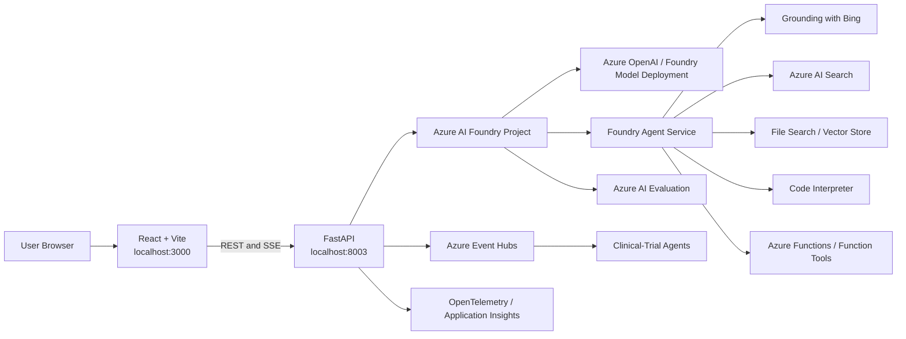

> **Document class:** Hands-on Labs guided implementation lab
> **Normative terms:** **MUST**, **MUST NOT**, **SHOULD**, **SHOULD NOT**, and **MAY** are requirements levels.
> **Applicability:** Pinned Azure AI Foundry workshop execution, model and agent exercises, RAG, observability, evaluation, application deployment, and modernization assessment.
> **Exception process:** Deviations require a documented risk assessment, compensating controls, named risk owner, and expiry date.

| Control field | Value |
|---|---|
| Document ID | `HOL-01` |
| Owner | Cloud Center of Excellence |
| Review cycle | At least annually and after material SDK, provider, security, or source-repository changes |
| Evidence | Pinned source commit, identity and authentication results, notebook and API tests, evaluation reports, deployment checks, and cleanup evidence |

# End-to-End Azure AI Foundry

> **Decision in brief:** Use a pinned, non-production Azure AI Foundry environment and execute the workshop in compatibility tracks, recording security, evaluation, deployment, and cleanup evidence.

This lab guides cloud architects, AI engineers, application developers, and platform engineers through a controlled implementation of the Azure AI Foundry workshop. It preserves compatibility with the reviewed source snapshot while identifying the changes required for current Microsoft Foundry projects.

## Purpose

This lab converts the `Azure/ai-foundry-workshop` repository into a controlled, repeatable exercise. You will:

1. Authenticate to Azure with Microsoft Entra ID.
2. Connect Python code to an Azure AI Foundry project.
3. Call a deployed large language model.
4. Generate embeddings.
5. Build a basic Retrieval-Augmented Generation workflow.
6. Create agents with Code Interpreter, File Search, Bing grounding, Azure AI Search, and Azure Functions.
7. Enable tracing and evaluation.
8. Run the repository's FastAPI and React/Vite application locally.
9. Test medication, literature, and clinical-trial workflows.
10. Review the repository's Azure Developer CLI deployment path.

Estimated duration: **4–6 hours**, excluding Azure resource provisioning and troubleshooting.

## Recommended approach

Complete the lab in sequence, use a dedicated non-production subscription or resource group, pin the reviewed source commit, and retain the acceptance evidence defined below. Use Track A when reproducing the repository as reviewed. Choose Track B only when the goal includes migrating the repository and retesting every affected SDK and agent API.

Do not expose production data, production credentials, or unrestricted tool permissions in this lab. Treat optional paid services as explicit extensions and remove temporary resources after validation.

## Critical Compatibility Notice

The repository snapshot used by this lab was last updated on **April 30, 2025**. It uses the earlier hub-based Azure AI Foundry project model and initializes clients with:

```python
AIProjectClient.from_connection_string(
    credential=DefaultAzureCredential(),
    conn_str=os.environ["PROJECT_CONNECTION_STRING"]
)
```

Current Microsoft Foundry projects use a project endpoint such as:

```text
https://<foundry-resource>.services.ai.azure.com/api/projects/<project-name>
```

and current `azure-ai-projects` 2.x code constructs the client with `endpoint=...`.

Therefore, choose one execution track:

### Track A — Repository-compatible

Use an existing **Foundry classic/hub-based project** and `azure-ai-projects` 1.x. This track runs the repository with the fewest code changes and is the primary track in this document.

### Track B — Current Foundry modernization

Use a current Microsoft Foundry project, `azure-ai-projects>=2.0.0`, a project endpoint, and migrated agent/tool APIs. This requires source changes. See [Appendix A](#appendix-a-modernizing-the-repository-for-current-microsoft-foundry).

Do not install the latest unpinned SDK and expect the repository to run unchanged. That assumption is false.

## Repository Documentation Corrections

The repository contains contradictory instructions. This lab treats the source code as authoritative.

| Subject | Stale or contradictory documentation | Source-code value used by this lab |
|---|---|---|
| Frontend framework | Some documentation says Next.js | React 18 with Vite |
| Frontend development port | Several values appear | `3000` |
| Backend port | `8000` and `8003` both appear | `8003` |
| Frontend package manager | npm and pnpm both appear | npm commands are used here |
| Local backend protocol | Example uses `https://localhost:8003` | `http://localhost:8003` unless you configure TLS |
| Bing variable | Root example uses `GROUNDING_WITH_BING_CONNECTION_NAME` | Backend code reads `BING_CONNECTION_NAME` |
| Backend `.env` loading | README implies automatic loading | Start Uvicorn with `--env-file .env` |
| Literature index | Not clearly documented | Backend hard-codes `literature-index` |
| `azd` infrastructure | Described as complete | Bicep contains blank AI endpoint/model values and requires review |

## Target architecture



## Deliverables

At the end of the lab, retain the following evidence:

- Screenshot or terminal output proving successful Azure authentication.
- Successful model response from the quick-start notebook.
- Embedding output and one similarity comparison.
- RAG response grounded in retrieved content.
- At least two successful agent tool executions.
- One trace or observability record.
- One evaluation result.
- Working frontend and backend health check.
- One tested application workflow.
- A cleanup record showing that temporary resources were deleted.

## Prerequisites

### Azure access

You need:

- an active Azure subscription;
- permission to create or use a resource group;
- permission to use a Foundry project;
- an appropriate project role, such as the role required to create and run agents;
- model quota in the selected region;
- access to Azure AI Search;
- optional access to Bing grounding;
- optional access to Azure Event Hubs;
- optional Azure Functions access.

### Required Azure resources

For the core notebooks:

- Foundry classic/hub-based project for Track A;
- chat model deployment;
- embedding model deployment;
- Azure AI Search service and project connection.

For the agent exercises:

- Bing grounding connection for the Bing notebook and medication workflow;
- Azure AI Search connection;
- Azure Function for the Azure Functions tool notebook;
- uploaded files for File Search.

For the full-stack trial workflow:

- Event Hubs namespace;
- Event Hub named `event-driven-agents`, unless you change the code;
- connection string with permission to send events.

### Local tools

Validate the tools before proceeding:

```bash
python --version
node --version
npm --version
git --version
az version
```

Recommended minimums:

- Python 3.10 or later;
- Node.js 18 or later;
- Git;
- Azure CLI;
- Visual Studio Code with Python and Jupyter extensions;
- `uv`;
- npm.

### Cost control

The lab can generate charges from:

- deployed models and tokens;
- Azure AI Search;
- Bing grounding;
- Event Hubs;
- Azure Functions;
- Application Insights;
- Container Apps;
- Static Web Apps.

Use a dedicated resource group. Delete it after the lab unless the environment is intentionally retained.

## Lab: Prepare Azure Resources

### Sign in and select the subscription

```bash
az login
az account list --output table
az account set --subscription "<subscription-id-or-name>"
az account show --output table
```

Pass condition:

- `az account show` reports the intended subscription and tenant.

### Create or identify a resource group

```bash
az group create \
  --name rg-ai-foundry-lab \
  --location canadacentral
```

Use another region when model availability or organizational policy requires it.

### Create or select the Foundry project

For the repository-compatible track, use a hub-based/classic project that exposes a project connection string with the following general structure:

```text
<region>.api.azureml.ms;<subscription-id>;<resource-group>;<workspace-or-project>
```

Record:

```text
PROJECT_CONNECTION_STRING=
TENANT_ID=
```

Do not store these values in source control.

### Deploy the chat model

Deploy a model supported by the repository's agent APIs.

Suggested deployment name:

```text
gpt-4o-mini
```

Record the deployment name exactly:

```text
MODEL_DEPLOYMENT_NAME=gpt-4o-mini
```

The deployment name is not necessarily identical to the model catalog name.

### Deploy the embedding model

Suggested deployment:

```text
text-embedding-3-small
```

Record:

```text
EMBEDDING_MODEL_DEPLOYMENT_NAME=text-embedding-3-small
```

### Create Azure AI Search

Create an Azure AI Search service and connect it to the Foundry project.

Minimum practical requirements:

- a service tier supporting the vector-search features used by your exercise;
- a project connection visible to the Foundry project;
- identity or key permissions sufficient for index operations.

### Configure Bing grounding

Create a Bing grounding connection in the project.

Record the connection name:

```text
BING_CONNECTION_NAME=<connection-name>
```

The repository's backend reads `BING_CONNECTION_NAME`. The root `.env.example` uses a different name. Set both names to the same value to avoid inconsistent notebook and application behavior.

### Create Event Hubs for the optional trial workflow

Create an Event Hubs namespace and an Event Hub named:

```text
event-driven-agents
```

Record:

```text
EVENTHUB_CONNECTION_STRING=
EVENTHUB_NAME=event-driven-agents
CONSUMER_GROUP=$Default
```

### Verify role assignments

At minimum, your signed-in identity must be able to use the Foundry project and deployed models.

Validate assignments:

```bash
az role assignment list \
  --assignee "<your-user-object-id-or-email>" \
  --all \
  --output table
```

For Azure AI Search with managed identity, also validate the required data-plane and service-plane roles for the identity performing index operations.

## Lab: Clone and Pin the Repository

### Clone the repository

```bash
git clone https://github.com/Azure/ai-foundry-workshop.git
cd ai-foundry-workshop
```

### Use the reviewed snapshot

```bash
git checkout 273c24c4336d0fb8778080646eb49b91e176bc1e
git status
```

Expected result:

```text
HEAD detached at 273c24c
nothing to commit, working tree clean
```

Using the recorded commit prevents silent changes to notebook behavior.

### Install `uv`

Linux/macOS:

```bash
curl -LsSf https://astral.sh/uv/install.sh | sh
```

Windows PowerShell:

```powershell
powershell -ExecutionPolicy ByPass -c "irm https://astral.sh/uv/install.ps1 | iex"
```

Restart the terminal if `uv` is not immediately found.

### Create the Python environment

Linux/macOS:

```bash
uv venv
source .venv/bin/activate
```

Windows PowerShell:

```powershell
uv venv
.venv\Scripts\Activate.ps1
```

### Install notebook dependencies

```bash
uv pip install -r requirements.txt
```

For Track A, force the classic-compatible project SDK after installing requirements:

```bash
uv pip install "azure-ai-projects==1.0.0"
```

Then inspect the environment:

```bash
python -m pip show azure-ai-projects
python -m pip check
```

Pass condition:

- `azure-ai-projects` reports a 1.x version;
- `pip check` reports no dependency conflicts.

### Register the Jupyter kernel

```bash
python -m ipykernel install \
  --user \
  --name ai-foundry-workshop \
  --display-name "Python (AI Foundry Workshop)"
```

## Lab: Configure Environment Variables

### Create `.env`

Linux/macOS:

```bash
cp .env.example .env
```

Windows PowerShell:

```powershell
Copy-Item .env.example .env
```

### Replace the file with a consistent configuration

```dotenv
# Track A: classic/hub-based project
PROJECT_CONNECTION_STRING=<classic-project-connection-string>

# Model deployments
MODEL_DEPLOYMENT_NAME=<chat-model-deployment-name>
EMBEDDING_MODEL_DEPLOYMENT_NAME=<embedding-model-deployment-name>
SERVERLESS_MODEL_NAME=<optional-serverless-model-name>

# Microsoft Entra ID
TENANT_ID=<tenant-id>

# Set both names because repository components use different names
BING_CONNECTION_NAME=<bing-grounding-connection-name>
GROUNDING_WITH_BING_CONNECTION_NAME=<bing-grounding-connection-name>

# Tracing
AZURE_TRACING_GEN_AI_CONTENT_RECORDING_ENABLED=true
AZURE_SDK_TRACING_IMPLEMENTATION=opentelemetry

# Local full-stack application
VITE_API_URL=http://localhost:8003
VITE_DEFAULT_THEME=dark
VITE_API_VERSION=v1

# Development diagnostics
DEBUG=false
LOG_LEVEL=INFO
```

### Prevent accidental commit

Verify that `.env` is ignored:

```bash
git status --short
git check-ignore .env
```

If `.env` is not ignored, add it locally:

```bash
printf "\n.env\n" >> .git/info/exclude
```

Do not commit credentials.

## Lab: Validate Authentication

### Sign in to the correct tenant

```bash
az login --tenant "<tenant-id>"
az account set --subscription "<subscription-id>"
az account show --query "{subscription:name,tenantId:tenantId,user:user.name}" --output table
```

### Test token acquisition

Create `validate_auth.py` in the repository root:

```python
from azure.identity import DefaultAzureCredential

credential = DefaultAzureCredential()
token = credential.get_token("https://cognitiveservices.azure.com/.default")

print("Authentication succeeded.")
print(f"Token expires at Unix time: {token.expires_on}")
```

Run:

```bash
python validate_auth.py
```

Pass condition:

```text
Authentication succeeded.
```

### Validate the classic project client

Create `validate_project.py`:

```python
import os
from dotenv import load_dotenv
from azure.ai.projects import AIProjectClient
from azure.identity import DefaultAzureCredential

load_dotenv()

connection_string = os.environ["PROJECT_CONNECTION_STRING"]

client = AIProjectClient.from_connection_string(
    credential=DefaultAzureCredential(),
    conn_str=connection_string,
)

print("AIProjectClient created successfully.")
print(type(client))
```

Run:

```bash
python validate_project.py
```

If `from_connection_string` does not exist, you installed the current 2.x SDK rather than the repository-compatible 1.x SDK.

## Lab: Run the Introduction Notebooks

Start JupyterLab:

```bash
jupyter lab
```

For every notebook:

1. select **Python (AI Foundry Workshop)**;
2. restart the kernel;
3. run cells from top to bottom;
4. stop on the first failed cell;
5. resolve the failure instead of running later cells blindly.

### Notebook 1: Authentication

Path:

```text
1-introduction/1-authentication.ipynb
```

Tasks:

1. Confirm `.env` loading.
2. Sign in through Azure CLI.
3. set the subscription extracted from the connection string;
4. acquire a Cognitive Services token with `DefaultAzureCredential`.

Pass condition:

```text
Successfully acquired token!
```

### Notebook 2: Environment setup

Path:

```text
1-introduction/2-environment_setup.ipynb
```

Tasks:

1. Verify all required variables are present.
2. confirm package imports;
3. confirm the project client can initialize;
4. do not print secret values into a shared notebook output.

Pass condition:

- required variables are present;
- project client creation succeeds;
- no credential is displayed.

### Notebook 3: Quick start

Path:

```text
1-introduction/3-quick_start.ipynb
```

Tasks:

1. Initialize the project client.
2. obtain the chat-completions client;
3. send a simple prompt;
4. record the model deployment name and response;
5. repeat the request with a second system instruction.

Suggested prompt:

```text
Explain the difference between retrieval and generation in three sentences.
```

Pass condition:

- the model returns a non-empty response;
- the response changes logically when the system instruction changes.

## Lab: Chat Completion, Embeddings, and RAG

Run these notebooks in order.

### Basic chat completion

Path:

```text
2-notebooks/1-chat_completion/1-basic-chat-completion.ipynb
```

Actions:

1. Run the baseline request.
2. identify the system, user, and assistant messages;
3. add a domain-specific system prompt;
4. compare deterministic and creative responses when the notebook exposes generation parameters;
5. record token or latency information when available.

Test prompt:

```text
You are a cloud architecture reviewer. Identify three risks in exposing an LLM endpoint directly to the public internet.
```

Pass criteria:

- response contains three technically distinct risks;
- the assistant follows the requested role and output constraint.

### Embeddings

Path:

```text
2-notebooks/1-chat_completion/2-embeddings.ipynb
```

Actions:

1. Generate embeddings for at least three sentences.
2. print the vector length;
3. compute similarity between related and unrelated sentences;
4. verify that semantically related text has the higher similarity score.

Suggested inputs:

```text
A: Azure AI Search supports vector retrieval.
B: Vector search retrieves semantically similar documents.
C: A virtual network routes IP packets between subnets.
```

Pass criterion:

```text
similarity(A, B) > similarity(A, C)
```

Do not hard-code the embedding dimension. It depends on the selected model and configuration.

### Basic RAG

Path:

```text
2-notebooks/1-chat_completion/3-basic-rag.ipynb
```

Actions:

1. Inspect the sample source documents.
2. generate or load document chunks;
3. create embeddings;
4. store or submit the documents to the configured retrieval layer;
5. issue a query;
6. inspect the retrieved passages before inspecting the final answer;
7. confirm the answer is supported by the retrieved text.

Required validation:

- run one answerable question;
- run one question not covered by the source data;
- confirm the second response does not fabricate unsupported facts.

Pass criteria:

- relevant passages are retrieved;
- the final answer uses the retrieved context;
- unsupported questions are rejected or qualified.

### Phi-4 or alternate model

Path:

```text
2-notebooks/1-chat_completion/4-phi-4.ipynb
```

This exercise is optional. Run it only when the model is available in your region and subscription.

Compare:

- response quality;
- latency;
- token usage;
- instruction following.

Do not claim one model is generally superior based on a single prompt.

## Lab: Agent Development

### Agent basics

Path:

```text
2-notebooks/2-agent_service/1-basics.ipynb
```

Actions:

1. Create an agent with explicit instructions.
2. create a thread;
3. add a user message;
4. create and process a run;
5. inspect status transitions;
6. list assistant messages;
7. delete the agent when finished.

Pass condition:

- run ends in a successful terminal state;
- assistant output is retrieved;
- temporary agent resources are deleted.

### Code Interpreter

Path:

```text
2-notebooks/2-agent_service/2-code_interpreter.ipynb
```

Suggested task:

```text
Create a small dataset of monthly token usage, calculate the average, and generate a chart.
```

Validate:

- the tool is invoked;
- calculation is correct;
- generated file or chart is accessible;
- agent is deleted after validation.

### File Search

Path:

```text
2-notebooks/2-agent_service/3-file-search.ipynb
```

Actions:

1. Use a non-sensitive PDF or text file.
2. upload the file;
3. create or attach the vector store;
4. ask one source-specific question;
5. inspect citations or annotations;
6. delete uploaded files and vector-store resources.

Pass condition:

- answer contains information found in the uploaded file;
- answer is not merely generic model knowledge.

### Bing grounding

Path:

```text
2-notebooks/2-agent_service/4-bing_grounding.ipynb
```

Actions:

1. Validate the Bing connection name.
2. create the grounding tool;
3. ask a current-information question;
4. inspect returned grounding metadata;
5. compare it with a non-grounded answer.

Pass condition:

- the tool executes successfully;
- answer contains evidence from the grounding result.

### Azure AI Search tool

Path:

```text
2-notebooks/2-agent_service/5-agents-aisearch.ipynb
```

Actions:

1. Verify the Foundry project's default Azure AI Search connection.
2. identify the target index;
3. validate vector and retrievable fields;
4. create the AI Search tool;
5. ask a question answerable from the index;
6. inspect citations;
7. test an unsupported query.

Pass criteria:

- answer is based on indexed content;
- citation points to the retrieved source;
- unsupported query is qualified.

### Azure Functions tool

Path:

```text
2-notebooks/2-agent_service/6-agents-az-functions.ipynb
```

Actions:

1. Deploy or select a test Azure Function.
2. configure authentication;
3. define the function-tool schema accurately;
4. call the function through the agent;
5. compare agent arguments with the function input;
6. confirm the function result is reflected in the final answer.

Pass condition:

- tool input matches the schema;
- function invocation succeeds;
- final response uses the function output.

## Lab: Observability and Evaluation

### Observability

Path:

```text
2-notebooks/3-quality_attributes/1-Observability.ipynb
```

Before running:

```dotenv
AZURE_TRACING_GEN_AI_CONTENT_RECORDING_ENABLED=true
AZURE_SDK_TRACING_IMPLEMENTATION=opentelemetry
```

Actions:

1. Configure tracing.
2. run a model or agent request;
3. locate the parent trace and child spans;
4. inspect latency and tool spans;
5. verify whether prompts and responses are recorded;
6. disable content recording when policy prohibits storing prompts.

Evidence to capture:

- trace identifier;
- total duration;
- model call span;
- tool call span;
- error span, when testing a controlled failure.

### Evaluation

Path:

```text
2-notebooks/3-quality_attributes/2-evaluation.ipynb
```

Create a small evaluation dataset with at least five records:

```json
{"query": "What is RAG?", "ground_truth": "RAG combines retrieval with generation."}
```

Include:

- normal query;
- ambiguous query;
- unsupported query;
- adversarial or instruction-conflict query;
- retrieval-dependent query.

Evaluate metrics exposed by the notebook, such as relevance, groundedness, coherence, or similarity.

Pass criteria:

- evaluation completes without dropped records;
- low-scoring examples are inspected manually;
- no deployment decision is made from an unexplained aggregate score.

## Lab: Prepare the Full-Stack Application

The sample is located at:

```text
3-ai-native-e2e-sample/
```

The real local topology is:

```text
Frontend: http://localhost:3000
Backend:  http://localhost:8003
```

### Configure the backend

```bash
cd 3-ai-native-e2e-sample/backend
uv venv
```

Activate the environment.

Linux/macOS:

```bash
source .venv/bin/activate
```

Windows PowerShell:

```powershell
.venv\Scripts\Activate.ps1
```

Install dependencies:

```bash
uv pip install -r requirements.txt
uv pip install "azure-ai-projects==1.0.0"
python -m pip check
```

Create `.env`:

```bash
cp .env.example .env
```

Use this corrected backend configuration:

```dotenv
PROJECT_CONNECTION_STRING=<classic-project-connection-string>
MODEL_DEPLOYMENT_NAME=<chat-model-deployment-name>

# Required by routers/medication.py but absent from backend/.env.example
BING_CONNECTION_NAME=<bing-grounding-connection-name>

EVENTHUB_CONNECTION_STRING=<event-hubs-connection-string>
EVENTHUB_NAME=event-driven-agents
CONSUMER_GROUP=$Default

AZURE_TRACING_GEN_AI_CONTENT_RECORDING_ENABLED=true
AZURE_SDK_TRACING_IMPLEMENTATION=opentelemetry
LOG_LEVEL=INFO
DEBUG=false
```

### Satisfy the literature workflow dependency

The backend hard-codes:

```text
literature-index
```

You must either:

- create and populate an Azure AI Search index named `literature-index`; or
- change the code to read the index name from an environment variable.

Recommended patch:

```python
index_name=os.getenv("AZURE_SEARCH_INDEX_NAME", "literature-index")
```

Then add:

```dotenv
AZURE_SEARCH_INDEX_NAME=literature-index
```

The Foundry project must have a default Azure AI Search connection visible to the project client.

### Start the backend correctly

The application does not reliably load `.env` by itself. Pass the file explicitly:

```bash
uvicorn main:app \
  --reload \
  --host 0.0.0.0 \
  --port 8003 \
  --env-file .env
```

Expected log:

```text
Application startup complete.
Uvicorn running on http://0.0.0.0:8003
```

### Test backend health

```bash
curl http://localhost:8003/health
```

Expected:

```json
{"status":"ok"}
```

Open API documentation:

```text
http://localhost:8003/docs
```

### Test medication streaming

The frontend calls:

```text
POST /agents/medication/analyze_stream
```

Test:

```bash
curl -N \
  -X POST \
  "http://localhost:8003/agents/medication/analyze_stream" \
  -H "Content-Type: application/json" \
  -d '{"name":"Aspirin","notes":"General educational analysis only"}'
```

Expected behavior:

- Server-Sent Events are streamed.
- Agent creation and run-status messages appear.
- Bing grounding is invoked.
- A final structured response is returned.

Do not use the output as medical advice.

### Test literature chat

```bash
curl -N \
  -X POST \
  "http://localhost:8003/api/agents/literature-chat" \
  -H "Content-Type: application/json" \
  -d '{"message":"Summarize the main finding in the indexed literature."}'
```

If this fails with `No default Azure AI Search connection found`, fix the project connection.

If it fails because `literature-index` is missing, create or populate that index.

### Test trial simulation

```bash
curl \
  -X POST \
  "http://localhost:8003/api/trials/simulate?num_events=3"
```

Expected:

- three synthetic events are produced;
- events are sent to Event Hubs;
- response reports success.

If Event Hubs is not configured, this workflow will fail while health and other routes may still work.

## Lab: Run the Frontend

Open a second terminal:

```bash
cd ai-foundry-workshop/3-ai-native-e2e-sample/frontend
npm install
```

Create `.env.local`:

```dotenv
VITE_API_URL=http://localhost:8003
VITE_DEFAULT_THEME=dark
VITE_API_VERSION=v1
```

Do not use `https://localhost:8003` unless you have explicitly configured a local certificate and TLS-enabled backend.

Start Vite:

```bash
npm run dev
```

Expected:

```text
Local: http://localhost:3000/
```

Open:

```text
http://localhost:3000
```

### Frontend validation checklist

- Page loads without a blank screen.
- Browser console contains no CORS error.
- Medication request receives streamed status messages.
- Literature request reaches `/api/agents/literature-chat`.
- Trial request reaches `/api/trials/simulate`.
- Backend terminal records the corresponding request.

### Common frontend failure

Symptom:

```text
Failed to fetch
```

Validate:

```bash
curl http://localhost:8003/health
```

Then check:

- `.env.local` uses `http`, not `https`;
- backend is on port `8003`;
- frontend is on port `3000`;
- backend CORS allows `http://localhost:3000`;
- browser is not blocking mixed content.

## Lab: Review Azure Deployment

From the end-to-end sample directory:

```bash
cd 3-ai-native-e2e-sample
azd auth login
azd init
azd provision
```

Do not run `azd up` blindly.

### Required review before deployment

The Bicep template contains empty backend environment values:

```bicep
{
  name: 'AZURE_AI_PROJECT_ENDPOINT'
  value: ''
}
{
  name: 'MODEL_DEPLOYMENT_NAME'
  value: ''
}
```

This does not match the backend source, which expects `PROJECT_CONNECTION_STRING`.

The infrastructure also needs review for:

- Foundry project creation or linkage;
- model deployment;
- AI Search connection and index;
- Bing connection;
- Event Hubs;
- backend secrets;
- managed identity and RBAC;
- Application Insights;
- frontend API endpoint injection;
- CORS for the deployed frontend hostname.

### Minimum deployment correction

For repository-compatible deployment, pass:

```text
PROJECT_CONNECTION_STRING
MODEL_DEPLOYMENT_NAME
BING_CONNECTION_NAME
EVENTHUB_CONNECTION_STRING
EVENTHUB_NAME
CONSUMER_GROUP
```

Store secrets in Key Vault or Container Apps secrets. Do not place secrets directly in Bicep parameter files committed to Git.

### Deploy after review

```bash
azd up
```

Then validate:

```bash
azd env get-values
```

Test the deployed backend health endpoint and frontend URL.

## Validation

| Test | Expected result | Pass |
|---|---|---|
| Azure CLI authentication | Correct tenant and subscription | ☐ |
| Token acquisition | Cognitive Services token obtained | ☐ |
| Classic project client | Client created from connection string | ☐ |
| Basic chat | Non-empty model response | ☐ |
| Embeddings | Related text has greater similarity | ☐ |
| Basic RAG | Answer grounded in retrieved context | ☐ |
| Agent basics | Run completes and agent is deleted | ☐ |
| Code Interpreter | Tool executes and returns artifact/result | ☐ |
| File Search | Answer uses uploaded file | ☐ |
| Bing grounding | Grounded current answer returned | ☐ |
| Azure AI Search | Indexed content returned with citation | ☐ |
| Azure Functions | Function tool executes successfully | ☐ |
| Observability | Trace and model/tool spans visible | ☐ |
| Evaluation | Dataset scored and failures reviewed | ☐ |
| Backend health | `{"status":"ok"}` | ☐ |
| Medication workflow | SSE final result returned | ☐ |
| Literature workflow | Search-grounded response returned | ☐ |
| Trial workflow | Requested synthetic events published | ☐ |
| Frontend | UI loads and calls backend | ☐ |
| Cleanup | Temporary resources removed | ☐ |

## Troubleshooting

### `AIProjectClient` has no `from_connection_string`

Cause:

- `azure-ai-projects` 2.x was installed.

Repository-compatible fix:

```bash
uv pip install --force-reinstall "azure-ai-projects==1.0.0"
python -m pip show azure-ai-projects
```

Alternative:

- migrate the code to `AIProjectClient(endpoint=..., credential=...)`.

### Authentication succeeds in CLI but fails in Python

Run:

```bash
az account show
az account get-access-token \
  --resource https://cognitiveservices.azure.com/
```

Then restart the notebook kernel.

Also verify:

- correct tenant;
- correct subscription;
- project role assignment;
- no stale service-principal variables override CLI credentials.

### Model deployment not found

The code uses the deployment name, not the base model name.

Check the exact deployment name in Foundry and update:

```dotenv
MODEL_DEPLOYMENT_NAME=<exact-deployment-name>
```

### Bing connection error

The backend requires:

```dotenv
BING_CONNECTION_NAME=<exact-project-connection-name>
```

Setting only `GROUNDING_WITH_BING_CONNECTION_NAME` is insufficient for the backend.

### No default Azure AI Search connection

The literature route requests the project's default Azure AI Search connection.

Fix:

- add an Azure AI Search connection to the project;
- make it the default connection for that type;
- verify the executing identity can read it.

### `literature-index` not found

The index name is hard-coded.

Fix:

- create `literature-index`; or
- patch the route to use `AZURE_SEARCH_INDEX_NAME`.

### Backend starts but `.env` values are missing

Start with:

```bash
uvicorn main:app --reload --port 8003 --env-file .env
```

### Frontend calls HTTPS and fails

Set:

```dotenv
VITE_API_URL=http://localhost:8003
```

Restart Vite after editing `.env.local`.

### CORS error

Backend currently allows:

```text
http://localhost:3000
```

If you use another port, update `allow_origins` in `backend/main.py`.

### Trial simulation fails

Validate:

```dotenv
EVENTHUB_CONNECTION_STRING=
EVENTHUB_NAME=event-driven-agents
CONSUMER_GROUP=$Default
```

Confirm the connection string has send permission.

### Agent run remains queued

Possible causes:

- model quota exhaustion;
- unsupported model for the agent service;
- regional capacity;
- incorrect deployment type;
- missing tool connection;
- incompatible SDK.

Inspect the run's `last_error` before retrying.

## Security and Production Gaps

The repository is a workshop, not a production reference architecture. Before production use, address:

- managed identity instead of local connection strings;
- Key Vault for secrets;
- private endpoints and controlled egress;
- authentication and authorization on FastAPI routes;
- input validation and output filtering;
- prompt-injection controls;
- data classification and retention;
- content safety;
- tenant isolation;
- request throttling and budgets;
- model and tool allowlists;
- audit logging;
- structured evaluation gates;
- dependency pinning and software-composition analysis;
- CI/CD with security scanning;
- disaster recovery;
- removal of duplicate router registration;
- elimination of hard-coded index names;
- proper agent and thread cleanup;
- healthcare disclaimer and regulated-data controls.

## Cleanup

### Delete temporary agents and files

Ensure notebooks delete:

- agents;
- threads where supported;
- uploaded files;
- vector stores;
- temporary indexes.

### Stop local processes

Press `Ctrl+C` in frontend and backend terminals.

### Remove local environments

Linux/macOS:

```bash
rm -rf .venv
rm -rf 3-ai-native-e2e-sample/backend/.venv
rm -rf 3-ai-native-e2e-sample/frontend/node_modules
```

Windows PowerShell:

```powershell
Remove-Item -Recurse -Force .venv
Remove-Item -Recurse -Force 3-ai-native-e2e-sample\backend\.venv
Remove-Item -Recurse -Force 3-ai-native-e2e-sample\frontend\node_modules
```

### Delete the Azure lab resource group

```bash
az group delete \
  --name rg-ai-foundry-lab \
  --yes \
  --no-wait
```

Verify deletion later:

```bash
az group exists --name rg-ai-foundry-lab
```

Expected:

```text
false
```

## Operational considerations

- Run the exercises in an isolated, budget-controlled environment with an accountable lab owner.
- Pin the repository commit and dependency versions so results remain reproducible.
- Monitor model, agent, search, Event Hubs, and Application Insights consumption during the lab.
- Treat traces, prompts, retrieved documents, uploaded files, and evaluation datasets as potentially sensitive.
- Stop local processes and delete temporary agents, files, indexes, vector stores, deployments, and resource groups after acceptance testing.
- Revalidate the compatibility track whenever the source repository, Microsoft Foundry project type, or Azure AI SDK version changes.
- Do not promote the workshop application to production until the gaps in the security section have accountable remediation and validation evidence.

## Appendix A — Modernizing the Repository for Current Microsoft Foundry

Current Foundry projects use a project endpoint and `azure-ai-projects` 2.x.

### Replace environment configuration

Old:

```dotenv
PROJECT_CONNECTION_STRING=<connection-string>
```

New:

```dotenv
PROJECT_ENDPOINT=https://<resource>.services.ai.azure.com/api/projects/<project>
MODEL_DEPLOYMENT_NAME=<deployment-name>
```

### Replace project-client construction

Old:

```python
project_client = AIProjectClient.from_connection_string(
    credential=DefaultAzureCredential(),
    conn_str=os.environ["PROJECT_CONNECTION_STRING"],
)
```

New baseline:

```python
project_client = AIProjectClient(
    endpoint=os.environ["PROJECT_ENDPOINT"],
    credential=DefaultAzureCredential(),
)
```

### Install current SDK

```bash
uv pip install "azure-ai-projects>=2.0.0" azure-identity
```

Do not apply this change alone. Agent, thread, message, run, and tool APIs must also be checked against the installed SDK.

### Prefer project-scoped OpenAI client for current model calls

Current Foundry projects expose an OpenAI-compatible client from the project:

```python
from azure.ai.projects import AIProjectClient
from azure.identity import DefaultAzureCredential
import os

project_client = AIProjectClient(
    endpoint=os.environ["PROJECT_ENDPOINT"],
    credential=DefaultAzureCredential(),
)

with project_client.get_openai_client() as openai_client:
    response = openai_client.responses.create(
        model=os.environ["MODEL_DEPLOYMENT_NAME"],
        input="Explain retrieval-augmented generation.",
    )
    print(response.output_text)
```

### Migration work items

- replace every use of `PROJECT_CONNECTION_STRING`;
- update all `AIProjectClient.from_connection_string` calls;
- update tool imports;
- update agent creation and versioning;
- update thread/message/run APIs;
- update connection discovery;
- update tracing initialization;
- replace deprecated headers and preview flags;
- add pinned dependency versions;
- add automated integration tests;
- update Bicep and `azd` environment variables;
- retest every notebook.

## Appendix B — Recommended Repository Improvements

1. Add a lock file for Python dependencies.
2. Add a Node lock file and select one package manager.
3. correct the frontend README from Next.js to Vite;
4. normalize ports to frontend `3000` and backend `8003`;
5. use `http://localhost:8003` for local development;
6. rename Bing variables consistently;
7. load backend `.env` explicitly in application startup or documented command;
8. make the search index name configurable;
9. remove duplicate medication-router registration;
10. provision or clearly declare all Azure dependencies;
11. replace blank Bicep environment values;
12. add health, integration, and end-to-end tests;
13. provide a current Foundry 2.x branch;
14. add automated cleanup for agents, threads, files, and indexes;
15. state which exercises require paid services.

## Appendix C — Source Map

Primary repository files used to build this lab:

```text
README.md
mkdocs.yml
.env.example
requirements.txt
1-introduction/
2-notebooks/
3-ai-native-e2e-sample/README.md
3-ai-native-e2e-sample/azure.yaml
3-ai-native-e2e-sample/infra/main.bicep
3-ai-native-e2e-sample/backend/main.py
3-ai-native-e2e-sample/backend/clients.py
3-ai-native-e2e-sample/backend/.env.example
3-ai-native-e2e-sample/backend/requirements.txt
3-ai-native-e2e-sample/backend/routers/medication.py
3-ai-native-e2e-sample/backend/routers/literature.py
3-ai-native-e2e-sample/backend/routers/trials.py
3-ai-native-e2e-sample/frontend/package.json
3-ai-native-e2e-sample/frontend/vite.config.ts
3-ai-native-e2e-sample/frontend/src/config.ts
3-ai-native-e2e-sample/frontend/src/lib/api.ts
```

## Related topics

- [Azure OpenAI Platform Architecture](../data-ai-integration/dai-azure-openai-platform-architecture.md)
- [Enterprise RAG and AI Search](../data-ai-integration/dai-enterprise-rag-and-ai-search.md)
- [Agentic AI Platform Architecture and Tool Governance](../data-ai-integration/dai-agentic-ai-platform-architecture-and-tool-governance.md)
- [Production Operations for AI Applications](../data-ai-integration/dai-production-operations-for-ai-applications.md)

## Related repos

- [Azure/ai-foundry-workshop](https://github.com/Azure/ai-foundry-workshop) — provides the notebooks, application source, infrastructure, and exercises used by this lab at the pinned source commit recorded in the metadata.
