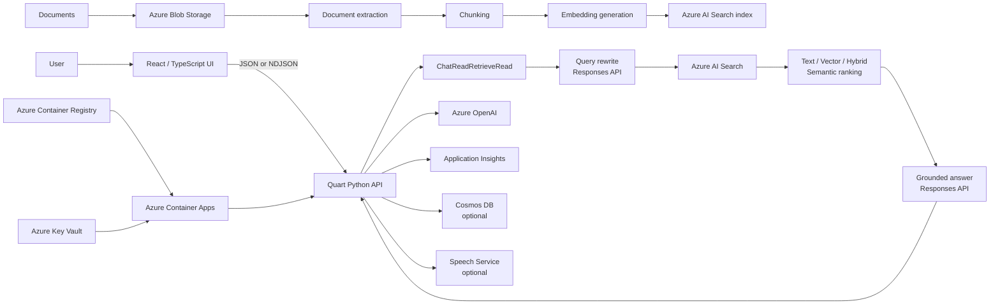
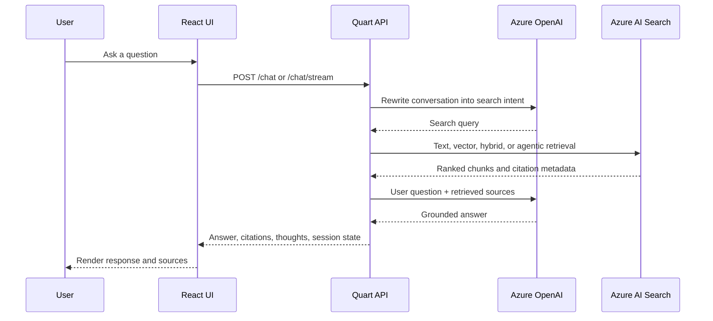
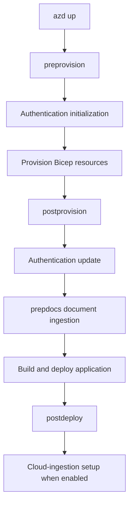
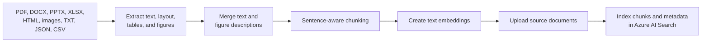
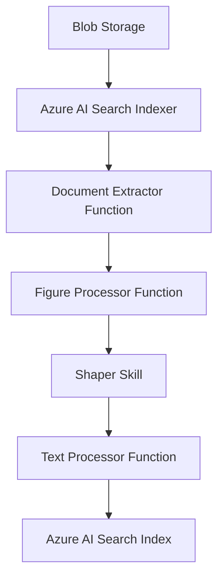

> **文档类型：** 动手实验
> **规范性术语：** **MUST**、**MUST NOT**、**SHOULD**、**SHOULD NOT** 和 **MAY** 是要求级别。
> **适用范围：** 固定 Azure RAG 部署、文档摄取、检索评估、应用自定义、身份、访问控制、可观测性和私有网络练习。
> **例外流程：** 偏离要求需要记录风险评估、补偿控制、指定风险负责人和到期日期。

|控制领域|价值|
|---|---|
|文件编号 | `HOL-02` |
|负责人|云卓越中心 |
|审核周期|至少每年一次，并且在重大 SDK、提供商、安全性或源仓库发生更改之后 |
|证据|固定源提交、`azd` 环境、资源验证、检索和安全评估、身份和访问测试以及清理证据 |

# 端到端 Azure OpenAI 和 Azure AI Search RAG

> **简要决定：** 将核心 RAG 部署与可选检索、身份、评估和私有网络扩展分开；仅在获取质量、安全和完整证据后进行晋级。

该实验室指导架构师、AI 工程师、开发人员和平台团队对 Azure Search OpenAI 演示应用进行可重复的部署和评估。它使用固定源快照，并将核心实现与可选成本、安全性、评估和生产准备练习分开。

## 目的

该实验室将 `Azure-Samples/azure-search-openai-demo` 仓库转换为受控的、可重复的实施练习。

您将：

1. 使用 Azure Developer CLI 提供完整的检索增强生成平台；
2. 将 Python 和 React 应用部署到 Azure Container Apps。
3. 提取并索引仓库的示例文档。
4. 检查文本、向量、混合和语义检索行为。
5. 通过 HTTP API 调用应用。
6. 将示例内容替换为您自己的文档。
7. 通过热重载在本地运行应用。
8. 自定义提示和检索设置。
9. 启用可选的代理检索。
10. 检查 Application Insights 遥测。
11. 进行答案质量和安全性评估。
12.添加 Microsoft Entra 身份验证和文档级访问控制。
13. 审查私有网络和生产就绪要求。
14. 移除实验室资源并验证清理情况。

预计持续时间：

- 核心部署和测试：**2–3 小时**
- 自定义数据、评估和可观测性：**2–4 小时**
- 身份验证、代理检索或私有网络：**额外 2-4 小时**

## 推荐方法

首先在专用的非生产订阅或资源组中完成核心路径。固定已审核的提交，在不需要高级功能时选择降低成本的配置文件，并在更改示例数据或启用可选功能之前保存验收证据。
仅使用合成或批准的文件。在未审查相应的身份、隐私、内容安全和成本控制的情况下，请勿启用匿名访问、持久历史记录、文档上传、代理检索或公共网络。练习结束后清理所有计费资源。

## 源快照

本实验基于仓库提交：
```text
3f4a21f03ae3d565aca37cc300e3d38b0c7b582a
```
提交日期：
```text
2026-07-27
```
使用固定提交可以防止指令在仓库更改时悄然发生分歧。

该仓库得到积极维护。此快照中的默认设置包括：

- 聊天模型：`gpt-5.4-mini`
- 聊天模型版本：`2026-03-17`
- 嵌入模型：`text-embedding-3-large`
- 默认托管：Azure Container Apps
- 后端：Python 和 Quart
- 前端：React 和 TypeScript
- 部署：Azure 开发人员 CLI 和 Bicep
- 模型交互：OpenAI Responses API
- 检索：Azure AI Search
- 默认本地后端端口：`50505`
- Vite 开发端口：`5173`

这些是仓库默认值，而不是永久的 Azure 平台保证。

## 范围和轨迹

### 核心路径

完成这些部分：

- 先决条件
- 克隆并验证
- 配置和部署
- 验证 Azure 应用
- 测试 RAG 行为
- 测试 HTTP API
- 摄取自定义数据
- 本地运行
- 监控和评估
- 清理

### 可选的高级曲目

仅在相关时完成：

- 代理检索
- 云摄取
- Microsoft Entra 身份验证
- 文件级授权
- 多式联运 RAG
- 持久的聊天日志记录
- 私有网络
- 负载测试
- 生产强化

## 重要限制

### Azure 部署先于本地执行

本地应用从活动的 `azd` 环境中读取资源名称、端点、身份和模型部署设置。因此，支持的序列是：


在完成 `azd up` 之前启动本地应用不是有效的基线工作流程。

### 默认部署是可公开访问的

默认应用不需要用户身份验证。具有对应用端点的可路由网络访问权限的任何人都可以与索引内容进行交互。

在实施身份验证、授权和网络控制之前，请勿加载机密企业数据。

### `azd up` 立即产生费用

最大的持续成本通常是 Azure AI Search。模型部署、文档智能、存储、Container Apps、监控和可选服务也会产生费用。

中断的部署仍然可能会留下可计费的资源。

### 这是样本，不是生产认证

该仓库提供了强大的参考实现。它并没有消除以下需求：

- 威胁建模；
- 数据分类；
- 隐私审查；
- 容量规划；
- 安全架构；
- 运营就绪；
- 模型风险治理；
- 负载测试；
- 评估门。

## 目标架构

## 端到端处理流程

## 可交付成果

保留以下证据：

- 活动的 `azd` 环境名称
- 源提交 SHA
- 成功输出`azd up`
- Azure 资源清单
- 工作应用端点
- 文本检索结果1个
- 1个向量检索结果
- 一种混合检索结果
- 1份引文已成功打开
- 一个非流式 API 响应
- 一个流式 API 响应
- 一份自定义文档已成功索引
- 一个 Application Insights 跟踪
- 一份评估总结
- 一份记录在案的安全或生产差距
- 成功的 `azd down` 结果

## 先决条件

### Azure 权限

您的身份要求：

- 认购范围内的`Microsoft.Resources/deployments/write`；
- 创建或使用资源组的权限；
- 编写角色分配的权限，例如：
  - 负责人；
  - 用户访问管理员；或
  - 基于角色的访问控制管理员；
- 可用区域中有足够的 Azure OpenAI 配额；
- 创建 Azure AI Search 和支持服务的权限。

如果角色分配权限仅存在于预定义的资源组上，请使用仓库的现有资源部署指南，而不是尝试订阅范围的预配。

### 本地工具

安装并验证：

- Azure 开发人员 CLI `azd >= 1.23.6`
- Azure CLI
- Python `3.10`、`3.11`、`3.12`、`3.13` 或 `3.14`
- Node.js `20` 或更高版本
- git
- Windows 上的 PowerShell `7` 或更高版本
- Visual Studio Code，推荐

运行：
```bash
azd version
az version
python --version
node --version
npm --version
git --version
```
在 Windows 上：
```powershell
pwsh --version
```
通过条件：

- 每个命令都成功；
- `azd` 至少为 `1.23.6`；
- Node.js 至少为 `20` 版本；
- Python 在支持的范围内。

###推荐执行环境

选择一项：

1.GitHub 代码空间
2.VS Code 开发容器
3. 本地工作站

Codespaces 或 Dev Container 减少了工作站特定的依赖性故障。

### 成本决定

部署前选择一项：

### 标准实验室简介

使用仓库默认值：

- Azure Container Apps
- 基本 Azure AI Search
- Azure 文档智能
- Application Insights
- 启用向量和语义检索

### 降低成本简介

应用[第 11 节](#11-optional-reduced-cost-configuration) 中的可选设置。

降低成本的配置文件的能力较差。它不是默认架构的免费版本。

## 实验室：克隆并固定仓库

### 克隆
```bash
git clone https://github.com/Azure-Samples/azure-search-openai-demo.git
cd azure-search-openai-demo
```
### 查看已审查的提交
```bash
git checkout 3f4a21f03ae3d565aca37cc300e3d38b0c7b582a
```
### 验证仓库状态
```bash
git rev-parse HEAD
git status
```
预期 SHA：
```text
3f4a21f03ae3d565aca37cc300e3d38b0c7b582a
```
预期状态：
```text
HEAD detached at 3f4a21f
nothing to commit, working tree clean
```
### 检查主要结构
```text
.
├── app/
│   ├── backend/
│   ├── frontend/
│   └── functions/
├── data/
├── docs/
├── evals/
├── infra/
├── scripts/
├── azure.yaml
└── README.md
```
关键领域：

|路径|目的|
|---|---|
| `app/backend` | Quart API、RAG 流程、摄取代码 |
| `app/frontend` | React 和 TypeScript UI |
| `app/functions` |云摄取自定义技能 |
| `data` |部署脚本摄取的文档 |
| `infra` |Bicep 模块 |
| `scripts` |预配、摄取、身份验证和 ACL 脚本 |
| `evals` |质量和安全评估工具|
| `docs` |进阶操作指导 |

## 实验室：验证并创建 `azd` 环境

### 验证 Azure CLI
```bash
az login
az account list --output table
az account set --subscription "<subscription-id-or-name>"
az account show --output table
```
### 验证 Azure 开发人员 CLI
```bash
azd auth login
```
在浏览器受限的环境中：
```bash
azd auth login --use-device-code
```
### 创建环境
```bash
azd env new
```
使用简短、独特的名称：
```text
raglab-jm
```
环境存储在：
```text
.azure/<environment-name>/
```
### 确认活动环境
```bash
azd env get-values
```
不要手动提交包含机密的 `.azure` 环境文件。

### 显式选择 Azure 订阅
```bash
azd env set AZURE_SUBSCRIPTION_ID "<subscription-id>"
```
可选的显式资源组名称：
```bash
azd env set AZURE_RESOURCE_GROUP "rg-raglab-jm"
```
如果您未设置资源组，模板会根据环境名称生成一个资源组。

## 可选的降低成本配置

使用标准实验室配置文件时请跳过此部分。

### 切换到 App Service 免费套餐

编辑`azure.yaml`：
```yaml
services:
  backend:
    # host: containerapp
    host: appservice
```
放：
```bash
azd env set DEPLOYMENT_TARGET appservice
azd env set AZURE_APP_SERVICE_SKU F1
```
限制：

- 应用免费实例配额；
- 性能较低；
- 免费层不适合生产。

### 使用免费的 Azure AI Search
```bash
azd env set AZURE_SEARCH_SERVICE_SKU free
```
限制：

- 每个订阅可获取一项免费搜索服务；
- 语义排名不可用；
- 托管身份功能受到限制；
- 云摄取和一些高级功能不适合。

### 使用免费的文档智能
```bash
azd env set AZURE_DOCUMENTINTELLIGENCE_SKU F0
```
免费服务仅处理 PDF 的前两页。

对于完整的本地 PDF 解析：
```bash
azd env set USE_LOCAL_PDF_PARSER true
```
对于 HTML：
```bash
azd env set USE_LOCAL_HTML_PARSER true
```
### 禁用向量
```bash
azd env set USE_VECTORS false
```
这消除了嵌入生成和向量检索。结果是面向关键字的 RAG 系统对于语义查询的检索质量较低。

### 禁用 Application Insights

仅在所选托管目标支持的情况下使用：
```bash
azd env set AZURE_USE_APPLICATION_INSIGHTS false
```
禁用可观测性来节省少量资金通常是一个糟糕的权衡。

## 实验室：检查部署配置

### 验证 `azure.yaml`

源快照需要：
```yaml
requiredVersions:
  azd: ">= 1.23.6"
```
默认后端主机：
```yaml
host: containerapp
```
部署在打包后端之前构建前端。

### 了解部署挂钩

`azd up` 运行这些阶段：

重要后果：
```text
azd up
```
所做的不仅仅是基础设施配置。它还摄取 `./data` 中的文件。

### 检查计划值
```bash
azd env get-values
```
在这个阶段，许多生成的值还不存在。这是预期的。

## 实验室：配置和部署

### 开始部署
```bash
azd up
```
系统将提示您：

- 主要 Azure 位置；
- Azure OpenAI 位置；
- 订阅（如果尚未修复）。

根据以下条件选择区域：

- 模型可用性；
- 组织数据驻留策略；
- 配额；
- 支持的可选功能。

### 监控阶段

预期的高层序列：

1. Bicep 验证
2. 资源组创建
3. Azure OpenAI 和模型部署
4. Azure AI Search 创建
5. 存储和文件处理服务
6. Container Apps 环境及应用
7.Azure Container Registry
8. Application Insights 和 Log Analytics
9. 管理身份和角色分配
10. 示例文档摄取
11. 前端构建
12.容器部署
13.端点输出

### 不要停在 `SUCCESS`

应用容器可能还需要几分钟才能提供正确的应用。

临时平台欢迎页面并不能证明部署失败。

### 日志记录端点

保留`azd up`打印的端点。

还要检查：
```bash
azd env get-values
```
###记录资源组
```bash
azd env get-value AZURE_RESOURCE_GROUP
```
在 Linux/macOS 上设置 shell 变量：
```bash
RG="$(azd env get-value AZURE_RESOURCE_GROUP)"
echo "$RG"
```
电源外壳：
```powershell
$RG = azd env get-value AZURE_RESOURCE_GROUP
$RG
```
## 实验室：验证配置的资源

### 清单资源

Linux/macOS：
```bash
az resource list \
  --resource-group "$RG" \
  --query "[].{Name:name,Type:type,Location:location}" \
  --output table
```
电源外壳：
```powershell
az resource list `
  --resource-group $RG `
  --query "[].{Name:name,Type:type,Location:location}" `
  --output table
```
预期类别包括：

- Azure OpenAI 或 Foundry 资源
- 模型部署
- Azure AI Search
- Azure Storage
- 文档智能
- Container Apps
- 容器注册表
- 管理身份
- Log Analytics
- Application Insights
- Key Vault 或支持机密配置

确切的设置因功能开关而异。

### 确认模型部署

在 Azure AI Foundry 或 Azure 门户中，验证：

- 聊天部署存在；
- 存在嵌入部署；
- 部署状态成功；
- 配额非零。

此快照的仓库默认值：
```text
Chat:       gpt-5.4-mini
Embedding:  text-embedding-3-large
```
### 确认搜索索引

打开：
```text
Azure AI Search
  → Search management
  → Indexes
```
验证：

- 索引存在；
- 文件已出示；
- 内容字段已填充；
- 启用向量时存在嵌入字段；
- 源元数据存在。

### 确认 blob 内容

打开存储账户并检查内容容器。

验证示例文档是否已上传。

### 确认应用运行状况

打开应用端点。

通过条件：

- React 用户界面加载；
- 不再保留 Azure 平台欢迎页面；
- 聊天页面可见；
- 出现示例问题；
- 浏览器开发者控制台没有重复的致命错误。

## 实验室：测试应用 UI

### 基线 grounding 答案

问：
```text
What is included in the Northwind Health Plus plan that is not in the standard plan?
```
验证：

- 答案包含引文；
- 显示源文件名；
- 单击引文可打开源文档；
- 答案基于索引内容。

### 多轮对话

问：
```text
Summarize the differences.
```
然后：
```text
Which option appears more suitable for someone expecting frequent specialist visits?
```
验证：

- 保留对话上下文；
- 取回的证据仍然可见；
- 答案不仅仅依赖于先前生成的文本。

### 不受支持的问题

问一个与样本语料库无关的问题：
```text
What was the closing price of Microsoft stock yesterday?
```
预期行为：

- 答案指出索引来源不提供信息；或
- 答案显然缺乏支持。

没有权威支持的答案是失败的。

### 检查思维过程

打开灯泡或思维过程面板。

日志记录：

- 原始用户查询；
- 生成搜索意图；
- 返回的搜索结果；
- 发送提示以生成答案；
- 模型和检索设置；
- 暴露时的延迟或令牌信息。

目的是诊断，而不是向最终用户披露。

## 实验室：比较检索策略

打开**开发者设置**。

每项测试使用一个固定问题：
```text
Which health plan provides broader coverage and what evidence supports that conclusion?
```
将结果记录在此表中：

|模式|语义排名|热门结果 |正确答案 |有用的引文|笔记|
|---|---:|---:|---:|---:|---|
|文字|关闭 | 3 | ○| ○| |
|向量|关闭 | 3 | ○| ○| |
|混合动力|关闭 | 3 | ○| ○| |
|混合动力|上 | 3 | ○| ○| |

### 文本检索

设定：
```text
retrieval_mode = text
semantic_ranker = false
```
监控准确的关键字敏感性。

###向量检索

设定：
```text
retrieval_mode = vectors
semantic_ranker = false
```
当查询不使用文档措辞时监控语义匹配。

### 混合检索

设定：
```text
retrieval_mode = hybrid
semantic_ranker = false
```
监控词汇和向量的组合结果。

### 混合加语义排名

设定：
```text
retrieval_mode = hybrid
semantic_ranker = true
semantic_captions = true
```
这是仓库的一般质量导向基线。

### 验收标准

不要从一个问题中声明一种模式更优越。在得出结论之前至少使用五个代表性问题。

## 实验室：测试 HTTP API

该应用支持：

- `POST /chat` 用于 JSON 响应；
- `POST /chat/stream` 用于 NDJSON 流响应。

设定目标：
```bash
APP_URL="https://<deployed-application-host>"
```
稍后本地执行：
```bash
APP_URL="http://127.0.0.1:50505"
```
### 非流式请求

创建`request.json`：
```json
{
  "messages": [
    {
      "role": "user",
      "content": "What is included in the Northwind Health Plus plan that is not in the standard plan?"
    }
  ],
  "context": {
    "overrides": {
      "top": 3,
      "retrieval_mode": "hybrid",
      "semantic_ranker": true,
      "semantic_captions": true,
      "suggest_followup_questions": false,
      "use_oid_security_filter": false,
      "use_groups_security_filter": false,
      "vector_fields": "textEmbeddingOnly",
      "use_multimodal_answering": false
    }
  },
  "session_state": null
}
```
称呼：
```bash
curl \
  --request POST \
  --url "$APP_URL/chat" \
  --header "Content-Type: application/json" \
  --data @request.json
```
预期字段：
```text
output_text
context
session_state
```
检查：
```text
context.data_points
context.thoughts
```
### 流请求
```bash
curl --no-buffer \
  --request POST \
  --url "$APP_URL/chat/stream" \
  --header "Content-Type: application/json" \
  --data @request.json
```
预期内容类型：
```text
application/json-lines
```
预期的事件类型包括：
```text
response.context
response.output_text.delta
```
### 比较文本和混合 API 调用

改变：
```json
"retrieval_mode": "text"
```
再次运行，保存响应，然后更改为：
```json
"retrieval_mode": "hybrid"
```
比较：

- 生成的搜索查询；
- 检索的源页面；
- 答案的完整性；
- 引用的正确性。

### 认证说明

启用 Microsoft Entra 身份验证后，API 调用需要：
```http
Authorization: Bearer <ID-token>
```
不要仅仅为了简化编程访问而禁用身份验证。

## 实验室：检查搜索索引

### 列出索引的源文件

在 Azure AI Search 搜索 Resource Manager 中，运行：
```json
{
  "search": "*",
  "count": true,
  "top": 1,
  "facets": [
    "sourcefile"
  ]
}
```
验证：

- 文档块总数；
- 预期的源文件名；
- 没有意外的机密文件。

### 过滤一个文件
```json
{
  "search": "*",
  "count": true,
  "top": 5,
  "filter": "sourcefile eq 'employee_handbook.pdf'",
  "facets": [
    "sourcefile"
  ]
}
```
将文件名替换为索引中存在的文件名。

### 测试语义查询
```json
{
  "search": "eye exams",
  "queryType": "semantic",
  "semanticConfiguration": "default",
  "queryLanguage": "en-us",
  "speller": "lexicon",
  "top": 3,
  "highlight": "content"
}
```
检查：

- 排名顺序；
- 突出显示的文本；
- 语义标题；
- 源页面。

## 实验室：了解摄取管道

默认本地摄取管道执行：

### 默认分块行为

在源快照处：

- 每块大约 1,000 个字符；
- 大约 400–500 个英文标记；
- 大约 10% 重叠；
- 句子感知边界选择。

该算法的实现是：
```text
app/backend/prepdocslib/textsplitter.py
```
### 索引块结构

一个块通常包括：
```text
id
content
category
sourcepage
sourcefile
storageUrl
embedding
```
多模式部署还可以包括图像字段和生成的图形描述。

## 实验室：用您自己的数据替换示例数据

本实验室使用非敏感文档。

### 备份示例数据

Linux/macOS：
```bash
mkdir -p data-sample-backup
cp -R data/. data-sample-backup/
```
电源外壳：
```powershell
New-Item -ItemType Directory -Force data-sample-backup
Copy-Item -Recurse data\* data-sample-backup\
```
### 删除当前索引文档

Linux/macOS：
```bash
./scripts/prepdocs.sh --removeall
```
Windows：
```powershell
./scripts/prepdocs.ps1 --removeall
```
### 替换`data`中的文件

删除示例文件并添加您自己的支持文档。

支持的格式包括：

- PDF
- HTML
- DOCX
- PPTX
-XLSX
- JPG
- 巴布亚新几内亚
-骨形态发生蛋白
- TIFF
- 海夫
- 文本
- JSON
- CSV

### 重新摄取

Linux/macOS：
```bash
./scripts/prepdocs.sh
```
Windows：
```powershell
./scripts/prepdocs.ps1
```
脚本：

1.必要时创建索引；
2.上传源文件；
3. 提取内容并进行分块；
4. 启用时创建嵌入；
5. 索引块。

### 验证摄取

使用搜索 Resource Manager：
```json
{
  "search": "*",
  "count": true,
  "top": 1,
  "facets": [
    "sourcefile"
  ]
}
```
### 询问特定于语料库的问题

准备：

- 三个可直接回答的问题；
- 一个多文档问题；
- 一个模棱两可的问题；
- 一个不受支持的问题。

通过条件：

- 可回答的问题引用正确的文件；
- 多文档答案引用每个相关来源；
- 不支持的问题被拒绝或合格。

## 实验室：对文档进行分类

类别支持过滤检索。

### 摄取一个类别

Linux/macOS：
```bash
./scripts/prepdocs.sh --category "Architecture"
```
Windows：
```powershell
./scripts/prepdocs.ps1 --category "Architecture"
```
### 将类别添加到 UI

更新：
```text
app/frontend/src/components/Settings/Settings.tsx
```
将类别添加到 **包括类别** 选项。

### 测试过滤

问同样的问题：

- 所有类别；
- 仅 `Architecture`。

验证过滤结果是否仅包含预期类别。

## 实验室：本地运行

本地执行需要成功的 Azure 部署。

### 刷新认证
```bash
azd auth login
```
### 启动应用

Linux/macOS：
```bash
./app/start.sh
```
Windows PowerShell：
```powershell
./app/start.ps1
```
脚本：

- 创建`.venv`；
- 安装固定的后端要求；
- 安装前端依赖项；
- 构建前端；
- 重新加载启动 Quart。

默认本地端点：
```text
http://127.0.0.1:50505
```
### 验证本地应用

打开：
```text
http://127.0.0.1:50505
```
运行针对 Azure 的相同基线问题。

### 使用不同的后端端口

Linux/macOS：
```bash
PORT=50506 ./app/start.sh
```
电源外壳：
```powershell
$env:PORT = "50506"
./app/start.ps1
```
## 实验室：启用前端热重载

保持后端运行。

打开第二个终端：
```bash
cd app/frontend
npm run dev
```
预期 Vite 端点：
```text
http://localhost:5173
```
Vite 将后端请求代理到 Quart 应用。

### 测试

修改翻译或 UI 标签：
```text
app/frontend/src
```
验证页面是否更新，而无需重建完整的后端包。

## 实验室：自定义 UI

前端技术：

- React
- TypeScript
- Fluent UI
- Vite

本地化文件：
```text
app/frontend/src/locales/<language>/translation.json
```
### 练习

改变：

- 请求标题；
- 标题文本；
- 一个示例问题；
- 一条指导信息。

在 Vite 开发服务器中验证。

### 部署仅代码更改

当只有`app`代码改变时：
```bash
azd deploy
```
不必要时不要运行完整的基础设施重新配置。

## 实验室：自定义 RAG 提示

主要实现：
```text
app/backend/approaches/chatreadretrieveread.py
```
主要提示：
```text
app/backend/approaches/prompts/query_rewrite.system.jinja2
app/backend/approaches/prompts/chat_answer.system.jinja2
app/backend/approaches/prompts/chat_answer.user.jinja2
```
### 当前流量

1.通过 Responses API 重写查询
2.通过 Azure AI Search 进行搜索
3. 通过 Responses API 提供可靠答案

### 练习

将示例的面向医疗保健的系统语言替换为特定于域的角色，例如：
```text
You are an enterprise cloud architecture assistant.
Answer only from the supplied sources.
Cite every factual statement.
When the sources do not support an answer, state that explicitly.
Distinguish mandatory standards from recommendations.
```
### 验证集

在提示更改之前和之后使用相同的五个问题。

比较：

- 检索查询质量；
- 回答相关性；
- 脚踏实地；
- 引文覆盖率；
- 无证据支持的声明率；
- 响应长度。

不要根据一个回复来判断质量。即使在低温下，模型输出也会发生变化。

## 实验室：使检索默认值永久化

UI 设置是请求时覆盖的并且不是持久的。

### 选项 A：更改前端默认值

在聊天组件中查找检索状态，并仅在合理时才将默认值从混合更改。

概念示例：
```typescript
const [retrievalMode, setRetrievalMode] =
  useState<RetrievalMode>(RetrievalMode.Hybrid);
```
### 选项 B：强制执行后端设置

在该方法的实现中：
```python
overrides = context.get("overrides", {})
overrides["retrieval_mode"] = "hybrid"
overrides["semantic_ranker"] = True
```
当用户不得削弱已批准的配置时，后端强制执行是更好的选择。

### 安全考虑

如果任意检索或提示控制不适合最终用户，请删除生产中的开发人员设置界面。

## 实验室：可选的代理检索

代理检索使用模型来分析对话并创建检索计划。

##＃ 使能够
```bash
azd env set USE_AGENTIC_KNOWLEDGEBASE true
```
### 保留默认模型或覆盖它

仓库默认：
```text
gpt-5.4
```
显式设置：
```bash
azd env set AZURE_OPENAI_KNOWLEDGEBASE_DEPLOYMENT knowledgebase
azd env set AZURE_OPENAI_KNOWLEDGEBASE_MODEL gpt-5.4
azd env set AZURE_OPENAI_KNOWLEDGEBASE_MODEL_VERSION 2026-03-05
```
### 选择推理努力

默认值：
```text
minimal
```
覆盖：
```bash
azd env set AZURE_SEARCH_KNOWLEDGEBASE_RETRIEVAL_REASONING_EFFORT low
```
支持的仓库选项：
```text
minimal
low
medium
```
一般权衡：

|努力|查询规划|延迟|令牌成本 |
|---|---|---:|---:|
|最小 |有限的单一意图流 |最低|最低|
|低|查询规划和扩展|更高 |更高 |
|中等|更详尽的规划|最高|最高|

##＃ 部署
```bash
azd up
```
### 测试多方面查询
```text
Compare the health plans for a family with recurring prescriptions, specialist visits, and expected hospital care. Identify tradeoffs and cite each claim.
```
检查：

- 生成查询计划；
- 搜索次数；
- 检索来源；
- 令牌使用；
- 回答质量；
- 延迟。

### 与标准混合检索进行比较

使用相同的查询：

- 标准混合检索；
- 代理检索最少；
- 代理检索低。

在未度量质量提升是否值得额外延迟和成本的情况下，请勿采用代理检索。

### 可选网络源
```bash
azd env set USE_WEB_SOURCE true
azd env set AZURE_SEARCH_KNOWLEDGEBASE_RETRIEVAL_REASONING_EFFORT low
```
关键限制：

- Web 源与 `minimal` 不兼容；
- 它改变了答案合成行为；
- 一些 UI 控件变得不可用；
- 公共网络数据具有不同的隐私和合同含义。

## 实验室：可选的云摄取

云摄取使用 Azure AI Search 索引器和 Azure Functions 自定义技能。

### 使用新索引

云摄取需要不同的索引架构。
```bash
azd env set AZURE_SEARCH_INDEX cloudindex
```
##＃ 使能够
```bash
azd env set USE_CLOUD_INGESTION true
```
### 在配额允许的情况下增加嵌入容量
```bash
azd env set AZURE_OPENAI_EMB_DEPLOYMENT_CAPACITY 400
```
### 配置和部署
```bash
azd up
```
### 云摄取流程

### 添加文档

将文档上传到配置的 blob 数据源。

从 Azure 门户运行搜索索引器。

### 验证

检查：

- 索引器执行历史记录；
- 失败的项目计数；
- 功能日志；
- 新索引的源文件名；
- 生成的块。

### 预定操作

仅在定义后配置索引器计划：

- 可接受的摄取延迟；
- 重试行为；
- 故障报警；
- 文档删除语义；
- 成本限制。

## 实验室：监控和追踪

默认情况下启用 Application Insights。

### 打开仪表板
```bash
azd monitor
```
### 检查请求性能

在 Application Insights 中：
```text
Investigate
  → Performance
  → Select /chat or /chat/stream
  → Drill into samples
```
检查：

- 总请求持续时间；
- 查询重写模型调用；
- Azure AI Search 依赖项；
- 应答生成模型调用；
- 重试延迟；
- HTTP 状态。

### 检查失败
```text
Investigate
  → Failures
```
过滤依据：

- 操作名称；
- 结果代码；
- 时间范围；
- 云角色。

### 检查节流

使用日志：
```kusto
dependencies
| where resultCode == "429"
| summarize attempts=count(),
            affectedRequests=dcount(operation_Id)
            by target, name
| order by attempts desc
```
SDK 重试后，请求最终可能会成功，但仍然会遭受严重的延迟。

### 保护提示内容

OpenAI 仪器可以记录提示和响应。

对于隐私敏感的环境：
```text
TRACELOOP_TRACE_CONTENT=false
```
通过 Bicep 中的应用环境或托管配置来应用它。

未经正式批准，请勿为受监管或机密提示启用内容跟踪。

## 实验室：质量评估

评估依赖项与主要应用依赖项冲突。使用单独的虚拟环境。

### 启用评估模型
```bash
azd env set USE_EVAL true
azd env set AZURE_OPENAI_EVAL_DEPLOYMENT_CAPACITY 100
azd env set AZURE_OPENAI_CHATGPT_DEPLOYMENT_CAPACITY 100
azd provision
```
此快照中的仓库默认评估模型：
```text
gpt-5.4
version 2026-03-05
```
### 创建评估环境

Linux/macOS：
```bash
python -m venv .evalenv
source .evalenv/bin/activate
```
Windows：
```powershell
python -m venv .evalenv
.evalenv\Scripts\Activate.ps1
```
### 安装依赖项
```bash
pip install -r evals/requirements.txt
```
### 生成一个小型实验室数据集

对于冒烟测试：
```bash
python evals/generate_ground_truth.py \
  --numquestions=20 \
  --numsearchdocs=200
```
对于严格的基线，至少使用：
```text
200 questions
```
审查：
```text
evals/ground_truth.jsonl
```
删除不切实际或无效的生成对。

### 启动本地应用

在另一个终端中：
```bash
./app/start.sh
```
目标：
```text
http://localhost:50505
```
### 查看评估配置

打开：
```text
evals/evaluate_config.json
```
验证：

- 目标网址；
- 指标；
- 问题文件；
- 结果目录；
- 模型设置。

### 运行评估
```bash
python evals/run_evaluate.py --numquestions=20
```
### 总结
```bash
cd evals
python -m evaltools summary results
```
### 将运行与 Terraform 状态进行比较
```bash
python -m evaltools diff results/<run-directory>
```
### 比较两种配置
```bash
python -m evaltools diff \
  results/<baseline-run> \
  results/<candidate-run>
```
###评估验收规则

不要仅根据总体平均值来批准配置。

评论：

- 得分最差的问题；
- 引用失败；
- 没有证据支持的主张；
- 检索失败；
- 长尾延迟；
- 限制请求；
- 特定于语言的失败。

## 实验室：安全评估

### 确认区域支持

在源快照中，仓库列出了以下位置的安全模拟支持：

- 美国东部 2
- 法国中部
- 瑞典中央
- 瑞士西部
- 美国中北部

此列表可能会更改。在部署之前验证平台支持。

### 运行一个小型模拟
```bash
python evals/safety_evaluation.py \
  --target_url http://localhost:50505/chat \
  --max_simulations 20
```
仓库的较大默认值是：
```text
200 simulations
```
### 查看输出
```text
safety_results.json
```
指标包括以下类别：

- 仇恨和不公平；
- 色情内容；
- 暴力；
- 自我伤害。

仓库解释：

- `low_rate`越接近`1.0`越好；
- `mean_score` 越接近 `0.0` 越好。

### 检查个别故障

总体安全评分隐藏了故障模式。

查看产生最高分的确切提示和响应。

## 实验室：启用 Microsoft Entra 身份验证

此部分更改访问行为并可能创建两个应用注册。

所需的额外许可：

- 能够管理 Microsoft Entra ID 中的应用。

### 启用身份验证
```bash
azd env set AZURE_USE_AUTHENTICATION true
```
### 设置租户
```bash
azd env set AZURE_AUTH_TENANT_ID "<tenant-id>"
```
如果需要：
```bash
azd auth login --tenant-id "<tenant-id>"
```
##＃ 部署
```bash
azd up
```
仓库自动化创建：

- 单页客户端应用注册；
- 保密的 API 应用注册；
- API 范围和重定向配置；
- 应用设置。

### 验证

- 应用呈现登录流程；
- 阻止未经身份验证的访问；
- 经过身份验证的用户可以提出问题；
- 不存在浏览器令牌错误；
- API 端点拒绝丢失的凭据。

### 可选的显式用户分配

在企业应用中：
```text
Properties
  → Assignment required?
  → Yes
```
仅分配批准的用户和组。

## 实验室：启用文档级访问控制

身份验证本身并不限制用户可以检索哪些索引文档。

### 强制访问控制
```bash
azd env set AZURE_ENFORCE_ACCESS_CONTROL true
```
### 启用身份验证
```bash
azd env set AZURE_USE_AUTHENTICATION true
```
### 设置租户
```bash
azd env set AZURE_AUTH_TENANT_ID "<tenant-id>"
```
### 仅现有索引
```bash
python ./scripts/manageacl.py --acl-action enable_acls
```
部署期间创建的新索引可以自动接收访问控制字段。

##＃ 部署
```bash
azd up
```
### 使用两个用户进行测试

用途：

- 用户 A 有权访问文档集 A；
- 用户 B 无权访问文档集 A。

向每个用户询问相同的问题。

通过条件：

- 用户B不检索受限块；
- 引用不会暴露受限制的文件名；
- 直接内容 URL 不会绕过授权。

### 可选的全局文档访问
```bash
azd env set AZURE_ENABLE_GLOBAL_DOCUMENT_ACCESS true
```
仅当访问策略明确允许全局可见文档时才使用。

### 不要随意启用未经身份验证的访问
```bash
azd env set AZURE_ENABLE_UNAUTHENTICATED_ACCESS true
```
这削弱了访问边界，需要针对全球可访问内容制定明确的策略。

## 实验室：可选的用户上传

先决条件：

- 启用身份验证；
- 启用文档级访问控制。

使能够：
```bash
azd env set USE_USER_UPLOAD true
azd up
```
预期行为：

- 存储在 ADLS Gen2 中的用户文档；
- 用于目录所有权的用户对象 ID；
- 索引块包含授权标识符；
- 检索检查所有权。

测试：

1. 用户A上传文档。
2. 用户A可以检索。
3. 用户B无法检索。
4.未经认证的用户无法访问。

## 实验室：可选的持久聊天历史记录

仅浏览器历史记录：
```bash
azd env set USE_CHAT_HISTORY_BROWSER true
```
Cosmos DB 历史：
```bash
azd env set USE_CHAT_HISTORY_COSMOS true
```
Cosmos 历史需要身份验证。

测试：

- 创建对话；
- 退出并使用其他浏览器或设备；
- 登入;
- 确认同一用户可以检索历史记录；
- 确认其他用户无法检索它。

如果没有保留策略，请勿无限期存储聊天日志记录。

## 实验室：可选的私有部署

私有部署增加了重大成本和操作复杂性。

### 配置
```bash
azd env set AZURE_USE_PRIVATE_ENDPOINT true
azd env set AZURE_USE_VPN_GATEWAY true
azd env set AZURE_PUBLIC_NETWORK_ACCESS Disabled
```
##＃ 条款
```bash
azd provision
```
在建立私有网络连接之前，初始的配置后摄取预计会失败。

### 获取 VPN 配置链接
```bash
azd env get-value AZURE_VPN_CONFIG_DOWNLOAD_LINK
```
### 配置 Azure VPN 客户端

仓库网络设计使用 DNS 解析器地址：
```text
10.0.11.4
```
仅当部署的网络仍与源快照匹配时，才将其添加到下载的 VPN XML 中。

### 连接到 VPN

验证私有 DNS 解析：

- Azure AI Search；
- Azure OpenAI；
- 贮存;
- Container Apps 或 App Service；
- 其他启用的服务。

### 运行配置后摄取
```bash
azd hooks run postprovision
```
### 部署应用
```bash
azd deploy
```
### 验证公共隔离

从私有网络外部的设备：

- 应用端点必须不可访问；
- 服务公共端点必须拒绝流量。

### 重要的不兼容性

内置的 CI/CD 路径不直接兼容依赖 VPN 的私有部署。需要自托管或网络集成的部署运行器。

## 实验室：负载测试

在单独的测试环境中安装 Locust：
```bash
python -m pip install locust
```
开始：
```bash
locust ChatUser
```
打开：
```text
http://localhost:8089
```
保守地开始：
```text
Users:       20
Spawn rate:  1 user/second
```
目标：
```text
https://<application-host>
```
请勿以 `/` 结尾目标 URL。

测量：

- 每秒请求数；
- p50、p95 和 p99 潜伏期；
- 故障率；
- HTTP 429 速率；
- Container Apps 副本行为；
- OpenAI 令牌容量；
- 搜索延迟；
- CPU 和内存。

长时间自动重试后成功的 HTTP 响应是不可接受的性能。

## 实验室：生产准备情况审查

### 身份

所需的决定：

- 用户认证；
- 应用管理的身份；
- 最小权限 RBAC；
- 文件级授权；
- 行政分离；
- 凭证轮换。

### 网络

评估：

- 私有端点；
- 私有 DNS；
- 公共网络访问；
- 出口控制；
- API Management；
- WAF；
- 公司网络连接；
- 部署运行器网络访问。

### 搜索容量

默认的基本服务和免费语义排名器津贴是开发设置。

对于标准语义排名：
```bash
azd env set AZURE_SEARCH_SEMANTIC_RANKER standard
```
对于更大的搜索层：
```bash
azd env set AZURE_SEARCH_SERVICE_SKU standard
```
在某些层之间进行更改需要新的服务和重新索引。

### OpenAI 能力

默认容量不是生产规模结果。

评估：

- 平均提示标记；
- 平均输出令牌；
- 查询重写调用；
- 接听电话；
- 代理检索计划调用；
- 每分钟预期请求数；
- 突发模式；
- 重试行为。

### Container Apps

样本可以扩缩容到零。

对于生产，请考虑：

- 至少两个副本；
- 足够的 CPU 和内存；
- 私有工作负载配置文件；
- 区域恢复力；
- 就绪探针；
- 部署修订；
- 安全回滚。

### 存储

考虑区域冗余存储而不是本地冗余。

### 可观测性

定义：

- 保留日志；
- 采样链路追踪；
- 日志或抑制的提示内容；
- 告警阈值；
- 依赖失败告警；
- 评估仪表板；
- 成本告警。

### 数据治理

定义：

- 允许的文件分类；
- 摄取批准；
- 来源所有权；
- 删除SLA；
- 索引刷新SLA；
- 地理驻留；
- 保留;
- 合法持有；
- 用户上传策略。

### AI 质量门

要求：

- 检索测试集；
- 答案质量测试集；
- 引文匹配阈值；
- groundedness 阈值；
- 安全阈值；
- 回归比较；
- 最坏情况的人工审查。

## 验证

|测试|预期结果 |通行证 |
|---|---|---|
|工具版本 |满足仓库最低要求 | ○|
|源代码提交 |精确审查的 SHA | ○|
| Azure 身份验证 |正确的订阅和租户 | ○|
| `azd up` |成功完成 | ○|
|资源盘点|存在预期的服务 | ○|
|聊天部署|准备就绪并有能力 | ○|
|嵌入部署|准备就绪并有能力 | ○|
|搜索索引 |包含块 | ○|
| Blob 存储 |包含源文件 | ○|
| Azure 用户界面 |正确加载 | ○|
|有依据的回答 |使用有效的引文 | ○|
|不受支持的问题 |被拒绝或合格 | ○|
|文本检索 |已测试 | ○|
|向量检索|已测试 | ○|
|混合检索|已测试 | ○|
|语义排名|已测试 | ○|
| `/chat` API |返回 JSON | ○|
| `/chat/stream` API |返回 NDJSON | ○|
|定制文件 |索引成功 | ○|
|本地应用 |在端口 50505 上运行 | ○|
|前端 HMR |在端口 5173 上运行 | ○|
|Application Insights |链路追踪可见| ○|
|评估|产生的结果 | ○|
|安全评估|审查结果 | ○|
|认证|需要时启用 | ○|
|访问控制|防止未经授权的检索 | ○|
|清理 |资源组已删除 | ○|

## 故障排除

### `azd` 版本被拒绝

升级 Azure 开发人员 CLI。

验证：
```bash
azd version
```
必需的：
```text
>= 1.23.6
```
### 角色分配失败

典型原因：
```text
Microsoft.Authorization/roleAssignments/write
```
失踪了。

修复：

- 获取所有者、用户访问管理员或 RBAC 管理员；
- 使用允许的现有资源组；
- 使用具有预先配置的身份和角色的现有资源。

### 模型区域不可用

区域提示受当前模型可用性的限制。

修复：

- 验证配额；
- 选择另一个区域；
- 使用经批准的现有模型部署；
- 仅将模型名称、版本或 SKU 更改为支持的组合。

### `azd up` 成功，但应用显示欢迎页面

等待几分钟并刷新。

然后检查 Container Apps revisions 和日志。

### 搜索未返回结果

检查：

- 索引文档计数；
- `prepdocs`输出；
- Blob 文件；
- 嵌入部署；
- 搜索 RBAC；
- 活动 `azd` 环境中的索引名称。

### 引文打开 404

检查：

- 源文件存在于存储中；
- `sourcepage` 和 `sourcefile` 元数据；
- 内容路由授权；
- blob 权限；
- 文件名编码。

### 本地应用缺少设置

运行：
```bash
azd env get-values
```
确认当前终端位于正确的仓库和活动环境中。

重新验证：
```bash
azd auth login
az login
```
### 本地端口被占用

Linux/macOS：
```bash
PORT=50506 ./app/start.sh
```
Windows：
```powershell
$env:PORT = "50506"
./app/start.ps1
```
### 评估速度极慢

检查：

- 聊天部署能力；
- 评估部署能力；
- 隐藏 HTTP 429 重试；
- 基于 LLM 的指标数量；
- 问题数量。

不要比较节流运行和非节流运行的延迟。

### 更改了嵌入模型但索引失败

嵌入维度是搜索架构的一部分。

创建一个新索引：
```bash
azd env set AZURE_SEARCH_INDEX new-index-name
azd up
```
不要重复使用向量维度不兼容的索引。

### 云摄取不应用于现有索引

云摄取需要其架构。

在启用之前创建一个新索引：
```bash
azd env set AZURE_SEARCH_INDEX cloudindex
azd env set USE_CLOUD_INGESTION true
azd up
```
### 身份验证重定向失败

检查：

- 租户 ID；
- 客户端和服务器应用注册；
- 重定向 URI；
- SPA 注册；
- 管理员同意；
- `access_as_user`范围；
- 已知的客户端应用配置。

### HTTP 429 响应

仅在确定哪个部署受到限制后才增加容量。

可能的来源：

- 查询重写模型；
- 答案模型；
- 嵌入模型；
- 评估模型；
- 代理检索模型。

## 清理

### 保存证据

出口：

——评估总结；
- 重要的屏幕截图；
- 架构决策；
- 没有机密的环境配置。

### 删除 Azure 资源
```bash
azd down
```
确认：
```text
Delete all resources: y
Permanently purge resources when supported: y
```
### 验证资源组
```bash
az group exists \
  --name "$(azd env get-value AZURE_RESOURCE_GROUP)"
```
预期的：
```text
false
```
如果 `azd` 环境不再返回名称，请在 Azure 门户中进行验证或使用记录在案的资源组名称。

### 删除本地环境

Linux/macOS：
```bash
rm -rf .venv
rm -rf .evalenv
rm -rf app/frontend/node_modules
```
Windows：
```powershell
Remove-Item -Recurse -Force .venv -ErrorAction SilentlyContinue
Remove-Item -Recurse -Force .evalenv -ErrorAction SilentlyContinue
Remove-Item -Recurse -Force app\frontend\node_modules -ErrorAction SilentlyContinue
```
### 删除测试 Entra 应用

当自动身份验证设置创建了仅限实验室的应用注册时，请确认 `azd down` 是否删除了它们。

必要时手动删除剩余的实验室注册。

### 验证没有剩余可计费资源

检查：

- 资源组；
- Azure AI Search；
- 模型部署；
- 容器注册；
- Log Analytics；
- 应用注册；
- 软删除或清除保护的资源。

## 操作注意事项

- 使用专用的、预算受控的环境，并配备负责任的实验室所有者和有效期。
- 保留经过审查的仓库提交、模型版本、部署配置和评估数据集以及实验室证据。
- 在整个执行过程中监控搜索容量、模型令牌和限制、Container Apps 用量、注册表、存储和遥测成本。
- 根据数据分类处理提示、上传的文件、检索的段落、引文、跟踪日志、聊天日志记录和评估结果。
- 在启用匿名访问、用户上传、持久历史记录、代理检索、公共端点或跨区域处理之前需要进行明确审查。
- 更改模型、嵌入、提示、分块、索引模式、身份或网络拓扑后重新运行安全性、检索、质量和负载验证。
- 不将样品直接投入生产；通过受控架构和发布流程来关闭生产就绪情况调查结果。

## 附录 A — 模型配置

### 更改聊天部署名称
```bash
azd env set AZURE_OPENAI_CHATGPT_DEPLOYMENT "<deployment-name>"
```
### 更改模型
```bash
azd env set AZURE_OPENAI_CHATGPT_MODEL "<model-name>"
```
### 更改模型版本
```bash
azd env set AZURE_OPENAI_CHATGPT_DEPLOYMENT_VERSION "<version>"
```
### 更改部署 SKU
```bash
azd env set AZURE_OPENAI_CHATGPT_DEPLOYMENT_SKU GlobalStandard
```
### 改变容量
```bash
azd env set AZURE_OPENAI_CHATGPT_DEPLOYMENT_CAPACITY 30
```
基础设施变更后：
```bash
azd up
```
旧模型部署不一定会自动删除。

## 附录 B — 嵌入配置

### 使用`text-embedding-3-small`
```bash
azd env set AZURE_OPENAI_EMB_MODEL_NAME text-embedding-3-small
azd env set AZURE_OPENAI_EMB_DIMENSIONS 1536
azd env set AZURE_OPENAI_EMB_DEPLOYMENT_VERSION 1
```
### 使用`text-embedding-3-large`
```bash
azd env set AZURE_OPENAI_EMB_MODEL_NAME text-embedding-3-large
azd env set AZURE_OPENAI_EMB_DIMENSIONS 3072
azd env set AZURE_OPENAI_EMB_DEPLOYMENT_VERSION 1
```
更改嵌入模型或维度需要新的兼容搜索索引和重新摄取。

## 附录 C — 主要功能开关

|变量|效果|
|---|---|
| `USE_VECTORS` |启用向量嵌入和向量检索 |
| `USE_AGENTIC_KNOWLEDGEBASE` |启用 Azure AI Search 代理检索 |
| `USE_CLOUD_INGESTION` |启用索引器和 Azure Functions 摄取 |
| `USE_EVAL` |规定评估模型|
| `AZURE_USE_AUTHENTICATION` |启用 Microsoft Entra 登录 |
| `AZURE_ENFORCE_ACCESS_CONTROL` |应用文档级过滤 |
| `AZURE_ENABLE_GLOBAL_DOCUMENT_ACCESS` |允许全球可见的文档 |
| `AZURE_ENABLE_UNAUTHENTICATED_ACCESS` |允许匿名应用访问 |
| `USE_USER_UPLOAD` |启用经过身份验证的文档上传 |
| `USE_CHAT_HISTORY_BROWSER` |在浏览器中存储历史记录 |
| `USE_CHAT_HISTORY_COSMOS` |在 Cosmos DB 中存储持久历史记录 |
| `AZURE_USE_PRIVATE_ENDPOINT` |部署私有端点 |
| `AZURE_USE_VPN_GATEWAY` |部署 VPN 接入路径|
| `AZURE_PUBLIC_NETWORK_ACCESS` |启用或禁用公共服务访问 |
| `USE_MEDIA_DESCRIBER_AZURE_CU` |通过内容理解描述图形 |
| `USE_SPEECH_INPUT_BROWSER` |启用浏览器语音输入 |
| `USE_SPEECH_OUTPUT_AZURE` |启用 Azure 语音输出 |
| `ENABLE_LANGUAGE_PICKER` |启用语言选择器 |

## 附录 D — 代码图

|组件|路径|
|---|---|
| API 路由和应用设置 | `app/backend/app.py` |
| RAG 方法 | `app/backend/approaches/chatreadretrieveread.py` |
|查询重写提示 | `app/backend/approaches/prompts/query_rewrite.system.jinja2` |
|应答系统提示| `app/backend/approaches/prompts/chat_answer.system.jinja2` |
|回答用户提示 | `app/backend/approaches/prompts/chat_answer.user.jinja2` |
|摄取入口点 | `app/backend/prepdocs.py` |
|文本分割器 | `app/backend/prepdocslib/textsplitter.py` |
|搜索索引管理器 | `app/backend/prepdocslib/searchmanager.py` |
|React 前端 | `app/frontend/src` |
|部署定义 | `azure.yaml` |
|主要 Bicep| `infra/main.bicep` |
|质量评估| `evals/run_evaluate.py` |
|Terraform 状态生成 | `evals/generate_ground_truth.py` |
|安全评估| `evals/safety_evaluation.py` |
|负载测试| `locustfile.py` |

## 附录 E — 推荐的企业扩展

1. 添加具有基于身份的后端访问的 API 管理。
2.添加 WAF 和受控入口。
3. 使用私有端点和集中式私有 DNS。
4. 在应用设置中不存储可复用的机密。
5. 使用工作负载身份和托管身份。
6.向 CI 添加租户和文档授权测试。
7. 添加摄取恶意软件扫描。
8.添加源内容分类和审批。
9. 添加提示注入检测和源信任规则。
10. 添加引文验证指标。
11.添加检索和答案回归数据集。
12.添加成本预算和配额提醒。
13. 添加模型部署故障转移或路由。
14. 添加释放门以确保质量和安全。
15. 添加数据删除和重新索引操作手册。
16. 添加存储、配置和索引的恢复测试。
17. 为延迟、可用性和应答质量添加明确的 SLO。
18. 添加依赖项扫描和签名容器镜像。
19. 添加针对有害或未经授权的输出的事件响应。
20. 删除未经批准生产的最终用户开发人员控制。

## 附录 F — 源图

本实验使用的主要仓库来源：
```text
README.md
azure.yaml
docs/README.md
docs/architecture.md
docs/localdev.md
docs/data_ingestion.md
docs/customization.md
docs/http_protocol.md
docs/deploy_features.md
docs/deploy_lowcost.md
docs/agentic_retrieval.md
docs/login_and_acl.md
docs/monitoring.md
docs/evaluation.md
docs/safety_evaluation.md
docs/deploy_private.md
docs/productionizing.md
app/start.sh
app/backend/app.py
app/backend/requirements.txt
```
## 相关主题

- [Azure OpenAI 平台架构](../data-ai-integration/dai-azure-openai-platform-architecture.md)
- [企业 RAG 和 AI 搜索](../data-ai-integration/dai-enterprise-rag-and-ai-search.md)
- [AI 安全、身份和负责任的 AI](../data-ai-integration/dai-ai-security-identity-and-responsible-ai.md)
- [AI 应用的生产运营](../data-ai-integration/dai-production-operations-for-ai-applications.md)

## 相关仓库

- [Azure-Samples/azure-search-openai-demo](https://github.com/Azure-Samples/azure-search-openai-demo) — 提供本实验室在元数据中记录在案的固定源提交中使用的应用、基础结构、摄取、评估和安全示例。
