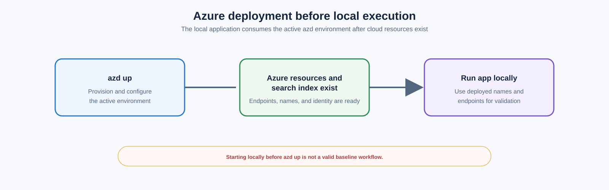
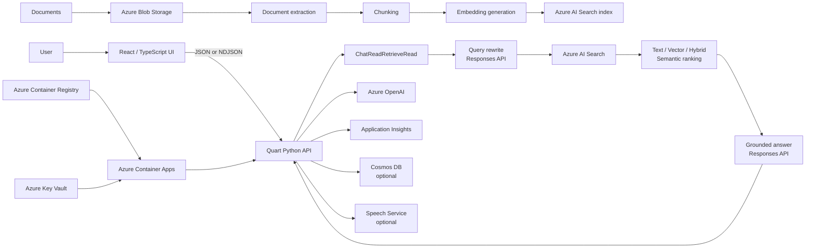
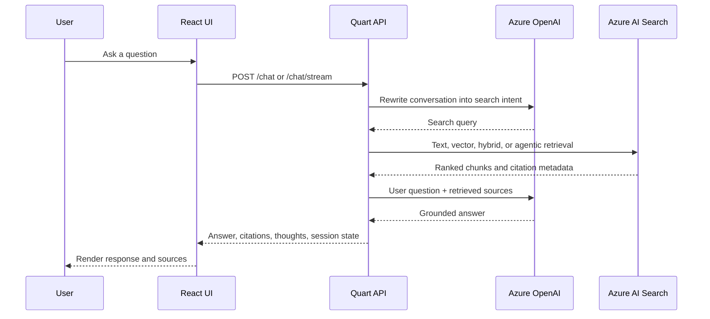
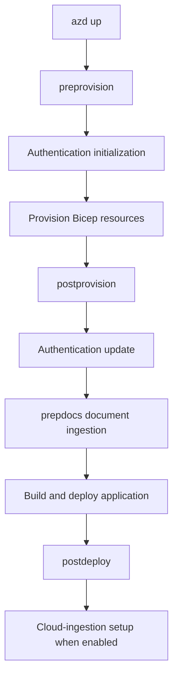
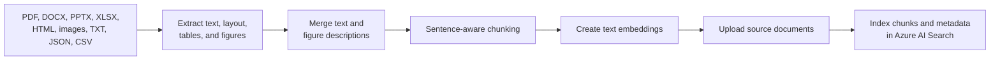
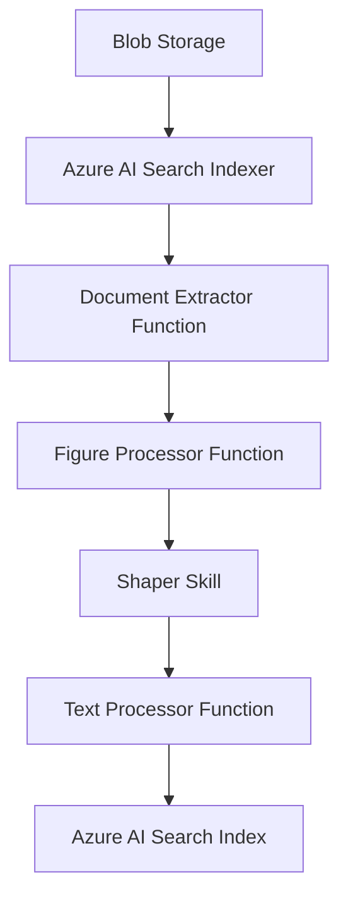

> **Document class:** Hands-on Labs guided implementation lab
> **Normative terms:** **MUST**, **MUST NOT**, **SHOULD**, **SHOULD NOT**, and **MAY** are requirements levels.
> **Applicability:** Pinned Azure RAG deployment, document ingestion, retrieval evaluation, application customization, identity, access control, observability, and private-networking exercises.
> **Exception process:** Deviations require a documented risk assessment, compensating controls, named risk owner, and expiry date.

| Control field | Value |
|---|---|
| Document ID | `HOL-02` |
| Owner | Cloud Center of Excellence |
| Review cycle | At least annually and after material SDK, provider, security, or source-repository changes |
| Evidence | Pinned source commit, `azd` environment, resource validation, retrieval and safety evaluations, identity and access tests, and cleanup evidence |

# End-to-End Azure OpenAI and Azure AI Search RAG

> **Decision in brief:** Separate the core RAG deployment from optional retrieval, identity, evaluation, and private-networking extensions; promote only after quality, safety, and cleanup evidence.

This lab guides architects, AI engineers, developers, and platform teams through a reproducible deployment and evaluation of the Azure Search OpenAI demonstration application. It uses a pinned source snapshot and separates core implementation from optional cost, security, evaluation, and production-readiness exercises.

## Purpose

This lab converts the `Azure-Samples/azure-search-openai-demo` repository into a controlled, repeatable implementation exercise.

You will:

1. provision a complete Retrieval-Augmented Generation platform with Azure Developer CLI;
2. Deploy a Python and React application to Azure Container Apps.
3. Ingest and index the repository's sample documents.
4. Inspect text, vector, hybrid, and semantic retrieval behavior.
5. Call the application through its HTTP API.
6. Replace the sample content with your own documents.
7. Run the application locally with hot reload.
8. Customize prompts and retrieval settings.
9. Enable optional agentic retrieval.
10. Inspect Application Insights telemetry.
11. Run answer-quality and safety evaluations.
12. Add Microsoft Entra authentication and document-level access control.
13. Review private networking and production-readiness requirements.
14. Remove the lab resources and verify cleanup.

Estimated duration:

- Core deployment and testing: **2–3 hours**
- Custom data, evaluation, and observability: **2–4 hours**
- Authentication, agentic retrieval, or private networking: **additional 2–4 hours**

## Recommended approach

Complete the core track first in a dedicated non-production subscription or resource group. Pin the reviewed commit, select the reduced-cost profile when advanced capabilities are not required, and save the acceptance evidence before changing sample data or enabling optional features.

Use synthetic or approved documents only. Do not enable anonymous access, persistent history, document upload, agentic retrieval, or public networking without reviewing the corresponding identity, privacy, content-safety, and cost controls. Clean up all billable resources after the exercise.

## Source Snapshot

This lab is based on repository commit:

```text
3f4a21f03ae3d565aca37cc300e3d38b0c7b582a
```

Commit date:

```text
2026-07-27
```

Using a fixed commit prevents the instructions from silently diverging when the repository changes.

The repository is actively maintained. Its defaults at this snapshot include:

- Chat model: `gpt-5.4-mini`
- Chat model version: `2026-03-17`
- Embedding model: `text-embedding-3-large`
- Default hosting: Azure Container Apps
- Backend: Python with Quart
- Frontend: React and TypeScript
- Deployment: Azure Developer CLI and Bicep
- Model interaction: OpenAI Responses API
- Retrieval: Azure AI Search
- Default local backend port: `50505`
- Vite development port: `5173`

These are repository defaults, not permanent Azure platform guarantees.

## Scope and Tracks

### Core track

Complete these sections:

- Prerequisites
- Clone and validate
- Provision and deploy
- Validate the Azure application
- Test RAG behavior
- Test the HTTP API
- Ingest custom data
- Run locally
- Observe and evaluate
- Clean up

### Optional advanced tracks

Complete only when relevant:

- Agentic retrieval
- Cloud ingestion
- Microsoft Entra authentication
- Document-level authorization
- Multimodal RAG
- Persistent chat history
- Private networking
- Load testing
- Production hardening

## Important Constraints

### Azure deployment comes before local execution

The local application reads resource names, endpoints, identities, and model deployment settings from the active `azd` environment. Therefore, the supported sequence is:



Starting the local application before completing `azd up` is not a valid baseline workflow.

### The default deployment is publicly accessible

The default application does not require user authentication. Anyone with routable network access to the application endpoint can interact with the indexed content.

Do not load confidential enterprise data until authentication, authorization, and network controls are implemented.

### `azd up` incurs charges immediately

The largest persistent cost is commonly Azure AI Search. Model deployments, Document Intelligence, storage, Container Apps, monitoring, and optional services also incur charges.

An interrupted deployment can still leave billable resources behind.

### This is a sample, not a production certification

The repository provides a strong reference implementation. It does not eliminate the need for:

- threat modeling;
- data classification;
- privacy review;
- capacity planning;
- security architecture;
- operational readiness;
- model-risk governance;
- load testing;
- evaluation gates.

## Target architecture



## End-to-End Processing Flow



## Deliverables

Retain the following evidence:

- Active `azd` environment name
- Source commit SHA
- Successful `azd up` output
- Azure resource inventory
- Working application endpoint
- One text retrieval result
- One vector retrieval result
- One hybrid retrieval result
- One citation opened successfully
- One non-streaming API response
- One streaming API response
- One custom document indexed successfully
- One Application Insights trace
- One evaluation summary
- One documented security or production gap
- Successful `azd down` result

## Prerequisites

### Azure permissions

Your identity requires:

- `Microsoft.Resources/deployments/write` at subscription scope;
- permission to create or use a resource group;
- permission to write role assignments, such as:
  - Owner;
  - User Access Administrator; or
  - Role Based Access Control Administrator;
- sufficient Azure OpenAI quota in an available region;
- permission to create Azure AI Search and supporting services.

If role-assignment permission exists only on a predefined resource group, use the repository's existing-resource deployment guidance instead of attempting subscription-wide provisioning.

### Local tools

Install and validate:

- Azure Developer CLI `azd >= 1.23.6`
- Azure CLI
- Python `3.10`, `3.11`, `3.12`, `3.13`, or `3.14`
- Node.js `20` or later
- Git
- PowerShell `7` or later on Windows
- Visual Studio Code, recommended

Run:

```bash
azd version
az version
python --version
node --version
npm --version
git --version
```

On Windows:

```powershell
pwsh --version
```

Pass conditions:

- every command succeeds;
- `azd` is at least `1.23.6`;
- Node.js is at least version `20`;
- Python is in the supported range.

### Recommended execution environment

Choose one:

1. GitHub Codespaces
2. VS Code Dev Container
3. Local workstation

Codespaces or a Dev Container reduce workstation-specific dependency failures.

### Cost decision

Choose one before deployment:

### Standard lab profile

Use repository defaults:

- Azure Container Apps
- Basic Azure AI Search
- Azure Document Intelligence
- Application Insights
- vector and semantic retrieval enabled

### Reduced-cost profile

Apply the optional settings in [Section 11](#11-optional-reduced-cost-configuration).

The reduced-cost profile is less capable. It is not a free equivalent of the default architecture.

## Lab: Clone and Pin the Repository

### Clone

```bash
git clone https://github.com/Azure-Samples/azure-search-openai-demo.git
cd azure-search-openai-demo
```

### Check out the reviewed commit

```bash
git checkout 3f4a21f03ae3d565aca37cc300e3d38b0c7b582a
```

### Verify repository state

```bash
git rev-parse HEAD
git status
```

Expected SHA:

```text
3f4a21f03ae3d565aca37cc300e3d38b0c7b582a
```

Expected status:

```text
HEAD detached at 3f4a21f
nothing to commit, working tree clean
```

### Inspect the main structure

```text
.
├── app/
│   ├── backend/
│   ├── frontend/
│   └── functions/
├── data/
├── docs/
├── evals/
├── infra/
├── scripts/
├── azure.yaml
└── README.md
```

Key areas:

| Path | Purpose |
|---|---|
| `app/backend` | Quart API, RAG flow, ingestion code |
| `app/frontend` | React and TypeScript UI |
| `app/functions` | Cloud-ingestion custom skills |
| `data` | Documents ingested by deployment scripts |
| `infra` | Bicep modules |
| `scripts` | Provisioning, ingestion, authentication, and ACL scripts |
| `evals` | Quality and safety evaluation tooling |
| `docs` | Advanced operating guidance |

## Lab: Authenticate and Create an `azd` Environment

### Authenticate Azure CLI

```bash
az login
az account list --output table
az account set --subscription "<subscription-id-or-name>"
az account show --output table
```

### Authenticate Azure Developer CLI

```bash
azd auth login
```

In a browser-restricted environment:

```bash
azd auth login --use-device-code
```

### Create an environment

```bash
azd env new
```

Use a short, unique name:

```text
raglab-jm
```

The environment is stored under:

```text
.azure/<environment-name>/
```

### Confirm the active environment

```bash
azd env get-values
```

Do not manually commit `.azure` environment files containing secrets.

### Select Azure subscription explicitly

```bash
azd env set AZURE_SUBSCRIPTION_ID "<subscription-id>"
```

Optional explicit resource-group name:

```bash
azd env set AZURE_RESOURCE_GROUP "rg-raglab-jm"
```

If you do not set a resource group, the template generates one from the environment name.

## Optional Reduced-Cost Configuration

Skip this section when using the standard lab profile.

### Switch to App Service free tier

Edit `azure.yaml`:

```yaml
services:
  backend:
    # host: containerapp
    host: appservice
```

Set:

```bash
azd env set DEPLOYMENT_TARGET appservice
azd env set AZURE_APP_SERVICE_SKU F1
```

Limitations:

- free-instance quotas apply;
- performance is lower;
- the free tier is not appropriate for production.

### Use free Azure AI Search

```bash
azd env set AZURE_SEARCH_SERVICE_SKU free
```

Limitations:

- one free search service per subscription;
- semantic ranker unavailable;
- managed-identity capabilities are restricted;
- cloud ingestion and some advanced features are unsuitable.

### Use free Document Intelligence

```bash
azd env set AZURE_DOCUMENTINTELLIGENCE_SKU F0
```

The free service processes only the first two pages of a PDF.

For complete local PDF parsing:

```bash
azd env set USE_LOCAL_PDF_PARSER true
```

For HTML:

```bash
azd env set USE_LOCAL_HTML_PARSER true
```

### Disable vectors

```bash
azd env set USE_VECTORS false
```

This removes embedding generation and vector retrieval. The result is a keyword-oriented RAG system with lower retrieval quality for semantic queries.

### Disable Application Insights

Only use where supported by the chosen hosting target:

```bash
azd env set AZURE_USE_APPLICATION_INSIGHTS false
```

Disabling observability to save a small amount of money is usually a poor tradeoff.

## Lab: Review Deployment Configuration

### Validate `azure.yaml`

The source snapshot requires:

```yaml
requiredVersions:
  azd: ">= 1.23.6"
```

Default backend host:

```yaml
host: containerapp
```

The deployment builds the frontend before packaging the backend.

### Understand deployment hooks

`azd up` runs these phases:



Important consequence:

```text
azd up
```

does more than infrastructure provisioning. It also ingests the files in `./data`.

### Inspect the planned values

```bash
azd env get-values
```

At this stage, many generated values do not exist yet. That is expected.

## Lab: Provision and Deploy

### Start deployment

```bash
azd up
```

You will be prompted for:

- primary Azure location;
- Azure OpenAI location;
- subscription, if not already fixed.

Choose regions according to:

- model availability;
- organizational data-residency policy;
- quota;
- supported optional features.

### Observe the phases

Expected high-level sequence:

1. Bicep validation
2. resource-group creation
3. Azure OpenAI and model deployment
4. Azure AI Search creation
5. storage and document-processing services
6. Container Apps environment and application
7. Azure Container Registry
8. Application Insights and Log Analytics
9. managed identities and role assignments
10. sample document ingestion
11. frontend build
12. container deployment
13. endpoint output

### Do not stop at `SUCCESS`

The application container can require several additional minutes before it serves the correct application.

A temporary platform welcome page does not prove deployment failure.

### Record the endpoint

Retain the endpoint printed by `azd up`.

Also inspect:

```bash
azd env get-values
```

### Record the resource group

```bash
azd env get-value AZURE_RESOURCE_GROUP
```

Set a shell variable on Linux/macOS:

```bash
RG="$(azd env get-value AZURE_RESOURCE_GROUP)"
echo "$RG"
```

PowerShell:

```powershell
$RG = azd env get-value AZURE_RESOURCE_GROUP
$RG
```

## Lab: Validate Provisioned Resources

### Inventory resources

Linux/macOS:

```bash
az resource list \
  --resource-group "$RG" \
  --query "[].{Name:name,Type:type,Location:location}" \
  --output table
```

PowerShell:

```powershell
az resource list `
  --resource-group $RG `
  --query "[].{Name:name,Type:type,Location:location}" `
  --output table
```

Expected categories include:

- Azure OpenAI or Foundry resource
- model deployments
- Azure AI Search
- Azure Storage
- Document Intelligence
- Container Apps
- Container Registry
- managed identities
- Log Analytics
- Application Insights
- Key Vault or supporting secret configuration

The exact set varies with feature flags.

### Confirm model deployments

In Azure AI Foundry or the Azure portal, verify:

- chat deployment exists;
- embedding deployment exists;
- deployment state is successful;
- quota is non-zero.

Repository defaults at this snapshot:

```text
Chat:       gpt-5.4-mini
Embedding:  text-embedding-3-large
```

### Confirm the search index

Open:

```text
Azure AI Search
  → Search management
  → Indexes
```

Verify:

- an index exists;
- documents are present;
- content fields are populated;
- embedding fields exist when vectors are enabled;
- source metadata exists.

### Confirm blob content

Open the storage account and inspect the content container.

Verify that the sample documents were uploaded.

### Confirm application health

Open the application endpoint.

Pass conditions:

- React UI loads;
- no Azure platform welcome page remains;
- chat page is visible;
- example questions appear;
- browser developer console has no repeated fatal errors.

## Lab: Test the Application UI

### Baseline grounded answer

Ask:

```text
What is included in the Northwind Health Plus plan that is not in the standard plan?
```

Validate:

- answer contains citations;
- source filenames are shown;
- clicking a citation opens a source document;
- answer is based on indexed content.

### Multi-turn conversation

Ask:

```text
Summarize the differences.
```

Then:

```text
Which option appears more suitable for someone expecting frequent specialist visits?
```

Validate:

- conversational context is preserved;
- retrieved evidence remains visible;
- answer does not rely solely on earlier generated text.

### Unsupported question

Ask a question unrelated to the sample corpus:

```text
What was the closing price of Microsoft stock yesterday?
```

Expected behavior:

- answer states that the indexed sources do not provide the information; or
- answer clearly qualifies the lack of support.

An authoritative unsupported answer is a failure.

### Inspect thought process

Open the lightbulb or thought-process panel.

Record:

- original user query;
- generated search intent;
- returned search results;
- prompt sent for answer generation;
- model and retrieval settings;
- latency or token information when exposed.

The purpose is diagnosis, not disclosure to end users.

## Lab: Compare Retrieval Strategies

Open **Developer settings**.

Use one fixed question for every test:

```text
Which health plan provides broader coverage and what evidence supports that conclusion?
```

Record results in this table:

| Mode | Semantic ranker | Top results | Correct answer | Useful citations | Notes |
|---|---:|---:|---:|---:|---|
| Text | Off | 3 | ☐ | ☐ | |
| Vector | Off | 3 | ☐ | ☐ | |
| Hybrid | Off | 3 | ☐ | ☐ | |
| Hybrid | On | 3 | ☐ | ☐ | |

### Text retrieval

Set:

```text
retrieval_mode = text
semantic_ranker = false
```

Observe exact keyword sensitivity.

### Vector retrieval

Set:

```text
retrieval_mode = vectors
semantic_ranker = false
```

Observe semantic matching when the query does not use document wording.

### Hybrid retrieval

Set:

```text
retrieval_mode = hybrid
semantic_ranker = false
```

Observe combined lexical and vector results.

### Hybrid plus semantic ranking

Set:

```text
retrieval_mode = hybrid
semantic_ranker = true
semantic_captions = true
```

This is the repository's general quality-oriented baseline.

### Acceptance criterion

Do not declare one mode superior from one question. Use at least five representative questions before drawing a conclusion.

## Lab: Test the HTTP API

The application supports:

- `POST /chat` for JSON responses;
- `POST /chat/stream` for NDJSON streaming responses.

Set the target:

```bash
APP_URL="https://<deployed-application-host>"
```

For local execution later:

```bash
APP_URL="http://127.0.0.1:50505"
```

### Non-streaming request

Create `request.json`:

```json
{
  "messages": [
    {
      "role": "user",
      "content": "What is included in the Northwind Health Plus plan that is not in the standard plan?"
    }
  ],
  "context": {
    "overrides": {
      "top": 3,
      "retrieval_mode": "hybrid",
      "semantic_ranker": true,
      "semantic_captions": true,
      "suggest_followup_questions": false,
      "use_oid_security_filter": false,
      "use_groups_security_filter": false,
      "vector_fields": "textEmbeddingOnly",
      "use_multimodal_answering": false
    }
  },
  "session_state": null
}
```

Call:

```bash
curl \
  --request POST \
  --url "$APP_URL/chat" \
  --header "Content-Type: application/json" \
  --data @request.json
```

Expected fields:

```text
output_text
context
session_state
```

Inspect:

```text
context.data_points
context.thoughts
```

### Streaming request

```bash
curl --no-buffer \
  --request POST \
  --url "$APP_URL/chat/stream" \
  --header "Content-Type: application/json" \
  --data @request.json
```

Expected content type:

```text
application/json-lines
```

Expected event types include:

```text
response.context
response.output_text.delta
```

### Compare text and hybrid API calls

Change:

```json
"retrieval_mode": "text"
```

Run again, save the response, then change to:

```json
"retrieval_mode": "hybrid"
```

Compare:

- generated search query;
- retrieved source pages;
- answer completeness;
- citation correctness.

### Authentication note

When Microsoft Entra authentication is enabled, API calls require:

```http
Authorization: Bearer <ID-token>
```

Do not disable authentication merely to simplify programmatic access.

## Lab: Inspect the Search Index

### List indexed source files

In Azure AI Search Search Explorer, run:

```json
{
  "search": "*",
  "count": true,
  "top": 1,
  "facets": [
    "sourcefile"
  ]
}
```

Validate:

- total document chunk count;
- expected source filenames;
- no unintended confidential files.

### Filter one file

```json
{
  "search": "*",
  "count": true,
  "top": 5,
  "filter": "sourcefile eq 'employee_handbook.pdf'",
  "facets": [
    "sourcefile"
  ]
}
```

Replace the filename with one that exists in the index.

### Test semantic query

```json
{
  "search": "eye exams",
  "queryType": "semantic",
  "semanticConfiguration": "default",
  "queryLanguage": "en-us",
  "speller": "lexicon",
  "top": 3,
  "highlight": "content"
}
```

Inspect:

- rank order;
- highlighted text;
- semantic captions;
- source pages.

## Lab: Understand the Ingestion Pipeline

The default local ingestion pipeline performs:



### Default chunking behavior

At the source snapshot:

- approximately 1,000 characters per chunk;
- roughly 400–500 English tokens;
- approximately 10% overlap;
- sentence-aware boundary selection.

The algorithm is implemented in:

```text
app/backend/prepdocslib/textsplitter.py
```

### Indexed chunk structure

A chunk commonly includes:

```text
id
content
category
sourcepage
sourcefile
storageUrl
embedding
```

Multimodal deployments can also include image fields and generated figure descriptions.

## Lab: Replace Sample Data with Your Own Data

Use non-sensitive documents for this lab.

### Back up the sample data

Linux/macOS:

```bash
mkdir -p data-sample-backup
cp -R data/. data-sample-backup/
```

PowerShell:

```powershell
New-Item -ItemType Directory -Force data-sample-backup
Copy-Item -Recurse data\* data-sample-backup\
```

### Remove current indexed documents

Linux/macOS:

```bash
./scripts/prepdocs.sh --removeall
```

Windows:

```powershell
./scripts/prepdocs.ps1 --removeall
```

### Replace files in `data`

Remove sample files and add your own supported documents.

Supported formats include:

- PDF
- HTML
- DOCX
- PPTX
- XLSX
- JPG
- PNG
- BMP
- TIFF
- HEIF
- TXT
- JSON
- CSV

### Re-ingest

Linux/macOS:

```bash
./scripts/prepdocs.sh
```

Windows:

```powershell
./scripts/prepdocs.ps1
```

The script:

1. creates the index when necessary;
2. uploads source files;
3. extracts and chunks content;
4. creates embeddings when enabled;
5. indexes chunks.

### Verify ingestion

Use Search Explorer:

```json
{
  "search": "*",
  "count": true,
  "top": 1,
  "facets": [
    "sourcefile"
  ]
}
```

### Ask corpus-specific questions

Prepare:

- three directly answerable questions;
- one multi-document question;
- one ambiguous question;
- one unsupported question.

Pass conditions:

- answerable questions cite correct documents;
- multi-document answer cites each relevant source;
- unsupported question is rejected or qualified.

## Lab: Categorize Documents

Categories support filtered retrieval.

### Ingest a category

Linux/macOS:

```bash
./scripts/prepdocs.sh --category "Architecture"
```

Windows:

```powershell
./scripts/prepdocs.ps1 --category "Architecture"
```

### Add the category to the UI

Update:

```text
app/frontend/src/components/Settings/Settings.tsx
```

Add the category to the **Include Category** options.

### Test filtering

Ask the same question with:

- all categories;
- only `Architecture`.

Validate that filtered results contain only the intended category.

## Lab: Run Locally

Local execution requires a successful Azure deployment.

### Refresh authentication

```bash
azd auth login
```

### Start the application

Linux/macOS:

```bash
./app/start.sh
```

Windows PowerShell:

```powershell
./app/start.ps1
```

The script:

- creates `.venv`;
- installs pinned backend requirements;
- installs frontend dependencies;
- builds the frontend;
- starts Quart with reload.

Default local endpoint:

```text
http://127.0.0.1:50505
```

### Validate local application

Open:

```text
http://127.0.0.1:50505
```

Run the same baseline question used against Azure.

### Use a different backend port

Linux/macOS:

```bash
PORT=50506 ./app/start.sh
```

PowerShell:

```powershell
$env:PORT = "50506"
./app/start.ps1
```

## Lab: Enable Frontend Hot Reload

Keep the backend running.

Open a second terminal:

```bash
cd app/frontend
npm run dev
```

Expected Vite endpoint:

```text
http://localhost:5173
```

Vite proxies backend requests to the Quart application.

### Test

Modify a translation or UI label under:

```text
app/frontend/src
```

Validate that the page updates without rebuilding the complete backend package.

## Lab: Customize the UI

Frontend technologies:

- React
- TypeScript
- Fluent UI
- Vite

Localization files:

```text
app/frontend/src/locales/<language>/translation.json
```

### Exercise

Change:

- application title;
- header text;
- one example question;
- one instructional message.

Validate in the Vite development server.

### Deploy code-only changes

When only `app` code changes:

```bash
azd deploy
```

Do not run a full infrastructure reprovision unnecessarily.

## Lab: Customize the RAG Prompts

Primary implementation:

```text
app/backend/approaches/chatreadretrieveread.py
```

Primary prompts:

```text
app/backend/approaches/prompts/query_rewrite.system.jinja2
app/backend/approaches/prompts/chat_answer.system.jinja2
app/backend/approaches/prompts/chat_answer.user.jinja2
```

### Current flow

1. Query rewrite through the Responses API
2. Search through Azure AI Search
3. Grounded answer through the Responses API

### Exercise

Replace the sample healthcare-oriented system language with a domain-specific role, for example:

```text
You are an enterprise cloud architecture assistant.
Answer only from the supplied sources.
Cite every factual statement.
When the sources do not support an answer, state that explicitly.
Distinguish mandatory standards from recommendations.
```

### Validation set

Use the same five questions before and after the prompt change.

Compare:

- retrieval query quality;
- answer relevance;
- groundedness;
- citation coverage;
- unsupported-claim rate;
- response length.

Do not judge quality from one response. Model outputs can vary even at low temperature.

## Lab: Make Retrieval Defaults Permanent

UI settings are request-time overrides and are not persistent.

### Option A: Change frontend defaults

Find the retrieval state in the chat component and change the default from hybrid only when justified.

Example concept:

```typescript
const [retrievalMode, setRetrievalMode] =
  useState<RetrievalMode>(RetrievalMode.Hybrid);
```

### Option B: Enforce backend settings

In the approach implementation:

```python
overrides = context.get("overrides", {})
overrides["retrieval_mode"] = "hybrid"
overrides["semantic_ranker"] = True
```

Backend enforcement is preferable when users must not weaken an approved configuration.

### Security consideration

Remove the Developer settings interface in production if arbitrary retrieval or prompt controls are not appropriate for end users.

## Lab: Optional Agentic Retrieval

Agentic retrieval uses a model to analyze the conversation and create retrieval plans.

### Enable

```bash
azd env set USE_AGENTIC_KNOWLEDGEBASE true
```

### Keep the default model or override it

Repository default:

```text
gpt-5.4
```

Explicit settings:

```bash
azd env set AZURE_OPENAI_KNOWLEDGEBASE_DEPLOYMENT knowledgebase
azd env set AZURE_OPENAI_KNOWLEDGEBASE_MODEL gpt-5.4
azd env set AZURE_OPENAI_KNOWLEDGEBASE_MODEL_VERSION 2026-03-05
```

### Select reasoning effort

Default:

```text
minimal
```

Override:

```bash
azd env set AZURE_SEARCH_KNOWLEDGEBASE_RETRIEVAL_REASONING_EFFORT low
```

Supported repository options:

```text
minimal
low
medium
```

General tradeoff:

| Effort | Query planning | Latency | Token cost |
|---|---|---:|---:|
| Minimal | Limited single-intent flow | Lowest | Lowest |
| Low | Query planning and expansion | Higher | Higher |
| Medium | More exhaustive planning | Highest | Highest |

### Deploy

```bash
azd up
```

### Test a multifaceted query

```text
Compare the health plans for a family with recurring prescriptions, specialist visits, and expected hospital care. Identify tradeoffs and cite each claim.
```

Inspect:

- generated query plan;
- number of searches;
- retrieved sources;
- token usage;
- answer quality;
- latency.

### Compare against standard hybrid retrieval

Use the same query with:

- standard hybrid retrieval;
- agentic retrieval minimal;
- agentic retrieval low.

Do not adopt agentic retrieval without measuring whether quality gains justify additional latency and cost.

### Optional web source

```bash
azd env set USE_WEB_SOURCE true
azd env set AZURE_SEARCH_KNOWLEDGEBASE_RETRIEVAL_REASONING_EFFORT low
```

Critical constraints:

- web source is incompatible with `minimal`;
- it changes answer-synthesis behavior;
- some UI controls become unavailable;
- public-web data has different privacy and contractual implications.

## Lab: Optional Cloud Ingestion

Cloud ingestion uses Azure AI Search indexers and Azure Functions custom skills.

### Use a new index

Cloud ingestion requires a different index schema.

```bash
azd env set AZURE_SEARCH_INDEX cloudindex
```

### Enable

```bash
azd env set USE_CLOUD_INGESTION true
```

### Increase embedding capacity when quota permits

```bash
azd env set AZURE_OPENAI_EMB_DEPLOYMENT_CAPACITY 400
```

### Provision and deploy

```bash
azd up
```

### Cloud ingestion flow



### Add a document

Upload a document to the configured blob data source.

Run the search indexer from Azure portal.

### Validate

Check:

- indexer execution history;
- failed item count;
- function logs;
- newly indexed source filename;
- generated chunks.

### Scheduled operation

Configure an indexer schedule only after defining:

- acceptable ingestion delay;
- retry behavior;
- failure alerting;
- document deletion semantics;
- cost constraints.

## Lab: Monitoring and Tracing

Application Insights is enabled by default.

### Open dashboard

```bash
azd monitor
```

### Inspect request performance

In Application Insights:

```text
Investigate
  → Performance
  → Select /chat or /chat/stream
  → Drill into samples
```

Inspect:

- total request duration;
- query-rewrite model call;
- Azure AI Search dependency;
- answer-generation model call;
- retry delay;
- HTTP status.

### Inspect failures

```text
Investigate
  → Failures
```

Filter by:

- operation name;
- result code;
- time range;
- cloud role.

### Check throttling

Use Logs:

```kusto
dependencies
| where resultCode == "429"
| summarize attempts=count(),
            affectedRequests=dcount(operation_Id)
            by target, name
| order by attempts desc
```

A request can eventually succeed after SDK retries while still suffering serious latency.

### Protect prompt content

The OpenAI instrumentation can record prompts and responses.

For privacy-sensitive environments:

```text
TRACELOOP_TRACE_CONTENT=false
```

Apply it through the application environment in Bicep or the hosting configuration.

Do not enable content tracing for regulated or confidential prompts without formal approval.

## Lab: Quality Evaluation

Evaluation dependencies conflict with the main application dependencies. Use a separate virtual environment.

### Enable evaluation model

```bash
azd env set USE_EVAL true
azd env set AZURE_OPENAI_EVAL_DEPLOYMENT_CAPACITY 100
azd env set AZURE_OPENAI_CHATGPT_DEPLOYMENT_CAPACITY 100
azd provision
```

Repository default evaluation model at this snapshot:

```text
gpt-5.4
version 2026-03-05
```

### Create evaluation environment

Linux/macOS:

```bash
python -m venv .evalenv
source .evalenv/bin/activate
```

Windows:

```powershell
python -m venv .evalenv
.evalenv\Scripts\Activate.ps1
```

### Install dependencies

```bash
pip install -r evals/requirements.txt
```

### Generate a small lab dataset

For a smoke test:

```bash
python evals/generate_ground_truth.py \
  --numquestions=20 \
  --numsearchdocs=200
```

For a serious baseline, use at least:

```text
200 questions
```

Review:

```text
evals/ground_truth.jsonl
```

Delete unrealistic or invalid generated pairs.

### Start the local application

In another terminal:

```bash
./app/start.sh
```

Target:

```text
http://localhost:50505
```

### Review evaluation configuration

Open:

```text
evals/evaluate_config.json
```

Validate:

- target URL;
- metrics;
- question file;
- result directory;
- model settings.

### Run evaluation

```bash
python evals/run_evaluate.py --numquestions=20
```

### Summarize

```bash
cd evals
python -m evaltools summary results
```

### Compare run to ground truth

```bash
python -m evaltools diff results/<run-directory>
```

### Compare two configurations

```bash
python -m evaltools diff \
  results/<baseline-run> \
  results/<candidate-run>
```

### Evaluation acceptance rules

Do not approve a configuration solely from an aggregate average.

Review:

- worst-scoring questions;
- citation failures;
- unsupported claims;
- retrieval misses;
- long-tail latency;
- throttled requests;
- language-specific failures.

## Lab: Safety Evaluation

### Confirm region support

At the source snapshot, the repository lists safety simulation support in:

- East US 2
- France Central
- Sweden Central
- Switzerland West
- North Central US

This list can change. Verify platform support before deployment.

### Run a small simulation

```bash
python evals/safety_evaluation.py \
  --target_url http://localhost:50505/chat \
  --max_simulations 20
```

The repository's larger default is:

```text
200 simulations
```

### Review output

```text
safety_results.json
```

Metrics include categories such as:

- hate and unfairness;
- sexual content;
- violence;
- self-harm.

Repository interpretation:

- `low_rate` closer to `1.0` is better;
- `mean_score` closer to `0.0` is better.

### Inspect individual failures

Aggregate safety scores hide failure patterns.

Review the exact prompts and responses that produced the highest scores.

## Lab: Enable Microsoft Entra Authentication

This section changes access behavior and may create two application registrations.

Required additional permission:

- ability to manage applications in Microsoft Entra ID.

### Enable authentication

```bash
azd env set AZURE_USE_AUTHENTICATION true
```

### Set tenant

```bash
azd env set AZURE_AUTH_TENANT_ID "<tenant-id>"
```

If needed:

```bash
azd auth login --tenant-id "<tenant-id>"
```

### Deploy

```bash
azd up
```

The repository automation creates:

- a single-page client application registration;
- a confidential API application registration;
- API scopes and redirect configuration;
- application settings.

### Validate

- application presents a sign-in flow;
- unauthenticated access is blocked;
- authenticated user can ask a question;
- browser token errors are absent;
- API endpoint rejects missing credentials.

### Optional explicit user assignment

In the Enterprise Application:

```text
Properties
  → Assignment required?
  → Yes
```

Assign only approved users and groups.

## Lab: Enable Document-Level Access Control

Authentication alone does not restrict which indexed documents a user can retrieve.

### Enforce access control

```bash
azd env set AZURE_ENFORCE_ACCESS_CONTROL true
```

### Enable authentication

```bash
azd env set AZURE_USE_AUTHENTICATION true
```

### Set tenant

```bash
azd env set AZURE_AUTH_TENANT_ID "<tenant-id>"
```

### Existing index only

```bash
python ./scripts/manageacl.py --acl-action enable_acls
```

A new index created during deployment can receive the access-control fields automatically.

### Deploy

```bash
azd up
```

### Test with two users

Use:

- User A with access to document set A;
- User B without access to document set A.

Ask the same question as each user.

Pass condition:

- User B does not retrieve restricted chunks;
- citations do not expose restricted filenames;
- direct content URLs do not bypass authorization.

### Optional global document access

```bash
azd env set AZURE_ENABLE_GLOBAL_DOCUMENT_ACCESS true
```

Use only when the access policy explicitly allows globally visible documents.

### Do not enable unauthenticated access casually

```bash
azd env set AZURE_ENABLE_UNAUTHENTICATED_ACCESS true
```

This weakens the access boundary and requires a clear policy for globally accessible content.

## Lab: Optional User Upload

Prerequisites:

- authentication enabled;
- document-level access control enabled.

Enable:

```bash
azd env set USE_USER_UPLOAD true
azd up
```

Expected behavior:

- user documents stored in ADLS Gen2;
- user object ID used for directory ownership;
- indexed chunks contain authorization identifiers;
- retrieval checks ownership.

Test:

1. User A uploads a document.
2. User A can retrieve it.
3. User B cannot retrieve it.
4. unauthenticated user cannot access it.

## Lab: Optional Persistent Chat History

Browser-only history:

```bash
azd env set USE_CHAT_HISTORY_BROWSER true
```

Cosmos DB history:

```bash
azd env set USE_CHAT_HISTORY_COSMOS true
```

Cosmos history requires authentication.

Test:

- create a conversation;
- sign out and use another browser or device;
- sign in;
- confirm the same user can retrieve history;
- confirm another user cannot retrieve it.

Do not store chat history indefinitely without a retention policy.

## Lab: Optional Private Deployment

Private deployment adds material cost and operational complexity.

### Configure

```bash
azd env set AZURE_USE_PRIVATE_ENDPOINT true
azd env set AZURE_USE_VPN_GATEWAY true
azd env set AZURE_PUBLIC_NETWORK_ACCESS Disabled
```

### Provision

```bash
azd provision
```

The initial post-provision ingestion is expected to fail before private-network connectivity is established.

### Obtain VPN configuration link

```bash
azd env get-value AZURE_VPN_CONFIG_DOWNLOAD_LINK
```

### Configure Azure VPN Client

The repository network design uses the DNS resolver address:

```text
10.0.11.4
```

Add it to the downloaded VPN XML only when the deployed network still matches the source snapshot.

### Connect to VPN

Validate private DNS resolution for:

- Azure AI Search;
- Azure OpenAI;
- Storage;
- Container Apps or App Service;
- other enabled services.

### Run post-provision ingestion

```bash
azd hooks run postprovision
```

### Deploy application

```bash
azd deploy
```

### Validate public isolation

From a device outside the private network:

- application endpoint must be inaccessible;
- service public endpoints must reject traffic.

### Important incompatibility

The built-in CI/CD path is not directly compatible with the VPN-dependent private deployment. A self-hosted or network-integrated deployment runner is required.

## Lab: Load Testing

Install Locust in a separate test environment:

```bash
python -m pip install locust
```

Start:

```bash
locust ChatUser
```

Open:

```text
http://localhost:8089
```

Start conservatively:

```text
Users:       20
Spawn rate:  1 user/second
```

Target:

```text
https://<application-host>
```

Do not end the target URL with `/`.

Measure:

- requests per second;
- p50, p95, and p99 latency;
- failure rate;
- HTTP 429 rate;
- Container Apps replica behavior;
- OpenAI token capacity;
- Search latency;
- CPU and memory.

A successful HTTP response after long automatic retries is not acceptable performance.

## Lab: Production-Readiness Review

### Identity

Required decisions:

- user authentication;
- application managed identity;
- least-privilege RBAC;
- document-level authorization;
- administrative separation;
- credential rotation.

### Networking

Evaluate:

- private endpoints;
- private DNS;
- public network access;
- egress controls;
- API Management;
- WAF;
- corporate network connectivity;
- deployment-runner network access.

### Search capacity

The default Basic service and free semantic-ranker allowance are development settings.

For standard semantic ranking:

```bash
azd env set AZURE_SEARCH_SEMANTIC_RANKER standard
```

For a larger search tier:

```bash
azd env set AZURE_SEARCH_SERVICE_SKU standard
```

Changing between some tiers requires a new service and reindexing.

### OpenAI capacity

Default capacity is not a production sizing result.

Evaluate:

- average prompt tokens;
- average output tokens;
- query rewrite calls;
- answer calls;
- agentic-retrieval planning calls;
- expected requests per minute;
- burst pattern;
- retry behavior.

### Container Apps

The sample can scale to zero.

For production, consider:

- minimum two replicas;
- sufficient CPU and memory;
- dedicated workload profile;
- zone resilience;
- readiness probes;
- deployment revisions;
- safe rollback.

### Storage

Consider zone-redundant storage rather than local redundancy.

### Observability

Define:

- logs retained;
- traces sampled;
- prompt content recorded or suppressed;
- alert thresholds;
- dependency-failure alerts;
- evaluation dashboards;
- cost alerts.

### Data governance

Define:

- permitted document classifications;
- ingestion approval;
- source ownership;
- deletion SLA;
- index refresh SLA;
- geographic residency;
- retention;
- legal hold;
- user-upload policy.

### AI quality gates

Require:

- retrieval test set;
- answer-quality test set;
- citation-matching threshold;
- groundedness threshold;
- safety threshold;
- regression comparison;
- human review of worst cases.

## Validation

| Test | Expected result | Pass |
|---|---|---|
| Tool versions | Meet repository minimums | ☐ |
| Source commit | Exact reviewed SHA | ☐ |
| Azure authentication | Correct subscription and tenant | ☐ |
| `azd up` | Completes successfully | ☐ |
| Resource inventory | Expected services exist | ☐ |
| Chat deployment | Ready and has capacity | ☐ |
| Embedding deployment | Ready and has capacity | ☐ |
| Search index | Contains chunks | ☐ |
| Blob storage | Contains source files | ☐ |
| Azure UI | Loads correctly | ☐ |
| Grounded answer | Uses valid citations | ☐ |
| Unsupported question | Refused or qualified | ☐ |
| Text retrieval | Tested | ☐ |
| Vector retrieval | Tested | ☐ |
| Hybrid retrieval | Tested | ☐ |
| Semantic ranker | Tested | ☐ |
| `/chat` API | Returns JSON | ☐ |
| `/chat/stream` API | Returns NDJSON | ☐ |
| Custom document | Indexed successfully | ☐ |
| Local app | Runs on port 50505 | ☐ |
| Frontend HMR | Runs on port 5173 | ☐ |
| Application Insights | Trace visible | ☐ |
| Evaluation | Results produced | ☐ |
| Safety evaluation | Results reviewed | ☐ |
| Authentication | Enabled when required | ☐ |
| Access control | Prevents unauthorized retrieval | ☐ |
| Cleanup | Resource group deleted | ☐ |

## Troubleshooting

### `azd` version rejected

Upgrade Azure Developer CLI.

Verify:

```bash
azd version
```

Required:

```text
>= 1.23.6
```

### Role-assignment failure

Typical cause:

```text
Microsoft.Authorization/roleAssignments/write
```

is missing.

Fix:

- obtain Owner, User Access Administrator, or RBAC Administrator;
- use a permitted existing resource group;
- use existing resources with preconfigured identities and roles.

### Model region unavailable

The region prompt is constrained by current model availability.

Fix:

- verify quota;
- select another region;
- use an approved existing model deployment;
- change model name, version, or SKU only to supported combinations.

### `azd up` succeeds but app shows welcome page

Wait several minutes and refresh.

Then inspect Container Apps revision and logs.

### Search returns no results

Check:

- index document count;
- `prepdocs` output;
- Blob files;
- embedding deployment;
- Search RBAC;
- index name in active `azd` environment.

### Citation opens 404

Check:

- source file exists in storage;
- `sourcepage` and `sourcefile` metadata;
- content route authorization;
- blob permissions;
- filename encoding.

### Local app lacks settings

Run:

```bash
azd env get-values
```

Confirm the current terminal is in the correct repository and active environment.

Reauthenticate:

```bash
azd auth login
az login
```

### Local port occupied

Linux/macOS:

```bash
PORT=50506 ./app/start.sh
```

Windows:

```powershell
$env:PORT = "50506"
./app/start.ps1
```

### Evaluation is extremely slow

Check:

- chat deployment capacity;
- evaluation deployment capacity;
- hidden HTTP 429 retries;
- number of LLM-based metrics;
- number of questions.

Do not compare latency from throttled and non-throttled runs.

### Changed embedding model but index fails

Embedding dimensions are part of the search schema.

Create a new index:

```bash
azd env set AZURE_SEARCH_INDEX new-index-name
azd up
```

Do not reuse an index with incompatible vector dimensions.

### Cloud ingestion does not work on existing index

Cloud ingestion requires its schema.

Create a new index before enabling it:

```bash
azd env set AZURE_SEARCH_INDEX cloudindex
azd env set USE_CLOUD_INGESTION true
azd up
```

### Authentication redirect failure

Check:

- tenant ID;
- client and server app registrations;
- redirect URIs;
- SPA registration;
- admin consent;
- `access_as_user` scope;
- known client application configuration.

### HTTP 429 responses

Increase capacity only after determining which deployment is throttled.

Possible sources:

- query rewrite model;
- answer model;
- embedding model;
- evaluation model;
- agentic retrieval model.

## Cleanup

### Save evidence

Export:

- evaluation summary;
- important screenshots;
- architecture decisions;
- environment configuration without secrets.

### Delete Azure resources

```bash
azd down
```

Confirm:

```text
Delete all resources: y
Permanently purge resources when supported: y
```

### Verify the resource group

```bash
az group exists \
  --name "$(azd env get-value AZURE_RESOURCE_GROUP)"
```

Expected:

```text
false
```

If the `azd` environment no longer returns the name, verify in the Azure portal or use the recorded resource-group name.

### Remove local environments

Linux/macOS:

```bash
rm -rf .venv
rm -rf .evalenv
rm -rf app/frontend/node_modules
```

Windows:

```powershell
Remove-Item -Recurse -Force .venv -ErrorAction SilentlyContinue
Remove-Item -Recurse -Force .evalenv -ErrorAction SilentlyContinue
Remove-Item -Recurse -Force app\frontend\node_modules -ErrorAction SilentlyContinue
```

### Remove test Entra applications

When automatic authentication setup created lab-only application registrations, confirm whether `azd down` removed them.

Delete remaining lab registrations manually when necessary.

### Verify no billable resources remain

Check:

- resource groups;
- Azure AI Search;
- model deployments;
- Container Registry;
- Log Analytics;
- App registrations;
- soft-deleted or purge-protected resources.

## Operational considerations

- Use a dedicated, budget-controlled environment with an accountable lab owner and expiry date.
- Keep the reviewed repository commit, model versions, deployment configuration, and evaluation dataset with the lab evidence.
- Monitor search capacity, model tokens and throttling, Container Apps consumption, registry, storage, and telemetry cost throughout execution.
- Treat prompts, uploaded files, retrieved passages, citations, traces, chat history, and evaluation results according to their data classification.
- Require explicit review before enabling anonymous access, user upload, persistent history, agentic retrieval, public endpoints, or cross-region processing.
- Re-run security, retrieval, quality, and load validation after changing models, embeddings, prompts, chunking, index schema, identity, or network topology.
- Do not promote the sample directly to production; close the production-readiness findings through governed architecture and release processes.

## Appendix A — Model Configuration

### Change chat deployment name

```bash
azd env set AZURE_OPENAI_CHATGPT_DEPLOYMENT "<deployment-name>"
```

### Change model

```bash
azd env set AZURE_OPENAI_CHATGPT_MODEL "<model-name>"
```

### Change model version

```bash
azd env set AZURE_OPENAI_CHATGPT_DEPLOYMENT_VERSION "<version>"
```

### Change deployment SKU

```bash
azd env set AZURE_OPENAI_CHATGPT_DEPLOYMENT_SKU GlobalStandard
```

### Change capacity

```bash
azd env set AZURE_OPENAI_CHATGPT_DEPLOYMENT_CAPACITY 30
```

After infrastructure changes:

```bash
azd up
```

Old model deployments are not necessarily deleted automatically.

## Appendix B — Embedding Configuration

### Use `text-embedding-3-small`

```bash
azd env set AZURE_OPENAI_EMB_MODEL_NAME text-embedding-3-small
azd env set AZURE_OPENAI_EMB_DIMENSIONS 1536
azd env set AZURE_OPENAI_EMB_DEPLOYMENT_VERSION 1
```

### Use `text-embedding-3-large`

```bash
azd env set AZURE_OPENAI_EMB_MODEL_NAME text-embedding-3-large
azd env set AZURE_OPENAI_EMB_DIMENSIONS 3072
azd env set AZURE_OPENAI_EMB_DEPLOYMENT_VERSION 1
```

Changing the embedding model or dimension requires a new compatible search index and re-ingestion.

## Appendix C — Key Feature Flags

| Variable | Effect |
|---|---|
| `USE_VECTORS` | Enables vector embeddings and vector retrieval |
| `USE_AGENTIC_KNOWLEDGEBASE` | Enables Azure AI Search agentic retrieval |
| `USE_CLOUD_INGESTION` | Enables indexers and Azure Functions ingestion |
| `USE_EVAL` | Provisions evaluation model |
| `AZURE_USE_AUTHENTICATION` | Enables Microsoft Entra login |
| `AZURE_ENFORCE_ACCESS_CONTROL` | Applies document-level filtering |
| `AZURE_ENABLE_GLOBAL_DOCUMENT_ACCESS` | Permits globally visible documents |
| `AZURE_ENABLE_UNAUTHENTICATED_ACCESS` | Allows anonymous application access |
| `USE_USER_UPLOAD` | Enables authenticated document uploads |
| `USE_CHAT_HISTORY_BROWSER` | Stores history in browser |
| `USE_CHAT_HISTORY_COSMOS` | Stores persistent history in Cosmos DB |
| `AZURE_USE_PRIVATE_ENDPOINT` | Deploys private endpoints |
| `AZURE_USE_VPN_GATEWAY` | Deploys VPN access path |
| `AZURE_PUBLIC_NETWORK_ACCESS` | Enables or disables public service access |
| `USE_MEDIA_DESCRIBER_AZURE_CU` | Describes figures with Content Understanding |
| `USE_SPEECH_INPUT_BROWSER` | Enables browser speech input |
| `USE_SPEECH_OUTPUT_AZURE` | Enables Azure Speech output |
| `ENABLE_LANGUAGE_PICKER` | Enables language selector |

## Appendix D — Code Map

| Component | Path |
|---|---|
| API routes and application setup | `app/backend/app.py` |
| RAG approach | `app/backend/approaches/chatreadretrieveread.py` |
| Query rewrite prompt | `app/backend/approaches/prompts/query_rewrite.system.jinja2` |
| Answer system prompt | `app/backend/approaches/prompts/chat_answer.system.jinja2` |
| Answer user prompt | `app/backend/approaches/prompts/chat_answer.user.jinja2` |
| Ingestion entry point | `app/backend/prepdocs.py` |
| Text splitter | `app/backend/prepdocslib/textsplitter.py` |
| Search index manager | `app/backend/prepdocslib/searchmanager.py` |
| React frontend | `app/frontend/src` |
| Deployment definition | `azure.yaml` |
| Main Bicep | `infra/main.bicep` |
| Quality evaluation | `evals/run_evaluate.py` |
| Ground-truth generation | `evals/generate_ground_truth.py` |
| Safety evaluation | `evals/safety_evaluation.py` |
| Load test | `locustfile.py` |

## Appendix E — Recommended Enterprise Extensions

1. Add API Management with identity-based backend access.
2. Add WAF and controlled ingress.
3. Use private endpoints and centralized private DNS.
4. Store no reusable secrets in application settings.
5. Use workload identity and managed identity.
6. Add tenant and document authorization tests to CI.
7. Add ingestion malware scanning.
8. Add source-content classification and approval.
9. Add prompt-injection detection and source-trust rules.
10. Add citation-verification metrics.
11. Add retrieval and answer regression datasets.
12. Add cost budgets and quota alerts.
13. Add model-deployment failover or routing.
14. Add release gates for quality and safety.
15. Add data deletion and reindexing runbooks.
16. Add restore testing for storage, configuration, and indexes.
17. Add explicit SLOs for latency, availability, and answer quality.
18. Add dependency scanning and signed container images.
19. Add incident response for harmful or unauthorized output.
20. Remove end-user developer controls not approved for production.

## Appendix F — Source Map

Primary repository sources used for this lab:

```text
README.md
azure.yaml
docs/README.md
docs/architecture.md
docs/localdev.md
docs/data_ingestion.md
docs/customization.md
docs/http_protocol.md
docs/deploy_features.md
docs/deploy_lowcost.md
docs/agentic_retrieval.md
docs/login_and_acl.md
docs/monitoring.md
docs/evaluation.md
docs/safety_evaluation.md
docs/deploy_private.md
docs/productionizing.md
app/start.sh
app/backend/app.py
app/backend/requirements.txt
```

## Related topics

- [Azure OpenAI Platform Architecture](../data-ai-integration/dai-azure-openai-platform-architecture.md)
- [Enterprise RAG and AI Search](../data-ai-integration/dai-enterprise-rag-and-ai-search.md)
- [AI Security, Identity, and Responsible AI](../data-ai-integration/dai-ai-security-identity-and-responsible-ai.md)
- [Production Operations for AI Applications](../data-ai-integration/dai-production-operations-for-ai-applications.md)

## Related repos

- [Azure-Samples/azure-search-openai-demo](https://github.com/Azure-Samples/azure-search-openai-demo) — provides the application, infrastructure, ingestion, evaluation, and security examples used by this lab at the pinned source commit recorded in the metadata.
