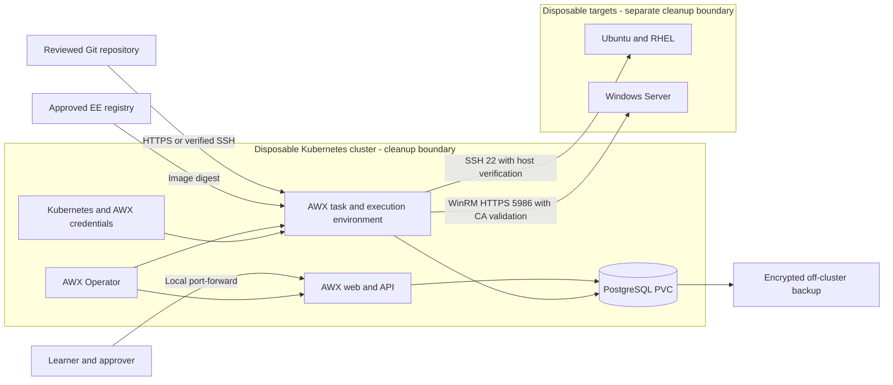
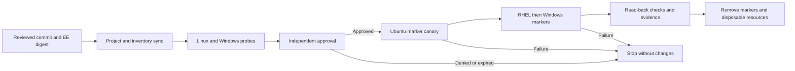

# Build a cross-platform Ansible automation control plane with AWX

Build a disposable AWX control plane that runs reviewed automation against Ubuntu, RHEL, and Windows servers across private cloud and local networks. Follow the repository's Ansible architecture and engineering standard, and retain evidence before removing the lab.

> **Document class:** Guided implementation lab. **Owner:** Cloud Center of Excellence. **Evidence:** Release manifest, controller configuration, job results, approval records, recovery checks, and cleanup record.
> **Validation status:** Documentation structure and site publication are machine-validated. The deployment and target exercises require a learner-run integration test. This document does not claim production readiness or a completed recovery drill.

## Lab overview

### Scenario and learning objectives

Git holds automation content. AWX holds inventories, encrypted credential references, role assignments, templates, schedules, and execution history. Execution environments (EEs) provide Ansible and its dependencies. Managed machines receive agentless connections from execution workloads, not from the learner's browser.

By the end of the lab, you will:

1. Install AWX through its Kubernetes operator with persistent PostgreSQL storage.
2. Build and record an immutable EE with Windows support and verified SSH host keys.
3. Import a Git inventory and separate Linux and Windows credentials.
4. Run connectivity checks and idempotent configuration changes on three disposable targets.
5. Bind templates to reviewed content, enforce approvals, and prove a denied workflow cannot mutate targets.
6. Collect job evidence, rehearse recovery, and remove lab resources.

The required exercise manages a harmless marker file. Patching and remote execution zones are extensions because they require additional service-specific health checks and network design. AWX is the upstream community project; production support, availability, identity integration, and upgrade policy require a separate platform decision.

### Alignment with the engineering standard

| Controls in SBP-13 | Lab implementation | Evidence |
|---|---|---|
| REQ-001 through REQ-005 | Reviewed Git commit, dependency manifest, EE digest | Release record and image inspection |
| REQ-006 through REQ-009, REQ-016 | Fixed target groups, FQCN modules, bounded idempotent marker playbooks | First and second run comparison |
| REQ-010 through REQ-012 | AWX credentials, platform boundaries, separate operator and approver | Secret scan and access tests |
| REQ-014, REQ-015 | Syntax, lint, dependency and secret checks, integration and negative tests | Required PR checks and lab results |
| REQ-017 through REQ-020 | Serial execution, fixed template inputs, approval, failure stops | Template settings and workflow graph |
| REQ-022, REQ-025 | Correlated job evidence and isolated restore rehearsal | Evidence bundle and recovery timing |

These exercises demonstrate selected controls; they do not certify every requirement. Dynamic inventory, production promotion, and authenticated event triggers must meet the remaining requirements before adoption.

## Prerequisites

### Resources and access

| Resource | Lab requirement |
|---|---|
| Control-plane cluster | Dedicated disposable Kubernetes cluster with a working default StorageClass, DNS, registry egress, and private routes to targets |
| Capacity | Start with 4 vCPU, 8 GiB RAM, and 40 GiB available storage for a small lab; verify actual pod requests and database growth |
| Targets | One Ubuntu 22.04/24.04, one RHEL 9, and one Windows Server 2022 disposable VM; record exact images and patch levels |
| Workstation | Linux or WSL2 Bash, Git, kubectl compatible with the cluster, Podman, Python tooling, and Ansible Builder 3.x |
| Identities | Cluster administrator for bootstrap; Git repository and registry access; restricted Linux SSH identity; Windows lab account |
| Transport trust | Verified Linux host public keys, Windows HTTPS certificate with DNS SAN and Server Authentication usage, issuing CA bundle |
| Recovery | Storage for encrypted database/secret backups outside the disposable cluster |

Use an existing sandbox cluster or provision one through your organization's approved Kubernetes procedure. Cluster and VM provisioning are prerequisites, not commands hidden in this lab. Linux targets need Python 3, SSH, and an automation account that owns its home directory. Windows needs PowerShell and an enabled WinRM HTTPS listener; the account needs permission to use WinRM and write the lab directory. A local administrator may be used only on the disposable Windows target; production access needs a tested least-privilege design.

Estimate cost from cluster nodes, three VMs, disks, registry storage, and private connectivity for an eight-hour session. Set an owner and expiry tag. Stopping VMs does not remove disk or networking charges. No cloud account credentials are needed inside AWX for this static-inventory exercise.

### Version and release record

Use AWX Operator `2.19.1` with its paired AWX `24.6.1` as a documented baseline, rather than overriding the AWX image independently. This pairing is recorded in the [operator release notes](https://github.com/ansible/awx-operator/releases). Review vulnerabilities and compatibility before use; a historical pin is not a security endorsement.

Create a private lab content repository and a release record containing:

- Kubernetes server/client versions, StorageClass, target OS and Python/PowerShell versions.
- Operator tag and resolved full Git commit, AWX version, and deployed container image digests.
- EE base-image digest, installed Ansible/Python/collection versions, and final registry digest.
- Content commit, inventory host count, account identities, owner, and lab expiry.

Resolve tags once and retain the resulting commits/digests. If a component must change, record and retest the complete compatibility set. Do not silently substitute `latest`.

## Target architecture



Only the private execution network can reach target management ports. Permit DNS, Git and registry access as required; do not expose PostgreSQL, SSH, WinRM, or the AWX API publicly. Browser-to-controller connectivity does not prove that the EE can reach a target. For an Azure-hosted lab, test the effective pod or node egress source through NSGs and routes; use equivalent firewall controls in other clouds.



All mutation edges are success-only. A failed probe, denied approval, or failed canary prevents later changes. Cleanup is a deliberate learner action after evidence collection.

## Lab modules

### Module 1: Install the AWX control plane

When the disposable control plane is a RHEL host running K3s, verify the host and cluster before applying AWX resources:

```bash
sudo systemctl is-active k3s
sudo k3s kubectl get nodes
sudo k3s kubectl get pods -A
```

The node should be `Ready`. Components such as `coredns`, `local-path-provisioner`, `metrics-server`, and (when enabled) Traefik belong to the K3s cluster and are expected. If ordinary `kubectl` reports `The connection to the server localhost:8080 was refused`, it has no usable kubeconfig; confirm K3s first, then use the K3s-managed configuration explicitly:

```bash
sudo kubectl --kubeconfig /etc/rancher/k3s/k3s.yaml get nodes
sudo k3s kubectl get nodes
```

For a workstation account on the K3s host, set `KUBECONFIG` to `/etc/rancher/k3s/k3s.yaml` only after confirming that the account is authorized to read that file. Avoid copying the administrator kubeconfig to shared locations or leaving a conflicting `KUBECONFIG` value in the environment.

Run Bash commands on the workstation. Confirm that the current Kubernetes context identifies the disposable cluster before applying resources.

```bash
kubectl config current-context
kubectl cluster-info
kubectl get storageclass
mkdir -p awx-lab-deploy
cd awx-lab-deploy
git ls-remote https://github.com/ansible/awx-operator.git refs/tags/2.19.1
cat > kustomization.yaml <<'EOF'
apiVersion: kustomize.config.k8s.io/v1beta1
kind: Kustomization
namespace: awx-lab
resources:
  - github.com/ansible/awx-operator/config/default?ref=2.19.1
images:
  - name: quay.io/ansible/awx-operator
    newTag: 2.19.1
EOF
kubectl apply -k .
kubectl -n awx-lab rollout status deployment/awx-operator-controller-manager --timeout=300s
cat > awx.yaml <<'EOF'
apiVersion: awx.ansible.com/v1beta1
kind: AWX
metadata:
  name: awx-lab
  namespace: awx-lab
spec:
  service_type: clusterip
  postgres_storage_requirements:
    requests:
      storage: 10Gi
EOF
kubectl apply -f awx.yaml
kubectl -n awx-lab get pods,pvc,svc
kubectl -n awx-lab logs deployment/awx-operator-controller-manager -c awx-manager --tail=100
```

Wait for reconciliation, database initialization, and ready web/task pods. If a PVC is Pending, resolve the storage problem before continuing. Record image IDs from pod status and the AWX version from the UI. This follows the [operator installation procedure](https://docs.ansible.com/projects/awx-operator/en/latest/installation/basic-install.html).

In a separate terminal, start local-only access:

```bash
kubectl -n awx-lab port-forward --address 127.0.0.1 service/awx-lab-service 8080:80
```

Open `http://127.0.0.1:8080`. Retrieve the `password` key from Kubernetes Secret `awx-lab-admin-password` using your approved secret-viewing tool, sign in as `admin`, and change the bootstrap password. Do not include the secret in transcripts or screenshots. The HTTP endpoint is limited to workstation loopback through the Kubernetes tunnel; a shared deployment requires a trusted HTTPS ingress and organizational authentication.

**Checkpoint:** AWX loads, PVCs are Bound, pods are Ready, and no external LoadBalancer or NodePort was created.

The lab intentionally uses a ClusterIP service with a local port-forward. If a controlled internal deployment requires direct access from an approved network, change the AWX resource before applying it to:

```yaml
spec:
  service_type: nodeport
  nodeport_port: 30080
```

Then verify the service with `kubectl -n awx-lab get svc` and access it through `<K3s-node-IP>:30080`. Do not use the `10.43.x.x` ClusterIP from a workstation outside the cluster, and do not open a NodePort unless the network and host-firewall source scope has been approved.

### Module 2: Prepare target transport and trust

For Ubuntu and RHEL, install the automation account's SSH public key through the VM provisioning channel. Obtain each SSH host key through the VM console or a trusted provisioning record. Store verified entries in `trust/known_hosts` in the content repository; do not trust an unauthenticated `ssh-keyscan` result by itself. Include both names and addresses if both are used for connections.

On Windows, use the administrative console to inspect the HTTPS listener and certificate:

```powershell
Get-ChildItem WSMan:\localhost\Listener
Get-ChildItem Cert:\LocalMachine\My |
  Select-Object Subject, DnsNameList, EnhancedKeyUsageList, NotAfter, Thumbprint
```

If no HTTPS listener exists, first enroll the required certificate with its private key, then create a listener from an elevated console, replacing both values:

```powershell
$labDnsName = 'win01.lab.example'
$labCertThumbprint = 'REPLACE_WITH_ENROLLED_CERTIFICATE_THUMBPRINT'
New-Item -Path WSMan:\localhost\Listener -Transport HTTPS -Address * `
  -CertificateThumbPrint $labCertThumbprint -HostName $labDnsName -Force
```

Allow inbound TCP 5986 only from the actual execution source CIDR through the Windows firewall and network firewall. Use a dedicated rule named `AWX-Lab-WinRM-HTTPS` so cleanup can identify it. Ensure the WinRM service runs, NTLM/Negotiate is permitted by lab policy, and the account is authorized for remote management. Do not enable Basic authentication, unencrypted transport, or disable certificate validation. Local-account UAC restrictions may require a different approved account design; do not apply a blanket UAC bypass.

Copy the public issuing CA chain to `trust/windows-ca.pem`. Set the Windows inventory address to the name covered by the certificate and resolvable from the EE. The [Ansible WinRM guide](https://docs.ansible.com/projects/ansible/latest/os_guide/windows_winrm.html) explains listener setup, authentication, certificate validation, and account restrictions. Kerberos is an alternative extension requiring domain identity, DNS, time synchronization, and EE Kerberos dependencies.

**Checkpoint:** Record host-key fingerprints, certificate expiry and SAN, source CIDRs, and account names without private keys or passwords.

### Module 3: Build and publish the execution environment

Use this content-repository layout. The deployment directory from Module 1 is separate.

```text
awx-lab-content/
  execution-environment.yml
  requirements.yml
  requirements.txt
  trust/known_hosts
  trust/windows-ca.pem
  inventories/lab/hosts.yml
  playbooks/probe-linux.yml
  playbooks/probe-windows.yml
  playbooks/marker-linux.yml
  playbooks/marker-windows.yml
```

Create `requirements.yml` and `requirements.txt`:

```yaml
---
collections:
  - name: ansible.windows
    version: "2.5.0"
```

```text
pywinrm==0.5.0
```

Create `execution-environment.yml`. Replace the base placeholder with the digest obtained by inspecting `quay.io/ansible/awx-ee:24.6.1` using Podman; retain the inspection output in the release record. This uses the paired EE's Ansible/Runner rather than mixing an arbitrary new core with the historical controller.

```yaml
---
version: 3
images:
  base_image:
    name: quay.io/ansible/awx-ee@sha256:REPLACE_WITH_VERIFIED_BASE_DIGEST
dependencies:
  galaxy: requirements.yml
  python: requirements.txt
additional_build_files:
  - src: trust
    dest: lab-trust
additional_build_steps:
  append_final:
    - COPY _build/lab-trust/known_hosts /etc/ssh/ssh_known_hosts
    - COPY _build/lab-trust/windows-ca.pem /etc/pki/lab-windows-ca.pem
    - RUN chmod 0644 /etc/ssh/ssh_known_hosts /etc/pki/lab-windows-ca.pem
    - ENV ANSIBLE_HOST_KEY_CHECKING=True
```

From the content-repository root:

```bash
podman pull quay.io/ansible/awx-ee:24.6.1
podman image inspect quay.io/ansible/awx-ee:24.6.1
# Replace the base digest in execution-environment.yml before building.
ansible-builder build --container-runtime podman --tag awx-lab-ee:1.0
podman run --rm awx-lab-ee:1.0 ansible --version
podman run --rm awx-lab-ee:1.0 ansible-galaxy collection list
podman run --rm awx-lab-ee:1.0 python3 -m pip freeze
```

Authenticate to your registry using its approved credential helper. Tag and push the image to your own registry namespace, inspect the pushed digest, and scan that artifact. Record the complete installed dependency set, including transitive dependencies; the two requirements files alone are not a complete lock. Reuse the same built digest for every job in the exercise.

```bash
# Replace this with your writable registry repository.
LAB_EE_IMAGE=registry.example/automation/awx-lab-ee:1.0
podman tag awx-lab-ee:1.0 "$LAB_EE_IMAGE"
podman push --digestfile lab-ee.digest "$LAB_EE_IMAGE"
cat lab-ee.digest
```

In AWX, create organization `awx-lab`, a Container Registry credential if required, and an Execution Environment named `lab-ee-1.0` with your full `registry/repository@sha256:digest` reference. See [AWX execution environments](https://docs.ansible.com/projects/awx/en/24.6.1/userguide/execution_environments.html).

**Checkpoint:** The image contains `ansible.windows`, imports `winrm`, has readable trust files, and can be pulled by AWX. Never bake target credentials or private keys into the EE.

### Module 4: Create inventory, credentials, and project

Use the existing Ansible repository as the AWX Project source of truth. AWX does not need a separate AWX-specific repository; the deployment manifests may remain in a separate bootstrap directory.

Create `inventories/lab/hosts.yml`, replacing example addresses and names with the prepared targets:

```yaml
---
all:
  vars:
    target_environment: test
    automation_owner: platform-engineering
    network_zone: lab-private
  children:
    linux_lab:
      vars:
        ansible_connection: ssh
        ansible_python_interpreter: /usr/bin/python3
        ansible_ssh_common_args: '-o StrictHostKeyChecking=yes -o UserKnownHostsFile=/etc/ssh/ssh_known_hosts'
      hosts:
        ubuntu01:
          ansible_host: 10.20.0.11
          patch_ring: canary
        rhel01:
          ansible_host: 10.20.0.12
          patch_ring: wave1
    windows_lab:
      vars:
        ansible_connection: winrm
        ansible_port: 5986
        ansible_winrm_scheme: https
        ansible_winrm_transport: ntlm
        ansible_winrm_server_cert_validation: validate
        ansible_winrm_ca_trust_path: /etc/pki/lab-windows-ca.pem
      hosts:
        win01:
          ansible_host: win01.lab.example
          patch_ring: wave1
```

Create separate AWX Machine credentials `lab-linux-ssh` and `lab-windows-winrm`. The first stores the Linux username and private key; the second stores the Windows username and password. Do not put usernames that select privileged identities or secret values in launch-time extra vars. A job uses one Machine credential; separate Linux and Windows job templates are required here.

If the repository uses Ansible Vault, create an AWX Vault credential for each vault ID instead of relying on a vault password file on the RHEL host. Record the vault identifier and attach the matching credential to the relevant Job Template or workflow. Never put the vault password in inventory variables, Git, extra vars, or evidence.

After adding the playbooks in Module 5, run your repository's required YAML, lint, dependency, and secret checks, approve the content, and push it to Git. Create Project `lab-content` in organization `awx-lab`, set the Git URL and a read-only SCM credential if needed, and set SCM Branch/Tag/Commit to the reviewed full commit. Disable branch override. Synchronize it and record the resolved revision.

Create Inventory `lab-inventory`, then an inventory source of type **Sourced from a Project**, selecting `lab-content` and `inventories/lab/hosts.yml`. Enable overwrite of hosts and variables for this dedicated inventory. Synchronize once and verify exactly three enabled hosts and the two expected groups. Keep automatic inventory refresh disabled during the exercise; changes require a new reviewed sync and target-count check.

**Checkpoint:** No password/private-key values appear in inventory or Git. The resolved project commit matches the release record, and a missing host or empty inventory blocks proceeding even if a sync reports success.

### Module 5: Author and validate cross-platform playbooks

Create `playbooks/probe-linux.yml`:

```yaml
---
- name: Verify Linux transport
  hosts: linux_lab
  gather_facts: false
  serial: 1
  any_errors_fatal: true
  tasks:
    - name: Verify Python and SSH execution
      ansible.builtin.ping:
```

Create `playbooks/probe-windows.yml`:

```yaml
---
- name: Verify Windows transport
  hosts: windows_lab
  gather_facts: false
  serial: 1
  any_errors_fatal: true
  tasks:
    - name: Verify PowerShell and WinRM execution
      ansible.windows.win_ping:
```

Create `playbooks/marker-linux.yml`. It needs no sudo and touches only the automation account's home directory:

```yaml
---
- name: Converge the Linux lab marker
  hosts: linux_lab
  gather_facts: true
  serial: 1
  any_errors_fatal: true
  tasks:
    - name: Require the documented lab platform and environment
      ansible.builtin.assert:
        that:
          - target_environment == 'test'
          - ansible_facts['distribution'] in ['Ubuntu', 'RedHat']
    - name: Write a deterministic lab marker
      ansible.builtin.copy:
        dest: "{{ ansible_facts['user_dir'] }}/awx-lab-marker.txt"
        content: "Managed by the AWX cross-platform lab.\n"
        mode: '0600'
    - name: Read back the marker
      ansible.builtin.slurp:
        src: "{{ ansible_facts['user_dir'] }}/awx-lab-marker.txt"
      register: lab_marker
      when: not ansible_check_mode
    - name: Verify marker content
      ansible.builtin.assert:
        that:
          - (lab_marker.content | b64decode) == "Managed by the AWX cross-platform lab.\n"
      when: not ansible_check_mode
```

Create `playbooks/marker-windows.yml`:

```yaml
---
- name: Converge the Windows lab marker
  hosts: windows_lab
  gather_facts: false
  serial: 1
  any_errors_fatal: true
  tasks:
    - name: Require the test environment
      ansible.builtin.assert:
        that:
          - target_environment == 'test'
    - name: Create the dedicated lab directory
      ansible.windows.win_file:
        path: C:\AWX-Lab
        state: directory
    - name: Write a deterministic lab marker
      ansible.windows.win_copy:
        dest: C:\AWX-Lab\marker.txt
        content: "Managed by the AWX cross-platform lab.\n"
    - name: Read back the marker
      ansible.builtin.slurp:
        src: C:\AWX-Lab\marker.txt
      register: lab_marker
      when: not ansible_check_mode
    - name: Verify marker content
      ansible.builtin.assert:
        that:
          - (lab_marker.content | b64decode) == "Managed by the AWX cross-platform lab.\n"
      when: not ansible_check_mode
```

Require that `C:\AWX-Lab` and both Linux marker paths are absent before the first run; do not overwrite unrelated files. Validate syntax inside the built EE for each playbook, for example:

```bash
podman run --rm -v "$PWD:/runner/project:ro" -w /runner/project \
  awx-lab-ee:1.0 ansible-playbook -i inventories/lab/hosts.yml \
  playbooks/marker-linux.yml --syntax-check
```

Repeat for the other three files and run `ansible-lint` using a recorded, compatible version in CI. On an SELinux workstation, use an appropriately relabeled dedicated checkout if required. Do not disable SELinux globally.

**Checkpoint:** All four playbooks pass syntax and review checks. Check mode skips read-back assertions when files do not yet exist; a real run is required to prove target state.

### Module 6: Configure bounded jobs and approval workflow

Create these Job Templates. Every row uses `lab-content`, `lab-inventory`, `lab-ee-1.0`, forks `1`, timeout `300` seconds, and **Run** job type. Disable privilege escalation and concurrent jobs. Leave all Prompt on Launch options and surveys disabled, including inventory, credentials, limit, SCM branch, job type, and variables.

| Template | Playbook | Machine credential | Fixed limit |
|---|---|---|---|
| probe-linux | playbooks/probe-linux.yml | lab-linux-ssh | linux_lab |
| probe-windows | playbooks/probe-windows.yml | lab-windows-winrm | windows_lab |
| marker-canary | playbooks/marker-linux.yml | lab-linux-ssh | ubuntu01 |
| marker-linux-wave | playbooks/marker-linux.yml | lab-linux-ssh | rhel01 |
| marker-windows-wave | playbooks/marker-windows.yml | lab-windows-winrm | win01 |

Run both probe templates directly as the lab administrator. Expect `pong`, no changed tasks, and the exact intended host count. Then build workflow `lab-marker-release` in the AWX visualizer:

1. Start with `probe-linux`, followed by `probe-windows` on success.
2. Add approval node `approve-lab-change` with a ten-minute timeout.
3. On approval, run `marker-canary`, then `marker-linux-wave`, then `marker-windows-wave`, connecting each on success only.
4. Leave failure and approval-denial branches without mutation jobs. Disable workflow concurrent jobs and all launch-time overrides.

Create two non-admin users in separate teams. Grant `lab-operators` Execute on the workflow only, with no Execute on its mutation job templates and no project, inventory, credential, or workflow administration. Grant `lab-approvers` the workflow Approve role. Do not make either user an organization administrator. Verify behavior using the [AWX workflow permissions and approval documentation](https://docs.ansible.com/projects/awx/en/24.6.1/userguide/workflows.html).

Launch as the operator and approve as the approver. Run the same workflow twice with the same commit, digest, and inventory. The first run creates markers; the second must show `changed=0` for every mutation job and successful read-back assertions. Disabling concurrent jobs is not a global lock across different templates; do not launch overlapping workflows, direct jobs, or schedules against the same targets during this exercise.

**Checkpoint:** Operators cannot edit templates, launch mutation templates directly, or approve their own request. Deny a new request and verify no child mutation jobs start. Preserve job IDs and role-test results.

### Module 7: Operate, schedule, and rehearse recovery

Export non-secret evidence for both workflow runs: requester and approver, approval timestamp, project revision, EE digest, inventory and limit, credential identity, actual host count, start/end time, task recap, and read-back results. Keep credential values, Kubernetes Secret YAML, and database dumps out of the evidence repository.

Create a one-time schedule for `probe-linux` within the lab window. Record its owner, timezone, expected duration, non-overlap rule, and missed-run handling. Verify one execution, then disable the schedule. Keep mutation scheduling disabled. Native webhook support alone does not demonstrate the replay protection and deduplication required by SBP-13; event-driven production execution needs those controls separately.

For a recovery rehearsal, use the backup and restore resources supplied by the pinned operator. Inspect their schemas before composing manifests:

```bash
kubectl explain awxbackup.spec --recursive
kubectl explain awxrestore.spec --recursive
```

Follow the pinned operator's [backup role](https://github.com/ansible/awx-operator/tree/2.19.1/roles/backup) and [restore role](https://github.com/ansible/awx-operator/tree/2.19.1/roles/restore). Protect the database, AWX encryption secret key, required database secrets, resource specifications, and version record. Back up to durable storage, then copy the protected backup outside the cluster; a backup PVC on the same disposable cluster is insufficient.

Create `backup-awx.yaml` on the original cluster and apply it with `kubectl apply -f backup-awx.yaml`:

```yaml
---
apiVersion: awx.ansible.com/v1beta1
kind: AWXBackup
metadata:
  name: awx-lab-backup
  namespace: awx-lab
spec:
  deployment_name: awx-lab
```

Inspect `kubectl -n awx-lab get awxbackup awx-lab-backup -o yaml` and operator logs for completion. Record `status.backupClaim` and `status.backupDirectory`. Transfer the complete backup directory through your approved encrypted volume-backup process to a PVC in the recovery cluster; preserve its files and permissions. Install the same operator there, but do not create the empty AWX instance from Module 1. Create `restore-awx.yaml`, replacing the PVC and directory placeholders with the restored locations, then apply it on the recovery context:

```yaml
---
apiVersion: awx.ansible.com/v1beta1
kind: AWXRestore
metadata:
  name: awx-lab-restore
  namespace: awx-lab
spec:
  deployment_name: awx-lab
  backup_pvc: REPLACE_WITH_RECOVERY_PVC
  backup_dir: /backups/REPLACE_WITH_RECORDED_DIRECTORY
```

Restore to a second isolated lab cluster at the same versions, with target network egress blocked first so restored schedules cannot reach managed nodes. Disable restored schedules, verify login, projects, inventories, history, and credential decryption, then allow only the disposable targets and run the probes. Record elapsed restore time and latest recovered job timestamp. Do not report recovery as passed merely because a backup resource was created. Deleting and recreating the live database is not part of this rehearsal.

**Checkpoint:** Scheduled probe evidence is retained and the schedule is disabled. Recovery is either demonstrated with results or explicitly recorded as incomplete.

### Optional extension: Controlled patching and remote zones

After completing the marker lab, add separate assessment and approved patch templates. Linux package changes require scoped sudo and distribution-specific `apt`/`dnf` logic; Windows update jobs require an authorized identity and approved update sources. Include backup/snapshot verification, an explicit maintenance window, `serial: 1`, fatal failure stops, reboot handling, application health checks, and canary approval before broader waves. Package downgrade is not a universal rollback; define restore or forward recovery per workload.

For disconnected network zones, design AWX execution instances or Kubernetes container groups supported by the selected version. Bind the relevant templates to the intended instance group and prevent fallback where required. Do not assume a Semaphore runner is an AWX execution node, or that assigning an inventory group creates network connectivity. Demonstrate target access from the selected EE and a failure test when that execution capacity is unavailable before promoting the design.

## Validation

| Check | Pass condition | Evidence |
|---|---|---|
| Deployment | Ready web/task/database and Bound PVC; only local UI access | Resource status and AWX version |
| Supply chain | Reviewed commit, recorded full dependencies, scanned EE digest | Release manifest and CI results |
| Connectivity | Two Linux pongs and one Windows pong | Probe job IDs and target count |
| Idempotency | Second marker workflow changes zero resources | Paired job recaps and read-back checks |
| RBAC | Operator cannot approve, edit, or directly launch mutation jobs | Tests under non-admin accounts |
| Approval denial | No mutation children start | Denied workflow graph |
| Transport negative test | In a temporary test EE, a wrong SSH key or missing Windows CA fails the relevant probe before mutation | Failed probe and corrected rerun |
| Target failure | Stop SSH or WinRM on one disposable target through its console; probe failure blocks approval and mutation; restore service from console | Failed workflow and recovery probe |
| Inventory boundary | Exactly three reviewed enabled hosts; an empty/missing source is rejected by the operator's preflight | Inventory count and preflight record |
| Scheduling | Exactly one probe run, then schedule disabled | Schedule and job history |
| Recovery | Isolated restored controller decrypts credentials and runs probes | Restore duration and recovered timestamp |
| Cleanup | No lab targets, volumes, credentials, or schedules remain unintentionally | Cleanup record |

- [ ] Every required module has evidence or a clearly recorded incomplete result.
- [ ] No plaintext secrets appear in Git, job output, screenshots, or release records.
- [ ] Check-mode limitations and recovery limitations are understood.
- [ ] Accountable review and integration evidence are complete before adopting this lab as a production implementation.

## Troubleshooting

| Symptom | Investigate and correct |
|---|---|
| Database PVC Pending | Default StorageClass, capacity, permissions, volume topology, and claim events |
| AWX reconciliation stalls | Operator logs, namespace events, resource pressure, registry access, and paired versions |
| EE ImagePullBackOff | Registry URL/digest, pull credential, trust chain, and execution-network egress |
| SSH host verification fails | Inventory address and verified host-key entry; investigate unexpected rotation rather than disabling checking |
| WinRM TLS validation fails | DNS SAN, expiry, CA chain in EE, and inventory CA path |
| WinRM access denied | Credential format, WinRM authorization, NTLM policy, and local-account restrictions |
| Probe succeeds but marker fails | Target filesystem rights, supported OS assertion, and pre-existing lab path |
| Job stays pending | Available execution capacity, instance-group assignment, and project/inventory dependencies |
| Approval is bypassed | Organization-admin membership, direct mutation Execute rights, template edit rights, and workflow edges |
| No hosts matched | Incorrect limit, disabled hosts, or inventory sync mismatch; reject the run as incomplete |
| `kubectl` falls back to `localhost:8080` | Confirm `systemctl is-active k3s`, test `k3s kubectl`, and set or pass `/etc/rancher/k3s/k3s.yaml` for the intended account |
| K3s node is not Ready | Inspect `systemctl status k3s`, `kubectl describe node`, and K3s events before troubleshooting AWX |
| AWX service has no endpoints | Compare the service selector with Ready AWX web pods using `kubectl describe svc` and `kubectl get endpoints` |
| ClusterIP or NodePort is unreachable | Test the service locally, then port-forward, then the node IP; inspect K3s networking and firewalld in that order |
| NodePort is absent from `ss` output | Check the Kubernetes Service and node IP; NodePort is usually implemented by Kubernetes networking rules rather than a listening Linux process |

Inspect logs without increasing verbosity around secret-bearing tasks. Preserve the failed job ID before correcting configuration.

### RHEL/K3s service and NodePort diagnostics

For a deeper check on a RHEL/K3s host, work from the AWX workload outward:

```bash
kubectl -n awx-lab get pods -o wide
kubectl -n awx-lab describe svc awx-lab-service
kubectl -n awx-lab get endpoints awx-lab-service -o wide
kubectl get nodes -o wide
```

The service should have one or more endpoints. If it does not, fix pod readiness or the selector before investigating network access. For the default ClusterIP path, test the service from the K3s host using its actual address, then test the supported loopback tunnel:

```bash
SERVICE_IP=$(kubectl -n awx-lab get svc awx-lab-service -o jsonpath='{.spec.clusterIP}')
curl -v "http://${SERVICE_IP}/"

kubectl -n awx-lab port-forward --address 127.0.0.1 service/awx-lab-service 8080:80
```

In another shell:

```bash
curl -v http://127.0.0.1:8080/
```

If the port-forward works, AWX and the Service are healthy; continue with the selected external access path. For the optional NodePort path, determine the node's InternalIP and test it locally rather than assuming `localhost` is the node address:

```bash
NODE_IP=$(kubectl get nodes -o jsonpath='{.items[0].status.addresses[?(@.type=="InternalIP")].address}')
echo "$NODE_IP"
curl -v "http://${NODE_IP}:30080/"
```

If the NodePort is intentionally enabled and the local test fails, check RHEL firewalld. Add the port only for the approved source scope and only for the duration of the lab or deployment:

```bash
APPROVED_SOURCE_CIDR=198.51.100.0/24  # Replace with the actual approved source CIDR.
systemctl is-active firewalld
firewall-cmd --zone=public --list-rich-rules
# Apply the approved source-scoped rule only when NodePort access is required.
firewall-cmd --permanent --zone=public --add-rich-rule="rule family=ipv4 source address=${APPROVED_SOURCE_CIDR} port port=30080 protocol=tcp accept"
firewall-cmd --reload
firewall-cmd --zone=public --list-rich-rules
```

Typical K3s defaults are Pod CIDR `10.42.0.0/16` and Service CIDR `10.43.0.0/16`. If firewalld is enabled, verify that the cluster ranges are handled by the approved K3s firewall design; do not add broad trusted sources to a shared host without review:

```bash
firewall-cmd --zone=trusted --query-source=10.42.0.0/16
firewall-cmd --zone=trusted --query-source=10.43.0.0/16
```

Use this decision order:

```text
AWX pods Ready?
  No  -> Fix AWX startup, storage, image, or operator issues.
  Yes
    -> Service has endpoints?
         No  -> Fix the Service selector or pod readiness.
         Yes
           -> ClusterIP or port-forward reachable?
                No  -> Investigate K3s service networking.
                Yes
                  -> Optional NodeIP:30080 reachable locally?
                       No  -> Investigate NodePort, firewalld, and node IP.
                       Yes -> Investigate the client-to-RHEL network path.
```

## Cleanup

1. Disable schedules and integrations on both original and restored controllers. Cancel pending workflows and confirm no jobs are running.
2. Remove only the marker files and the dedicated empty `C:\AWX-Lab` directory using the target consoles or reviewed cleanup playbooks. Verify absence; preserve anything that existed before this lab.
3. Revoke Git deploy keys, registry tokens, and target credentials created for the exercise. Remove the lab SSH authorized key, Windows lab account, and the dedicated `AWX-Lab-WinRM-HTTPS` firewall rule. Remove a listener or certificate only if it was created solely for this lab.
4. Retain required evidence and protect backups according to the agreed retention period. Delete expired backups and unused registry artifacts separately.
5. Verify the Kubernetes context again and remove the dedicated lab namespace:

   ```bash
   kubectl config current-context
   kubectl -n awx-lab get awx,pvc
   kubectl delete namespace awx-lab
   kubectl get namespace awx-lab
   kubectl get pv
   ```

6. Expect the namespace lookup to return NotFound. Check for retained PVs and cloud disks before deleting the disposable cluster. Namespace deletion does not remove cluster-scoped operator CRDs/RBAC; deleting the dedicated cluster removes them. Never remove shared CRDs as a shortcut.
7. Delete the original and recovery sandbox clusters, disposable VMs, and lab-only cloud networking through their provisioning system. Verify cloud inventory and billing resources, including retained disks and snapshots.
8. Stop the port-forward, remove temporary local credentials, and record cleanup completion with any intentional retained evidence and its expiry.

## Related topics

- [Ansible automation architecture reference model](../infra-architecture/ansible-automation-architecture-reference-model.md)
- [Ansible automation engineering standard](../standards-best-practices/ansible-automation-engineering-standard.md)
- [Ansible delivery patterns for CI/CD and operations](../ci-cd-automation/ansible-delivery-patterns-for-cicd-and-operations.md)
- [How to implement Ansible automation in CI/CD with controlled promotion](../how-to-guides/how-to-implement-ansible-automation-in-cicd-with-controlled-promotion.md)
- [Build a cross-platform Ansible automation control plane with Semaphore UI](build-cross-platform-ansible-automation-control-plane-with-semaphore.md)
- [Build an enterprise Ansible automation platform for Azure and hybrid servers](build-enterprise-ansible-automation-platform-for-azure-and-hybrid-servers.md)

## Related repos

- [AWX](https://github.com/ansible/awx): controller source; baseline `24.6.1`.
- [AWX Operator](https://github.com/ansible/awx-operator): Kubernetes installation and recovery; baseline `2.19.1`, with full resolved commit retained in the learner's release record.
- [AWX execution environment](https://github.com/ansible/awx-ee): base-image definitions; resolve the paired image to a digest before building.
- Your private `awx-lab-content` repository: inventory, playbooks, trust material, EE definition, and approved content commit created during this lab.
