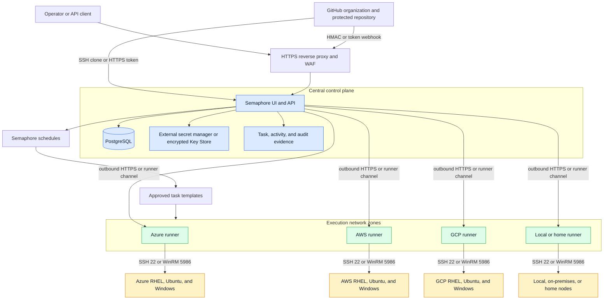
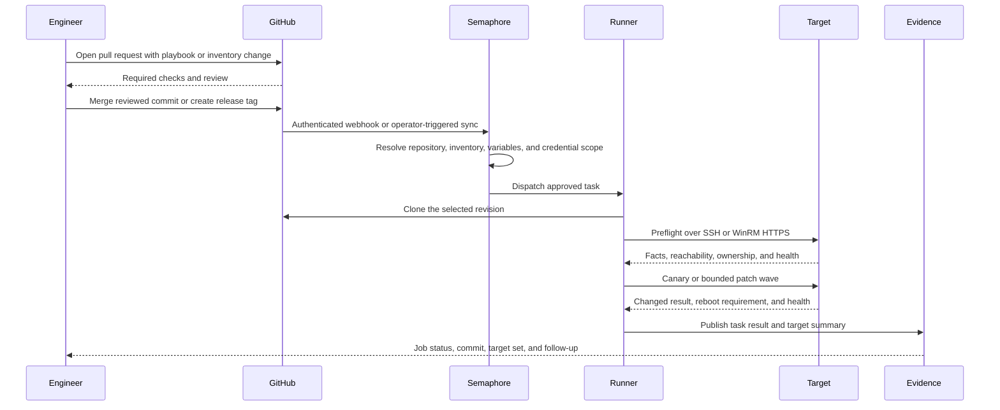

> **文档类型：** 动手实验
> **规范性术语：** **MUST**、**MUST NOT**、**SHOULD**、**SHOULD NOT** 和 **MAY** 是要求级别。
> **适用范围：** 跨 RHEL、Ubuntu、Windows WinRM、SSH、GitHub、云、本地和家庭网络目标的 Semaphore UI 和 Ansible 控制平面构建。
> **例外流程：** 偏离要求需要记录风险评估、补偿控制、指定风险负责人和到期日期。

|控制领域|价值|
|---|---|
|文件编号 | `HOL-08` |
|负责人|云卓越中心 |
|审核周期|至少每年一次，并且在 Ansible、Semaphore、提供商、安全性或源仓库发生重大变化之后 |
|证据| Git 提交、运行器和清单日志、凭证边界、任务运行、补丁金丝雀和 Wave、时间表、GitHub Webhook 和清理证据 |

# 使用 Semaphore UI 构建跨平台 Ansible 自动化控制平面

> **简要决定：** 使用 GitHub 作为经过审查的源，使用 Semaphore 作为目标感知自动化控制平面，以进行具有明确凭证、计划、批准和证据的有界、跨平台运行。

> **文档类型：** 动手实验
> **难度：** 高级
> **预计持续时间：** 6-8 小时
> **主要服务：** Semaphore UI、Ansible、GitHub、PostgreSQL、SSH、WinRM、Azure、AWS、GCP 以及本地或本地网络

> **验证边界：** 本文的结构、示例解析及语言一致性可以自动检查；真实的 RHEL、Ubuntu、Windows、Semaphore、备份恢复和应用健康结果必须在一次性实验环境中记录。机器验证不等同于已完成部署或生产验收。

## 实验室概述

### 场景

您正在为平台运营团队构建共享的自动化控制平面。该团队通过 SSH 管理 RHEL 和 Ubuntu 服务器，通过 WinRM 管理 Windows 服务器，以及位于 Azure、AWS、GCP 以及本地或家庭网络中的节点。 GitHub 是清单、Playbook、角色、测试和发布历史记录在案的真实来源。 Semaphore UI 是提供项目、仓库、加密凭证、清单、任务模板、计划、审核历史记录和 API 的控制平面。

完成的实验室必须展示一种操作模型如何管理许多节点，而不消除操作系统、连接协议、网络区域、环境或凭证边界之间的重要差异。单个 playbook 可以共享策略，但每个平台和信任边界必须保留自己的连接设置和凭证路径。

这是一个平台构建实验室，而不是针对生产运行的命令集合。使用一次性目标、隔离的 Semaphore 实例、短期凭证和明确限制的清单。只有在组织验证 Semaphore 版本、身份集成、网络控制、备份模型和运营所有权后，该架构才能升级到生产。

### 学习目标

通过完成本实验，您将能够：

1. 为多个云和本地网络区域设计 Semaphore UI 和 Ansible 控制平面。
2. 分离 Semaphore Web 和 API 层、数据库、运行器、GitHub 源和托管节点。
3. 通过靠近目标且可到达的运行器路由自动化，而无需公开暴露目标节点。
4. 通过 SSH 使用 Ansible 管理 RHEL 和 Ubuntu 节点。
5. 使用 NTLM 或 Kerberos 通过 WinRM HTTPS 通过 Ansible 管理 Windows 节点。
6. 按环境、平台、网络区域、所有权、补丁环和凭证边界对清单进行建模。
7. 安完整 GitHub、SSH、WinRM、权限升级和 Ansible Vault 凭据。
8. 通过预检查、有界波次、重启处理和后检查构建幂等 Linux 和 Windows 补丁手册。
9. 配置 Semaphore 计划和节点端 systemd 或 Windows 任务计划程序任务，而无需创建竞争的补丁机构。
10. 使用 GitHub 拉取请求、受保护的分支、标签、Webhooks 和 Semaphore 任务模板进行受控升级。
11. 采集将作业与其 Git 提交、清单、运行器、凭证身份、目标集、批准和结果连接起来的证据。
12. 测试故障处理、清理、凭证轮换、运行器丢失和恢复。

### 你将构建什么

在实验结束时，您将获取：

- 一个 GitHub 仓库，其中包含固定的 Ansible 集合、清单、角色、Playbook、测试和操作文档；
- 连接到仓库的 Semaphore UI 项目；
- Linux SSH 和 Windows WinRM 凭证边界的单独 Semaphore 清单；
- PostgreSQL 支持的 Semaphore 安装，具有加密的访问密钥和受保护的反向代理边界；
- 实验室使用的每个网络区域至少有一个运行器，以及许可版本的可选运行器标签；
- Linux 预检、补丁、验证和调度手册；
- Windows WinRM 预检、补丁、验证和调度手册；
- GitHub 集成，可以通过经过身份验证的 Webhook 触发安全的非生产自动化；
- 具有有限并发和维护窗口护栏的分阶段和生产模拟计划；和
- 验证和清理证据。

### 实验室成功标准

仅当满足以下条件时，实验室才算完成：

- 没有向 GitHub 提交目标机密、私钥、密码、令牌或证书私钥；
- 如果没有 TLS 和经过身份验证的边缘，Semaphore 服务不会直接暴露于公共互联网；
- 相同的经过审查的 Git 提交用于验证和批准的运行；
- Linux SSH 和 Windows WinRM 作业使用不同的清单和凭据，其信任要求不同；
- 运行器只能到达它需要的目标网络；
- 金丝雀或预检失败会停止下一个补丁波；
- 如果没有更改参考和明确的批准输入，修补作业将拒绝运行；
- 明确允许重新启动，或者作业失败并显示可见的挂起重新启动结果；
- 时间表使用记录在案的时区，并且不能默默地针对任意清单；
- 第二次合规运行不会造成意外的变化；和
- 清理删除实验室凭证、计划、访问授权、运行器、容器和目标更改。

### 范围和边界

本实验涵盖服务器配置和补丁编排。它不会取代：

- 漏洞扫描器、软件清单系统、CMDB 或提供商本地更新服务；
- 每个云或目录的完整身份提供商实施；
- 应用感知排空、集群仲裁管理、数据库故障转移或备份编排；
- 受支持的企业 HA 部署，除非所需的 Semaphore 版本和依赖项可用；或
- 生产紧急补丁流程。

平台团队负责控制平面、执行环境、运行队列、清单契约、凭证策略、证据保留和升级。工作负载团队负责特定于应用的角色、运行状况检查、维护影响和恢复计划。

## 目标架构

控制平面对于治理而言是集中式的，但对于执行而言是分布式的。Semaphore 存储所需的自动化定义和作业状态。运行器的执行接近目标网络。目标不需要入站互联网访问；他们只需要来自批准的运行器的协议路径及其所需的包或更新源。

**架构说明：** GitHub 提供经过审查的源代码。Semaphore 提供控制、调度、凭证、清单和审计边界。运行器提供位置和网络可达性。 SSH 和 WinRM 是目标协议，不能替代身份、授权、补丁策略或证据。

在每个运行器及其目标网络之间使用站点到站点 VPN、私有互连、零信任访问路径或其他经批准的私有管理设计。不要仅仅为了使实验变得更容易而将 Windows WinRM 侦听器或 SSH 守护程序放在公共地址上。

### 执行流程

**执行流程说明：** GitHub 事件可以请求工作，但不得选择任意凭证或生产目标。Semaphore 解析固定的模板配置，运行器执行批准的修订，并使用足够的元数据保留结果以支持审计或事件审查。

### 生产拓扑变体

|变体 |Semaphore 服务 |执行模型|正确使用|
|---|---|---|---|
|实验室|一台 Semaphore 服务器，用于实验的 PostgreSQL 或 SQLite，一台本地或全局运行器 |任务在服务器或一个运行器上运行 |仅限学习和一次性目标 |
|标准生产|一台带有外部 PostgreSQL 和多个远程运行器的强化 Semaphore 服务器 |每个可到达的网络区域中都会放置一个运行器 |具有明确维护和备份所有权的小型平台 |
|分布式生产|Semaphore 服务器、外部 PostgreSQL、远程运行器、私有管理路径 |特定区域的运行器接近目标 |多云和混合运营 |
|企业HA |负载均衡器后面的两个或多个 Semaphore 节点、共享 PostgreSQL 或 MySQL、Redis 和远程运行器 |主动-主动控制平面加上水平扩缩容的运行器 |支持的 Semaphore Enterprise HA 功能和操作模型何时获取批准 |

该实验室使用标准生产形状，但可以作为单节点版本执行。不要将单节点部署描述为高可用。在企业 HA 变体中，所有 Semaphore 节点必须共享相同的数据库、Redis 和配置，并且每个节点具有唯一的节点标识符。负载均衡器必须支持 HTTPS 和 WebSocket 流量。

### 信任和网络矩阵

|流量|方向 |端口或协议|控制|
|---|---|---|---|
|Semaphore 的 Operator|入站到边缘 | HTTPS 443 | SSO 或 MFA、RBAC、TLS、速率限制、审计日志记录 |
| GitHub webhook 到 Semaphore |入站到边缘 | HTTPS 443 | HMAC 或令牌验证、分支和事件匹配器、WAF、重放保护 |
|Semaphore 或运行器到 GitHub |出站 | HTTPS 443 或 SSH 22 |只读部署密钥或最低权限令牌、出口允许列表 |
|Semaphore 到 PostgreSQL |私有| PostgreSQL TLS |私有端点、数据库身份、受限安全组 |
|Semaphore 节点到 Redis |私有| Redis TLS |仅限企业 HA；共享受保护的 Redis |
|运行器到 Linux |私有| SSH 22 |主机密钥验证、专用账户、密钥轮换、sudo 策略 |
|运行器到 Windows |私有| WinRM HTTPS 5986 | CA 信任的证书、NTLM 或 Kerberos、最低权限管理 |
|目标更新源|出站 |批准的包或 WSUS 协议 |仓库白名单、镜像策略、更改所有权 |
|运行器到 Semaphore |出站 | HTTPS 443 | Runner 令牌、TLS、隔离执行主机 |

### 版本和功能决定

执行前记录所选的 Semaphore 版本：

- 社区或单服务器实验室：使用单个服务器和本地或全局远程运行器。请仔细隔离项目和凭据，因为控制平面边界不能替代完整的企业授权模型。
- Pro：使用项目运行器和运行器标签（如果可用）将模板绑定到可以到达其目标的网络区域和执行池。
- 企业：仅当平台所有者接受数据库、Redis、负载均衡器、许可、备份、升级和事件响应责任时才使用 HA。

如果组织需要无法由 Semaphore 团队、项目和模板权限表达的每凭据访问策略，请使用更强大的控制器产品或其他策略代理。不要通过将每个凭证放在一个共享项目中来弥补缺失的授权边界。

## 先决条件

### 账户和权限

准备：

- GitHub 组织和私有仓库权限；
- 一个用于引导的 Semaphore 管理员账户和至少两个用于恢复的项目所有者；
- 身份提供商账户（如果可以通过 OIDC、LDAP 或 Active Directory 进行 SSO）；
- PostgreSQL 数据库或运行实验室数据库容器的权限；
- 一次性 RHEL 或兼容的 Red Hat 目标、Ubuntu 目标和 Windows Server 目标；
- 仅在存在测试节点的情况下访问 Azure、AWS、GCP 或本地网络；
- 创建只读 GitHub 部署密钥、目标服务账户和临时 Secret Manager 条目的权限；
- 为运行器到目标路径创建或更新防火墙规则的权限；和
- 清理所有者，可以撤销凭据并删除测试资源。

请勿在本实验室中使用生产管理员密码、生产 SSH 私钥、可复用的云根凭证或生产清单。

### 工具

在控制平面引导主机或操作员工作站上安装：
```powershell
gh --version
gh auth status
git --version
ssh -V
python --version
ansible-playbook --version
ansible-galaxy --version
docker version
docker compose version
openssl version
```
在每个 Ansible 运行器上安装：

- Python 和已批准的 Ansible-core 版本；
- pywinrm 用于 WinRM 管理；
- 使用 Kerberos 时的 pywinrm[kerberos] 和 Kerberos 客户端库；
- collections/requirements.yml 中列出的集合；
- OpenSSH 客户端和组织批准的 CA 或已知主机文件；
- 仅当使用提供商清单插件时才依赖云 CLI 或 SDK；和
- 具有可信时间源的时间同步客户端。

本实验在 Git 中固定集合版本，并约束 Ansible core 的版本范围。将剩余范围解析为批准的依赖锁定文件，记录 Python 版本，并在晋级前测试该准确的运行环境。

### 实验室目标设定

尽可能使用至少三个目标：

|目标|示例组|协议|所需证据|
|---|---|---|---|
| RHEL 8、9 或兼容版 |RHEL | SSH 22 |事实、包管理器、重启测试、幂等性 |
| Ubuntu 22.04 或 24.04 | ubuntu | SSH 22 |事实、包管理器、重启测试、幂等性 |
| Windows Server 2019 或更高版本 |Windows | WinRM HTTPS 5986 | TLS 信任、win_ping、更新结果、重启和服务运行状况 |

仅当运行器具有经过测试的私有路径时，才为每个云或本地网络添加一个目标。该架构支持许多节点，但实验室必须限制目标数量和补丁范围。

### 实验室惯例

- 命令是为 PowerShell 或 Bash 编写的，如代码块语言所示。
- 在执行前替换尖括号中的每个值。
- 将所有机密保存在 Secret Manager 或 Semaphore 密钥存储中。切勿将机密值放入清单、提交给 Git 的变量组、任务参数或调试输出中。
- 使用 main 作为受保护的默认分支和用于批准更改的不可变发布标签。
- 在每个**模块检查点**停止。检查点失败后继续操作会导致错误加剧，并且可能使网络或凭证故障看起来像是 Playbook 缺陷。
- 在证据字段中使用 UTC，并且仅针对面向人类的时间表日志记录本地时区。

## 实验室模块

|模块|活动 |检查站|
|---:|---|---|
| 0 |定义控制平面契约和拓扑 |记录所有权、信任边界、目标范围和清理计划。 |
| 1 |创建 GitHub 源仓库 |存在受保护的分支、仓库结构、测试和集合引脚。 |
| 2 |安装并强化 Semaphore UI |服务、数据库、加密、反向代理和备份已配置。 |
| 3 |部署网络区域运行器 |每个运行器只能到达其预期的网络并报告健康状况。 |
| 4 |引导目标访问 | Linux SSH 和 Windows WinRM HTTPS 通过连接和权限检查。 |
| 5 |模型清单和变量 |平台、环境、区域、所有权、补丁环和连接设置都是明确的。 |
| 6 |注册 GitHub、凭据和 Semaphore 对象 |仓库、Key Vault、清单、变量组、模板和团队是有限的。 |
| 7 |实施和测试 Ansible Playbook |预检、修补、验证和调度 playbook 通过语法和 lint 检查。 |
| 8 |运行金丝雀和有界补丁波 |金丝雀故障会停止升级，并且合规的重新运行是幂等的。 |
| 9 |配置计划和 GitHub 集成 |计划的和 Webhook 触发的执行经过身份验证和约束。 |
| 10 | 10采集证据、恢复和清理 |证据完整，实验室访问权限已被删除或恢复。 |

## 模块 0：定义控制平面契约

### 模块目标

在将服务器添加到控制平面之前，编写所有项目和目标都必须遵循的一小组规则。

### 任务0.1：定义元数据契约

每个主机都必须具有以下非机密属性：

|属性 |示例|目的|
|---|---|---|
| `target_environment` | development、test、staging、production | 环境晋级与访问边界 |
| `cloud` | azure、aws、gcp、local | 所有权和路由 |
| `network_zone` | azure-private-east | 运行器位置和防火墙范围 |
| `platform` | rhel、ubuntu、windows | Playbook 选择和补丁策略 |
| `target_transport` | ssh、winrm | 协议和凭据类型 |
| `owner` | platform-lab | 责任与审批流程 |
| `criticality` | low、medium、high | 补丁批次与恢复策略 |
| `patch_ring` | canary、ring-1、ring-2 | 分批发布 |
| `maintenance_window` | Sunday 02:00-04:00 America/New_York | 调度与批准 |
| `managed` | true（布尔值） | 明确纳入自动化 |

不要仅从主机名或云订阅推断生产成员身份。明确环境和所有权价值，并在执行变更 Play 之前对其进行验证。

### 任务 0.2：定义控制平面所有权

日志记录：

- Semaphore 和 PostgreSQL 的平台所有者；
- GitHub 仓库所有者和所需的审阅者；
- 每个网络区域的运行器所有者；
- Linux 和 Windows 身份所有者；
- 包、仓库和 WSUS 所有者；
- 更改批准者和紧急访问所有者；
- 证据保留和出口目的地；
- 每波并行任务和目标的最大数量；和
- 重新启动失败、包事务或 WinRM 中断的恢复所有者。

### 模块检查点

- [ ] 拓扑图命名每个控制平面组件和运行器区域。
- [ ] 每个测试主机都有一个指定的所有者、环境、平台、连接和补丁环。
- [ ] 记录目标 CIDR 和运行器出口路径。
- [ ] 清理可以识别实验室创建的每个资源、机密、访问授权、计划和目标更改。

## 模块 1：创建 GitHub 源仓库

### 模块目标

创建私有 GitHub 仓库，并将 Git 确立为自动化内容的真实来源。 GitHub 存储来源和审查证据；它不存储 Semaphore 使用的目标凭据。

### 任务 1.1：创建或连接仓库

如果 RHEL 管理节点已有可用的 Ansible 环境，GitHub 上已有 `ansible-management` 等仓库，请直接复用，跳过下面的建库命令，在模块 6 中注册现有仓库。Semaphore 的 Repository 是指向现有 Git 源的控制器配置对象，不需要再创建 `semaphore-management` 仓库。将本实验的所有权、评审、依赖和凭据控制应用于现有内容。

已有的 `/home/semaphore/ansible-management` 可以保留，用于手工测试、故障排查以及 CLI 与控制器结果对比。Semaphore 任务应通过 GitHub Repository 对象在自己的任务工作目录中获取已评审的内容，不应依赖管理员对该可选本地副本执行 `git pull`。不要为了套用示例结构而删除或覆盖现有 Playbook、角色、清单或变量文件。

对于新的空仓库：
```powershell
$org = "<github-organization>"
$repo = "ansible-automation-control-plane"

gh repo create "$org/$repo" --private --description "Cross-platform Ansible automation control plane"
gh repo clone "$org/$repo"
Set-Location $repo
```
对于已包含初始文件的现有本地工作区：
```powershell
$org = "<github-organization>"
$repo = "ansible-automation-control-plane"

gh repo create "$org/$repo" --private --source=. --remote=origin --push
```
确认仓库和身份验证：
```powershell
gh repo view "$org/$repo" --web
gh auth status
git remote -v
git status --short
```
使用 GitHub 组织部署密钥或 GitHub 应用进行 Semaphore 仓库访问。实验室可以接受个人访问令牌，但它必须是短暂的、尽可能只读的，并且仅存储在 Semaphore 密钥存储中。

### 任务1.2：保护默认分支

通过 GitHub 组织策略或仓库设置配置仓库：

- 合并前需要拉取请求；
- 要求至少进行一项平台所有者审查和一项自动化所有者审查以更改清单、凭证、Playbook 或工作流程配置；
- 要求通过所有 lint、语法、单元和机密扫描检查；
- 防止主干上的强制推送和分支删除；
- 限制谁可以创建用于生产晋级的发布标签；
- 当组织负责该控制权时，需要签名的提交或签名的标签；和
- 使用 CODEOWNERS 按平台和环境路由更改。

不要直接从任意分支、拉取请求或分叉运行生产 Semaphore 任务。拉取请求验证可以仅使用一次性目标和只读凭证。

### 任务1.3：创建仓库结构

使用使连接边界、平台策略、可复用角色和任务入口点易于查看的布局：
```text
ansible-automation-control-plane/
|-- ansible.cfg
|-- requirements.txt
|-- collections/requirements.yml
|-- .ansible-lint
|-- .gitignore
|-- inventories/
|   |-- azure/development/linux-ssh.yml
|   |-- azure/development/windows-winrm.yml
|   |-- aws/staging/linux-ssh.yml
|   |-- gcp/production/linux-ssh.yml
|   |-- local/test/windows-winrm.yml
|-- playbooks/
|   |-- group_vars/all.yml
|   |-- group_vars/linux.yml
|   |-- group_vars/windows.yml
|   |-- host_vars/
|   |-- preflight.yml
|   |-- site.yml
|   |-- patch-linux.yml
|   |-- patch-windows.yml
|   |-- validate.yml
|   |-- schedule-tasks.yml
|-- roles/
|   |-- linux-maintenance/
|   |-- windows-maintenance/
|-- tests/
|   |-- test_inventory_contract.py
|   |-- test_playbooks.sh
|-- .github/
|   |-- CODEOWNERS
|   |-- workflows/validate-ansible.yml
|-- README.md
```
请勿提交从 Semaphore 导出的 Secrets/、私钥、Vault-password-file、*.retry、*.log、*.json、包含敏感地址的生成清单或缓存的仓库内容。

### 任务 1.4：固定 Ansible 依赖项

集合/requirements.yml：
```yaml
---
collections:
  - name: ansible.windows
    version: "3.7.0"
  - name: community.windows
    version: "3.3.0"
```
要求.txt：
```text
# Replace these constraints with the versions approved and tested by your platform team.
ansible-core>=2.19,<2.20
ansible-lint>=25,<26
pywinrm>=0.4,<1.0
# Install the following only when Kerberos is used by the Windows inventory:
# pywinrm[kerberos]>=0.4,<1.0
```
在运行器上安装并记录结果：
```bash
python -m pip install --upgrade pip
python -m pip install -r requirements.txt
ansible-galaxy collection install --requirements-file collections/requirements.yml
ansible-galaxy collection list
ansible-playbook --version
```
对于受控的生产构建，请在 CI 中解决这些约束，扫描生成的依赖项，并将经过测试的运行器镜像或包环境晋级为不可变的制品。不允许无人值守作业在生产运行期间下载新的集合版本。

### 任务 1.5：配置 Ansible 默认值

Ansible.cfg：
```ini
[defaults]
host_key_checking = True
interpreter_python = auto_silent
retry_files_enabled = False
timeout = 30
forks = 20
stdout_callback = default
bin_ansible_callbacks = True
deprecation_warnings = True

[ssh_connection]
pipelining = True
```
将清单选择保留在 Semaphore 任务模板或显式命令行参数中。不要将生产清单路径放在共享的全局配置中，这样开发人员任务可能会意外地重用它。

### 模块检查点
```bash
ansible-lint playbooks
ansible-playbook --syntax-check playbooks/preflight.yml -i inventories/azure/development/linux-ssh.yml
git diff --check
git status --short
```
- [ ] 仓库是私有的，默认分支受到保护。
- [ ] 依赖文件经过审核并受策略固定或约束。
- [ ] 机密扫描未发现任何凭证信息。
- [ ] 清单和 Playbook 更改包含 CODEOWNERS 范围。

## 模块 2：安装并强化 Semaphore UI

### 模块目标

以可重复的方式安装 Semaphore，保护其数据库和加密材料，并将 UI 和 API 置于经过身份验证的 HTTPS 边缘后面。

选择一种安装路径：任务 2.1–2.3 使用 Compose；下面的 RHEL 原生安装路径复用主机已有的 Ansible 环境。两种路径都继续执行任务 2.4–2.5，配置 HTTPS、备份和恢复。不要同时启动两套监听 3000 端口的服务。原生单节点实验中，如果服务账户能访问批准的目标，可以使用本地执行；需要独立网络区域运行器时再执行模块 3。

### RHEL 原生安装：安装 RPM 并配置服务账户

按照[软件包安装说明](https://semaphoreui.com/docs/admin-guide/installation/package-manager)操作。以下 x86-64 示例保留 `2.18.29` 基线；安装前应对照[该版本发布页](https://github.com/semaphoreui/semaphore/releases/tag/v2.18.29)验证资产及校验和，并记录组织批准的版本。其他架构请选择匹配的软件包。

```bash
sudo dnf install -y \
  https://github.com/semaphoreui/semaphore/releases/download/v2.18.29/semaphore_2.18.29_linux_amd64.rpm
semaphore version
command -v semaphore
```

root 负责安装和维护；独立的 `semaphore` 账户负责运行服务及本地 Ansible 任务。如果软件包或此前部署已创建该账户，应检查并复用，不要重复创建。否则执行：

```bash
sudo useradd --create-home --home-dir /home/semaphore --shell /bin/bash semaphore
sudo install -d -o semaphore -g semaphore -m 0750 \
  /etc/semaphore /var/lib/semaphore /var/lib/semaphore/tmp
```

不要递归修改现有 Ansible 工作副本、虚拟环境或共享数据目录的所有权。只授予服务身份所需的访问权限。主机上的 Ansible 安装及其依赖仍由管理员或发布流水线维护。

### RHEL 原生安装：验证执行环境并初始化

以服务账户验证运行环境，不要只检查 root 或管理员的交互式环境：

```bash
sudo -u semaphore -H bash
command -v ansible
command -v ansible-playbook
ansible --version
git --version
exit
```

如果 Ansible 位于 Python 虚拟环境中，请在下面的 systemd PATH 中使用该环境实际的 `bin` 目录，并使用相同 PATH 重新检查。验证该运行环境中的解释器、集合、角色、Git/SSH 信任及 WinRM Python 依赖。在 root 的 Python 环境中安装依赖，并不代表服务或远程运行器可以使用它们。

以服务账户交互式初始化：

```bash
sudo -u semaphore -H bash
cd /home/semaphore
umask 077
semaphore setup
exit
```

将配置保存到 `/etc/semaphore/config.json`，临时任务目录设为 `/var/lib/semaphore/tmp`。如果初始化程序把 `config.json` 写入当前目录，应以 `0600` 权限将生成文件安装到目标位置，不要留下第二份未受保护的副本。多用户或接近生产拓扑的实验使用 PostgreSQL。所选构建支持 SQLite 时，小型单节点实验可选用它，将数据库放在 `/var/lib/semaphore` 下，并记录一致性备份和恢复方法；这不满足本实验的 PostgreSQL 生产拓扑检查项。

启动前，将配置中的 `interface` 设为 `127.0.0.1`，`port` 设为 `:3000`，`tmp_path` 设为 `/var/lib/semaphore/tmp`。保留生成的数据库凭据、Cookie 密钥和访问密钥加密材料；不要将其粘贴到 Git 或任务输出。参见[配置参考](https://semaphoreui.com/docs/admin-guide/configuration)。

```bash
sudo chown semaphore:semaphore /etc/semaphore/config.json
sudo chmod 0600 /etc/semaphore/config.json
```

### RHEL 原生安装：配置 systemd 并验证访问

添加服务前先检查 `systemctl cat semaphore`。如果软件包已提供 unit，应通过评审后的 override 调整，不要启动第二个服务。否则创建 `/etc/systemd/system/semaphore.service`：

```ini
[Unit]
Description=Semaphore UI
Wants=network-online.target
After=network-online.target

[Service]
Type=simple
User=semaphore
Group=semaphore
WorkingDirectory=/var/lib/semaphore
Environment="HOME=/home/semaphore"
Environment="PATH=/usr/local/sbin:/usr/local/bin:/usr/sbin:/usr/bin:/bin"
ExecStart=/usr/bin/semaphore server --config /etc/semaphore/config.json
UMask=0077
Restart=on-failure
RestartSec=10

[Install]
WantedBy=multi-user.target
```

如果 `command -v semaphore` 返回其他路径，请替换 `/usr/bin/semaphore`。对于 `/opt/ansible-venv` 这样的虚拟环境，将 `/opt/ansible-venv/bin` 放在 unit 的 PATH 最前面；systemd 不会加载交互式 Shell 的激活文件。确认服务账户能遍历并执行该路径。本路径以 `semaphore` 执行自动化，不长期使用 root。

```bash
sudo systemctl daemon-reload
sudo systemctl enable --now semaphore
systemctl status semaphore --no-pager
sudo journalctl -u semaphore -n 50 --no-pager
curl --fail http://127.0.0.1:3000/api/ping
sudo ss -ltnp
```

确认 3000 端口只绑定回环地址。初次访问时，从工作站使用批准的 SSH 管理身份建立隧道：

```bash
ssh -N -L 8080:127.0.0.1:3000 <admin-user>@<RHEL-IP>
```

在本地打开 `http://127.0.0.1:8080`，随后按任务 2.4 配置 HTTPS 反向代理。不要添加宽泛的 `firewall-cmd --add-port=3000/tcp` 规则或暴露明文管理入口。仅允许批准的管理网络访问 HTTPS。本路径使用原生 PostgreSQL 备份工具，替代任务 2.5 中仅适用于 Compose 的 `docker compose exec` 示例。

**原生路径检查点：** 服务重启后正常运行，使用独立账户和预期的 Ansible 环境，本地健康检查成功，配置受保护，并已验证数据库备份。选择远程执行时，在模块 3 中以实际运行器身份重新验证依赖和连接。

### 任务2.1：准备实验室主机

为 Semaphore 创建专用主机或 VM。它必须有：

- 支持的 Linux 发布版或其他支持的 Semaphore 主机平台；
- 数据库和备份的加密持久存储；
- 仅允许管理和运行器流量的安全组；
- NTP 同步时钟；
- 与主机分离的备份目的地；
- 用于本实验室的 Docker 引擎和 Compose，或用于生产的受支持的包或 Kubernetes 部署；和
- 主机名，例如 semaphore.<approved-domain> 以及由批准的 CA 颁发的证书。

对于实验室，将容器绑定到 localhost 并在反向代理处终止 TLS。不要将应用直接绑定到公共接口上的 0.0.0.0:3000。

### 任务2.2：创建机密文件

在生产中使用 Secret Manager 或 Docker Secrets。对于一次性 Compose 实验室，创建本地机密文件并确认该目录被 Git 忽略：
```bash
umask 077
mkdir -p secrets
openssl rand -base64 32 > secrets/db_password
openssl rand -base64 32 > secrets/admin_password
openssl rand -base64 32 > secrets/access_key_encryption
chmod 0400 secrets/*
printf "secrets/\n" >> .gitignore
```
访问密钥加密值保护 Semaphore 存储的凭据。通过组织的机密管理流程来支持它。丢失它可能会使存储的密钥无法恢复。在未遵循 Semaphore 加密密钥轮换和备份过程的情况下，切勿轮换或删除它。

### 任务 2.3：运行实验室 Compose 部署

在实验室主机上创建 docker-compose.yml。将应用和数据库镜像固定到实验室批准的版本；不要将最新版本用于生产部署。
```yaml
services:
  postgres:
    image: postgres:16
    restart: unless-stopped
    environment:
      POSTGRES_DB: semaphore
      POSTGRES_USER: semaphore
      POSTGRES_PASSWORD_FILE: /run/secrets/db_password
    volumes:
      - semaphore-postgres:/var/lib/postgresql/data
    secrets:
      - db_password
    healthcheck:
      test: ["CMD-SHELL", "pg_isready -U semaphore -d semaphore"]
      interval: 10s
      timeout: 5s
      retries: 10

  semaphore:
    image: semaphoreui/semaphore:v2.18.29
    restart: unless-stopped
    ports:
      - "127.0.0.1:3000:3000"
    environment:
      SEMAPHORE_DB_USER: semaphore
      SEMAPHORE_DB_PASS_FILE: /run/secrets/db_password
      SEMAPHORE_DB_HOST: postgres
      SEMAPHORE_DB_PORT: "5432"
      SEMAPHORE_DB_DIALECT: postgres
      SEMAPHORE_DB: semaphore
      SEMAPHORE_TMP_PATH: /tmp/semaphore
      SEMAPHORE_ADMIN_PASSWORD_FILE: /run/secrets/admin_password
      SEMAPHORE_ADMIN_NAME: admin
      SEMAPHORE_ADMIN_EMAIL: <platform-admin-email>
      SEMAPHORE_ADMIN: admin
      SEMAPHORE_ACCESS_KEY_ENCRYPTION_FILE: /run/secrets/access_key_encryption
      SEMAPHORE_USE_REMOTE_RUNNER: "true"
      SEMAPHORE_SCHEDULE_TIMEZONE: America/New_York
      SEMAPHORE_MAX_PARALLEL_TASKS: "20"
      SEMAPHORE_MAX_TASKS_PER_TEMPLATE: "100"  # Retained history, not execution concurrency.
      TZ: UTC
    secrets:
      - db_password
      - admin_password
      - access_key_encryption
    volumes:
      - semaphore-config:/etc/semaphore
    depends_on:
      postgres:
        condition: service_healthy

volumes:
  semaphore-postgres:
  semaphore-config:

secrets:
  db_password:
    file: ./secrets/db_password
  admin_password:
    file: ./secrets/admin_password
  access_key_encryption:
    file: ./secrets/access_key_encryption
```
_FILE 形式将机密值保留在 Compose 文件之外。确认所选 Semaphore 镜像支持每个配置变量的文件形式。如果没有，请使用受保护的配置文件或该版本记录在案的机密机制。

固定版本的服务器启动脚本支持上述三个机密文件变量。本例不使用 `SEMAPHORE_RUNNER_REGISTRATION_TOKEN_FILE`：它属于运行器注册配置，并不是服务器共享令牌的文件加载器。按模块 3 通过 UI 为每个运行器创建独立令牌。`SEMAPHORE_MAX_TASKS_PER_TEMPLATE` 控制保留的任务历史数量，不控制执行并发。持久化 `/etc/semaphore`，因为生成配置还包含其他身份验证机密。启动前对照容器实际 UID 检查机密文件所有权；Compose 基于文件的 secrets 不能可靠地重新映射主机所有权。不要通过允许所有用户读取机密来解决权限问题。记录应用及 PostgreSQL 镜像摘要以便重现。参见[固定版本的服务器启动脚本](https://github.com/semaphoreui/semaphore/blob/v2.18.29/deployment/docker/server/server-wrapper)。

启动并检查服务：
```bash
docker compose config
docker compose up -d
docker compose ps
docker compose logs --tail=100 semaphore
curl --fail http://127.0.0.1:3000/api/ping
```
完成首次运行设置并立即将引导密码替换为组织的身份集成。至少创建两名所有者，以便一名不可用的管理员无法将团队锁定。

### 任务2.4：添加反向代理边界

反向代理必须：

- 将 HTTP 重定向到 HTTPS；
- 验证 Semaphore 服务器证书并使用批准的 TLS 策略；
- 保留 /api/ws 的 WebSocket 升级标头；
- 设置原始主机和协议头；
- 限制对经批准的身份或网络条件的管理访问；
- 对 webhook 端点进行速率限制；
- 记录请求标识符而不记录机密；和
- 仅转发 Semaphore 所需的路径。

当通过批准的中继实现 GitHub Webhook 传递时，请使用私有 DNS 名称和私有负载均衡器。如果需要公共 Webhook 端点，请仅公开边缘，保持 Semaphore 端口私有，验证 HMAC 或令牌身份验证，并且不要单独依赖源 IP 白名单。

### 任务2.5：配置数据库备份和升级控制

添加凭据之前测试备份和恢复：
```bash
docker compose exec -T postgres pg_dump -U semaphore -d semaphore > semaphore-lab.sql
sha256sum semaphore-lab.sql
```

导出前执行 `umask 077`，将备份保存在内容仓库之外。校验和只能证明文件完整，不能证明可恢复。在第二台隔离的恢复主机上，阻断目标和 Webhook 连接，使用相同的 Compose 定义及镜像版本，仅启动 PostgreSQL。保持应用停止，将备份导入新建的空数据库：

```bash
# Recovery host only: a fresh Compose project, with approved secret files present.
umask 077
docker compose -p semaphore-restore up -d postgres
docker compose -p semaphore-restore exec -T postgres \
  pg_isready -U semaphore -d semaphore
docker compose -p semaphore-restore exec -T postgres \
  psql -v ON_ERROR_STOP=1 -U semaphore -d semaphore < semaphore-lab.sql
```

等待 PostgreSQL 就绪再导入。从受保护的备份恢复匹配的 `/etc/semaphore` 配置卷及加密材料，然后启动隔离应用。禁用恢复后的计划和集成，再检查登录、项目、清单、模板、历史，并通过一次性只读探测验证凭据解密。不要将恢复后的控制器连接到生产运行器。记录备份时间、恢复的数据时间、恢复耗时及结果。只有数据库而没有原始加密密钥，无法恢复加密凭据。原生 PostgreSQL 使用相同的空库恢复模式及原生工具，禁止将备份直接导入线上数据库。
对于生产，请使用托管 PostgreSQL 或单独运行的 PostgreSQL 服务，并提供加密备份、需要的时间点恢复、监控和经过测试的恢复 Runbook。一起备份 Semaphore 配置、加密密钥、数据库数据、反向代理配置和运行器注册记录。针对数据库副本测试升级并在迁移之前进行可恢复的备份。

### 模块检查点

- [ ] Semaphore 只能通过预期的边缘到达。
- [ ] PostgreSQL 数据和备份位于持久受保护存储上。
- [ ] 机密文件不会被 Git 跟踪，并且具有限制性权限。
- [ ] 访问密钥加密材料通过批准的流程进行备份。
- [ ] WebSocket 连接通过反向代理工作。
- [ ] 已记录数据库恢复测试。

## 模块 3：部署网络区域运行器

### 模块目标

将任务执行放置在可以达到预期目标的位置，同时保持中央控制平面独立于每个私有网络。

### 任务 3.1：选择运行器的位置

在每个网络区域中部署一个无法从其他区域安全到达的运行器。典型区域有：

|运行器|放置位置|目标可达性|示例标签|
|---|---|---|---|
|`runner-azure-private`|Azure 管理子网|Azure 私有 VM 地址和 Semaphore HTTPS|`azure-private`|
|`runner-aws-private`|AWS 管理子网|AWS 私有实例地址和 Semaphore HTTPS|`aws-private`|
|`runner-gcp-private`|GCP 管理子网|GCP 内部地址和 Semaphore HTTPS|`gcp-private`|
|`runner-local`|本地或家庭管理主机|本地目标地址和 Semaphore HTTPS|`local`|

运行器应通过 HTTPS 启动与 Semaphore 的连接。运行器应启动与目标的 SSH 或 WinRM 连接。此模型避免从公共互联网打开入站管理端口，但目标网络仍然需要显式的出口和路由控制。

### 任务 3.2：安装并注册运行器

在运行器上安装相同的已批准 Semaphore 版本及 Ansible 依赖。在 UI 的 Runners 页面创建指定项目/网络区域的运行器，并通过机密通道获取它独有的令牌。运行下面的 setup 时，选择已有 Runner token，输入 HTTPS 控制器地址及该令牌。此路径不需要服务器级共享注册令牌，也不假定令牌自动过期。
```bash
# On a dedicated runner host; reuse an existing account only after reviewing it.
getent passwd semaphore >/dev/null || sudo useradd --system --create-home \
  --home-dir /var/lib/semaphore-runner --shell /usr/sbin/nologin semaphore
sudo install -d -m 0750 -o semaphore -g semaphore \
  /etc/semaphore /var/lib/semaphore-runner /var/lib/semaphore-runner/tmp
sudo -u semaphore semaphore runner setup --config /etc/semaphore/runner.json
sudo chmod 0600 /etc/semaphore/runner.json
```
使用运行器 CLI 或 Semaphore UI 分配描述性名称。在支持运行器标签的版本中，需要相应任务模板中的标签。在没有标签的版本中，使用单独的 Semaphore 实例或另一个受支持的项目运行器边界来隔离网络区域，而不是允许通用运行器接收每个生产任务。

将 setup 的 `tmp_path` 设为 `/var/lib/semaphore-runner/tmp`，HOME、集合路径和 SSH 信任也应位于服务可访问的位置。确认配置及令牌由 `semaphore` 拥有且权限为 `0600`。unit 中的二进制和虚拟环境路径必须替换为实际路径；`ProtectHome=true` 会阻止访问 `/home` 下的依赖。本例通过 UI 创建令牌；CLI 注册仅在另外配置并保护服务器注册令牌时使用。参见[运行器说明](https://semaphoreui.com/docs/admin-guide/runners)。

### 任务 3.3：将运行器作为服务运行

创建一个没有交互式 shell 和不相关管理权限的服务账户。 Linux systemd 单元可以使用以下形状：
```ini
[Unit]
Description=Semaphore remote runner
After=network-online.target
Wants=network-online.target

[Service]
User=semaphore
Group=semaphore
WorkingDirectory=/var/lib/semaphore-runner
Environment="HOME=/var/lib/semaphore-runner"
Environment="PATH=/opt/ansible-venv/bin:/usr/local/bin:/usr/bin:/bin"
ExecStart=/usr/local/bin/semaphore runner start --config /etc/semaphore/runner.json
Restart=on-failure
RestartSec=10
UMask=0077
NoNewPrivileges=true
PrivateTmp=true
ProtectSystem=strict
ProtectHome=true
ReadWritePaths=/var/lib/semaphore-runner

[Install]
WantedBy=multi-user.target
```
验证服务和运行器的运行状况：
```bash
sudo systemctl daemon-reload
sudo systemctl enable --now semaphore-runner.service
sudo systemctl status semaphore-runner.service --no-pager
sudo journalctl -u semaphore-runner.service -n 100 --no-pager
```
必须使用所选的 Semaphore 版本和 Playbook 来测试沙箱设置。运行器仍然需要能够克隆仓库、加载其密钥、读取其信任存储、创建临时文件以及连接到目标。

### 任务 3.4：配置运行器网络访问

每个运行器的测试：
```bash
curl --fail https://semaphore.<approved-domain>/api/ping
nc -zvw5 <linux-private-address> 22
nc -zvw5 <windows-private-address> 5986
ssh -o BatchMode=yes -o StrictHostKeyChecking=yes automation@<linux-private-address> true
```
如果适用，日志记录来自 Windows 运行器的等效防火墙测试：
```powershell
Test-NetConnection semaphore.<approved-domain> -Port 443
Test-NetConnection <linux-private-address> -Port 22
Test-NetConnection <windows-private-address> -Port 5986
```
### 模块检查点

- [ ] 每个运行器都有一个所有者和一个网络区域描述。
- [ ] 运行器通过 HTTPS 连接到 Semaphore，并且未使用共享永久令牌进行注册。
- [ ] 运行器到目标的防火墙规则是明确且最少的。
- [ ] 任务模板可以限制为能够到达其清单的运行器。
- [ ] 停止的运行器会产生可见的失败或排队任务，而不是未跟踪的执行。

## 模块 4：引导目标访问

### 模块目标

在第一个 Ansible 任务之前准备专用目标身份并保护 SSH 或 WinRM 端点。

### 任务 4.1：创建 Linux 自动化身份

在 RHEL 和 Ubuntu 上创建专用账户。实验室可以使用临时的广泛权限策略，但生产环境必须使用经过审查的 sudo 策略，并在可行的情况下使用单独的只读、配置和修补身份。

每个 Linux 目标上的示例实验室引导程序：
```bash
sudo groupadd --system automation 2>/dev/null || true
sudo useradd --system --create-home --shell /bin/bash --gid automation automation 2>/dev/null || true
sudo install -d -o automation -g automation -m 0700 /home/automation/.ssh
sudo install -o automation -g automation -m 0600 /tmp/automation_authorized_keys /home/automation/.ssh/authorized_keys
printf 'automation ALL=(ALL) NOPASSWD: ALL\n' | sudo tee /etc/sudoers.d/automation-lab >/dev/null
sudo chmod 0440 /etc/sudoers.d/automation-lab
sudo visudo -cf /etc/sudoers.d/automation-lab
```
在生产前替换 lab sudoers 条目。至少，确认最终策略支持包管理器、服务管理器、重新启动路径、事实收集、临时模块执行以及角色使用的任何特定于提供程序的操作。使用非生产账户测试策略并记录其审核。

在目标上或通过批准的镜像基线强化 SSH：

- 对可用密钥验证的自动化账户禁用密码验证；
- 禁用直接 root 登录；
- 将账户限制为所需的源 CIDR 或管理安全组；
- 保留主机密钥并从运行器处验证它们；
- 使用集中管理的 SSH CA 或已知主机文件（如果可用）；和
- 通过 Secret Manager 和 Semaphore 密钥存储轮换密钥。

### 任务 4.2：通过 HTTPS 配置 Windows WinRM

使用 CA 颁发的服务器证书，其名称与清单地址匹配。自签名证书仅应用于在运行器上安装了 CA 证书的独立实验室。不要在未加密的 HTTP 上使用基本身份验证。

在一次性 Windows 目标上，引导程序可能如下所示：
```powershell
# Run in an elevated console on the disposable target.
$labDnsName = 'win-test-01.example.internal'
$labThumbprint = 'REPLACE_WITH_ENROLLED_SERVER_CERTIFICATE_THUMBPRINT'
$labRunnerCidr = 'REPLACE_WITH_ACTUAL_RUNNER_EGRESS_CIDR'
$labCert = Get-Item "Cert:\LocalMachine\My\$labThumbprint"
if (-not $labCert.HasPrivateKey -or $labCert.NotAfter -le (Get-Date)) {
  throw 'A valid server certificate with a private key is required.'
}
Set-Service -Name WinRM -StartupType Automatic
Start-Service -Name WinRM
Enable-PSRemoting -Force
Set-Item WSMan:\localhost\Service\AllowUnencrypted -Value $false
Set-Item WSMan:\localhost\Service\Auth\Basic -Value $false
Set-Item WSMan:\localhost\Service\Auth\CredSSP -Value $false
New-Item -Path WSMan:\localhost\Listener -Transport HTTPS -Address * `
  -CertificateThumbPrint $labCert.Thumbprint -HostName $labDnsName -Force
New-NetFirewallRule -Name 'Semaphore-Lab-WinRM-HTTPS' `
  -DisplayName 'Semaphore lab WinRM HTTPS' -Direction Inbound -Action Allow `
  -Protocol TCP -LocalPort 5986 -RemoteAddress $labRunnerCidr
Get-WSManInstance -ResourceURI winrm/config/listener -Enumerate
```
对于工作组实验室，请通过 HTTPS 侦听器使用具有 NTLM 的临时本地管理员，并将证书链放置在运行器信任存储中。对于加入域的生产 Windows，首选具有同步时钟、正确的 DNS、约束委派规则（如果需要）以及域管理的服务账户的 Kerberos。除非已批准记录在案的双跃点要求，否则请勿启用 CredSSP。

ansible.windows.win_updates 要求连接用户是本地管理员组的成员。使用仅具有补丁和验证契约所需权限的专用账户。将其密码存储在外部 Secret Manager 或 Semaphore 密钥存储中，而不是存储在清单或 GitHub 机密中。

运行前核对证书的 DNS SAN 与 Server Authentication 用途，并将公开的 CA 链安装到执行环境。`Enable-PSRemoting` 可能创建 HTTP 监听器和防火墙规则；确认 HTTPS 连通后，在专用实验目标上删除不需要的 HTTP 监听器/规则，不修改共享管理通道。已有 HTTPS 监听器或同名规则时先检查并复用。不要通过关闭证书验证解决信任问题。

### 任务4.3：测试协议可达性

来自具有最终信任存储和凭证的运行器：
```bash
ansible -i inventories/azure/development/linux-ssh.yml linux -m ansible.builtin.ping
ansible -i inventories/local/test/windows-winrm.yml windows -m ansible.windows.win_ping
```
对于 Windows 目标，请在调用 Ansible 之前确认端点和证书：
```powershell
Test-WSMan -ComputerName <windows-private-name> -Port 5986 -UseSSL
```
### 模块检查点

- [ ] Linux ansible.builtin.ping 通过 SSH 工作并进行主机密钥验证。
- [ ] Windows ansible.windows.win_ping 通过 WinRM HTTPS 工作。
- [ ] WinRM 证书验证在生产型清单中验证。
- [ ] 命令历史记录、仓库或作业日志中没有出现目标账户密码或私钥。
- [ ] Linux sudo 和 Windows 管理员权限已记录并有时间限制。

## 模块 5：模型清单和变量

### 模块目标

创建明确、可审查且可以安全绑定到 Semaphore 任务模板的清单。建议的边界是每个环境、网络区域、平台和连接凭据一个清单。

Semaphore 清单具有凭证关联。因此，当平台需要不同的密钥、用户或协议时，混合 Linux 和 Windows 清单可能会创建不安全或不可能的凭据边界。首选单独的清单和模板，然后通过操作员操作手册或批准的流水线来协调它们。

元数据使用 `target_environment` 和 `target_transport`，避免与 Ansible 保留字 `environment`、`connection` 冲突。已有清单迁移时，应同时更新验证和生成逻辑，保留原有环境/协议语义。

### 任务 5.1：创建 Linux SSH 清单

清单/azure/development/linux-ssh.yml：
```yaml
---
all:
  children:
    linux:
      children:
        rhel:
          hosts:
            azure-rhel-dev-01:
              ansible_host: 10.20.1.11
              cloud: azure
              target_environment: development
              network_zone: azure-private-east
              platform: rhel
              target_transport: ssh
              owner: platform-lab
              criticality: low
              patch_ring: canary
              maintenance_window: "Sunday 02:00-04:00 America/New_York"
              managed: true
        ubuntu:
          hosts:
            azure-ubuntu-dev-01:
              ansible_host: 10.20.1.12
              cloud: azure
              target_environment: development
              network_zone: azure-private-east
              platform: ubuntu
              target_transport: ssh
              owner: platform-lab
              criticality: low
              patch_ring: ring-1
              maintenance_window: "Sunday 02:00-04:00 America/New_York"
              managed: true
      vars:
        ansible_connection: ssh
        ansible_user: automation
        ansible_become: true
```
ansible_user 值不是机密。 Semaphore 的 SSH 密钥存储条目提供私钥并可以提供登录。请勿将 ansible_password、ansible_become_password 或私钥内容添加到此文件。

### 任务 5.2：创建 Windows WinRM 清单

清单/本地/测试/windows-winrm.yml：
```yaml
---
all:
  children:
    windows:
      hosts:
        local-windows-test-01:
          ansible_host: win-test-01.example.internal
          cloud: local
          target_environment: test
          network_zone: local-management
          platform: windows
          target_transport: winrm
          owner: platform-lab
          criticality: low
          patch_ring: canary
          maintenance_window: "Sunday 02:30-04:30 America/New_York"
          managed: true
      vars:
        ansible_connection: winrm
        ansible_port: 5986
        ansible_user: svc_ansible@<ad-domain>
        ansible_winrm_scheme: https
        ansible_winrm_transport: ntlm
        ansible_winrm_server_cert_validation: validate
        ansible_winrm_operation_timeout_sec: 60
        ansible_winrm_read_timeout_sec: 70
```
对于域 Kerberos，将 ansible_winrm_transport 更改为 kerberos，使用所选 Ansible 和 pywinrm 版本接受的域用户格式，并测试 DNS、SPN、时间同步和运行器的 Kerberos 库。将 Kerberos 机密保存在 Key Vault 或批准的 Secret Manager 中。

对于仅具有自签名证书的隔离实验室，可以暂时使用 ansible_winrm_server_cert_validation:ignore。记录异常并在生产前排除。生产清单必须验证服务器证书链。

### 任务 5.3：使用组变量作为策略，而不是机密

playbooks/group_vars/all.yml：
```yaml
---
change_reference: ""
maintenance_approved: false
preflight_mutating: false
patch_serial: "1"
patch_max_fail_percentage: 0
linux_reboot: false
windows_reboot: false
```
playbooks/group_vars/linux.yml：
```yaml
---
linux_update_scope: all
linux_security_only: false
linux_reboot_timeout: 1800
```
playbooks/group_vars/windows.yml：
```yaml
---
windows_update_categories:
  - CriticalUpdates
  - SecurityUpdates
  - UpdateRollups
windows_update_server_selection: default
windows_reboot_timeout: 3600
windows_post_reboot_delay: 60
```
上述值是默认值，未经批准。生产任务模板必须通过受保护的变量组、计划、批准流程或 API 调用方设置 change_reference、maintenance_approved 和重新启动策略。不要在 Git 中将生产批准默认设置为 true。

策略文件放在 `playbooks/group_vars/`，由此目录下的 Playbook 自动发现。独立执行 `ansible-inventory` 时必须加 `--playbook-dir playbooks`。现有仓库也可以继续使用清单旁的变量目录；不要在两个位置维护冲突的同名变量。

### 任务 5.4：选择规模清单来源

使用以下模式之一并记录权威来源：

|模式|实施 |优势|风险可控|
|---|---|---|---|
| Git 管理的清单 |在拉取请求中审查的 YAML 文件 |可重复且易于审核|如果所有权不维护它就会过时 |
|生成清单 |受控发现作业从 CMDB 或云 API 呈现列入白名单的文件 |新鲜的元数据和广泛的规模|发现中断不得成为空目标或全主机目标 |
|提供商清单插件 | azure.azcollection、amazon.aws 或 google.cloud 插件在运行器上运行 |直接云发现|需要云身份、SDK、过滤器和故障安全测试 |
| CMDB 或 NetBox 源 |源系统导出或提供清单 |所有权和生命周期元数据 |集成和可用性成为依赖项 |

对于实验室，使用 Git 管理的清单。对于生产，生成器或提供程序插件必须按显式订阅、账户、项目、区域、环境、所有者、托管 = true 和补丁环进行过滤。如果源 API 不可用或意外返回零主机，则任务失败。如果没有明确的操作员决定，切勿退回到全部或之前的广泛清单。

### 任务 5.5：验证清单契约

从仓库根运行这些检查：
```bash
umask 077
ansible-inventory -i inventories/azure/development/linux-ssh.yml --playbook-dir playbooks --graph
ansible-inventory -i inventories/azure/development/linux-ssh.yml --playbook-dir playbooks --list > /tmp/linux-inventory.json
ansible-inventory -i inventories/local/test/windows-winrm.yml --playbook-dir playbooks --graph
```
检查渲染的清单：

- 意外的所有者或组；
- 缺少环境、云、network_zone、所有者、patch_ring 或托管值；
- 具有 SSH 连接的 Windows 主机或具有 WinRM 连接的 Linux 主机；
- 需要私有地址的公共地址；
- 类似机密的价值观；和
- 属于不同环境或所有者的目标。

### 模块检查点

- [ ] 每个清单都有一个明确的凭证和网络边界。
- [ ] Linux 清单使用 SSH，Windows 清单使用 WinRM HTTPS。
- [ ] 所有主机都包含所需的非机密元数据。
- [ ] 清单图表和渲染的 JSON 与预期目标计数匹配。
- [ ] 故意不可用的发现源在测试过程中未能关闭。

## 模块 6：注册 GitHub、凭证和 Semaphore 对象

### 模块目标

将仓库和控制契约转换为 Semaphore 项目、仓库、清单、Key Vault 条目、变量组、任务模板、团队和时间表。

### 任务 6.1：创建项目和团队

创建一个项目（例如 platform-automation-lab）并将其与专门的团队关联。使用所选 Semaphore 版本支持的最小内置或自定义角色：

|角色 |允许的活动 |
|---|---|
|项目负责人|项目设置、团队成员资格、恢复和凭证管理 |
|自动化作者 |审查并维护 GitHub 源代码；默认不执行生产任务 |
|操作员|运行预检、金丝雀、验证和批准的维护模板 |
|审批人 |通过变更流程批准生产或生产模拟变更 |
|审核员或嘉宾|仅阅读批准的任务和活动证据 |

将凭证管理与普通任务执行分开。至少两个所有者应该能够恢复项目，但常规操作员不应该能够替换生产 SSH 或 WinRM 凭据。

### 任务 6.2：添加 GitHub 仓库密钥

创建专用的 GitHub 部署密钥或 GitHub 应用凭证：

1. 在受保护的管理主机上生成密钥。
2. 仅将公钥添加到目标 GitHub 仓库或组织策略。
3. 授予 Semaphore 克隆操作的只读仓库访问权限。
4. 将私钥作为 SSH 密钥添加到 Semaphore 密钥存储中。
5. 将其命名为 github-automation-repository-read。
6. 从 Semaphore 测试仓库同步，并确认所选分支或标签是预期的修订版。
7. 实验室后旋转钥匙并记录新指纹。

仅当组织无法使用 SSH 部署密钥或应用时，才使用带有细粒度 GitHub 令牌的 HTTPS 密码登录密钥存储条目。切勿使用个人账户密码。

对于现有仓库，在 **Repositories → New Repository** 中注册以下对象：

| 字段 | 现有仓库示例 |
|---|---|
| Name | `ansible-management` |
| Repository URL | `ssh://git@github.com/<account>/ansible-management.git` |
| Branch | 初次实验使用受保护的 `main`；受控晋级使用批准的发布引用 |
| Access key | 专用的 GitHub 只读 Key Store 条目 |

仓库密钥与 Linux SSH 密钥、Windows WinRM 凭据及 Vault 密码相互独立。不要复用同一把私钥访问 GitHub 和被管主机。记录每次任务实际检出的版本。

### 任务 6.3：创建目标凭证条目

创建单独的密钥存储条目。确切的表单名称取决于 Semaphore 版本，但设计是：

|密钥存储条目|类型|使用者|机密来源|
|---|---|---|---|
|`linux-ssh-azure-dev`|SSH|Azure Linux 清单|外部 Secret Manager 或生成的私钥|
|`linux-ssh-aws-staging`|SSH|AWS Linux 清单|外部 Secret Manager 或生成的私钥|
|`linux-become-azure-dev`|仅当 sudo 需要时使用密码登录|Linux inventory Become|外部 Secret Manager|
|`windows-winrm-local-test`|使用密码登录|Windows WinRM inventory|外部 Secret Manager|
|`Ansible-vault-lab`|使用密码或机密字符串登录|Vault 加密变量|外部 Secret Manager|
|`azure-inventory-read`|机密或登录令牌|可选的 Azure inventory 发现|联邦身份或短期令牌|
|`aws-inventory-read`|机密或登录令牌|可选的 AWS inventory 发现|短期角色凭证|
|`gcp-inventory-read`|机密或登录令牌|可选的 GCP inventory 发现|工作负载身份或短期令牌|

配置访问密钥加密设置后，Semaphore 可以在其数据库中存储加密的机密。在支持和批准的情况下，仅同步来自 HashiCorp Vault、OpenBao、AWS Secrets Manager、Azure Key Vault 或其他外部 Secret Manager 的所需路径。远程存储凭据与导入的目标凭据是分开的。

对于 Windows WinRM，“使用密码登录”条目提供 Ansible 使用的连接用户和密码。将 ansible_winrm_transport、端口、方案和证书验证设置保留在清单中；将密码保存在 Key Vault 中。对于 Kerberos，还为运行器提供所需的 Kerberos 客户端配置和信任路径。

### 任务 6.4：为每个凭证边界创建一个清单

在 Semaphore 中：

1. 打开项目的清单区域。
2. 为每个平台、环境和区域创建基于文件的清单。
3. 当清单位于仓库中时，使用其仓库相对路径，例如 inventory/azure/development/linux-ssh.yml。
4. 附上正确的用户凭据。
5. 仅在需要时附加单独的成为凭证。
6. 选择与文件清单关联的仓库。
7. 保存之前验证清单。

推荐第一批清单：

|Semaphore 清单|仓库路径|用户凭证|Become 或提升|
|---|---|---|---|
|`azure-dev-linux-ssh`|`inventories/azure/development/linux-ssh.yml`|`linux-ssh-azure-dev`|如有需要，使用 `linux-become-azure-dev`|
|`local-test-windows-winrm`|`inventories/local/test/windows-winrm.yml`|`windows-winrm-local-test`|不单独设置；用户是实验室的 Windows 管理员|

不要将生产凭证附加到开发清单中。不要使用单个共享的所有主机清单进行生产修补。

对于现有仓库，清单及其相邻的 `group_vars`、`host_vars` 继续由 Git 管理。典型结构如下：

```text
ansible-management/
|-- ansible.cfg
|-- inventory/
|   |-- hosts.yml
|   |-- group_vars/
|   `-- host_vars/
|-- playbooks/
|-- roles/
`-- requirements.yml
```

文件清单路径应为 `inventory/hosts.yml`，不要使用 `/home/semaphore/ansible-management/inventory/hosts.yml`。后者指向可选的手工测试副本，不是任务检出的工作目录。现有结构同样必须遵守平台、环境和凭据边界。以服务账户及选定运行环境验证：

```bash
sudo -u semaphore -H bash
cd /home/semaphore/ansible-management
ansible-inventory -i inventory/hosts.yml --graph
exit
```

确认站点、主机、组和子组符合预期范围。先修复 CLI 解析错误，再排查 Semaphore。清单和变量仍由 Ansible 解析，不要在控制器记录中重复维护 `group_vars` 或 `host_vars`。保留 Ansible 相对于清单或 Playbook 的变量发现规则；顶层变量目录并不会从任意 Playbook 位置自动被发现。

本文件清单流程中，Semaphore 引用源文件，Ansible 解析主机/组层级。注册仓库不意味着每个主机、组及变量都会成为 AWX 风格的图形化对象。如果需要图形化主机/组管理，应评估 AWX / Ansible Automation Platform。Semaphore 提供任务、RBAC、调度、凭据和历史，不会因为引用了清单就成为资产 CMDB 或主机生命周期平台。

### 任务 6.5：创建变量组

Semaphore 变量组使用 JSON。为每个环境和平台创建非机密策略组。 dev-linux-patch 示例：
```json
{
  "change_reference": "CHG-LAB-001",
  "maintenance_approved": true,
  "preflight_mutating": true,
  "patch_serial": "1",
  "patch_max_fail_percentage": 0,
  "linux_reboot": true,
  "linux_security_only": false
}
```
测试 Windows 补丁示例：
```json
{
  "change_reference": "CHG-LAB-002",
  "maintenance_approved": true,
  "preflight_mutating": true,
  "patch_serial": "1",
  "patch_max_fail_percentage": 0,
  "windows_reboot": true,
  "windows_update_categories": [
    "CriticalUpdates",
    "SecurityUpdates",
    "UpdateRollups"
  ],
  "windows_update_server_selection": "default"
}
```
对于生产，将批准和更改参考值保留在受保护的计划或批准控制的输入中，而不是在公共或广泛可写的变量组中。仅将变量组机密字段用于必须作为环境变量或额外变量传递的值，并验证所选 Semaphore 版本是否在任务输出中屏蔽它们。

### 任务 6.6：创建任务模板

使用单个 Playbook、清单、变量组和凭证边界创建固定模板：

|模板|Playbook |清单家族|运行模式 |运行时输入 |
|---|---|---|---|---|
| linux 开发预检 |playbooks/preflight.yml | Linux SSH |任务|可选的有界限制 |
| linux 开发补丁 | playbooks/patch-linux.yml | Linux SSH |任务或计划|受保护的变更参考和补丁环|
| Windows 测试预检 |playbooks/preflight.yml | Windows WinRM |任务|可选的有界限制 |
| Windows 测试补丁 | playbooks/patch-windows.yml | Windows WinRM |任务或计划|受保护的更改参考和重启策略|
|节点调度收敛 Linux |playbooks/schedule-tasks.yml | Linux SSH |任务|固定目标群体 |
|节点调度聚合窗口 |playbooks/schedule-tasks.yml | Windows WinRM |任务|固定目标群体 |
|跨平台验证 |playbooks/validate.yml |每次运行一份清单 |任务|固定目标范围|

仅启用每个模板所需的提示。如果启用了限制，则通过调用过程中的白名单限制可接受的值并保持清单固定。不要公开凭证 ID、仓库路径、任意 Playbook 路径或生产清单选择的提示。

有意设置任务模板的最大并行度。默认情况下，来自同一模板的任务在 Semaphore 中是连续的，但不同的模板或计划仍然可以重叠。错开时间表，使用单独的补丁窗口，并在可以通过多个模板访问同一服务时添加更高级别的更改锁定。

### 现有仓库集成检查点

创建限定目标范围的只读模板，绑定 `ansible-management`、仓库相对路径的实验清单、对应的被管主机凭据，以及已有且经过评审的 `playbooks/<existing-playbook>.yml`。任务从 GitHub 检出内容，加载清单与运行时凭据，通过 SSH 或 WinRM 执行 Ansible，最后保留输出及历史。启用变更或调度前，应在相同 Git 提交下对比 CLI 和控制器的目标集合及执行结果。

保留用于集合和角色的现有已固定版本的 `requirements.yml`；Python 依赖安装到实际服务或运行器环境中。Vault 加密的变量文件继续保存在 Git 中，解密密码通过模板支持的 Vault 凭据绑定或批准的运行时机制提供。通过任务验证解密成功，但不要输出解密后的变量。不要提交 Vault 密码或将其复制进清单。

- [ ] 服务身份使用预期的解释器和依赖运行 Ansible。
- [ ] Semaphore 使用独立的只读凭据检出现有 GitHub 仓库。
- [ ] 清单使用仓库相对路径，CLI 解析得到预期的主机/组层级。
- [ ] Git 继续管理清单、`group_vars`、`host_vars`、Playbook、角色和 Vault 加密内容。
- [ ] 固定模板成功运行现有 Playbook，并记录提交、目标范围及输出。
- [ ] 控制器任务不需要第二个 Ansible 仓库、重复维护的手工清单或人工 `git pull`。

### 模块检查点

- [ ] GitHub 仓库密钥是只读的，并且具有记录在案的指纹。
- [ ] Linux SSH、Linux become、Windows WinRM 和 Vault 凭据是单独的条目。
- [ ] 每个清单都附加到正确的凭证边界。
- [ ] 任务模板具有固定的 Playbook、清单和变量组。
- [ ] 操作员无法选择任意生产凭证、仓库或 Playbook。
- [ ] 测试任务屏蔽故意生成的机密并且不打印它。

## 模块 7：实施 Ansible Playbook

使用以下示例替换现有内容前，先完成模块 6 的现有仓库集成检查。保留已经符合实验契约的已评审 Playbook。

### 模块目标

使用共享控制契约构建特定于平台的 Playbook。下面的示例是故意保守的：它们检查元数据、分批修补、明确重启行为，然后验证服务的可达性。

### 任务 7.1：创建通用的预检手册

playbooks/preflight.yml：
```yaml
---
- name: Validate control-plane and target contract
  hosts: all
  gather_facts: true
  any_errors_fatal: true
  tasks:
    - name: Require host ownership and lifecycle metadata
      ansible.builtin.assert:
        that:
          - hostvars[inventory_hostname].target_environment is defined
          - hostvars[inventory_hostname].cloud is defined
          - hostvars[inventory_hostname].network_zone is defined
          - hostvars[inventory_hostname].owner is defined
          - hostvars[inventory_hostname].patch_ring is defined
          - hostvars[inventory_hostname].managed | default(false) | bool
        fail_msg: "{{ inventory_hostname }} is missing required inventory metadata"

    - name: Require explicit change metadata for a mutating execution
      ansible.builtin.assert:
        that:
          - change_reference | default('') | length > 0
          - maintenance_approved | default(false) | bool
        fail_msg: "A change reference and explicit approval are required for mutation"
      when: preflight_mutating | default(false) | bool

    - name: Reject unsupported target platforms
      ansible.builtin.assert:
        that:
          - ansible_facts['os_family'] in ['RedHat', 'Debian', 'Windows']

    - name: Validate Linux family
      ansible.builtin.assert:
        that:
          - ansible_facts['os_family'] in ['RedHat', 'Debian']
        fail_msg: "Unsupported Linux family on {{ inventory_hostname }}"
      when: ansible_facts['system'] == 'Linux'

    - name: Validate Windows platform
      ansible.builtin.assert:
        that:
          - ansible_facts['os_family'] == 'Windows'
        fail_msg: "Unsupported Windows platform on {{ inventory_hostname }}"
      when: ansible_facts['os_family'] == 'Windows'

    - name: Check Linux root filesystem space
      ansible.builtin.command: df -Pk /
      register: linux_root_filesystem
      changed_when: false
      check_mode: false
      when: ansible_facts['system'] == 'Linux'

    - name: Require at least 10 percent free space on Linux root filesystem
      ansible.builtin.assert:
        that:
          - (linux_root_filesystem.stdout_lines[-1].split()[4] | regex_replace('%', '') | int) < 90
        fail_msg: "{{ inventory_hostname }} has less than 10 percent free root filesystem space"
      when: ansible_facts['system'] == 'Linux'

    - name: Verify Windows WinRM service
      ansible.windows.win_service_info:
        name: WinRM
      register: winrm_service
      when: ansible_facts['os_family'] == 'Windows'

    - name: Require Windows WinRM service to be present
      ansible.builtin.assert:
        that:
          - winrm_service.services | length == 1
          - winrm_service.services[0].state in ['running', 'started']
        fail_msg: "WinRM is not running on {{ inventory_hostname }}"
      when: ansible_facts['os_family'] == 'Windows'
```
预检 Playbook 无需突变批准即可安全运行。使用单独的 preflight_mutating 值进行检查或更改包管理器状态的检查。

### 任务 7.2：创建平台入口点

playbooks/site.yml：
```yaml
---
- name: Run the reviewed platform stage
  ansible.builtin.import_playbook: preflight.yml
- name: Run the reviewed platform stage
  ansible.builtin.import_playbook: patch-linux.yml
- name: Run the reviewed platform stage
  ansible.builtin.import_playbook: patch-windows.yml
- name: Run the reviewed platform stage
  ansible.builtin.import_playbook: validate.yml
```
当项目使用单独的 Semaphore 清单时，直接运行特定于平台的 Playbook。仅当清单和凭证设计支持完整的目标集时，才使用 site.yml。

RHEL 9 目标在引导阶段安装提供 `needs-restarting` 的 `dnf-utils`，并验证 `needs-restarting -r` 返回 0 或 1。两个补丁入口都会先运行只读预检，再校验布尔类型的批准和重启策略；无效输入在包变更前失败。实验固定 `serial: 1`、失败阈值 0，并在首个失败时停止后续批次。分批并行是生产扩展，需要修改并评审输入契约。

### 任务 7.3：创建 Linux 补丁手册

playbooks/patch-linux.yml：
```yaml
---
- name: Run the shared preflight before mutation
  ansible.builtin.import_playbook: preflight.yml

- name: Patch RHEL and Ubuntu in bounded waves
  hosts: linux
  become: true
  gather_facts: true
  serial: "{{ patch_serial | default('1') }}"
  max_fail_percentage: "{{ patch_max_fail_percentage | default(0) }}"
  any_errors_fatal: true
  pre_tasks:
    - name: Validate fixed lab wave and typed approval inputs
      ansible.builtin.assert:
        that:
          - not ansible_check_mode
          - maintenance_approved is boolean
          - maintenance_approved
          - change_reference is string
          - change_reference is match('^CHG-[A-Za-z0-9-]+$')
          - patch_serial | string == '1'
          - patch_max_fail_percentage | int == 0
        fail_msg: "Use Run mode, a JSON boolean approval, a CHG reference, and serial=1/failure=0."

    - name: Require approval and change reference
      ansible.builtin.assert:
        that:
          - maintenance_approved | default(false) | bool
          - change_reference | default('') | length > 0
        fail_msg: "Refusing Linux patch without approval and change reference"

    - name: Refuse unmanaged hosts
      ansible.builtin.assert:
        that:
          - managed | default(false) | bool
          - patch_ring is defined
        fail_msg: "{{ inventory_hostname }} is not an approved managed host"

    - name: Validate Linux platform and supported update policy
      ansible.builtin.assert:
        that:
          - ansible_facts['distribution'] in ['RedHat', 'Ubuntu']
          - linux_reboot is boolean
          - linux_reboot
          - linux_security_only is boolean
          - linux_update_scope == 'all'
          - ansible_facts['os_family'] != 'Debian' or not linux_security_only
        fail_msg: "Approve reboot before patching; this Ubuntu example supports all updates only."

    - name: Verify RHEL reboot detection tool before package changes
      ansible.builtin.command: needs-restarting -r
      register: rhel_reboot_precheck
      changed_when: false
      failed_when: rhel_reboot_precheck.rc not in [0, 1]
      when: ansible_facts['os_family'] == 'RedHat'

    - name: Refresh APT metadata
      ansible.builtin.apt:
        update_cache: true
        cache_valid_time: 3600
      when: ansible_facts['os_family'] == 'Debian'

  tasks:
    - name: Apply Ubuntu or Debian distribution updates
      ansible.builtin.apt:
        upgrade: dist
        autoremove: false
        autoclean: true
      register: debian_patch_result
      when:
        - ansible_facts['os_family'] == 'Debian'
        - linux_update_scope | default('all') == 'all'

    - name: Apply the approved RHEL update scope
      ansible.builtin.dnf:
        name: '*'
        state: latest  # noqa package-latest -- This approved lab intentionally installs updates.
        update_only: true
        security: "{{ linux_security_only | default(false) | bool }}"
      register: rhel_patch_result
      when: ansible_facts['os_family'] == 'RedHat'

    - name: Detect Ubuntu reboot requirement
      ansible.builtin.stat:
        path: /var/run/reboot-required
      register: ubuntu_reboot_file
      when: ansible_facts['os_family'] == 'Debian'

    - name: Detect RHEL reboot requirement
      ansible.builtin.command: needs-restarting -r
      register: rhel_reboot_check
      changed_when: false
      failed_when: rhel_reboot_check.rc not in [0, 1]
      when: ansible_facts['os_family'] == 'RedHat'

    - name: Calculate reboot requirement
      ansible.builtin.set_fact:
        linux_reboot_required: >-
          {{
            (ansible_facts['os_family'] == 'Debian' and
             (ubuntu_reboot_file.stat.exists | default(false))) or
            (ansible_facts['os_family'] == 'RedHat' and
             (rhel_reboot_check.rc | default(0) | int) == 1)
          }}

    - name: Refuse to leave an unapproved pending reboot
      ansible.builtin.assert:
        that:
          - not linux_reboot_required | bool or linux_reboot | default(false) | bool
        fail_msg: "{{ inventory_hostname }} requires a reboot but this run did not approve one"

    - name: Reboot Linux after approved patching
      ansible.builtin.reboot:
        msg: "Reboot requested by Semaphore change {{ change_reference }}"
        reboot_timeout: "{{ linux_reboot_timeout | default(1800) }}"
        connect_timeout: 10
        post_reboot_delay: 30
      when:
        - linux_reboot_required | bool
        - linux_reboot | default(false) | bool

  post_tasks:
    - name: Verify Linux is reachable after patching
      ansible.builtin.ping:
      register: linux_postcheck

    - name: Report Linux patch summary without secret values
      ansible.builtin.debug:
        msg:
          host: "{{ inventory_hostname }}"
          change_reference: "{{ change_reference }}"
          reboot_required: "{{ linux_reboot_required | default(false) }}"
          package_manager: "{{ ansible_facts['pkg_mgr'] }}"
```
Ubuntu 示例应用了发布版更新，而不是声称提供通用的仅安全过滤器。如果组织需要仅安全更新，请实施仓库固定、update-manager 策略或经过测试的允许列表，并在每个受支持的 Ubuntu 版本上进行验证。对于 RHEL，请在启用 linux_security_only 之前确认配置的仓库公开安全元数据。

该 Playbook 使用串行和 max_fail_percentage 来限制影响。对于集群，用应用团队负责的服务感知的处理和仲裁策略替换基于百分比的波次。

### 任务 7.4：创建 Windows 补丁手册

playbooks/patch-windows.yml：
```yaml
---
- name: Run the shared preflight before mutation
  ansible.builtin.import_playbook: preflight.yml

- name: Patch Windows in bounded waves
  hosts: windows
  gather_facts: true
  serial: "{{ patch_serial | default('1') }}"
  max_fail_percentage: "{{ patch_max_fail_percentage | default(0) }}"
  any_errors_fatal: true
  pre_tasks:
    - name: Validate fixed lab wave and typed approval inputs
      ansible.builtin.assert:
        that:
          - not ansible_check_mode
          - maintenance_approved is boolean
          - maintenance_approved
          - change_reference is string
          - change_reference is match('^CHG-[A-Za-z0-9-]+$')
          - patch_serial | string == '1'
          - patch_max_fail_percentage | int == 0
        fail_msg: "Use Run mode, a JSON boolean approval, a CHG reference, and serial=1/failure=0."

    - name: Require approval and change reference
      ansible.builtin.assert:
        that:
          - maintenance_approved | default(false) | bool
          - change_reference | default('') | length > 0
        fail_msg: "Refusing Windows patch without approval and change reference"

    - name: Refuse unmanaged Windows hosts
      ansible.builtin.assert:
        that:
          - managed | default(false) | bool
          - patch_ring is defined
        fail_msg: "{{ inventory_hostname }} is not an approved managed host"

    - name: Validate Windows platform and update policy
      ansible.builtin.assert:
        that:
          - ansible_facts['os_family'] == 'Windows'
          - windows_reboot is boolean
          - windows_reboot
          - windows_update_categories is sequence and windows_update_categories is not string
          - windows_update_categories | length > 0
          - windows_update_categories | difference(['CriticalUpdates', 'SecurityUpdates', 'UpdateRollups']) | length == 0
          - windows_update_server_selection in ['default', 'managed_server', 'windows_update']
        fail_msg: "Approve reboots and allowlisted update categories before installing updates."

  tasks:
    - name: Create the Windows update log directory
      ansible.windows.win_file:
        path: C:\ProgramData\Automation
        state: directory

    - name: Install approved Windows update categories
      ansible.windows.win_updates:
        category_names: "{{ windows_update_categories }}"
        state: installed
        server_selection: "{{ windows_update_server_selection | default('default') }}"
        reboot: true
        reboot_timeout: "{{ windows_reboot_timeout | default(3600) }}"
        log_path: C:\ProgramData\Automation\windows-update.log
      register: windows_patch_result

    - name: Refuse to leave an unapproved pending reboot
      ansible.builtin.assert:
        that:
          - not (windows_patch_result.reboot_required | default(false) | bool)
        fail_msg: "{{ inventory_hostname }} requires a reboot but this run did not approve one"

    - name: Inspect WinRM after patching
      ansible.windows.win_service_info:
        name: WinRM
      register: patched_winrm

    - name: Require healthy WinRM without remediating the postcheck
      ansible.builtin.assert:
        that:
          - patched_winrm.services | length == 1
          - patched_winrm.services[0].state == 'started'

  post_tasks:
    - name: Verify Windows is reachable after patching
      ansible.windows.win_ping:
      register: windows_postcheck

    - name: Report Windows patch summary without secret values
      ansible.builtin.debug:
        msg:
          host: "{{ inventory_hostname }}"
          change_reference: "{{ change_reference }}"
          found_update_count: "{{ windows_patch_result.found_update_count | default(0) }}"
          installed_update_count: "{{ windows_patch_result.installed_update_count | default(0) }}"
          reboot_required: "{{ windows_patch_result.reboot_required | default(false) }}"
```
ansible.windows.win_updates 使用目标上配置的更新服务运行，例如 Windows Update、Microsoft Update 或 WSUS。使更新源成为明确的策略。该模块可能需要很长时间，并且必须在具有所需管理权限的 Windows 账户下运行。本例在安装前要求批准重启，并使用 `win_updates` 的 `reboot: true` 在必要时重启、继续扫描和安装。不要再添加无条件重启任务。设置覆盖整个维护窗口的任务超时，发生循环或安装失败时停止后续批次。

### 任务 7.5：创建验证手册

playbooks/validate.yml：
```yaml
---
- name: Validate Linux targets
  hosts: linux
  gather_facts: true
  tasks:
    - name: Verify SSH-managed Linux target
      ansible.builtin.ping:

    - name: Verify supported Linux family
      ansible.builtin.assert:
        that:
          - ansible_facts['os_family'] in ['RedHat', 'Debian']
          - managed | default(false) | bool

- name: Validate Windows targets
  hosts: windows
  gather_facts: true
  tasks:
    - name: Verify WinRM-managed Windows target
      ansible.windows.win_ping:

    - name: Verify WinRM service state
      ansible.windows.win_service_info:
        name: WinRM
      register: winrm_validation

    - name: Require WinRM service to be running
      ansible.builtin.assert:
        that:
          - winrm_validation.services | length == 1
          - winrm_validation.services[0].state in ['running', 'started']
          - managed | default(false) | bool
```
### 任务 7.6：运行本地质量门

依赖示例要求 Python 与 Ansible core 2.19 及所选 lint 版本兼容；编写和 CI 环境使用 Python 3.12，并记录所有解析后的版本。验证依赖清单必须包含 `ansible-lint`。准确的软件包版本及镜像摘要记录在发布清单中；版本范围本身不是锁定文件。

在 CI 和运行器上运行语法、lint、清单和有限检查模式验证：
```bash
ansible-lint playbooks
ansible-playbook --syntax-check playbooks/preflight.yml -i inventories/azure/development/linux-ssh.yml
ansible-playbook --syntax-check playbooks/patch-linux.yml -i inventories/azure/development/linux-ssh.yml
ansible-playbook --syntax-check playbooks/patch-windows.yml -i inventories/local/test/windows-winrm.yml
ansible-playbook playbooks/validate.yml -i inventories/azure/development/linux-ssh.yml
ansible-playbook playbooks/validate.yml -i inventories/local/test/windows-winrm.yml
```
检查模式很有用，但不是对包仓库、Windows 更新、重新启动或提供程序 API 的完整模拟。在广泛执行之前需要进行一次性金丝雀运行。

补丁入口在变更前明确拒绝 check mode；评估时使用只读预检和验证 Playbook。测试缺失批准、JSON `false`、字符串 `"true"`、空变更编号、不支持的更新类别、不支持的操作系统以及非单台批次。每项都必须在包变更前失败。重启批准应在安装前检查，不能等安装后才发现所需重启未经批准。布尔批准值属于受保护控制器的输入契约，不能代替独立授权。

Ping 和 WinRM 健康仅证明管理连接可用。应用到业务服务器前，将工作负载所有者的服务/端点检查加入各平台 Playbook 的 `post_tasks`。应用检查失败必须使当前批次失败，并阻止后续批次。补丁无法普遍回滚：金丝雀前应记录经过验证的快照/备份恢复或前向修复方法；第二次幂等性检查应区分新增的正常更新与意外变更。

### 模块检查点

- [ ] 所有 Playbook 均使用完全限定的集合名称。
- [ ] 补丁手册需要批准和更改参考。
- [ ] Linux 修补可以处理 RHEL 和 Ubuntu，而无需使用错误的包管理器。
- [ ] Windows 修补使用 WinRM 兼容模块和显式重启行为。
- [ ] 在 Playbook 和模板中配置有界波次和故障阈值。
- [ ] 后检查验证连接性和关键管理服务。
- [ ] 没有调试任务打印密码、令牌、私钥或机密变量。

## 模块8：在被管节点上配置计划任务

### 模块目标

区分控制平面调度和节点端调度。Semaphore 时间表对于整个集群舰队的修补和合规性应该具有权威性。节点端 systemd 计时器和 Windows 计划任务应用于本地内务管理、运行状况报告或明确批准的本地工作负载，而不是作为第二个竞争补丁控制器。

### 任务 8.1：创建 Linux systemd 计时器

playbooks/schedule-tasks.yml 可以在 Linux 上聚合本地运行状况报告计时器：
```yaml
---
- name: Configure Linux node health report timer
  hosts: linux
  become: true
  gather_facts: false
  tasks:
    - name: Install local automation directory
      ansible.builtin.file:
        path: /var/lib/automation
        state: directory
        owner: root
        group: root
        mode: '0750'

    - name: Install local health report script
      ansible.builtin.copy:
        dest: /usr/local/sbin/automation-health-report
        owner: root
        group: root
        mode: '0750'
        content: |
          #!/usr/bin/env bash
          set -euo pipefail
          {
            date --iso-8601=seconds
            hostname --fqdn
            uptime
            df -P /
          } > /var/lib/automation/health-report.txt

    - name: Install systemd service unit
      ansible.builtin.copy:
        dest: /etc/systemd/system/automation-health-report.service
        owner: root
        group: root
        mode: '0644'
        content: |
          [Unit]
          Description=Write local automation health report

          [Service]
          Type=oneshot
          ExecStart=/usr/local/sbin/automation-health-report
          User=root

    - name: Install systemd timer unit
      ansible.builtin.copy:
        dest: /etc/systemd/system/automation-health-report.timer
        owner: root
        group: root
        mode: '0644'
        content: |
          [Unit]
          Description=Run local automation health report

          [Timer]
          OnCalendar=Sun *-*-* 04:00:00
          Persistent=true
          RandomizedDelaySec=900
          Unit=automation-health-report.service

          [Install]
          WantedBy=timers.target

    - name: Enable and start systemd timer
      ansible.builtin.systemd_service:
        name: automation-health-report.timer
        daemon_reload: true
        enabled: true
        state: started

- name: Configure Windows node health report task
  hosts: windows
  gather_facts: false
  tasks:
    - name: Install Windows automation directory
      ansible.windows.win_file:
        path: C:\ProgramData\Automation
        state: directory

    - name: Install local health report script
      ansible.windows.win_copy:
        dest: C:\ProgramData\Automation\health-report.ps1
        content: |
          $ErrorActionPreference = 'Stop'
          $report = @(
            (Get-Date).ToUniversalTime().ToString('o')
            $env:COMPUTERNAME
            (Get-CimInstance Win32_OperatingSystem).Caption
            (Get-Service -Name WinRM).Status
          )
          $report | Set-Content -Path C:\ProgramData\Automation\health-report.txt

    - name: Create Windows scheduled task
      community.windows.win_scheduled_task:
        name: Automation-Health-Report
        path: \Automation
        description: Local health report managed by the automation control plane
        actions:
          - path: C:\Windows\System32\WindowsPowerShell\v1.0\powershell.exe
            arguments: >-
              -NoProfile -NonInteractive -ExecutionPolicy Bypass
              -File C:\ProgramData\Automation\health-report.ps1
        triggers:
          - type: weekly
            start_boundary: '2026-01-04T04:30:00'
            days_of_week: Sunday
            weeks_interval: 1
            random_delay: PT15M
        username: SYSTEM
        logon_type: service_account
        run_level: highest
        multiple_instances: 2
        start_when_available: true
        enabled: true
        state: present
```
定时器和计划任务是本地健康报告的示例。他们不调用 Semaphore 或运行第二个补丁引擎。如果节点端任务必须调用外部服务，请使用范围狭窄的身份、证书验证、本地重试限制以及显式所有权和退役过程。

### 任务 8.2：验证受管节点调度

Linux：
```bash
systemctl list-timers --all automation-health-report.timer
systemctl start automation-health-report.service
cat /var/lib/automation/health-report.txt
```
Windows：
```powershell
Get-ScheduledTask -TaskPath '\Automation\' -TaskName 'Automation-Health-Report'
Start-ScheduledTask -TaskPath '\Automation\' -TaskName 'Automation-Health-Report'
Get-Content C:\ProgramData\Automation\health-report.txt
```
### 模块检查点

- [ ] Linux 计时器是幂等的，并且使用 systemd 单元而不是非托管 crontab 编辑。
- [ ] Windows 任务使用 SYSTEM 或批准的服务身份，并且不在 Git 中存储密码。
- [ ] 节点端任务不与 Semaphore 竞争补丁所有权。
- [ ] 可以手动启动任务并验证其输出。
- [ ] 在清理期间禁用或删除任务。

## 模块 9：运行金丝雀和有界补丁波

### 模块目标

证明控制平面可以安全地从预检迁移到金丝雀再到有界执行，而不会意外扩大目标范围。

### 任务 9.1：运行只读预检

从运行器或 Semaphore 任务模板中，运行：
```bash
ansible-playbook \
  -i inventories/azure/development/linux-ssh.yml \
  playbooks/preflight.yml \
  -e preflight_mutating=false
```
然后针对 Windows 清单运行 Windows 等效项。采集清单路径、Git 提交、运行器名称、目标计数、协议和结果。

### 任务 9.2：运行一个金丝雀目标

将清单主机设置为 patch_ring: canary 并运行由任务模板固定或由操作员批准的限制：
```bash
ansible-playbook \
  -i inventories/azure/development/linux-ssh.yml \
  playbooks/patch-linux.yml \
  --limit azure-rhel-dev-01 \
  -e '{"change_reference":"CHG-LAB-003","maintenance_approved":true,"linux_reboot":true,"patch_serial":1,"patch_max_fail_percentage":0}'
```
对于 Windows，请使用 Windows 模板和 Windows 清单。不要将 Linux 变量传递给 Windows 任务或重复使用 Linux 凭据。

### 任务 9.3：验证金丝雀

运行验证 Playbook 并验证：

- Ansible 在任何批准的重启后重新连接；
- 管理协议保持健康；
- 日志记录打包或更新结果；
- 预期的服务或应用健康检查保持健康；
- 目标仍有其所需磁盘空间和时间同步；和
- 任务日志不包含机密信息。

### 任务 9.4：证明故障门

在一次性清单中，设置必须失败的预检值，例如管理：错误或故意无效的维护批准。运行金丝雀并确认：

- 第一个任务在突变之前失败；
- 以后的目标不会改变；
- Semaphore 标记任务失败；
- 失败原因表明主机和契约违规；和
- 操作员可以从同一已审查的提交中重新运行更正的任务。

在继续之前恢复测试清单。

### 任务 9.5：执行有界波次

`patch_ring` 是主机变量，不会自动成为可用于 `--limit` 的组。为每个波次生成并评审明确的主机列表或真实清单组；先用 `--list-hosts` 核对实际目标。匹配零台主机必须判为失败，不能把 Ansible 的绿色退出状态当作完成。表中的百分比仅用于后续设计；本实验代码只接受每批一台。

使用波次计划，例如：

| 波次 | 目标选择 | 建议串行比例 | 门控 |
|---:|---|---|---|
| 0 | 每个平台和区域一个金丝雀 | 1 | 操作员审查预检和运行状况 |
| 1 | patch_ring：ring-1 | 10% 或固定小批量 | 自动化后置检查 |
| 2 | patch_ring：ring-2 | 25% | 操作员审查证据 |
| 3 | 其余已批准目标 | 10-25% | 达到阈值或运行状况异常时停止 |

对不同的云和网络区域使用单独的模板或批准的限制。包含 Azure、AWS、GCP 和本地主机的任务应该是经过深思熟虑的编排，具有记录在案的依赖顺序，而不是单个未经审查的主机：所有突变。

### 模块检查点

- [ ] 每个协议和平台的只读预检通行证。
- [ ] 每个平台和区域一个金丝雀成功完成。
- [ ] 故意失败的金丝雀在更广泛的突变之前停止。
- [ ] 当超过故障阈值时，有界波次停止。
- [ ] 重新运行成功的 Playbook 不会产生意外的更改。
- [ ] 作业日志记录包含 Git 修订、清单、运行器、目标列表和更改引用。

## 模块 10：配置计划和 GitHub 集成

### 模块目标

自动化可重复的工作，同时确保计划和 Webhook 只能调用固定的、经批准的自动化契约。

### 任务 10.1：配置 Semaphore 调度

Semaphore 计划使用 cron 风格的计时和配置的时区。明确设置时区，然后在适当的项目和任务模板下创建计划。

实验室计划示例：

| 日程 | 模板 | America/New_York 中的 Cron | 范围 |
|---|---|---|---|
| 每日清单预检 | Linux 或 Windows 预检 | 0 1 * * * | 只读，一次一个区域 |
| 每周 Linux 测试补丁 | Linux 开发补丁 | 0 2 * * 0 | 仅限测试或暂存环 |
| 每周 Windows 测试补丁 | Windows 测试补丁 | 30 2 * * 0 | 仅限测试或暂存环 |
| 每月生产金丝雀 | 生产金丝雀模板 | 0 2 1 * * | 仅限预先批准的金丝雀 |
| 每月生产波次 | 生产补丁模板 | 操作员触发 | 需要变更批准和有界限制 |

在 Semaphore 用户界面中：

1. 打开项目的任务模板区域。
2. 选择固定的 Ansible 模板。
3. 验证其仓库、playbook 路径、清单、Key Vault 凭证、变量组和运行器放置。
4. 打开时间表并创建描述性时间表。
5. 输入 cron 表达式并确认时区。
6. 仅提供经批准的提示或调查值。
7. 在启用重复执行之前，针对金丝雀手动运行一次计划。
8. 在仓库 README 中记录计划标识符和所有者。

保持生产补丁计划处于禁用状态，直到相应的变更窗口和批准流程得到验证。时间表是一个触发器，而不是批准本身。通过交错窗口、每个模板顺序执行、服务器范围的并行任务限制以及需要时记录在案的服务级别锁定来防止计划重叠。

### 任务 10.2：配置 GitHub 集成

使用经过身份验证的 Semaphore 集成端点来执行安全事件：

- GitHub 推送到受保护的 main 可能会触发仓库同步、lint、清单验证或非生产预检；
- 发布标签可能会在经过必要的审查后触发暂存金丝雀模板；
- 拉取请求可能仅针对一次性目标和只读凭证触发验证；
- 生产部署或补丁必须需要受保护的发布、批准的变更、固定的生产模板和有限清单；和
- webhook 有效负载字段只能提取到允许列表中的变量或提示中。

配置与 HMAC 或令牌的集成。使用事件类型、仓库、分支和标记模式的匹配器。不要将不受信任的分支名称直接映射到生产清单。请勿从 Webhook 负载传递任意限制、标签、凭证标识符或 playbook 路径。

使用非生产事件测试端点并记录：

- GitHub 交付 ID；
- 仓库并提交 SHA；
- Semaphore 集成别名和任务 ID；
- 匹配的事件和提取的参数；
- 选定的项目、模板、清单、运行器和凭证身份；和
- 结果和通知。

### 任务 10.3：实施 GitHub 更改检查

GitHub 验证工作流程应在拉取请求上运行并推送到受保护的分支：
```yaml
name: Validate Ansible automation

on:
  pull_request:
  push:
    branches: [main]

permissions:
  contents: read

jobs:
  validate:
    runs-on: ubuntu-latest
    steps:
      - uses: actions/checkout@<pinned-commit>
      - uses: actions/setup-python@<pinned-commit>
        with:
          python-version: '<approved-version>'
      - run: python -m pip install -r requirements.txt
      - run: ansible-galaxy collection install --requirements-file collections/requirements.yml
      - run: ansible-lint playbooks
      - run: ansible-playbook --syntax-check playbooks/preflight.yml -i inventories/azure/development/linux-ssh.yml
      - run: ansible-playbook --syntax-check playbooks/patch-linux.yml -i inventories/azure/development/linux-ssh.yml
      - run: ansible-playbook --syntax-check playbooks/patch-windows.yml -i inventories/local/test/windows-winrm.yml
```
将第三方 Action 固定到已审核的提交 SHA。 GitHub Actions 验证内容；Semaphore 仍然是目标更改的受控执行平面。不要授予拉取请求工作流生产凭据。

工作流对每个拉取请求运行，避免 `ansible.cfg`、现有 `inventory/` 布局、`requirements.yml`、主机变量和工作流自身因路径过滤不完整而绕过验证。将组织的机密/依赖扫描和临时环境集成测试设为必需检查；仅语法和 lint 不满足工程标准。GitHub 投递必须验证 `X-Hub-Signature-256`，拒绝不匹配的仓库、事件及 ref，按 delivery ID 去重，并只允许固定模板。所选版本缺少这些控制时，使用经过身份验证的中继，不要暴露可任意变更的端点。

调度所有者应记录夏令时行为、错过计划的处理方式、最长运行时间及取消方法。America/New_York 的 02:00–02:30 示例可能落入春季夏令时跳过时段；应在 UI 中检查后续触发时间，或使用批准的 UTC 调度。不要假定错过的维护窗口会自动补跑。

### 模块检查点

- [ ] Semaphore 计划时区是明确的并显示在 Runbook 中。
- [ ] 可以在不更改 playbook 源的情况下禁用计划任务。
- [ ] GitHub webhook 身份验证拒绝无效的签名或令牌。
- [ ] 拉取请求无法调用生产凭证或清单。
- [ ] 标记和分支匹配器已列入白名单。
- [ ] 重复的计划无法在未检测到的情况下创建重叠的补丁波。

## 证据和操作

### 必填证据字段

对于每个变更任务，保留或导出：

- Semaphore 项目、任务模板、时间表和任务 ID；
- GitHub 仓库、分支或标签，以及提交 SHA；
- 运行器名称、运行器区域和执行环境或包版本；
- 清单名称、源版本、渲染目标数量以及目标主机名或稳定资产 ID；
- 凭证名称或身份参考，而不是凭证值；
- 变更参考文档、审批主体和审批时间；
- 预检结果、补丁结果、重启结果和后检查结果；
- 更改、失败、跳过和无法到达的计数；
- 更新源，例如 RHEL 仓库、Ubuntu 镜像、Windows 更新或 WSUS；和
- 恢复操作、异常或后续所有者。

除非仓库的发布边界允许，否则请勿将私有地址、主机名或客户标识符放入公共文档站点中。在本文档中使用实验室名称和占位符，并在批准的内部系统中保留详细的操作证据。

### 日志记录和脱敏

- 在适当的情况下使用 no_log: true 标记处理凭据或敏感命令输出的任务。
- 避免调试：var= 用于主机变量、连接变量、环境变量或可能包含机密的任务结果。
- 根据组织的保留策略保留 Semaphore 任务和活动日志。
- 将控制平面日志和运行器服务日志转发到中央监控。
- 针对重复无法访问的目标、运行器离线状态、清单计数变化、重新启动失败、WinRM 证书错误和补丁失败阈值发出告警。
- 将任务日志视为敏感操作数据；通过项目和团队权限限制访问。

### 升级和备份 Runbook

在升级 Semaphore、Ansible 核心、集合或运行器镜像之前：

1. 查看发布说明和支持的兼容性。
2. 备份 PostgreSQL、加密密钥、配置和运行器注册材料。
3. 使用新的依赖锁重建运行器。
4. 运行语法、lint、清单和一次性目标测试。
5. 针对每个平台和连接协议运行金丝雀。
6. 通过相同的 GitHub 审核路径升级运行器或服务器版本。
7. 监控任务队列、WebSocket 更新、计划、运行器心跳和目标连接。
8. 保持先前版本和恢复过程可用，直到更改被接受。

## 验证

- [ ] 原生 RHEL 路径的 systemd 服务以 `semaphore` 运行，使用已验证的 Ansible PATH，重启后保持正常。
- [ ] 现有仓库集成通过模块 6 的 CLI 与控制器结果对比，并保留执行历史。
- [ ] 仓库是私有的，受保护，并由正确的所有者审查。
- [ ] GitHub 克隆访问使用只读部署密钥、应用或细粒度令牌。
- [ ] Semaphore 使用持久 PostgreSQL 存储用于生产型实验室。
- [ ] Semaphore 访问密钥已加密且加密材料可恢复。
- [ ] UI 和 API 位于 HTTPS 后面，WebSocket 任务更新有效。
- [ ] 每个网络区域都有一条通往所需目标的运行器或记录在案的批准路由。
- [ ] 每个运行器使用独立且受保护的令牌，运行于专用服务身份，并已验证吊销流程。
- [ ] Linux RHEL 目标通过 SSH、事实、包管理器、sudo 和重新启动检查。
- [ ] Ubuntu 目标通过 SSH、事实、包管理器、sudo 和重新启动检查。
- [ ] Windows 目标通过 WinRM HTTPS、证书验证、win_ping 和 WinRM 服务检查。
- [ ] 盘点单独的环境、网络区域、平台和凭证边界。
- [ ] 当其源不可用或意外为空时，清单发现无法关闭。
- [ ] 任务模板使用固定仓库、Playbook、清单、变量组和凭证绑定。
- [ ] 操作员无法选择任意生产凭证或 Playbook。
- [ ] Linux 修补使用正确的包管理器和明确的重新引导策略。
- [ ] Windows 修补使用批准的更新类别和明确的重新启动策略。
- [ ] 补丁执行使用金丝雀、串行波、故障阈值和后检查。
- [ ] 故意失败的金丝雀可以防止广泛的突变。
- [ ] 第二次成功运行不会造成意外的更改。
- [ ] Semaphore 计划使用记录在案的时区，不能针对任意清单。
- [ ] 测试 GitHub webhook 身份验证、分支匹配、标签匹配和参数白名单。
- [ ] 节点端 systemd 和 Windows 计划任务是幂等的、责任清晰的、可监控的，并且独立于集群舰队补丁权限。
- [ ] 证据连接源修订、清单、运行器、凭证身份、目标范围、批准和结果。
- [ ] 机密扫描、依赖扫描、lint、语法和 git diff --check 通过。
- [ ] 清理已删除每个实验室身份、机密、运行器、计划、访问授权和目标更改或使其过期。

## 清理

按此顺序进行清理，以便在删除资源时没有计划可以重新创建访问权限：

1. 禁用 Semaphore 计划、GitHub 集成、Webhooks 和重复任务模板。
2. 取消排队任务并确认没有补丁或重新启动仍在运行。
3. 删除或禁用节点端 systemd 计时器和 Windows 计划任务。
4. 删除 Semaphore 任务模板、清单、变量组、仓库、运行器和项目成员资格。
5. 删除或撤销 Linux SSH 密钥、sudo 凭据、Windows WinRM 凭据、Vault 密码、GitHub 部署密钥和云发现凭据。
6. 删除临时防火墙规则、VPN 路由、私有端点、DNS 记录和运行器主机。
7. 恢复实验室更改的目标包、配置和服务状态，或删除一次性目标。
8. 仅导出策略允许的证据，然后删除原始任务日志和本地机密文件。
9. 确认证据和备份要求后，删除实验室 PostgreSQL 数据库和容器卷。
10. 与 GitHub、Semaphore、每个 Secret Manager 和每个云提供商确认不存在任何测试凭证、计划、角色分配或计费资源。

清理后，运行最终清单查询并记录零个托管实验室目标、零个活跃实验室计划、零个活跃运行器注册和零个未过期实验室凭证。

对于仅为本实验创建的原生 RPM 安装，取消任务后停止并禁用 `semaphore`，移除实验专用的 systemd unit 或 override，然后重新加载 systemd。检查所有权及保留要求后，再移除软件包、服务账户、配置、临时工作目录和所选数据库。保留原有 Ansible 环境、GitHub 仓库、可选的手工测试副本以及共享服务或数据；只撤销实验新增的访问权限。使用 SQLite 时清理记录的数据库路径，而不是容器卷。关闭 SSH 隧道，只删除实验创建的代理和防火墙规则。

## 相关主题

- [Ansible 自动化架构参考模型](../infra-architecture/ansible-automation-architecture-reference-model.md)
- [Ansible 自动化工程标准](../standards-best-practices/ansible-automation-engineering-standard.md)
- [CI/CD 和操作的 Ansible 交付模式](../ci-cd-automation/ansible-delivery-patterns-for-cicd-and-operations.md)
- [如何通过受控晋级在 CI/CD 中实现 Ansible 自动化](../how-to-guides/how-to-implement-ansible-automation-in-cicd-with-controlled-promotion.md)
- [云平台补丁、漏洞及维护操作](../operations-reliability-finops/patch-vulnerability-and-maintenance-operations-for-cloud-platforms.md)

## 相关仓库

- ORG_NAME/Ansible-automation-control-plane - 在模块 1 中创建的 GitHub 仓库；将占位符替换为组织并固定用于每个经过验证的实验室运行的提交。

现有仓库路径可使用 `ORG_NAME/ansible-management`，保留其结构并记录验证过的提交。它与上面的新建仓库名称是两种选择，不要求维护两份代码。

## 参考文档

- [Semaphore UI 文档](https://semaphoreui.com/docs)
- [Semaphore UI Docker 安装](https://semaphoreui.com/docs/admin-guide/installation/docker)
- [Semaphore UI 运行器](https://semaphoreui.com/docs/admin-guide/runners)
- [Semaphore UI 仓库](https://semaphoreui.com/docs/user-guide/repositories)
- [Semaphore UI 清单](https://semaphoreui.com/docs/user-guide/inventory)
- [Semaphore UI 密钥存储](https://semaphoreui.com/docs/user-guide/key-store)
- [Semaphore UI 任务模板和 Ansible](https://semaphoreui.com/docs/user-guide/apps/ansible)
- [Semaphore UI 时间表](https://semaphoreui.com/docs/user-guide/schedules)
- [Semaphore UI 集成](https://semaphoreui.com/docs/user-guide/integrations)
- [Ansible WinRM 连接插件](https://docs.ansible.com/projects/ansible/latest/collections/ansible/builtin/winrm_connection.html)
- [Ansible Windows WinRM 指南](https://docs.ansible.com/projects/ansible-core/devel/os_guide/windows_winrm.html)
- [Ansible Windows 更新模块](https://docs.ansible.com/projects/ansible/latest/collections/ansible/windows/win_updates_module.html)
- [Ansible Windows 重启模块](https://docs.ansible.com/projects/ansible/latest/collections/ansible/windows/win_reboot_module.html)
- [Ansible Windows 计划任务模块](https://docs.ansible.com/projects/ansible/latest/collections/community/windows/win_scheduled_task_module.html)
- [Ansible systemd 服务模块](https://docs.ansible.com/projects/ansible/latest/collections/ansible/builtin/systemd_service_module.html)
