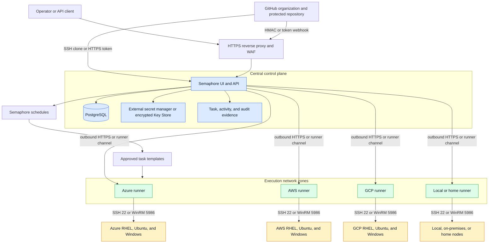
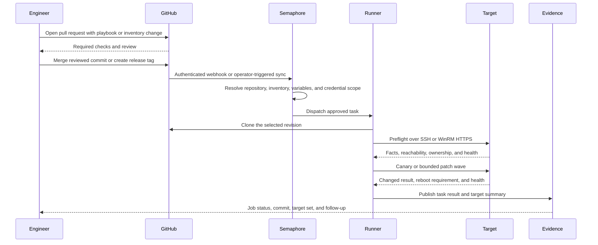

> **Document class:** Hands-on Labs guided implementation lab
> **Normative terms:** **MUST**, **MUST NOT**, **SHOULD**, **SHOULD NOT**, and **MAY** are requirements levels.
> **Applicability:** Semaphore UI and Ansible control-plane construction across RHEL, Ubuntu, Windows WinRM, SSH, GitHub, cloud, local, and home network targets.
> **Exception process:** Deviations require a documented risk assessment, compensating controls, named risk owner, and expiry date.

| Control field | Value |
|---|---|
| Document ID | `HOL-08` |
| Owner | Cloud Center of Excellence |
| Review cycle | At least annually and after material Ansible, Semaphore, provider, security, or source-repository changes |
| Evidence | Git commit, runner and inventory records, credential boundaries, task runs, patch canaries and waves, schedules, GitHub webhook, and cleanup evidence |

# Build a cross-platform Ansible automation control plane with Semaphore UI

> **Decision in brief:** Use GitHub as the reviewed source and Semaphore as the target-aware Automation Control Plane for bounded, cross-platform runs with explicit credentials, schedules, approvals, and evidence.

> **Document type:** Guided hands-on lab
> **Difficulty:** Advanced
> **Estimated duration:** 6-8 hours
> **Primary services:** Semaphore UI, Ansible, GitHub, PostgreSQL, SSH, WinRM, Azure, AWS, GCP, and local or on-premises networks

> **Validation boundary:** Structure, example parsing, and language consistency can be checked automatically; actual RHEL, Ubuntu, Windows, Semaphore, restore, and application-health results must be recorded in a disposable environment. Machine validation does not claim a completed deployment or production acceptance.

## Lab overview

### Scenario

You are building a shared Automation Control Plane for a platform operations team. The team manages RHEL and Ubuntu servers over SSH, Windows servers over WinRM, and nodes located in Azure, AWS, GCP, and local or home networks. GitHub is the source of truth for inventories, playbooks, roles, tests, and release history. Semaphore UI is the control plane that provides projects, repositories, encrypted credentials, inventories, task templates, schedules, audit history, and an API.

The completed lab must show how one operating model can manage many nodes without flattening important differences between operating systems, connection protocols, network zones, environments, or credential boundaries. A single playbook may share policy, but each platform and trust boundary must retain its own connection settings and credential path.

This is a platform construction lab, not a collection of commands to run against production. Use disposable targets, an isolated Semaphore instance, short-lived credentials, and a clearly bounded inventory. The architecture can be promoted to production only after the organization validates the Semaphore edition, identity integration, network controls, backup model, and operational ownership.

### Learning objectives

By completing this lab, you will be able to:

1. Design a Semaphore UI and Ansible control plane for multiple cloud and local network zones.
2. Separate the Semaphore web and API tier, database, runners, GitHub source, and managed nodes.
3. Route automation through runners that are close to the targets and reachable without exposing target nodes publicly.
4. Manage RHEL and Ubuntu nodes with Ansible over SSH.
5. Manage Windows nodes with Ansible over WinRM HTTPS using NTLM or Kerberos.
6. Model inventories by environment, platform, network zone, ownership, patch ring, and credential boundary.
7. Store GitHub, SSH, WinRM, privilege-escalation, and Ansible Vault credentials safely.
8. Build idempotent Linux and Windows patch playbooks with prechecks, bounded waves, reboot handling, and postchecks.
9. Configure Semaphore schedules and node-side systemd or Windows Task Scheduler tasks without creating competing patch authorities.
10. Use GitHub pull requests, protected branches, tags, webhooks, and Semaphore task templates for controlled promotion.
11. Capture evidence that connects a job to its Git commit, inventory, runner, credential identity, target set, approval, and outcome.
12. Test failure handling, cleanup, credential rotation, runner loss, and recovery.

### What you will build

At the end of the lab, you will have:

- a GitHub repository with pinned Ansible collections, inventories, roles, playbooks, tests, and operational documentation;
- a Semaphore UI project connected to the repository;
- separate Semaphore inventories for Linux SSH and Windows WinRM credential boundaries;
- a PostgreSQL-backed Semaphore installation with encrypted access keys and a protected reverse-proxy boundary;
- at least one runner for each network zone used by the lab, with optional runner tags for licensed editions;
- Linux preflight, patch, validation, and scheduling playbooks;
- Windows WinRM preflight, patch, validation, and scheduling playbooks;
- GitHub integration that can trigger safe non-production automation from an authenticated webhook;
- staged and production-simulation schedules with bounded concurrency and maintenance-window guardrails; and
- validation and cleanup evidence.

### Lab success criteria

The lab is complete only when:

- no target secret, private key, password, token, or certificate private key is committed to GitHub;
- the Semaphore service is not directly exposed to the public internet without TLS and an authenticated edge;
- the same reviewed Git commit is used for validation and the approved run;
- Linux SSH and Windows WinRM jobs use distinct inventories and credentials where their trust requirements differ;
- a runner can reach only the target networks it needs;
- a canary or preflight failure stops the next patch wave;
- a patch job refuses to run without a change reference and explicit approval input;
- a reboot is either explicitly allowed or the job fails with a visible pending-reboot result;
- schedules use a documented timezone and cannot silently target an arbitrary inventory;
- a second compliant run makes no unintended changes; and
- cleanup removes lab credentials, schedules, access grants, runners, containers, and target changes.

### Scope and boundaries

This lab covers server configuration and patch orchestration. It does not replace:

- a vulnerability scanner, software inventory system, CMDB, or provider-native update service;
- a full identity-provider implementation for every cloud or directory;
- application-aware draining, cluster quorum management, database failover, or backup orchestration;
- a supported enterprise HA deployment unless the required Semaphore edition and dependencies are available; or
- a production emergency-patch process.

The platform team owns the control plane, execution environments, runner fleet, inventory contract, credential policy, evidence retention, and upgrades. Workload teams own application-specific roles, health checks, maintenance impact, and recovery plans.

## Target architecture

The control plane is centralized for governance but distributed for execution. Semaphore stores the desired automation definitions and job state. Runners execute close to target networks. Targets do not need inbound internet access; they need only the protocol path from an approved runner and their required package or update source.



**Architecture caption:** GitHub provides reviewed source. Semaphore provides the control, scheduling, credential, inventory, and audit boundary. Runners provide placement and network reachability. SSH and WinRM are target protocols, not substitutes for identity, authorization, patch policy, or evidence.

Use site-to-site VPN, private interconnect, a zero-trust access path, or another approved private administration design between each runner and its target network. Do not put a Windows WinRM listener or SSH daemon on a public address merely to make the lab easier.

### Execution flow



**Execution-flow caption:** A GitHub event may request work, but it must not choose arbitrary credentials or production targets. Semaphore resolves the fixed template configuration, the runner executes the approved revision, and the result is retained with enough metadata to support an audit or incident review.

### Production topology variants

| Variant | Semaphore service | Execution model | Appropriate use |
|---|---|---|---|
| Lab | One Semaphore server, PostgreSQL or SQLite for experimentation, one local or global runner | Tasks run on the server or one runner | Learning and disposable targets only |
| Standard production | One hardened Semaphore server with external PostgreSQL and several remote runners | A runner is placed in each reachable network zone | Small platform with clear maintenance and backup ownership |
| Distributed production | Semaphore server or servers, external PostgreSQL, remote runners, private administration paths | Zone-specific runners execute close to targets | Multi-cloud and hybrid operations |
| Enterprise HA | Two or more Semaphore nodes behind a load balancer, shared PostgreSQL or MySQL, Redis, and remote runners | Active-active control plane plus horizontally scaled runners | When the supported Semaphore Enterprise HA feature and operating model are approved |

The lab uses the standard production shape but can be executed as a single-node version. Do not describe a single-node deployment as highly available. In the Enterprise HA variant, all Semaphore nodes must share the same database, Redis, and configuration, with a unique node identifier per node. The load balancer must support HTTPS and WebSocket traffic.

### Trust and network matrix

| Flow | Direction | Port or protocol | Control |
|---|---|---|---|
| Operator to Semaphore | Inbound to edge | HTTPS 443 | SSO or MFA, RBAC, TLS, rate limiting, audit logging |
| GitHub webhook to Semaphore | Inbound to edge | HTTPS 443 | HMAC or token validation, branch and event matchers, WAF, replay protection |
| Semaphore or runner to GitHub | Outbound | HTTPS 443 or SSH 22 | Read-only deploy key or least-privilege token, egress allowlist |
| Semaphore to PostgreSQL | Private | PostgreSQL TLS | Private endpoint, database identity, restricted security group |
| Semaphore nodes to Redis | Private | Redis TLS | Enterprise HA only; shared protected Redis |
| Runner to Linux | Private | SSH 22 | Host-key verification, dedicated account, key rotation, sudo policy |
| Runner to Windows | Private | WinRM HTTPS 5986 | CA-trusted certificate, NTLM or Kerberos, least-privilege administration |
| Target to update source | Outbound | Approved package or WSUS protocol | Repository allowlist, mirror policy, change ownership |
| Runner to Semaphore | Outbound | HTTPS 443 | Runner token, TLS, isolated execution host |

### Edition and feature decision

Record the chosen Semaphore edition before implementation:

- Community or single-server lab: use a single server and a local or global remote runner. Isolate projects and credentials carefully because the control-plane boundary is not a replacement for a full enterprise authorization model.
- Pro: use project runners and runner tags when available to bind templates to the network zones and execution pools that can reach their targets.
- Enterprise: use HA only when the database, Redis, load balancer, licensing, backup, upgrade, and incident-response responsibilities are accepted by the platform owner.

If the organization requires per-credential access policies that cannot be expressed by Semaphore teams, projects, and template permissions, use a stronger controller product or an additional policy broker. Do not compensate for a missing authorization boundary by placing every credential in one shared project.

## Prerequisites

### Accounts and permissions

Prepare:

- a GitHub organization and private repository permission;
- a Semaphore administrator account for bootstrap and at least two project owners for recovery;
- an identity provider account if SSO through OIDC, LDAP, or Active Directory is available;
- a PostgreSQL database or permission to run the lab database container;
- a disposable RHEL or compatible Red Hat target, an Ubuntu target, and a Windows Server target;
- access to Azure, AWS, GCP, or local networks only where test nodes exist;
- permission to create a read-only GitHub deploy key, target service accounts, and temporary secret-manager entries;
- permission to create or update firewall rules for the runner-to-target paths; and
- a cleanup owner who can revoke credentials and delete the test resources.

Do not use a production administrator password, production SSH private key, reusable cloud root credential, or production inventory in this lab.

### Tools

Install on the control-plane bootstrap host or an operator workstation:

```powershell
gh --version
gh auth status
git --version
ssh -V
python --version
ansible-playbook --version
ansible-galaxy --version
docker version
docker compose version
openssl version
```

Install on each Ansible runner:

- Python and the approved ansible-core version;
- pywinrm for WinRM management;
- pywinrm[kerberos] and Kerberos client libraries when Kerberos is used;
- the collections listed in collections/requirements.yml;
- OpenSSH client and the organization-approved CA or known-hosts file;
- cloud CLI or SDK dependencies only when a provider inventory plugin is used; and
- a time-synchronization client with a trusted time source.

The lab pins collection versions and constrains Ansible core in Git. Resolve the remaining ranges to an approved dependency lock, record the Python version, and test that exact runtime before promotion.

### Lab target set

Use at least three targets when possible:

| Target | Example group | Protocol | Required evidence |
|---|---|---|---|
| RHEL 8, 9, or compatible | rhel | SSH 22 | Facts, package manager, reboot test, idempotence |
| Ubuntu 22.04 or 24.04 | ubuntu | SSH 22 | Facts, package manager, reboot test, idempotence |
| Windows Server 2019 or newer | windows | WinRM HTTPS 5986 | TLS trust, win_ping, update result, reboot and service health |

Add one target per cloud or local network only when the runner has a tested private path. The architecture supports many nodes, but a lab must keep target count and patch scope bounded.

### Lab conventions

- Commands are written for PowerShell or Bash as indicated by the code block language.
- Replace every value enclosed in angle brackets before execution.
- Keep all secrets in a secret manager or Semaphore Key Store. Never put secret values in inventory, variable groups committed to Git, task arguments, or debug output.
- Use main as the protected default branch and immutable release tags for approved changes.
- Stop at every **Module checkpoint**. Continuing after a failed checkpoint compounds errors and can make a network or credential failure look like a playbook defect.
- Use UTC in evidence fields and the documented local timezone only for human-facing schedules.

## Lab modules

| Module | Activity | Checkpoint |
|---:|---|---|
| 0 | Define the control-plane contract and topology | Ownership, trust boundaries, target scope, and cleanup plan are recorded. |
| 1 | Create the GitHub source repository | Protected branch, repository structure, tests, and collection pins exist. |
| 2 | Install and harden Semaphore UI | Service, database, encryption, reverse proxy, and backups are configured. |
| 3 | Deploy network-zone runners | Every runner can reach only its intended network and can report healthy. |
| 4 | Bootstrap target access | Linux SSH and Windows WinRM HTTPS pass connectivity and privilege checks. |
| 5 | Model inventories and variables | Platform, environment, zone, ownership, patch ring, and connection settings are explicit. |
| 6 | Register GitHub, credentials, and Semaphore objects | Repository, Key Store, inventories, variable groups, templates, and teams are bounded. |
| 7 | Implement and test Ansible playbooks | Preflight, patch, validate, and scheduling playbooks pass syntax and lint checks. |
| 8 | Run canary and bounded patch waves | Canary failure stops promotion and compliant reruns are idempotent. |
| 9 | Configure schedules and GitHub integration | Scheduled and webhook-triggered execution is authenticated and constrained. |
| 10 | Capture evidence, recover, and clean up | Evidence is complete and lab access is removed or restored. |

## Module 0: define the control-plane contract

### Module objective

Write the small set of rules that all projects and targets must follow before a server is added to the control plane.

### Task 0.1: define the metadata contract

Every host must have these non-secret attributes:

| Attribute | Example | Purpose |
|---|---|---|
| target_environment | development, test, staging, production | Promotion and access boundary |
| cloud | azure, aws, gcp, local | Ownership and routing |
| network_zone | azure-private-east | Runner placement and firewall scope |
| platform | rhel, ubuntu, windows | Play selection and patch policy |
| target_transport | ssh, winrm | Protocol and credential type |
| owner | platform-lab | Accountability and approval routing |
| criticality | low, medium, high | Patch wave and recovery policy |
| patch_ring | canary, ring-1, ring-2 | Bounded rollout |
| maintenance_window | Sunday 02:00-04:00 America/New_York | Schedule and approval |
| managed | true | Explicit inclusion in automation |

Do not infer production membership from a hostname or a cloud subscription alone. Make the environment and ownership values explicit and validate them before a mutating play.

### Task 0.2: define control-plane ownership

Record:

- platform owner for Semaphore and PostgreSQL;
- GitHub repository owner and required reviewers;
- runner owner for each network zone;
- Linux and Windows identity owners;
- package, repository, and WSUS owners;
- change approver and emergency access owner;
- evidence retention and export destination;
- maximum number of parallel tasks and targets per wave; and
- recovery owner for a failed reboot, package transaction, or WinRM outage.

### Module checkpoint

- [ ] A topology diagram names every control-plane component and runner zone.
- [ ] Each test host has a named owner, environment, platform, connection, and patch ring.
- [ ] The target CIDRs and runner egress paths are recorded.
- [ ] Cleanup can identify every resource, secret, access grant, schedule, and target change created by the lab.

## Module 1: create the GitHub source repository

### Module objective

Create a private GitHub repository and establish Git as the source of truth for automation content. GitHub stores source and review evidence; it does not store the target credentials used by Semaphore.

### Task 1.1: create or connect the repository

If a working RHEL management node and GitHub repository such as `ansible-management` already exist, reuse them. Skip the repository-creation commands below and connect that repository in Module 6. A Semaphore Repository is a controller configuration object pointing to the existing Git source; it does not require a second `semaphore-management` repository. Apply the ownership, review, dependency, and credential controls in this lab to the existing content.

Keep any existing `/home/semaphore/ansible-management` clone for manual testing, troubleshooting, and CLI-to-controller comparisons. Semaphore tasks must obtain reviewed content through their GitHub Repository object and managed task workspace; they must not depend on an administrator running `git pull` in that optional clone. Do not delete or overwrite existing playbooks, roles, inventory, or variable files to adopt the sample layout.

For a new empty repository:

```powershell
$org = "<github-organization>"
$repo = "ansible-automation-control-plane"

gh repo create "$org/$repo" --private --description "Cross-platform Ansible automation control plane"
gh repo clone "$org/$repo"
Set-Location $repo
```

For an existing local workspace that already contains the initial files:

```powershell
$org = "<github-organization>"
$repo = "ansible-automation-control-plane"

gh repo create "$org/$repo" --private --source=. --remote=origin --push
```

Confirm the repository and authentication:

```powershell
gh repo view "$org/$repo" --web
gh auth status
git remote -v
git status --short
```

Use a GitHub organization deploy key or a GitHub App for Semaphore repository access. A personal access token is acceptable for a lab, but it must be short-lived, read-only where possible, and stored only in the Semaphore Key Store.

### Task 1.2: protect the default branch

Configure the repository through the GitHub organization policy or repository settings:

- require pull requests before merging;
- require at least one platform-owner review and one automation-owner review for changes to inventories, credentials, playbooks, or workflow configuration;
- require all lint, syntax, unit, and secret-scanning checks to pass;
- prevent force pushes and branch deletion on main;
- restrict who can create release tags used for production promotion;
- require signed commits or signed tags when the organization has that control; and
- use CODEOWNERS to route changes by platform and environment.

Do not run production Semaphore tasks directly from an arbitrary branch, pull request, or fork. Pull-request validation may use disposable targets and read-only credentials only.

### Task 1.3: create the repository structure

Use a layout that keeps connection boundaries, platform policy, reusable roles, and task entry points easy to review:

```text
ansible-automation-control-plane/
|-- ansible.cfg
|-- requirements.txt
|-- collections/requirements.yml
|-- .ansible-lint
|-- .gitignore
|-- inventories/
|   |-- azure/development/linux-ssh.yml
|   |-- azure/development/windows-winrm.yml
|   |-- aws/staging/linux-ssh.yml
|   |-- gcp/production/linux-ssh.yml
|   |-- local/test/windows-winrm.yml
|-- playbooks/
|   |-- group_vars/all.yml
|   |-- group_vars/linux.yml
|   |-- group_vars/windows.yml
|   |-- host_vars/
|   |-- preflight.yml
|   |-- site.yml
|   |-- patch-linux.yml
|   |-- patch-windows.yml
|   |-- validate.yml
|   |-- schedule-tasks.yml
|-- roles/
|   |-- linux-maintenance/
|   |-- windows-maintenance/
|-- tests/
|   |-- test_inventory_contract.py
|   |-- test_playbooks.sh
|-- .github/
|   |-- CODEOWNERS
|   |-- workflows/validate-ansible.yml
|-- README.md
```

Do not commit secrets/, private keys, vault-password-file, *.retry, *.log, *.json exports from Semaphore, generated inventories containing sensitive addresses, or cached repository content.

### Task 1.4: pin Ansible dependencies

collections/requirements.yml:

```yaml
---
collections:
  - name: ansible.windows
    version: "3.7.0"
  - name: community.windows
    version: "3.3.0"
```

requirements.txt:

```text
# Replace these constraints with the versions approved and tested by your platform team.
ansible-core>=2.19,<2.20
ansible-lint>=25,<26
pywinrm>=0.4,<1.0
# Install the following only when Kerberos is used by the Windows inventory:
# pywinrm[kerberos]>=0.4,<1.0
```

Install and record the result on a runner:

```bash
python -m pip install --upgrade pip
python -m pip install -r requirements.txt
ansible-galaxy collection install --requirements-file collections/requirements.yml
ansible-galaxy collection list
ansible-playbook --version
```

For a controlled production build, resolve these constraints in CI, scan the resulting dependencies, and promote the tested runner image or package environment as an immutable artifact. Do not allow an unattended job to download a new collection version during a production run.

### Task 1.5: configure Ansible defaults

ansible.cfg:

```ini
[defaults]
host_key_checking = True
interpreter_python = auto_silent
retry_files_enabled = False
timeout = 30
forks = 20
stdout_callback = default
bin_ansible_callbacks = True
deprecation_warnings = True

[ssh_connection]
pipelining = True
```

Keep inventory selection in Semaphore task templates or explicit command-line arguments. Do not put a production inventory path in a shared global configuration where a developer task can accidentally reuse it.

### Module checkpoint

```bash
ansible-lint playbooks
ansible-playbook --syntax-check playbooks/preflight.yml -i inventories/azure/development/linux-ssh.yml
git diff --check
git status --short
```

- [ ] The repository is private and the default branch is protected.
- [ ] The dependency files are reviewed and pinned or constrained by policy.
- [ ] Secret scanning finds no credential material.
- [ ] Inventory and playbook changes have CODEOWNERS coverage.

## Module 2: install and harden Semaphore UI

### Module objective

Install Semaphore in a repeatable way, protect its database and encryption material, and put the UI and API behind an authenticated HTTPS edge.

Choose one installation path: Tasks 2.1-2.3 use Compose; the native RHEL alternative below reuses an existing host Ansible environment. Both paths then follow Tasks 2.4-2.5 for HTTPS, backup, and recovery. Do not start both installations on port 3000. For the native single-node exercise, local execution is sufficient when the service account can reach the approved targets; use Module 3 when separate network-zone runners are required.

### Native RHEL alternative: install the RPM and service account

Use the [package installation procedure](https://semaphoreui.com/docs/admin-guide/installation/package-manager). The following x86-64 example retains the `2.18.29` baseline; verify the selected asset and checksum against the [release](https://github.com/semaphoreui/semaphore/releases/tag/v2.18.29) and record the approved version before installation. Choose the matching architecture for other hosts.

```bash
sudo dnf install -y \
  https://github.com/semaphoreui/semaphore/releases/download/v2.18.29/semaphore_2.18.29_linux_amd64.rpm
semaphore version
command -v semaphore
```

Root installs and maintains the application; a dedicated `semaphore` account runs the service and local Ansible jobs. If the package or an earlier deployment already created the account, inspect and reuse it instead of recreating it. Otherwise:

```bash
sudo useradd --create-home --home-dir /home/semaphore --shell /bin/bash semaphore
sudo install -d -o semaphore -g semaphore -m 0750 \
  /etc/semaphore /var/lib/semaphore /var/lib/semaphore/tmp
```

Do not recursively change ownership of an existing Ansible checkout, virtual environment, or shared data tree. Grant the service identity only the access it needs. Keep the existing host Ansible installation and its dependencies under administrator or release-pipeline control.

### Native RHEL alternative: verify the execution environment and initialize

Check the environment as the service account, not only as root or an interactive administrator:

```bash
sudo -u semaphore -H bash
command -v ansible
command -v ansible-playbook
ansible --version
git --version
exit
```

If Ansible is installed in a virtual environment, use its actual `bin` directory in the service PATH below and repeat the checks with that PATH. Verify the interpreter, collections, roles, Git/SSH trust, and WinRM Python dependencies in that same runtime. Installing packages in root's Python environment does not make them available to the service or a remote runner.

Initialize interactively under the service account:

```bash
sudo -u semaphore -H bash
cd /home/semaphore
umask 077
semaphore setup
exit
```

Choose `/etc/semaphore/config.json` as the saved configuration path and `/var/lib/semaphore/tmp` for temporary task workspaces. If setup writes `config.json` in the current directory, install that generated file at the intended location with mode `0600`; do not leave a second unprotected copy. Use PostgreSQL for the multi-user, production-shaped lab. SQLite is an optional small single-node lab choice when supported by the selected build; place its database under `/var/lib/semaphore` and document a consistent backup/restore process. It does not satisfy this lab's PostgreSQL production-topology checkpoint.

Before starting the service, set the configuration's `interface` to `127.0.0.1`, `port` to `:3000`, and `tmp_path` to `/var/lib/semaphore/tmp`. Preserve generated database credentials, cookie secrets, and access-key encryption material; never paste them into Git or job output. See the [configuration reference](https://semaphoreui.com/docs/admin-guide/configuration).

```bash
sudo chown semaphore:semaphore /etc/semaphore/config.json
sudo chmod 0600 /etc/semaphore/config.json
```

### Native RHEL alternative: run under systemd and verify access

Inspect `systemctl cat semaphore` before adding a unit. If the package already provides one, apply a reviewed override rather than starting a second service. Otherwise create `/etc/systemd/system/semaphore.service`:

```ini
[Unit]
Description=Semaphore UI
Wants=network-online.target
After=network-online.target

[Service]
Type=simple
User=semaphore
Group=semaphore
WorkingDirectory=/var/lib/semaphore
Environment="HOME=/home/semaphore"
Environment="PATH=/usr/local/sbin:/usr/local/bin:/usr/sbin:/usr/bin:/bin"
ExecStart=/usr/bin/semaphore server --config /etc/semaphore/config.json
UMask=0077
Restart=on-failure
RestartSec=10

[Install]
WantedBy=multi-user.target
```

Replace `/usr/bin/semaphore` if `command -v semaphore` reports a different path. For a virtual environment such as `/opt/ansible-venv`, prepend `/opt/ansible-venv/bin` to the unit's PATH; shell activation files are not loaded by systemd. Confirm the account can traverse and execute that path. This installation runs automation as `semaphore`, never permanently as root.

```bash
sudo systemctl daemon-reload
sudo systemctl enable --now semaphore
systemctl status semaphore --no-pager
sudo journalctl -u semaphore -n 50 --no-pager
curl --fail http://127.0.0.1:3000/api/ping
sudo ss -ltnp
```

Confirm port 3000 is bound only to loopback. For initial access from the workstation, use the approved SSH administration identity to tunnel it:

```bash
ssh -N -L 8080:127.0.0.1:3000 <admin-user>@<RHEL-IP>
```

Open `http://127.0.0.1:8080` locally, then complete the HTTPS reverse proxy in Task 2.4. Do not add a broad `firewall-cmd --add-port=3000/tcp` rule or expose clear-text management access. Permit HTTPS only from approved management networks. Use native PostgreSQL backup tooling for this path instead of the Compose-specific `docker compose exec` example in Task 2.5.

**Native-path checkpoint:** The service is active after restart, runs under the dedicated account, finds the intended Ansible runtime, accepts a local health check, and has protected configuration and a tested database backup. When remote execution is selected, repeat dependency and connectivity checks under the actual runner identity in Module 3.

### Task 2.1: prepare the lab host

Create a dedicated host or VM for Semaphore. It must have:

- a supported Linux distribution or another supported Semaphore host platform;
- encrypted persistent storage for the database and backups;
- a security group that allows only administration and runner traffic;
- an NTP-synchronized clock;
- a backup destination separate from the host;
- Docker Engine and Compose for this lab, or a supported package or Kubernetes deployment for production; and
- a hostname such as semaphore.<approved-domain> with a certificate issued by an approved CA.

For the lab, bind the container to localhost and terminate TLS at a reverse proxy. Do not bind the application directly to 0.0.0.0:3000 on a public interface.

### Task 2.2: create secret files

Use a secret manager or Docker Secrets in production. For a disposable Compose lab, create local secret files and confirm that the directory is ignored by Git:

```bash
umask 077
mkdir -p secrets
openssl rand -base64 32 > secrets/db_password
openssl rand -base64 32 > secrets/admin_password
openssl rand -base64 32 > secrets/access_key_encryption
chmod 0400 secrets/*
printf "secrets/\n" >> .gitignore
```

The access-key encryption value protects credentials stored by Semaphore. Back it up through the organization's secret-management process. Losing it can make stored keys unrecoverable. Never rotate or delete it without following the Semaphore encryption-key rotation and backup procedure.

### Task 2.3: run the lab Compose deployment

Create docker-compose.yml on the lab host. Pin the application and database images to versions approved for the lab; do not use latest for a production deployment.

```yaml
services:
  postgres:
    image: postgres:16
    restart: unless-stopped
    environment:
      POSTGRES_DB: semaphore
      POSTGRES_USER: semaphore
      POSTGRES_PASSWORD_FILE: /run/secrets/db_password
    volumes:
      - semaphore-postgres:/var/lib/postgresql/data
    secrets:
      - db_password
    healthcheck:
      test: ["CMD-SHELL", "pg_isready -U semaphore -d semaphore"]
      interval: 10s
      timeout: 5s
      retries: 10

  semaphore:
    image: semaphoreui/semaphore:v2.18.29
    restart: unless-stopped
    ports:
      - "127.0.0.1:3000:3000"
    environment:
      SEMAPHORE_DB_USER: semaphore
      SEMAPHORE_DB_PASS_FILE: /run/secrets/db_password
      SEMAPHORE_DB_HOST: postgres
      SEMAPHORE_DB_PORT: "5432"
      SEMAPHORE_DB_DIALECT: postgres
      SEMAPHORE_DB: semaphore
      SEMAPHORE_TMP_PATH: /tmp/semaphore
      SEMAPHORE_ADMIN_PASSWORD_FILE: /run/secrets/admin_password
      SEMAPHORE_ADMIN_NAME: admin
      SEMAPHORE_ADMIN_EMAIL: <platform-admin-email>
      SEMAPHORE_ADMIN: admin
      SEMAPHORE_ACCESS_KEY_ENCRYPTION_FILE: /run/secrets/access_key_encryption
      SEMAPHORE_USE_REMOTE_RUNNER: "true"
      SEMAPHORE_SCHEDULE_TIMEZONE: America/New_York
      SEMAPHORE_MAX_PARALLEL_TASKS: "20"
      SEMAPHORE_MAX_TASKS_PER_TEMPLATE: "100"  # Retained history, not execution concurrency.
      TZ: UTC
    secrets:
      - db_password
      - admin_password
      - access_key_encryption
    volumes:
      - semaphore-config:/etc/semaphore
    depends_on:
      postgres:
        condition: service_healthy

volumes:
  semaphore-postgres:
  semaphore-config:

secrets:
  db_password:
    file: ./secrets/db_password
  admin_password:
    file: ./secrets/admin_password
  access_key_encryption:
    file: ./secrets/access_key_encryption
```

The _FILE form keeps confidential values out of the Compose file. Confirm that the selected Semaphore image supports the file form for every configured variable. If it does not, use a protected configuration file or the secret mechanism documented for that release.

The pinned server wrapper reads the three secret-file variables shown above; the server example deliberately does not use `SEMAPHORE_RUNNER_REGISTRATION_TOKEN_FILE`, which is a runner-registration setting, not the server's shared-token loader. Create individual runners through the UI in Module 3. `SEMAPHORE_MAX_TASKS_PER_TEMPLATE` controls retained task history, not parallel execution. Persist `/etc/semaphore` because generated configuration contains additional authentication secrets. Verify secret-file ownership against the container's actual UID before startup; Compose file-backed secrets do not reliably remap host ownership. Never fix a permission failure by making secret files world-readable. Record the application and PostgreSQL image digests for a repeatable run. See the [pinned server wrapper](https://github.com/semaphoreui/semaphore/blob/v2.18.29/deployment/docker/server/server-wrapper).

Start and inspect the service:

```bash
docker compose config
docker compose up -d
docker compose ps
docker compose logs --tail=100 semaphore
curl --fail http://127.0.0.1:3000/api/ping
```

Complete the first-run setup and immediately replace the bootstrap password with the organization's identity integration. Create at least two owners so that one unavailable administrator cannot lock the team out.

### Task 2.4: add the reverse proxy boundary

The reverse proxy must:

- redirect HTTP to HTTPS;
- validate the Semaphore server certificate and use an approved TLS policy;
- preserve WebSocket upgrade headers for /api/ws;
- set the original host and protocol headers;
- restrict administrative access to approved identity or network conditions;
- rate-limit the webhook endpoint;
- log request identifiers without logging secrets; and
- forward only the paths required by Semaphore.

Use a private DNS name and private load balancer when GitHub webhook delivery is implemented through an approved relay. If a public webhook endpoint is required, expose only the edge, keep the Semaphore port private, validate HMAC or token authentication, and do not rely on source IP allowlisting alone.

### Task 2.5: configure database backup and upgrade controls

Test a backup and restore before adding credentials:

```bash
docker compose exec -T postgres pg_dump -U semaphore -d semaphore > semaphore-lab.sql
sha256sum semaphore-lab.sql
```

Use `umask 077` before the dump and save it outside the content repository. A checksum proves file integrity, not restorability. On a second, isolated recovery host with no target or webhook connectivity, start only PostgreSQL using the same Compose definitions and image versions. Keep the application stopped while restoring into the new empty database:

```bash
# Recovery host only: a fresh Compose project, with approved secret files present.
umask 077
docker compose -p semaphore-restore up -d postgres
docker compose -p semaphore-restore exec -T postgres \
  pg_isready -U semaphore -d semaphore
docker compose -p semaphore-restore exec -T postgres \
  psql -v ON_ERROR_STOP=1 -U semaphore -d semaphore < semaphore-lab.sql
```

Wait for PostgreSQL readiness before importing. Restore the matching `/etc/semaphore` configuration volume and encryption material from protected backup, then start the isolated application. Verify login, projects, inventory, templates, history, and credential decryption with a disposable read-only probe after disabling restored schedules/integrations. Do not connect the restored controller to production runners. Record backup time, recovered data time, restore duration, and result. A database-only restore cannot recover encrypted credentials without the original encryption key. For native PostgreSQL use the same empty-database restore pattern with native tools; never run the import against the live database.

For production, use managed PostgreSQL or a separately operated PostgreSQL service with encrypted backups, point-in-time recovery where required, monitoring, and a tested restore runbook. Back up Semaphore configuration, encryption keys, database data, reverse-proxy configuration, and runner registration records together. Test upgrades against a copy of the database and take a recoverable backup before migration.

### Module checkpoint

- [ ] Semaphore is reachable only through the intended edge.
- [ ] PostgreSQL data and backups are on persistent protected storage.
- [ ] Secret files are not tracked by Git and have restrictive permissions.
- [ ] The access-key encryption material is backed up through an approved process.
- [ ] WebSocket connections work through the reverse proxy.
- [ ] A database restore test has been recorded.

## Module 3: deploy network-zone runners

### Module objective

Place task execution where it can reach the intended targets while keeping the central control plane independent of every private network.

### Task 3.1: choose runner placement

Deploy one runner in each network zone that cannot be reached safely from another zone. Typical zones are:

| Runner | Placement | Target reachability | Example tag |
|---|---|---|---|
| runner-azure-private | Azure management subnet | Azure private VM addresses and Semaphore HTTPS | azure-private |
| runner-aws-private | AWS management subnet | AWS private instance addresses and Semaphore HTTPS | aws-private |
| runner-gcp-private | GCP management subnet | GCP internal addresses and Semaphore HTTPS | gcp-private |
| runner-local | On-premises or home management host | Local target addresses and Semaphore HTTPS | local |

The runner should initiate its connection to Semaphore over HTTPS. The runner should initiate SSH or WinRM connections to targets. This model avoids opening inbound management ports from the public internet, but the target network still requires explicit egress and routing controls.

### Task 3.2: install and register a runner

Install the same approved Semaphore release and Ansible dependencies on the runner. Create a runner in the UI Runners page for the intended project/network zone and retrieve its unique token through a secret channel. During setup below, answer Yes to having a Runner token and enter the HTTPS controller URL and issued token. This path requires no shared server registration token and does not assume automatic token expiry.

```bash
# On a dedicated runner host; reuse an existing account only after reviewing it.
getent passwd semaphore >/dev/null || sudo useradd --system --create-home \
  --home-dir /var/lib/semaphore-runner --shell /usr/sbin/nologin semaphore
sudo install -d -m 0750 -o semaphore -g semaphore \
  /etc/semaphore /var/lib/semaphore-runner /var/lib/semaphore-runner/tmp
sudo -u semaphore semaphore runner setup --config /etc/semaphore/runner.json
sudo chmod 0600 /etc/semaphore/runner.json
```

Use the runner CLI or the Semaphore UI to assign a descriptive name. In editions that support runner tags, require the tag in the corresponding task template. In editions without tags, isolate network zones with separate Semaphore instances or another supported project-runner boundary rather than allowing a generic runner to receive every production task.

Set setup's `tmp_path` to `/var/lib/semaphore-runner/tmp`; HOME, collection paths, and SSH trust must also be accessible to the service. Confirm the configuration/token is owned by `semaphore` with mode `0600`. Replace binary and virtual-environment paths in the unit with actual paths; `ProtectHome=true` blocks dependencies under `/home`. This example uses UI-issued tokens; CLI registration requires separately configuring and protecting a server registration token. See the [runner documentation](https://semaphoreui.com/docs/admin-guide/runners).

### Task 3.3: run the runner as a service

Create a service account with no interactive shell and no unrelated administrative permissions. A Linux systemd unit can use this shape:

```ini
[Unit]
Description=Semaphore remote runner
After=network-online.target
Wants=network-online.target

[Service]
User=semaphore
Group=semaphore
WorkingDirectory=/var/lib/semaphore-runner
Environment="HOME=/var/lib/semaphore-runner"
Environment="PATH=/opt/ansible-venv/bin:/usr/local/bin:/usr/bin:/bin"
ExecStart=/usr/local/bin/semaphore runner start --config /etc/semaphore/runner.json
Restart=on-failure
RestartSec=10
UMask=0077
NoNewPrivileges=true
PrivateTmp=true
ProtectSystem=strict
ProtectHome=true
ReadWritePaths=/var/lib/semaphore-runner

[Install]
WantedBy=multi-user.target
```

Validate the service and runner health:

```bash
sudo systemctl daemon-reload
sudo systemctl enable --now semaphore-runner.service
sudo systemctl status semaphore-runner.service --no-pager
sudo journalctl -u semaphore-runner.service -n 100 --no-pager
```

The sandbox settings must be tested with the selected Semaphore version and playbooks. A runner still needs the ability to clone the repository, load its keys, read its trust store, create temporary files, and connect to targets.

### Task 3.4: configure runner network access

Test from each runner:

```bash
curl --fail https://semaphore.<approved-domain>/api/ping
nc -zvw5 <linux-private-address> 22
nc -zvw5 <windows-private-address> 5986
ssh -o BatchMode=yes -o StrictHostKeyChecking=yes automation@<linux-private-address> true
```

Record the equivalent firewall test from a Windows runner when applicable:

```powershell
Test-NetConnection semaphore.<approved-domain> -Port 443
Test-NetConnection <linux-private-address> -Port 22
Test-NetConnection <windows-private-address> -Port 5986
```

### Module checkpoint

- [ ] Each runner has an owner and a network-zone description.
- [ ] Runners connect to Semaphore over HTTPS and are not registered with a shared permanent token.
- [ ] Runner-to-target firewall rules are explicit and minimal.
- [ ] The task template can be constrained to the runner that can reach its inventory.
- [ ] A stopped runner produces a visible failed or queued task rather than an untracked execution.

## Module 4: bootstrap target access

### Module objective

Prepare dedicated target identities and secure SSH or WinRM endpoints before the first Ansible task.

### Task 4.1: create the Linux automation identity

Create a dedicated account on RHEL and Ubuntu. The lab may use a temporary broad privilege policy, but production must use a reviewed sudo policy and separate read-only, configuration, and patching identities where practical.

Example lab bootstrap on each Linux target:

```bash
sudo groupadd --system automation 2>/dev/null || true
sudo useradd --system --create-home --shell /bin/bash --gid automation automation 2>/dev/null || true
sudo install -d -o automation -g automation -m 0700 /home/automation/.ssh
sudo install -o automation -g automation -m 0600 /tmp/automation_authorized_keys /home/automation/.ssh/authorized_keys
printf 'automation ALL=(ALL) NOPASSWD: ALL\n' | sudo tee /etc/sudoers.d/automation-lab >/dev/null
sudo chmod 0440 /etc/sudoers.d/automation-lab
sudo visudo -cf /etc/sudoers.d/automation-lab
```

Replace the lab sudoers entry before production. At minimum, confirm that the final policy supports the package manager, service manager, reboot path, fact gathering, temporary module execution, and any provider-specific operations used by the roles. Test the policy with a non-production account and log its review.

Harden SSH on the target or through the approved image baseline:

- disable password authentication for the automation account where key authentication is available;
- disable direct root login;
- restrict the account to the required source CIDRs or management security group;
- retain host keys and validate them from the runner;
- use a centrally managed SSH CA or known-hosts file when available; and
- rotate the key through the secret manager and Semaphore Key Store.

### Task 4.2: configure Windows WinRM over HTTPS

Use a CA-issued server certificate whose name matches the inventory address. A self-signed certificate is acceptable only for an isolated lab with the CA certificate installed on the runner. Do not use Basic authentication over unencrypted HTTP.

On a disposable Windows target, the bootstrap may look like this:

```powershell
# Run in an elevated console on the disposable target.
$labDnsName = 'win-test-01.example.internal'
$labThumbprint = 'REPLACE_WITH_ENROLLED_SERVER_CERTIFICATE_THUMBPRINT'
$labRunnerCidr = 'REPLACE_WITH_ACTUAL_RUNNER_EGRESS_CIDR'
$labCert = Get-Item "Cert:\LocalMachine\My\$labThumbprint"
if (-not $labCert.HasPrivateKey -or $labCert.NotAfter -le (Get-Date)) {
  throw 'A valid server certificate with a private key is required.'
}
Set-Service -Name WinRM -StartupType Automatic
Start-Service -Name WinRM
Enable-PSRemoting -Force
Set-Item WSMan:\localhost\Service\AllowUnencrypted -Value $false
Set-Item WSMan:\localhost\Service\Auth\Basic -Value $false
Set-Item WSMan:\localhost\Service\Auth\CredSSP -Value $false
New-Item -Path WSMan:\localhost\Listener -Transport HTTPS -Address * `
  -CertificateThumbPrint $labCert.Thumbprint -HostName $labDnsName -Force
New-NetFirewallRule -Name 'Semaphore-Lab-WinRM-HTTPS' `
  -DisplayName 'Semaphore lab WinRM HTTPS' -Direction Inbound -Action Allow `
  -Protocol TCP -LocalPort 5986 -RemoteAddress $labRunnerCidr
Get-WSManInstance -ResourceURI winrm/config/listener -Enumerate
```

For a workgroup lab, use a temporary local administrator with NTLM over the HTTPS listener and place the certificate chain in the runner trust store. For domain-joined production Windows, prefer Kerberos with synchronized clocks, correct DNS, constrained delegation rules where required, and a domain-managed service account. Do not enable CredSSP unless a documented double-hop requirement has been approved.

ansible.windows.win_updates requires the connection user to be a member of the local Administrators group. Use a dedicated account with only the privileges needed for the patch and validation contract. Store its password in an external secret manager or Semaphore Key Store, never in inventory or a GitHub secret.

Before running, verify the certificate DNS SAN and Server Authentication usage, and install its public CA chain in the execution environment. `Enable-PSRemoting` may create HTTP listeners/firewall rules; after HTTPS works, remove unneeded HTTP listeners/rules on dedicated lab targets without changing shared management channels. Inspect and reuse an existing HTTPS listener or named rule. Do not disable certificate validation to work around trust failures.

### Task 4.3: test protocol reachability

From the runner with the eventual trust store and credentials:

```bash
ansible -i inventories/azure/development/linux-ssh.yml linux -m ansible.builtin.ping
ansible -i inventories/local/test/windows-winrm.yml windows -m ansible.windows.win_ping
```

For a Windows target, confirm the endpoint and certificate before invoking Ansible:

```powershell
Test-WSMan -ComputerName <windows-private-name> -Port 5986 -UseSSL
```

### Module checkpoint

- [ ] Linux ansible.builtin.ping works over SSH with host-key verification.
- [ ] Windows ansible.windows.win_ping works over WinRM HTTPS.
- [ ] WinRM certificate validation is validate in the production-shaped inventory.
- [ ] No target account password or private key appears in the command history, repository, or job log.
- [ ] The Linux sudo and Windows administrator privileges are documented and time-bounded.

## Module 5: model inventories and variables

### Module objective

Create inventories that are explicit, reviewable, and safe to bind to Semaphore task templates. The recommended boundary is one inventory per environment, network zone, platform, and connection credential.

Semaphore inventories have a credential association. A mixed Linux-and-Windows inventory can therefore create an unsafe or impossible credential boundary when the platforms require different keys, users, or protocols. Prefer separate inventories and templates, then coordinate them through an operator runbook or approved pipeline.

Use `target_environment` and `target_transport` for metadata to avoid Ansible reserved names `environment` and `connection`. When adapting an existing inventory, update validation and generation together while preserving its environment and transport meaning.

### Task 5.1: create a Linux SSH inventory

inventories/azure/development/linux-ssh.yml:

```yaml
---
all:
  children:
    linux:
      children:
        rhel:
          hosts:
            azure-rhel-dev-01:
              ansible_host: 10.20.1.11
              cloud: azure
              target_environment: development
              network_zone: azure-private-east
              platform: rhel
              target_transport: ssh
              owner: platform-lab
              criticality: low
              patch_ring: canary
              maintenance_window: "Sunday 02:00-04:00 America/New_York"
              managed: true
        ubuntu:
          hosts:
            azure-ubuntu-dev-01:
              ansible_host: 10.20.1.12
              cloud: azure
              target_environment: development
              network_zone: azure-private-east
              platform: ubuntu
              target_transport: ssh
              owner: platform-lab
              criticality: low
              patch_ring: ring-1
              maintenance_window: "Sunday 02:00-04:00 America/New_York"
              managed: true
      vars:
        ansible_connection: ssh
        ansible_user: automation
        ansible_become: true
```

The ansible_user value is not a secret. Semaphore's SSH Key Store entry supplies the private key and can supply the login. Do not add ansible_password, ansible_become_password, or private-key content to this file.

### Task 5.2: create a Windows WinRM inventory

inventories/local/test/windows-winrm.yml:

```yaml
---
all:
  children:
    windows:
      hosts:
        local-windows-test-01:
          ansible_host: win-test-01.example.internal
          cloud: local
          target_environment: test
          network_zone: local-management
          platform: windows
          target_transport: winrm
          owner: platform-lab
          criticality: low
          patch_ring: canary
          maintenance_window: "Sunday 02:30-04:30 America/New_York"
          managed: true
      vars:
        ansible_connection: winrm
        ansible_port: 5986
        ansible_user: svc_ansible@<ad-domain>
        ansible_winrm_scheme: https
        ansible_winrm_transport: ntlm
        ansible_winrm_server_cert_validation: validate
        ansible_winrm_operation_timeout_sec: 60
        ansible_winrm_read_timeout_sec: 70
```

For domain Kerberos, change ansible_winrm_transport to kerberos, use a domain user format accepted by the selected Ansible and pywinrm versions, and test DNS, SPNs, time synchronization, and the runner's Kerberos libraries. Keep Kerberos secrets in the Key Store or the approved secret manager.

For a self-signed lab certificate, install that public certificate as a trust anchor in the execution runtime and retain certificate validation. Verify hostname matching and expiry as well as trust.

### Task 5.3: use group variables for policy, not secrets

playbooks/group_vars/all.yml:

```yaml
---
change_reference: ""
maintenance_approved: false
preflight_mutating: false
patch_serial: "1"
patch_max_fail_percentage: 0
linux_reboot: false
windows_reboot: false
```

playbooks/group_vars/linux.yml:

```yaml
---
linux_update_scope: all
linux_security_only: false
linux_reboot_timeout: 1800
```

playbooks/group_vars/windows.yml:

```yaml
---
windows_update_categories:
  - CriticalUpdates
  - SecurityUpdates
  - UpdateRollups
windows_update_server_selection: default
windows_reboot_timeout: 3600
windows_post_reboot_delay: 60
```

The values above are defaults, not approvals. A production task template must set change_reference, maintenance_approved, and reboot policy through a protected variable group, schedule, approval process, or API caller. Do not make a production approval default to true in Git.

Policy files live in `playbooks/group_vars/` so playbooks in that directory discover them automatically. Standalone `ansible-inventory` commands must add `--playbook-dir playbooks`. An existing repository may retain inventory-adjacent variable directories; do not maintain conflicting copies of the same variables in both locations.

### Task 5.4: choose an inventory source for scale

Use one of these patterns and document the authoritative source:

| Pattern | Implementation | Strength | Risk to control |
|---|---|---|---|
| Git-managed inventory | YAML files reviewed in pull requests | Reproducible and easy to audit | Stale if ownership does not maintain it |
| Generated inventory | A controlled discovery job renders an allowlisted file from CMDB or cloud APIs | Fresh metadata and broad scale | Discovery outage must not become an empty or all-host target |
| Provider inventory plugin | azure.azcollection, amazon.aws, or google.cloud plugin runs on a runner | Direct cloud discovery | Requires cloud identity, SDKs, filters, and fail-safe testing |
| CMDB or NetBox source | Source system exports or serves an inventory | Ownership and lifecycle metadata | Integration and availability become dependencies |

For the lab, use Git-managed inventories. For production, a generator or provider plugin must filter by explicit subscription, account, project, region, environment, owner, managed=true, and patch ring. If the source API is unavailable or returns zero hosts unexpectedly, fail the task. Never fall back to all or a previous broad inventory without an explicit operator decision.

### Task 5.5: validate the inventory contract

Run these checks from the repository root:

```bash
umask 077
ansible-inventory -i inventories/azure/development/linux-ssh.yml --playbook-dir playbooks --graph
ansible-inventory -i inventories/azure/development/linux-ssh.yml --playbook-dir playbooks --list > /tmp/linux-inventory.json
ansible-inventory -i inventories/local/test/windows-winrm.yml --playbook-dir playbooks --graph
```

Review the rendered inventory for:

- unexpected hosts or groups;
- missing target_environment, cloud, network_zone, owner, patch_ring, or managed values;
- a Windows host with an SSH connection or a Linux host with a WinRM connection;
- public addresses where private addresses are required;
- secret-like values; and
- a target that belongs to a different environment or owner.

### Module checkpoint

- [ ] Each inventory has one clear credential and network boundary.
- [ ] Linux inventories use SSH and Windows inventories use WinRM HTTPS.
- [ ] All hosts contain the required non-secret metadata.
- [ ] Inventory graph and rendered JSON match the expected target count.
- [ ] A deliberately unavailable discovery source fails closed in the test procedure.

## Module 6: register GitHub, credentials, and Semaphore objects

### Module objective

Translate the repository and control contract into Semaphore projects, repositories, inventories, Key Store entries, variable groups, task templates, teams, and schedules.

### Task 6.1: create the project and team

Create a project such as platform-automation-lab and associate it with a dedicated team. Use the smallest built-in or custom roles that the selected Semaphore edition supports:

| Role | Allowed activity |
|---|---|
| Project owner | Project settings, team membership, recovery, and credential administration |
| Automation author | Review and maintain GitHub source; no production task execution by default |
| Operator | Run preflight, canary, validation, and approved maintenance templates |
| Approver | Approve production or production-simulation changes through the change process |
| Auditor or guest | Read approved task and activity evidence only |

Keep credential administration separate from ordinary task execution. At least two owners should be able to recover a project, but routine operators should not be able to replace the production SSH or WinRM credential.

### Task 6.2: add the GitHub repository key

Create a dedicated GitHub deploy key or GitHub App credential:

1. Generate the key on a protected administration host.
2. Add only the public key to the target GitHub repository or organization policy.
3. Grant read-only repository access for Semaphore clone operations.
4. Add the private key to the Semaphore Key Store as an SSH key.
5. Name it github-automation-repository-read.
6. Test a repository sync from Semaphore and confirm that the selected branch or tag is the expected revision.
7. Rotate the key after the lab and record the new fingerprint.

Use an HTTPS login-with-password Key Store entry with a fine-grained GitHub token only when the organization cannot use an SSH deploy key or App. Never use a personal account password.

For an existing repository, open **Repositories → New Repository** and register:

| Field | Existing-repository example |
|---|---|
| Name | `ansible-management` |
| Repository URL | `ssh://git@github.com/<account>/ansible-management.git` |
| Branch | Protected `main` for initial lab validation; approved release reference for controlled promotion |
| Access key | The dedicated read-only GitHub Key Store entry |

The repository key is distinct from the Linux SSH key, Windows WinRM credential, and Vault password. Do not reuse the same private key for GitHub access and managed-host access. Record the revision actually checked out for each task.

### Task 6.3: create target credential entries

Create separate Key Store entries. The exact form names depend on the Semaphore release, but the design is:

| Key Store entry | Type | Used by | Secret source |
|---|---|---|---|
| linux-ssh-azure-dev | SSH | Azure Linux inventory | External secret manager or generated private key |
| linux-ssh-aws-staging | SSH | AWS Linux inventory | External secret manager or generated private key |
| linux-become-azure-dev | Login with password, only if sudo requires it | Linux inventory become | External secret manager |
| windows-winrm-local-test | Login with password | Windows WinRM inventory | External secret manager |
| ansible-vault-lab | Login with password or secret string | Vault-encrypted variables | External secret manager |
| azure-inventory-read | Secret or login token | Optional Azure inventory discovery | Federated identity or short-lived token |
| aws-inventory-read | Secret or login token | Optional AWS inventory discovery | Short-lived role credentials |
| gcp-inventory-read | Secret or login token | Optional GCP inventory discovery | Workload identity or short-lived token |

Semaphore can store secrets encrypted in its database when the access-key encryption setting is configured. Where supported and approved, synchronize only the required paths from HashiCorp Vault, OpenBao, AWS Secrets Manager, Azure Key Vault, or another external secret manager. The remote-storage credential is separate from the imported target credentials.

For Windows WinRM, the Login With Password entry supplies the connection user and password used by Ansible. Keep ansible_winrm_transport, port, scheme, and certificate-validation settings in the inventory; keep the password in the Key Store. For Kerberos, also provide the runner with the required Kerberos client configuration and trust path.

### Task 6.4: create one inventory per credential boundary

In Semaphore:

1. Open the project's Inventory area.
2. Create a file-based inventory for each platform, environment, and zone.
3. When the inventory is in the repository, use its repository-relative path such as inventories/azure/development/linux-ssh.yml.
4. Attach the correct user credential.
5. Attach a separate become credential only when required.
6. Select the repository associated with the file inventory.
7. Validate the inventory before saving it.

Recommended first inventories:

| Semaphore inventory | Repository path | User credential | Become or elevation |
|---|---|---|---|
| azure-dev-linux-ssh | inventories/azure/development/linux-ssh.yml | linux-ssh-azure-dev | linux-become-azure-dev if needed |
| local-test-windows-winrm | inventories/local/test/windows-winrm.yml | windows-winrm-local-test | Not separate; user is Windows administrator for lab |

Do not attach the production credential to a development inventory. Do not use a single shared all-hosts inventory for production patching.

For an existing repository, keep the inventory and its adjacent `group_vars` and `host_vars` in Git. A typical layout is:

```text
ansible-management/
|-- ansible.cfg
|-- inventory/
|   |-- hosts.yml
|   |-- group_vars/
|   `-- host_vars/
|-- playbooks/
|-- roles/
`-- requirements.yml
```

The file inventory path is `inventory/hosts.yml`, not `/home/semaphore/ansible-management/inventory/hosts.yml`. The absolute path points to the optional manual clone rather than the task checkout. Apply the same platform/environment/credential boundaries to this existing layout. Validate it as the service account with the selected runtime:

```bash
sudo -u semaphore -H bash
cd /home/semaphore/ansible-management
ansible-inventory -i inventory/hosts.yml --graph
exit
```

Confirm sites, hosts, groups, and child groups match the expected scope. Fix CLI parsing errors before troubleshooting Semaphore. Ansible resolves inventory and variables; do not duplicate `group_vars` or `host_vars` in controller records. Preserve Ansible's inventory-relative or playbook-relative variable discovery; a top-level variable directory is not automatically discovered from every playbook location.

For this file-inventory workflow, Semaphore references the source and Ansible parses the host/group hierarchy. Repository registration does not imply an AWX-style graphical object for every host, group, and variable. Evaluate AWX / Ansible Automation Platform if graphical host/group administration is required. Semaphore provides jobs, RBAC, schedules, credentials, and history; it does not become an asset CMDB or host lifecycle platform by referencing inventory.

### Task 6.5: create variable groups

Semaphore Variable Groups use JSON. Create non-secret policy groups for each environment and platform. Example dev-linux-patch:

```json
{
  "change_reference": "CHG-LAB-001",
  "maintenance_approved": true,
  "preflight_mutating": true,
  "patch_serial": "1",
  "patch_max_fail_percentage": 0,
  "linux_reboot": true,
  "linux_security_only": false
}
```

Example test-windows-patch:

```json
{
  "change_reference": "CHG-LAB-002",
  "maintenance_approved": true,
  "preflight_mutating": true,
  "patch_serial": "1",
  "patch_max_fail_percentage": 0,
  "windows_reboot": true,
  "windows_update_categories": [
    "CriticalUpdates",
    "SecurityUpdates",
    "UpdateRollups"
  ],
  "windows_update_server_selection": "default"
}
```

For production, keep approval and change reference values in the protected schedule or approval-controlled input, not in a public or broadly writable variable group. Use the Variable Group secret field only for values that must be passed as environment or extra variables, and verify that the selected Semaphore release masks them in task output.

### Task 6.6: create task templates

Create fixed templates with a single playbook, inventory, variable group, and credential boundary:

| Template | Playbook | Inventory family | Run mode | Runtime inputs |
|---|---|---|---|---|
| linux-development-preflight | playbooks/preflight.yml | Linux SSH | Task | Optional bounded limit |
| linux-development-patch | playbooks/patch-linux.yml | Linux SSH | Task or scheduled | Protected change reference and patch ring |
| windows-test-preflight | playbooks/preflight.yml | Windows WinRM | Task | Optional bounded limit |
| windows-test-patch | playbooks/patch-windows.yml | Windows WinRM | Task or scheduled | Protected change reference and reboot policy |
| node-schedule-converge-linux | playbooks/schedule-tasks.yml | Linux SSH | Task | Fixed target group |
| node-schedule-converge-windows | playbooks/schedule-tasks.yml | Windows WinRM | Task | Fixed target group |
| cross-platform-validation | playbooks/validate.yml | One inventory per run | Task | Fixed target scope |

Enable only the prompts needed by each template. If limit is enabled, restrict the accepted value through an allowlist in the calling process and keep the inventory fixed. Do not expose prompts for credential IDs, repository paths, arbitrary playbook paths, or production inventory selection.

Set the task template's maximum parallelism deliberately. Tasks from the same template are sequential by default in Semaphore, but different templates or schedules can still overlap. Stagger schedules, use separate patch windows, and add a higher-level change lock when the same service can be reached through more than one template.

### Existing-repository integration checkpoint

Create a bounded read-only template using repository `ansible-management`, its repository-relative lab inventory, the matching managed-host credential, and an existing reviewed `playbooks/<existing-playbook>.yml`. The task checks out GitHub content, loads inventory and runtime credentials, executes Ansible over SSH or WinRM, and retains output/history. Compare its target set and outcome with CLI execution at the same Git revision before enabling mutation or schedules.

Keep the existing pinned `requirements.yml` for collections and roles; install Python dependencies in the actual service or runner runtime. Preserve Vault-encrypted variable files in Git, but supply their decryption password through the template's supported Vault credential binding or another approved runtime mechanism. Verify decryption in a task without printing decrypted variables. Never commit the Vault password or copy it into inventory.

- [ ] The service identity runs Ansible with the expected interpreter and dependencies.
- [ ] Semaphore checks out the existing GitHub repository using a separate read-only credential.
- [ ] The inventory path is repository-relative and CLI parsing produces the expected host/group hierarchy.
- [ ] Git remains the source for inventory, `group_vars`, `host_vars`, playbooks, roles, and encrypted Vault content.
- [ ] The fixed template runs an existing playbook successfully and records its revision, target scope, and output.
- [ ] No second Ansible repository, duplicated manual inventory, or manual `git pull` is required for controller jobs.

### Module checkpoint

- [ ] The GitHub repository key is read-only and has a recorded fingerprint.
- [ ] Linux SSH, Linux become, Windows WinRM, and Vault credentials are separate entries.
- [ ] Each inventory is attached to the correct credential boundary.
- [ ] The task templates have fixed playbooks, inventories, and variable groups.
- [ ] Operators cannot select arbitrary production credentials, repositories, or playbooks.
- [ ] A test task masks a deliberately generated secret and does not print it.

## Module 7: implement the Ansible playbooks

Before replacing existing content with the examples below, complete the existing-repository integration check in Module 6. Keep reviewed playbooks that already satisfy the lab contract.

### Module objective

Build platform-specific playbooks with a shared control contract. The examples below are intentionally conservative: they check metadata, patch in bounded batches, make reboot behavior explicit, and validate service reachability afterward.

### Task 7.1: create the common preflight playbook

playbooks/preflight.yml:

```yaml
---
- name: Validate control-plane and target contract
  hosts: all
  gather_facts: true
  any_errors_fatal: true
  tasks:
    - name: Require host ownership and lifecycle metadata
      ansible.builtin.assert:
        that:
          - hostvars[inventory_hostname].target_environment is defined
          - hostvars[inventory_hostname].cloud is defined
          - hostvars[inventory_hostname].network_zone is defined
          - hostvars[inventory_hostname].owner is defined
          - hostvars[inventory_hostname].patch_ring is defined
          - hostvars[inventory_hostname].managed | default(false) | bool
        fail_msg: "{{ inventory_hostname }} is missing required inventory metadata"

    - name: Require explicit change metadata for a mutating execution
      ansible.builtin.assert:
        that:
          - change_reference | default('') | length > 0
          - maintenance_approved | default(false) | bool
        fail_msg: "A change reference and explicit approval are required for mutation"
      when: preflight_mutating | default(false) | bool

    - name: Reject unsupported target platforms
      ansible.builtin.assert:
        that:
          - ansible_facts['os_family'] in ['RedHat', 'Debian', 'Windows']

    - name: Validate Linux family
      ansible.builtin.assert:
        that:
          - ansible_facts['os_family'] in ['RedHat', 'Debian']
        fail_msg: "Unsupported Linux family on {{ inventory_hostname }}"
      when: ansible_facts['system'] == 'Linux'

    - name: Validate Windows platform
      ansible.builtin.assert:
        that:
          - ansible_facts['os_family'] == 'Windows'
        fail_msg: "Unsupported Windows platform on {{ inventory_hostname }}"
      when: ansible_facts['os_family'] == 'Windows'

    - name: Check Linux root filesystem space
      ansible.builtin.command: df -Pk /
      register: linux_root_filesystem
      changed_when: false
      check_mode: false
      when: ansible_facts['system'] == 'Linux'

    - name: Require at least 10 percent free space on Linux root filesystem
      ansible.builtin.assert:
        that:
          - (linux_root_filesystem.stdout_lines[-1].split()[4] | regex_replace('%', '') | int) < 90
        fail_msg: "{{ inventory_hostname }} has less than 10 percent free root filesystem space"
      when: ansible_facts['system'] == 'Linux'

    - name: Verify Windows WinRM service
      ansible.windows.win_service_info:
        name: WinRM
      register: winrm_service
      when: ansible_facts['os_family'] == 'Windows'

    - name: Require Windows WinRM service to be present
      ansible.builtin.assert:
        that:
          - winrm_service.services | length == 1
          - winrm_service.services[0].state in ['running', 'started']
        fail_msg: "WinRM is not running on {{ inventory_hostname }}"
      when: ansible_facts['os_family'] == 'Windows'
```

The preflight playbook is safe to run without mutation approval. Use a separate preflight_mutating value for checks that inspect or change package-manager state.

### Task 7.2: create the platform entry point

playbooks/site.yml:

```yaml
---
- name: Run the reviewed platform stage
  ansible.builtin.import_playbook: preflight.yml
- name: Run the reviewed platform stage
  ansible.builtin.import_playbook: patch-linux.yml
- name: Run the reviewed platform stage
  ansible.builtin.import_playbook: patch-windows.yml
- name: Run the reviewed platform stage
  ansible.builtin.import_playbook: validate.yml
```

When a project uses separate Semaphore inventories, run the platform-specific playbook directly. Use site.yml only when the inventory and credential design supports the complete target set.

During bootstrap, install `dnf-utils` on RHEL 9 to provide `needs-restarting`, and verify `needs-restarting -r` returns 0 or 1. Both patch entry points now run the read-only preflight, then validate typed approval and reboot policy before changing packages. The lab fixes `serial: 1`, a zero failure threshold, and fatal failure handling so the first failure stops later batches. Parallel waves are a production extension requiring a reviewed change to the input contract.

### Task 7.3: create the Linux patch playbook

playbooks/patch-linux.yml:

```yaml
---
- name: Run the shared preflight before mutation
  ansible.builtin.import_playbook: preflight.yml

- name: Patch RHEL and Ubuntu in bounded waves
  hosts: linux
  become: true
  gather_facts: true
  serial: "{{ patch_serial | default('1') }}"
  max_fail_percentage: "{{ patch_max_fail_percentage | default(0) }}"
  any_errors_fatal: true
  pre_tasks:
    - name: Validate fixed lab wave and typed approval inputs
      ansible.builtin.assert:
        that:
          - not ansible_check_mode
          - maintenance_approved is boolean
          - maintenance_approved
          - change_reference is string
          - change_reference is match('^CHG-[A-Za-z0-9-]+$')
          - patch_serial | string == '1'
          - patch_max_fail_percentage | int == 0
        fail_msg: "Use Run mode, a JSON boolean approval, a CHG reference, and serial=1/failure=0."

    - name: Require approval and change reference
      ansible.builtin.assert:
        that:
          - maintenance_approved | default(false) | bool
          - change_reference | default('') | length > 0
        fail_msg: "Refusing Linux patch without approval and change reference"

    - name: Refuse unmanaged hosts
      ansible.builtin.assert:
        that:
          - managed | default(false) | bool
          - patch_ring is defined
        fail_msg: "{{ inventory_hostname }} is not an approved managed host"

    - name: Validate Linux platform and supported update policy
      ansible.builtin.assert:
        that:
          - ansible_facts['distribution'] in ['RedHat', 'Ubuntu']
          - linux_reboot is boolean
          - linux_reboot
          - linux_security_only is boolean
          - linux_update_scope == 'all'
          - ansible_facts['os_family'] != 'Debian' or not linux_security_only
        fail_msg: "Approve reboot before patching; this Ubuntu example supports all updates only."

    - name: Verify RHEL reboot detection tool before package changes
      ansible.builtin.command: needs-restarting -r
      register: rhel_reboot_precheck
      changed_when: false
      failed_when: rhel_reboot_precheck.rc not in [0, 1]
      when: ansible_facts['os_family'] == 'RedHat'

    - name: Refresh APT metadata
      ansible.builtin.apt:
        update_cache: true
        cache_valid_time: 3600
      when: ansible_facts['os_family'] == 'Debian'

  tasks:
    - name: Apply Ubuntu or Debian distribution updates
      ansible.builtin.apt:
        upgrade: dist
        autoremove: false
        autoclean: true
      register: debian_patch_result
      when:
        - ansible_facts['os_family'] == 'Debian'
        - linux_update_scope | default('all') == 'all'

    - name: Apply the approved RHEL update scope
      ansible.builtin.dnf:
        name: '*'
        state: latest  # noqa package-latest -- This approved lab intentionally installs updates.
        update_only: true
        security: "{{ linux_security_only | default(false) | bool }}"
      register: rhel_patch_result
      when: ansible_facts['os_family'] == 'RedHat'

    - name: Detect Ubuntu reboot requirement
      ansible.builtin.stat:
        path: /var/run/reboot-required
      register: ubuntu_reboot_file
      when: ansible_facts['os_family'] == 'Debian'

    - name: Detect RHEL reboot requirement
      ansible.builtin.command: needs-restarting -r
      register: rhel_reboot_check
      changed_when: false
      failed_when: rhel_reboot_check.rc not in [0, 1]
      when: ansible_facts['os_family'] == 'RedHat'

    - name: Calculate reboot requirement
      ansible.builtin.set_fact:
        linux_reboot_required: >-
          {{
            (ansible_facts['os_family'] == 'Debian' and
             (ubuntu_reboot_file.stat.exists | default(false))) or
            (ansible_facts['os_family'] == 'RedHat' and
             (rhel_reboot_check.rc | default(0) | int) == 1)
          }}

    - name: Refuse to leave an unapproved pending reboot
      ansible.builtin.assert:
        that:
          - not linux_reboot_required | bool or linux_reboot | default(false) | bool
        fail_msg: "{{ inventory_hostname }} requires a reboot but this run did not approve one"

    - name: Reboot Linux after approved patching
      ansible.builtin.reboot:
        msg: "Reboot requested by Semaphore change {{ change_reference }}"
        reboot_timeout: "{{ linux_reboot_timeout | default(1800) }}"
        connect_timeout: 10
        post_reboot_delay: 30
      when:
        - linux_reboot_required | bool
        - linux_reboot | default(false) | bool

  post_tasks:
    - name: Verify Linux is reachable after patching
      ansible.builtin.ping:
      register: linux_postcheck

    - name: Report Linux patch summary without secret values
      ansible.builtin.debug:
        msg:
          host: "{{ inventory_hostname }}"
          change_reference: "{{ change_reference }}"
          reboot_required: "{{ linux_reboot_required | default(false) }}"
          package_manager: "{{ ansible_facts['pkg_mgr'] }}"
```

The Ubuntu example applies distribution updates rather than claiming to provide a universal security-only filter. If the organization requires security-only updates, implement repository pinning, update-manager policy, or a tested allowlist and validate it on each supported Ubuntu release. For RHEL, confirm that the configured repositories expose security metadata before enabling linux_security_only.

The playbook uses serial and max_fail_percentage to bound impact. For a cluster, replace percentage-based waves with a service-aware drain and quorum policy owned by the application team.

### Task 7.4: create the Windows patch playbook

playbooks/patch-windows.yml:

```yaml
---
- name: Run the shared preflight before mutation
  ansible.builtin.import_playbook: preflight.yml

- name: Patch Windows in bounded waves
  hosts: windows
  gather_facts: true
  serial: "{{ patch_serial | default('1') }}"
  max_fail_percentage: "{{ patch_max_fail_percentage | default(0) }}"
  any_errors_fatal: true
  pre_tasks:
    - name: Validate fixed lab wave and typed approval inputs
      ansible.builtin.assert:
        that:
          - not ansible_check_mode
          - maintenance_approved is boolean
          - maintenance_approved
          - change_reference is string
          - change_reference is match('^CHG-[A-Za-z0-9-]+$')
          - patch_serial | string == '1'
          - patch_max_fail_percentage | int == 0
        fail_msg: "Use Run mode, a JSON boolean approval, a CHG reference, and serial=1/failure=0."

    - name: Require approval and change reference
      ansible.builtin.assert:
        that:
          - maintenance_approved | default(false) | bool
          - change_reference | default('') | length > 0
        fail_msg: "Refusing Windows patch without approval and change reference"

    - name: Refuse unmanaged Windows hosts
      ansible.builtin.assert:
        that:
          - managed | default(false) | bool
          - patch_ring is defined
        fail_msg: "{{ inventory_hostname }} is not an approved managed host"

    - name: Validate Windows platform and update policy
      ansible.builtin.assert:
        that:
          - ansible_facts['os_family'] == 'Windows'
          - windows_reboot is boolean
          - windows_reboot
          - windows_update_categories is sequence and windows_update_categories is not string
          - windows_update_categories | length > 0
          - windows_update_categories | difference(['CriticalUpdates', 'SecurityUpdates', 'UpdateRollups']) | length == 0
          - windows_update_server_selection in ['default', 'managed_server', 'windows_update']
        fail_msg: "Approve reboots and allowlisted update categories before installing updates."

  tasks:
    - name: Create the Windows update log directory
      ansible.windows.win_file:
        path: C:\ProgramData\Automation
        state: directory

    - name: Install approved Windows update categories
      ansible.windows.win_updates:
        category_names: "{{ windows_update_categories }}"
        state: installed
        server_selection: "{{ windows_update_server_selection | default('default') }}"
        reboot: true
        reboot_timeout: "{{ windows_reboot_timeout | default(3600) }}"
        log_path: C:\ProgramData\Automation\windows-update.log
      register: windows_patch_result

    - name: Refuse to leave an unapproved pending reboot
      ansible.builtin.assert:
        that:
          - not (windows_patch_result.reboot_required | default(false) | bool)
        fail_msg: "{{ inventory_hostname }} requires a reboot but this run did not approve one"

    - name: Inspect WinRM after patching
      ansible.windows.win_service_info:
        name: WinRM
      register: patched_winrm

    - name: Require healthy WinRM without remediating the postcheck
      ansible.builtin.assert:
        that:
          - patched_winrm.services | length == 1
          - patched_winrm.services[0].state == 'started'

  post_tasks:
    - name: Verify Windows is reachable after patching
      ansible.windows.win_ping:
      register: windows_postcheck

    - name: Report Windows patch summary without secret values
      ansible.builtin.debug:
        msg:
          host: "{{ inventory_hostname }}"
          change_reference: "{{ change_reference }}"
          found_update_count: "{{ windows_patch_result.found_update_count | default(0) }}"
          installed_update_count: "{{ windows_patch_result.installed_update_count | default(0) }}"
          reboot_required: "{{ windows_patch_result.reboot_required | default(false) }}"
```

ansible.windows.win_updates runs with the update service configured on the target, such as Windows Update, Microsoft Update, or WSUS. Make the update source an explicit policy. The module can take a long time and must run under a Windows account with the required administrative rights. This example requires reboot approval before installation and uses `win_updates` with `reboot: true` to reboot and continue scanning/installing as necessary. Do not add an unconditional reboot afterward. Set the controller timeout to cover the maintenance window and stop subsequent batches on an update failure or loop.

### Task 7.5: create a validation playbook

playbooks/validate.yml:

```yaml
---
- name: Validate Linux targets
  hosts: linux
  gather_facts: true
  tasks:
    - name: Verify SSH-managed Linux target
      ansible.builtin.ping:

    - name: Verify supported Linux family
      ansible.builtin.assert:
        that:
          - ansible_facts['os_family'] in ['RedHat', 'Debian']
          - managed | default(false) | bool

- name: Validate Windows targets
  hosts: windows
  gather_facts: true
  tasks:
    - name: Verify WinRM-managed Windows target
      ansible.windows.win_ping:

    - name: Verify WinRM service state
      ansible.windows.win_service_info:
        name: WinRM
      register: winrm_validation

    - name: Require WinRM service to be running
      ansible.builtin.assert:
        that:
          - winrm_validation.services | length == 1
          - winrm_validation.services[0].state in ['running', 'started']
          - managed | default(false) | bool
```

### Task 7.6: run local quality gates

The dependency example requires Python compatible with Ansible core 2.19 and the selected lint version; use Python 3.12 in the authoring/CI environment and record all resolved versions. Retain `ansible-lint` in the validation dependency manifest. Exact package versions and image digests belong in the release record; version ranges alone are not a lock.

Run syntax, lint, inventory, and limited check-mode validation in CI and on a runner:

```bash
ansible-lint playbooks
ansible-playbook --syntax-check playbooks/preflight.yml -i inventories/azure/development/linux-ssh.yml
ansible-playbook --syntax-check playbooks/patch-linux.yml -i inventories/azure/development/linux-ssh.yml
ansible-playbook --syntax-check playbooks/patch-windows.yml -i inventories/local/test/windows-winrm.yml
ansible-playbook playbooks/validate.yml -i inventories/azure/development/linux-ssh.yml
ansible-playbook playbooks/validate.yml -i inventories/local/test/windows-winrm.yml
```

Check mode is useful but not a complete simulation for package repositories, Windows Update, reboots, or provider APIs. A disposable canary run is required before broad execution.

Patch entry points explicitly reject check mode before mutation; use the read-only preflight and validation playbooks for assessment. Test absent approval, JSON `false`, the string `"true"`, an empty change reference, unsupported update categories, an unsupported OS, and a batch size other than one. Each must fail before changing packages. Reboot approval is checked before installation because discovering an unapproved required reboot after installation is too late. Approval booleans are inputs to the protected controller contract, not a substitute for independent authorization.

Ping and WinRM health prove management reachability only. Add the workload owner's service/endpoint checks to each platform playbook's `post_tasks` before applying this to application servers. A failing application check must fail the current batch and prevent later batches. Patching is not universally reversible: record a tested snapshot/backup restore or forward-recovery procedure before the canary, and distinguish expected new updates from unintended changes during a second-run idempotency check.

### Module checkpoint

- [ ] All playbooks use fully qualified collection names.
- [ ] Patch playbooks require an approval and change reference.
- [ ] Linux patching handles both RHEL and Ubuntu without using the wrong package manager.
- [ ] Windows patching uses WinRM-compatible modules and explicit reboot behavior.
- [ ] Bounded waves and failure thresholds are configured in the playbook and template.
- [ ] Postchecks verify connectivity and critical management services.
- [ ] No debug task prints a password, token, private key, or secret variable.

## Module 8: configure scheduled tasks on managed nodes

### Module objective

Distinguish control-plane scheduling from node-side scheduling. Semaphore schedules should be authoritative for fleet-wide patching and compliance. Node-side systemd timers and Windows scheduled tasks should be used for local housekeeping, health reports, or an explicitly approved local workload, not as a second competing patch controller.

### Task 8.1: create a Linux systemd timer

playbooks/schedule-tasks.yml can converge a local health-report timer on Linux:

```yaml
---
- name: Configure Linux node health report timer
  hosts: linux
  become: true
  gather_facts: false
  tasks:
    - name: Install local automation directory
      ansible.builtin.file:
        path: /var/lib/automation
        state: directory
        owner: root
        group: root
        mode: '0750'

    - name: Install local health report script
      ansible.builtin.copy:
        dest: /usr/local/sbin/automation-health-report
        owner: root
        group: root
        mode: '0750'
        content: |
          #!/usr/bin/env bash
          set -euo pipefail
          {
            date --iso-8601=seconds
            hostname --fqdn
            uptime
            df -P /
          } > /var/lib/automation/health-report.txt

    - name: Install systemd service unit
      ansible.builtin.copy:
        dest: /etc/systemd/system/automation-health-report.service
        owner: root
        group: root
        mode: '0644'
        content: |
          [Unit]
          Description=Write local automation health report

          [Service]
          Type=oneshot
          ExecStart=/usr/local/sbin/automation-health-report
          User=root

    - name: Install systemd timer unit
      ansible.builtin.copy:
        dest: /etc/systemd/system/automation-health-report.timer
        owner: root
        group: root
        mode: '0644'
        content: |
          [Unit]
          Description=Run local automation health report

          [Timer]
          OnCalendar=Sun *-*-* 04:00:00
          Persistent=true
          RandomizedDelaySec=900
          Unit=automation-health-report.service

          [Install]
          WantedBy=timers.target

    - name: Enable and start systemd timer
      ansible.builtin.systemd_service:
        name: automation-health-report.timer
        daemon_reload: true
        enabled: true
        state: started

- name: Configure Windows node health report task
  hosts: windows
  gather_facts: false
  tasks:
    - name: Install Windows automation directory
      ansible.windows.win_file:
        path: C:\ProgramData\Automation
        state: directory

    - name: Install local health report script
      ansible.windows.win_copy:
        dest: C:\ProgramData\Automation\health-report.ps1
        content: |
          $ErrorActionPreference = 'Stop'
          $report = @(
            (Get-Date).ToUniversalTime().ToString('o')
            $env:COMPUTERNAME
            (Get-CimInstance Win32_OperatingSystem).Caption
            (Get-Service -Name WinRM).Status
          )
          $report | Set-Content -Path C:\ProgramData\Automation\health-report.txt

    - name: Create Windows scheduled task
      community.windows.win_scheduled_task:
        name: Automation-Health-Report
        path: \Automation
        description: Local health report managed by the automation control plane
        actions:
          - path: C:\Windows\System32\WindowsPowerShell\v1.0\powershell.exe
            arguments: >-
              -NoProfile -NonInteractive -ExecutionPolicy Bypass
              -File C:\ProgramData\Automation\health-report.ps1
        triggers:
          - type: weekly
            start_boundary: '2026-01-04T04:30:00'
            days_of_week: Sunday
            weeks_interval: 1
            random_delay: PT15M
        username: SYSTEM
        logon_type: service_account
        run_level: highest
        multiple_instances: 2
        start_when_available: true
        enabled: true
        state: present
```

The timer and scheduled task are local health-report examples. They do not call Semaphore or run a second patch engine. If a node-side task must call an external service, use a narrowly scoped identity, certificate validation, local retry limits, and an explicit ownership and decommission process.

### Task 8.2: validate managed-node schedules

Linux:

```bash
systemctl list-timers --all automation-health-report.timer
systemctl start automation-health-report.service
cat /var/lib/automation/health-report.txt
```

Windows:

```powershell
Get-ScheduledTask -TaskPath '\Automation\' -TaskName 'Automation-Health-Report'
Start-ScheduledTask -TaskPath '\Automation\' -TaskName 'Automation-Health-Report'
Get-Content C:\ProgramData\Automation\health-report.txt
```

### Module checkpoint

- [ ] Linux timers are idempotent and use systemd units rather than unmanaged crontab edits.
- [ ] Windows tasks use SYSTEM or an approved service identity and do not store a password in Git.
- [ ] The node-side tasks do not compete with Semaphore for patch ownership.
- [ ] A task can be manually started and its output can be validated.
- [ ] Disable or remove the task during cleanup.

## Module 9: run canary and bounded patch waves

### Module objective

Prove that the control plane can safely move from preflight to canary to bounded execution without widening target scope accidentally.

### Task 9.1: run a read-only preflight

From the runner or Semaphore task template, run:

```bash
ansible-playbook \
  -i inventories/azure/development/linux-ssh.yml \
  playbooks/preflight.yml \
  -e preflight_mutating=false
```

Then run the Windows equivalent against the Windows inventory. Capture the inventory path, Git commit, runner name, target count, protocol, and result.

### Task 9.2: run one canary

Set the inventory host to patch_ring: canary and run a limit that is fixed by the task template or approved by the operator:

```bash
ansible-playbook \
  -i inventories/azure/development/linux-ssh.yml \
  playbooks/patch-linux.yml \
  --limit azure-rhel-dev-01 \
  -e '{"change_reference":"CHG-LAB-003","maintenance_approved":true,"linux_reboot":true,"patch_serial":1,"patch_max_fail_percentage":0}'
```

For Windows, use the Windows template and the Windows inventory. Do not pass Linux variables to a Windows task or reuse a Linux credential.

### Task 9.3: validate the canary

Run the validation playbook and verify:

- Ansible reconnects after any approved reboot;
- the management protocol remains healthy;
- the package or update result is recorded;
- the expected services or application health checks remain healthy;
- the target still has its required disk space and time synchronization; and
- the task log contains no secret material.

### Task 9.4: prove the failure gate

In a disposable inventory, set a preflight value that must fail, such as managed: false or an intentionally invalid maintenance approval. Run the canary and confirm:

- the first task fails before mutation;
- no later target is changed;
- Semaphore marks the task failed;
- the failure reason identifies the host and contract violation; and
- the operator can rerun a corrected task from the same reviewed commit.

Restore the test inventory before continuing.

### Task 9.5: execute bounded waves

The `patch_ring` variable does not automatically create an inventory group usable with `--limit`. Generate and review explicit host lists or real inventory groups for each wave, then check the actual selection using `--list-hosts`. Zero matched hosts must fail the run even if Ansible exits successfully. The percentages in this table describe a later design extension; the lab code accepts one host per batch only.

Use a wave plan such as:

| Wave | Target selection | Suggested serial | Gate |
|---:|---|---|---|
| 0 | One canary per platform and zone | 1 | Operator reviews prechecks and health |
| 1 | patch_ring: ring-1 | 10% or fixed small batch | Automated postcheck |
| 2 | patch_ring: ring-2 | 25% | Operator reviews evidence |
| 3 | Remaining approved targets | 10-25% | Stop on threshold or health failure |

Use separate templates or approved limits for different clouds and network zones. A task that includes Azure, AWS, GCP, and local hosts should be a deliberate orchestration with a recorded dependency order, not a single unreviewed hosts: all mutation.

### Module checkpoint

- [ ] Read-only preflight passes for each protocol and platform.
- [ ] One canary per platform and zone completes successfully.
- [ ] A deliberately failing canary stops before broader mutation.
- [ ] A bounded wave stops when the failure threshold is exceeded.
- [ ] Re-running the successful playbook produces no unintended changes.
- [ ] The job record contains Git revision, inventory, runner, target list, and change reference.

## Module 10: configure schedules and GitHub integration

### Module objective

Automate repeatable work while ensuring that schedules and webhooks can invoke only the fixed, approved automation contract.

### Task 10.1: configure Semaphore schedules

Semaphore schedules use cron-style timing and a configured timezone. Set the timezone explicitly, then create schedules under the appropriate project and task template.

Example schedule plan for the lab:

| Schedule | Template | Cron in America/New_York | Scope |
|---|---|---|---|
| daily-inventory-preflight | Linux or Windows preflight | 0 1 * * * | Read-only, one zone at a time |
| weekly-linux-test-patch | linux-development-patch | 0 2 * * 0 | Test or staging ring only |
| weekly-windows-test-patch | windows-test-patch | 30 2 * * 0 | Test or staging ring only |
| monthly-production-canary | Production canary template | 0 2 1 * * | Pre-approved canary only |
| monthly-production-waves | Production patch template | Operator-triggered | Requires change approval and bounded limits |

In the Semaphore UI:

1. Open the project's Task Templates area.
2. Select the fixed Ansible template.
3. Verify its repository, playbook path, inventory, Key Store credential, variable group, and runner placement.
4. Open Schedules and create a descriptive schedule.
5. Enter the cron expression and confirm the timezone.
6. Supply only approved prompt or survey values.
7. Run the schedule once manually against the canary before enabling recurring execution.
8. Record the schedule identifier and owner in the repository README.

Keep production patch schedules disabled until the corresponding change window and approval process are proven. A schedule is a trigger, not an approval by itself. Prevent schedule overlap with staggered windows, per-template sequential execution, a server-wide parallel-task limit, and a documented service-level lock when needed.

### Task 10.2: configure GitHub integration

Use an authenticated Semaphore integration endpoint for safe events:

- GitHub push to protected main may trigger repository sync, lint, inventory validation, or a non-production preflight;
- a release tag may trigger a staging canary template after required review;
- a pull request may trigger validation only against disposable targets and read-only credentials;
- a production deployment or patch must require a protected release, approved change, fixed production template, and bounded inventory; and
- webhook payload fields may be extracted only into allowlisted variables or prompts.

Configure the integration with HMAC or a token. Use matchers for the event type, repository, branch, and tag pattern. Do not map an untrusted branch name directly to a production inventory. Do not pass arbitrary limit, tags, credential identifiers, or playbook paths from a webhook payload.

Test the endpoint with a non-production event and record:

- GitHub delivery ID;
- repository and commit SHA;
- Semaphore integration alias and task ID;
- matched event and extracted parameters;
- selected project, template, inventory, runner, and credential identity; and
- result and notification.

### Task 10.3: implement GitHub change checks

The GitHub validation workflow should run on pull requests and pushes to the protected branch:

```yaml
name: Validate Ansible automation

on:
  pull_request:
  push:
    branches: [main]

permissions:
  contents: read

jobs:
  validate:
    runs-on: ubuntu-latest
    steps:
      - uses: actions/checkout@<pinned-commit>
      - uses: actions/setup-python@<pinned-commit>
        with:
          python-version: '<approved-version>'
      - run: python -m pip install -r requirements.txt
      - run: ansible-galaxy collection install --requirements-file collections/requirements.yml
      - run: ansible-lint playbooks
      - run: ansible-playbook --syntax-check playbooks/preflight.yml -i inventories/azure/development/linux-ssh.yml
      - run: ansible-playbook --syntax-check playbooks/patch-linux.yml -i inventories/azure/development/linux-ssh.yml
      - run: ansible-playbook --syntax-check playbooks/patch-windows.yml -i inventories/local/test/windows-winrm.yml
```

Pin third-party actions to reviewed commit SHAs. GitHub Actions validates content; Semaphore remains the controlled execution plane for target changes. Do not grant pull-request workflows production credentials.

The workflow runs on every pull request so changes to `ansible.cfg`, existing `inventory/` layouts, `requirements.yml`, host variables, and the workflow itself cannot bypass validation through an incomplete path filter. Add the organization's secret/dependency scan and ephemeral integration checks as required checks; syntax and lint alone do not satisfy the engineering standard. For GitHub delivery, validate `X-Hub-Signature-256`, reject a wrong repository/event/ref, deduplicate delivery IDs, and allow only a fixed template. Where the installed edition lacks these controls, use an authenticated relay; do not expose an unrestricted mutation endpoint.

Schedule owners must record daylight-saving behavior, missed-run handling, a maximum runtime, and cancellation. The 02:00–02:30 America/New_York examples can fall in the spring DST gap; inspect upcoming executions in the UI or use an approved UTC schedule. Do not assume a missed maintenance window is automatically replayed.

### Module checkpoint

- [ ] The Semaphore schedule timezone is explicit and appears in the runbook.
- [ ] A scheduled task can be disabled without changing playbook source.
- [ ] GitHub webhook authentication rejects an invalid signature or token.
- [ ] Pull requests cannot invoke production credentials or inventories.
- [ ] Tag and branch matchers are allowlisted.
- [ ] A duplicate schedule cannot create overlapping patch waves without detection.

## Evidence and operations

### Required evidence fields

For every mutating task, retain or export:

- Semaphore project, task template, schedule, and task IDs;
- GitHub repository, branch or tag, and commit SHA;
- runner name, runner zone, and execution-environment or package version;
- inventory name, source revision, rendered target count, and target hostnames or stable asset IDs;
- credential name or identity reference, never the credential value;
- change reference, approval actor, and approval time;
- preflight results, patch result, reboot result, and postcheck result;
- changed, failed, skipped, and unreachable counts;
- update source such as RHEL repository, Ubuntu mirror, Windows Update, or WSUS; and
- recovery action, exception, or follow-up owner.

Do not put private addresses, hostnames, or customer identifiers in a public documentation site unless the repository's publication boundary allows them. Use lab names and placeholders in this document and keep detailed operational evidence in the approved internal system.

### Logging and redaction

- Mark tasks that handle credentials or sensitive command output with no_log: true where appropriate.
- Avoid debug: var= for hostvars, connection variables, environment variables, or task results that may include secrets.
- Retain Semaphore task and activity logs according to the organization's retention policy.
- Forward control-plane logs and runner service logs to central monitoring.
- Alert on repeated unreachable targets, runner offline state, inventory count changes, failed reboots, WinRM certificate errors, and patch failure thresholds.
- Treat task logs as sensitive operational data; restrict access through project and team permissions.

### Upgrade and backup runbook

Before upgrading Semaphore, Ansible core, collections, or runner images:

1. Review release notes and supported compatibility.
2. Back up PostgreSQL, encryption keys, configuration, and runner registration material.
3. Rebuild the runner with the new dependency lock.
4. Run syntax, lint, inventory, and disposable-target tests.
5. Run a canary against each platform and connection protocol.
6. Promote the runner or server version through the same GitHub review path.
7. Monitor task queue, WebSocket updates, schedules, runner heartbeats, and target connectivity.
8. Keep the previous version and restore procedure available until the change is accepted.

## Validation

- [ ] For the native RHEL path, systemd runs Semaphore as `semaphore`, uses the validated Ansible PATH, and survives a service restart.
- [ ] Existing-repository integration passes the Module 6 CLI-to-controller comparison and retains execution history.
- [ ] The repository is private, protected, and reviewed by the correct owners.
- [ ] GitHub clone access uses a read-only deploy key, App, or fine-grained token.
- [ ] Semaphore uses persistent PostgreSQL storage for the production-shaped lab.
- [ ] Semaphore access keys are encrypted and the encryption material is recoverable.
- [ ] The UI and API are behind HTTPS, and WebSocket task updates work.
- [ ] Each network zone has a runner or a documented approved route to the required targets.
- [ ] Each runner uses its own protected token and dedicated service identity, with revocation tested.
- [ ] Linux RHEL targets pass SSH, facts, package-manager, sudo, and reboot checks.
- [ ] Ubuntu targets pass SSH, facts, package-manager, sudo, and reboot checks.
- [ ] Windows targets pass WinRM HTTPS, certificate validation, win_ping, and WinRM service checks.
- [ ] Inventories separate environments, network zones, platforms, and credential boundaries.
- [ ] Inventory discovery fails closed when its source is unavailable or unexpectedly empty.
- [ ] Task templates use fixed repository, playbook, inventory, variable group, and credential bindings.
- [ ] Operators cannot select arbitrary production credentials or playbooks.
- [ ] Linux patching uses the correct package manager and explicit reboot policy.
- [ ] Windows patching uses approved update categories and explicit reboot policy.
- [ ] Patch execution uses canaries, serial waves, failure thresholds, and postchecks.
- [ ] A deliberately failing canary prevents broad mutation.
- [ ] A second successful run makes no unintended changes.
- [ ] Semaphore schedules use the documented timezone and cannot target arbitrary inventories.
- [ ] GitHub webhook authentication, branch matching, tag matching, and parameter allowlists are tested.
- [ ] Node-side systemd and Windows scheduled tasks are idempotent, owned, observable, and separate from fleet patch authority.
- [ ] Evidence connects source revision, inventory, runner, credential identity, target scope, approval, and outcome.
- [ ] Secret scanning, dependency scanning, lint, syntax, and git diff --check pass.
- [ ] Cleanup has removed or expired every lab identity, secret, runner, schedule, access grant, and target change.

## Cleanup

Clean up in this order so that no schedule can recreate access while resources are being removed:

1. Disable Semaphore schedules, GitHub integrations, webhooks, and recurring task templates.
2. Cancel queued tasks and confirm no patch or reboot is still running.
3. Remove or disable node-side systemd timers and Windows scheduled tasks.
4. Remove Semaphore task templates, inventories, variable groups, repositories, runners, and project memberships.
5. Delete or revoke Linux SSH keys, sudo credentials, Windows WinRM credentials, Vault passwords, GitHub deploy keys, and cloud discovery credentials.
6. Remove temporary firewall rules, VPN routes, private endpoints, DNS records, and runner hosts.
7. Restore target package, configuration, and service state where the lab changed it, or delete disposable targets.
8. Export only the evidence permitted by policy, then remove raw task logs and local secret files.
9. Delete the lab PostgreSQL database and container volumes after confirming the evidence and backup requirements.
10. Confirm with GitHub, Semaphore, each secret manager, and each cloud provider that no test credential, schedule, role assignment, or billable resource remains.

After cleanup, run a final inventory query and record zero managed lab targets, zero active lab schedules, zero active runner registrations, and zero non-expired lab credentials.

For a native RPM installation created solely for this lab, stop and disable `semaphore` after cancelling jobs, remove the lab-only systemd unit or override, and reload systemd. Remove the package, service account, configuration, temporary workspaces, and selected database only after reviewing ownership and retention requirements. Preserve the pre-existing Ansible environment, GitHub repository, optional manual clone, and shared services or data; revoke only access introduced by the lab. For SQLite, clean up its recorded database path rather than container volumes. Close the SSH tunnel and remove only lab-created proxy/firewall rules.

## Related topics

- [Ansible Automation Architecture Reference Model](../infra-architecture/ansible-automation-architecture-reference-model.md)
- [Ansible Automation Engineering Standard](../standards-best-practices/ansible-automation-engineering-standard.md)
- [Ansible Delivery Patterns for CI/CD and Operations](../ci-cd-automation/ansible-delivery-patterns-for-cicd-and-operations.md)
- [How to Implement Ansible Automation in CI/CD with Controlled Promotion](../how-to-guides/how-to-implement-ansible-automation-in-cicd-with-controlled-promotion.md)
- [Patch, Vulnerability, and Maintenance Operations for Cloud Platforms](../operations-reliability-finops/patch-vulnerability-and-maintenance-operations-for-cloud-platforms.md)

## Related repos

- ORG_NAME/ansible-automation-control-plane - the GitHub repository created in Module 1; replace the placeholder with the organization and pin the commit used for each validated lab run.
- ORG_NAME/ansible-management - reuse this existing repository for the RHEL integration path and record its validated commit. These are alternative repository names, not a requirement to maintain two copies.

## References

- [Semaphore UI documentation](https://semaphoreui.com/docs)
- [Semaphore UI Docker installation](https://semaphoreui.com/docs/admin-guide/installation/docker)
- [Semaphore UI runners](https://semaphoreui.com/docs/admin-guide/runners)
- [Semaphore UI repositories](https://semaphoreui.com/docs/user-guide/repositories)
- [Semaphore UI inventory](https://semaphoreui.com/docs/user-guide/inventory)
- [Semaphore UI Key Store](https://semaphoreui.com/docs/user-guide/key-store)
- [Semaphore UI task templates and Ansible](https://semaphoreui.com/docs/user-guide/apps/ansible)
- [Semaphore UI schedules](https://semaphoreui.com/docs/user-guide/schedules)
- [Semaphore UI integrations](https://semaphoreui.com/docs/user-guide/integrations)
- [Ansible WinRM connection plugin](https://docs.ansible.com/projects/ansible/latest/collections/ansible/builtin/winrm_connection.html)
- [Ansible Windows WinRM guide](https://docs.ansible.com/projects/ansible-core/devel/os_guide/windows_winrm.html)
- [Ansible Windows updates module](https://docs.ansible.com/projects/ansible/latest/collections/ansible/windows/win_updates_module.html)
- [Ansible Windows reboot module](https://docs.ansible.com/projects/ansible/latest/collections/ansible/windows/win_reboot_module.html)
- [Ansible Windows scheduled task module](https://docs.ansible.com/projects/ansible/latest/collections/community/windows/win_scheduled_task_module.html)
- [Ansible systemd service module](https://docs.ansible.com/projects/ansible/latest/collections/ansible/builtin/systemd_service_module.html)
