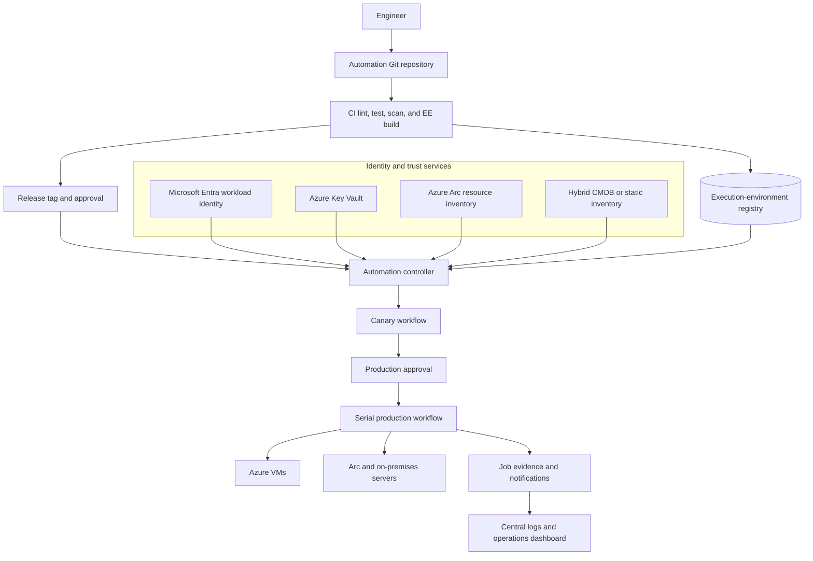

> **文档类型：** 动手实验
> **规范性术语：** **MUST**、**MUST NOT**、**SHOULD**、**SHOULD NOT** 和 **MAY** 是要求级别。
> **适用范围：** Ansible 自动化平台或 AWX、执行环境、Azure 和混合清单、身份、凭证、受控升级和恢复。
> **例外流程：** 偏离要求需要记录风险评估、补偿控制、指定风险负责人和到期日期。

|控制领域|价值|
|---|---|
|文件编号 | `HOL-05` |
|负责人|云卓越中心 |
|审核周期|至少每年一次，并且在 Ansible、提供商、安全性或源仓库发生重大变化之后 |
|证据|执行环境来源、清单和凭证映射、金丝雀和波次结果、批准、控制器作业和恢复证据 |

# 为 Azure 和混合服务器构建企业 Ansible 自动化平台

> **决策简述：** 使用以控制器为中心的 Ansible 平台，其中源、执行环境、清单、凭证、批准和证据是单独的管理边界。

> **文档类型：** 动手实验  
> **难度：** 高级  
> **预计持续时间：** 4–6 小时  
> **主要服务：** Ansible 自动化平台或 AWX、Azure、Microsoft Entra ID、Azure Key Vault、Azure Arc、Git 和私有容器注册表

## 实验室概述

### 场景

您正在为管理 Azure Virtual Machines、启用 Azure Arc 的服务器以及选定的本地 Linux 和 Windows 主机的平台组织构建共享自动化服务。应用和基础设施团队负责自己的自动化仓库，而平台团队负责控制器服务、执行环境供应链、清单集成、凭证、审计证据和生产边界。

完成的实验室必须证明工程师可以提交经过审查的自动化变更、构建不可变的执行环境、同步批准的内容、瞄准受控清单、运行金丝雀工作流程、获取生产批准、以有界波次执行以及生成可以与变更记录相关的证据。

这是一个平台构建实验室，而不是临时 Playbook 示例的集合。该实验室有意将托管工作负载保持在较小水平，以便信任边界和操作模型保持可见。

### 学习目标

通过完成本实验，您将能够：

1. 独立的自动化创作、验证、执行、清单、身份和证据。
2. 构建具有固定 Ansible 和集合依赖项的执行环境。
3. 为 Azure 和混合服务器配置清单模型，而不在 Git 中存储机密。
4. 使用 Microsoft Entra 工作负载身份或托管身份进行 Azure API 访问。
5. 通过批准的机密提供商集成目标凭据。
6. 创建控制器项目、清单、凭证、作业模板和工作流程。
7. 通过测试、登台和生产边界晋级一个自动化版本。
8. 执行金丝雀和串行维护工作流程以及更改后的运行状况检查。
9. 采集源修订、运行时、身份、目标范围、结果和恢复的证据。
10. 删除实验室资源并验证是否没有剩余测试凭据或计费资源。

### 实验室成功标准

仅当满足以下条件时，实验室才算完成：

- 控制器执行不可变的、本地可复制的执行环境；
- 同源修订版经过测试和晋级；
- Azure 和混合清单日志记录按环境和所有权分开；
- 未经授权的用户无法选择生产凭证；
- 当金丝雀健康门失败时工作流程停止；
- 生产运行使用有界并发和目标限制；
- 作业日志记录包含来源、运行时间、身份、清单、目标和结果证据；和
- 清理删除实验室身份、机密、控制器对象和测试目标或将它们恢复到基线。

## 目标架构

控制器可以是 Ansible Automation Platform、AWX 或等效的企业服务。即使产品名称不同，平台也必须保留图中表示的功能。

## 先决条件

准备：

- 有权创建资源组、托管身份、Key Vault 以及测试 VM 或 Arc 连接目标的 Azure 订阅或实验室租户；
- 可以安全配置和恢复的 Linux 或 Windows 目标；
- Git 仓库和受保护的分支；
- 容器构建工具，例如 Podman 或 Docker；
- 具有管理引导账户的 Ansible 控制器或 AWX 实例；
- 从执行节点到目标主机的网络可达性；
- 机密提供商集成或过期的临时实验室证书；和
- 记录每个创建的资源的清理脚本或运行手册。

请勿在本实验中使用生产订阅、生产控制器或可复用的生产凭证。如果混合目标不可用，请使用第二个隔离虚拟机模拟该目标并记录限制。

## 实验室序列

|模块|活动 |检查站|
|---:|---|---|
| 0 |准备实验室和信任边界 |日志记录范围、身份、网络和清理计划。 |
| 1 |创建自动化仓库 | Playbook 契约、测试和依赖项均已版本化。 |
| 2 |搭建执行环境|镜像是可复制、扫描的，并由不可变的摘要标记。 |
| 3 |连接 Azure 和混合清单 |清单仅返回批准的目标，并在不可用时安全失败。 |
| 4 |配置身份和机密 |控制器作业使用最低权限的非 Git 凭据。 |
| 5 |创建控制器对象 |项目、清单、凭证、作业模板和工作流程是有限的。 |
| 6 |晋级与执行 |金丝雀、审批、批量生产、健康门通过。 |
| 7 |审查证据并恢复 |作业证据、回滚或前向恢复以及审计关联已完成。 |
| 8 |清理 |实验室资源、机密和访问权限已删除或过期。 |

## 模块0：建立平台契约

在创建资源之前编写一个简短的平台契约。它应该确定：

- 自动化所有者和操作员群体；
- 支持的目标操作系统和连接方法；
- Azure API 范围和目标服务器权限；
- 环境和生产审批边界；
- 清单来源和刷新行为；
- 执行环境搭建及提升路径；
- 日志、输出、机密和保留规则；
- 实验室的最大目标数量和并发性；和
- 恢复和清理所有者。

为工程师、CI 发布者、控制器服务、Azure API 和目标连接使用单独的身份。对于本地实验室来说，分离可能会得到简化，但必须记录生产图。

## 模块 1：创建自动化仓库

使用将可部署工作流与可复用内容分开的结构：
```text
ansible-platform-lab/
├── ansible.cfg
├── collections/requirements.yml
├── execution-environment.yml
├── inventories/
│   ├── dev/hosts.yml
│   ├── staging/hosts.yml
│   └── prod/hosts.yml
├── playbooks/
│   ├── baseline.yml
│   ├── maintenance.yml
│   └── validate.yml
├── roles/
│   └── baseline/
│       ├── defaults/main.yml
│       ├── tasks/main.yml
│       ├── handlers/main.yml
│       └── molecule/default/
├── tests/
├── .ansible-lint
└── README.md
```
基线角色应仅管理小型安全契约，例如包、配置文件、服务和运行状况端点。包括明确的预检查和验证手册。使用完全限定的集合名称、安全默认值并且不嵌入密码。

执行环境定义示例：
```yaml
version: 3
images:
  base_image:
    name: registry.example.com/platform/ansible-ee-base:1.0
dependencies:
  galaxy: collections/requirements.yml
  python: requirements.txt
additional_build_steps:
  append_final:
    - RUN ansible-galaxy collection list
```
根据组织的支持策略固定基础镜像、集合、Python 包和系统依赖项。实验室可以在初始开发期间使用标签，但控制器必须引用生成的摘要以进行生产模拟。

## 模块2：构建并验证执行环境

在 CI 或受控本地构建中运行以下检查：
```powershell
ansible-lint playbooks roles
ansible-playbook --syntax-check playbooks/baseline.yml
ansible-builder build --tag registry.example.com/platform/ansible-ee:1.0.0
podman run --rm registry.example.com/platform/ansible-ee:1.0.0 ansible-playbook --version
```
添加机密扫描、依赖性扫描、镜像扫描以及针对隔离目标启动角色的测试。仅在检查通过后发布镜像。记录摘要、构建源修订、构建器版本、集合锁定和扫描结果。

执行环境包含控制器端依赖项，例如清单插件、查找插件、过滤器和云 SDK。模块在受管节点上执行，并需要角色记录在案的目标端依赖项。

## 模块 3：对 Azure 和混合清单进行建模

清单是一个访问边界，也是一个数据源。每个目标应包含所有权、环境、区域、操作系统、维护窗口、关键性和生命周期状态。当动态源返回空或不明确的结果时，它必须安全地失败。

静态清单契约示例：
```yaml
all:
  children:
    azure_dev:
      vars:
        target_environment: development
        target_owner: platform-lab
      hosts:
        azure-dev-01:
          ansible_host: 10.10.1.4
          ansible_user: automation
    hybrid_staging:
      vars:
        target_environment: staging
        target_owner: operations-lab
      hosts:
        hybrid-stage-01:
          ansible_host: 10.20.1.4
          ansible_user: automation
```
对于 Azure，清单可以来自批准的 Azure 清单插件或生成的资源查询。对于混合服务器，当不存在权威系统时，请使用 Azure Arc、CMDB 或 Git 管理的清单。将凭据保留在文件之外。

测试清单行为：

- 预期目标发现；
- 不可用的 API 或 CMDB；
- 空结果；
- 未经授权的目标；
- 退役目标；和
- 属于另一个环境的目标。

## 模块 4：配置身份和机密

创建单独的实验室权限：

- CI：发布执行环境和报告验证；
- 控制器：启动批准的工作流程并读取清单；
- Azure API：读取清单并仅执行声明的平台操作；
- 目标连接：配置测试服务器；和
- 操作员：检查工作证据并批准生产模拟。

将目标密码、SSH 密钥、WinRM 证书和云令牌存储在批准的机密提供程序中。如果可用，请使用 Key Vault 支持的凭据集成。验证失败的作业不会打印机密，并且团队无法在其范围之外选择凭证。

## 模块 5：配置控制器对象

创建这些控制器对象：

|对象|实验室配置|
|---|---|
|项目|仓库 URL、受保护的修订策略、执行环境 |
|清单|开发、登台和生产模拟清单 |
|证书 |控制器到目标和 Azure API 凭据，范围分开 |
|作业模板|基线策略、固定清单和限制策略 |
|工作流程|预检查→金丝雀→批准→串行运行→验证|
|通知 |包含更改参考的失败和完成通知 |
|团队与角色 |作者、操作者、审批者和凭证管理员分离 |

作业模板应仅允许来自批准集的受控 `limit` 或调查输入。它不得允许任意凭证 ID、项目修订或 playbook 路径。

## 模块 6：执行受控晋级

按此顺序运行工作流程：

1. CI 验证内容并搭建执行环境。
2. 控制器同步批准的修订。
3. 预检查验证操作系统、连接性、维护时段、磁盘、服务状态和目标所有权。
4. 金丝雀目标运行基线角色。
5. 自动验证检查服务、配置和遥测。
6. 操作员批准分段或生产模拟。
7. 工作流程执行有界串行波。
8. 当超过故障阈值或运行状况门时，工作流程停止。
9. 后检查记录结果并结束或升级变更。

使用故意失败的金丝雀测试来证明工作流程在广泛突变之前停止。恢复实验室目标并从批准的修订版重新运行。

## 模块 7：证据和恢复

导出或日志记录：

- 仓库 URL 和提交；
- 执行环境镜像摘要；
- 清单来源和目标清单；
- 控制器作业和工作流程标识符；
- 凭证身份，而不是机密值；
- 审批者和变更参考；
- 开始、结束、结果、更改计数和失败任务；
- 预检查和后检查输出；和
- 回滚、前向恢复或手动后续操作。

恢复设计取决于更改。配置文件可以从以前的制品恢复；软件包更新可能需要支持的降级；数据库或证书更改可能需要前向恢复。记录实际方法并进行测试。

## 验证

- [ ] 仓库不包含机密值。
- [ ] 执行环境根据固定的、经过审查的定义构建。
- [ ] CI 因语法、lint、依赖项、机密或镜像扫描错误而失败。
- [ ] 当源不可用时，清单无法静默返回每个主机。
- [ ] 控制器 RBAC 可防止未经授权的生产凭证或清单访问。
- [ ] 生产模拟工作流程使用固定的 Playbook 和有界的目标范围。
- [ ] 金丝雀失败阻止了下一波次。
- [ ] 第二次合规运行不会产生意外的更改。
- [ ] 工作证据与来源、运行时间、身份、目标、批准和结果相关。
- [ ] 清理会删除测试凭据、控制器对象和 Azure 资源。

## 清理

1. 禁用或删除实验室计划、Webhook 和控制器作业模板。
2. 删除实验室凭据和 Key Vault 机密。
3. 在策略允许的情况下删除测试身份、角色分配和注册表镜像。
4. 删除 Azure VM 或 Arc 测试注册。
5. 撤销临时网络访问权限和操作员账户。
6. 确认没有修改生产清单或凭证。
7. 根据文件保留策略存储实验室证据和清理结果。

## 相关主题

- [Ansible 自动化架构参考模型](../infra-architecture/ansible-automation-architecture-reference-model.md)
- [Ansible 自动化工程标准](../standards-best-practices/ansible-automation-engineering-standard.md)
- [CI/CD 和操作的 Ansible 交付模式](../ci-cd-automation/ansible-delivery-patterns-for-cicd-and-operations.md)
- [如何通过受控晋级在 CI/CD 中实现 Ansible 自动化](../how-to-guides/how-to-implement-ansible-automation-in-cicd-with-controlled-promotion.md)
- [云平台补丁、漏洞及维护操作](../operations-reliability-finops/patch-vulnerability-and-maintenance-operations-for-cloud-platforms.md)

## 参考文档

- [Ansible 执行环境](https://docs.ansible.com/projects/ansible/latest/collections/community/general/docsite/guide_ee.html)
- [Ansible 生成器](https://docs.ansible.com/projects/builder/en/latest/)
- [启用 Azure Arc 的服务器](https://learn.microsoft.com/en-us/azure/azure-arc/servers/overview)
- [Azure Key Vault 概述](https://learn.microsoft.com/en-us/azure/key-vault/general/overview)