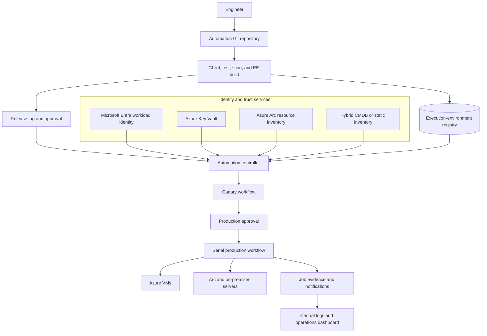

> **Document class:** Hands-on Labs guided implementation lab
> **Normative terms:** **MUST**, **MUST NOT**, **SHOULD**, **SHOULD NOT**, and **MAY** are requirements levels.
> **Applicability:** Ansible Automation Platform or AWX, execution environments, Azure and hybrid inventory, identity, credentials, controlled promotion, and recovery.
> **Exception process:** Deviations require a documented risk assessment, compensating controls, named risk owner, and expiry date.

| Control field | Value |
|---|---|
| Document ID | `HOL-05` |
| Owner | Cloud Center of Excellence |
| Review cycle | At least annually and after material Ansible, provider, security, or source-repository changes |
| Evidence | Execution-environment provenance, inventory and credential mappings, canary and wave results, approvals, controller jobs, and recovery evidence |

# Build an Enterprise Ansible Automation Platform for Azure and Hybrid Servers

> **Decision in brief:** Use a controller-centered Ansible platform where source, execution environments, inventory, credentials, approvals, and evidence are separate managed boundaries.

> **Document type:** Guided hands-on lab  
> **Difficulty:** Advanced  
> **Estimated duration:** 4–6 hours  
> **Primary services:** Ansible Automation Platform or AWX, Azure, Microsoft Entra ID, Azure Key Vault, Azure Arc, Git, and a private container registry

## Lab overview

### Scenario

You are building a shared automation service for a platform organization that manages Azure virtual machines, Azure Arc-enabled servers, and selected on-premises Linux and Windows hosts. Application and infrastructure teams own their automation repositories, while the platform team owns the controller service, execution-environment supply chain, inventory integration, credentials, audit evidence, and production boundaries.

The completed lab must prove that an engineer can submit a reviewed automation change, build an immutable execution environment, synchronize approved content, target a controlled inventory, run a canary workflow, obtain production approval, execute in bounded waves, and produce evidence that can be correlated to a change record.

This is a platform construction lab, not a collection of ad hoc playbook examples. The lab intentionally keeps the managed workload small so that the trust boundaries and operating model remain visible.

### Learning objectives

By completing this lab, you will be able to:

1. Separate automation authoring, validation, execution, inventory, identity, and evidence.
2. Build an execution environment with pinned Ansible and collection dependencies.
3. Configure an inventory model for Azure and hybrid servers without storing secrets in Git.
4. Use Microsoft Entra workload identity or managed identity for Azure API access.
5. Integrate target credentials through an approved secret provider.
6. Create controller projects, inventories, credentials, job templates, and workflows.
7. Promote one automation release through test, staging, and production boundaries.
8. Execute a canary and serial maintenance workflow with post-change health checks.
9. Capture evidence for source revision, runtime, identity, target scope, result, and recovery.
10. Remove lab resources and verify that no test credentials or billable resources remain.

### Lab success criteria

The lab is complete only when:

- the controller executes an immutable, locally reproducible execution environment;
- the same source revision is tested and promoted;
- Azure and hybrid inventory records are separated by environment and ownership;
- production credentials cannot be selected by an unauthorized user;
- the workflow stops when the canary health gate fails;
- the production run uses bounded concurrency and a target limit;
- the job record contains source, runtime, identity, inventory, target, and outcome evidence; and
- cleanup removes lab identities, secrets, controller objects, and test targets or restores them to baseline.

## Target architecture



The controller may be Ansible Automation Platform, AWX, or an equivalent enterprise service. The platform must preserve the capabilities represented in the diagram even when the product names differ.

## Prerequisites

Prepare:

- an Azure subscription or lab tenant with permission to create a resource group, managed identity, Key Vault, and test VM or Arc-connected target;
- a Linux or Windows target that can be safely configured and restored;
- a Git repository and protected branch;
- a container build tool such as Podman or Docker;
- an Ansible controller or AWX instance with an administrative bootstrap account;
- network reachability from the execution node to the target hosts;
- a secret provider integration or a temporary lab credential with an expiry; and
- a cleanup script or runbook that records every created resource.

Do not use a production subscription, production controller, or reusable production credential for this lab. If a hybrid target is unavailable, emulate the target with a second isolated VM and record the limitation.

## Lab sequence

| Module | Activity | Checkpoint |
|---:|---|---|
| 0 | Prepare the lab and trust boundaries | Scope, identities, network, and cleanup plan are recorded. |
| 1 | Create the automation repository | Playbook contract, tests, and dependencies are versioned. |
| 2 | Build the execution environment | Image is reproducible, scanned, and tagged by immutable digest. |
| 3 | Connect Azure and hybrid inventory | Inventory returns only approved targets and fails safely when unavailable. |
| 4 | Configure identities and secrets | Controller jobs use least-privilege, non-Git credentials. |
| 5 | Create controller objects | Project, inventory, credential, job templates, and workflow are bounded. |
| 6 | Promote and execute | Canary, approval, serial production, and health gates pass. |
| 7 | Review evidence and recover | Job evidence, rollback or forward recovery, and audit correlation are complete. |
| 8 | Clean up | Lab resources, secrets, and access are removed or expired. |

## Module 0: Establish the platform contract

Write a short platform contract before creating resources. It should identify:

- the automation owner and operator group;
- supported target operating systems and connection methods;
- Azure API scopes and target-server privileges;
- environments and production approval boundaries;
- the inventory source and refresh behavior;
- the execution-environment build and promotion path;
- log, output, secret, and retention rules;
- maximum target count and concurrency for the lab; and
- the recovery and cleanup owner.

Use a separate identity for the engineer, CI publisher, controller service, Azure API, and target connection. The separation may be simplified for a local lab, but the production mapping must be documented.

## Module 1: Create the automation repository

Use a structure that separates a deployable workflow from reusable content:

```text
ansible-platform-lab/
├── ansible.cfg
├── collections/requirements.yml
├── execution-environment.yml
├── inventories/
│   ├── dev/hosts.yml
│   ├── staging/hosts.yml
│   └── prod/hosts.yml
├── playbooks/
│   ├── baseline.yml
│   ├── maintenance.yml
│   └── validate.yml
├── roles/
│   └── baseline/
│       ├── defaults/main.yml
│       ├── tasks/main.yml
│       ├── handlers/main.yml
│       └── molecule/default/
├── tests/
├── .ansible-lint
└── README.md
```

The baseline role should manage only a small safe contract, such as a package, a configuration file, a service, and a health endpoint. Include an explicit precheck and a validation playbook. Use fully qualified collection names, safe defaults, and no embedded passwords.

Example execution-environment definition:

```yaml
version: 3
images:
  base_image:
    name: registry.example.com/platform/ansible-ee-base:1.0
dependencies:
  galaxy: collections/requirements.yml
  python: requirements.txt
additional_build_steps:
  append_final:
    - RUN ansible-galaxy collection list
```

Pin the base image, collections, Python packages, and system dependencies according to the organization’s support policy. The lab can use a tag during initial development, but the controller must reference the resulting digest for production simulation.

## Module 2: Build and validate the execution environment

Run the following checks in CI or a controlled local build:

```powershell
ansible-lint playbooks roles
ansible-playbook --syntax-check playbooks/baseline.yml
ansible-builder build --tag registry.example.com/platform/ansible-ee:1.0.0
podman run --rm registry.example.com/platform/ansible-ee:1.0.0 ansible-playbook --version
```

Add secret scanning, dependency scanning, image scanning, and a test that launches the role against an isolated target. Publish the image only after the checks pass. Record the digest, build source revision, builder version, collection lock, and scan result.

The execution environment contains controller-side dependencies such as inventory plugins, lookup plugins, filters, and cloud SDKs. Modules execute on managed nodes and require the target-side dependencies documented by the role.

## Module 3: Model Azure and hybrid inventory

Inventory is an access boundary as well as a data source. Each target should carry ownership, environment, region, operating system, maintenance window, criticality, and lifecycle state. A dynamic source must fail safely when it returns an empty or ambiguous result.

Example static inventory contract:

```yaml
all:
  children:
    azure_dev:
      vars:
        target_environment: development
        target_owner: platform-lab
      hosts:
        azure-dev-01:
          ansible_host: 10.10.1.4
          ansible_user: automation
    hybrid_staging:
      vars:
        target_environment: staging
        target_owner: operations-lab
      hosts:
        hybrid-stage-01:
          ansible_host: 10.20.1.4
          ansible_user: automation
```

For Azure, inventory can be sourced from an approved Azure inventory plugin or a generated resource query. For hybrid servers, use Azure Arc, CMDB, or a Git-managed inventory when no authoritative system exists. Keep credentials outside the file.

Test inventory behavior for:

- expected target discovery;
- an unavailable API or CMDB;
- an empty result;
- an unauthorized target;
- a decommissioned target; and
- a target that belongs to another environment.

## Module 4: Configure identity and secrets

Create separate lab permissions for:

- CI: publish execution environments and report validation;
- controller: start approved workflows and read inventory;
- Azure API: read inventory and perform only the declared platform actions;
- target connection: configure the test servers; and
- operator: inspect job evidence and approve production simulation.

Store target passwords, SSH keys, WinRM certificates, and cloud tokens in the approved secret provider. Use a Key Vault-backed credential integration when available. Verify that a failed job does not print the secret and that a credential cannot be selected by a team outside its scope.

## Module 5: Configure controller objects

Create these controller objects:

| Object | Lab configuration |
|---|---|
| Project | Repository URL, protected revision policy, execution environment |
| Inventories | Dev, staging, and production-simulation inventories |
| Credentials | Controller-to-target and Azure API credentials, separately scoped |
| Job template | Baseline playbook, fixed inventory and limit policy |
| Workflow | Precheck → canary → approval → serial run → validation |
| Notification | Failure and completion notification with change reference |
| Team and role | Author, operator, approver, and credential administrator separation |

The job template should allow a controlled `limit` or survey input only from an approved set. It must not allow arbitrary credential IDs, project revisions, or playbook paths.

## Module 6: Execute controlled promotion

Run the workflow in this order:

1. CI validates the content and builds the execution environment.
2. The controller synchronizes the approved revision.
3. Prechecks verify operating system, connectivity, maintenance window, disk, service state, and target ownership.
4. A canary target runs the baseline role.
5. Automated validation checks the service, configuration, and telemetry.
6. An operator approves staging or production simulation.
7. The workflow executes a bounded serial wave.
8. The workflow stops when the failure threshold or health gate is exceeded.
9. Postchecks record the outcome and close or escalate the change.

Use a deliberately failing canary test to prove that the workflow stops before broad mutation. Restore the lab target and rerun from the approved revision.

## Module 7: Evidence and recovery

Export or record:

- repository URL and commit;
- execution-environment image digest;
- inventory source and target list;
- controller job and workflow identifiers;
- credential identity, not the secret value;
- approver and change reference;
- start, end, result, changed count, and failed task;
- precheck and postcheck output; and
- rollback, forward-recovery, or manual-follow-up action.

The recovery design depends on the change. A configuration file may be restored from the previous artifact; a package update may require a supported downgrade; a database or certificate change may require forward recovery. Document the actual method and test it.

## Validation

- [ ] The repository contains no secret values.
- [ ] The execution environment builds from a pinned, reviewed definition.
- [ ] CI fails on syntax, lint, dependency, secret, or image-scan errors.
- [ ] Inventory cannot silently return every host when its source is unavailable.
- [ ] Controller RBAC prevents unauthorized production credential or inventory access.
- [ ] The production-simulation workflow uses a fixed playbook and bounded target scope.
- [ ] Canary failure prevents the next wave.
- [ ] The second compliant run produces no unintended changes.
- [ ] Job evidence is correlated to source, runtime, identity, target, approval, and outcome.
- [ ] Cleanup removes test credentials, controller objects, and Azure resources.

## Cleanup

1. Disable or delete lab schedules, webhooks, and controller job templates.
2. Remove lab credentials and Key Vault secrets.
3. Delete test identities, role assignments, and registry images where policy permits.
4. Remove Azure VMs or Arc test registrations.
5. Revoke temporary network access and operator accounts.
6. Confirm that no production inventory or credential was modified.
7. Store the lab evidence and cleanup result according to the documentation retention policy.

## Related topics

- [Ansible Automation Architecture Reference Model](../infra-architecture/ansible-automation-architecture-reference-model.md)
- [Ansible Automation Engineering Standard](../standards-best-practices/ansible-automation-engineering-standard.md)
- [Ansible Delivery Patterns for CI/CD and Operations](../ci-cd-automation/ansible-delivery-patterns-for-cicd-and-operations.md)
- [How to Implement Ansible Automation in CI/CD with Controlled Promotion](../how-to-guides/how-to-implement-ansible-automation-in-cicd-with-controlled-promotion.md)
- [Patch, Vulnerability, and Maintenance Operations for Cloud Platforms](../operations-reliability-finops/patch-vulnerability-and-maintenance-operations-for-cloud-platforms.md)

## References

- [Ansible execution environments](https://docs.ansible.com/projects/ansible/latest/collections/community/general/docsite/guide_ee.html)
- [Ansible Builder](https://docs.ansible.com/projects/builder/en/latest/)
- [Azure Arc-enabled servers](https://learn.microsoft.com/en-us/azure/azure-arc/servers/overview)
- [Azure Key Vault overview](https://learn.microsoft.com/en-us/azure/key-vault/general/overview)
