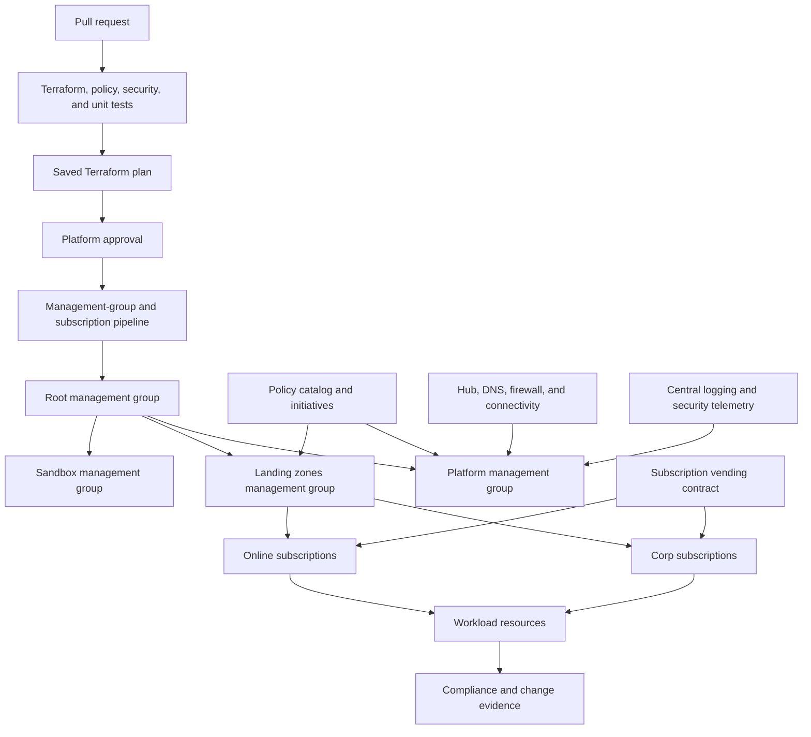
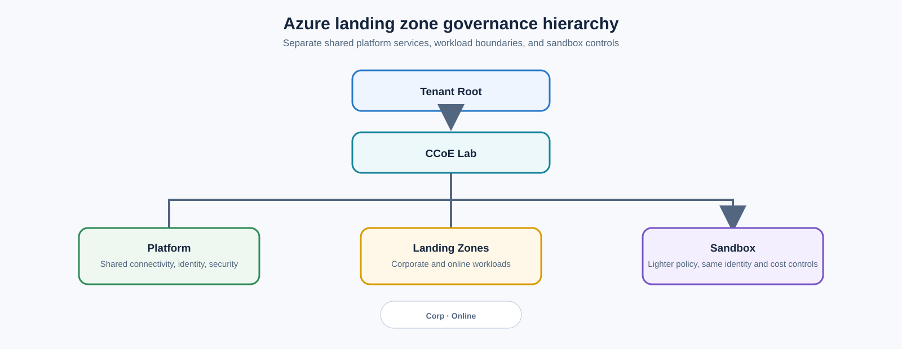

> **文档类型：** 动手实验
> **规范性术语：** **MUST**、**MUST NOT**、**SHOULD**、**SHOULD NOT** 和 **MAY** 是要求级别。
> **适用范围：** Azure 落地工作区层次结构、Terraform 后端、策略即代码、渐进式实施、订阅接入、治理测试和例外。
> **例外流程：** 偏离要求需要记录风险评估、补偿控制、指定风险负责人和到期日期。

|控制领域|价值|
|---|---|
|文件编号 | `HOL-06` |
|负责人|云卓越中心 |
|审核周期|至少每年一次以及在 Azure、Terraform、策略、安全或源仓库发生重大更改之后 |
|证据| Git 修订和后端状态、层次结构部署、策略测试、合规性结果、入驻检查、异常日志记录和清理证据 |

# 使用 Terraform 和策略即代码构建受治理的 Azure 落地工作区

> **决策简述：** 部署一个小型代表性 Landing Zone，以逐渐更强的模式证明策略行为，并记录每个异常的所有者、到期日、控制和证据。

> **文档类型：** 动手实验  
> **难度：** 高级  
> **预计持续时间：** 5–8 小时  
> **主要服务：** Azure 管理组、订阅、Microsoft Entra ID、Azure Policy、Azure Monitor、Log Analytics、虚拟网络、Terraform 和 GitHub Actions 或 Azure DevOps

## 实验室概述

### 场景

您是一名平台工程师，为多个工作负载团队建立 Azure 基础。基础平台必须分离平台和应用所有权，通过管理组范围应用策略，提供安全的网络和日志记录基线，并通过经过审查的 Terraform 工作流程发放工作负载订阅。

该实验室使用小型层次结构和一个工作负载订阅或资源组模拟。它演示了在应用团队获取自助服务访问之前必须标准化的控制平面决策。该设计有意由策略驱动：Terraform 表达了所需的层次结构和分配，而策略评估和合规性证据证明该平台正在按预期运行。

### 学习目标

通过完成本实验，您将能够：

1. 设计一个管理组层次结构，将平台、在线、企业和沙箱工作负载分开。
2. 使用 Terraform 部署共享平台服务和连接基线。
3. 将 Azure Policy 计划定义为带有参数和豁免的版本化代码。
4. 在部署之前验证拉取请求中的 Terraform 和策略更改。
5. 安全地应用审核、不存在则部署和拒绝模式中的控制。
6. 通过受控契约发放工作负载订阅或模拟订阅入驻。
7. 证明身份、网络、日志、标记、位置和安全护栏。
8. 使用范围、所有者、到期日、补偿控制和证据来操作例外。

### 实验室成功标准

实验室在以下情况下完成：

- 管理组和策略分配仅由平台流水线创建；
- 应用访问的范围仅限于订阅或资源组级别，而不是广泛的管理组 RBAC；
- 对策略目录进行合规、不合规、边界和豁免情况的测试；
- 工作负载订阅接收预期的继承策略和平台设置；
- Terraform 计划和应用使用相同的经过审查的计划制品；
- 策略豁免范围狭窄、已批准、即将到期且可见；和
- 清理不会删除实验室范围之外的共享平台资源。

## 目标架构

层次结构就是一个例子。实验室必须记录管理组存在的原因、它接收哪些策略以及谁可以管理它。请勿使用管理组来代替计费或广泛分配应用团队权限。

## 先决条件和安全

准备：

- 授权管理组和策略更改的 Azure 租户和订阅；
- 具有状态锁定和限制访问的 Terraform 远程后端；
- 具有受保护分支和流水线身份联合的 Git 仓库；
- Azure CLI、Terraform、策略测试工具和安全扫描器；
- 经批准的命名、标记、区域和资源组约定；
- 每个资源、分配、角色、豁免和诊断设置的清理计划；和
- 对任何租户或管理组范围变更的书面批准。

如果没有变更记录和审查范围，请勿针对现有生产根层次结构运行此实验。首选租户根目录下的专用实验室管理组。当较小的角色可以执行任务时，切勿在租户范围内授予实验室流水线所有者。

## 实验室序列

|模块 |活动 |检查站|
|---|---|---|
| 0 |建立范围和身份|记录租户、管理组范围、状态和清理。 |
| 1 |创建 Terraform 仓库和后端 |状态受到保护，根模块组合结构清晰。 |
| 2 |部署层次结构和共享服务|创建管理组和平台资源。 |
| 3 |建立策略目录|控件具有 ID、测试、所有者、参数和证据。 |
| 4 |验证和分配策略 |审核基线、修复、拒绝和豁免按设计运行。 |
| 5 |加入工作负载订阅 |Workload Landing Zone 接收网络、身份、日志记录和策略契约。 |
| 6 |运行治理测试 |不合规的部署失败或按预期报告。 |
| 7 |操作异常|展示了豁免批准、到期和补偿控制。 |
| 8 |审查证据并清理|流水线、策略、资源和清理证据已完成。 |

## 模块0：定义控制契约

为每个控制域创建一个表：

|领域 |控制目标|范围 |执法|证据|负责人|
|---|---|---|---|---|---|
|身份 |没有长期广泛的应用团队特权|管理组和订阅 | RBAC 和 PIM |角色分配和访问审核 |身份平台|
|地点 |工作负载使用批准的区域 |Landing Zone 管理组|拒绝|策略合规|云治理|
|标签 |所有者、服务、环境、成本和数据类别存在 |订阅 |修改或否认 |Resource Graph 和策略状态| FinOps/平台 |
|网络|公共暴露和出口遵循设计|订阅/资源组 |拒绝或审核|策略和网络日志 |网络平台|
|日志记录 |诊断设置到达中央工作区|平台和 Landing Zone |如果不存在则部署 |工作区表和策略|运营|
|安全|启用 Defender 和基线控制 |租户/订阅|审核或部署 |Defender 建议|安全|
控制契约可以防止策略举措成为一系列互不相关的规则。每条规则都必须有一个原因、一个安全的修复路径、一个异常过程和一个可报告的结果。

## 模块 1：仓库和后端

使用根模块组合来分隔层次结构、策略、平台服务、连接性和订阅发放：
```text
azure-landing-zone-lab/
├── backend.tf
├── providers.tf
├── main.tf
├── variables.tf
├── outputs.tf
├── environments/lab.tfvars
├── modules/
│   ├── management-groups/
│   ├── policy-initiative/
│   ├── platform-logging/
│   ├── hub-network/
│   └── subscription-vending/
├── policies/
│   ├── definitions/
│   ├── initiatives/
│   ├── tests/
│   └── exemptions/
└── .github/workflows/ or pipelines/
```
状态后端必须使用 Microsoft Entra 授权、所需的私有连接、状态锁定、受限数据平面访问以及与工作负载身份分开的状态身份。流水线必须运行格式化、初始化、验证、安全扫描、策略测试、计划并应用保存的计划切换。

## 模块 2：部署层次结构和共享服务

创建实验室层次结构，例如：



平台组包含共享连接、身份、安全、日志记录和管理订阅。Landing Zone 组包含工作负载订阅。沙盒接收了故意更轻的策略集，但仍然保留身份、日志记录和成本控制。

仅部署实验室所需的共享服务：

- 中心虚拟网络和批准的 DNS 路径；
- 防火墙或出口检查占位符；
- Log Analytics 工作区和诊断目的地；
- 中央安全和活动日志路由；
- Key Vault 或机密平台参考；
- 需要时私有 DNS 和私有端点模式；和
- 具有标准标签和所有权的资源组。

不要仅仅为了简化实验室而将应用工作负载资源放入平台订阅中。边界是学习成果的一部分。

## 模块 3：构建策略即代码

对于每个策略定义，日志记录：

- 控制 ID 和要求；
- 效果和参数；
- 转让范围和排除；
- 模式：审核、修改、如果不存在则部署、拒绝或其他支持的模式；
- 修复身份和权限；
- 误报和豁免行为；
- 测试用例和预期证据；
- 所有者和审查日期；和
- 弃用或迁移路径。

策略测试应涵盖：

1. 合规资源；
2. 明显不合规的资源；
3. 参数边界处的资源；
4. 具有经批准豁免的资源；和
5. 不可用的依赖项或修复失败。

策略倡议参数契约示例：
```hcl
variable "allowed_locations" {
  type        = list(string)
  description = "Approved Azure regions for this landing-zone archetype."
}

variable "log_analytics_id" {
  type        = string
  description = "Central workspace used by deploy-if-not-exists policies."
}
```
不要将特定于租户的例外编码为永久策略排除。使用具有到期和补偿控制的豁免。

## 模块 4：安全地实施执法

使用分阶段执行：

1. 在审核模式下分配策略倡议并建立基线。
2. 纠正误报、缺失参数和修复权限。
3. 使用“modify”或“deploy-if-not-exists”来实现安全、幂等的元数据和诊断。
4. 对高可信度控制使用拒绝，例如禁止位置或已准备好例外流程的公开曝光。
5. 监控评估延迟、修复失败、拒绝部署和豁免。
6. 通过与其他平台变更相同的受保护 Terraform 工作流程来晋级策略变更。

策略模式是一个风险决策。没有操作异常路径的拒绝分配可能会阻止合法的事件响应；对关键安全漏洞进行仅审计分配可能会使组织不受保护。

## 模块 5：加入工作负载订阅

使用自动预配输入对象，例如：
```yaml
workload:
  name: claims-platform
  archetype: online
  owner: product-claims
  cost_center: CC-042
  data_classification: confidential
  region: eastus
  network_mode: private
  logging_profile: standard
  support_tier: business-critical
  requested_environments: [dev, test, prod]
```
自动预配工作流应验证请求、创建或关联订阅、将其置于正确的管理组下、分配策略、创建资源组和标签、授予范围 RBAC、连接日志记录和网络，并发出加入日志记录。

应用团队收到他们需要的工作负载契约和输出。他们不应仅仅因为订阅是为其发放的而获取管理组策略或平台订阅所有者访问权限。

## 模块 6：治理测试

至少测试：

- 禁区内的资源；
- 资源缺少所需标签；
- 公共存储或数据库配置；
- 没有诊断的资源；
- 未经授权的角色分配；
- 合规的私有资源；
- 范围狭窄的批准豁免；和
- 失败的修复身份。

记录策略定义、分配、资源 ID、时间戳、效果、合规状态和修复结果。通过 Azure Resource Graph 或批准的合规性平台查询证据。

## 模块7：操作异常

仅在记录后创建异常：

- 请求者和业务原因；
- 受影响的资源或范围；
- 风险和补偿控制；
- 负责任的风险责任人；
- 开始日期和到期日期；
- 批准和变更参考；和
- 审查和删除行动。

使用最窄的范围。确保豁免到期状态可见，并且过期的豁免不会悄悄地变成永久豁免。如果控件需要重复的异常，请重新设计控件或工作负载配置文件。

## 验证

- [ ] Terraform 状态是远程的、锁定的、受保护的，并且通过最小权限进行访问。
- [ ] 流水线应用已审核的已保存计划。
- [ ] 管理组已记录策略和所有权边界。
- [ ] 工作负载团队不接收广泛的管理组 RBAC。
- [ ] 策略测试涵盖合规、不合规、边界、豁免和失败案例。
- [ ] 已执行审核、修复、拒绝和豁免模式。
- [ ] Landing Zone 接入会创建预期的身份、网络、日志、标签和策略契约。
- [ ] 策略和资源合规证据可查询并保留。
- [ ] 清理会删除仅限实验室的资源，而不会损坏共享平台范围。

## 清理

1. 仅删除实验室负责的工作负载资源和测试订阅。
2. 删除专为实验室创建的策略分配和豁免。
3. 删除实验室角色分配、身份、状态容器和诊断设置。
4. 保存最终计划、策略测试输出、合规证据和清理日志记录。
5. 确认共享平台资源和生产管理组未发生变化。

## 相关主题

- [将 Azure 落地工作区设计为产品](../cloud-foundations-governance/designing-an-azure-landing-zone-as-a-product.md)
- [策略、护栏和合规性](../cloud-foundations-governance/policy-guardrails-and-compliance.md)
- [基础设施即代码工程标准](../infrastructure-as-code/iac-infrastructure-as-code-engineering-standards.md)
- [如何实现策略即代码](../how-to-guides/how-to-implement-policy-as-code.md)
- [IaC 漂移检测、协调安全导入](../infrastructure-as-code/iac-drift-detection-reconciliation-and-safe-import.md)

## 参考文档

- [什么是 Azure 落地工作区？](https://learn.microsoft.com/en-us/azure/cloud-adoption-framework/ready/landing-zone/)
- [部署 Azure 落地工作区](https://learn.microsoft.com/en-us/azure/architecture/landing-zones/landing-zone-deploy)
- [Azure 管理组](https://learn.microsoft.com/en-us/azure/governance/management-groups/overview)
- [Azure Policy 文档](https://learn.microsoft.com/en-us/azure/governance/policy/overview)
- [Azure 落地工作区的订阅发放](https://learn.microsoft.com/en-us/azure/cloud-adoption-framework/ready/landing-zone/design-area/subscription-vending)
- [常见订阅发放产品线](https://learn.microsoft.com/en-us/azure/cloud-adoption-framework/ready/landing-zone/design-area/subscription-vending-product-lines)
