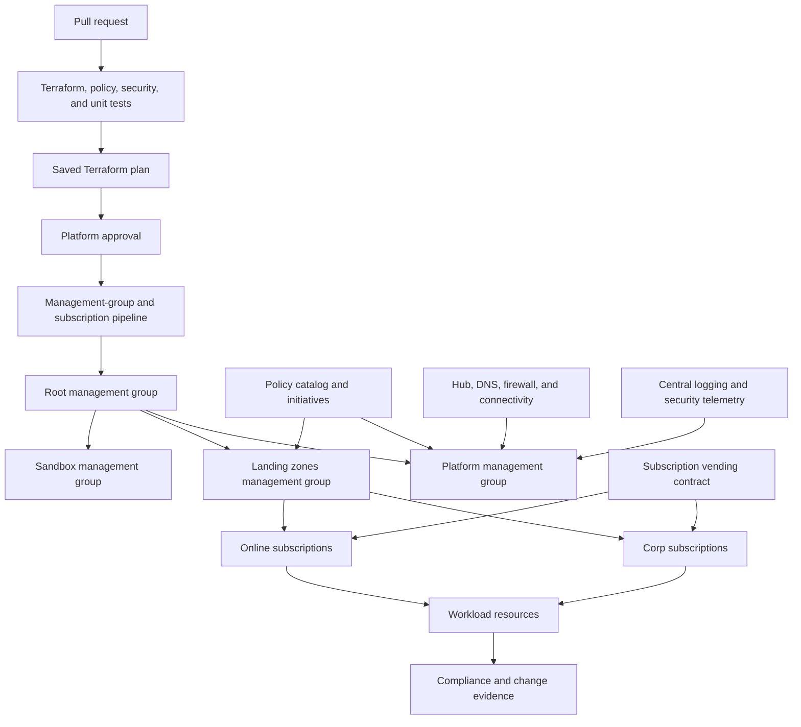

> **Document class:** Hands-on Labs guided implementation lab
> **Normative terms:** **MUST**, **MUST NOT**, **SHOULD**, **SHOULD NOT**, and **MAY** are requirements levels.
> **Applicability:** Azure landing-zone hierarchy, Terraform backends, policy-as-code, progressive enforcement, subscription onboarding, governance tests, and exceptions.
> **Exception process:** Deviations require a documented risk assessment, compensating controls, named risk owner, and expiry date.

| Control field | Value |
|---|---|
| Document ID | `HOL-06` |
| Owner | Cloud Center of Excellence |
| Review cycle | At least annually and after material Azure, Terraform, policy, security, or source-repository changes |
| Evidence | Git revision and backend state, hierarchy deployment, policy tests, compliance results, onboarding checks, exception records, and cleanup evidence |

# Build a Governed Azure Landing Zone with Terraform and policy-as-code

> **Decision in brief:** Deploy a small representative landing zone, prove policy behavior in progressively stronger modes, and record every exception with owner, expiry, controls, and evidence.

> **Document type:** Guided hands-on lab  
> **Difficulty:** Advanced  
> **Estimated duration:** 5–8 hours  
> **Primary services:** Azure management groups, subscriptions, Microsoft Entra ID, Azure Policy, Azure Monitor, Log Analytics, virtual networking, Terraform, and GitHub Actions or Azure DevOps

## Lab overview

### Scenario

You are a platform engineer establishing an Azure foundation for multiple workload teams. The foundation must separate platform and application ownership, apply policy through management-group scope, provide a secure network and logging baseline, and vend workload subscriptions through a reviewed Terraform workflow.

The lab uses a small hierarchy and one workload subscription or resource-group simulation. It demonstrates the control-plane decisions that must be standardized before application teams receive self-service access. The design is intentionally policy-driven: Terraform expresses the desired hierarchy and assignments, while policy evaluation and compliance evidence prove that the platform is operating as intended.

### Learning objectives

By completing this lab, you will be able to:

1. Design a management-group hierarchy that separates platform, online, corporate, and sandbox workloads.
2. Deploy shared platform services and a connectivity baseline with Terraform.
3. Define Azure Policy initiatives as versioned code with parameters and exemptions.
4. Validate Terraform and policy changes in pull requests before deployment.
5. Apply controls in audit, deploy-if-not-exists, and deny modes safely.
6. Vend a workload subscription or simulate subscription onboarding with a controlled contract.
7. Prove identity, networking, logging, tagging, location, and security guardrails.
8. Operate exceptions with scope, owner, expiry, compensating control, and evidence.

### Lab success criteria

The lab is complete when:

- management groups and policy assignments are created only by the platform pipeline;
- application access is scoped at subscription or resource-group level rather than broad management-group RBAC;
- the policy catalog is tested for compliant, noncompliant, boundary, and exempt cases;
- the workload subscription receives the expected inherited policy and platform settings;
- Terraform plan and apply use the same reviewed plan artifact;
- policy exemptions are narrow, approved, expiring, and visible; and
- cleanup does not remove shared platform resources outside the lab scope.

## Target architecture



The hierarchy is an example. The lab must document why a management group exists, which policies it receives, and who can manage it. Do not use management groups as a substitute for billing or for assigning application-team permissions broadly.

## Prerequisites and safety

Prepare:

- an Azure tenant and subscription where management-group and policy changes are authorized;
- a Terraform remote backend with state locking and restricted access;
- a Git repository with protected branches and pipeline identity federation;
- Azure CLI, Terraform, a policy testing tool, and a security scanner;
- an approved naming, tagging, region, and resource-group convention;
- a cleanup plan for every resource, assignment, role, exemption, and diagnostic setting; and
- a written approval for any tenant or management-group scope change.

Do not run this lab against an existing production root hierarchy without a change record and a reviewed scope. Prefer a dedicated lab management group below the tenant root. Never grant a lab pipeline Owner at tenant scope when a narrower role can perform the task.

## Lab sequence

| Module | Activity | Checkpoint |
|---:|---|---|
| 0 | Establish scope and identities | Tenant, management-group scope, state, and cleanup are recorded. |
| 1 | Create Terraform repository and backend | State is protected and the root composition is understandable. |
| 2 | Deploy hierarchy and shared services | Management groups and platform resources are created. |
| 3 | Build the policy catalog | Controls have IDs, tests, owners, parameters, and evidence. |
| 4 | Validate and assign policies | Audit baseline, remediation, deny, and exemptions behave as designed. |
| 5 | Onboard a workload subscription | Workload landing zone receives network, identity, logging, and policy contracts. |
| 6 | Run governance tests | Noncompliant deployments fail or are reported as intended. |
| 7 | Operate an exception | Exemption approval, expiry, and compensating control are demonstrated. |
| 8 | Review evidence and clean up | Pipeline, policy, resource, and cleanup evidence is complete. |

## Module 0: Define the control contract

Create a table for each control domain:

| Domain | Control objective | Scope | Enforcement | Evidence | Owner |
|---|---|---|---|---|---|
| Identity | No standing broad application-team privilege | Management group and subscription | RBAC and PIM | Role assignment and access review | Identity platform |
| Location | Workloads use approved regions | Landing-zone management group | Deny | Policy compliance | Cloud governance |
| Tags | Owner, service, environment, cost, and data class exist | Subscription | Modify or deny | Resource Graph and policy state | FinOps/platform |
| Network | Public exposure and egress follow design | Subscription/resource group | Deny or audit | Policy and network logs | Network platform |
| Logging | Diagnostic settings reach the central workspace | Platform and landing zones | Deploy-if-not-exists | Workspace tables and policy | Operations |
| Security | Defender and baseline controls are enabled | Tenant/subscription | Audit or deploy | Defender recommendations | Security |

The control contract prevents a policy initiative from becoming a list of disconnected rules. Each rule must have a reason, a safe remediation path, an exception process, and a reportable result.

## Module 1: Repository and backend

Use a root composition that separates hierarchy, policy, platform services, connectivity, and subscription vending:

```text
azure-landing-zone-lab/
├── backend.tf
├── providers.tf
├── main.tf
├── variables.tf
├── outputs.tf
├── environments/lab.tfvars
├── modules/
│   ├── management-groups/
│   ├── policy-initiative/
│   ├── platform-logging/
│   ├── hub-network/
│   └── subscription-vending/
├── policies/
│   ├── definitions/
│   ├── initiatives/
│   ├── tests/
│   └── exemptions/
└── .github/workflows/ or pipelines/
```

The state backend must use Microsoft Entra authorization, private connectivity where required, state locking, restricted data-plane access, and a separate state identity from workload identities. The pipeline must run formatting, initialization, validation, security scanning, policy tests, plan, and apply with a saved-plan handoff.

## Module 2: Deploy hierarchy and shared services

Create a lab hierarchy such as:


The Platform group contains shared connectivity, identity, security, logging, and management subscriptions. Landing-zone groups contain workload subscriptions. Sandbox receives a deliberately lighter policy set but still retains identity, logging, and cost controls.

Deploy only the shared services needed for the lab:

- hub virtual network and approved DNS path;
- firewall or egress inspection placeholder;
- Log Analytics workspace and diagnostic destination;
- central security and activity log routing;
- Key Vault or secret platform reference;
- private DNS and private endpoint pattern where required; and
- resource groups with standard tags and ownership.

Do not put workload application resources into the platform subscription merely to simplify the lab. The boundary is part of the learning outcome.

## Module 3: Build policy-as-code

For every policy definition, record:

- control ID and requirement;
- effect and parameters;
- assignment scope and exclusions;
- mode: audit, modify, deploy-if-not-exists, deny, or another supported mode;
- remediation identity and permissions;
- false-positive and exemption behavior;
- test cases and expected evidence;
- owner and review date; and
- deprecation or migration path.

Policy tests should cover:

1. a compliant resource;
2. a clearly noncompliant resource;
3. a resource at the parameter boundary;
4. an exempt resource with an approved exemption; and
5. an unavailable dependency or remediation failure.

Example initiative parameter contract:

```hcl
variable "allowed_locations" {
  type        = list(string)
  description = "Approved Azure regions for this landing-zone archetype."
}

variable "log_analytics_id" {
  type        = string
  description = "Central workspace used by deploy-if-not-exists policies."
}
```

Do not encode a tenant-specific exception as a permanent policy exclusion. Use an exemption with an expiry and compensating control.

## Module 4: Roll out enforcement safely

Use staged enforcement:

1. Assign the initiative in audit mode and establish the baseline.
2. Correct false positives, missing parameters, and remediation permissions.
3. Use modify or deploy-if-not-exists for safe, idempotent metadata and diagnostics.
4. Use deny for high-confidence controls such as forbidden locations or public exposure where the exception process is ready.
5. Monitor evaluation latency, remediation failures, denied deployments, and exemptions.
6. Promote policy changes through the same protected Terraform workflow as other platform changes.

Policy mode is a risk decision. A deny assignment without an operational exception path can block a legitimate incident response; an audit-only assignment for a critical security exposure can leave the organization unprotected.

## Module 5: Onboard a workload subscription

Use a vending input object such as:

```yaml
workload:
  name: claims-platform
  archetype: online
  owner: product-claims
  cost_center: CC-042
  data_classification: confidential
  region: eastus
  network_mode: private
  logging_profile: standard
  support_tier: business-critical
  requested_environments: [dev, test, prod]
```

The vending workflow should validate the request, create or associate the subscription, place it under the correct management group, assign policies, create resource groups and tags, grant scoped RBAC, connect logging and networking, and emit an onboarding record.

Application teams receive the workload contract and outputs they need. They should not receive management-group policy administration or platform subscription Owner access merely because the subscription was vended for them.

## Module 6: Governance tests

Test at least:

- a resource in a forbidden region;
- a resource missing required tags;
- a public storage or database configuration;
- a resource without diagnostics;
- an unauthorized role assignment;
- a compliant private resource;
- a narrowly scoped approved exemption; and
- a failed remediation identity.

Record the policy definition, assignment, resource ID, timestamp, effect, compliance state, and remediation result. Query the evidence through Azure Resource Graph or the approved compliance platform.

## Module 7: Operate an exception

Create an exception only after recording:

- requester and business reason;
- affected resource or scope;
- risk and compensating control;
- accountable risk owner;
- start and expiry date;
- approval and change reference; and
- review and removal action.

Use the narrowest scope. Prove that the expiry is visible and that an expired exemption does not silently become permanent. If a control requires repeated exceptions, redesign the control or the workload archetype.

## Validation

- [ ] Terraform state is remote, locked, protected, and accessed through least privilege.
- [ ] The pipeline applies the saved plan that was reviewed.
- [ ] Management groups have documented policy and ownership boundaries.
- [ ] Workload teams do not receive broad management-group RBAC.
- [ ] Policy tests cover compliant, noncompliant, boundary, exempt, and failure cases.
- [ ] Audit, remediation, deny, and exemption modes have been exercised.
- [ ] Landing-zone onboarding creates the expected identity, network, logging, tags, and policy contract.
- [ ] Policy and resource compliance evidence is queryable and retained.
- [ ] Cleanup removes lab-only resources without damaging shared platform scope.

## Cleanup

1. Remove workload resources and test subscriptions only if they are lab-owned.
2. Remove policy assignments and exemptions created solely for the lab.
3. Remove lab role assignments, identities, state containers, and diagnostic settings.
4. Preserve the final plan, policy test output, compliance evidence, and cleanup record.
5. Confirm that shared platform resources and production management groups were not changed.

## Related topics

- [Designing an Azure Landing Zone as a Product](../cloud-foundations-governance/designing-an-azure-landing-zone-as-a-product.md)
- [Policy, Guardrails, and Compliance](../cloud-foundations-governance/policy-guardrails-and-compliance.md)
- [Infrastructure as Code Engineering Standards](../infrastructure-as-code/iac-infrastructure-as-code-engineering-standards.md)
- [How to Implement policy-as-code](../how-to-guides/how-to-implement-policy-as-code.md)
- [IaC Drift Detection, Reconciliation, and Safe Import](../infrastructure-as-code/iac-drift-detection-reconciliation-and-safe-import.md)

## References

- [What is an Azure landing zone?](https://learn.microsoft.com/en-us/azure/cloud-adoption-framework/ready/landing-zone/)
- [Deploy Azure landing zones](https://learn.microsoft.com/en-us/azure/architecture/landing-zones/landing-zone-deploy)
- [Azure management groups](https://learn.microsoft.com/en-us/azure/governance/management-groups/overview)
- [Azure Policy documentation](https://learn.microsoft.com/en-us/azure/governance/policy/overview)
- [Subscription vending in Azure landing zones](https://learn.microsoft.com/en-us/azure/cloud-adoption-framework/ready/landing-zone/design-area/subscription-vending)
- [Common subscription vending product lines](https://learn.microsoft.com/en-us/azure/cloud-adoption-framework/ready/landing-zone/design-area/subscription-vending-product-lines)
