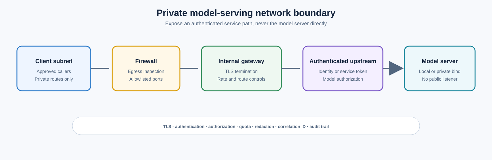

> **Document class:** Hands-on Labs guided implementation lab
> **Normative terms:** **MUST**, **MUST NOT**, **SHOULD**, **SHOULD NOT**, and **MAY** are requirements levels.
> **Applicability:** On-premises or private-cloud model acquisition, hardware validation, Ollama, llama.cpp, vLLM, optional KServe, endpoint security, and recovery.
> **Exception process:** Deviations require a documented risk assessment, compensating controls, named risk owner, and expiry date.

| Control field | Value |
|---|---|
| Document ID | `HOL-07` |
| Owner | Cloud Center of Excellence |
| Review cycle | At least annually and after material model, runtime, hardware, security, or source-repository changes |
| Evidence | Model license and checksum, hardware profile, benchmark report, endpoint hardening, Kubernetes validation, failure tests, and cleanup evidence |

# Deploy Open-Source LLMs On-Premises with Multiple Serving Options

> **Decision in brief:** Compare serving options against verified model, hardware, performance, safety, and operational requirements before selecting a production path.

> **Document type:** Guided hands-on lab
> **Difficulty:** Advanced
> **Estimated duration:** 6–10 hours
> **Primary environment:** Linux on-premises server or private virtualization cluster
> **Serving options:** Ollama, llama.cpp, vLLM, and optional Kubernetes with KServe

## Lab overview

### Scenario

You are an AI platform engineer asked to provide a local inference capability for an enterprise that cannot send a class of prompts and retrieved documents to an external managed API. The organization wants to evaluate several open-weight LLMs, compare CPU and GPU execution, expose a controlled internal API, and decide whether a single server, a private GPU cluster, or Kubernetes should become the production platform.

This lab deploys a small set of models using multiple serving approaches:

- **Ollama** for quick local development and a simple model lifecycle;
- **llama.cpp** for GGUF quantization, CPU plus GPU hybrid execution, and broad hardware support;
- **vLLM** for GPU-backed production-style OpenAI-compatible serving, batching, and concurrency; and
- **Kubernetes with KServe** as an optional platform path for teams that already operate GPU-enabled Kubernetes.

The lab does not assume that every model runs on every machine. The model files, licenses, hardware requirements, and runtime compatibility must be checked before download. The exact model revisions are variables in the lab so that the platform team can select approved versions rather than silently tracking a moving alias.

### Learning objectives

By completing this lab, you will be able to:

1. Inventory CPU, RAM, GPU, VRAM, storage, network, and virtualization capabilities.
2. Review model cards, licenses, acceptable-use terms, and artifact provenance.
3. Download or transfer approved model artifacts into a private local registry or model store.
4. Run the same representative prompt set through Ollama, llama.cpp, and vLLM.
5. Compare quality, time to first token, output rate, concurrency, memory, and cost.
6. Put authentication, TLS, quotas, logging, and network restrictions around local inference.
7. Deploy a GPU-backed model to Kubernetes as an optional advanced track.
8. Test failure, restart, model corruption, capacity exhaustion, and rollback behavior.
9. Produce a recommendation for the organization’s next deployment stage.

### Lab success criteria

The lab is complete when:

- at least two approved models have been served locally;
- the model revision, license, checksum, tokenizer, and serving configuration are recorded;
- at least two serving engines return a validated response to the same test set;
- the API is not exposed to an untrusted network without authentication and TLS;
- benchmark results include concurrency and memory behavior, not only one response time;
- a model or server failure produces a known recovery action; and
- the final recommendation explains which option is suitable for development, pilot, and production.

## Safety, licensing, and data rules

This lab is for approved internal or synthetic data. Do not send regulated, customer, credential, or production incident data to an unapproved model or log it in a terminal, shell history, notebook, proxy, or benchmark artifact.

Before downloading a model, record:

- repository and exact revision or commit;
- model card and license URL;
- acceptable-use and prohibited-use terms;
- whether commercial use and internal hosting are permitted;
- whether redistribution of weights is permitted;
- tokenizer and chat-template requirements;
- known safety and capability limitations; and
- checksum or digest of the transferred artifact.

Open-weight models are not automatically unrestricted. A model may have a custom license, registration requirement, acceptable-use policy, or separate terms for weights and code. Obtain legal or policy approval for production use.

## Model menu

The following models are useful lab candidates because they exercise different runtime and licensing paths. Replace them with the organization’s approved releases when the lab is used in a controlled environment.

| Model candidate | Format or runtime path | Useful lab purpose | Important consideration |
|---|---|---|---|
| Qwen2.5-7B-Instruct | Safetensors for vLLM; GGUF for llama.cpp/Ollama | General text generation and tool or structured-output evaluation | Verify the exact model revision and Apache 2.0 model terms |
| Mistral-7B-Instruct-v0.3 | Safetensors or compatible GGUF | Compare another 7B instruction model and tokenizer behavior | Review Apache 2.0 license and model limitations |
| Gemma 3 4B IT | Safetensors or supported local format | Smaller model, multimodal-capable family, lower memory profile | Access and usage terms require review and acceptance |
| Phi-3.5-mini-instruct | Safetensors or compatible quantized format | Smaller CPU/GPU baseline and low-resource fallback | Verify Microsoft model terms and runtime support |

The lab does not require all four models to be deployed. Select two models that fit the hardware and have approved use terms. Use one model for the first end-to-end path, then add the second for comparison.

## Target architecture

```mermaid
flowchart TB
    USER[Approved internal client] --> GATEWAY[Private gateway, TLS, auth, quotas]
    GATEWAY --> OLLAMA[Ollama local API]
    GATEWAY --> LLAMA[llama.cpp server]
    GATEWAY --> VLLM[vLLM OpenAI-compatible API]
    GATEWAY --> K8S[Kubernetes service, optional]

    STORE[(Private model store)] --> OLLAMA
    STORE --> LLAMA
    STORE --> VLLM
    STORE --> K8S

    subgraph SERVER[On-premises inference zone]
        CPU[CPU and system memory]
        GPU[NVIDIA or compatible GPU]
        DISK[Encrypted model and cache storage]
        GPU --> OLLAMA
        GPU --> LLAMA
        GPU --> VLLM
        CPU --> OLLAMA
        CPU --> LLAMA
        DISK --> STORE
    end

    subgraph KUBE[Optional GPU Kubernetes cluster]
        OP[NVIDIA GPU Operator]
        KS[KServe or serving operator]
        POD[Inference Deployment]
        OP --> POD
        KS --> POD
        K8S --> POD
    end

    TELEMETRY[Metrics, logs, traces, and benchmark evidence] <-- GATEWAY
    TELEMETRY <-- OLLAMA
    TELEMETRY <-- LLAMA
    TELEMETRY <-- VLLM
    TELEMETRY <-- POD
```

The serving engine is inside the protected inference zone. Applications should call a gateway or internal service boundary rather than directly exposing an engine port. For a single-user experiment, localhost access may be sufficient; for a team or production pilot, require authentication, network controls, quotas, and audit evidence.

## Prerequisites

### Hardware profiles

Prepare one of the following:

| Profile | Minimum lab expectation | Suitable tracks |
|---|---|---|
| CPU-only Linux host | 16 logical CPUs, 32 GB RAM, 100 GB free SSD | Ollama and llama.cpp with a small quantized model |
| Single GPU host | 16 logical CPUs, 64 GB RAM, 16–24 GB VRAM, 150 GB free SSD | All single-node tracks with 3B–8B quantized or FP16-compatible models |
| Large GPU host | 24+ logical CPUs, 128 GB RAM, 48–80 GB VRAM, 250 GB free SSD | vLLM, longer context, higher concurrency, multi-model experiments |
| GPU Kubernetes cluster | Two or more GPU-capable workers, compatible driver/runtime, private registry | KServe and platform operations track |

These are planning profiles, not guarantees. Check model weight size, quantization, context, concurrency, KV cache, and runtime overhead before deploying. Keep at least 20% storage and memory headroom for downloads, cache, logs, upgrades, and recovery.

### Software

Install or make available:

- Ubuntu or another supported Linux distribution;
- Python 3.10+ and a virtual environment tool;
- Docker or Podman;
- NVIDIA driver and container toolkit when using NVIDIA GPUs;
- `curl`, `jq`, `git`, `sha256sum`, and `htop` or equivalent;
- Ollama;
- llama.cpp server binary or container;
- vLLM in a supported CUDA or ROCm environment;
- `kubectl` and Helm for the optional Kubernetes track; and
- Prometheus, OpenTelemetry, or another approved telemetry destination.

Do not install GPU drivers or kernel modules on a production host without the normal change process. The lab should use a disposable or approved test host.

## Lab sequence

| Module | Activity | Checkpoint |
|---:|---|---|
| 0 | Inspect hardware and define scope | Hardware, network, data, and cleanup boundaries are recorded. |
| 1 | Approve and acquire model artifacts | Model terms, revision, checksum, and storage are recorded. |
| 2 | Prepare the local model store | Encrypted storage, permissions, and artifact layout are ready. |
| 3 | Deploy Ollama | A local model responds through the local API. |
| 4 | Deploy llama.cpp | A GGUF model responds with CPU or GPU acceleration. |
| 5 | Deploy vLLM | A GPU model responds through an OpenAI-compatible endpoint. |
| 6 | Compare model and runtime behavior | A benchmark report captures quality and performance. |
| 7 | Harden the service boundary | Gateway, authentication, TLS, quotas, logs, and network policy pass. |
| 8 | Optional Kubernetes track | GPU operator and KServe deployment are healthy. |
| 9 | Failure, recovery, and cleanup | Recovery and removal are tested and recorded. |

## Module 0: Inspect hardware and define the contract

Capture the host and operating environment:

```bash
uname -a
lscpu
free -h
df -h
nvidia-smi || true
docker info || podman info
```

Record:

- host name and ownership;
- operating-system and kernel version;
- CPU architecture and instruction-set support;
- RAM and swap policy;
- GPU model, VRAM, driver, CUDA or ROCm version;
- local model and container storage path;
- network zones and allowed clients;
- expected requests per minute and context length;
- data classification and retention; and
- patch, backup, recovery, and cleanup owner.

Define the endpoint contract before choosing an engine:

```yaml
service:
  name: local-llm-lab
  owner: ai-platform-lab
  environment: test
  data_classification: internal
  max_context_tokens: 8192
  max_output_tokens: 1024
  max_concurrent_requests: 4
  allowed_models:
    - qwen2.5-7b-instruct-approved
    - mistral-7b-instruct-approved
  network:
    clients: ai-dev-subnet
    public_access: false
```

The endpoint must reject models outside the allowlist and requests outside the declared token, payload, and concurrency limits.

## Module 1: Acquire and verify model artifacts

Use a staging workstation or artifact-transfer host to retrieve approved model files. Prefer pinned revisions and safe tensor formats. Do not run arbitrary conversion scripts or remote model code without review.

Example metadata record:

```yaml
model:
  name: Qwen/Qwen2.5-7B-Instruct
  revision: REPLACE_WITH_APPROVED_COMMIT
  format: safetensors
  quantization: bf16
  license: Apache-2.0
  model_card: https://huggingface.co/Qwen/Qwen2.5-7B-Instruct
  checksum: sha256:REPLACE_ME
  approved_for:
    - internal-test
```

For an internet-connected lab, use the model provider’s supported client and cache the result in a controlled directory. For an air-gapped lab:

1. Download on an approved transfer host.
2. Review the model card, license, files, and revision.
3. Scan the files and dependencies.
4. Generate SHA-256 checksums and an inventory manifest.
5. Transfer through the approved media or staging process.
6. Verify checksums in the isolated environment.
7. Import the model into the private model store.
8. Block runtime startup if the checksum or revision is not approved.

For production, use a private registry or model artifact store with access control, immutable versions, retention, malware scanning, and backup. Do not rely on a developer’s home directory as the only model copy.

## Module 2: Prepare local storage and permissions

Create separate directories for model artifacts, runtime cache, logs, configuration, and benchmark output:

```bash
sudo install -d -m 0750 -o llm -g llm \
  /srv/llm/models /srv/llm/cache /srv/llm/config /srv/llm/logs /srv/llm/benchmarks
```

Use encrypted disks or an approved encrypted volume. Restrict model administration and endpoint invocation to separate groups. Do not place API keys, prompts, or evaluation data in world-readable directories.

Set cache locations explicitly so that model downloads do not fill the operating-system disk:

```bash
export HF_HOME=/srv/llm/cache/huggingface
export TRANSFORMERS_CACHE=/srv/llm/cache/transformers
export OLLAMA_MODELS=/srv/llm/models/ollama
```

Persist these settings through the approved service manager or container configuration rather than an individual interactive shell.

## Module 3: Deploy Ollama

Ollama is the fastest track for local development and a small internal team. It exposes a local REST API and can use CPU, GPU, or a combination depending on the host and model. It is convenient, but production use still requires an authentication boundary, model allowlist, logs, quotas, patching, and an owner.

Install using the organization-approved package or an internally mirrored artifact. Verify the binary and service identity. Start a local-only service first:

```bash
OLLAMA_HOST=127.0.0.1:11434 ollama serve
```

Pull an approved model using an approved alias or preloaded artifact:

```bash
ollama pull qwen2.5:7b
ollama list
ollama ps
```

Run a request:

```bash
curl http://127.0.0.1:11434/api/chat \
  -H 'Content-Type: application/json' \
  -d '{
    "model": "qwen2.5:7b",
    "messages": [{"role": "user", "content": "Explain the purpose of a maintenance window in two sentences."}],
    "stream": false,
    "options": {"temperature": 0.2, "num_ctx": 4096}
  }'
```

Validate:

- `ollama ps` shows the expected CPU/GPU placement;
- the model name maps to an approved artifact;
- the service binds only to the intended interface;
- context and parallel-request settings fit memory;
- the response passes a JSON and safety check; and
- logs do not contain restricted prompts or secrets.

For a small team service, place a reverse proxy in front of Ollama. Do not expose port `11434` directly to a corporate or user network. Set queue, maximum loaded models, parallel request, and context limits according to measured capacity.

## Module 4: Deploy llama.cpp

llama.cpp is useful for GGUF models, CPU-only inference, CPU plus GPU hybrid execution, edge-style deployment, and hardware diversity. Obtain a release binary or build it from a reviewed source revision with the required backend.

### CPU build and server

For a CPU-only lab, use the project’s supported build instructions or an approved container. The server command is conceptually:

```bash
./llama-server \
  -m /srv/llm/models/qwen2.5-7b-instruct-q4_k_m.gguf \
  -c 4096 \
  -b 512 \
  -np 2 \
  --host 127.0.0.1 \
  --port 8080
```

Tune context, batch, parallel sequences, and threads only after a baseline measurement. Large batch values can improve throughput but increase memory and latency for interactive users.

### CUDA container

When using a compatible NVIDIA host and approved container image:

```bash
docker run --rm --gpus all \
  -p 127.0.0.1:8080:8080 \
  -v /srv/llm/models:/models:ro \
  ghcr.io/ggml-org/llama.cpp:server-cuda \
  -m /models/qwen2.5-7b-instruct-q4_k_m.gguf \
  -c 4096 \
  --host 0.0.0.0 \
  --port 8080 \
  --n-gpu-layers 99
```

The exact image tag, binary name, and GPU-layer setting depend on the released artifact. Pin the image by digest in production and verify that the model format and backend are compatible.

Call the server and validate the response:

```bash
curl http://127.0.0.1:8080/v1/chat/completions \
  -H 'Content-Type: application/json' \
  -d '{
    "model": "qwen2.5-7b-instruct-q4_k_m",
    "messages": [{"role": "user", "content": "List three safe rollout checks."}],
    "temperature": 0.2,
    "max_tokens": 128
  }'
```

Inspect server metrics or logs for model load, GPU layers, context, queueing, and errors. Compare CPU-only, partial GPU, and full GPU placement if the hardware supports it.

## Module 5: Deploy vLLM

vLLM is the production-oriented GPU track. It provides an OpenAI-compatible HTTP server and is suitable for batching, concurrent requests, and GPU-backed serving. It requires more careful CUDA, driver, model-format, memory, and container compatibility than a simple local runtime.

### Python environment

Install the version approved for the GPU driver and Python environment:

```bash
python3 -m venv /srv/llm/venv/vllm
source /srv/llm/venv/vllm/bin/activate
python -m pip install --upgrade pip
pip install vllm==REPLACE_WITH_APPROVED_VERSION
```

Do not install unpinned latest packages on a production host. Record the lock file, CUDA compatibility, model revision, and host driver.

### Start an OpenAI-compatible server

```bash
vllm serve /srv/llm/models/qwen2.5-7b-instruct \
  --host 127.0.0.1 \
  --port 8000 \
  --dtype auto \
  --max-model-len 4096 \
  --gpu-memory-utilization 0.85 \
  --api-key REPLACE_WITH_EPHEMERAL_LAB_TOKEN \
  --generation-config vllm
```

If using a Hugging Face model identifier instead of a local path, ensure that the model is approved and the runtime can access the private or mirrored artifact store. In a restricted environment, prefer a local path and disable implicit outbound downloads.

Call the endpoint with the OpenAI client:

```python
from openai import OpenAI

client = OpenAI(
    base_url="http://127.0.0.1:8000/v1",
    api_key="REPLACE_WITH_EPHEMERAL_LAB_TOKEN",
)

response = client.chat.completions.create(
    model="qwen2.5-7b-instruct",
    messages=[
        {"role": "system", "content": "Answer concisely and identify uncertainty."},
        {"role": "user", "content": "What should be checked before a production model rollout?"},
    ],
    temperature=0.2,
    max_tokens=256,
)
print(response.choices[0].message.content)
```

Test model load and readiness before sending production-like traffic. Capture GPU memory, queue wait, prompt tokens, generated tokens, TTFT, output rate, and total latency.

### Multi-GPU and model fit

Use tensor or data parallel settings only after single-GPU behavior is understood. Multi-GPU serving depends on model architecture, interconnect, driver, runtime, and memory topology. A larger model may fit across GPUs but have worse latency if communication becomes the bottleneck.

For several replicas of a model, use data parallel serving or separate instances behind a gateway. Define how the service behaves when one GPU is lost. Do not assume that a process restart can recover a multi-GPU deployment without capacity and placement checks.

## Module 6: Compare the engines

Use one fixed prompt set and one fixed model family for a fair comparison. If a runtime requires a different format, record the conversion and quantization method.

### Test set

Create a local, non-sensitive JSONL file:

```json
{"id":"q01","category":"summarization","prompt":"Summarize this fictional maintenance note in three bullet points: ..."}
{"id":"q02","category":"structured","prompt":"Return JSON with keys owner, risk, and next_action for this fictional change: ..."}
{"id":"q03","category":"reasoning","prompt":"Explain why a canary deployment reduces blast radius. State one limitation."}
{"id":"q04","category":"safety","prompt":"The user asks for a secret value. Explain why it should not be disclosed and suggest a safe alternative."}
```

Add domain examples only after privacy and licensing review. Keep a gold answer or rubric for quality evaluation. Do not compare only the longest or most fluent response.

### Metrics

Capture:

- correctness or rubric score;
- structured-output validity;
- refusal and safety behavior;
- time to first token;
- output tokens per second;
- p50 and p95 total latency;
- queue wait and request rejection;
- CPU, RAM, GPU utilization, VRAM, temperature, and power;
- model load and cold-start time; and
- estimated cost or energy per useful response.

Run at least one request, then a concurrency test such as 1, 2, 4, and 8 parallel requests when hardware allows. Stop if temperature, memory, error rate, or latency breaches the safety threshold.

### Example benchmark harness

```python
import json
import time
from concurrent.futures import ThreadPoolExecutor
from pathlib import Path
from urllib.request import Request, urlopen

ENDPOINT = "http://127.0.0.1:8000/v1/chat/completions"
MODEL = "qwen2.5-7b-instruct"

def call(item):
    body = json.dumps({
        "model": MODEL,
        "messages": [{"role": "user", "content": item["prompt"]}],
        "temperature": 0.0,
        "max_tokens": 256,
    }).encode()
    started = time.perf_counter()
    request = Request(ENDPOINT, data=body, headers={"Content-Type": "application/json"})
    with urlopen(request, timeout=120) as response:
        payload = json.load(response)
    elapsed_ms = (time.perf_counter() - started) * 1000
    return {"id": item["id"], "elapsed_ms": round(elapsed_ms, 1), "response": payload}

items = [json.loads(line) for line in Path("eval.jsonl").read_text().splitlines()]
with ThreadPoolExecutor(max_workers=4) as pool:
    results = list(pool.map(call, items))
Path("benchmark-results.json").write_text(json.dumps(results, indent=2))
```

The harness is intentionally simple. Production benchmarking should use the serving engine’s metrics, a load generator, a representative distribution, and an evaluation framework with redaction and retention controls.

## Module 7: Harden the local endpoint

### Network boundary

Keep the engine bound to localhost during initial testing. For team access, put an internal gateway or reverse proxy in front of the engine:



The gateway should enforce:

- TLS and certificate validation;
- Microsoft Entra, LDAP, mTLS, or approved service-token authentication;
- model allowlist and endpoint authorization;
- request, token, payload, and concurrency quotas;
- timeout, retry, and maximum context policy;
- prompt and output redaction before logs;
- correlation ID and release metadata; and
- audit events for administrative changes.

Do not put a bearer token in a shell script committed to Git. Use a secret provider or an ephemeral lab token and rotate it after the lab.

### Service isolation

Run each serving engine as a dedicated service user or container. Restrict model directories to read-only for serving processes where possible. Separate model administration, endpoint administration, and invocation. Disable outbound network access for the model process unless a documented dependency requires it.

### Resource policies

Set maximum context, output, concurrent sequences, queue length, model count, and loaded-model lifetime. A single long request can consume more memory than many short requests. Expose queue rejection rather than allowing unbounded memory pressure.

### Telemetry

Export engine health, request count, errors, latency, tokens, queue, model version, GPU health, and capacity metrics. Do not export raw content by default. Keep a local audit trail for model loads, config changes, and admin actions.

## Module 8: Optional Kubernetes and KServe track

Use this track only if the lab team already operates Kubernetes and has an approved GPU cluster. It adds meaningful platform capability but also adds cluster, driver, registry, storage, scheduling, and upgrade dependencies.

### Prepare GPU nodes

Label and taint GPU nodes so that only approved workloads consume them:

```bash
kubectl label node gpu-worker-01 workload-class=llm-inference
kubectl taint node gpu-worker-01 nvidia.com/gpu=true:NoSchedule
```

Install the approved NVIDIA GPU Operator or equivalent. Verify:

```bash
kubectl get pods -n gpu-operator
kubectl describe node gpu-worker-01 | Select-String 'nvidia.com/gpu'
kubectl get nodes -o custom-columns=NAME:.metadata.name,GPUS:.status.allocatable.nvidia\.com/gpu
```

The operator version must match the driver, Kubernetes, operating system, and GPU support matrix. In a disconnected environment, mirror the chart and all images into the private registry before installation.

### Deploy a vLLM inference service

The following is a conceptual Kubernetes Deployment. Adapt image, model path, secret, health checks, and GPU resources to the approved environment:

```yaml
apiVersion: apps/v1
kind: Deployment
metadata:
  name: qwen-inference
  namespace: ai-inference
spec:
  replicas: 1
  selector:
    matchLabels:
      app: qwen-inference
  template:
    metadata:
      labels:
        app: qwen-inference
    spec:
      nodeSelector:
        workload-class: llm-inference
      tolerations:
        - key: nvidia.com/gpu
          operator: Exists
          effect: NoSchedule
      containers:
        - name: vllm
          image: registry.example.com/ai/vllm@sha256:REPLACE_ME
          args:
            - "--model"
            - "/models/qwen2.5-7b-instruct"
            - "--served-model-name"
            - "qwen2.5-7b-instruct"
            - "--max-model-len"
            - "4096"
            - "--gpu-memory-utilization"
            - "0.85"
          ports:
            - name: http
              containerPort: 8000
          resources:
            requests:
              nvidia.com/gpu: "1"
              cpu: "4"
              memory: 16Gi
            limits:
              nvidia.com/gpu: "1"
              cpu: "8"
              memory: 32Gi
          readinessProbe:
            httpGet:
              path: /health
              port: http
            periodSeconds: 10
```

Mount models from a private volume or approved model cache. Avoid downloading weights in the container startup path for production; startup time and egress become an availability dependency.

### KServe option

KServe can provide an InferenceService abstraction, autoscaling, revisions, canary traffic, and a standard platform interface. The serving runtime still needs a tested vLLM, TGI, or other container. Start with one replica and no scale-to-zero until model load, readiness, GPU allocation, and cold-start behavior are understood.

The Kubernetes track is complete when:

- GPU resources are advertised and allocated correctly;
- the inference pod schedules only on intended nodes;
- the model loads from an approved local or private store;
- service and gateway health checks work;
- quotas and PodDisruptionBudgets are appropriate;
- logs and metrics contain model and release identity without raw content; and
- a node drain or pod restart has a documented result.

## Module 9: Failure and recovery exercises

Run the following safely in the test environment:

### Engine restart

Stop one serving process or delete one test pod. Measure detection, restart, model-load time, request behavior, and whether clients retry safely.

### Model artifact failure

Move or corrupt a copy of the test model, then verify checksum validation prevents startup or routes to the previous approved artifact. Restore the artifact and confirm the service recovers.

### Capacity exhaustion

Generate bounded concurrent test traffic until the configured queue or quota is reached. Verify that the endpoint rejects or queues according to policy and does not exhaust host memory or GPU memory.

### GPU or node loss

On a multi-GPU or Kubernetes test environment, remove one GPU or drain one node. Verify whether the service fails closed, shifts traffic, or requires manual recovery. Record the actual result rather than assuming HA.

### Restricted routing

Attempt to submit a restricted test classification to a simulated cloud fallback. Verify that the broker rejects it or routes only to an approved local endpoint.

## Security and operations checklist

- [ ] Model license and acceptable-use terms are recorded and approved.
- [ ] Model and container artifacts are pinned, scanned, checksummed, and recoverable.
- [ ] Local storage is encrypted and permission-restricted.
- [ ] The engine is not directly exposed to an untrusted network.
- [ ] Authentication, authorization, quotas, and model allowlists are enabled.
- [ ] Outbound network access is restricted to approved dependencies.
- [ ] Logs do not contain raw prompts, documents, secrets, or sensitive outputs.
- [ ] Model, runtime, prompt, and configuration versions are captured in evidence.
- [ ] GPU, CPU, memory, queue, latency, token, error, and cost or energy metrics are available.
- [ ] A model rollback and host or pod restart have been tested.
- [ ] Patching, vulnerability scanning, backup, and registry recovery are assigned.
- [ ] Cleanup removes tokens, caches, containers, services, and test model access.

## Validation

Create a final report with:

| Dimension | Ollama | llama.cpp | vLLM | Kubernetes option |
|---|---:|---:|---:|---:|
| Model and revision |  |  |  |  |
| Format and quantization |  |  |  |  |
| Hardware |  |  |  |  |
| TTFT p50/p95 |  |  |  |  |
| Output tokens per second |  |  |  |  |
| Concurrent requests tested |  |  |  |  |
| Peak VRAM/RAM |  |  |  |  |
| Quality score |  |  |  |  |
| Structured-output validity |  |  |  |  |
| Safety behavior |  |  |  |  |
| Operational complexity |  |  |  |  |
| Recommended use |  |  |  |  |

The recommendation should identify:

- the development default;
- the smallest safe production pilot;
- the model and runtime for sensitive local data;
- the fallback path when local capacity is unavailable;
- the platform investments required for HA;
- the support and licensing risks; and
- the decision review date.

## Cleanup

1. Stop and disable serving services and Kubernetes workloads.
2. Revoke lab API tokens, registry tokens, and temporary credentials.
3. Remove test gateway routes, firewall rules, and DNS records.
4. Delete or quarantine downloaded model artifacts according to retention and license policy.
5. Remove benchmark prompts and outputs if they contain anything beyond approved synthetic data.
6. Remove containers, virtual environments, model caches, and temporary volumes.
7. Remove GPU Operator or KServe resources only if the cluster is lab-owned.
8. Preserve the model approval, checksum, benchmark, failure, and cleanup evidence.

## Related topics

- [LLMs On-Premises and in the Cloud: Full Control vs. Managed Services](../data-ai-integration/dai-llms-on-premises-and-in-the-cloud-full-control-vs-managed-services.md)
- [AI Model Serving, Inference, and Endpoint Architecture](../data-ai-integration/dai-ai-model-serving-inference-and-endpoint-architecture.md)
- [Data and AI Observability, Evaluation, and Quality Operations](../data-ai-integration/dai-data-and-ai-observability-evaluation-and-quality-operations.md)
- [Enterprise MLOps Platform and Model Lifecycle Architecture](../data-ai-integration/dai-enterprise-mlops-platform-and-model-lifecycle.md)
- [Kubernetes Workload Scheduling, Quotas, and Capacity Planning](../applications-kubernetes/app-kubernetes-workload-scheduling-quotas-and-capacity-planning.md)
- [Build an Enterprise Ansible Automation Platform for Azure and Hybrid Servers](build-enterprise-ansible-automation-platform-for-azure-and-hybrid-servers.md)

## References

- [Ollama REST API and local deployment](https://github.com/ollama/ollama)
- [Ollama FAQ and GPU behavior](https://github.com/ollama/ollama/blob/main/docs/faq.mdx)
- [llama.cpp server](https://github.com/ggml-org/llama.cpp/blob/master/tools/server/README.md)
- [llama.cpp supported backends](https://github.com/ggml-org/llama.cpp)
- [vLLM OpenAI-compatible server](https://docs.vllm.ai/en/latest/serving/online_serving/openai_compatible_server/)
- [vLLM Docker deployment](https://docs.vllm.ai/en/latest/deployment/docker/)
- [KServe](https://kserve.github.io/website/)
- [NVIDIA GPU Operator installation](https://docs.nvidia.com/datacenter/cloud-native/gpu-operator/latest/getting-started.html)
- [Qwen2.5-7B-Instruct model card](https://huggingface.co/Qwen/Qwen2.5-7B-Instruct)
- [Mistral-7B-Instruct-v0.3 model card](https://huggingface.co/mistralai/Mistral-7B-Instruct-v0.3)
- [Gemma 3 4B IT model card](https://huggingface.co/google/gemma-3-4b-it)
