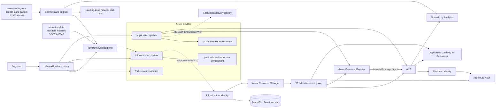

> **文档类型：** 动手实验
> **规范性术语：** **MUST**、**MUST NOT**、**SHOULD**、**SHOULD NOT** 和 **MAY** 是要求级别。
> **适用范围：** 固定 Terraform 模块、Azure DevOps 交付、Azure Container Registry、AKS、网关 API、工作负载身份、监控、不可变制品晋级、回滚和清理。
> **例外流程：** 偏离要求需要记录风险评估、补偿控制、指定风险负责人和到期日期。

|控制领域|价值|
|---|---|
|文件编号 | `HOL-04` |
|负责人|云卓越中心 |
|审核周期|至少每年一次，并且在 Azure、Kubernetes、Terraform、安全性或源仓库发生重大更改之后 |
|证据|固定模块引用、后端和身份检查、Terraform 计划、镜像摘要、AKS 和网关验证、监控、回滚和清理证据 |

# 构建端到端 Azure DevOps、Terraform、ACR 和 AKS CI/CD 平台

> **简要决定：** 从固定的 Terraform 模块构建一个受管控的 AKS 平台，然后通过具有可验证回滚功能的受保护的 Azure DevOps 阶段晋级一个不可变的应用镜像。

> **文档类型：** 动手实验  
> **可复用模块仓库：** `andyxuan2010/azure-template` at `8d5555fd66c22b7b18d8a258c74abb7c206b736f`  
> **控制平面参考仓库：** `andyxuan2010/azure-landingzone` at `c17863944a8b4c032d94fcb6c1964a292fae659c`  
> **难度：** 高级  
> **预计持续时间：** 4–6 小时  
> **主要服务：** Azure DevOps、Terraform、AKS、ACR、Key Vault、Application Gateway for Containers、Application Insights 和 Log Analytics

## 实验室概述

### 场景

您是一名平台工程师，负责根据已建立的 Azure 控制平面和受管理的 Terraform 模块目录构建 AKS 工作负载平台。完成的实验室必须使用 `azure-template` 中的可复用模块，使其根模块组合与 `azure-landingzone` 保持一致，通过受控的 Terraform 流水线配置 Azure 基础设施，构建一个不可变的应用制品，通过单独的应用流水线将其部署到 AKS，通过网关 API 公开它，并提供操作验证、回滚和清理过程。

这是一个执行实验室，而不是一篇架构论文。每个模块都包含目标、实施任务、验证命令以及继续之前必须通过的检查点。

### 学习目标

通过完成本实验，您将能够：

1. 为 Terraform 状态引导受保护的 Azure Blob 后端。
2. 使用工作负载身份联合配置 Azure DevOps 服务连接。
3. 使用固定的可复用的 Terraform 模块并将其与 Landing Zone 控制平面契约集成。
4. 将基础设施交付与应用交付分开。
5. 通过审批控制的流水线创建并应用经过审核的 Terraform 计划。
6. 构建、测试、扫描、发布和部署不可变容器镜像。
7. 配置 AKS 命名空间访问和 Key Vault 集成，无需长期凭据。
8. 通过 Application Gateway for Containers 和 Kubernetes 网关 API 公开应用。
9. 验证遥测、可用性、日志、部署运行状况和回滚行为。
10. 安全地删除所有实验室资源并验证是否不存在任何计费资源。

### 你将构建什么

在实验结束时，您将获取：

- 一个独立的实验室工作空间，两个参考仓库都固定在已审查的提交上；
- 受保护的 Terraform 远程状态后端；
- 用于基础设施和应用交付的单独的 Azure DevOps 身份；
- 受审批控制的基础设施流水线；
- 通过不可变镜像摘要部署的应用流水线；
- 与 ACR、Key Vault、Application Insights 和 Log Analytics 集成的 AKS 集群；
- 通过 Application Gateway for Containers 的网关 API 路由；
- 发布验证、监控、回滚和清理证据。

### 实验室成功标准

仅当满足以下所有条件时，实验才算完成：

- Terraform 应用已审核和批准的相同已保存计划。
- 拉取请求验证无法部署基础设施或应用。
- 应用流水线不需要订阅范围的管理员权限。
- AKS 运行流水线生成的精确镜像摘要。
- 应用通过外部网关地址成功响应。
- 应用和容器遥测是可查询的。
- 回滚可以恢复之前记录在案的镜像摘要。
- 清理删除工作负载、后端和实验室身份资源。

## 目标架构

## 实验室序列

|模块|实验室活动|初步结果 |
|---:|---|---|
| 0 |准备实验室环境|工具、订阅、实验室工作区和固定的参考仓库已准备就绪。 |
| 1 |创建 Terraform 后端 |受保护的远程状态可通过 Microsoft Entra 授权获取。 |
| 2 |配置流水线身份 |基础设施和应用交付身份是分开的。 |
| 3 |集成共享 Terraform 模块 |工作负载根模块使用 AKS 模块和 Landing Zone 控制平面输出。 |
| 4 |构建基础设施流水线 |保存的计划经过审核、批准并准确应用。 |
| 5 |测试并强化应用镜像 | Python 应用通过测试并作为强化容器运行。 |
| 6 |配置 AKS 平台资源|命名空间、工作负载身份、Key Vault 和网关资源已准备就绪。 |
| 7 |部署 Kubernetes 工作负载 |定义了受限的部署和服务。 |
| 8 |构建应用流水线 |一个不可变的镜像是由摘要构建、发布和部署的。 |
| 9 |验证发布 |工作负载、路由、身份、镜像和遥测检查通过。 |
| 10 |配置监控|标准可用性测试和 `ContainerLogV2` 查询可操作。 |
| 11 |测试回滚|检测到失败的推出并恢复之前的摘要。 |

## 实验室惯例

- 命令是为 Linux、macOS 或应用于 Linux 的 Windows 子系统上的 Bash 编写的。
- 在执行前替换尖括号中的每个值。
- 在沙盒或非生产订阅中运行实验室，除非您的组织明确批准另一个目标。
- 不要在源代码管理中存储机密、生成的计划、状态文件、kubeconfig 文件或渲染的发布清单。
- 在每个**模块检查点**停止。检查点失败后继续执行会导致错误加剧，并使故障排除变得不太可靠。

## 参考仓库集成模型

实验室将这两个仓库用于不同的职责。不要合并仓库或将可复用模块内部复制到工作负载根中。

|仓库 |在本实验室中的角色 |相关地点 |积分规则|
|---|---|---|---|
| `andyxuan2010/azure-template` |可复用的 Terraform 模块目录 | `modules/aks`、`modules/acr`、`modules/vnet`、`modules/nsg`、`modules/privatedns`、`modules/loganalytics`、`modules/keyvault`、`modules/managedidentity` 和 `modules/roleassignments` |通过固定的 Git 源或批准的内部镜像使用模块。不要从工作负载仓库编辑模块内部结构。 |
| `andyxuan2010/azure-landingzone` |控制平面和根模块组合参考 | `main.tf`、`variables.tf`、`outputs.tf`、`environments/<env>/`、`backend.tf`、`azure-pipelines.yml` 和 `docs/ROOT_LEVEL_MODULES_GUIDE.md` |重用其依赖顺序、环境分离、提供程序上下文、远程状态边界和输出驱动的组合。将其视为控制平面，而不是模块目录。 |

验证此版本时使用的固定参考是：
```text
azure-template:    8d5555fd66c22b7b18d8a258c74abb7c206b736f
azure-landingzone: c17863944a8b4c032d94fcb6c1964a292fae659c
```
生产流水线必须使用不可变的提交或发布标签。浮动 `main` 参考仅应用于勘探，不得用于已批准的生产计划。

## 模块 0 — 准备实验室环境

### 模块目标

在预配资源之前，准备工作站、Azure 订阅、独立实验室工作区以及固定的参考仓库。

### 任务 0.1 — 账户和权限

您需要：

- Azure 订阅；
- Azure DevOps 组织和私有项目；
- 创建或管理 Azure Resource Manager 工作负载身份服务连接的权限；
- 允许在预期范围内创建角色分配；
- 如果需要人工 AKS 管理组，则有权创建 Microsoft Entra 安全组；
- 目标区域中容器资源的 AKS 节点和公共 IP 或 Application Gateway 的配额。

仅将提升的权限用于引导。配置永久身份后删除临时角色分配。

### 任务 0.2 — 所需工具

运行以下预检：
```bash
set -e

for tool in az git terraform docker kubectl kubelogin helm; do
  command -v "$tool" >/dev/null 2>&1 || {
    echo "Missing required tool: $tool"
    exit 1
  }
done

az version
terraform version
docker version
kubectl version --client
kubelogin --version
helm version
```
使用您的平台团队批准的版本。 `azure-template` AKS 模块需要在其记录在案的约束范围内使用 Terraform 1.x、AzureRM 4.x 和 AzureAD 3.x。本实验中的示例使用兼容的固定提供程序范围；您的依赖锁定文件仍然是可执行的事实来源。

### 任务 0.3 — 验证并选择订阅
```bash
az login
az account list --output table
az account set --subscription "<subscription-id>"

export SUBSCRIPTION_ID="$(az account show --query id -o tsv)"
export TENANT_ID="$(az account show --query tenantId -o tsv)"

az account show \
  --query "{subscription:name, subscriptionId:id, tenantId:tenantId, user:user.name}" \
  --output table
```
### 任务 0.4 — 定义实验室值

对存储账户、注册表和 Key Vault 使用全局唯一的小写值。
```bash
export PREFIX="dj<unique-suffix>"
export LOCATION="uksouth"

export PLATFORM_RG="${PREFIX}-platform-rg"
export WORKLOAD_RG="${PREFIX}-workload-rg"
export NODE_RG="${PREFIX}-node-rg"

export TFSTATE_STORAGE_ACCOUNT="${PREFIX}tfstate"
export TFSTATE_CONTAINER="tfstate"
export TFSTATE_KEY="production/platform.tfstate"

export AKS_NAME="${PREFIX}-aks"
export ACR_NAME="${PREFIX}acr"
export KEY_VAULT_NAME="${PREFIX}-kv"
export LOG_ANALYTICS_NAME="${PREFIX}-law"
export APP_INSIGHTS_NAME="${PREFIX}-appi"

export APP_NAMESPACE="platform-lab"
export APP_SERVICE_ACCOUNT="sampleapp"
export IMAGE_REPOSITORY="sampleapp"
```
在配置之前验证命名约束：
```bash
az storage account check-name --name "$TFSTATE_STORAGE_ACCOUNT" --output table
az acr check-name --name "$ACR_NAME" --output table
az keyvault check-name --name "$KEY_VAULT_NAME" --output table
```
当现有 `azure-landingzone` 控制平面提供目标资源组时，请在创建角色分配之前将 `WORKLOAD_RG` 设置为该导出的值。在独立沙箱中，实验室创建的资源组合为通过控制平面契约返回的资源组。始终使用一种所有权模型。

### 任务 0.5 — 验证区域和 AKS 版本支持

在未检查目标区域的情况下，请勿从任一参考仓库复制固定的 Kubernetes 版本。
```bash
az aks get-versions --location "$LOCATION" --output table
```
对于 Application Gateway for Containers，请验证所选区域是否支持该服务，并确认您的组织是否允许预览功能。 AKS 附加路径可能需要预览功能注册； BYO/Helm 路径具有不同的生命周期。选择一条路径并将其记录在架构决策记录中。

### 任务 0.6 — 创建实验室工作区并固定两个仓库

创建一个具有只读参考签出和单独的工作负载仓库的工作区：
```text
aks-platform-lab/
├── references/
│   ├── azure-template/
│   └── azure-landingzone/
└── workspace/
    ├── app/
    │   ├── app.py
    │   ├── Dockerfile
    │   ├── requirements.txt
    │   ├── requirements-dev.txt
    │   ├── templates/
    │   └── tests/
    ├── infra/
    │   ├── bootstrap/
    │   ├── environments/
    │   ├── main.tf
    │   ├── outputs.tf
    │   ├── providers.tf
    │   └── variables.tf
    ├── k8s/
    │   ├── platform/
    │   └── workload/
    ├── pipelines/
    ├── scripts/
    ├── .dockerignore
    ├── .gitignore
    └── README.md
```
创建工作区：
```bash
mkdir -p aks-platform-lab/references
cd aks-platform-lab

git clone https://github.com/andyxuan2010/azure-template.git   references/azure-template
git -C references/azure-template checkout 8d5555fd66c22b7b18d8a258c74abb7c206b736f

git clone https://github.com/andyxuan2010/azure-landingzone.git   references/azure-landingzone
git -C references/azure-landingzone checkout c17863944a8b4c032d94fcb6c1964a292fae659c

mkdir -p workspace/app/templates workspace/app/tests   workspace/infra/bootstrap workspace/infra/environments   workspace/k8s/platform workspace/k8s/workload   workspace/pipelines workspace/scripts

cd workspace
git init
git switch -c lab/aks-platform
```
参考检查用于检查和验证。稍后创建的 Terraform 根通过不可变的 Git 源使用 `azure-template`。 `azure-landingzone` 校验提供控制平面组合模式和输出契约。

创建最小的示例应用，以便实验室不依赖于另一个仓库：
```bash
cat > app/app.py <<'PY'
import os

from flask import Flask, jsonify, render_template

connection_string = os.getenv("APPLICATIONINSIGHTS_CONNECTION_STRING")
if connection_string:
    from azure.monitor.opentelemetry import configure_azure_monitor

    configure_azure_monitor(connection_string=connection_string)

app = Flask(__name__)


@app.get("/health")
def health():
    return jsonify(status="healthy")


@app.get("/")
def home():
    return render_template("index.html")


if __name__ == "__main__":
    app.run(host="0.0.0.0", port=int(os.getenv("PORT", "5000")))
PY

cat > app/requirements.txt <<'REQ'
Flask>=3.0,<4
gunicorn>=23,<24
azure-monitor-opentelemetry>=1.6,<2
REQ

cat > app/templates/index.html <<'HTML'
<!doctype html>
<html lang="en">
  <head><meta charset="utf-8"><title>AKS Platform Lab</title></head>
  <body><h1>AKS Platform Lab</h1><p>The workload is healthy.</p></body>
</html>
HTML
```
添加仓库排除：
```gitignore
# Terraform
**/.terraform/*
*.tfstate
*.tfstate.*
*.tfplan
crash.log
override.tf
override.tf.json
*_override.tf
*_override.tf.json

# Secrets and local environment
.env
.env.*
!.env.example
*.pem
*.pfx
*.key
secrets.yaml

# Python
__pycache__/
.pytest_cache/
.venv/
*.py[cod]

# IDE and operating system
.vscode/
.idea/
.DS_Store

# Generated deployment files
rendered/
```
记录集成来源：
```bash
cat > reference-repositories.json <<'JSON'
{
  "azure-template": "8d5555fd66c22b7b18d8a258c74abb7c206b736f",
  "azure-landingzone": "c17863944a8b4c032d94fcb6c1964a292fae659c"
}
JSON

git add .
git commit -m "Initialize AKS platform hands-on lab"
```
### 模块检查点

- 所需的工具返回有效的版本输出。
- 预期的 Azure 订阅处于活动状态。
- 导出实验室变量且名称满足 Azure 约束。
- `azure-template` 和 `azure-landingzone` 在 `reference-repositories.json` 中记录在案的固定提交处签出。
- 工作负载分支包含目标 `app`、`infra`、`k8s`、`pipelines` 和 `scripts` 文件夹。
- 生成的文件和本地机密被 `.gitignore` 排除。

## 模块 1 — 创建受保护的 Terraform 后端

### 模块目标
创建具有状态锁定、版本恢复、删除保护、Entra ID 授权且无存储账户密钥依赖性的 Azure Blob 后端。

### 任务 1.1 — 创建引导脚本

创建`infra/bootstrap/create-terraform-backend.sh`：
```bash
#!/usr/bin/env bash
set -Eeuo pipefail

required=(
  SUBSCRIPTION_ID
  PLATFORM_RG
  TFSTATE_STORAGE_ACCOUNT
  TFSTATE_CONTAINER
  LOCATION
)

for name in "${required[@]}"; do
  if [[ -z "${!name:-}" ]]; then
    echo "Required environment variable is missing: $name" >&2
    exit 1
  fi
done

az account set --subscription "$SUBSCRIPTION_ID"

az group create \
  --name "$PLATFORM_RG" \
  --location "$LOCATION" \
  --tags \
    environment=shared \
    managed-by=bootstrap \
    workload=terraform-state \
  --output none

az storage account create \
  --name "$TFSTATE_STORAGE_ACCOUNT" \
  --resource-group "$PLATFORM_RG" \
  --location "$LOCATION" \
  --kind StorageV2 \
  --sku Standard_LRS \
  --https-only true \
  --min-tls-version TLS1_2 \
  --allow-blob-public-access false \
  --public-network-access Enabled \
  --tags \
    environment=shared \
    managed-by=bootstrap \
    workload=terraform-state \
  --output none

storage_id="$(
  az storage account show \
    --name "$TFSTATE_STORAGE_ACCOUNT" \
    --resource-group "$PLATFORM_RG" \
    --query id \
    --output tsv
)"

current_object_id="$(az ad signed-in-user show --query id --output tsv)"

az role assignment create \
  --assignee-object-id "$current_object_id" \
  --assignee-principal-type User \
  --role "Storage Blob Data Contributor" \
  --scope "$storage_id" \
  --output none 2>/dev/null || true

# Azure RBAC propagation is asynchronous.
for attempt in {1..18}; do
  if az storage container create \
      --name "$TFSTATE_CONTAINER" \
      --account-name "$TFSTATE_STORAGE_ACCOUNT" \
      --auth-mode login \
      --public-access off \
      --output none 2>/dev/null; then
    break
  fi

  if [[ "$attempt" -eq 18 ]]; then
    echo "Unable to create the state container after waiting for RBAC propagation." >&2
    exit 1
  fi

  sleep 10
done

az storage account blob-service-properties update \
  --account-name "$TFSTATE_STORAGE_ACCOUNT" \
  --resource-group "$PLATFORM_RG" \
  --enable-versioning true \
  --enable-delete-retention true \
  --delete-retention-days 30 \
  --enable-container-delete-retention true \
  --container-delete-retention-days 30 \
  --output none

# Disable account-key authorization after all bootstrap operations use Entra ID.
az storage account update \
  --name "$TFSTATE_STORAGE_ACCOUNT" \
  --resource-group "$PLATFORM_RG" \
  --allow-shared-key-access false \
  --output none

echo "Terraform backend created."
echo "Resource group : $PLATFORM_RG"
echo "Storage account: $TFSTATE_STORAGE_ACCOUNT"
echo "Container      : $TFSTATE_CONTAINER"
```
运行它：
```bash
chmod +x infra/bootstrap/create-terraform-backend.sh
./infra/bootstrap/create-terraform-backend.sh
```
### 任务 1.2 — 验证后端
```bash
az storage account show \
  --name "$TFSTATE_STORAGE_ACCOUNT" \
  --resource-group "$PLATFORM_RG" \
  --query "{
    name:name,
    httpsOnly:enableHttpsTrafficOnly,
    minimumTlsVersion:minimumTlsVersion,
    anonymousBlobAccess:allowBlobPublicAccess,
    sharedKeyAccess:allowSharedKeyAccess,
    publicNetworkAccess:publicNetworkAccess
  }" \
  --output table

az storage account blob-service-properties show \
  --account-name "$TFSTATE_STORAGE_ACCOUNT" \
  --resource-group "$PLATFORM_RG" \
  --query "{
    versioning:isVersioningEnabled,
    blobDeleteRetention:deleteRetentionPolicy,
    containerDeleteRetention:containerDeleteRetentionPolicy
  }"

az storage container show \
  --name "$TFSTATE_CONTAINER" \
  --account-name "$TFSTATE_STORAGE_ACCOUNT" \
  --auth-mode login \
  --output table
```
预期条件：

- 启用仅 HTTPS 流量。
- 最低 TLS 为 `TLS1_2` 或更强。
- 禁用匿名 blob 访问。
- 共享密钥访问被禁用。
- 启用 blob 版本控制。
- 启用 blob 和容器删除保留策略。
- `tfstate` 容器存在并且是私有的。

### 可选扩展——私有网络后端

可执行实验室配置文件使存储公共端点保持启用状态，但阻止匿名访问和共享密钥身份验证。生产私有网络配置文件应使用：

- `blob` 的私有端点；
- 私有 DNS 区域 `privatelink.blob.core.windows.net`；
- 具有网络可达性的自托管 Azure DevOps 代理；
- 公共网络访问被禁用；
- 流水线预检中的防火墙和 DNS 验证。

使用 Microsoft 托管代理时，请勿禁用公共网络访问，除非存在经批准的网络注入机制。

### 模块检查点

- 状态资源组、存储账户和容器存在。
- 启用 Blob 版本控制和软删除控件。
- 验证 Entra ID 访问后，共享密钥授权将被禁用。
- Terraform 可以在没有账户密钥的情况下初始化后端。

## 模块 2 — 配置身份和最低权限访问

### 模块目标
将基础设施配置与应用交付分开，并删除长期存在的机密。

### 任务 2.1 — 创建两个 Azure DevOps 服务连接

创建这些 Azure Resource Manager 服务连接：

|服务连接 |目的|需要身份验证 |
|---|---|---|
| `sc-azure-infra-production` | Terraform 后端访问和 Azure 资源配置 |使用 Microsoft Entra 颁发者的工作负载身份联合 |
| `sc-azure-app-production` |镜像发布和 AKS 工作负载部署 |使用 Microsoft Entra 颁发者的工作负载身份联合 |

规则：

- 不要使用客户端机密。
- 不要启用“授予所有流水线访问权限”。
- 仅明确授权`pipelines/infrastructure.yml`或`pipelines/application.yml`。
- 如果 Azure DevOps 警告服务连接使用已弃用的 Azure DevOps 颁发者，请将其转换为 Microsoft Entra 颁发者。
- 保留两个服务主体对象 ID。应用 ID 和对象 ID 不可互换。

记录它们：
```bash
export INFRA_PRINCIPAL_OBJECT_ID="<infra-service-principal-object-id>"
export APP_PRINCIPAL_OBJECT_ID="<app-service-principal-object-id>"
```
### 任务 2.2 — 创建工作负载资源组

预先创建工作负载资源组，以便可以将授权范围限制在订阅下方：
```bash
az group create \
  --name "$WORKLOAD_RG" \
  --location "$LOCATION" \
  --tags environment=production managed-by=terraform \
  --output none
```
### 任务 2.3 — 分配基础架构角色
```bash
workload_rg_id="$(
  az group show --name "$WORKLOAD_RG" --query id --output tsv
)"

state_account_id="$(
  az storage account show \
    --name "$TFSTATE_STORAGE_ACCOUNT" \
    --resource-group "$PLATFORM_RG" \
    --query id \
    --output tsv
)"

state_container_scope="${state_account_id}/blobServices/default/containers/${TFSTATE_CONTAINER}"

az role assignment create \
  --assignee-object-id "$INFRA_PRINCIPAL_OBJECT_ID" \
  --assignee-principal-type ServicePrincipal \
  --role "Contributor" \
  --scope "$workload_rg_id"

az role assignment create \
  --assignee-object-id "$INFRA_PRINCIPAL_OBJECT_ID" \
  --assignee-principal-type ServicePrincipal \
  --role "User Access Administrator" \
  --scope "$workload_rg_id"

az role assignment create \
  --assignee-object-id "$INFRA_PRINCIPAL_OBJECT_ID" \
  --assignee-principal-type ServicePrincipal \
  --role "Storage Blob Data Contributor" \
  --scope "$state_container_scope"
```
`User Access Administrator` 权限很高。仅当 Terraform 创建角色分配时才需要。更强大的企业模式将角色分配部署分离到特权流水线中，或使用更窄的操作部署预先批准的自定义角色。

### 任务 2.4 — 延迟应用角色分配，直到资源存在

应用身份不接收订阅范围的角色。 ACR、AKS 和命名空间存在后，分配：

- 注册表中的`AcrPush`；
- AKS 资源上的 `Azure Kubernetes Service Cluster User Role`；
- 应用命名空间上的 `Azure Kubernetes Service RBAC Writer`。

请勿将应用服务主体添加到 AKS 人工管理员组。

### 模块检查点

- 存在两个 WIF 支持的服务连接。
- 基础设施身份仅具有配置实验室所需的角色。
- 应用身份没有广泛的订阅级别管理员角色。
- 服务连接仅被授权用于预期的流水线。

## 模块 3 — 集成和验证共享 Terraform 模块

### 模块目标
在不可变的参考上使用可复用的 AKS 模块，将其与 Landing Zone 控制平面输出集成，并验证生成的工作负载根。

### 任务 3.1 — 提供程序和后端配置

将 `infra/providers.tf` 替换为：
```hcl
terraform {
  required_version = ">= 1.14.0, < 2.0.0"

  backend "azurerm" {
    use_azuread_auth = true
    use_oidc         = true
  }

  required_providers {
    azurerm = {
      source  = "hashicorp/azurerm"
      version = ">= 4.70.0, < 5.0.0"
    }

    azuread = {
      source  = "hashicorp/azuread"
      version = ">= 3.0.0, < 4.0.0"
    }
  }
}

provider "azurerm" {
  features {}
}

provider "azuread" {}

data "azurerm_client_config" "current" {}
```
请勿将存储账户名称、租户 ID、订阅 ID 或状态密钥放置在源代码控制的后端代码中。在 `terraform init` 期间提供它们。

### 任务 3.2 — 删除死变量和误导变量

仅定义工作负载根模块使用的输入。使用显式名称和稳定的控制平面输出契约，而不是重建名称或资源 ID。

变量定义示例：
```hcl
variable "location" {
  type        = string
  description = "Azure region for the workload."

  validation {
    condition     = length(trimspace(var.location)) > 0
    error_message = "location must not be empty."
  }
}

variable "environment" {
  type        = string
  description = "Deployment environment."

  validation {
    condition     = contains(["development", "test", "staging", "production"], var.environment)
    error_message = "environment must be development, test, staging, or production."
  }
}

variable "aks_name" {
  type        = string
  description = "AKS cluster name."
}

variable "kubernetes_version" {
  type        = string
  description = "Approved AKS Kubernetes version available in the target region."
}

variable "aks_admin_group_object_id" {
  type        = string
  description = "Object ID of the Microsoft Entra group for human AKS administrators."

  validation {
    condition     = can(regex("^[0-9a-fA-F-]{36}$", var.aks_admin_group_object_id))
    error_message = "aks_admin_group_object_id must be a GUID."
  }
}

variable "workload_name" {
  type        = string
  description = "Short workload name used by the shared naming convention."
  default     = "aksplat"
}

variable "node_resource_group_name" {
  type        = string
  description = "AKS-managed node resource group name."
}

variable "system_node_vm_size" {
  type        = string
  description = "VM size for the system node pool."
  default     = "Standard_D4s_v5"
}

variable "user_node_vm_size" {
  type        = string
  description = "VM size for the user node pool."
  default     = "Standard_D4s_v5"
}

variable "aks_zones" {
  type        = list(string)
  description = "Availability zones supported by the selected region and VM sizes."
  default     = []
}

variable "control_plane_state_resource_group_name" {
  type        = string
  description = "Resource group containing the landing-zone Terraform state account."
}

variable "control_plane_state_storage_account_name" {
  type        = string
  description = "Storage account containing the landing-zone Terraform state."
}

variable "control_plane_state_container_name" {
  type        = string
  description = "Blob container containing the landing-zone Terraform state."
  default     = "tfstate"
}

variable "control_plane_state_key" {
  type        = string
  description = "State key for the deployed landing-zone control plane."
}

variable "tags" {
  type        = map(string)
  description = "Mandatory resource tags."
}
```
使用无占位符的示例文件，而不是真实的对象 ID：
```hcl
# infra/environments/production.tfvars.example
location                       = "<supported-region>"
environment                    = "production"
workload_name                  = "aksplat"
aks_name                       = "<unique-aks-name>"
node_resource_group_name       = "<unique-node-resource-group-name>"
kubernetes_version             = "<supported-non-preview-version>"
aks_admin_group_object_id      = "<entra-group-object-id>"
system_node_vm_size            = "Standard_D4s_v5"
user_node_vm_size              = "Standard_D4s_v5"
aks_zones                      = ["1", "2", "3"]

control_plane_state_resource_group_name  = "<landing-zone-state-resource-group>"
control_plane_state_storage_account_name = "<landing-zone-state-account>"
control_plane_state_container_name       = "tfstate"
control_plane_state_key                  = "<environment>/control-plane.tfstate"

tags = {
  environment = "production"
  managed-by  = "terraform"
  owner       = "cloud-platform"
  cost-center = "<cost-center>"
  data-class  = "internal"
}
```
当值是特定于租户时，将其复制到本地并将填充的文件保留在源代码控制之外：
```bash
cp infra/environments/production.tfvars.example \
  infra/environments/production.auto.tfvars
```
### 任务 3.3 — 有意采用 AKS 模块的安全默认值

共享 `modules/aks` 实现已支持私有 API 访问、Microsoft Entra 和 Azure RBAC 集成、禁用的本地账户、OIDC、工作负载身份、Azure Policy、节点池、诊断和 Key Vault Secrets Store CSI 驱动程序。在调用方根模块中保持这些行为明确，以便审核者可以看到预期的平台契约：
```hcl
private_cluster_enabled   = true
private_dns_zone_id       = "System"
oidc_issuer_enabled       = true
workload_identity_enabled = true
local_account_disabled    = true
azure_rbac_enabled        = true
azure_policy_enabled      = true

key_vault_secrets_provider_enabled                   = true
key_vault_secrets_provider_secret_rotation_enabled   = true
key_vault_secrets_provider_secret_rotation_interval  = "5m"
```
在采用之前查看这些生产要求：

- 独立的系统和用户节点池；
- 所选区域和 VM SKU 的可用区支持；
- 维护窗口；
- 私有集群 DNS 和管理网络可达性；
- Azure Policy 或其他准入控制机制；
- 经组织批准的 Defender for Containers；
- 受控的出站连接；
- 网络策略；
- 诊断设置和数据收集规则；
- 集群和节点镜像升级策略；
- 备份和恢复要求；
- Pod 中断预算和拓扑分布。

不要对三个可用区进行硬编码，除非区域和选定的 VM SKU 支持它们。

### 任务 3.4 — 从两个仓库构建工作负载根

使用不同层的仓库：

1. `azure-landingzone` 建立控制平面：管理层次结构、订阅、共享资源组、中心/辐射网络、AKS 子网、私有 DNS、Log Analytics、策略和通用平台服务。
2. 工作负载根使用 `azure-template/modules/aks` 模块以及控制平面尚未提供的任何支持模块。
3. 模块输入来自显式变量或远程状态输出。不要根据名称重建 Azure ID。

最相关的共享模块是：

|能力|共享模块路径 |实验室使用|
|---|---|---|
| AKS 群集和节点池 | `modules/aks` |所需的工作负载平台模块。 |
|容器注册表 | `modules/acr` |当 ACR 归工作负载所有而不是由控制平面提供时使用。 |
|虚拟网络和子网 | `modules/vnet` |通常负责控制平面；仅用于单独的实验室订阅。 |
|网络安全组| `modules/nsg` |通过控制平面网络层应用。 |
|私有 DNS | `modules/privatedns` |私有 AKS 和私有端点负责的控制平面。 |
|Log Analytics| `modules/loganalytics` |在策略允许的情况下重复使用共享工作区。 |
|Key Vault | `modules/keyvault` |用于平台或工作负载机密边界。 |
|托管身份| `modules/managedidentity` |用于调用者管理的 AKS 或工作负载身份。 |
|角色分配| `modules/roleassignments` |通过特权基础设施路径使用。 |
|Application Gateway| `modules/applicationgateway` |代表 Azure Application Gateway 模式；不要假设它会取代 Application Gateway for Containers。 |

### 公开最小控制平面输出契约

遵循 `azure-landingzone` 根模块组合模式并仅公开 AKS 工作负载根所需的非敏感值。当等效输出尚不存在时，将如下输出添加到控制平面堆栈：
```hcl
output "aks_workload_contract" {
  description = "Non-sensitive landing-zone values consumed by AKS workload roots."

  value = {
    resource_group_name        = module.resource_group.name
    location                   = module.resource_group.location
    aks_subnet_id              = module.spoke_virtual_network.subnet_ids["snet-aks"]
    log_analytics_workspace_id = module.log_analytics.id
  }
}
```
Landing Zone 堆栈和工作负载堆栈必须使用单独的状态密钥。仅当远程状态批准使用时，才授予工作负载流水线对控制平面状态的读取访问权限。更强大的企业选项通过配置注册表或流水线制品发布契约，而不是授予状态访问权限。

创建`infra/control-plane.tf`：
```hcl
data "terraform_remote_state" "control_plane" {
  backend = "azurerm"

  config = {
    resource_group_name  = var.control_plane_state_resource_group_name
    storage_account_name = var.control_plane_state_storage_account_name
    container_name       = var.control_plane_state_container_name
    key                  = var.control_plane_state_key
    use_azuread_auth     = true
    use_oidc             = true
  }
}

locals {
  control_plane = data.terraform_remote_state.control_plane.outputs.aks_workload_contract
}
```
对于未部署 Landing Zone 堆栈的独立沙箱，使用匹配的 `azure-template` 模块创建等效的网络和监视资源，然后将其输出传递到 AKS 模块。不要在一个环境中混合使用两种所有权模型。

### 使用固定的 AKS 模块

创建`infra/main.tf`：
```hcl
module "aks" {
  source = "git::https://github.com/andyxuan2010/azure-template.git//modules/aks?ref=8d5555fd66c22b7b18d8a258c74abb7c206b736f"

  resource_group_name = local.control_plane.resource_group_name
  location            = local.control_plane.location
  name                = var.aks_name
  workload_name       = var.workload_name
  app_env             = var.environment

  kubernetes_version       = var.kubernetes_version
  node_resource_group_name = var.node_resource_group_name

  private_cluster_enabled = true
  private_dns_zone_id     = "System"

  oidc_issuer_enabled       = true
  workload_identity_enabled = true
  local_account_disabled    = true
  azure_rbac_enabled        = true
  azure_policy_enabled      = true
  admin_group_object_ids    = [var.aks_admin_group_object_id]

  default_node_pool = {
    name                         = "system"
    vm_size                      = var.system_node_vm_size
    auto_scaling_enabled         = true
    min_count                    = 3
    max_count                    = 6
    zones                       = var.aks_zones
    vnet_subnet_id              = local.control_plane.aks_subnet_id
    only_critical_addons_enabled = true
  }

  node_pools = {
    user = {
      name                 = "user"
      vm_size              = var.user_node_vm_size
      mode                 = "User"
      auto_scaling_enabled = true
      min_count            = 2
      max_count            = 10
      zones                = var.aks_zones
      vnet_subnet_id       = local.control_plane.aks_subnet_id
      node_labels = {
        workload = "general"
      }
    }
  }

  log_analytics_workspace_id           = local.control_plane.log_analytics_workspace_id
  oms_agent_log_analytics_workspace_id = local.control_plane.log_analytics_workspace_id
  oms_agent_enabled                     = true

  key_vault_secrets_provider_enabled                   = true
  key_vault_secrets_provider_secret_rotation_enabled   = true
  key_vault_secrets_provider_secret_rotation_interval  = "5m"

  inherit_resource_group_tags   = true
  inherited_resource_group_tags = var.tags
  tags                          = var.tags
}
```
使用模块的日志记录示例和测试作为可执行参考：
```bash
git -C ../references/azure-template show   8d5555fd66c22b7b18d8a258c74abb7c206b736f:modules/aks/README.md | less

terraform -chdir=../references/azure-template/modules/aks   init -backend=false
terraform -chdir=../references/azure-template/modules/aks validate
terraform -chdir=../references/azure-template/modules/aks test
```
模块测试使用模拟提供程序，并且不创建 Azure 资源。工作负载根仍然需要针对目标订阅进行其自己的计划验证。

### 任务 3.5 — 本地格式化和验证
```bash
cd infra

terraform fmt -recursive
terraform fmt -check -recursive
terraform init -backend=false
terraform validate
```
提交依赖锁文件：
```bash
git add .terraform.lock.hcl
git commit -m "Normalize Terraform configuration and lock providers"
```
切勿提交 `.terraform/`、状态文件、计划文件或填充的机密文件。

### 模块检查点

- `terraform fmt -check -recursive` 通过。
- `terraform validate` 通过。
- 所选的 AKS 版本在目标区域可用。
- 占位符 ID、SSH 密钥和不一致的资源名称被删除或参数化。

## 模块 4 — 构建受控基础设施流水线

### 模块目标

验证每项更改，保存计划，要求外部批准，并应用经过严格审查的计划。

### 任务 4.1 — 创建基础设施流水线

仅当 Microsoft DevLabs Terraform 扩展属于您批准的工具链的一部分时才安装它，或者使用内部管理的 Terraform CLI 模板替换任务。市场扩展必须得到您的组织的批准。

创建`pipelines/infrastructure.yml`：
```yaml
name: infra_$(Date:yyyyMMdd)$(Rev:.r)

trigger:
  batch: true
  branches:
    include:
      - main
  paths:
    include:
      - infra/**
      - pipelines/infrastructure.yml

pr:
  branches:
    include:
      - main
  paths:
    include:
      - infra/**
      - pipelines/infrastructure.yml

variables:
  terraformVersion: '1.14.9'
  serviceConnection: 'sc-azure-infra-production'
  workingDirectory: '$(Build.SourcesDirectory)/infra'
  tfvarsFile: 'environments/production.auto.tfvars'

  backendResourceGroup: '<platform-resource-group>'
  backendStorageAccount: '<state-storage-account>'
  backendContainer: 'tfstate'
  backendKey: 'production/platform.tfstate'

stages:
  - stage: ValidateAndPlan
    displayName: Validate and plan
    jobs:
      - job: Plan
        displayName: Terraform plan
        pool:
          vmImage: ubuntu-latest

        steps:
          - checkout: self
            clean: true
            fetchDepth: 1

          - task: TerraformInstaller@1
            displayName: Install Terraform
            inputs:
              terraformVersion: '$(terraformVersion)'

          - bash: |
              set -euo pipefail
              terraform fmt -check -recursive
            displayName: Check Terraform formatting
            workingDirectory: '$(workingDirectory)'

          - task: TerraformTaskV4@4
            displayName: Terraform init
            inputs:
              provider: azurerm
              command: init
              backendServiceArm: '$(serviceConnection)'
              backendAzureRmResourceGroupName: '$(backendResourceGroup)'
              backendAzureRmStorageAccountName: '$(backendStorageAccount)'
              backendAzureRmContainerName: '$(backendContainer)'
              backendAzureRmKey: '$(backendKey)'
              workingDirectory: '$(workingDirectory)'

          - task: TerraformTaskV4@4
            displayName: Terraform validate
            inputs:
              provider: azurerm
              command: validate
              environmentServiceNameAzureRM: '$(serviceConnection)'
              workingDirectory: '$(workingDirectory)'

          - task: TerraformTaskV4@4
            displayName: Terraform plan
            inputs:
              provider: azurerm
              command: plan
              environmentServiceNameAzureRM: '$(serviceConnection)'
              workingDirectory: '$(workingDirectory)'
              commandOptions: >-
                -input=false
                -lock-timeout=5m
                -var-file="$(tfvarsFile)"
                -out="$(Build.ArtifactStagingDirectory)/tfplan"

          - bash: |
              set -euo pipefail
              terraform show -no-color \
                "$(Build.ArtifactStagingDirectory)/tfplan" \
                > "$(Build.ArtifactStagingDirectory)/tfplan.txt"
              sha256sum "$(Build.ArtifactStagingDirectory)/tfplan" \
                > "$(Build.ArtifactStagingDirectory)/tfplan.sha256"
            displayName: Export plan evidence
            workingDirectory: '$(workingDirectory)'

          - publish: '$(Build.ArtifactStagingDirectory)'
            artifact: terraform-plan
            displayName: Publish protected plan artifact

  - stage: Apply
    displayName: Apply reviewed plan
    dependsOn: ValidateAndPlan
    condition: >
      and(
        succeeded(),
        eq(variables['Build.SourceBranch'], 'refs/heads/main'),
        ne(variables['Build.Reason'], 'PullRequest')
      )

    jobs:
      - deployment: ApplyProduction
        displayName: Apply production infrastructure
        pool:
          vmImage: ubuntu-latest
        environment: production-infrastructure

        strategy:
          runOnce:
            deploy:
              steps:
                - checkout: self
                  clean: true
                  fetchDepth: 1

                - download: current
                  artifact: terraform-plan

                - task: TerraformInstaller@1
                  displayName: Install Terraform
                  inputs:
                    terraformVersion: '$(terraformVersion)'

                - task: TerraformTaskV4@4
                  displayName: Terraform init
                  inputs:
                    provider: azurerm
                    command: init
                    backendServiceArm: '$(serviceConnection)'
                    backendAzureRmResourceGroupName: '$(backendResourceGroup)'
                    backendAzureRmStorageAccountName: '$(backendStorageAccount)'
                    backendAzureRmContainerName: '$(backendContainer)'
                    backendAzureRmKey: '$(backendKey)'
                    workingDirectory: '$(workingDirectory)'

                - bash: |
                    set -euo pipefail
                    cd "$(Pipeline.Workspace)/terraform-plan"
                    sha256sum --check tfplan.sha256
                  displayName: Verify plan integrity

                - task: TerraformTaskV4@4
                  displayName: Apply saved Terraform plan
                  inputs:
                    provider: azurerm
                    command: apply
                    environmentServiceNameAzureRM: '$(serviceConnection)'
                    workingDirectory: '$(workingDirectory)'
                    commandOptions: >-
                      -input=false
                      -lock-timeout=5m
                      "$(Pipeline.Workspace)/terraform-plan/tfplan"
```
### 任务 4.2 — 配置环境审批

在 Azure DevOps 中：

1. 转到 **流水线 > 环境**。
2. 创建`production-infrastructure`。
3. 打开**批准和检查**。
4. 添加由平台或变更权限组负责的批准。
5. 添加分支控制和其他可用的组织检查。
6. 防止流水线作者成为唯一所需的审批者。

批准和检查属于受保护资源，不受 YAML 作者控制。

### 任务 4.3 — 保护计划制品

Terraform 计划可以包含敏感值。限制：

- 构建日志访问；
- 制品下载权限；
- 保留期限；
- 流水线服务账户权限；
- 导出到外部系统。

### 任务 4.4 — 执行和验证

首先运行拉取请求。确认仅 `ValidateAndPlan` 运行。

合并到`main`后，批准`production-infrastructure`环境并确认应用阶段使用已发布的计划。

验证：
```bash
terraform -chdir=infra state list

az resource list \
  --resource-group "$WORKLOAD_RG" \
  --query "[].{name:name,type:type,location:location}" \
  --output table

az aks show \
  --resource-group "$WORKLOAD_RG" \
  --name "$AKS_NAME" \
  --query "{
    state:provisioningState,
    kubernetesVersion:kubernetesVersion,
    oidc:oidcIssuerProfile.enabled,
    workloadIdentity:securityProfile.workloadIdentity.enabled,
    localAccounts:disableLocalAccounts,
    azureRbac:aadProfile.enableAzureRbac
  }"
```
### 模块检查点

- Pull-request 运行验证但无法应用。
- 计划阶段发布二进制计划制品和可审查的文本输出。
- 生产环境需要审批。
- 应用阶段使用保存的计划而不是生成新计划。

## 模块 5 — 测试和强化应用镜像

### 模块目标
创建一个可独立测试的应用制品并将其作为非根、受限容器运行。

### 任务 5.1 — 添加应用测试

创建`app/tests/test_app.py`：
```python
from app import app


def test_health_endpoint() -> None:
    client = app.test_client()
    response = client.get("/health")

    assert response.status_code == 200
    assert response.get_json() == {"status": "healthy"}


def test_homepage() -> None:
    client = app.test_client()
    response = client.get("/")

    assert response.status_code == 200
```
创建`app/requirements-dev.txt`：
```text
-r requirements.txt
pytest>=8,<9
```
运行测试：
```bash
cd app
python -m venv .venv
source .venv/bin/activate
python -m pip install --upgrade pip
python -m pip install -r requirements-dev.txt
pytest -q
```
### 任务 5.2 — 替换 Dockerfile

创建`app/Dockerfile`：
```dockerfile
FROM python:3.13-slim

ENV PYTHONDONTWRITEBYTECODE=1 \
    PYTHONUNBUFFERED=1 \
    PIP_NO_CACHE_DIR=1 \
    PORT=5000

WORKDIR /app

RUN groupadd --gid 10001 appgroup \
    && useradd \
      --uid 10001 \
      --gid appgroup \
      --no-create-home \
      --shell /usr/sbin/nologin \
      appuser

COPY requirements.txt ./
RUN python -m pip install --no-cache-dir -r requirements.txt

COPY --chown=10001:10001 app.py ./
COPY --chown=10001:10001 templates ./templates

USER 10001:10001

EXPOSE 5000

CMD ["gunicorn", "--workers", "4", "--bind", "0.0.0.0:5000", "--access-logfile", "-", "--error-logfile", "-", "app:app"]
```
为了获取更严格的可重复性，请通过批准的摘要固定基础镜像，并通过自动依赖项管理流程进行更新。不要发明或复制未经验证的摘要。

创建`.dockerignore`：
```text
.git
.github
.azure-pipelines
.venv
__pycache__
.pytest_cache
tests
*.pyc
*.pyo
*.pyd
.env
```
### 任务 5.3 — 本地构建和测试
```bash
docker build -t sampleapp:local app

container_id="$(
  docker run --detach \
    --read-only \
    --tmpfs /tmp:rw,noexec,nosuid,size=64m \
    --publish 5000:5000 \
    sampleapp:local
)"

trap 'docker rm -f "$container_id" >/dev/null 2>&1 || true' EXIT

for attempt in {1..30}; do
  if curl --fail --silent http://localhost:5000/health; then
    break
  fi
  sleep 2
done

docker inspect "$container_id" \
  --format 'user={{.Config.User}} image={{.Config.Image}}'
```
预期结果：
```json
{"status":"healthy"}
```
配置的容器用户不能是`root`或`0`。

### 模块检查点

- 单元测试通过。
- 镜像构建成功。
- 容器以非 root 用户身份运行。
- `/health` 在本地返回 HTTP 200。

## 模块 6 — 配置平台负责的 AKS 资源

### 模块目标
安装平台组件一次，建立命名空间策略，并为工作负载配置 Key Vault 访问权限，而无需授予交付流水线机密读取权限。

### 任务 6.1 — 以管理员身份获取集群凭据
```bash
az aks get-credentials \
  --resource-group "$WORKLOAD_RG" \
  --name "$AKS_NAME" \
  --overwrite-existing

kubelogin convert-kubeconfig -l azurecli
kubectl get nodes
```
### 任务 6.2 — 创建带有 Pod 安全准入标签的命名空间

创建`k8s/platform/namespace.yaml`：
```yaml
apiVersion: v1
kind: Namespace
metadata:
  name: platform-lab
  labels:
    app.kubernetes.io/part-of: platform-lab
    pod-security.kubernetes.io/enforce: restricted
    pod-security.kubernetes.io/enforce-version: latest
    pod-security.kubernetes.io/audit: restricted
    pod-security.kubernetes.io/audit-version: latest
    pod-security.kubernetes.io/warn: restricted
    pod-security.kubernetes.io/warn-version: latest
```
应用它：
```bash
kubectl apply -f k8s/platform/namespace.yaml
```
### 任务 6.3 — 分配应用流水线访问权限
```bash
aks_id="$(
  az aks show \
    --resource-group "$WORKLOAD_RG" \
    --name "$AKS_NAME" \
    --query id \
    --output tsv
)"

acr_id="$(
  az acr show \
    --resource-group "$WORKLOAD_RG" \
    --name "$ACR_NAME" \
    --query id \
    --output tsv
)"

az role assignment create \
  --assignee-object-id "$APP_PRINCIPAL_OBJECT_ID" \
  --assignee-principal-type ServicePrincipal \
  --role "AcrPush" \
  --scope "$acr_id"

az role assignment create \
  --assignee-object-id "$APP_PRINCIPAL_OBJECT_ID" \
  --assignee-principal-type ServicePrincipal \
  --role "Azure Kubernetes Service Cluster User Role" \
  --scope "$aks_id"

az role assignment create \
  --assignee-object-id "$APP_PRINCIPAL_OBJECT_ID" \
  --assignee-principal-type ServicePrincipal \
  --role "Azure Kubernetes Service RBAC Writer" \
  --scope "${aks_id}/namespaces/${APP_NAMESPACE}"
```
RBAC Writer 角色可以读取 Secret 并将 Pod 作为命名空间中的服务账户运行。它在物质上享有特权。在交付模型允许的情况下，使用自定义 Azure RBAC 角色或范围狭窄的 Kubernetes 角色。

### 任务 6.4 — 为 Key Vault 创建工作负载身份
```bash
export WORKLOAD_IDENTITY_NAME="${PREFIX}-sampleapp-mi"

az identity create \
  --name "$WORKLOAD_IDENTITY_NAME" \
  --resource-group "$WORKLOAD_RG" \
  --location "$LOCATION" \
  --output none

export WORKLOAD_CLIENT_ID="$(
  az identity show \
    --name "$WORKLOAD_IDENTITY_NAME" \
    --resource-group "$WORKLOAD_RG" \
    --query clientId \
    --output tsv
)"

export WORKLOAD_PRINCIPAL_ID="$(
  az identity show \
    --name "$WORKLOAD_IDENTITY_NAME" \
    --resource-group "$WORKLOAD_RG" \
    --query principalId \
    --output tsv
)"

export AKS_OIDC_ISSUER="$(
  az aks show \
    --name "$AKS_NAME" \
    --resource-group "$WORKLOAD_RG" \
    --query oidcIssuerProfile.issuerUrl \
    --output tsv
)"

az identity federated-credential create \
  --name "${APP_SERVICE_ACCOUNT}-federation" \
  --identity-name "$WORKLOAD_IDENTITY_NAME" \
  --resource-group "$WORKLOAD_RG" \
  --issuer "$AKS_OIDC_ISSUER" \
  --subject "system:serviceaccount:${APP_NAMESPACE}:${APP_SERVICE_ACCOUNT}" \
  --audiences "api://AzureADTokenExchange" \
  --output none

key_vault_id="$(
  az keyvault show \
    --name "$KEY_VAULT_NAME" \
    --resource-group "$WORKLOAD_RG" \
    --query id \
    --output tsv
)"

az role assignment create \
  --assignee-object-id "$WORKLOAD_PRINCIPAL_ID" \
  --assignee-principal-type ServicePrincipal \
  --role "Key Vault Secrets User" \
  --scope "$key_vault_id"
```
### 任务 6.5 — 存储 Application Insights 连接字符串

执行此步骤的操作员需要 Key Vault 的机密写入权限。
```bash
connection_string="$(
  az monitor app-insights component show \
    --app "$APP_INSIGHTS_NAME" \
    --resource-group "$WORKLOAD_RG" \
    --query connectionString \
    --output tsv
)"

az keyvault secret set \
  --vault-name "$KEY_VAULT_NAME" \
  --name "appinsights-connection-string" \
  --value "$connection_string" \
  --output none
```
不要在流水线日志中打印连接字符串。

### 任务 6.6 — 创建 ServiceAccount 和 SecretProviderClass

创建`k8s/platform/secret-provider-class.yaml`并在平台部署期间替换占位符：
```yaml
apiVersion: v1
kind: ServiceAccount
metadata:
  name: sampleapp
  namespace: platform-lab
  annotations:
    azure.workload.identity/client-id: WORKLOAD_CLIENT_ID_PLACEHOLDER
---
apiVersion: secrets-store.csi.x-k8s.io/v1
kind: SecretProviderClass
metadata:
  name: sampleapp-key-vault
  namespace: platform-lab
spec:
  provider: azure

  secretObjects:
    - secretName: sampleapp-runtime
      type: Opaque
      data:
        - objectName: appinsights-connection-string
          key: application-insights-connection-string

  parameters:
    usePodIdentity: "false"
    clientID: "WORKLOAD_CLIENT_ID_PLACEHOLDER"
    keyvaultName: "KEY_VAULT_NAME_PLACEHOLDER"
    cloudName: ""
    tenantId: "TENANT_ID_PLACEHOLDER"
    objects: |
      array:
        - |
          objectName: appinsights-connection-string
          objectType: secret
          objectVersion: ""
```
渲染而不改变源：
```bash
mkdir -p rendered

sed \
  -e "s|WORKLOAD_CLIENT_ID_PLACEHOLDER|${WORKLOAD_CLIENT_ID}|g" \
  -e "s|KEY_VAULT_NAME_PLACEHOLDER|${KEY_VAULT_NAME}|g" \
  -e "s|TENANT_ID_PLACEHOLDER|${TENANT_ID}|g" \
  k8s/platform/secret-provider-class.yaml \
  > rendered/secret-provider-class.yaml

kubectl apply -f rendered/secret-provider-class.yaml
```
### 任务 6.7 — 将 Application Gateway for Containers 安装为平台组件

仅使用一种受支持的模型：

**模型 A：AKS 附加组件**

当附加组件获取批准、在目标区域受支持并且与组织预览策略兼容时使用。

**模型 B：Helm/BYO 部署**

在平台流水线中安装或升级 ALB 控制器，而不是在每个应用部署中：
```bash
export ALB_CONTROLLER_VERSION="<approved-controller-version>"

export ALB_CLIENT_ID="$(
  az identity show \
    --resource-group "$WORKLOAD_RG" \
    --name "azure-alb-identity" \
    --query clientId \
    --output tsv
)"

helm upgrade --install alb-controller \
  oci://mcr.microsoft.com/application-lb/charts/alb-controller \
  --namespace azure-alb-system \
  --create-namespace \
  --version "$ALB_CONTROLLER_VERSION" \
  --set albController.namespace=azure-alb-system \
  --set albController.podIdentity.clientID="$ALB_CLIENT_ID" \
  --wait \
  --timeout 10m
```
在执行之前根据官方发布说明验证批准的控制器版本。

### 任务 6.8 — 创建网关 API 路由

创建`k8s/platform/gateway.yaml`：
```yaml
apiVersion: gateway.networking.k8s.io/v1
kind: Gateway
metadata:
  name: sampleapp-gateway
  namespace: platform-lab
  annotations:
    alb.networking.azure.io/alb-id: ALB_RESOURCE_ID_PLACEHOLDER
spec:
  gatewayClassName: azure-alb-external
  listeners:
    - name: http
      protocol: HTTP
      port: 80
      allowedRoutes:
        namespaces:
          from: Same
  addresses:
    - type: alb.networking.azure.io/alb-frontend
      value: alb-frontend
```
创建`k8s/platform/http-route.yaml`：
```yaml
apiVersion: gateway.networking.k8s.io/v1
kind: HTTPRoute
metadata:
  name: sampleapp
  namespace: platform-lab
spec:
  parentRefs:
    - name: sampleapp-gateway
  rules:
    - matches:
        - path:
            type: PathPrefix
            value: /
      backendRefs:
        - name: sampleapp
          port: 80
```
渲染并应用：
```bash
export ALB_RESOURCE_ID="$(
  az network alb show \
    --resource-group "$WORKLOAD_RG" \
    --name "${PREFIX}-alb" \
    --query id \
    --output tsv
)"

sed \
  "s|ALB_RESOURCE_ID_PLACEHOLDER|${ALB_RESOURCE_ID}|g" \
  k8s/platform/gateway.yaml \
  > rendered/gateway.yaml

kubectl apply -f rendered/gateway.yaml
kubectl apply -f k8s/platform/http-route.yaml
```
对于生产，终止 HTTPS 并通过批准的证书生命周期管理证书。此处保留纯 HTTP 只是为了保持实验室的重点。

### 模块检查点

- 命名空间与预期的 Pod 安全标签一起存在。
- 应用交付身份具有命名空间范围的部署访问权限。
- 工作负载身份可以读取所需的 Key Vault 机密。
- 网关和路由资源报告接受或编程状态。

## 模块 7 — 创建强化的 Kubernetes 工作负载清单

### 模块目标

使用运行状况探测、资源控制、中断保护、工作负载身份和不可变镜像占位符定义受限的 Kubernetes 部署和服务。

### 任务 7.1 — 创建工作负载清单

创建`k8s/workload/app.yaml`：
```yaml
apiVersion: apps/v1
kind: Deployment
metadata:
  name: sampleapp
  namespace: platform-lab
  labels:
    app.kubernetes.io/name: sampleapp
    app.kubernetes.io/part-of: platform-lab
spec:
  replicas: 2
  revisionHistoryLimit: 5
  minReadySeconds: 10
  progressDeadlineSeconds: 300

  strategy:
    type: RollingUpdate
    rollingUpdate:
      maxUnavailable: 0
      maxSurge: 1

  selector:
    matchLabels:
      app.kubernetes.io/name: sampleapp

  template:
    metadata:
      labels:
        app.kubernetes.io/name: sampleapp
        app.kubernetes.io/part-of: platform-lab
        azure.workload.identity/use: "true"
    spec:
      serviceAccountName: sampleapp
      terminationGracePeriodSeconds: 30

      securityContext:
        runAsNonRoot: true
        seccompProfile:
          type: RuntimeDefault

      containers:
        - name: sampleapp
          image: IMAGE_REFERENCE_PLACEHOLDER
          imagePullPolicy: IfNotPresent

          ports:
            - name: http
              containerPort: 5000
              protocol: TCP

          env:
            - name: APPLICATIONINSIGHTS_CONNECTION_STRING
              valueFrom:
                secretKeyRef:
                  name: sampleapp-runtime
                  key: application-insights-connection-string

          securityContext:
            allowPrivilegeEscalation: false
            readOnlyRootFilesystem: true
            capabilities:
              drop:
                - ALL

          resources:
            requests:
              cpu: 100m
              memory: 128Mi
            limits:
              cpu: 500m
              memory: 256Mi

          startupProbe:
            httpGet:
              path: /health
              port: http
            failureThreshold: 30
            periodSeconds: 2

          readinessProbe:
            httpGet:
              path: /health
              port: http
            initialDelaySeconds: 2
            periodSeconds: 5
            timeoutSeconds: 2
            failureThreshold: 3

          livenessProbe:
            httpGet:
              path: /health
              port: http
            initialDelaySeconds: 10
            periodSeconds: 10
            timeoutSeconds: 2
            failureThreshold: 3

          volumeMounts:
            - name: tmp
              mountPath: /tmp
            - name: secrets-store-inline
              mountPath: /mnt/secrets-store
              readOnly: true

      volumes:
        - name: tmp
          emptyDir:
            sizeLimit: 64Mi

        - name: secrets-store-inline
          csi:
            driver: secrets-store.csi.k8s.io
            readOnly: true
            volumeAttributes:
              secretProviderClass: sampleapp-key-vault
---
apiVersion: v1
kind: Service
metadata:
  name: sampleapp
  namespace: platform-lab
  labels:
    app.kubernetes.io/name: sampleapp
spec:
  type: ClusterIP
  selector:
    app.kubernetes.io/name: sampleapp
  ports:
    - name: http
      port: 80
      targetPort: http
      protocol: TCP
---
apiVersion: policy/v1
kind: PodDisruptionBudget
metadata:
  name: sampleapp
  namespace: platform-lab
spec:
  minAvailable: 1
  selector:
    matchLabels:
      app.kubernetes.io/name: sampleapp
```
本地验证未渲染的清单结构：
```bash
kubectl apply \
  --dry-run=client \
  -f k8s/workload/app.yaml
```
占位符会阻止真正的部署，直到应用流水线呈现不可变的镜像引用。

### 模块检查点

- 清单通过客户端验证。
- 存在资源请求、限制、探测和受限安全设置。
- 工作负载引用流水线将渲染的不可变镜像占位符。

## 模块 8 — 构建具有不可变提升的应用流水线

### 模块目标

测试应用，构建一次镜像，使用唯一标签发布它，采集其摘要，部署摘要，需要部署批准，并执行烟雾验证。

### 任务 8.1 — 创建应用流水线

创建`pipelines/application.yml`：
```yaml
name: app_$(Date:yyyyMMdd)$(Rev:.r)

trigger:
  batch: true
  branches:
    include:
      - main
  paths:
    include:
      - app/**
      - k8s/workload/**
      - pipelines/application.yml
      - scripts/smoke-test.sh

pr:
  branches:
    include:
      - main
  paths:
    include:
      - app/**
      - k8s/workload/**
      - pipelines/application.yml
      - scripts/smoke-test.sh

variables:
  serviceConnection: 'sc-azure-app-production'
  pythonVersion: '3.13'
  resourceGroup: '<workload-resource-group>'
  aksName: '<aks-name>'
  acrName: '<acr-name>'
  acrLoginServer: '<acr-name>.azurecr.io'
  imageRepository: 'sampleapp'
  namespace: 'platform-lab'

stages:
  - stage: Test
    displayName: Test and validate
    jobs:
      - job: Test
        pool:
          vmImage: ubuntu-latest
        steps:
          - checkout: self
            clean: true

          - task: UsePythonVersion@0
            inputs:
              versionSpec: '$(pythonVersion)'

          - bash: |
              set -euo pipefail
              python -m pip install --upgrade pip
              python -m pip install -r requirements-dev.txt
              pytest -q
            displayName: Run Python tests
            workingDirectory: '$(Build.SourcesDirectory)/app'

          - bash: |
              set -euo pipefail
              docker build \
                --tag "sampleapp:validation-$(Build.BuildId)" \
                .
            displayName: Validate container build
            workingDirectory: '$(Build.SourcesDirectory)/app'

          - bash: |
              set -euo pipefail
              kubectl apply \
                --dry-run=client \
                -f k8s/workload/app.yaml
            displayName: Validate Kubernetes manifest

  - stage: BuildAndPush
    displayName: Build and publish immutable image
    dependsOn: Test
    condition: >
      and(
        succeeded(),
        eq(variables['Build.SourceBranch'], 'refs/heads/main'),
        ne(variables['Build.Reason'], 'PullRequest')
      )

    jobs:
      - job: Build
        pool:
          vmImage: ubuntu-latest

        steps:
          - checkout: self
            clean: true

          - task: Docker@2
            displayName: Build and push image
            inputs:
              command: buildAndPush
              repository: '$(imageRepository)'
              dockerfile: '$(Build.SourcesDirectory)/app/Dockerfile'
              buildContext: '$(Build.SourcesDirectory)/app'
              containerRegistry: '$(acrName)'
              tags: |
                ado-$(Build.BuildId)
                git-$(Build.SourceVersion)

          - task: AzureCLI@2
            name: CaptureDigest
            displayName: Capture image digest
            inputs:
              azureSubscription: '$(serviceConnection)'
              scriptType: bash
              scriptLocation: inlineScript
              inlineScript: |
                set -euo pipefail

                digest="$(
                  az acr repository show \
                    --name "$(acrName)" \
                    --image "$(imageRepository):ado-$(Build.BuildId)" \
                    --query digest \
                    --output tsv
                )"

                test -n "$digest"

                image_reference="$(acrLoginServer)/$(imageRepository)@${digest}"

                echo "Image digest captured."
                echo "##vso[task.setvariable variable=imageDigest;isOutput=true]${digest}"
                echo "##vso[task.setvariable variable=imageReference;isOutput=true]${image_reference}"

          - bash: |
              set -euo pipefail
              mkdir -p "$(Build.ArtifactStagingDirectory)/release"

              cat > "$(Build.ArtifactStagingDirectory)/release/build-metadata.json" <<EOF
              {
                "buildId": "$(Build.BuildId)",
                "sourceVersion": "$(Build.SourceVersion)",
                "sourceBranch": "$(Build.SourceBranch)",
                "repository": "$(Build.Repository.Name)",
                "imageTag": "ado-$(Build.BuildId)",
                "azureTemplateRef": "8d5555fd66c22b7b18d8a258c74abb7c206b736f",
                "azureLandingZoneRef": "c17863944a8b4c032d94fcb6c1964a292fae659c"
              }
              EOF
            displayName: Create release metadata

          - publish: '$(Build.ArtifactStagingDirectory)/release'
            artifact: app-release
            displayName: Publish release metadata

  - stage: Deploy
    displayName: Deploy immutable image
    dependsOn: BuildAndPush
    condition: succeeded()

    variables:
      imageReference: >-
        $[ stageDependencies.BuildAndPush.Build.outputs['CaptureDigest.imageReference'] ]

    jobs:
      - deployment: DeployProduction
        displayName: Deploy to production AKS namespace
        pool:
          vmImage: ubuntu-latest
        environment: production-aks

        strategy:
          runOnce:
            deploy:
              steps:
                - checkout: self
                  clean: true

                - download: current
                  artifact: app-release

                - task: AzureCLI@2
                  displayName: Deploy and verify
                  inputs:
                    azureSubscription: '$(serviceConnection)'
                    scriptType: bash
                    scriptLocation: inlineScript
                    inlineScript: |
                      set -euo pipefail

                      az aks get-credentials \
                        --resource-group "$(resourceGroup)" \
                        --name "$(aksName)" \
                        --overwrite-existing

                      kubelogin convert-kubeconfig -l azurecli

                      mkdir -p "$(Pipeline.Workspace)/rendered"

                      sed \
                        "s|IMAGE_REFERENCE_PLACEHOLDER|$(imageReference)|g" \
                        "$(Build.SourcesDirectory)/k8s/workload/app.yaml" \
                        > "$(Pipeline.Workspace)/rendered/app.yaml"

                      if grep -q "IMAGE_REFERENCE_PLACEHOLDER" \
                          "$(Pipeline.Workspace)/rendered/app.yaml"; then
                        echo "Image placeholder was not rendered." >&2
                        exit 1
                      fi

                      kubectl apply \
                        --server-side \
                        --field-manager azure-devops \
                        -f "$(Pipeline.Workspace)/rendered/app.yaml"

                      kubectl rollout status \
                        deployment/sampleapp \
                        --namespace "$(namespace)" \
                        --timeout 5m

                      deployed_image="$(
                        kubectl get deployment sampleapp \
                          --namespace "$(namespace)" \
                          --output jsonpath='{.spec.template.spec.containers[0].image}'
                      )"

                      test "$deployed_image" = "$(imageReference)"

                      fqdn="$(
                        kubectl get gateway sampleapp-gateway \
                          --namespace "$(namespace)" \
                          --output jsonpath='{.status.addresses[0].value}'
                      )"

                      test -n "$fqdn"

                      for attempt in {1..30}; do
                        if curl \
                            --fail \
                            --silent \
                            --show-error \
                            "http://${fqdn}/health"; then
                          exit 0
                        fi
                        sleep 10
                      done

                      echo "Smoke test failed." >&2
                      exit 1
```
### 任务 8.2 — 更正 ACR 服务连接参考

`Docker@2.containerRegistry` 需要 Azure DevOps Docker 注册表服务连接名称，而不一定是原始注册表名称。如果 Azure DevOps 任务版本需要，创建启用 WIF 的 ACR 服务连接，然后将 `$(acrName)` 中的 `containerRegistry` 替换为该服务连接名称。

为 `AzureCLI@2` 任务保留 Azure Resource Manager WIF 服务连接。

### 任务 8.3 — 配置部署批准

创建 Azure DevOps 环境 `production-aks` 并添加：

- 所需的批准人；
- 分支控制；
- 独占锁或其他并发控制；
- 必要时进行营业时间或变更窗口检查；
- 明确的超时和拒绝过程。

### 任务 8.4 — 验证不可变摘要部署

标签是可变的注册表引用。摘要唯一地标识镜像清单。部署：
```text
<registry>/<repository>@sha256:<digest>
```
确保每个 Pod 收到相同的制品，即使标签稍后发生变化。

不要将其替换为 `latest`。

### 任务 8.5 — 可选的标签锁定

成功生产部署后，根据您的注册表保留策略锁定唯一的部署标签。不要删除仍被摘要引用的未标记清单。

### 模块检查点

- 测试和镜像构建通过。
- 镜像以独特的标签和记录在案的摘要发布。
- 渲染的发布制品包含摘要。
- AKS 完成部署，流水线保留发布证据。

## 模块 9 — 验证版本

### 模块目标

证明已部署的工作负载、不可变镜像、网关路由、工作负载身份、运行状况端点和遥测与发布记录匹配。

### 任务 9.1 — 工作负载状态
```bash
kubectl get deployment,pod,service,pdb \
  --namespace "$APP_NAMESPACE" \
  --output wide

kubectl describe deployment sampleapp \
  --namespace "$APP_NAMESPACE"

kubectl get events \
  --namespace "$APP_NAMESPACE" \
  --sort-by='.lastTimestamp'
```
预期条件：

- 有两个副本可用；
- 所有 Pod 均已就绪；
- Pod Security `restricted` 策略允许工作负载；
- 镜像参考包含`@sha256:`；
- 服务选择应用 Pod；
- PodDisruptionBudget 报告当两个副本都正常时允许的中断。

### 任务 9.2 — 镜像和身份验证
```bash
kubectl get deployment sampleapp \
  --namespace "$APP_NAMESPACE" \
  --output jsonpath='{.spec.template.spec.containers[0].image}{"\n"}'

kubectl get serviceaccount "$APP_SERVICE_ACCOUNT" \
  --namespace "$APP_NAMESPACE" \
  --output yaml

kubectl describe secretproviderclass sampleapp-key-vault \
  --namespace "$APP_NAMESPACE"
```
不要打印机密值。

### 任务 9.3 — 外部烟雾测试
```bash
export APP_FQDN="$(
  kubectl get gateway sampleapp-gateway \
    --namespace "$APP_NAMESPACE" \
    --output jsonpath='{.status.addresses[0].value}'
)"

curl --fail --show-error "http://${APP_FQDN}/health"
curl --fail --show-error "http://${APP_FQDN}/"
```
预期的健康响应：
```json
{"status":"healthy"}
```
### 任务 9.4 — 应用遥测

产生流量：
```bash
for request in {1..50}; do
  curl --silent "http://${APP_FQDN}/" >/dev/null
done
```
在 Application Insights 中，验证：

- 出现请求；
- 请求结果代码为200；
- 依赖项和异常如果生成则可见；
- 云角色名称有意义；
- 采样和保留符合环境标准。

示例 KQL：
```kusto
requests
| where timestamp > ago(30m)
| summarize
    requests = count(),
    failures = countif(success == false),
    p95Duration = percentile(duration, 95)
  by bin(timestamp, 5m), cloud_RoleName
| order by timestamp desc
```
### 模块检查点

- Pod 已就绪，不会意外重启。
- 运行镜像 ID 与流水线生成的摘要相匹配。
- 网关和 HTTPRoute 状态正常。
- 外部冒烟测试返回 HTTP 200。
- 应用遥测可见。

## 模块 10 — 配置当前监控和可用性控制

### 模块目标

配置支持的可用性监控、查询当前 AKS 容器日志并建立运行实验室工作负载所需的最小告警集。

### 任务 10.1 — 使用标准可用性测试

不要创建经典的 URL ping 测试。创建 Application Insights **标准测试**：
```text
http://<gateway-fqdn>/health
```
推荐的实验室设置：

|设置|价值|
|---|---|
|频率| 5 分钟 |
|测试地点 |至少 5 个地理位置相关的地点 |
| HTTP 方法 |GET |
|预期状态 | 200 |
|响应正文匹配 | `"healthy"` |
|超时 |不超过 30 秒（根据 SLO） |
| TLS 验证 |配置 HTTPS 时需要 |
|告警阈值 |多个位置发生故障，而不是单个瞬态探测器 |
|行动组|批准的操作通知路径|

对于生产，请使用 HTTPS 并启用证书到期验证。

### 任务 10.2 — 在 ContainerLogV2 上标准化 Container Insights

使用 `ContainerLogV2`，而不是即将停用的 `ContainerLog` 表。

应用日志：
```kusto
ContainerLogV2
| where TimeGenerated > ago(30m)
| where PodNamespace == "platform-lab"
| where ContainerName == "sampleapp"
| project TimeGenerated, LogLevel, LogMessage, PodName
| order by TimeGenerated desc
```
重新启动：
```kusto
KubePodInventory
| where TimeGenerated > ago(24h)
| where Namespace == "platform-lab"
| summarize
    maxRestartCount = max(PodRestartCount),
    lastSeen = max(TimeGenerated)
  by PodName, ContainerName
| where maxRestartCount > 0
| order by maxRestartCount desc
```
OOM 终止：
```kusto
KubePodInventory
| where TimeGenerated > ago(24h)
| where Namespace == "platform-lab"
| where ContainerStatusReason == "OOMKilled"
| project TimeGenerated, PodName, ContainerName, ContainerStatusReason
| order by TimeGenerated desc
```
与 Pod 状态相关的失败应用请求：
```kusto
let appFailures =
    AppRequests
    | where TimeGenerated > ago(1h)
    | where Success == false
    | summarize failures = count() by bin(TimeGenerated, 5m);
let podState =
    KubePodInventory
    | where TimeGenerated > ago(1h)
    | where Namespace == "platform-lab"
    | summarize unhealthyPods = dcountif(PodUid, PodStatus !in ("Running", "Succeeded"))
      by bin(TimeGenerated, 5m);
appFailures
| join kind=fullouter podState on TimeGenerated
| project
    TimeGenerated,
    failures = coalesce(failures, 0),
    unhealthyPods = coalesce(unhealthyPods, 0)
| order by TimeGenerated asc
```
确认工作区中的实际 Application Insights 表名称。基于工作空间的架构可以公开 `AppRequests`，而资源范围的查询通常使用 `requests`。

### 任务 10.3 — 最低告警

配置告警：

- 标准可用性测试失败；
- 请求失败率升级；
- p95 延迟超出应用 SLO；
- Pod 重启增加；
- 不可用的部署副本；
- 节点未就绪状态；
- CPU 或内存饱和持续超出定义的窗口；
- Key Vault 访问失败；
- 容器不健康后端的 Application Gateway；
- 流水线部署失败。

告警阈值必须源自服务目标和基线数据，而不是任意复制的数字。

### 模块检查点

- 标准可用性测试针对应用端点。
- 可用性告警附加到操作组。
- `ContainerLogV2` 返回当前工作负载日志。
- 定义了最低平台和应用告警。

## 第 11 单元 — 测试回滚和故障处理

### 模块目标

证明无效的发布可以安全失败，并且之前记录在案的不可变镜像摘要可以恢复服务。

### 任务 11.1 — 日志记录当前摘要
```bash
current_image="$(
  kubectl get deployment sampleapp \
    --namespace "$APP_NAMESPACE" \
    --output jsonpath='{.spec.template.spec.containers[0].image}'
)"

echo "$current_image"
```
将镜像参考与发布记录一起存储。

### 任务 11.2 — 在非生产命名空间中部署故意无效的镜像引用

不要在生产中执行破坏性故障注入。
```bash
kubectl create namespace platform-lab-test \
  --dry-run=client \
  --output yaml \
  | kubectl apply -f -
```
使用特定于测试的清单并验证：

- `kubectl rollout status` 失败；
- 流水线退出非零；
- 之前的生产 Deployment 保持不变；
- 告警识别失败的推出；
- 没有可变标签会默默地更改正在运行的制品。

### 任务 11.3 — 回滚

Kubernetes 版本回滚：
```bash
kubectl rollout history deployment/sampleapp \
  --namespace "$APP_NAMESPACE"

kubectl rollout undo deployment/sampleapp \
  --namespace "$APP_NAMESPACE"

kubectl rollout status deployment/sampleapp \
  --namespace "$APP_NAMESPACE" \
  --timeout 5m
```
首选受控回滚：

1.选择之前批准的镜像摘要；
2. 渲染引用该摘要的新版本清单；
3. 运行相同的部署流水线和审批；
4. 保存完整的审计日志记录。

`kubectl rollout undo` 是一种可运维的应急机制，不能替代受控释放日志记录。

### 模块检查点

- 就绪或转出门检测到无效的转出。
- 先前的摘要已知并保留。
- 回滚可恢复健康的 Pod 和 HTTP 200。
- 记录失败和恢复的释放证据。

## 故障排除

|症状|可能的原因 |验证|纠正措施|
|---|---|---|---|
| Terraform init 返回 403 |流水线身份缺乏对状态容器的数据平面访问，或者 RBAC 尚未传播。 | `az role assignment list --scope <container-scope>` |在容器或账户范围内分配 `Storage Blob Data Contributor` 并等待传播。 |
| Terraform 后端尝试账户密钥 |未针对 Entra ID/OIDC 配置后端。 |查看 `providers.tf` 和 init 选项。 |设置 `use_azuread_auth = true`和`use_oidc = true`；引导后禁用共享密钥授权。 |
|应用与审核计划不同 |流水线执行了新的 apply，而不是应用已保存的计划。 |检查应用日志和命令参数。 |下载、验证并应用确切的 `tfplan` 制品。 |
|服务连接更改后 WIF 身份验证失败 |服务连接仍然使用已弃用的颁发者，或者联合凭据不完整。 |打开服务连接和 Entra 联合凭据。 |转换为 Microsoft Entra 颁发者并重新授权预期流水线。 |
| Docker 推送未授权| ACR 服务连接错误或身份缺少`AcrPush`。 |列出 ACR 上的角色分配。 |在注册表中分配 `AcrPush` 并使用正确的 Docker 注册表服务连接名称。 |
| `az aks get-credentials` 被禁止 |部署标识缺少集群用户角色。 |列出 AKS 资源中的角色分配。 |分配 `Azure Kubernetes Service Cluster User Role`。 |
| `kubectl apply` 被禁止 |命名空间范围的 AKS 数据平面角色丢失或未传播。 |列出 `<aks-id>/namespaces/<namespace>` 的分配。 |分配 `Azure Kubernetes Service RBAC Writer` 或自定义最低权限角色并等待传播。 |
| Pod 被 Pod Security 拒绝 |安全上下文违反了 `restricted` 策略。 | `kubectl describe pod` 和命名空间事件。 |设置非 root 执行、RuntimeDefault seccomp、删除所有功能并禁用权限升级。 |
| Pod 有 `ImagePullBackOff` |摘要无效、ACR 角色缺失或网络访问阻止 ACR。 | `kubectl describe pod`；检查 kubelet 事件。 |验证摘要、AKS kubelet `AcrPull`、私有 DNS、防火墙和注册表连接。 |
| Pod 无法读取 Key Vault 机密 |工作负载身份注释、联合主题、Key Vault 角色、CSI 加载项或 SecretProviderClass 不正确。 |检查 CSI 提供程序 Pod 和 `SecretProviderClassPodStatus`。 |正确的客户端 ID、租户 ID、发布者、主题和 `Key Vault Secrets User` 分配。 |
| Kubernetes Secret 缺席 |仅当 pod 挂载 SecretProviderClass 时，才会发生 CSI 机密同步。 |检查 Pod 卷和 CSI 状态。 |确保 Pod 安装 `secrets-store.csi.k8s.io` 并引用正确的类别。 |
|网关无地址| ALB 控制器/附加组件运行状况不佳、权限缺失或区域不受支持。 | `kubectl describe gateway`；控制器日志； Azure ALB 资源状态。 |修复控制器身份/RBAC、子网委派、功能注册或区域选择。 |
|网关返回 503 |服务选择器、目标端口、准备情况或 HTTPRoute 后端错误。 |检查 EndpointSlices、服务、HTTPRoute 条件和 Pod 准备情况。 |确保服务端口 80 的目标是 5000 上名为 `http` 的容器端口，并且 Pod 已就绪。 |
| Application Insights 未收到任何数据 |连接字符串未安装/同步、出口被阻止或 SDK 初始化失败。 | Pod 日志、环境参考、网络流量。 |验证 CSI 同步、密钥名称、导出器初始化和出站端点。 |
| Container Insights 查询未返回任何数据 | ContainerLogV2 未配置数据采集或时间范围错误。 |检查 DCR 关联、AMA 窗格和工作区。 |配置托管身份登录和 ContainerLogV2；正确的工作空间和时间范围。 |

## 实验室清理

> 本实验必须进行清理，因为 AKS、ACR Premium、Application Gateway for Containers、Log Analytics 和相关服务可能会继续产生费用。

### 清理任务 1 — 通过 Terraform 删除工作负载资源

尽可能使用受控销毁流水线。

创建经过审查的销毁计划：
```bash
cd infra

terraform plan \
  -destroy \
  -var-file="environments/production.auto.tfvars" \
  -out=destroy.tfplan

terraform show -no-color destroy.tfplan
```
明确批准后：
```bash
terraform apply destroy.tfplan
```
切勿添加自动触发的生产销毁阶段。

### 清理任务 2 — 删除引导资源

在删除后端之前，请确认没有保留所需的状态。
```bash
az storage blob list \
  --account-name "$TFSTATE_STORAGE_ACCOUNT" \
  --container-name "$TFSTATE_CONTAINER" \
  --auth-mode login \
  --output table
```
仅当不再需要工作负载状态后才删除平台资源组：
```bash
az group delete \
  --name "$PLATFORM_RG" \
  --yes \
  --no-wait
```
### 清理任务 3 — 删除身份对象和角色分配

删除：

- 不再需要服务连接；
- 临时引导角色分配；
- 用户分配的托管身份；
- 联邦身份凭证；
- 测试 Entra 组；
- 仅为实验室创建的 Azure DevOps 环境和变量组。

Key Vault 清除保护可以防止立即永久删除。这是预期的，不应为了方便而削弱。

### 清理任务 4 — 验证剩余资源
```bash
az resource list \
  --query "[?contains(name, '${PREFIX}')].{name:name,type:type,group:resourceGroup}" \
  --output table
```
还要检查：

- 托管 AKS 节点资源组；
- 公共知识产权资源；
- 私有端点和私有 DNS 区域；
- 角色分配；
- Log Analytics workspaces；
- 告警规则和行动组；
- ACR 中保留的容器镜像。

## 验证

仅当满足所有条件时，实验室才算完成：

- [ ] 两个参考仓库都固定到经过审查的提交，并且模块源使用批准的 `azure-template` 参考。
- [ ] 过时的 Helm Chart已被删除或重建并验证。
- [ ] Terraform 状态使用 Entra ID 身份验证和受保护的 Blob 存储。
- [ ] Blob 版本控制和删除保留设置经过验证，而不仅仅是日志记录。
- [ ] 状态账户禁用共享密钥授权。
- [ ] 基础设施和应用流水线使用单独的 WIF 身份。
- [ ] 服务连接仅授权用于命名流水线。
- [ ] 拉取请求无需应用或部署即可运行验证。
- [ ] Terraform apply 使用精确审查的计划制品。
- [ ] 生产应用和部署需要 Azure DevOps 环境检查。
- [ ] 应用镜像使用唯一的构建标签。
- [ ] AKS 部署清单摘要而不是 `latest`。
- [ ] 部署的镜像摘要与构建、工作负载提交、模块引用和控制平面引用元数据一起日志记录。
- [ ] 应用交付身份具有命名空间范围的授权。
- [ ] 应用运行时使用 Key Vault 的 Microsoft Entra 工作负载 ID。
- [ ] Pod 通过 Kubernetes `restricted` Pod 安全标准。
- [ ] 网关和控制器生命周期由平台流水线负责。
- [ ] 运行状况探测、资源控制、滚动更新设置和 PodDisruptionBudget 处于活动状态。
- [ ] Application Insights 接收请求和异常。
- [ ] 可用性监控使用标准测试。
- [ ] Container Insights 查询使用 ContainerLogV2。
- [ ] 回滚是在非生产环境中测试的。
- [ ] 已执行清理或记录了明确的成本所有者和到期日期。

## 可选挑战练习

该实验室是一个参考基线，而不是完整的 Enterprise Landing Zone。成熟的实现应该添加：

1. **环境隔离**  
   使用单独的订阅或资源组、状态密钥或状态账户、身份、Key Vault、ACR 升级边界、Azure DevOps 环境以及开发、QA、暂存和生产的审批策略。

2. **一次构建晋级**  
   构建一次镜像。跨环境晋级相同的清单摘要。不要为登台或生产而重建。

3. **供应链控制**  
   生成 SBOM、扫描依赖项和镜像、对制品进行签名、在准入时验证签名、保留来源并在策略失败时阻止部署。

4. **私有连接**  
   使用私有 AKS API 访问、ACR 和 Key Vault 私有端点、私有 Terraform 状态、受控 DNS、Azure Firewall 或其他批准的出口路径以及私有/自托管代理。

5. **策略执行**  
   实施批准的注册表、仅摘要部署、非 root 执行、资源限制、受限 Pod 安全、所需标签、TLS 和网络策略。
6. **发布策略**  
   通过网关 API 添加金丝雀、蓝绿或流量分割版本，其中应用风险证明它们是合理的。

7. **弹性**  
   定义区域行为、节点池恢复、备份范围、区域恢复目标、ACR 地理复制（如果需要）以及灾难恢复练习。

8. **FinOps**  
   添加预算、过期标签、计划的非生产关闭、日志保留控制、SKU 策略和成本分配。

9. **操作证据**  
   将 Terraform 计划、应用结果、镜像摘要、扫描结果、渲染清单、批准记录、部署结果、冒烟测试输出和回滚参考保留为一组发布证据。

## 附录 A — 参考仓库集成说明

### 验证范围和限制

根据这些仓库快照静态审查集成：

- `andyxuan2010/azure-template` 位于 `8d5555fd66c22b7b18d8a258c74abb7c206b736f`；
- `andyxuan2010/azure-landingzone` 在 `c17863944a8b4c032d94fcb6c1964a292fae659c`。

审查涵盖了 AKS 模块文档和界面、支持模块目录、Landing Zone 根模块组合、环境布局、依赖项指导、输出和流水线结构。它并不声称该实验室已部署在您的 Azure 租户中。 Azure 功能可用性、配额、区域服务支持、批准的软件版本、组织策略和 Azure DevOps 许可必须在执行前进行验证。

该实验室创建计费资源，包括 AKS、Azure Container Registry、Application Gateway for Containers、Log Analytics、Application Insights 和 Key Vault。当不再需要环境时执行清理部分。

### 集成决策

|面积 |仓库权威|实验室决定|
|---|---|---|
|可复用的 Azure 资源 | `azure-template/modules/*` |在不可变的提交中使用共享模块。避免将模块资源复制到工作负载根目录中。 |
| AKS 实施 | `azure-template/modules/aks` |使用该模块作为规范集群实现。在调用者中显式配置安全默认值，并验证模块和使用根。 |
|治理和订阅引导程序 | `azure-landingzone` |在工作负载 AKS 之前配置。将治理和订阅状态与工作负载状态分开。 |
|网络和私有 DNS | `azure-landingzone` 与 `azure-template` 模块 |将中心/辐射网络、AKS 子网、路由、NSG 和共享私有 DNS 视为控制平面资源。 |
|监控|Landing Zone Log Analytics 加上 AKS 模块输入 |当保留、访问、驻留和成本分摊要求允许时，重复使用共享工作空间。 |
|根模块组合| `azure-landingzone/main.tf` 和环境文件夹 |直接传递模块输出，保留特定于环境的后端和变量文件，并避免对同级资源进行基于名称的数据查找。 |
|模块生命周期 | `azure-template` |独立于工作负载部署验证和发布模块。通过经过审查的拉取请求升级引用，并将新引用记录在发布证据中。 |
|应用交付 |实验室工作负载仓库 |将应用测试、镜像构建、摘要采集、Kubernetes 部署、冒烟测试和回滚与控制平面部署分开。 |
|Application Gateway for Containers |官方 Azure 提供程序/附加路径加上实验室平台层 |不要替换经典的 `modules/applicationgateway` 实现，除非它明确支持所选的 Application Gateway for Containers 模型。 |
|状态访问 |单独的后端密钥和身份 |更喜欢狭窄的、不敏感的输出契约。当制品或配置注册表可以承载契约时，避免对控制平面状态进行广泛的读取访问。 |

### 推荐的仓库生命周期

1. 更改并测试`azure-template`中的可复用模块。
2. 发布不可变的发布标签或批准提交 SHA。
3. 当控制平面组合发生变化时更新`azure-landingzone`。
4. 应用控制平面并发布其非敏感集成契约。
5. 将工作负载根更新为批准的模块引用。
6. 运行工作负载拉取请求验证并审查 Terraform 计划。
7. 通过受保护的基础设施环境应用工作负载计划。
8. 通过镜像摘要独立构建和部署应用。
9. 保留两个仓库引用和部署证据。

### 已知的集成注意事项

- 本地源（例如 `../azure-template/modules/aks`）对于开发很有用，但无法在托管流水线中重现，除非故意检查两个仓库。
- 浮动分支引用可以在计划和应用之间更改。使用不可变的模块引用并应用保存的二进制计划。
- 远程状态输出创建耦合契约。保持输出对象小、稳定、不敏感且版本化。
- 当前的控制平面仓库可以独立于该实验室而发展。在采用更新的参考之前重新验证输出名称和启用的功能开关。
- 模块模拟测试无需向 Azure 进行身份验证即可确认 Terraform 行为；它们不会取代目标订阅计划。
- 私有 AKS 需要管理员和流水线代理进行 DNS 和网络访问，然后 `kubectl` 操作才能成功。

## 相关主题

- [Azure App Service 多技术栈部署](azure-app-service-multistack-deployment-hands-on-lab.md)
- [使用 Terraform 和策略即代码构建受治理的 Azure 落地工作区](build-governed-azure-landing-zone-with-terraform-and-policy-as-code.md)
- [为 Azure 和混合服务器构建企业 Ansible 自动化平台](build-enterprise-ansible-automation-platform-for-azure-and-hybrid-servers.md)

## 参考文档

实施仓库：

- https://github.com/andyxuan2010/azure-template
  - 已验证参考：`8d5555fd66c22b7b18d8a258c74abb7c206b736f`
  - 主要路径：`modules/aks` 和 `modules/` 下的相关 Azure 资源模块
- https://github.com/andyxuan2010/azure-landingzone
  - 已验证参考：`c17863944a8b4c032d94fcb6c1964a292fae659c`
  - 主要路径：根 Terraform 组合、环境文件、输出、流水线定义和控制平面文档

主要技术参考：

- Terraform AzureRM 后端和 Azure DevOps OIDC：
https://developer.hashicorp.com/terraform/language/backend/azurerm
- Azure DevOps 工作负载身份服务连接：
  https://learn.microsoft.com/en-us/azure/devops/pipelines/release/configure-workload-identity
- 转换 Azure DevOps 颁发者服务连接：
  https://learn.microsoft.com/en-us/azure/devops/pipelines/release/convert-service-connections
- Azure DevOps 批准和检查：
  https://learn.microsoft.com/en-us/azure/devops/pipelines/process/approvals
- AKS Azure RBAC：
  https://learn.microsoft.com/en-us/azure/aks/manage-azure-rbac
- AKS Key Vault CSI 身份访问：
  https://learn.microsoft.com/en-us/azure/aks/csi-secrets-store-identity-access
- AKS 的 Microsoft Entra 工作负载 ID：
  https://learn.microsoft.com/en-us/azure/aks/workload-identity-overview
- Kubernetes 镜像摘要：
  https://kubernetes.io/docs/concepts/containers/images/
- Kubernetes Pod 安全标准：
  https://kubernetes.io/docs/concepts/security/pod-security-standards/
- Kubernetes RBAC 良好实践：
  https://kubernetes.io/docs/concepts/security/rbac-good-practices/
- Azure Container Registry 标记：
  https://learn.microsoft.com/en-us/azure/container-registry/container-registry-image-tag-version
- Application Gateway for Containers：
  https://learn.microsoft.com/en-us/azure/application-gateway/for-containers/
- Application Insights 可用性测试：
  https://learn.microsoft.com/en-us/azure/azure-monitor/app/availability
- 容器日志V2：
  https://learn.microsoft.com/en-us/azure/azure-monitor/containers/container-insights-logs-schema
