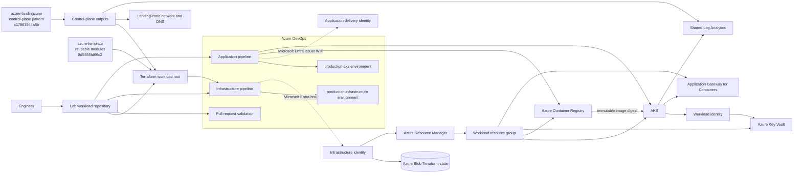

> **Document class:** Hands-on Labs guided implementation lab
> **Normative terms:** **MUST**, **MUST NOT**, **SHOULD**, **SHOULD NOT**, and **MAY** are requirements levels.
> **Applicability:** Pinned Terraform modules, Azure DevOps delivery, Azure Container Registry, AKS, Gateway API, workload identity, monitoring, immutable promotion, rollback, and cleanup.
> **Exception process:** Deviations require a documented risk assessment, compensating controls, named risk owner, and expiry date.

| Control field | Value |
|---|---|
| Document ID | `HOL-04` |
| Owner | Cloud Center of Excellence |
| Review cycle | At least annually and after material Azure, Kubernetes, Terraform, security, or source-repository changes |
| Evidence | Pinned module references, backend and identity checks, Terraform plans, image digest, AKS and Gateway validation, monitoring, rollback, and cleanup evidence |

# Build an End-to-End Azure DevOps, Terraform, ACR, and AKS CI/CD Platform

> **Decision in brief:** Compose a governed AKS platform from pinned Terraform modules, then promote one immutable application image through protected Azure DevOps stages with verifiable rollback.

> **Document type:** Guided hands-on lab  
> **Reusable module repository:** `andyxuan2010/azure-template` at `8d5555fd66c22b7b18d8a258c74abb7c206b736f`  
> **Control-plane reference repository:** `andyxuan2010/azure-landingzone` at `c17863944a8b4c032d94fcb6c1964a292fae659c`  
> **Difficulty:** Advanced  
> **Estimated duration:** 4–6 hours  
> **Primary services:** Azure DevOps, Terraform, AKS, ACR, Key Vault, Application Gateway for Containers, Application Insights, and Log Analytics

## Lab Overview

### Scenario

You are a platform engineer responsible for composing an AKS workload platform from an established Azure control plane and a governed Terraform module catalog. The completed lab must consume the reusable modules in `azure-template`, align its root composition with `azure-landingzone`, provision Azure infrastructure through a controlled Terraform pipeline, build one immutable application artifact, deploy it to AKS through a separate application pipeline, expose it through Gateway API, and provide operational validation, rollback, and cleanup procedures.

This is an execution lab, not an architecture essay. Each module contains an objective, implementation tasks, validation commands, and a checkpoint that must pass before you continue.

### Learning objectives

By completing this lab, you will be able to:

1. Bootstrap a protected Azure Blob backend for Terraform state.
2. Configure Azure DevOps service connections with workload identity federation.
3. Consume pinned reusable Terraform modules and integrate them with a landing-zone control-plane contract.
4. Separate infrastructure delivery from application delivery.
5. Create and apply a reviewed Terraform plan through an approval-controlled pipeline.
6. Build, test, scan, publish, and deploy an immutable container image.
7. Configure AKS namespace access and Key Vault integration without long-lived credentials.
8. Expose the application through Application Gateway for Containers and Kubernetes Gateway API.
9. Validate telemetry, availability, logs, rollout health, and rollback behavior.
10. Remove all lab resources safely and verify that no billable resources remain.

### What you will build

At the end of the lab, you will have:

- a self-contained lab workspace with both reference repositories pinned at reviewed commits;
- a protected Terraform remote-state backend;
- separate Azure DevOps identities for infrastructure and application delivery;
- an approval-controlled infrastructure pipeline;
- an application pipeline that deploys by immutable image digest;
- an AKS cluster integrated with ACR, Key Vault, Application Insights, and Log Analytics;
- Gateway API routing through Application Gateway for Containers;
- release validation, monitoring, rollback, and cleanup evidence.

### Lab success criteria

The lab is complete only when all of the following are true:

- Terraform applies the same saved plan that was reviewed and approved.
- Pull-request validation cannot deploy infrastructure or applications.
- The application pipeline does not require subscription-wide administrator permissions.
- AKS runs the exact image digest produced by the pipeline.
- The application responds successfully through the external Gateway address.
- Application and container telemetry are queryable.
- A rollback can restore the previously recorded image digest.
- Cleanup removes workload, backend, and lab identity resources.

## Target architecture



## Lab Sequence

| Module | Lab activity | Primary result |
|---:|---|---|
| 0 | Prepare the lab environment | Tools, subscription, lab workspace, and pinned reference repositories are ready. |
| 1 | Create the Terraform backend | Protected remote state is available through Microsoft Entra authorization. |
| 2 | Configure pipeline identities | Infrastructure and application delivery identities are separated. |
| 3 | Integrate the shared Terraform modules | The workload root consumes the AKS module and landing-zone control-plane outputs. |
| 4 | Build the infrastructure pipeline | A saved plan is reviewed, approved, and applied exactly. |
| 5 | Test and harden the application image | The Python app passes tests and runs as a hardened container. |
| 6 | Configure AKS platform resources | Namespace, workload identity, Key Vault, and Gateway resources are ready. |
| 7 | Deploy the Kubernetes workload | A restricted Deployment and Service are defined. |
| 8 | Build the application pipeline | One immutable image is built, published, and deployed by digest. |
| 9 | Validate the release | Workload, routing, identity, image, and telemetry checks pass. |
| 10 | Configure monitoring | Standard availability tests and `ContainerLogV2` queries are operational. |
| 11 | Test rollback | A failed rollout is detected and the previous digest is restored. |

## Lab Conventions

- Commands are written for Bash on Linux, macOS, or Windows Subsystem for Linux.
- Replace every value enclosed in angle brackets before execution.
- Run the lab in a sandbox or non-production subscription unless your organization explicitly approves another target.
- Do not store secrets, generated plans, state files, kubeconfig files, or rendered release manifests in source control.
- Stop at every **Module checkpoint**. Continuing after a failed checkpoint compounds errors and makes troubleshooting less reliable.

## Reference Repository Integration Model

The lab uses the two repositories for different responsibilities. Do not merge the repositories or copy reusable module internals into the workload root.

| Repository | Role in this lab | Relevant locations | Integration rule |
|---|---|---|---|
| `andyxuan2010/azure-template` | Reusable Terraform module catalog | `modules/aks`, `modules/acr`, `modules/vnet`, `modules/nsg`, `modules/privatedns`, `modules/loganalytics`, `modules/keyvault`, `modules/managedidentity`, and `modules/roleassignments` | Consume modules through a pinned Git source or an approved internal mirror. Do not edit module internals from the workload repository. |
| `andyxuan2010/azure-landingzone` | Control-plane and root-composition reference | `main.tf`, `variables.tf`, `outputs.tf`, `environments/<env>/`, `backend.tf`, `azure-pipelines.yml`, and `docs/ROOT_LEVEL_MODULES_GUIDE.md` | Reuse its dependency ordering, environment separation, provider context, remote-state boundary, and output-driven composition. Treat it as the control plane, not as a module catalog. |

The pinned references used while validating this edition are:

```text
azure-template:    8d5555fd66c22b7b18d8a258c74abb7c206b736f
azure-landingzone: c17863944a8b4c032d94fcb6c1964a292fae659c
```

Production pipelines must use an immutable commit or release tag. A floating `main` reference is acceptable for exploration only and must not be used for an approved production plan.

## Module 0 — Prepare the Lab Environment

### Module objective

Prepare the workstation, Azure subscription, self-contained lab workspace, and both pinned reference repositories before provisioning resources.

### Task 0.1 — Accounts and permissions

You need:

- an Azure subscription;
- an Azure DevOps organization and private project;
- permission to create or manage Azure Resource Manager workload identity service connections;
- permission to create role assignments at the intended scopes;
- permission to create a Microsoft Entra security group if a human AKS administration group is required;
- quota for AKS nodes and public IP or Application Gateway for Containers resources in the target region.

Use elevated permissions only for bootstrap. Remove temporary role assignments after the permanent identities are configured.

### Task 0.2 — Required tools

Run the following preflight:

```bash
set -e

for tool in az git terraform docker kubectl kubelogin helm; do
  command -v "$tool" >/dev/null 2>&1 || {
    echo "Missing required tool: $tool"
    exit 1
  }
done

az version
terraform version
docker version
kubectl version --client
kubelogin --version
helm version
```

Use versions approved by your platform team. The `azure-template` AKS module requires Terraform 1.x, AzureRM 4.x, and AzureAD 3.x within its documented constraints. The examples in this lab use compatible pinned provider ranges; your dependency lock file remains the executable source of truth.

### Task 0.3 — Authenticate and select the subscription

```bash
az login
az account list --output table
az account set --subscription "<subscription-id>"

export SUBSCRIPTION_ID="$(az account show --query id -o tsv)"
export TENANT_ID="$(az account show --query tenantId -o tsv)"

az account show \
  --query "{subscription:name, subscriptionId:id, tenantId:tenantId, user:user.name}" \
  --output table
```

### Task 0.4 — Define lab values

Use globally unique lowercase values for the storage account, registry, and Key Vault.

```bash
export PREFIX="dj<unique-suffix>"
export LOCATION="uksouth"

export PLATFORM_RG="${PREFIX}-platform-rg"
export WORKLOAD_RG="${PREFIX}-workload-rg"
export NODE_RG="${PREFIX}-node-rg"

export TFSTATE_STORAGE_ACCOUNT="${PREFIX}tfstate"
export TFSTATE_CONTAINER="tfstate"
export TFSTATE_KEY="production/platform.tfstate"

export AKS_NAME="${PREFIX}-aks"
export ACR_NAME="${PREFIX}acr"
export KEY_VAULT_NAME="${PREFIX}-kv"
export LOG_ANALYTICS_NAME="${PREFIX}-law"
export APP_INSIGHTS_NAME="${PREFIX}-appi"

export APP_NAMESPACE="platform-lab"
export APP_SERVICE_ACCOUNT="sampleapp"
export IMAGE_REPOSITORY="sampleapp"
```

Validate naming constraints before provisioning:

```bash
az storage account check-name --name "$TFSTATE_STORAGE_ACCOUNT" --output table
az acr check-name --name "$ACR_NAME" --output table
az keyvault check-name --name "$KEY_VAULT_NAME" --output table
```

When an existing `azure-landingzone` control plane supplies the target resource group, set `WORKLOAD_RG` to that exported value before creating role assignments. In a standalone sandbox, the lab-created resource group becomes the resource group returned through the control-plane contract. Use one ownership model consistently.

### Task 0.5 — Validate region and AKS version support

Do not copy a fixed Kubernetes version from either reference repository without checking the target region.

```bash
az aks get-versions --location "$LOCATION" --output table
```

For Application Gateway for Containers, verify that the service is supported in the selected region and confirm whether your organization permits preview features. The AKS add-on path may require preview feature registration; the BYO/Helm path has a different lifecycle. Pick one path and document it in the architecture decision record.

### Task 0.6 — Create the lab workspace and pin both repositories

Create a workspace with read-only reference checkouts and a separate workload repository:

```text
aks-platform-lab/
├── references/
│   ├── azure-template/
│   └── azure-landingzone/
└── workspace/
    ├── app/
    │   ├── app.py
    │   ├── Dockerfile
    │   ├── requirements.txt
    │   ├── requirements-dev.txt
    │   ├── templates/
    │   └── tests/
    ├── infra/
    │   ├── bootstrap/
    │   ├── environments/
    │   ├── main.tf
    │   ├── outputs.tf
    │   ├── providers.tf
    │   └── variables.tf
    ├── k8s/
    │   ├── platform/
    │   └── workload/
    ├── pipelines/
    ├── scripts/
    ├── .dockerignore
    ├── .gitignore
    └── README.md
```

Create the workspace:

```bash
mkdir -p aks-platform-lab/references
cd aks-platform-lab

git clone https://github.com/andyxuan2010/azure-template.git   references/azure-template
git -C references/azure-template checkout 8d5555fd66c22b7b18d8a258c74abb7c206b736f

git clone https://github.com/andyxuan2010/azure-landingzone.git   references/azure-landingzone
git -C references/azure-landingzone checkout c17863944a8b4c032d94fcb6c1964a292fae659c

mkdir -p workspace/app/templates workspace/app/tests   workspace/infra/bootstrap workspace/infra/environments   workspace/k8s/platform workspace/k8s/workload   workspace/pipelines workspace/scripts

cd workspace
git init
git switch -c lab/aks-platform
```

The reference checkouts are for inspection and validation. The Terraform root created later consumes `azure-template` by an immutable Git source. The `azure-landingzone` checkout supplies the control-plane composition pattern and output contract.

Create the minimal sample application so the lab has no dependency on another repository:

```bash
cat > app/app.py <<'PY'
import os

from flask import Flask, jsonify, render_template

connection_string = os.getenv("APPLICATIONINSIGHTS_CONNECTION_STRING")
if connection_string:
    from azure.monitor.opentelemetry import configure_azure_monitor

    configure_azure_monitor(connection_string=connection_string)

app = Flask(__name__)


@app.get("/health")
def health():
    return jsonify(status="healthy")


@app.get("/")
def home():
    return render_template("index.html")


if __name__ == "__main__":
    app.run(host="0.0.0.0", port=int(os.getenv("PORT", "5000")))
PY

cat > app/requirements.txt <<'REQ'
Flask>=3.0,<4
gunicorn>=23,<24
azure-monitor-opentelemetry>=1.6,<2
REQ

cat > app/templates/index.html <<'HTML'
<!doctype html>
<html lang="en">
  <head><meta charset="utf-8"><title>AKS Platform Lab</title></head>
  <body><h1>AKS Platform Lab</h1><p>The workload is healthy.</p></body>
</html>
HTML
```

Add repository exclusions:

```gitignore
# Terraform
**/.terraform/*
*.tfstate
*.tfstate.*
*.tfplan
crash.log
override.tf
override.tf.json
*_override.tf
*_override.tf.json

# Secrets and local environment
.env
.env.*
!.env.example
*.pem
*.pfx
*.key
secrets.yaml

# Python
__pycache__/
.pytest_cache/
.venv/
*.py[cod]

# IDE and operating system
.vscode/
.idea/
.DS_Store

# Generated deployment files
rendered/
```

Record the integration provenance:

```bash
cat > reference-repositories.json <<'JSON'
{
  "azure-template": "8d5555fd66c22b7b18d8a258c74abb7c206b736f",
  "azure-landingzone": "c17863944a8b4c032d94fcb6c1964a292fae659c"
}
JSON

git add .
git commit -m "Initialize AKS platform hands-on lab"
```

### Module checkpoint

- Required tools return valid version output.
- The intended Azure subscription is active.
- Lab variables are exported and names satisfy Azure constraints.
- `azure-template` and `azure-landingzone` are checked out at the pinned commits recorded in `reference-repositories.json`.
- The workload branch contains the target `app`, `infra`, `k8s`, `pipelines`, and `scripts` folders.
- Generated files and local secrets are excluded by `.gitignore`.

## Module 1 — Create a Protected Terraform Backend

### Module objective
Create an Azure Blob backend with state locking, version recovery, deletion protection, Entra ID authorization, and no storage-account-key dependency.

### Task 1.1 — Create the bootstrap script

Create `infra/bootstrap/create-terraform-backend.sh`:

```bash
#!/usr/bin/env bash
set -Eeuo pipefail

required=(
  SUBSCRIPTION_ID
  PLATFORM_RG
  TFSTATE_STORAGE_ACCOUNT
  TFSTATE_CONTAINER
  LOCATION
)

for name in "${required[@]}"; do
  if [[ -z "${!name:-}" ]]; then
    echo "Required environment variable is missing: $name" >&2
    exit 1
  fi
done

az account set --subscription "$SUBSCRIPTION_ID"

az group create \
  --name "$PLATFORM_RG" \
  --location "$LOCATION" \
  --tags \
    environment=shared \
    managed-by=bootstrap \
    workload=terraform-state \
  --output none

az storage account create \
  --name "$TFSTATE_STORAGE_ACCOUNT" \
  --resource-group "$PLATFORM_RG" \
  --location "$LOCATION" \
  --kind StorageV2 \
  --sku Standard_LRS \
  --https-only true \
  --min-tls-version TLS1_2 \
  --allow-blob-public-access false \
  --public-network-access Enabled \
  --tags \
    environment=shared \
    managed-by=bootstrap \
    workload=terraform-state \
  --output none

storage_id="$(
  az storage account show \
    --name "$TFSTATE_STORAGE_ACCOUNT" \
    --resource-group "$PLATFORM_RG" \
    --query id \
    --output tsv
)"

current_object_id="$(az ad signed-in-user show --query id --output tsv)"

az role assignment create \
  --assignee-object-id "$current_object_id" \
  --assignee-principal-type User \
  --role "Storage Blob Data Contributor" \
  --scope "$storage_id" \
  --output none 2>/dev/null || true

# Azure RBAC propagation is asynchronous.
for attempt in {1..18}; do
  if az storage container create \
      --name "$TFSTATE_CONTAINER" \
      --account-name "$TFSTATE_STORAGE_ACCOUNT" \
      --auth-mode login \
      --public-access off \
      --output none 2>/dev/null; then
    break
  fi

  if [[ "$attempt" -eq 18 ]]; then
    echo "Unable to create the state container after waiting for RBAC propagation." >&2
    exit 1
  fi

  sleep 10
done

az storage account blob-service-properties update \
  --account-name "$TFSTATE_STORAGE_ACCOUNT" \
  --resource-group "$PLATFORM_RG" \
  --enable-versioning true \
  --enable-delete-retention true \
  --delete-retention-days 30 \
  --enable-container-delete-retention true \
  --container-delete-retention-days 30 \
  --output none

# Disable account-key authorization after all bootstrap operations use Entra ID.
az storage account update \
  --name "$TFSTATE_STORAGE_ACCOUNT" \
  --resource-group "$PLATFORM_RG" \
  --allow-shared-key-access false \
  --output none

echo "Terraform backend created."
echo "Resource group : $PLATFORM_RG"
echo "Storage account: $TFSTATE_STORAGE_ACCOUNT"
echo "Container      : $TFSTATE_CONTAINER"
```

Run it:

```bash
chmod +x infra/bootstrap/create-terraform-backend.sh
./infra/bootstrap/create-terraform-backend.sh
```

### Task 1.2 — Validate the backend

```bash
az storage account show \
  --name "$TFSTATE_STORAGE_ACCOUNT" \
  --resource-group "$PLATFORM_RG" \
  --query "{
    name:name,
    httpsOnly:enableHttpsTrafficOnly,
    minimumTlsVersion:minimumTlsVersion,
    anonymousBlobAccess:allowBlobPublicAccess,
    sharedKeyAccess:allowSharedKeyAccess,
    publicNetworkAccess:publicNetworkAccess
  }" \
  --output table

az storage account blob-service-properties show \
  --account-name "$TFSTATE_STORAGE_ACCOUNT" \
  --resource-group "$PLATFORM_RG" \
  --query "{
    versioning:isVersioningEnabled,
    blobDeleteRetention:deleteRetentionPolicy,
    containerDeleteRetention:containerDeleteRetentionPolicy
  }"

az storage container show \
  --name "$TFSTATE_CONTAINER" \
  --account-name "$TFSTATE_STORAGE_ACCOUNT" \
  --auth-mode login \
  --output table
```

Expected conditions:

- HTTPS-only traffic is enabled.
- minimum TLS is `TLS1_2` or stronger.
- anonymous blob access is disabled.
- shared-key access is disabled.
- blob versioning is enabled.
- blob and container delete-retention policies are enabled.
- the `tfstate` container exists and is private.

### Optional extension — Private-network backend

The executable lab profile leaves the storage public endpoint enabled but blocks anonymous access and shared-key authentication. A production private-network profile should instead use:

- a private endpoint for `blob`;
- private DNS zone `privatelink.blob.core.windows.net`;
- a self-hosted Azure DevOps agent with network reachability;
- public network access disabled;
- firewall and DNS validation in pipeline preflight.

Do not disable public network access while using Microsoft-hosted agents unless an approved network-injection mechanism exists.

### Module checkpoint

- The state resource group, storage account, and container exist.
- Blob versioning and soft-delete controls are enabled.
- Shared-key authorization is disabled after Entra ID access is verified.
- Terraform can initialize the backend without an account key.

## Module 2 — Configure Identities and Least-Privilege Access

### Module objective
Separate infrastructure provisioning from application delivery and remove long-lived secrets.

### Task 2.1 — Create two Azure DevOps service connections

Create these Azure Resource Manager service connections:

| Service connection | Purpose | Required authentication |
|---|---|---|
| `sc-azure-infra-production` | Terraform backend access and Azure resource provisioning | Workload identity federation using the Microsoft Entra issuer |
| `sc-azure-app-production` | Image publishing and AKS workload deployment | Workload identity federation using the Microsoft Entra issuer |

Rules:

- Do not use client secrets.
- Do not enable “grant access permission to all pipelines.”
- Explicitly authorize only `pipelines/infrastructure.yml` or `pipelines/application.yml`.
- If Azure DevOps warns that a service connection uses the deprecated Azure DevOps issuer, convert it to the Microsoft Entra issuer.
- Keep the two service-principal object IDs. Application IDs and object IDs are not interchangeable.

Record them:

```bash
export INFRA_PRINCIPAL_OBJECT_ID="<infra-service-principal-object-id>"
export APP_PRINCIPAL_OBJECT_ID="<app-service-principal-object-id>"
```

### Task 2.2 — Create the workload resource group

Pre-create the workload resource group so authorization can be scoped below the subscription:

```bash
az group create \
  --name "$WORKLOAD_RG" \
  --location "$LOCATION" \
  --tags environment=production managed-by=terraform \
  --output none
```

### Task 2.3 — Assign infrastructure roles

```bash
workload_rg_id="$(
  az group show --name "$WORKLOAD_RG" --query id --output tsv
)"

state_account_id="$(
  az storage account show \
    --name "$TFSTATE_STORAGE_ACCOUNT" \
    --resource-group "$PLATFORM_RG" \
    --query id \
    --output tsv
)"

state_container_scope="${state_account_id}/blobServices/default/containers/${TFSTATE_CONTAINER}"

az role assignment create \
  --assignee-object-id "$INFRA_PRINCIPAL_OBJECT_ID" \
  --assignee-principal-type ServicePrincipal \
  --role "Contributor" \
  --scope "$workload_rg_id"

az role assignment create \
  --assignee-object-id "$INFRA_PRINCIPAL_OBJECT_ID" \
  --assignee-principal-type ServicePrincipal \
  --role "User Access Administrator" \
  --scope "$workload_rg_id"

az role assignment create \
  --assignee-object-id "$INFRA_PRINCIPAL_OBJECT_ID" \
  --assignee-principal-type ServicePrincipal \
  --role "Storage Blob Data Contributor" \
  --scope "$state_container_scope"
```

`User Access Administrator` is powerful. It is required only if Terraform creates role assignments. A stronger enterprise pattern separates role-assignment deployment into a privileged pipeline or deploys pre-approved custom roles with narrower actions.

### Task 2.4 — Delay application-role assignment until resources exist

The application identity receives no subscription-wide role. After ACR, AKS, and the namespace exist, assign:

- `AcrPush` on the registry;
- `Azure Kubernetes Service Cluster User Role` on the AKS resource;
- `Azure Kubernetes Service RBAC Writer` on the application namespace.

Do not add the application service principal to the human AKS administrator group.

### Module checkpoint

- Two WIF-backed service connections exist.
- The infrastructure identity has only the roles required to provision the lab.
- The application identity has no broad subscription-level administrator role.
- Service connections are authorized only for the intended pipelines.

## Module 3 — Integrate and Validate the Shared Terraform Modules

### Module objective
Consume the reusable AKS module at an immutable reference, integrate it with landing-zone control-plane outputs, and validate the resulting workload root.

### Task 3.1 — Provider and backend configuration

Replace `infra/providers.tf` with:

```hcl
terraform {
  required_version = ">= 1.14.0, < 2.0.0"

  backend "azurerm" {
    use_azuread_auth = true
    use_oidc         = true
  }

  required_providers {
    azurerm = {
      source  = "hashicorp/azurerm"
      version = ">= 4.70.0, < 5.0.0"
    }

    azuread = {
      source  = "hashicorp/azuread"
      version = ">= 3.0.0, < 4.0.0"
    }
  }
}

provider "azurerm" {
  features {}
}

provider "azuread" {}

data "azurerm_client_config" "current" {}
```

Do not place the storage account name, tenant ID, subscription ID, or state key in source-controlled backend code. Provide them during `terraform init`.

### Task 3.2 — Remove dead and misleading variables

Define only the inputs used by the consuming workload root. Use explicit names and a stable control-plane output contract rather than reconstructing names or resource IDs.

Example variable definitions:

```hcl
variable "location" {
  type        = string
  description = "Azure region for the workload."

  validation {
    condition     = length(trimspace(var.location)) > 0
    error_message = "location must not be empty."
  }
}

variable "environment" {
  type        = string
  description = "Deployment environment."

  validation {
    condition     = contains(["development", "test", "staging", "production"], var.environment)
    error_message = "environment must be development, test, staging, or production."
  }
}

variable "aks_name" {
  type        = string
  description = "AKS cluster name."
}

variable "kubernetes_version" {
  type        = string
  description = "Approved AKS Kubernetes version available in the target region."
}

variable "aks_admin_group_object_id" {
  type        = string
  description = "Object ID of the Microsoft Entra group for human AKS administrators."

  validation {
    condition     = can(regex("^[0-9a-fA-F-]{36}$", var.aks_admin_group_object_id))
    error_message = "aks_admin_group_object_id must be a GUID."
  }
}

variable "workload_name" {
  type        = string
  description = "Short workload name used by the shared naming convention."
  default     = "aksplat"
}

variable "node_resource_group_name" {
  type        = string
  description = "AKS-managed node resource group name."
}

variable "system_node_vm_size" {
  type        = string
  description = "VM size for the system node pool."
  default     = "Standard_D4s_v5"
}

variable "user_node_vm_size" {
  type        = string
  description = "VM size for the user node pool."
  default     = "Standard_D4s_v5"
}

variable "aks_zones" {
  type        = list(string)
  description = "Availability zones supported by the selected region and VM sizes."
  default     = []
}

variable "control_plane_state_resource_group_name" {
  type        = string
  description = "Resource group containing the landing-zone Terraform state account."
}

variable "control_plane_state_storage_account_name" {
  type        = string
  description = "Storage account containing the landing-zone Terraform state."
}

variable "control_plane_state_container_name" {
  type        = string
  description = "Blob container containing the landing-zone Terraform state."
  default     = "tfstate"
}

variable "control_plane_state_key" {
  type        = string
  description = "State key for the deployed landing-zone control plane."
}

variable "tags" {
  type        = map(string)
  description = "Mandatory resource tags."
}
```

Use a placeholder-free example file, not a real-looking object ID:

```hcl
# infra/environments/production.tfvars.example
location                       = "<supported-region>"
environment                    = "production"
workload_name                  = "aksplat"
aks_name                       = "<unique-aks-name>"
node_resource_group_name       = "<unique-node-resource-group-name>"
kubernetes_version             = "<supported-non-preview-version>"
aks_admin_group_object_id      = "<entra-group-object-id>"
system_node_vm_size            = "Standard_D4s_v5"
user_node_vm_size              = "Standard_D4s_v5"
aks_zones                      = ["1", "2", "3"]

control_plane_state_resource_group_name  = "<landing-zone-state-resource-group>"
control_plane_state_storage_account_name = "<landing-zone-state-account>"
control_plane_state_container_name       = "tfstate"
control_plane_state_key                  = "<environment>/control-plane.tfstate"

tags = {
  environment = "production"
  managed-by  = "terraform"
  owner       = "cloud-platform"
  cost-center = "<cost-center>"
  data-class  = "internal"
}
```

Copy it locally and keep the populated file outside source control when values are tenant-specific:

```bash
cp infra/environments/production.tfvars.example \
  infra/environments/production.auto.tfvars
```

### Task 3.3 — Adopt the AKS module's secure defaults deliberately

The shared `modules/aks` implementation already supports private API access, Microsoft Entra and Azure RBAC integration, disabled local accounts, OIDC, Workload Identity, Azure Policy, node pools, diagnostics, and the Key Vault Secrets Store CSI driver. Keep these behaviors explicit in the consuming root so reviewers can see the intended platform contract:

```hcl
private_cluster_enabled   = true
private_dns_zone_id       = "System"
oidc_issuer_enabled       = true
workload_identity_enabled = true
local_account_disabled    = true
azure_rbac_enabled        = true
azure_policy_enabled      = true

key_vault_secrets_provider_enabled                   = true
key_vault_secrets_provider_secret_rotation_enabled   = true
key_vault_secrets_provider_secret_rotation_interval  = "5m"
```

Review these production requirements before adoption:

- separate system and user node pools;
- availability-zone support in the chosen region and VM SKU;
- maintenance windows;
- private-cluster DNS and administrative network reachability;
- Azure Policy or another admission-control mechanism;
- Defender for Containers where organizationally approved;
- controlled outbound connectivity;
- network policy;
- diagnostic settings and data-collection rules;
- cluster and node-image upgrade policies;
- backup and recovery requirements;
- pod disruption budgets and topology distribution.

Do not hard-code three availability zones unless the region and selected VM SKU support them.

### Task 3.4 — Compose the workload root from both repositories

Use the repositories at different layers:

1. `azure-landingzone` establishes the control plane: management hierarchy, subscriptions, shared resource group, hub/spoke networking, AKS subnet, private DNS, Log Analytics, policy, and common platform services.
2. The workload root consumes the `azure-template/modules/aks` module and any supporting modules not already supplied by the control plane.
3. Module inputs come from explicit variables or remote-state outputs. Do not reconstruct Azure IDs from names.

The most relevant shared modules are:

| Capability | Shared module path | Use in the lab |
|---|---|---|
| AKS cluster and node pools | `modules/aks` | Required workload-platform module. |
| Container registry | `modules/acr` | Use when ACR is workload-owned rather than provided by the control plane. |
| Virtual network and subnets | `modules/vnet` | Normally control-plane owned; use only for an isolated lab subscription. |
| Network security groups | `modules/nsg` | Apply through the control-plane network layer. |
| Private DNS | `modules/privatedns` | Control-plane owned for private AKS and private endpoints. |
| Log Analytics | `modules/loganalytics` | Reuse the shared workspace where policy permits. |
| Key Vault | `modules/keyvault` | Use for platform or workload secret boundaries. |
| Managed identity | `modules/managedidentity` | Use for caller-managed AKS or workload identities. |
| Role assignments | `modules/roleassignments` | Use through a privileged infrastructure path. |
| Application Gateway | `modules/applicationgateway` | Represents Azure Application Gateway patterns; do not assume it replaces Application Gateway for Containers. |

### Expose a minimal control-plane output contract

Follow the `azure-landingzone` root-composition pattern and expose only non-sensitive values required by the AKS workload root. Add an output such as the following to the control-plane stack when equivalent outputs are not already present:

```hcl
output "aks_workload_contract" {
  description = "Non-sensitive landing-zone values consumed by AKS workload roots."

  value = {
    resource_group_name        = module.resource_group.name
    location                   = module.resource_group.location
    aks_subnet_id              = module.spoke_virtual_network.subnet_ids["snet-aks"]
    log_analytics_workspace_id = module.log_analytics.id
  }
}
```

The landing-zone stack and workload stack must use separate state keys. Grant the workload pipeline read access to the control-plane state only when remote-state consumption is approved. A stronger enterprise option publishes the contract through a configuration registry or pipeline artifact instead of granting state access.

Create `infra/control-plane.tf`:

```hcl
data "terraform_remote_state" "control_plane" {
  backend = "azurerm"

  config = {
    resource_group_name  = var.control_plane_state_resource_group_name
    storage_account_name = var.control_plane_state_storage_account_name
    container_name       = var.control_plane_state_container_name
    key                  = var.control_plane_state_key
    use_azuread_auth     = true
    use_oidc             = true
  }
}

locals {
  control_plane = data.terraform_remote_state.control_plane.outputs.aks_workload_contract
}
```

For a self-contained sandbox where the landing-zone stack is not deployed, create equivalent network and monitoring resources with the matching `azure-template` modules, then pass their outputs to the AKS module. Do not mix both ownership models in one environment.

### Consume the pinned AKS module

Create `infra/main.tf`:

```hcl
module "aks" {
  source = "git::https://github.com/andyxuan2010/azure-template.git//modules/aks?ref=8d5555fd66c22b7b18d8a258c74abb7c206b736f"

  resource_group_name = local.control_plane.resource_group_name
  location            = local.control_plane.location
  name                = var.aks_name
  workload_name       = var.workload_name
  app_env             = var.environment

  kubernetes_version       = var.kubernetes_version
  node_resource_group_name = var.node_resource_group_name

  private_cluster_enabled = true
  private_dns_zone_id     = "System"

  oidc_issuer_enabled       = true
  workload_identity_enabled = true
  local_account_disabled    = true
  azure_rbac_enabled        = true
  azure_policy_enabled      = true
  admin_group_object_ids    = [var.aks_admin_group_object_id]

  default_node_pool = {
    name                         = "system"
    vm_size                      = var.system_node_vm_size
    auto_scaling_enabled         = true
    min_count                    = 3
    max_count                    = 6
    zones                       = var.aks_zones
    vnet_subnet_id              = local.control_plane.aks_subnet_id
    only_critical_addons_enabled = true
  }

  node_pools = {
    user = {
      name                 = "user"
      vm_size              = var.user_node_vm_size
      mode                 = "User"
      auto_scaling_enabled = true
      min_count            = 2
      max_count            = 10
      zones                = var.aks_zones
      vnet_subnet_id       = local.control_plane.aks_subnet_id
      node_labels = {
        workload = "general"
      }
    }
  }

  log_analytics_workspace_id           = local.control_plane.log_analytics_workspace_id
  oms_agent_log_analytics_workspace_id = local.control_plane.log_analytics_workspace_id
  oms_agent_enabled                     = true

  key_vault_secrets_provider_enabled                   = true
  key_vault_secrets_provider_secret_rotation_enabled   = true
  key_vault_secrets_provider_secret_rotation_interval  = "5m"

  inherit_resource_group_tags   = true
  inherited_resource_group_tags = var.tags
  tags                          = var.tags
}
```

Use the module's documented examples and tests as the executable reference:

```bash
git -C ../references/azure-template show   8d5555fd66c22b7b18d8a258c74abb7c206b736f:modules/aks/README.md | less

terraform -chdir=../references/azure-template/modules/aks   init -backend=false
terraform -chdir=../references/azure-template/modules/aks validate
terraform -chdir=../references/azure-template/modules/aks test
```

The module tests use mocked providers and do not create Azure resources. The workload root still requires its own plan validation against the target subscription.

### Task 3.5 — Format and validate locally

```bash
cd infra

terraform fmt -recursive
terraform fmt -check -recursive
terraform init -backend=false
terraform validate
```

Commit the dependency lock file:

```bash
git add .terraform.lock.hcl
git commit -m "Normalize Terraform configuration and lock providers"
```

Never commit `.terraform/`, state files, plan files, or populated secret files.

### Module checkpoint

- `terraform fmt -check -recursive` passes.
- `terraform validate` passes.
- The selected AKS version is available in the target region.
- Placeholder IDs, SSH keys, and inconsistent resource names are removed or parameterized.

## Module 4 — Build the Controlled Infrastructure Pipeline

### Module objective

Validate every change, save the plan, require an external approval, and apply the exact reviewed plan.

### Task 4.1 — Create the infrastructure pipeline

Install the Microsoft DevLabs Terraform extension only when it is part of your approved toolchain, or replace the tasks with an internally governed Terraform CLI template. Marketplace extensions must be approved by your organization.

Create `pipelines/infrastructure.yml`:

```yaml
name: infra_$(Date:yyyyMMdd)$(Rev:.r)

trigger:
  batch: true
  branches:
    include:
      - main
  paths:
    include:
      - infra/**
      - pipelines/infrastructure.yml

pr:
  branches:
    include:
      - main
  paths:
    include:
      - infra/**
      - pipelines/infrastructure.yml

variables:
  terraformVersion: '1.14.9'
  serviceConnection: 'sc-azure-infra-production'
  workingDirectory: '$(Build.SourcesDirectory)/infra'
  tfvarsFile: 'environments/production.auto.tfvars'

  backendResourceGroup: '<platform-resource-group>'
  backendStorageAccount: '<state-storage-account>'
  backendContainer: 'tfstate'
  backendKey: 'production/platform.tfstate'

stages:
  - stage: ValidateAndPlan
    displayName: Validate and plan
    jobs:
      - job: Plan
        displayName: Terraform plan
        pool:
          vmImage: ubuntu-latest

        steps:
          - checkout: self
            clean: true
            fetchDepth: 1

          - task: TerraformInstaller@1
            displayName: Install Terraform
            inputs:
              terraformVersion: '$(terraformVersion)'

          - bash: |
              set -euo pipefail
              terraform fmt -check -recursive
            displayName: Check Terraform formatting
            workingDirectory: '$(workingDirectory)'

          - task: TerraformTaskV4@4
            displayName: Terraform init
            inputs:
              provider: azurerm
              command: init
              backendServiceArm: '$(serviceConnection)'
              backendAzureRmResourceGroupName: '$(backendResourceGroup)'
              backendAzureRmStorageAccountName: '$(backendStorageAccount)'
              backendAzureRmContainerName: '$(backendContainer)'
              backendAzureRmKey: '$(backendKey)'
              workingDirectory: '$(workingDirectory)'

          - task: TerraformTaskV4@4
            displayName: Terraform validate
            inputs:
              provider: azurerm
              command: validate
              environmentServiceNameAzureRM: '$(serviceConnection)'
              workingDirectory: '$(workingDirectory)'

          - task: TerraformTaskV4@4
            displayName: Terraform plan
            inputs:
              provider: azurerm
              command: plan
              environmentServiceNameAzureRM: '$(serviceConnection)'
              workingDirectory: '$(workingDirectory)'
              commandOptions: >-
                -input=false
                -lock-timeout=5m
                -var-file="$(tfvarsFile)"
                -out="$(Build.ArtifactStagingDirectory)/tfplan"

          - bash: |
              set -euo pipefail
              terraform show -no-color \
                "$(Build.ArtifactStagingDirectory)/tfplan" \
                > "$(Build.ArtifactStagingDirectory)/tfplan.txt"
              sha256sum "$(Build.ArtifactStagingDirectory)/tfplan" \
                > "$(Build.ArtifactStagingDirectory)/tfplan.sha256"
            displayName: Export plan evidence
            workingDirectory: '$(workingDirectory)'

          - publish: '$(Build.ArtifactStagingDirectory)'
            artifact: terraform-plan
            displayName: Publish protected plan artifact

  - stage: Apply
    displayName: Apply reviewed plan
    dependsOn: ValidateAndPlan
    condition: >
      and(
        succeeded(),
        eq(variables['Build.SourceBranch'], 'refs/heads/main'),
        ne(variables['Build.Reason'], 'PullRequest')
      )

    jobs:
      - deployment: ApplyProduction
        displayName: Apply production infrastructure
        pool:
          vmImage: ubuntu-latest
        environment: production-infrastructure

        strategy:
          runOnce:
            deploy:
              steps:
                - checkout: self
                  clean: true
                  fetchDepth: 1

                - download: current
                  artifact: terraform-plan

                - task: TerraformInstaller@1
                  displayName: Install Terraform
                  inputs:
                    terraformVersion: '$(terraformVersion)'

                - task: TerraformTaskV4@4
                  displayName: Terraform init
                  inputs:
                    provider: azurerm
                    command: init
                    backendServiceArm: '$(serviceConnection)'
                    backendAzureRmResourceGroupName: '$(backendResourceGroup)'
                    backendAzureRmStorageAccountName: '$(backendStorageAccount)'
                    backendAzureRmContainerName: '$(backendContainer)'
                    backendAzureRmKey: '$(backendKey)'
                    workingDirectory: '$(workingDirectory)'

                - bash: |
                    set -euo pipefail
                    cd "$(Pipeline.Workspace)/terraform-plan"
                    sha256sum --check tfplan.sha256
                  displayName: Verify plan integrity

                - task: TerraformTaskV4@4
                  displayName: Apply saved Terraform plan
                  inputs:
                    provider: azurerm
                    command: apply
                    environmentServiceNameAzureRM: '$(serviceConnection)'
                    workingDirectory: '$(workingDirectory)'
                    commandOptions: >-
                      -input=false
                      -lock-timeout=5m
                      "$(Pipeline.Workspace)/terraform-plan/tfplan"
```

### Task 4.2 — Configure the Environment approval

In Azure DevOps:

1. Go to **Pipelines > Environments**.
2. Create `production-infrastructure`.
3. Open **Approvals and checks**.
4. Add an approval owned by a platform or change-authority group.
5. Add branch control and other organizational checks where available.
6. Prevent the pipeline author from being the only required approver.

Approvals and checks belong to protected resources and are not controlled by the YAML author.

### Task 4.3 — Protect the plan artifact

A Terraform plan can contain sensitive values. Restrict:

- build-log access;
- artifact-download permissions;
- retention duration;
- pipeline-service-account permissions;
- export to external systems.

### Task 4.4 — Execute and validate

Run a pull request first. Confirm that only `ValidateAndPlan` runs.

After merge to `main`, approve the `production-infrastructure` Environment and confirm that the apply stage uses the published plan.

Validation:

```bash
terraform -chdir=infra state list

az resource list \
  --resource-group "$WORKLOAD_RG" \
  --query "[].{name:name,type:type,location:location}" \
  --output table

az aks show \
  --resource-group "$WORKLOAD_RG" \
  --name "$AKS_NAME" \
  --query "{
    state:provisioningState,
    kubernetesVersion:kubernetesVersion,
    oidc:oidcIssuerProfile.enabled,
    workloadIdentity:securityProfile.workloadIdentity.enabled,
    localAccounts:disableLocalAccounts,
    azureRbac:aadProfile.enableAzureRbac
  }"
```

### Module checkpoint

- Pull-request runs validate but cannot apply.
- The plan stage publishes a binary plan artifact and reviewable text output.
- The production environment requires approval.
- The apply stage consumes the saved plan rather than generating a new plan.

## Module 5 — Test and Harden the Application Image

### Module objective
Create an independently testable application artifact and run it as a non-root, constrained container.

### Task 5.1 — Add application tests

Create `app/tests/test_app.py`:

```python
from app import app


def test_health_endpoint() -> None:
    client = app.test_client()
    response = client.get("/health")

    assert response.status_code == 200
    assert response.get_json() == {"status": "healthy"}


def test_homepage() -> None:
    client = app.test_client()
    response = client.get("/")

    assert response.status_code == 200
```

Create `app/requirements-dev.txt`:

```text
-r requirements.txt
pytest>=8,<9
```

Run the tests:

```bash
cd app
python -m venv .venv
source .venv/bin/activate
python -m pip install --upgrade pip
python -m pip install -r requirements-dev.txt
pytest -q
```

### Task 5.2 — Replace the Dockerfile

Create `app/Dockerfile`:

```dockerfile
FROM python:3.13-slim

ENV PYTHONDONTWRITEBYTECODE=1 \
    PYTHONUNBUFFERED=1 \
    PIP_NO_CACHE_DIR=1 \
    PORT=5000

WORKDIR /app

RUN groupadd --gid 10001 appgroup \
    && useradd \
      --uid 10001 \
      --gid appgroup \
      --no-create-home \
      --shell /usr/sbin/nologin \
      appuser

COPY requirements.txt ./
RUN python -m pip install --no-cache-dir -r requirements.txt

COPY --chown=10001:10001 app.py ./
COPY --chown=10001:10001 templates ./templates

USER 10001:10001

EXPOSE 5000

CMD ["gunicorn", "--workers", "4", "--bind", "0.0.0.0:5000", "--access-logfile", "-", "--error-logfile", "-", "app:app"]
```

For stricter reproducibility, pin the base image by approved digest and update it through an automated dependency-management process. Do not invent or copy an unverified digest.

Create `.dockerignore`:

```text
.git
.github
.azure-pipelines
.venv
__pycache__
.pytest_cache
tests
*.pyc
*.pyo
*.pyd
.env
```

### Task 5.3 — Build and test locally

```bash
docker build -t sampleapp:local app

container_id="$(
  docker run --detach \
    --read-only \
    --tmpfs /tmp:rw,noexec,nosuid,size=64m \
    --publish 5000:5000 \
    sampleapp:local
)"

trap 'docker rm -f "$container_id" >/dev/null 2>&1 || true' EXIT

for attempt in {1..30}; do
  if curl --fail --silent http://localhost:5000/health; then
    break
  fi
  sleep 2
done

docker inspect "$container_id" \
  --format 'user={{.Config.User}} image={{.Config.Image}}'
```

Expected result:

```json
{"status":"healthy"}
```

The configured container user must not be `root` or `0`.

### Module checkpoint

- Unit tests pass.
- The image builds successfully.
- The container runs as a non-root user.
- `/health` returns HTTP 200 locally.

## Module 6 — Configure Platform-Owned AKS Resources

### Module objective
Install platform components once, establish namespace policy, and configure Key Vault access for the workload without giving the delivery pipeline secret-read permissions.

### Task 6.1 — Get cluster credentials as an administrator

```bash
az aks get-credentials \
  --resource-group "$WORKLOAD_RG" \
  --name "$AKS_NAME" \
  --overwrite-existing

kubelogin convert-kubeconfig -l azurecli
kubectl get nodes
```

### Task 6.2 — Create the namespace with Pod Security Admission labels

Create `k8s/platform/namespace.yaml`:

```yaml
apiVersion: v1
kind: Namespace
metadata:
  name: platform-lab
  labels:
    app.kubernetes.io/part-of: platform-lab
    pod-security.kubernetes.io/enforce: restricted
    pod-security.kubernetes.io/enforce-version: latest
    pod-security.kubernetes.io/audit: restricted
    pod-security.kubernetes.io/audit-version: latest
    pod-security.kubernetes.io/warn: restricted
    pod-security.kubernetes.io/warn-version: latest
```

Apply it:

```bash
kubectl apply -f k8s/platform/namespace.yaml
```

### Task 6.3 — Assign application pipeline access

```bash
aks_id="$(
  az aks show \
    --resource-group "$WORKLOAD_RG" \
    --name "$AKS_NAME" \
    --query id \
    --output tsv
)"

acr_id="$(
  az acr show \
    --resource-group "$WORKLOAD_RG" \
    --name "$ACR_NAME" \
    --query id \
    --output tsv
)"

az role assignment create \
  --assignee-object-id "$APP_PRINCIPAL_OBJECT_ID" \
  --assignee-principal-type ServicePrincipal \
  --role "AcrPush" \
  --scope "$acr_id"

az role assignment create \
  --assignee-object-id "$APP_PRINCIPAL_OBJECT_ID" \
  --assignee-principal-type ServicePrincipal \
  --role "Azure Kubernetes Service Cluster User Role" \
  --scope "$aks_id"

az role assignment create \
  --assignee-object-id "$APP_PRINCIPAL_OBJECT_ID" \
  --assignee-principal-type ServicePrincipal \
  --role "Azure Kubernetes Service RBAC Writer" \
  --scope "${aks_id}/namespaces/${APP_NAMESPACE}"
```

The RBAC Writer role can read Secrets and run Pods as service accounts in the namespace. It is materially privileged. Use a custom Azure RBAC role or a narrowly scoped Kubernetes Role where your delivery model permits it.

### Task 6.4 — Create the workload identity for Key Vault

```bash
export WORKLOAD_IDENTITY_NAME="${PREFIX}-sampleapp-mi"

az identity create \
  --name "$WORKLOAD_IDENTITY_NAME" \
  --resource-group "$WORKLOAD_RG" \
  --location "$LOCATION" \
  --output none

export WORKLOAD_CLIENT_ID="$(
  az identity show \
    --name "$WORKLOAD_IDENTITY_NAME" \
    --resource-group "$WORKLOAD_RG" \
    --query clientId \
    --output tsv
)"

export WORKLOAD_PRINCIPAL_ID="$(
  az identity show \
    --name "$WORKLOAD_IDENTITY_NAME" \
    --resource-group "$WORKLOAD_RG" \
    --query principalId \
    --output tsv
)"

export AKS_OIDC_ISSUER="$(
  az aks show \
    --name "$AKS_NAME" \
    --resource-group "$WORKLOAD_RG" \
    --query oidcIssuerProfile.issuerUrl \
    --output tsv
)"

az identity federated-credential create \
  --name "${APP_SERVICE_ACCOUNT}-federation" \
  --identity-name "$WORKLOAD_IDENTITY_NAME" \
  --resource-group "$WORKLOAD_RG" \
  --issuer "$AKS_OIDC_ISSUER" \
  --subject "system:serviceaccount:${APP_NAMESPACE}:${APP_SERVICE_ACCOUNT}" \
  --audiences "api://AzureADTokenExchange" \
  --output none

key_vault_id="$(
  az keyvault show \
    --name "$KEY_VAULT_NAME" \
    --resource-group "$WORKLOAD_RG" \
    --query id \
    --output tsv
)"

az role assignment create \
  --assignee-object-id "$WORKLOAD_PRINCIPAL_ID" \
  --assignee-principal-type ServicePrincipal \
  --role "Key Vault Secrets User" \
  --scope "$key_vault_id"
```

### Task 6.5 — Store the Application Insights connection string

The operator performing this step needs secret-write permission on the Key Vault.

```bash
connection_string="$(
  az monitor app-insights component show \
    --app "$APP_INSIGHTS_NAME" \
    --resource-group "$WORKLOAD_RG" \
    --query connectionString \
    --output tsv
)"

az keyvault secret set \
  --vault-name "$KEY_VAULT_NAME" \
  --name "appinsights-connection-string" \
  --value "$connection_string" \
  --output none
```

Do not print the connection string in pipeline logs.

### Task 6.6 — Create the ServiceAccount and SecretProviderClass

Create `k8s/platform/secret-provider-class.yaml` and replace the placeholders during the platform deployment:

```yaml
apiVersion: v1
kind: ServiceAccount
metadata:
  name: sampleapp
  namespace: platform-lab
  annotations:
    azure.workload.identity/client-id: WORKLOAD_CLIENT_ID_PLACEHOLDER
---
apiVersion: secrets-store.csi.x-k8s.io/v1
kind: SecretProviderClass
metadata:
  name: sampleapp-key-vault
  namespace: platform-lab
spec:
  provider: azure

  secretObjects:
    - secretName: sampleapp-runtime
      type: Opaque
      data:
        - objectName: appinsights-connection-string
          key: application-insights-connection-string

  parameters:
    usePodIdentity: "false"
    clientID: "WORKLOAD_CLIENT_ID_PLACEHOLDER"
    keyvaultName: "KEY_VAULT_NAME_PLACEHOLDER"
    cloudName: ""
    tenantId: "TENANT_ID_PLACEHOLDER"
    objects: |
      array:
        - |
          objectName: appinsights-connection-string
          objectType: secret
          objectVersion: ""
```

Render without mutating the source:

```bash
mkdir -p rendered

sed \
  -e "s|WORKLOAD_CLIENT_ID_PLACEHOLDER|${WORKLOAD_CLIENT_ID}|g" \
  -e "s|KEY_VAULT_NAME_PLACEHOLDER|${KEY_VAULT_NAME}|g" \
  -e "s|TENANT_ID_PLACEHOLDER|${TENANT_ID}|g" \
  k8s/platform/secret-provider-class.yaml \
  > rendered/secret-provider-class.yaml

kubectl apply -f rendered/secret-provider-class.yaml
```

### Task 6.7 — Install Application Gateway for Containers as a platform component

Use exactly one supported model:

**Model A: AKS add-on**

Use when the add-on is approved, supported in the target region, and compatible with organizational preview policies.

**Model B: Helm/BYO deployment**

Install or upgrade the ALB Controller in a platform pipeline, not in every application deployment:

```bash
export ALB_CONTROLLER_VERSION="<approved-controller-version>"

export ALB_CLIENT_ID="$(
  az identity show \
    --resource-group "$WORKLOAD_RG" \
    --name "azure-alb-identity" \
    --query clientId \
    --output tsv
)"

helm upgrade --install alb-controller \
  oci://mcr.microsoft.com/application-lb/charts/alb-controller \
  --namespace azure-alb-system \
  --create-namespace \
  --version "$ALB_CONTROLLER_VERSION" \
  --set albController.namespace=azure-alb-system \
  --set albController.podIdentity.clientID="$ALB_CLIENT_ID" \
  --wait \
  --timeout 10m
```

Validate the approved controller version against the official release notes before execution.

### Task 6.8 — Create Gateway API routing

Create `k8s/platform/gateway.yaml`:

```yaml
apiVersion: gateway.networking.k8s.io/v1
kind: Gateway
metadata:
  name: sampleapp-gateway
  namespace: platform-lab
  annotations:
    alb.networking.azure.io/alb-id: ALB_RESOURCE_ID_PLACEHOLDER
spec:
  gatewayClassName: azure-alb-external
  listeners:
    - name: http
      protocol: HTTP
      port: 80
      allowedRoutes:
        namespaces:
          from: Same
  addresses:
    - type: alb.networking.azure.io/alb-frontend
      value: alb-frontend
```

Create `k8s/platform/http-route.yaml`:

```yaml
apiVersion: gateway.networking.k8s.io/v1
kind: HTTPRoute
metadata:
  name: sampleapp
  namespace: platform-lab
spec:
  parentRefs:
    - name: sampleapp-gateway
  rules:
    - matches:
        - path:
            type: PathPrefix
            value: /
      backendRefs:
        - name: sampleapp
          port: 80
```

Render and apply:

```bash
export ALB_RESOURCE_ID="$(
  az network alb show \
    --resource-group "$WORKLOAD_RG" \
    --name "${PREFIX}-alb" \
    --query id \
    --output tsv
)"

sed \
  "s|ALB_RESOURCE_ID_PLACEHOLDER|${ALB_RESOURCE_ID}|g" \
  k8s/platform/gateway.yaml \
  > rendered/gateway.yaml

kubectl apply -f rendered/gateway.yaml
kubectl apply -f k8s/platform/http-route.yaml
```

For production, terminate HTTPS and manage certificates through an approved certificate lifecycle. Plain HTTP is retained here only to keep the lab focused.

### Module checkpoint

- The namespace exists with the intended Pod Security labels.
- The application delivery identity has namespace-scoped deployment access.
- Workload identity can read the required Key Vault secret.
- Gateway and routing resources report accepted or programmed status.

## Module 7 — Create the Hardened Kubernetes Workload Manifest

### Module objective

Define a restricted Kubernetes Deployment and Service with health probes, resource controls, disruption protection, workload identity, and an immutable image placeholder.

### Task 7.1 — Create the workload manifest

Create `k8s/workload/app.yaml`:

```yaml
apiVersion: apps/v1
kind: Deployment
metadata:
  name: sampleapp
  namespace: platform-lab
  labels:
    app.kubernetes.io/name: sampleapp
    app.kubernetes.io/part-of: platform-lab
spec:
  replicas: 2
  revisionHistoryLimit: 5
  minReadySeconds: 10
  progressDeadlineSeconds: 300

  strategy:
    type: RollingUpdate
    rollingUpdate:
      maxUnavailable: 0
      maxSurge: 1

  selector:
    matchLabels:
      app.kubernetes.io/name: sampleapp

  template:
    metadata:
      labels:
        app.kubernetes.io/name: sampleapp
        app.kubernetes.io/part-of: platform-lab
        azure.workload.identity/use: "true"
    spec:
      serviceAccountName: sampleapp
      terminationGracePeriodSeconds: 30

      securityContext:
        runAsNonRoot: true
        seccompProfile:
          type: RuntimeDefault

      containers:
        - name: sampleapp
          image: IMAGE_REFERENCE_PLACEHOLDER
          imagePullPolicy: IfNotPresent

          ports:
            - name: http
              containerPort: 5000
              protocol: TCP

          env:
            - name: APPLICATIONINSIGHTS_CONNECTION_STRING
              valueFrom:
                secretKeyRef:
                  name: sampleapp-runtime
                  key: application-insights-connection-string

          securityContext:
            allowPrivilegeEscalation: false
            readOnlyRootFilesystem: true
            capabilities:
              drop:
                - ALL

          resources:
            requests:
              cpu: 100m
              memory: 128Mi
            limits:
              cpu: 500m
              memory: 256Mi

          startupProbe:
            httpGet:
              path: /health
              port: http
            failureThreshold: 30
            periodSeconds: 2

          readinessProbe:
            httpGet:
              path: /health
              port: http
            initialDelaySeconds: 2
            periodSeconds: 5
            timeoutSeconds: 2
            failureThreshold: 3

          livenessProbe:
            httpGet:
              path: /health
              port: http
            initialDelaySeconds: 10
            periodSeconds: 10
            timeoutSeconds: 2
            failureThreshold: 3

          volumeMounts:
            - name: tmp
              mountPath: /tmp
            - name: secrets-store-inline
              mountPath: /mnt/secrets-store
              readOnly: true

      volumes:
        - name: tmp
          emptyDir:
            sizeLimit: 64Mi

        - name: secrets-store-inline
          csi:
            driver: secrets-store.csi.k8s.io
            readOnly: true
            volumeAttributes:
              secretProviderClass: sampleapp-key-vault
---
apiVersion: v1
kind: Service
metadata:
  name: sampleapp
  namespace: platform-lab
  labels:
    app.kubernetes.io/name: sampleapp
spec:
  type: ClusterIP
  selector:
    app.kubernetes.io/name: sampleapp
  ports:
    - name: http
      port: 80
      targetPort: http
      protocol: TCP
---
apiVersion: policy/v1
kind: PodDisruptionBudget
metadata:
  name: sampleapp
  namespace: platform-lab
spec:
  minAvailable: 1
  selector:
    matchLabels:
      app.kubernetes.io/name: sampleapp
```

Validate the unrendered manifest structure locally:

```bash
kubectl apply \
  --dry-run=client \
  -f k8s/workload/app.yaml
```

The placeholder prevents a real deployment until the application pipeline renders an immutable image reference.

### Module checkpoint

- The manifest passes client-side validation.
- Resource requests, limits, probes, and restricted security settings are present.
- The workload references an immutable image placeholder that the pipeline will render.

## Module 8 — Build the Application Pipeline with Immutable Promotion

### Module objective

Test the application, build the image once, publish it with a unique tag, capture its digest, deploy the digest, require a deployment approval, and perform smoke validation.

### Task 8.1 — Create the application pipeline

Create `pipelines/application.yml`:

```yaml
name: app_$(Date:yyyyMMdd)$(Rev:.r)

trigger:
  batch: true
  branches:
    include:
      - main
  paths:
    include:
      - app/**
      - k8s/workload/**
      - pipelines/application.yml
      - scripts/smoke-test.sh

pr:
  branches:
    include:
      - main
  paths:
    include:
      - app/**
      - k8s/workload/**
      - pipelines/application.yml
      - scripts/smoke-test.sh

variables:
  serviceConnection: 'sc-azure-app-production'
  pythonVersion: '3.13'
  resourceGroup: '<workload-resource-group>'
  aksName: '<aks-name>'
  acrName: '<acr-name>'
  acrLoginServer: '<acr-name>.azurecr.io'
  imageRepository: 'sampleapp'
  namespace: 'platform-lab'

stages:
  - stage: Test
    displayName: Test and validate
    jobs:
      - job: Test
        pool:
          vmImage: ubuntu-latest
        steps:
          - checkout: self
            clean: true

          - task: UsePythonVersion@0
            inputs:
              versionSpec: '$(pythonVersion)'

          - bash: |
              set -euo pipefail
              python -m pip install --upgrade pip
              python -m pip install -r requirements-dev.txt
              pytest -q
            displayName: Run Python tests
            workingDirectory: '$(Build.SourcesDirectory)/app'

          - bash: |
              set -euo pipefail
              docker build \
                --tag "sampleapp:validation-$(Build.BuildId)" \
                .
            displayName: Validate container build
            workingDirectory: '$(Build.SourcesDirectory)/app'

          - bash: |
              set -euo pipefail
              kubectl apply \
                --dry-run=client \
                -f k8s/workload/app.yaml
            displayName: Validate Kubernetes manifest

  - stage: BuildAndPush
    displayName: Build and publish immutable image
    dependsOn: Test
    condition: >
      and(
        succeeded(),
        eq(variables['Build.SourceBranch'], 'refs/heads/main'),
        ne(variables['Build.Reason'], 'PullRequest')
      )

    jobs:
      - job: Build
        pool:
          vmImage: ubuntu-latest

        steps:
          - checkout: self
            clean: true

          - task: Docker@2
            displayName: Build and push image
            inputs:
              command: buildAndPush
              repository: '$(imageRepository)'
              dockerfile: '$(Build.SourcesDirectory)/app/Dockerfile'
              buildContext: '$(Build.SourcesDirectory)/app'
              containerRegistry: '$(acrName)'
              tags: |
                ado-$(Build.BuildId)
                git-$(Build.SourceVersion)

          - task: AzureCLI@2
            name: CaptureDigest
            displayName: Capture image digest
            inputs:
              azureSubscription: '$(serviceConnection)'
              scriptType: bash
              scriptLocation: inlineScript
              inlineScript: |
                set -euo pipefail

                digest="$(
                  az acr repository show \
                    --name "$(acrName)" \
                    --image "$(imageRepository):ado-$(Build.BuildId)" \
                    --query digest \
                    --output tsv
                )"

                test -n "$digest"

                image_reference="$(acrLoginServer)/$(imageRepository)@${digest}"

                echo "Image digest captured."
                echo "##vso[task.setvariable variable=imageDigest;isOutput=true]${digest}"
                echo "##vso[task.setvariable variable=imageReference;isOutput=true]${image_reference}"

          - bash: |
              set -euo pipefail
              mkdir -p "$(Build.ArtifactStagingDirectory)/release"

              cat > "$(Build.ArtifactStagingDirectory)/release/build-metadata.json" <<EOF
              {
                "buildId": "$(Build.BuildId)",
                "sourceVersion": "$(Build.SourceVersion)",
                "sourceBranch": "$(Build.SourceBranch)",
                "repository": "$(Build.Repository.Name)",
                "imageTag": "ado-$(Build.BuildId)",
                "azureTemplateRef": "8d5555fd66c22b7b18d8a258c74abb7c206b736f",
                "azureLandingZoneRef": "c17863944a8b4c032d94fcb6c1964a292fae659c"
              }
              EOF
            displayName: Create release metadata

          - publish: '$(Build.ArtifactStagingDirectory)/release'
            artifact: app-release
            displayName: Publish release metadata

  - stage: Deploy
    displayName: Deploy immutable image
    dependsOn: BuildAndPush
    condition: succeeded()

    variables:
      imageReference: >-
        $[ stageDependencies.BuildAndPush.Build.outputs['CaptureDigest.imageReference'] ]

    jobs:
      - deployment: DeployProduction
        displayName: Deploy to production AKS namespace
        pool:
          vmImage: ubuntu-latest
        environment: production-aks

        strategy:
          runOnce:
            deploy:
              steps:
                - checkout: self
                  clean: true

                - download: current
                  artifact: app-release

                - task: AzureCLI@2
                  displayName: Deploy and verify
                  inputs:
                    azureSubscription: '$(serviceConnection)'
                    scriptType: bash
                    scriptLocation: inlineScript
                    inlineScript: |
                      set -euo pipefail

                      az aks get-credentials \
                        --resource-group "$(resourceGroup)" \
                        --name "$(aksName)" \
                        --overwrite-existing

                      kubelogin convert-kubeconfig -l azurecli

                      mkdir -p "$(Pipeline.Workspace)/rendered"

                      sed \
                        "s|IMAGE_REFERENCE_PLACEHOLDER|$(imageReference)|g" \
                        "$(Build.SourcesDirectory)/k8s/workload/app.yaml" \
                        > "$(Pipeline.Workspace)/rendered/app.yaml"

                      if grep -q "IMAGE_REFERENCE_PLACEHOLDER" \
                          "$(Pipeline.Workspace)/rendered/app.yaml"; then
                        echo "Image placeholder was not rendered." >&2
                        exit 1
                      fi

                      kubectl apply \
                        --server-side \
                        --field-manager azure-devops \
                        -f "$(Pipeline.Workspace)/rendered/app.yaml"

                      kubectl rollout status \
                        deployment/sampleapp \
                        --namespace "$(namespace)" \
                        --timeout 5m

                      deployed_image="$(
                        kubectl get deployment sampleapp \
                          --namespace "$(namespace)" \
                          --output jsonpath='{.spec.template.spec.containers[0].image}'
                      )"

                      test "$deployed_image" = "$(imageReference)"

                      fqdn="$(
                        kubectl get gateway sampleapp-gateway \
                          --namespace "$(namespace)" \
                          --output jsonpath='{.status.addresses[0].value}'
                      )"

                      test -n "$fqdn"

                      for attempt in {1..30}; do
                        if curl \
                            --fail \
                            --silent \
                            --show-error \
                            "http://${fqdn}/health"; then
                          exit 0
                        fi
                        sleep 10
                      done

                      echo "Smoke test failed." >&2
                      exit 1
```

### Task 8.2 — Correct the ACR service-connection reference

`Docker@2.containerRegistry` expects the Azure DevOps Docker Registry service-connection name, not necessarily the raw registry name. Create a WIF-enabled ACR service connection if required by your Azure DevOps task version, then replace `$(acrName)` in `containerRegistry` with that service-connection name.

Keep the Azure Resource Manager WIF service connection for the `AzureCLI@2` tasks.

### Task 8.3 — Configure deployment approval

Create the Azure DevOps Environment `production-aks` and add:

- required approvers;
- branch control;
- exclusive lock or another concurrency control;
- business-hours or change-window checks where required;
- an explicit timeout and rejection process.

### Task 8.4 — Verify immutable digest deployment

A tag is a mutable registry reference. A digest uniquely identifies the image manifest. Deploying:

```text
<registry>/<repository>@sha256:<digest>
```

ensures every pod receives the same artifact even if tags change later.

Do not replace this with `latest`.

### Task 8.5 — Optional tag locking

After successful production deployment, lock the unique deployed tag according to your registry-retention strategy. Do not delete an untagged manifest that is still referenced by digest.

### Module checkpoint

- Tests and image build pass.
- The image is published with a unique tag and recorded digest.
- The rendered release artifact contains the digest.
- AKS completes the rollout and the pipeline retains release evidence.

## Module 9 — Validate the Release

### Module objective

Prove that the deployed workload, immutable image, Gateway routing, workload identity, health endpoint, and telemetry match the release record.

### Task 9.1 — Workload status

```bash
kubectl get deployment,pod,service,pdb \
  --namespace "$APP_NAMESPACE" \
  --output wide

kubectl describe deployment sampleapp \
  --namespace "$APP_NAMESPACE"

kubectl get events \
  --namespace "$APP_NAMESPACE" \
  --sort-by='.lastTimestamp'
```

Expected conditions:

- two replicas are available;
- all pods are Ready;
- the Pod Security `restricted` policy permits the workload;
- the image reference contains `@sha256:`;
- the Service selects the application pods;
- the PodDisruptionBudget reports one allowed disruption when both replicas are healthy.

### Task 9.2 — Image and identity validation

```bash
kubectl get deployment sampleapp \
  --namespace "$APP_NAMESPACE" \
  --output jsonpath='{.spec.template.spec.containers[0].image}{"\n"}'

kubectl get serviceaccount "$APP_SERVICE_ACCOUNT" \
  --namespace "$APP_NAMESPACE" \
  --output yaml

kubectl describe secretproviderclass sampleapp-key-vault \
  --namespace "$APP_NAMESPACE"
```

Do not print secret values.

### Task 9.3 — External smoke test

```bash
export APP_FQDN="$(
  kubectl get gateway sampleapp-gateway \
    --namespace "$APP_NAMESPACE" \
    --output jsonpath='{.status.addresses[0].value}'
)"

curl --fail --show-error "http://${APP_FQDN}/health"
curl --fail --show-error "http://${APP_FQDN}/"
```

Expected health response:

```json
{"status":"healthy"}
```

### Task 9.4 — Application telemetry

Generate traffic:

```bash
for request in {1..50}; do
  curl --silent "http://${APP_FQDN}/" >/dev/null
done
```

In Application Insights, validate:

- requests appear;
- request result codes are 200;
- dependencies and exceptions are visible if generated;
- the cloud-role name is meaningful;
- sampling and retention meet the environment standard.

Example KQL:

```kusto
requests
| where timestamp > ago(30m)
| summarize
    requests = count(),
    failures = countif(success == false),
    p95Duration = percentile(duration, 95)
  by bin(timestamp, 5m), cloud_RoleName
| order by timestamp desc
```

### Module checkpoint

- Pods are Ready with no unexpected restarts.
- The running image ID matches the pipeline-produced digest.
- Gateway and HTTPRoute status are healthy.
- The external smoke test returns HTTP 200.
- Application telemetry is visible.

## Module 10 — Configure Current Monitoring and Availability Controls

### Module objective

Configure supported availability monitoring, query current AKS container logs, and establish the minimum alert set required to operate the lab workload.

### Task 10.1 — Use Standard availability tests

Do not create a classic URL ping test. Create an Application Insights **Standard test** for:

```text
http://<gateway-fqdn>/health
```

Recommended lab settings:

| Setting | Value |
|---|---|
| Frequency | 5 minutes |
| Test locations | At least 5 geographically relevant locations |
| HTTP method | GET |
| Expected status | 200 |
| Response body match | `"healthy"` |
| Timeout | 30 seconds or lower according to the SLO |
| TLS validation | Required when HTTPS is configured |
| Alert threshold | Multiple locations failing, not a single transient probe |
| Action group | Approved operations notification path |

For production, use HTTPS and enable certificate-expiry validation.

### Task 10.2 — Standardize Container Insights on ContainerLogV2

Use `ContainerLogV2`, not the retiring `ContainerLog` table.

Application logs:

```kusto
ContainerLogV2
| where TimeGenerated > ago(30m)
| where PodNamespace == "platform-lab"
| where ContainerName == "sampleapp"
| project TimeGenerated, LogLevel, LogMessage, PodName
| order by TimeGenerated desc
```

Restarts:

```kusto
KubePodInventory
| where TimeGenerated > ago(24h)
| where Namespace == "platform-lab"
| summarize
    maxRestartCount = max(PodRestartCount),
    lastSeen = max(TimeGenerated)
  by PodName, ContainerName
| where maxRestartCount > 0
| order by maxRestartCount desc
```

OOM terminations:

```kusto
KubePodInventory
| where TimeGenerated > ago(24h)
| where Namespace == "platform-lab"
| where ContainerStatusReason == "OOMKilled"
| project TimeGenerated, PodName, ContainerName, ContainerStatusReason
| order by TimeGenerated desc
```

Failed application requests correlated with pod status:

```kusto
let appFailures =
    AppRequests
    | where TimeGenerated > ago(1h)
    | where Success == false
    | summarize failures = count() by bin(TimeGenerated, 5m);
let podState =
    KubePodInventory
    | where TimeGenerated > ago(1h)
    | where Namespace == "platform-lab"
    | summarize unhealthyPods = dcountif(PodUid, PodStatus !in ("Running", "Succeeded"))
      by bin(TimeGenerated, 5m);
appFailures
| join kind=fullouter podState on TimeGenerated
| project
    TimeGenerated,
    failures = coalesce(failures, 0),
    unhealthyPods = coalesce(unhealthyPods, 0)
| order by TimeGenerated asc
```

Confirm the actual Application Insights table name in your workspace. Workspace-based schemas can expose `AppRequests`, while resource-scoped queries commonly use `requests`.

### Task 10.3 — Minimum alerts

Configure alerts for:

- standard availability test failure;
- elevated failed-request rate;
- p95 latency beyond the application SLO;
- pod restart increase;
- unavailable Deployment replicas;
- node NotReady condition;
- CPU or memory saturation sustained beyond a defined window;
- Key Vault access failures;
- Application Gateway for Containers unhealthy backends;
- pipeline deployment failure.

Alert thresholds must derive from service objectives and baseline data, not arbitrary copied numbers.

### Module checkpoint

- A Standard availability test targets the application endpoint.
- Availability alerts are attached to an action group.
- `ContainerLogV2` returns current workload logs.
- Minimum platform and application alerts are defined.

## Module 11 — Test Rollback and Failure Handling

### Module objective

Demonstrate that an invalid release fails safely and that the previously recorded immutable image digest can restore service.

### Task 11.1 — Record the current digest

```bash
current_image="$(
  kubectl get deployment sampleapp \
    --namespace "$APP_NAMESPACE" \
    --output jsonpath='{.spec.template.spec.containers[0].image}'
)"

echo "$current_image"
```

Store the image reference with the release record.

### Task 11.2 — Deploy a deliberately invalid image reference in a non-production namespace

Do not perform destructive failure injection in production.

```bash
kubectl create namespace platform-lab-test \
  --dry-run=client \
  --output yaml \
  | kubectl apply -f -
```

Use a test-specific manifest and verify that:

- `kubectl rollout status` fails;
- the pipeline exits non-zero;
- the prior production Deployment remains unchanged;
- alerting identifies the failed rollout;
- no mutable tag silently changes the running artifact.

### Task 11.3 — Roll back

Kubernetes revision rollback:

```bash
kubectl rollout history deployment/sampleapp \
  --namespace "$APP_NAMESPACE"

kubectl rollout undo deployment/sampleapp \
  --namespace "$APP_NAMESPACE"

kubectl rollout status deployment/sampleapp \
  --namespace "$APP_NAMESPACE" \
  --timeout 5m
```

Preferred controlled rollback:

1. select the previously approved image digest;
2. render a new release manifest referencing that digest;
3. run the same deployment pipeline and approvals;
4. preserve a complete audit record.

`kubectl rollout undo` is an operational emergency mechanism, not a substitute for a controlled release record.

### Module checkpoint

- An invalid rollout is detected by the readiness or rollout gate.
- The prior digest is known and retained.
- Rollback restores healthy pods and HTTP 200.
- The failed and restored release evidence is recorded.

## Troubleshooting

| Symptom | Probable cause | Verification | Corrective action |
|---|---|---|---|
| Terraform init returns 403 | Pipeline identity lacks data-plane access to the state container, or RBAC has not propagated. | `az role assignment list --scope <container-scope>` | Assign `Storage Blob Data Contributor` at the container or account scope and wait for propagation. |
| Terraform backend tries an account key | Backend is not configured for Entra ID/OIDC. | Review `providers.tf` and init options. | Set `use_azuread_auth = true` and `use_oidc = true`; disable shared-key authorization after bootstrap. |
| Apply differs from reviewed plan | Pipeline runs a fresh apply instead of applying the saved plan. | Inspect apply logs and command arguments. | Download, verify, and apply the exact `tfplan` artifact. |
| WIF authentication fails after a service-connection change | The service connection still uses a deprecated issuer, or the federated credential is incomplete. | Open the service connection and Entra federated credentials. | Convert to the Microsoft Entra issuer and re-authorize the intended pipeline. |
| Docker push is unauthorized | ACR service connection is incorrect or the identity lacks `AcrPush`. | List role assignments on the ACR. | Assign `AcrPush` at the registry and use the correct Docker Registry service-connection name. |
| `az aks get-credentials` is forbidden | The deployment identity lacks the Cluster User role. | List role assignments at the AKS resource. | Assign `Azure Kubernetes Service Cluster User Role`. |
| `kubectl apply` is forbidden | Namespace-scoped AKS data-plane role is missing or not propagated. | List assignments at `<aks-id>/namespaces/<namespace>`. | Assign `Azure Kubernetes Service RBAC Writer` or a custom least-privilege role and wait for propagation. |
| Pod is rejected by Pod Security | Security context violates the `restricted` policy. | `kubectl describe pod` and namespace events. | Set non-root execution, RuntimeDefault seccomp, drop all capabilities, and disable privilege escalation. |
| Pod has `ImagePullBackOff` | Digest is invalid, ACR role is missing, or network access blocks ACR. | `kubectl describe pod`; inspect kubelet events. | Validate digest, AKS kubelet `AcrPull`, private DNS, firewall, and registry connectivity. |
| Pod cannot read Key Vault secret | Workload identity annotation, federated subject, Key Vault role, CSI add-on, or SecretProviderClass is incorrect. | Inspect CSI provider pods and `SecretProviderClassPodStatus`. | Correct client ID, tenant ID, issuer, subject, and `Key Vault Secrets User` assignment. |
| Kubernetes Secret is absent | CSI secret synchronization occurs only when a pod mounts the SecretProviderClass. | Inspect pod volumes and CSI status. | Ensure the pod mounts `secrets-store.csi.k8s.io` and references the correct class. |
| Gateway has no address | ALB Controller/add-on is unhealthy, permissions are missing, or the region is unsupported. | `kubectl describe gateway`; controller logs; Azure ALB resource state. | Repair controller identity/RBAC, subnet delegation, feature registration, or region selection. |
| Gateway returns 503 | Service selector, target port, readiness, or HTTPRoute backend is wrong. | Inspect EndpointSlices, Service, HTTPRoute conditions, and pod readiness. | Ensure Service port 80 targets named container port `http` on 5000 and pods are Ready. |
| Application Insights receives no data | Connection string is not mounted/synchronized, egress is blocked, or SDK initialization failed. | Pod logs, environment reference, network flow. | Validate CSI synchronization, secret key name, exporter initialization, and outbound endpoints. |
| Container Insights query returns no data | Data collection is not configured for ContainerLogV2 or the time range is wrong. | Check DCR association, AMA pods, and workspace. | Configure managed-identity onboarding and ContainerLogV2; correct workspace and time range. |

## Lab Cleanup

> Cleanup is mandatory for this lab because AKS, ACR Premium, Application Gateway for Containers, Log Analytics, and related services can continue generating charges.

### Cleanup task 1 — Remove workload resources through Terraform

Use a controlled destroy pipeline whenever possible.

Create a reviewed destroy plan:

```bash
cd infra

terraform plan \
  -destroy \
  -var-file="environments/production.auto.tfvars" \
  -out=destroy.tfplan

terraform show -no-color destroy.tfplan
```

After explicit approval:

```bash
terraform apply destroy.tfplan
```

Never add an automatically triggered production destroy stage.

### Cleanup task 2 — Remove bootstrap resources

Confirm that no required state remains before deleting the backend.

```bash
az storage blob list \
  --account-name "$TFSTATE_STORAGE_ACCOUNT" \
  --container-name "$TFSTATE_CONTAINER" \
  --auth-mode login \
  --output table
```

Delete the platform resource group only after the workload state is no longer required:

```bash
az group delete \
  --name "$PLATFORM_RG" \
  --yes \
  --no-wait
```

### Cleanup task 3 — Remove identity objects and role assignments

Remove:

- service connections no longer required;
- temporary bootstrap role assignments;
- user-assigned managed identities;
- federated identity credentials;
- test Entra groups;
- Azure DevOps Environments and variable groups created only for the lab.

Key Vault purge protection can prevent immediate permanent deletion. This is expected and should not be weakened for convenience.

### Cleanup task 4 — Verify residual resources

```bash
az resource list \
  --query "[?contains(name, '${PREFIX}')].{name:name,type:type,group:resourceGroup}" \
  --output table
```

Also inspect:

- managed AKS node resource groups;
- public IP resources;
- private endpoints and private DNS zones;
- role assignments;
- Log Analytics workspaces;
- alert rules and action groups;
- container images retained in ACR.

## Validation

The lab is complete only when all conditions are met:

- [ ] Both reference repositories are pinned to reviewed commits, and the module source uses the approved `azure-template` ref.
- [ ] The stale Helm chart is removed or rebuilt and validated.
- [ ] Terraform state uses Entra ID authentication and protected Blob Storage.
- [ ] Blob versioning and delete-retention settings are verified, not merely documented.
- [ ] Shared-key authorization is disabled for the state account.
- [ ] Infrastructure and application pipelines use separate WIF identities.
- [ ] Service connections are authorized only for named pipelines.
- [ ] Pull requests run validation without apply or deployment.
- [ ] Terraform apply consumes the exact reviewed plan artifact.
- [ ] Production apply and deployment require Azure DevOps Environment checks.
- [ ] The application image uses a unique build tag.
- [ ] AKS deploys the manifest digest rather than `latest`.
- [ ] The deployed image digest is recorded with build, workload commit, module ref, and control-plane ref metadata.
- [ ] The application delivery identity has namespace-scoped authorization.
- [ ] The application runtime uses Microsoft Entra Workload ID for Key Vault.
- [ ] The pod passes the Kubernetes `restricted` Pod Security Standard.
- [ ] Gateway and controller lifecycle are owned by a platform pipeline.
- [ ] Health probes, resource controls, rolling-update settings, and a PodDisruptionBudget are active.
- [ ] Application Insights receives requests and exceptions.
- [ ] Availability monitoring uses Standard tests.
- [ ] Container Insights queries use ContainerLogV2.
- [ ] Rollback is tested in a non-production environment.
- [ ] Cleanup has been executed or an explicit cost owner and expiration date are recorded.

## Optional Challenge Exercises

This lab is a reference baseline, not a complete enterprise landing zone. Mature implementations should add:

1. **Environment separation**  
   Use separate subscriptions or resource groups, state keys or state accounts, identities, Key Vaults, ACR promotion boundaries, Azure DevOps Environments, and approval policies for development, QA, staging, and production.

2. **Build-once promotion**  
   Build the image once. Promote the same manifest digest across environments. Do not rebuild for staging or production.

3. **Supply-chain controls**  
   Generate an SBOM, scan dependencies and images, sign artifacts, verify signatures at admission, retain provenance, and block deployment on policy failure.

4. **Private connectivity**  
   Use private AKS API access, ACR and Key Vault private endpoints, private Terraform state, controlled DNS, Azure Firewall or another approved egress path, and private/self-hosted agents.

5. **Policy enforcement**  
   Enforce approved registries, digest-only deployment, non-root execution, resource limits, restricted Pod Security, required labels, TLS, and network policies.

6. **Release strategies**  
   Add canary, blue-green, or traffic-splitting releases through Gateway API where the application risk justifies them.

7. **Resilience**  
   Define zone behavior, node-pool recovery, backup scope, regional recovery objectives, ACR geo-replication where required, and disaster-recovery exercises.

8. **FinOps**  
   Add budgets, expiration tags, scheduled non-production shutdown, log-retention controls, SKU policy, and cost allocation.

9. **Operational evidence**  
   Retain the Terraform plan, apply result, image digest, scan results, rendered manifest, approval record, deployment result, smoke-test output, and rollback reference as one release evidence set.

## Appendix A — Reference Repository Integration Notes

### Validation scope and limitations

The integration was reviewed statically against these repository snapshots:

- `andyxuan2010/azure-template` at `8d5555fd66c22b7b18d8a258c74abb7c206b736f`;
- `andyxuan2010/azure-landingzone` at `c17863944a8b4c032d94fcb6c1964a292fae659c`.

The review covered the AKS module documentation and interface, supporting module catalog, landing-zone root composition, environment layout, dependency guidance, outputs, and pipeline structure. It does not claim that the lab was deployed in your Azure tenant. Azure feature availability, quota, regional service support, approved software versions, organizational policies, and Azure DevOps licensing must be validated before execution.

The lab creates billable resources, including AKS, Azure Container Registry, Application Gateway for Containers, Log Analytics, Application Insights, and Key Vault. Perform the cleanup section when the environment is no longer required.

### Integration decisions

| Area | Repository authority | Lab decision |
|---|---|---|
| Reusable Azure resources | `azure-template/modules/*` | Consume shared modules at an immutable commit. Avoid copying module resources into the workload root. |
| AKS implementation | `azure-template/modules/aks` | Use the module as the canonical cluster implementation. Configure secure defaults explicitly in the caller and validate the module plus the consuming root. |
| Governance and subscription bootstrap | `azure-landingzone` | Provision before workload AKS. Keep governance and subscription state separate from workload state. |
| Network and private DNS | `azure-landingzone` with `azure-template` modules | Treat hub/spoke networks, AKS subnet, routing, NSGs, and shared private DNS as control-plane resources. |
| Monitoring | Landing-zone Log Analytics plus AKS module inputs | Reuse the shared workspace when retention, access, residency, and chargeback requirements permit it. |
| Root composition | `azure-landingzone/main.tf` and environment folders | Pass module outputs directly, retain environment-specific backend and variable files, and avoid name-based data lookups for sibling resources. |
| Module lifecycle | `azure-template` | Validate and release modules independently from workload deployments. Upgrade refs through a reviewed pull request and record the new ref in release evidence. |
| Application delivery | Lab workload repository | Keep application test, image build, digest capture, Kubernetes deployment, smoke test, and rollback separate from control-plane deployment. |
| Application Gateway for Containers | Official Azure provider/add-on path plus lab platform layer | Do not substitute the classic `modules/applicationgateway` implementation unless it explicitly supports the selected Application Gateway for Containers model. |
| State access | Separate backend keys and identities | Prefer a narrow, non-sensitive output contract. Avoid broad read access to control-plane state when an artifact or configuration registry can carry the contract. |

### Recommended repository lifecycle

1. Change and test reusable modules in `azure-template`.
2. Publish an immutable release tag or approve a commit SHA.
3. Update `azure-landingzone` when the control-plane composition changes.
4. Apply the control plane and publish its non-sensitive integration contract.
5. Update the workload root to the approved module ref.
6. Run workload pull-request validation and review the Terraform plan.
7. Apply the workload plan through the protected infrastructure environment.
8. Build and deploy the application independently by image digest.
9. Retain both repository refs with the deployment evidence.

### Known integration cautions

- A local source such as `../azure-template/modules/aks` is useful for development but is not reproducible in a hosted pipeline unless both repositories are checked out deliberately.
- A floating branch ref can change between plan and apply. Use an immutable module ref and apply the saved binary plan.
- Remote-state outputs create a coupling contract. Keep the output object small, stable, non-sensitive, and versioned.
- The current control-plane repository can evolve independently of this lab. Revalidate output names and enabled feature flags before adopting a newer ref.
- Module mock tests confirm Terraform behavior without authenticating to Azure; they do not replace a target-subscription plan.
- Private AKS requires DNS and network access from administrators and pipeline agents before `kubectl` operations can succeed.

## Related topics

- [Azure App Service Multistack Deployment](azure-app-service-multistack-deployment-hands-on-lab.md)
- [Build a Governed Azure Landing Zone with Terraform and policy-as-code](build-governed-azure-landing-zone-with-terraform-and-policy-as-code.md)
- [Build an Enterprise Ansible Automation Platform for Azure and Hybrid Servers](build-enterprise-ansible-automation-platform-for-azure-and-hybrid-servers.md)

## References

Implementation repositories:

- https://github.com/andyxuan2010/azure-template
  - Validated ref: `8d5555fd66c22b7b18d8a258c74abb7c206b736f`
  - Primary paths: `modules/aks` and related Azure resource modules under `modules/`
- https://github.com/andyxuan2010/azure-landingzone
  - Validated ref: `c17863944a8b4c032d94fcb6c1964a292fae659c`
  - Primary paths: root Terraform composition, environment files, outputs, pipeline definitions, and control-plane documentation

Primary technical references:

- Terraform AzureRM backend and Azure DevOps OIDC:
  https://developer.hashicorp.com/terraform/language/backend/azurerm
- Azure DevOps workload identity service connections:
  https://learn.microsoft.com/en-us/azure/devops/pipelines/release/configure-workload-identity
- Convert Azure DevOps issuer service connections:
  https://learn.microsoft.com/en-us/azure/devops/pipelines/release/convert-service-connections
- Azure DevOps approvals and checks:
  https://learn.microsoft.com/en-us/azure/devops/pipelines/process/approvals
- AKS Azure RBAC:
  https://learn.microsoft.com/en-us/azure/aks/manage-azure-rbac
- AKS Key Vault CSI identity access:
  https://learn.microsoft.com/en-us/azure/aks/csi-secrets-store-identity-access
- Microsoft Entra Workload ID for AKS:
  https://learn.microsoft.com/en-us/azure/aks/workload-identity-overview
- Kubernetes image digests:
  https://kubernetes.io/docs/concepts/containers/images/
- Kubernetes Pod Security Standards:
  https://kubernetes.io/docs/concepts/security/pod-security-standards/
- Kubernetes RBAC good practices:
  https://kubernetes.io/docs/concepts/security/rbac-good-practices/
- Azure Container Registry tagging:
  https://learn.microsoft.com/en-us/azure/container-registry/container-registry-image-tag-version
- Application Gateway for Containers:
  https://learn.microsoft.com/en-us/azure/application-gateway/for-containers/
- Application Insights availability tests:
  https://learn.microsoft.com/en-us/azure/azure-monitor/app/availability
- ContainerLogV2:
  https://learn.microsoft.com/en-us/azure/azure-monitor/containers/container-insights-logs-schema
