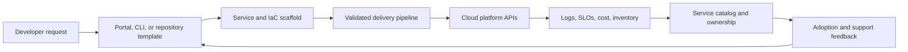

> **文档类型：** 操作指南
> **规范性术语：** **MUST**、**MUST NOT**、**SHOULD**、**SHOULD NOT** 和 **MAY** 是要求级别。
> **适用范围：** 平台产品设计、模板、自助服务、受保护的交付、服务目录、支持和采用度量。
> **例外流程：** 偏离要求需要记录风险评估、补偿控制、指定风险负责人和到期日期。

|控制领域|价值|
|---|---|
|文件编号 | `HTG-29` |
|负责人|云卓越中心 |
|审核周期|至少每年一次以及在重大平台、模板或交付更改之后 |
|证据|版本化模板和契约、流水线结果、安全和策略检查、遥测、所有权日志、采用指标和异常日志记录 |

# 如何构建平台工程黄金路径

> **决策简述：** 将黄金路径视为版本化平台产品，具有受支持的契约、安全默认值、可度量的结果和明确的例外路由。

> **文档类型：** 平台产品实施指南  
> **主要示例：** 具有受保护 CI/CD 的 Terraform 模板  
> **操作原则：** 使安全、可支持的方法成为最简单的路径，同时保留显式的异常路由。

## 目标

为产品团队提供一种受支持的方式来创建、部署、监控和运营服务，而无需学习每个云控制。黄金路径是一种包含用户、结果、版本控制、支持和遥测的产品，而不是复制模板的文件夹。

## 产品流程

## 选择第一条路径

从频繁、有价值的工作负载开始，例如无状态 Web API、计划容器、Kubernetes 服务或基础设施模块。定义支持的语言、运行时、数据模式、环境、合规层、扩展限制、可用性目标和退出标准。避免使用隐藏不兼容需求的通用模板。

## 构建契约

生成的产品应包括：

- 仓库结构、所有权、贡献规则和架构决策记录；
- 版本化的 IaC 模块和环境配置；
- 构建、测试、扫描、签名、发布、升级、回滚和证据工作流程；
- 工作负载身份联合、最低权限角色、机密传递和网络默认值；
- 标准遥测、SLO 启动器、仪表板、告警和运行手册；
- 命名、标记、成本分配、备份、恢复和生命周期元数据；
- 服务目录注册和支持升级。

## 分离提供商中立层和提供商特定层

规范化服务契约（身份、网络公开、数据保护、可观测性、恢复、成本和所有权），然后将其映射到 Azure、AWS、GCP 或 OCI 模块。不要在提供商能力或故障模型不同的地方强制使用相同的产品。在目录中记录偏差。

## 安全地实施自助服务

1. 收集用户研究并度量当前的交付时间、故障率和重复支持工作。
2. 发布带有语义版本控制的最小模板和 API 契约。
3. 使用联合自动化身份和受保护的部署环境。
4. 在配置之前验证输入并显示估计成本和策略影响。
5. 创建后返回仓库、端点、所有者、证据和支持链接。
6. 在代表性消费者上测试升级并提供迁移工具。
7. 通过风险批准和返回支持计划维护异常路径。
8. 弃用带有通知、兼容性数据和可执行结束日期的版本。

## 测量平台

跟踪首次部署、采用、成功升级的时间、部署频率、变更失败率、恢复时间、策略通过率、支持量、满意度、每项服务的成本和异常期限。仅采用就可以奖励强制性但糟糕的经历；将其与结果和情绪指标结合起来。

## 验证

- [ ] 新团队可以仅使用已发布的说明来创建和部署参考服务。
- [ ] 默认通过安全性、策略、弹性、可观测性和成本检查。
- [ ] 生成的仓库保持可升级，而不是成为分离的副本。
- [ ] 故障消息可识别所有者并提供实用的修复措施。
- [ ] 平台可以回滚错误的模板或模块版本。
- [ ] 支持的版本、例外和所有权在目录中可见。
- [ ] 用户反馈更改了路线图并在发布后进行测量。

## 相关主题

- [云平台工程原则](../cloud-foundations-governance/cloud-platform-engineering-principles.md)
- [平台所有权及运营模式](../cloud-foundations-governance/platform-ownership-and-operating-model.md)
- [如何启动新的基础设施仓库](how-to-start-a-new-infrastructure-repository.md)
- [如何使用 Terraform 模块目录](how-to-use-the-terraform-module-catalog.md)

## 相关仓库

- [andyxuan2010/azure-template](https://github.com/andyxuan2010/azure-template) — 提供适合 Azure 黄金路径的可复用 Azure Terraform 模块、测试、示例和流水线。
- [andyxuan2010/aws-template](https://github.com/andyxuan2010/aws-template) — 提供相应的可复用 AWS Terraform 起点。
- [andyxuan2010/oci-template](https://github.com/andyxuan2010/oci-template) — 提供可复用的 OCI 模块模式，用于跨提供商扩展平台契约。
- [andyxuan2010/ci-cd-template](https://github.com/andyxuan2010/ci-cd-template) — 提供可组合铺好的路径的交付工作流程脚手架。