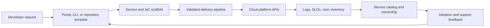

> **Document class:** How-to Guides implementation guide
> **Normative terms:** **MUST**, **MUST NOT**, **SHOULD**, **SHOULD NOT**, and **MAY** are requirements levels.
> **Applicability:** Platform product design, templates, self-service, protected delivery, service catalog, support, and adoption measurement.
> **Exception process:** Deviations require a documented risk assessment, compensating controls, named risk owner, and expiry date.

| Control field | Value |
|---|---|
| Document ID | `HTG-29` |
| Owner | Cloud Center of Excellence |
| Review cycle | At least annually and after material platform, template, or delivery changes |
| Evidence | Versioned template and contract, pipeline results, security and policy checks, telemetry, ownership records, adoption metrics, and exception records |

# How to Build a Platform Engineering Golden Path

> **Decision in brief:** Treat the golden path as a versioned platform product with a supported contract, secure defaults, measurable outcomes, and an explicit exception route.

> **Document type:** Platform product implementation guide  
> **Primary example:** Terraform templates with protected CI/CD  
> **Operating principle:** Make the secure, supportable approach the easiest path while preserving an explicit exception route.

## Objective

Give product teams a supported way to create, deploy, observe, and operate services without learning every cloud control. A golden path is a product with users, outcomes, versioning, support, and telemetry—not a folder of copied templates.

## Product flow

## Choose the first path

Start with a frequent, valuable workload such as a stateless web API, scheduled container, Kubernetes service, or infrastructure module. Define supported languages, runtime, data pattern, environments, compliance tier, scaling limits, availability target, and exit criteria. Avoid a universal template that hides incompatible needs.

## Build the contract

The generated product should include:

- repository structure, ownership, contribution rules, and architecture decision records;
- versioned IaC modules and environment configuration;
- build, test, scan, sign, release, promotion, rollback, and evidence workflows;
- workload federation, least-privilege roles, secret delivery, and network defaults;
- standard telemetry, SLO starter, dashboards, alerts, and runbooks;
- naming, tagging, cost allocation, backup, recovery, and lifecycle metadata;
- service-catalog registration and support escalation.

## Separate provider-neutral and provider-specific layers

Normalize the service contract—identity, network exposure, data protection, observability, recovery, cost, and ownership—then map it to Azure, AWS, GCP, or OCI modules. Do not force identical products where provider capabilities or failure models differ. Record deviations in the catalog.

## Implement self-service safely

1. Gather user research and measure current lead time, failure rate, and repeated support work.
2. Publish a minimal template and API contract with semantic versioning.
3. Use federated automation identities and protected deployment environments.
4. Validate inputs before provisioning and show estimated cost and policy impact.
5. Return repository, endpoint, owner, evidence, and support links after creation.
6. Test upgrades on representative consumers and provide migration tooling.
7. Maintain an exception path with risk approval and a plan to return to support.
8. Deprecate versions with notice, compatibility data, and an enforceable end date.

## Measure the platform

Track time to first deployment, adoption, successful upgrades, deployment frequency, change failure rate, recovery time, policy pass rate, support volume, satisfaction, cost per service, and exception age. Adoption alone can reward mandatory but poor experiences; combine it with outcome and sentiment measures.

## Validation

- [ ] A new team can create and deploy the reference service using only published instructions.
- [ ] Defaults pass security, policy, resilience, observability, and cost checks.
- [ ] Generated repositories remain upgradeable rather than becoming detached copies.
- [ ] Failure messages identify the owner and a practical remediation.
- [ ] The platform can roll back a bad template or module release.
- [ ] Supported versions, exceptions, and ownership are visible in the catalog.
- [ ] User feedback changes the roadmap and is measured after release.

## Related topics

- [Cloud Platform Engineering Principles](../cloud-foundations-governance/cloud-platform-engineering-principles.md)
- [Platform Ownership and Operating Model](../cloud-foundations-governance/platform-ownership-and-operating-model.md)
- [How to Start a New Infrastructure Repository](how-to-start-a-new-infrastructure-repository.md)
- [How to Use the Terraform Module Catalog](how-to-use-the-terraform-module-catalog.md)

## Related repos

- [andyxuan2010/azure-template](https://github.com/andyxuan2010/azure-template) — provides reusable Azure Terraform modules, tests, examples, and pipelines suitable for an Azure golden path.
- [andyxuan2010/aws-template](https://github.com/andyxuan2010/aws-template) — provides the corresponding reusable AWS Terraform starting point.
- [andyxuan2010/oci-template](https://github.com/andyxuan2010/oci-template) — supplies reusable OCI module patterns for extending the platform contract across providers.
- [andyxuan2010/ci-cd-template](https://github.com/andyxuan2010/ci-cd-template) — offers delivery-workflow scaffolding that can be composed into the paved path.
