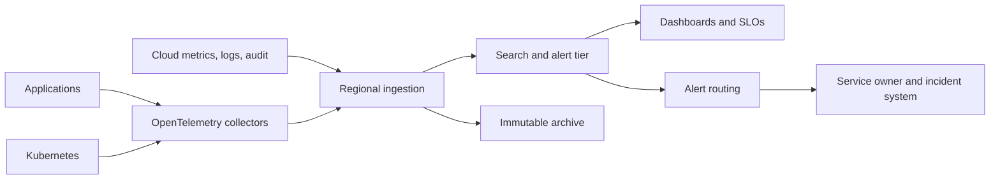

> **文档类型：** 操作指南
> **规范性术语：** **MUST**、**MUST NOT**、**SHOULD**、**SHOULD NOT** 和 **MAY** 是要求级别。
> **适用范围：** 跨云和 Kubernetes 遥测收集、标准化、路由、仪表板、告警、SLO、保留和证据。
> **例外流程：** 偏离要求需要记录风险评估、补偿控制、指定风险负责人和到期日期。

|控制领域|价值|
|---|---|
|文件编号 | `HTG-23` |
|负责人|云卓越中心 |
|审核周期|至少每年一次以及在重大遥测、保留或提供商变更之后 |
|证据|收集器配置、架构映射、示例跟踪和指标、告警测试、仪表板所有权、保留设置和事件证据 |

# 如何构建集中式多云可观测性

> **简要决定：** 在收集时规范遥测，同时保留提供商原生详细信息，并将每个告警通过经过测试的响应发送给负责任的服务所有者。

> **文档类型：** 平台实施指南  
> **主要示例：** Azure Monitor 和 OpenTelemetry  
> **操作原则：** 标准化收集时的遥测，保留提供商本地证据，并将告警发送给负责任的服务所有者。

## 目标

创建一个可观测平台，回答服务是否健康、为何失败、谁更改了服务、客户体验如何以及证据是否完整。集中化是一种逻辑操作模型，不一定是一个物理数据存储。

## 参考架构

## 定义遥测契约

需要 `service.name`、环境、云、区域、账户/订阅/项目、所有者、部署版本、关联标识符、严重性、事件时间和数据分类。使用 UTC 和同步时钟。请勿将无限制的值（例如原始用户 ID）附加到指标标签。

按遥测类别定义保留和访问：操作日志、安全审计、网络流量、应用跟踪、平台指标和合规性证据可能有不同的法律和成本要求。

## 实现集合

1. 盘点关键用户旅程、资源、审计来源和当前告警路由。
2. 在可行的情况下，采用 OpenTelemetry 来获取应用指标、日志和跟踪。
3. 从每个账户边界导出云控制平面、身份、网络、数据平面和策略日志。
4. 按区域放置收集器、缓冲瞬时故障、加密传输并对导出器进行身份验证。
5. 在集中存储之前对机密和受监管的字段进行脱敏。
6. 将安全性和合规性证据存储在与搜索层分开的写保护存档中。
7. 以代码形式发布标准仪表板、日志记录规则、告警模板和所有权元数据。
8. 监控系统本身：摄取间隙、丢弃的跨度、队列深度、配额、滞后和成本。

## 提供商映射

|面积 |Azure|AWS | GCP |OCI |
|---|---|---|---|---|
|原生遥测 | Azure Monitor/Log Analytics |CloudWatch|Cloud Monitoring 和 Cloud Logging|OCI Monitoring and Logging|
|审计|活动和 Entra 日志 |CloudTrail| Cloud Audit Logs|审计|
|追踪 |Application Insights/OTEL | X-Ray/OTEL |Cloud Trace/OTEL | APM / OTEL |
|路由|诊断设置/Event Hubs |订阅 / Firehose |Log Sink/ Pub/Sub |连接器/流|

## 提醒设计

仅针对紧急且会影响客户或控制面的事项发出寻呼。将较低紧急程度路由至工单或仪表板。每个告警都需要所有者、条件、评估窗口、重复数据删除密钥、严重性、操作手册、依赖关系上下文、维护行为和测试方法。与原始资源阈值相比，更喜欢与 SLO 相关的症状告警。

## 安全和成本控制

使用不同的作者、读者、管理员和证据保管人角色。限制跨租户摄取和仪表板共享。将采样应用于大量跟踪，而不是审核事件。设置每日数量和保留预算，检测基数爆炸，并仅在定义的用例需要时保留原始数据。

## 验证

- [ ] 测试请求可从边缘通过应用层和依赖层进行追踪。
- [ ] 云审计、身份、网络、Kubernetes 和应用遥测在所需的延迟内到达。
- [ ] 机密和个人数据测试值已被脱敏。
- [ ] 收集器、区域、目的地和网络故障不会默默地丢弃所需的证据。
- [ ] 每个生产告警都会解析为当前所有者和经过测试的运行手册。
- [ ] 摄取量、保留率、查询性能和成本保持在预算范围内。

## 相关主题

- [可观测性、日志记录和告警](../operations-reliability-finops/observability-logging-and-alerting.md)
- [日志、监控和可观测性标准](../standards-best-practices/logging-monitoring-and-observability-standard.md)
- [基础设施和应用健康状况监控](../operations-reliability-finops/infrastructure-and-application-health-monitoring.md)

## 相关仓库

- [andyxuan2010/azure-landingzone](https://github.com/andyxuan2010/azure-landingzone) — 包含用于集中式平台遥测的 Azure Monitor 和 Log Analytics 基础。
- [andyxuan2010/medp-wl-notification](https://github.com/andyxuan2010/medp-wl-notification) — 提供可与受控告警路由模式集成的预定通知自动化。
