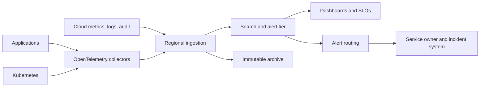

> **Document class:** How-to Guides implementation guide
> **Normative terms:** **MUST**, **MUST NOT**, **SHOULD**, **SHOULD NOT**, and **MAY** are requirements levels.
> **Applicability:** Cross-cloud and Kubernetes telemetry collection, normalization, routing, dashboards, alerts, SLOs, retention, and evidence.
> **Exception process:** Deviations require a documented risk assessment, compensating controls, named risk owner, and expiry date.

| Control field | Value |
|---|---|
| Document ID | `HTG-23` |
| Owner | Cloud Center of Excellence |
| Review cycle | At least annually and after material telemetry, retention, or provider changes |
| Evidence | Collector configuration, schema mapping, sample traces and metrics, alert tests, dashboard ownership, retention settings, and incident evidence |

# How to Build Centralized Multi-Cloud Observability

> **Decision in brief:** Normalize telemetry at collection while retaining provider-native detail, and route every alert to an accountable service owner with a tested response.

> **Document type:** Platform implementation guide  
> **Primary example:** Azure Monitor and OpenTelemetry  
> **Operating principle:** Normalize telemetry at collection, preserve provider-native evidence, and route alerts to an accountable service owner.

## Objective

Create an observability platform that answers whether a service is healthy, why it is failing, who changed it, what customers experience, and whether evidence is complete. Centralization is a logical operating model, not necessarily one physical datastore.

## Reference architecture

## Define the telemetry contract

Require `service.name`, environment, cloud, region, account/subscription/project, owner, deployment version, correlation identifier, severity, event time, and data classification. Use UTC and synchronized clocks. Do not attach unbounded values such as raw user IDs to metric labels.

Define retention and access by telemetry class: operational logs, security audit, network flow, application traces, platform metrics, and compliance evidence may have different legal and cost requirements.

## Implement collection

1. Inventory critical user journeys, resources, audit sources, and current alert routes.
2. Adopt OpenTelemetry for application metrics, logs, and traces where practical.
3. Export cloud control-plane, identity, network, data-plane, and policy logs from every account boundary.
4. Place collectors regionally, buffer transient failures, encrypt transport, and authenticate exporters.
5. Redact secrets and regulated fields before centralized storage.
6. Store security and compliance evidence in a write-protected archive separate from the search tier.
7. Publish standard dashboards, recording rules, alert templates, and ownership metadata as code.
8. Monitor the monitoring system: ingestion gaps, dropped spans, queue depth, quota, lag, and cost.

## Provider mapping

| Area | Azure | AWS | GCP | OCI |
|---|---|---|---|---|
| Native telemetry | Azure Monitor / Log Analytics | CloudWatch | Cloud Monitoring and Logging | Monitoring and Logging |
| Audit | Activity and Entra logs | CloudTrail | Cloud Audit Logs | Audit |
| Tracing | Application Insights / OTEL | X-Ray / OTEL | Cloud Trace / OTEL | APM / OTEL |
| Routing | Diagnostic settings / Event Hubs | subscriptions / Firehose | log sinks / Pub/Sub | service connectors / streaming |

## Alert design

Page only for urgent, actionable customer or control impact. Route lower urgency to tickets or dashboards. Every alert needs an owner, condition, evaluation window, deduplication key, severity, runbook, dependency context, maintenance behavior, and test method. Prefer symptom alerts tied to SLOs over raw resource thresholds.

## Security and cost controls

Use separate writer, reader, administrator, and evidence-custodian roles. Restrict cross-tenant ingestion and dashboard sharing. Apply sampling to high-volume traces, not audit events. Set daily volume and retention budgets, detect cardinality explosions, and retain raw data only as long as a defined use case requires.

## Validation

- [ ] A test request is traceable from edge through application and dependency layers.
- [ ] Cloud audit, identity, network, Kubernetes, and application telemetry arrive within the required latency.
- [ ] Secret and personal-data test values are redacted.
- [ ] Collector, region, destination, and network failures do not silently discard required evidence.
- [ ] Every production alert resolves to a current owner and tested runbook.
- [ ] Ingestion volume, retention, query performance, and cost remain within budget.

## Related topics

- [Observability, Logging, and Alerting](../operations-reliability-finops/observability-logging-and-alerting.md)
- [Logging, Monitoring, and Observability Standard](../standards-best-practices/logging-monitoring-and-observability-standard.md)
- [Infrastructure and Application Health Monitoring](../operations-reliability-finops/infrastructure-and-application-health-monitoring.md)

## Related repos

- [andyxuan2010/azure-landingzone](https://github.com/andyxuan2010/azure-landingzone) — contains Azure Monitor and Log Analytics foundations for centralized platform telemetry.
- [andyxuan2010/medp-wl-notification](https://github.com/andyxuan2010/medp-wl-notification) — provides scheduled notification automation that can integrate with governed alert-routing patterns.
