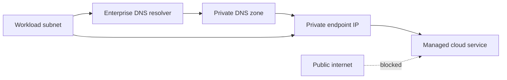
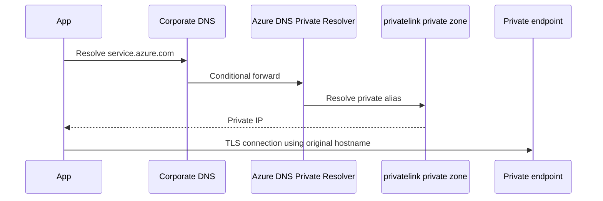
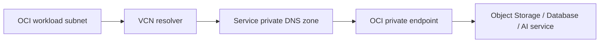
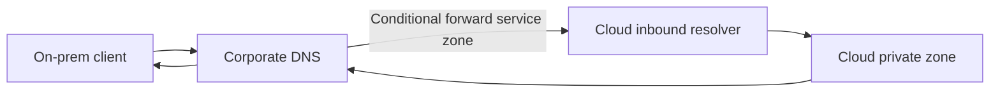

> **文档类型：** 操作指南
> **规范性术语：** **MUST**、**MUST NOT**、**SHOULD**、**SHOULD NOT** 和 **MAY** 是要求级别。
> **适用范围：** 跨 Azure、AWS、GCP、OCI、数据中心和混合网络的私有服务连接和确定性名称解析。
> **例外流程：** 偏离要求需要记录风险评估、补偿控制、指定风险负责人和到期日期。

|控制领域|价值|
|---|---|
|文件编号 | `HTG-06` |
|负责人|云卓越中心 |
|审核周期|至少每年一次，并且在重大网络、DNS 或提供商发生变化之后 |
|证据| DNS 和端点设计、区域所有权、路由和 ACL 测试、私有解析结果、流日志和恢复证据 |

# 如何构建私有端点和私有 DNS

> **简要决定：** 明确私有连接和 DNS 所有权，验证每个解析路径，并在加载工作负载之前防止转发循环。

> **文件类型：** 实施指南
> **主要示例：** Azure 和 Terraform
> **云范围：** Azure、AWS、GCP 和 Oracle Cloud Infrastructure (OCI)
> **操作原则：** 使用短期身份、不可变制品、最小权限、策略即代码和自动验证。


## 目标

通过私有 IP 地址公开托管服务，并使其标准服务名称从授权网络正确解析。在不完成 DNS 的情况下创建端点是不完整的实施。

## 概念架构

私有连接有四个独立的控制平面：

1. 端点创建和批准。
2. DNS 记录创建和区域关联。
3.路由和防火墙策略。
4. 服务级公共访问和授权。

成功的 DNS 查找并不能证明授权。成功的 TCP 连接并不能证明 TLS 主机名的有效性。

## 云映射

|概念|Azure|AWS | GCP |OCI |
|---|---|---|---|---|
|私有服务端点|私有端点/私有链接|接口 VPC 端点/AWS PrivateLink |私有服务连接端点|特定于服务的私有端点|
|私有 DNS | Azure Private DNS zone |Route 53 private hosted zone and private DNS on endpoints |Cloud DNS 私有区域 | VCN private DNS zones/resolver |
|网络单位| VNet/子网 | VPC/子网 | VPC/子网 | VCN/子网 |
|中央解析器| Azure DNS Private Resolver | Route 53 Resolver |Cloud DNS forwarding/inbound policies | VCN DNS resolver endpoints |
|端点策略|服务和 RBAC 控制 |端点策略加 IAM | PSC/服务控制加 IAM |服务策略加 OCI IAM |

## 设计决策

部署之前，定义：

- 消费者网络和地区。
- 集中或分布式端点所有权。
- DNS 区域所有者。
- 本地解决路径。
- 公共网络访问策略。
- 端点批准工作流程。
- 跨账户/订阅/项目/隔间模型。
- 出口检查要求。
- 所需的服务子资源。
- DNS 解析器的高可用性。

集中所有端点可以简化治理，但会产生路由、DNS、成本和爆炸半径依赖性。仅当服务流量可以穿越中心架构而不违反提供商限制或应用延迟要求时，才使用集中化。

## Azure 实现示例
```hcl
resource "azurerm_private_endpoint" "storage_blob" {
  name                = "pe-${var.storage_account_name}-blob"
  location            = var.location
  resource_group_name = var.resource_group_name
  subnet_id           = var.private_endpoint_subnet_id

  private_service_connection {
    name                           = "psc-blob"
    private_connection_resource_id = var.storage_account_id
    subresource_names              = ["blob"]
    is_manual_connection           = false
  }

  private_dns_zone_group {
    name                 = "default"
    private_dns_zone_ids = [var.blob_private_dns_zone_id]
  }
}
```
对于存储，每个所需的子资源都可能需要自己的端点和私有 DNS 区域。不要假设 Blob 端点还涵盖文件、队列、表、Data Lake DFS 或 Web。

Azure DNS 流程：

在应用配置中使用原始服务主机名。 DNS 应通过提供商的私有别名链来映射它。通过 IP Direct Connect 通常会破坏 TLS 主机名验证。

## AWS 实施模式
```hcl
resource "aws_vpc_endpoint" "ecr_api" {
  vpc_id              = var.vpc_id
  service_name        = "com.amazonaws.${var.region}.ecr.api"
  vpc_endpoint_type   = "Interface"
  subnet_ids          = var.endpoint_subnet_ids
  security_group_ids  = [aws_security_group.endpoint.id]
  private_dns_enabled = true
}
```
当使用 `private_dns_enabled` 时，普通公共服务主机名解析为关联 VPC 内的终端节点私有 IP。跨 VPC 和本地用例需要 Route 53 Resolver 和经过深思熟虑的私有托管区域设计。

端点安全组必须允许来自消费者 CIDR 或安全组的入站流量。 IAM 和终端节点策略仍然确定 API 请求是否获取授权。

## GCP 实现模式

Private Service Connect 将内部 IP 分配给转发到 Google API、托管服务或已发布服务附件的端点。
```hcl
resource "google_compute_address" "psc" {
  name         = "psc-service-ip"
  subnetwork   = var.subnetwork
  address_type = "INTERNAL"
  region       = var.region
}

resource "google_compute_forwarding_rule" "psc" {
  name                  = "psc-service-endpoint"
  region                = var.region
  network               = var.network
  subnetwork            = var.subnetwork
  load_balancing_scheme = ""
  target                = var.service_attachment
  ip_address            = google_compute_address.psc.id
}
```
创建 Cloud DNS 私有区域并记录，将预期服务名称映射到 PSC 地址。对于 Google API，请使用特定的 PSC 指南，因为端点和 DNS 行为与生产者服务附件不同。

## OCI 实现模式

OCI 私有端点是特定于服务的。它们在 VCN 子网中创建，通常创建或依赖于私有 DNS 区域。验证服务支持的端点类型、DNS 前缀、NSG 行为和访问目标。

除非服务文档明确允许，否则请勿修改提供商管理的私有 DNS 记录。

## 混合 DNS

对于本地客户端：

仅转发所需的服务区域。避免将所有 DNS 转发到一处云，这会产生不必要的依赖性和不明确的解析。

对于多云：

- 保持权威所有权清晰。
- 避免私有区域与不同答案重叠。
- 使用记录在案的条件转发规则。
- 定义水平分割行为。
- 监控解析器延迟、故障率和查询量。
- 测试每个网段的 DNS 解析，而不仅仅是端点 VNet/VPC/VCN。

## 验证程序

域名系统：
```bash
dig +short <service-fqdn>
nslookup <service-fqdn>
```
结果必须是预期的私有 IP 或提供商私有别名链。

TCP 和 TLS：
```bash
nc -vz <service-fqdn> 443
openssl s_client \
  -connect <service-fqdn>:443 \
  -servername <service-fqdn> \
  -verify_return_error
```
HTTP：
```bash
curl -sv https://<service-fqdn>/ -o /dev/null
```
预期的 `401`、`403` 或特定于服务的响应可以证明 DNS、路由、TCP 和 TLS 正在工作。超时、证书不匹配或公共 IP 不会。

云端检查：

- 端点连接已获取批准。
- 网络接口具有预期的 IP。
- DNS 区域包含正确的日志记录。
- 区域与每个消费者网络链接或关联。
- 仅在私有验证后才禁用公共网络访问。
- 防火墙、NSG、安全组或 NSG 等效项允许流量。
- 服务 IAM 允许调用者。

## 常见故障

|症状|根本原因|更正|
|---|---|---|
|公网 IP 返回 |私有区域未关联或公司 DNS 绕过它 |链接/关联区域并修复条件转发 |
| NX 域 |私有区域名称错误或记录缺失 |使用提供商记录在案的区域和子资源 |
|连接超时 |路由、防火墙、安全组或端点批准 |跟踪数据包路径和端点状态 |
|证书名称不匹配 |应用错误地使用私有 IP 或自定义别名 |使用原始服务 FQDN 和有效的 DNS 链 |
|在云中工作，而不是在本地工作 |没有入站解析器或条件转发 |实施混合 DNS 路径 |
|App Service 部署私下失败 | SCM/Kudu 名称缺失 |添加 SCM 私有 DNS 记录或区域组 |
|端点解析但请求被拒绝 | IAM 或服务防火墙策略 |修复授权；网络已经正常工作 |

## 回滚

1. 仅通过批准的变更和限制性许可名单暂时重新启用公共访问。
2. 保留端点、DNS、流和解析器日志。
3. 在删除端点之前删除不正确的 DNS 记录，以避免陈旧的私有答案。
4. 小心回滚条件转发。
5. 更改后验证私有和公共 DNS 解析。
6. 记录区域和端点的最终所有权。

## 验证

当端点获取批准时，私有连接就完成了，正常服务 FQDN 从所有授权网络私下解析，路由和防火墙传递流量，TLS 验证，公共访问被禁用或限制，IAM 是最小特权，混合 DNS 是冗余的，并且监控检测到解析或端点故障。

## 相关主题

- [如何设计混合和多云 DNS](how-to-design-hybrid-and-multicloud-dns.md)
- [如何构建企业 RAG 应用](how-to-build-an-enterprise-rag-application.md)
- [如何将应用部署到 Azure App Service](how-to-deploy-an-application-to-azure-app-service.md)

## 官方参考文档

- Azure 私有端点概述：https://learn.microsoft.com/en-us/azure/private-link/private-endpoint-overview
- Azure 私有端点 DNS：https://learn.microsoft.com/en-us/azure/private-link/private-endpoint-dns
- AWS PrivateLink 服务：https://docs.aws.amazon.com/vpc/latest/privatelink/aws-services-privatelink-support.html
- Route 53 私有托管区域：https://docs.aws.amazon.com/Route53/latest/DeveloperGuide/hosted-zones-private.html
- Google 私有服务连接：https://cloud.google.com/vpc/docs/private-service-connect
- OCI Object Storage 私有端点：https://docs.oracle.com/en-us/iaas/Content/Object/Tasks/private-endpoints.htm
## 相关仓库

- [andyxuan2010/azure-landingzone](https://github.com/andyxuan2010/azure-landingzone) — 受管理的 Azure 基础，包含中心辐射网络、私有 DNS、共享服务和私有访问模式。
- [andyxuan2010/azure-template](https://github.com/andyxuan2010/azure-template) — 可复用的 Terraform 模块和验证示例，用于一致地实施 Azure 网络和私有服务边界。
- [andyxuan2010/oci-template](https://github.com/andyxuan2010/oci-template) — OCI 模块库，涵盖 VCN、网关、安全控制、DNS、负载均衡和其他提供商原生等效项。
