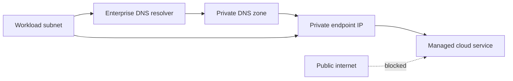
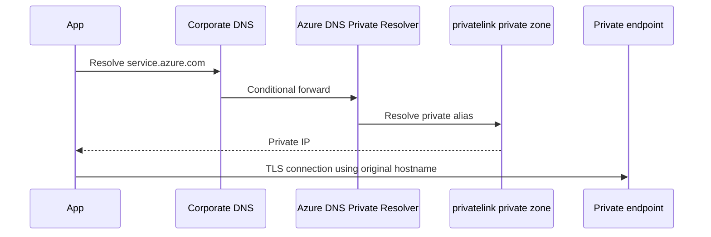
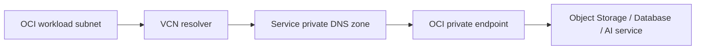
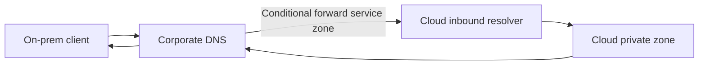

> **Document class:** How-to Guides implementation guide
> **Normative terms:** **MUST**, **MUST NOT**, **SHOULD**, **SHOULD NOT**, and **MAY** are requirements levels.
> **Applicability:** Private service connectivity and deterministic name resolution across Azure, AWS, GCP, OCI, datacenters, and hybrid networks.
> **Exception process:** Deviations require a documented risk assessment, compensating controls, named risk owner, and expiry date.

| Control field | Value |
|---|---|
| Document ID | `HTG-06` |
| Owner | Cloud Center of Excellence |
| Review cycle | At least annually and after material network, DNS, or provider changes |
| Evidence | DNS and endpoint design, zone ownership, route and ACL tests, private resolution results, flow logs, and recovery evidence |

# How to Build Private Endpoints and Private DNS

> **Decision in brief:** Make private connectivity and DNS ownership explicit, validate each resolution path, and prevent forwarding loops before onboarding workloads.

> **Document type:** Implementation guide
> **Primary examples:** Azure and Terraform
> **Cloud scope:** Azure, AWS, GCP, and Oracle Cloud Infrastructure (OCI)
> **Operating principle:** Use short-lived identity, immutable artifacts, least privilege, policy-as-code, and automated validation.


## Objective

Expose managed services through private IP addresses and make their standard service names resolve correctly from authorized networks. Creating an endpoint without completing DNS is an incomplete implementation.

## Conceptual architecture



Private connectivity has four independent control planes:

1. Endpoint creation and approval.
2. DNS record creation and zone association.
3. Routing and firewall policy.
4. Service-level public access and authorization.

A successful DNS lookup does not prove authorization. A successful TCP connection does not prove TLS hostname validity.

## Cloud mapping

| Concept | Azure | AWS | GCP | OCI |
|---|---|---|---|---|
| Private service endpoint | Private Endpoint / Private Link | Interface VPC Endpoint / AWS PrivateLink | Private Service Connect endpoint | Service-specific Private Endpoint |
| Private DNS | Azure Private DNS zone | Route 53 private hosted zone and private DNS on endpoint | Cloud DNS private zone | VCN private DNS zones/resolver |
| Network unit | VNet/subnet | VPC/subnet | VPC/subnet | VCN/subnet |
| Central resolver | Azure DNS Private Resolver | Route 53 Resolver | Cloud DNS forwarding/inbound policies | VCN DNS resolver endpoints |
| Endpoint policy | Service and RBAC controls | Endpoint policy plus IAM | PSC/service controls plus IAM | Service policy plus OCI IAM |

## Design decisions

Before deployment, define:

- Consumer networks and regions.
- Centralized or distributed endpoint ownership.
- DNS zone owner.
- On-premises resolution path.
- Public network access policy.
- Endpoint approval workflow.
- Cross-account/subscription/project/compartment model.
- Egress inspection requirements.
- Required service subresources.
- High availability for DNS resolvers.

Centralizing all endpoints can simplify governance but creates routing, DNS, cost, and blast-radius dependencies. Use centralization only when service traffic can traverse the hub architecture without violating provider constraints or application latency requirements.

## Azure implementation example

```hcl
resource "azurerm_private_endpoint" "storage_blob" {
  name                = "pe-${var.storage_account_name}-blob"
  location            = var.location
  resource_group_name = var.resource_group_name
  subnet_id           = var.private_endpoint_subnet_id

  private_service_connection {
    name                           = "psc-blob"
    private_connection_resource_id = var.storage_account_id
    subresource_names              = ["blob"]
    is_manual_connection           = false
  }

  private_dns_zone_group {
    name                 = "default"
    private_dns_zone_ids = [var.blob_private_dns_zone_id]
  }
}
```

For Storage, each required subresource can need its own endpoint and private DNS zone. Do not assume a Blob endpoint also covers File, Queue, Table, Data Lake DFS, or Web.

Azure DNS flow:



Use the original service hostname in application configuration. DNS should map it through the provider's private alias chain. Connecting directly by IP usually breaks TLS hostname validation.

## AWS implementation pattern

```hcl
resource "aws_vpc_endpoint" "ecr_api" {
  vpc_id              = var.vpc_id
  service_name        = "com.amazonaws.${var.region}.ecr.api"
  vpc_endpoint_type   = "Interface"
  subnet_ids          = var.endpoint_subnet_ids
  security_group_ids  = [aws_security_group.endpoint.id]
  private_dns_enabled = true
}
```

When `private_dns_enabled` is used, the normal public service hostname resolves to endpoint private IPs inside associated VPCs. Cross-VPC and on-premises use cases require Route 53 Resolver and deliberate private hosted-zone design.

Endpoint security groups must allow inbound traffic from consumer CIDRs or security groups. IAM and endpoint policy still determine whether an API request is authorized.

## GCP implementation pattern

Private Service Connect assigns an internal IP to an endpoint that forwards to Google APIs, a managed service, or a published service attachment.

```hcl
resource "google_compute_address" "psc" {
  name         = "psc-service-ip"
  subnetwork   = var.subnetwork
  address_type = "INTERNAL"
  region       = var.region
}

resource "google_compute_forwarding_rule" "psc" {
  name                  = "psc-service-endpoint"
  region                = var.region
  network               = var.network
  subnetwork            = var.subnetwork
  load_balancing_scheme = ""
  target                = var.service_attachment
  ip_address            = google_compute_address.psc.id
}
```

Create a Cloud DNS private zone and record that maps the intended service name to the PSC address. For Google APIs, use the specific PSC guidance because endpoint and DNS behavior differs from producer service attachments.

## OCI implementation pattern

OCI private endpoints are service-specific. They are created in a VCN subnet and often create or depend on private DNS zones. Verify the service's supported endpoint type, DNS prefix, NSG behavior, and access targets.



Do not modify provider-managed private DNS records unless the service documentation explicitly permits it.

## Hybrid DNS

For on-premises clients:



Forward only the required service zones. Avoid forwarding all DNS to one cloud, which creates unnecessary dependency and ambiguous resolution.

For multi-cloud:

- Keep authoritative ownership clear.
- Avoid overlapping private zones with different answers.
- Use documented conditional-forwarding rules.
- Define split-horizon behavior.
- Monitor resolver latency, failure rate, and query volume.
- Test resolution from every network segment, not only from the endpoint VNet/VPC/VCN.

## Validation procedure

DNS:

```bash
dig +short <service-fqdn>
nslookup <service-fqdn>
```

The result must be the expected private IP or provider-private alias chain.

TCP and TLS:

```bash
nc -vz <service-fqdn> 443
openssl s_client \
  -connect <service-fqdn>:443 \
  -servername <service-fqdn> \
  -verify_return_error
```

HTTP:

```bash
curl -sv https://<service-fqdn>/ -o /dev/null
```

An expected `401`, `403`, or service-specific response can prove DNS, route, TCP, and TLS are working. A timeout, certificate mismatch, or public IP does not.

Cloud-side checks:

- Endpoint connection is approved.
- Network interface has the expected IP.
- DNS zone contains the correct record.
- Zone is linked or associated with every consumer network.
- Public network access is disabled only after private validation.
- Firewall, NSG, security group, or NSG-equivalent allows traffic.
- Service IAM permits the caller.

## Common failures

| Symptom | Root cause | Correction |
|---|---|---|
| Public IP returned | Private zone not associated or corporate DNS bypasses it | Link/associate zone and fix conditional forwarding |
| NXDOMAIN | Wrong private zone name or missing record | Use provider-documented zone and subresource |
| Connection timeout | Route, firewall, security group, or endpoint approval | Trace packet path and endpoint state |
| Certificate name mismatch | Application uses private IP or custom alias incorrectly | Use original service FQDN and valid DNS chain |
| Works in cloud, not on-prem | No inbound resolver or conditional forward | Implement hybrid DNS path |
| App Service deploy fails privately | SCM/Kudu name missing | Add the SCM private DNS record or zone group |
| Endpoint resolves but request is denied | IAM or service firewall policy | Fix authorization; network is already working |

## Rollback

1. Re-enable public access temporarily only through an approved change and restrictive allowlist.
2. Preserve endpoint, DNS, flow, and resolver logs.
3. Remove incorrect DNS records before deleting endpoints to avoid stale private answers.
4. Roll back conditional forwarding carefully.
5. Validate both private and public resolution after change.
6. Document the final ownership of zones and endpoints.

## Validation

Private connectivity is complete when the endpoint is approved, the normal service FQDN resolves privately from all authorized networks, routing and firewalls pass traffic, TLS validates, public access is disabled or restricted, IAM is least privilege, hybrid DNS is redundant, and monitoring detects resolution or endpoint failures.

## Related topics

- [How to Design Hybrid and Multi-Cloud DNS](how-to-design-hybrid-and-multicloud-dns.md)
- [How to Build an Enterprise RAG Application](how-to-build-an-enterprise-rag-application.md)
- [How to Deploy an Application to Azure App Service](how-to-deploy-an-application-to-azure-app-service.md)

## Official references

- Azure Private Endpoint overview: https://learn.microsoft.com/en-us/azure/private-link/private-endpoint-overview
- Azure private endpoint DNS: https://learn.microsoft.com/en-us/azure/private-link/private-endpoint-dns
- AWS PrivateLink services: https://docs.aws.amazon.com/vpc/latest/privatelink/aws-services-privatelink-support.html
- Route 53 private hosted zones: https://docs.aws.amazon.com/Route53/latest/DeveloperGuide/hosted-zones-private.html
- Google Private Service Connect: https://cloud.google.com/vpc/docs/private-service-connect
- OCI Object Storage private endpoints: https://docs.oracle.com/en-us/iaas/Content/Object/Tasks/private-endpoints.htm

## Related repos

- [andyxuan2010/azure-landingzone](https://github.com/andyxuan2010/azure-landingzone) — governed Azure foundation containing hub-spoke networking, private DNS, shared services, and private-access patterns.
- [andyxuan2010/azure-template](https://github.com/andyxuan2010/azure-template) — reusable Terraform modules and validation examples for consistently implementing Azure network and private-service boundaries.
- [andyxuan2010/oci-template](https://github.com/andyxuan2010/oci-template) — OCI module library covering VCNs, gateways, security controls, DNS, load balancing, and other provider-native equivalents.
