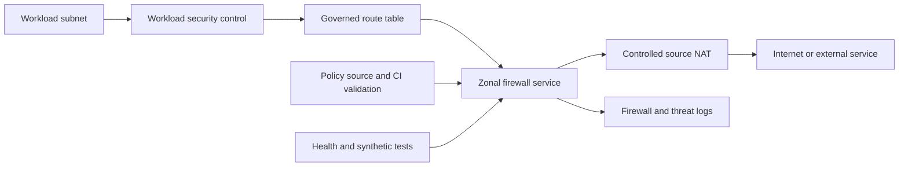

> **文档类型：** 操作指南
> **规范性术语：** **MUST**、**MUST NOT**、**SHOULD**、**SHOULD NOT** 和 **MAY** 是要求级别。
> **适用范围：** 跨四个云的集中式和分布式防火墙、出口、路由、检查、日志记录和异常控制。
> **例外流程：** 偏离要求需要记录风险评估、补偿控制、指定风险负责人和到期日期。

|控制领域|价值|
|---|---|
|文件编号 | `HTG-17` |
|负责人|云卓越中心 |
|审核周期|至少每年一次，并且在重大网络、防火墙或威胁模型更改之后 |
|证据|规则和路由审查、策略测试、流日志、拒绝流量测试、变更批准、异常日志记录和回滚证据 |

# 如何配置云防火墙、出口控制和路由检查

> **简要决定：** 在最窄的实际边界内强制执行最小特权，记录允许和拒绝的流量，并使每个异常都有时间限制。

> **文件类型：** 实施指南
> **主要示例：** 集中式中心中的 Azure Firewall
> **云范围：** Azure、AWS、GCP 和 Oracle Cloud Infrastructure (OCI)
> **操作原则：**默认拒绝，允许日志记录流，保留对称路径，并使每个决策可监控。

## 目标

为南北和东西流量创建可执行的网络控制。实施通过弹性检查路由所需的流量，限制互联网出口，防止绕过，记录决策，并支持安全的紧急更改和回滚。

安全组和子网规则在工作负载附近仍然有用；中央防火墙并不能取代分布式分段。

## 构建流量策略

为每个规则创建批准的流日志记录：

|领域|示例|
|---|---|
|来源 | `orders-prod-app` 安全组或 `10.40.16.0/24` |
|目的地 | `payments-api.example.internal` |
|协议和端口 | TCP 443 | TCP 443
|方向 |出口 |
|目的和所有者|订单提交，商务团队 |
|检验| TLS 元数据和威胁情报 |
|环境 |生产|
|到期/审核 | 2027-02-01 |

优先选择身份、服务标签、私有端点和受控域名，而不是提供商语义可靠的广泛地址范围。永远不要批准 `any/any` 作为永久规则。

## 检查架构

对于入站应用，请在工作负载之前放置 DDoS 保护和经批准的 WAF 或 Application Gateway。不要直接发布管理端口。

## 选择执行点

- 应用工作负载安全组或网络安全组以获取本地最小权限。
- 使用中央防火墙来实现共享出口策略、威胁控制、跨区域检查和混合边界。
- 在需要时使用 Kubernetes 网络策略或服务网格进行 pod 级东西向控制。
- 使用提供商私有服务连接来保持受支持的托管服务流远离公共路径。
- 当防火墙无法安全地跟踪不断变化的服务地址时，使用 DNS 和安全 Web 代理进行域感知出口。

避免重复、矛盾的所有权。记录哪个控制对每个流类具有权威性。

## 配置路由和高可用

1. 跨服务目标所需的区域或故障域部署防火墙。
2. 将受保护子网路由表与正确的下一跳关联。
3. 通过相同的状态检查层路由两个方向。
4. 精心配置 NAT 并调整端口大小以实现峰值并发连接。
5. 防止工作负载创建公共 IP、备用网关、对等互连或旁路路由。
6. 根据需要分离生产、非生产和受管制的路由域。
7. 在加入生产流程之前测试故障转移。

在未计算其对混合、平台服务、元数据、DNS 和返回路径的影响之前，切勿禁用路由传播或插入默认路由。

## 配置出口策略

从拒绝开始，按业务能力添加目的地：

- 批准的软件包和操作系统镜像；
- 源、制品、身份、时间、DNS、遥测和云管理端点；
- 明确批准的合作伙伴 API 和 SaaS 目的地；
- 事件响应更新渠道。

即使目的地已列入允许名单，也可以锁定软件包并验证签名。域白名单不验证内容。阻止直接 DNS 访问未经批准的解析器并监控新发现的目的地。

TLS 检查需要记录隐私、证书、兼容性和旁路策略。未经明确设计批准，请勿拦截证书固定、受监管或相互验证的流量。

## 标准化多云实施

|能力|Azure|AWS | GCP |OCI |
|---|---|---|---|---|
|托管防火墙| Azure Firewall | AWS Network Firewall |下一代云防火墙或批准的设备 | OCI Network Firewall|
|分布式控制| NSG 和 ASG |安全组和网络 ACL | VPC 防火墙策略和标签 | NSG 和安全列表 |
|路由|路由表和 Virtual WAN |路由表和 Transit Gateway |路由、策略路由、NCC |路由表和 DRG |
|流量遥测|防火墙、NSG 和网络日志 |网络防火墙和 VPC 流日志 |防火墙规则日志记录和 VPC 流日志 |网络防火墙和 VCN 流日志 |
|边缘 WAF |Front Door 或 Application Gateway WAF | AWS WAF 与 CloudFront 或 ALB |Cloud Armor| OCI WAF |
在实施过程中确认目标区域中当前功能的可用性、扩展限制、路由行为和日志语义。

## 管理策略即代码

将规则意图存储在经过审查的仓库中。验证架构、重复和影子规则、禁止的端口、广泛的源和目标、缺少所有权、过期的规则、无效的 FQDN 和路由冲突。生成特定于提供商的策略，而不隐藏有意义的提供商行为。

使用分阶段部署：验证语法、在支持的情况下部署非活动或审核策略、测试金丝雀子网、检查日志，然后扩展。需要对默认路由、生产拒绝规则、TLS 检查、公开曝光和跨环境连接进行更严格的批准。

## 监控并响应

将允许、拒绝、威胁、DNS、NAT、路由和配置更改日志发送到中央存储，并具有适合调查的同步时间和保留时间。告警：

- 暴露于互联网的管理端口；
- 新的或稀有的出口目的地；
- 释放后反复否认；
- 威胁签名或恶意软件检测；
- 防火墙健康状况、容量、延迟或 SNAT 耗尽；
- 路由变更造成旁路或不对称流量；
- 批准渠道之外的策略变更。

保留紧急规则程序，记录批准者、范围、原因、开始时间、到期时间、证据和所有者。自动使紧急规则失效。

## 验证

- [ ] 每个批准的流都成功，代表性的禁止流失败。
- [ ] 跟踪路由、路由检查和流日志证明流量跨越了预期的控制。
- [ ] 返回流量在正常操作和故障转移期间保持对称。
- [ ] 工作负载无法通过公共 IP、对等互连、备用 DNS 或路由更改绕过检查。
- [ ] 出口报告标识源工作负载、转换后的地址、目的地、决策和规则。
- [ ] SNAT 容量和防火墙吞吐量支持测试的峰值负载。
- [ ] 区域、设备、隧道和路由控制器故障满足恢复目标。
- [ ] 每条规则都有所有者、目的、审核日期和可重现的 IaC 定义。

## 完成标准

当默认拒绝策略可行、批准的流和否定测试通过、路由无法绕过检查、状态路径保持对称、出口和 NAT 大小确定、策略更改经过审查和可逆以及日志支持检测和调查时，控制平面就已准备就绪。

## 相关主题

- [防火墙、路由和网络安全控制](../networking-identity-security/nis-firewalls-routing-and-network-security-controls.md)
- [如何使用集中式路由设计中心辐射式网络](how-to-design-hub-and-spoke-networking.md)
- [网络和私有连接标准](../standards-best-practices/network-and-private-connectivity-standard.md)
- [零信任和私有访问设计](../networking-identity-security/nis-zero-trust-and-private-access-design.md)
