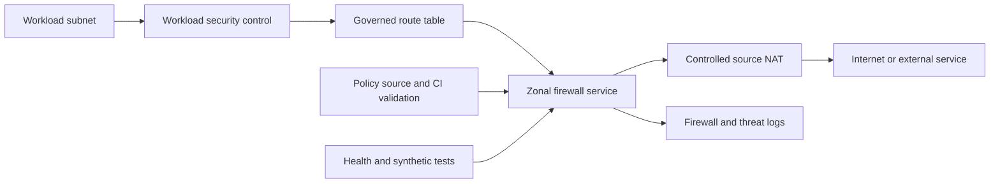

> **Document class:** How-to Guides implementation guide
> **Normative terms:** **MUST**, **MUST NOT**, **SHOULD**, **SHOULD NOT**, and **MAY** are requirements levels.
> **Applicability:** Centralized and distributed firewall, egress, routing, inspection, logging, and exception controls across four clouds.
> **Exception process:** Deviations require a documented risk assessment, compensating controls, named risk owner, and expiry date.

| Control field | Value |
|---|---|
| Document ID | `HTG-17` |
| Owner | Cloud Center of Excellence |
| Review cycle | At least annually and after material network, firewall, or threat-model changes |
| Evidence | Rule and route review, policy tests, flow logs, denied-traffic tests, change approvals, exception records, and rollback evidence |

# How to Configure Cloud Firewalls, Egress Controls, and Route Inspection

> **Decision in brief:** Enforce least privilege at the narrowest practical boundary, log both allowed and denied flows, and make every exception time-bound.

> **Document type:** Implementation guide
> **Primary examples:** Azure Firewall in a centralized hub
> **Cloud scope:** Azure, AWS, GCP, and Oracle Cloud Infrastructure (OCI)
> **Operating principle:** Default deny, allow documented flows, preserve symmetric paths, and make every decision observable.

## Objective

Create enforceable network controls for north-south and east-west traffic. The implementation routes required flows through resilient inspection, limits internet egress, prevents bypass, records decisions, and supports safe emergency change and rollback.

Security groups and subnet rules remain useful close to workloads; a central firewall does not replace distributed segmentation.

## Build the flow policy

Create an approved flow record for every rule:

| Field | Example |
|---|---|
| Source | `orders-prod-app` security group or `10.40.16.0/24` |
| Destination | `payments-api.example.internal` |
| Protocol and port | TCP 443 |
| Direction | Egress |
| Purpose and owner | Order submission, commerce team |
| Inspection | TLS metadata and threat intelligence |
| Environment | Production |
| Expiry/review | 2027-02-01 |

Prefer identities, service tags, private endpoints, and controlled domain names over broad address ranges where provider semantics are reliable. Never approve `any/any` as a permanent rule.

## Inspection architecture

For inbound applications, place DDoS protection and an approved WAF or application gateway before the workload. Do not publish administrative ports directly.

## Choose enforcement points

- Apply workload security groups or network security groups for local least privilege.
- Use central firewalls for shared egress policy, threat controls, cross-zone inspection, and hybrid boundaries.
- Use Kubernetes network policy or a service mesh for pod-level east-west control where required.
- Use provider private-service connectivity to keep supported managed-service flows off public paths.
- Use DNS and secure web proxies for domain-aware egress when firewalls cannot safely follow changing service addresses.

Avoid duplicate, contradictory ownership. Document which control is authoritative for each flow class.

## Configure routes and high availability

1. Deploy firewalls across the zones or fault domains required by the service objective.
2. Associate protected subnet route tables with the correct next hop.
3. Route both directions through the same stateful inspection tier.
4. Configure NAT deliberately and size ports for peak concurrent connections.
5. Prevent workloads from creating public IPs, alternate gateways, peerings, or bypass routes.
6. Separate production, non-production, and regulated route domains when required.
7. Test failover before onboarding production flows.

Never disable route propagation or insert a default route without calculating its effect on hybrid, platform-service, metadata, DNS, and return paths.

## Configure egress policy

Start with deny and add destinations by business capability:

- approved package and operating-system mirrors;
- source, artifact, identity, time, DNS, telemetry, and cloud management endpoints;
- explicitly approved partner APIs and SaaS destinations;
- incident-response update channels.

Pin packages and verify signatures even when the destination is allowlisted. Domain allowlists do not validate content. Block direct DNS to unapproved resolvers and monitor newly observed destinations.

TLS inspection requires a documented privacy, certificate, compatibility, and bypass policy. Do not intercept certificate-pinned, regulated, or mutually authenticated traffic without explicit design approval.

## Normalize multi-cloud implementation

| Capability | Azure | AWS | GCP | OCI |
|---|---|---|---|---|
| Managed firewall | Azure Firewall | AWS Network Firewall | Cloud Next Generation Firewall or approved appliance | OCI Network Firewall |
| Distributed control | NSG and ASG | Security groups and network ACLs | VPC firewall policies and tags | NSG and security lists |
| Routing | Route tables and Virtual WAN | Route tables and Transit Gateway | Routes, policy-based routes, NCC | Route tables and DRG |
| Traffic telemetry | Firewall, NSG, and network logs | Network Firewall and VPC Flow Logs | Firewall Rules Logging and VPC Flow Logs | Network Firewall and VCN Flow Logs |
| Edge WAF | Front Door or Application Gateway WAF | AWS WAF with CloudFront or ALB | Cloud Armor | OCI WAF |

Confirm current feature availability, scaling limits, route behavior, and logging semantics in the target region during implementation.

## Manage policy-as-code

Store rule intent in a reviewed repository. Validate schema, duplicate and shadowed rules, prohibited ports, broad sources and destinations, missing ownership, expired rules, invalid FQDNs, and route conflicts. Generate provider-specific policy without hiding meaningful provider behavior.

Use a staged rollout: validate syntax, deploy inactive or audit policy where supported, test a canary subnet, inspect logs, then expand. Require stronger approval for default routes, production deny rules, TLS inspection, public exposure, and cross-environment connectivity.

## Observe and respond

Send allow, deny, threat, DNS, NAT, route, and configuration-change logs to central storage with synchronized time and retention appropriate to investigations. Alert on:

- administrative ports exposed to the internet;
- new or rare egress destinations;
- repeated denies after a release;
- threat-signature or malware detections;
- firewall health, capacity, latency, or SNAT exhaustion;
- route changes that create bypass or asymmetric flow;
- policy changes outside the approved pipeline.

Keep an emergency rule procedure that records approver, scope, reason, start time, expiry, evidence, and owner. Automatically expire emergency rules.

## Validation

- [ ] Each approved flow succeeds, and representative prohibited flows fail.
- [ ] Traceroute, route inspection, and flow logs prove traffic crosses the intended controls.
- [ ] Return traffic remains symmetric during normal operation and failover.
- [ ] Workloads cannot bypass inspection through public IP, peering, alternate DNS, or route changes.
- [ ] Egress reports identify source workload, translated address, destination, decision, and rule.
- [ ] SNAT capacity and firewall throughput support tested peak load.
- [ ] Zone, appliance, tunnel, and route-controller failure meet recovery objectives.
- [ ] Every rule has an owner, purpose, review date, and reproducible IaC definition.

## Completion criteria

The control plane is ready when default-deny policy is practical, approved flows and negative tests pass, routes cannot bypass inspection, stateful paths remain symmetric, egress and NAT are sized, policy changes are reviewed and reversible, and logs support detection and investigation.

## Related topics

- [Firewalls, Routing, and Network Security Controls](../networking-identity-security/nis-firewalls-routing-and-network-security-controls.md)
- [How to Design Hub-and-Spoke Networking with Centralized Routing](how-to-design-hub-and-spoke-networking.md)
- [Network and Private-Connectivity Standard](../standards-best-practices/network-and-private-connectivity-standard.md)
- [Zero-Trust and Private-Access Design](../networking-identity-security/nis-zero-trust-and-private-access-design.md)
