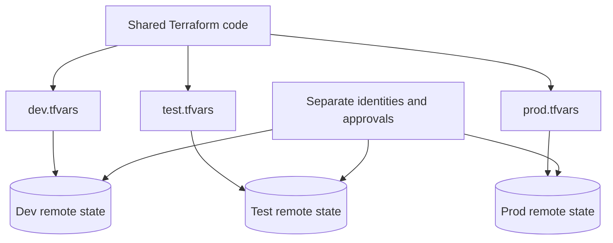
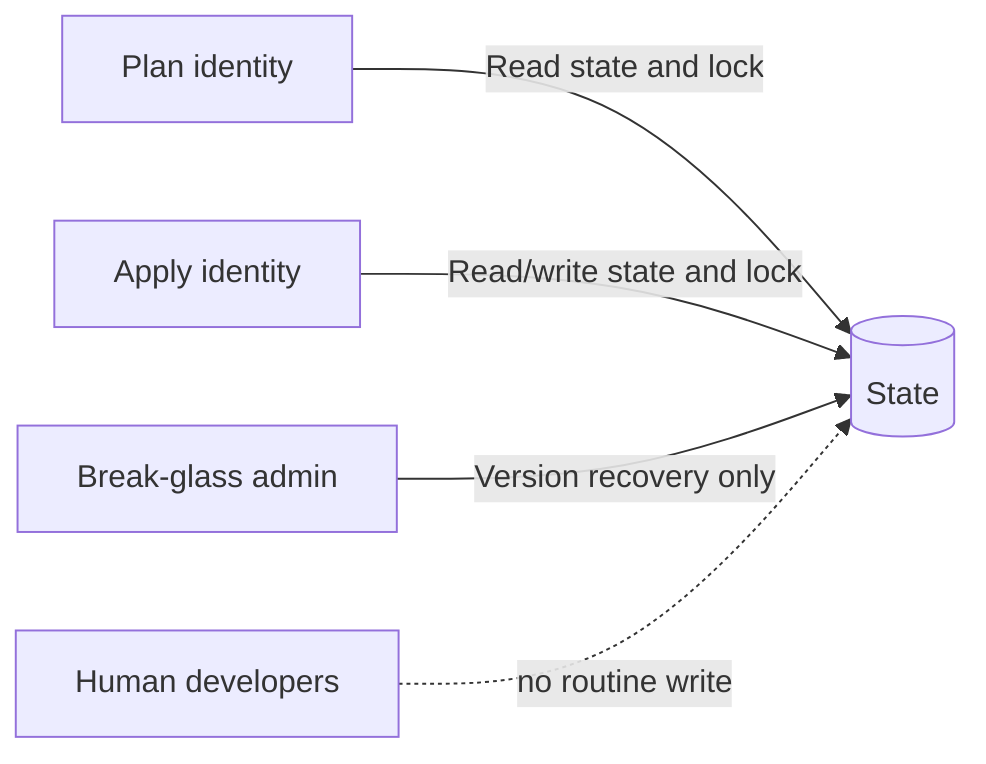

> **文档类型：** 操作指南
> **规范性术语：** **MUST**、**MUST NOT**、**SHOULD**、**SHOULD NOT** 和 **MAY** 是要求级别。
> **适用范围：** Terraform 或 OpenTofu 状态隔离、锁定、加密、环境配置、访问控制和跨云恢复。
> **例外流程：** 偏离要求需要记录风险评估、补偿控制、指定风险负责人和到期日期。

|控制领域|价值|
|---|---|
|文件编号 | `HTG-05` |
|负责人|云卓越中心 |
|审核周期|至少每年一次，并且在重大 IaC、后端或身份变更之后 |
|证据|后端配置、锁定和访问测试、机密源映射、计划制品、恢复演练和状态审计日志 |

# 如何配置远程状态和环境文件

> **简要决定：** 每个环境保持状态隔离和加密，通过批准的来源注入配置，并在依赖后端之前演练恢复。

> **文件类型：** 实施指南
> **主要示例：** Azure 和 Terraform
> **云范围：** Azure、AWS、GCP 和 Oracle Cloud Infrastructure (OCI)
> **操作原则：** 使用短期身份、不可变制品、最小权限、策略即代码和自动验证。


## 目标

远程存储 Terraform 状态，将其作为敏感操作数据进行保护，强制锁定以及单独的环境配置，而无需复制整个代码库。

状态不是无害的缓存。它可以包含资源标识符、网络详细信息、生成的值以及提供商返回的机密。

## 建筑学

每个环境必须具有唯一的状态密钥或后端、唯一的访问边界和显式变量文件。

## 选择一个后端

|云|Terraform 后端 |仓储服务 |锁定方式|
|---|---|---|---|
|Azure| `azurerm` | Azure Blob Storage |基于 Blob 租约的锁定 |
|AWS | `s3` |Amazon S3 |对测试的 Terraform 版本使用后端支持的锁定；显式验证配置 |
| GCP | `gcs` | Cloud Storage |后端管理的状态锁定 |
|OCI | `oci` | OCI Object Storage |后端支持共享远程状态和锁定 |
|云中立 | HCP Terraform / Terraform Enterprise | HCP Terraform / Terraform Enterprise 托管状态服务 |工作区运行锁定和 RBAC |

不要假设对象版本控制本身会阻止并发写入。在生产使用之前，使用两个同步计划操作测试锁定。

## 引导后端

状态后端无法在第一次运行时安全地管理自身。使用以下模式之一：

1. 专用的引导程序仓库。
2. 一次性的、经过审查的引导脚本。
3. 组织级 Landing Zone 流水线。
4. HCP Terraform 或 Terraform Enterprise。

后端应该有：

- 静态加密。
- 传输中的 TLS。
- 对象或 blob 版本控制。
- 支持软删除或保留。
- 需要时访问私有网络。
- 审计日志记录。
- 拒绝公众访问控制。
- 计划和应用的单独数据平面权限。
- break-glass 回收程序。

## 使用部分后端配置

`backend.tf`：
```hcl
terraform {
  backend "azurerm" {}
}
```
`environments/prod/backend.hcl`：
```hcl
resource_group_name  = "rg-tfstate-prod"
storage_account_name = "sttfstateprod001"
container_name       = "tfstate"
key                  = "platform/network/prod.tfstate"
use_azuread_auth     = true
```
初始化：
```bash
terraform init -reconfigure \
  -backend-config=environments/prod/backend.hcl
```
不要将机密放在后端文件中。使用工作负载身份和基于环境的身份验证。

AWS 示例：
```hcl
bucket       = "contoso-tfstate-prod"
key          = "platform/network/prod.tfstate"
region       = "ca-central-1"
encrypt      = true
use_lockfile = true
```
确认您固定的 Terraform 版本支持 `use_lockfile`。较旧的企业基线可能需要不同的锁定配置。

GCP 示例：
```hcl
bucket = "contoso-tfstate-prod"
prefix = "platform/network"
```
OCI 示例：
```hcl
bucket    = "contoso-tfstate-prod"
namespace = "object-storage-namespace"
key       = "platform/network/prod.tfstate"
region    = "ca-toronto-1"
```
## 环境文件模型

推荐：
```text
environments/
├── dev/
│   ├── backend.hcl
│   └── environment.tfvars
├── test/
│   ├── backend.hcl
│   └── environment.tfvars
└── prod/
    ├── backend.hcl
    └── environment.tfvars
```
示例 `environment.tfvars`：
```hcl
environment = "prod"
location    = "canadacentral"

network = {
  address_space = ["10.20.0.0/16"]
  private_only  = true
}

tags = {
  environment = "prod"
  owner       = "platform-engineering"
  managed_by  = "terraform"
}
```
请勿将凭据或敏感业务数据放入提交给源的 `.tfvars` 中。从 Secret Manager 检索机密，将它们作为敏感环境变量注入，或引用机密资源标识符。

## 变量优先级

Terraform 从多个来源加载值。使流水线明确，而不是依赖偶然的优先级：
```bash
terraform plan \
  -var-file=environments/prod/environment.tfvars \
  -var="release_id=${BUILD_ID}"
```
避免使用大量 `TF_VAR_*` 变量，因为它隐藏了配置。仅将它们用于临时值或无法提交的机密。

## 工作空间与目录

当满足以下所有条件时使用 CLI 工作区：

- 配置相同。
- 凭证和批准模型相同。
- 状态后端和保留模型是相同的。
- 环境风险低或短暂。
- 操作员了解工作空间选择。

当生产在访问、拓扑、提供商、生命周期、合规性或爆炸半径方面不同时，使用单独的目录和状态。

切勿在未检查的情况下依赖当前选定的工作区：
```bash
terraform workspace show
test "$(terraform workspace show)" = "prod"
```
## 状态访问设计

原则：

- 规划身份：读取状态、获取锁、读取目标资源。
- 应用身份：读/写状态并仅修改目标环境。
- 人工访问：通常为只读或不存在。
- break-glass：受监控、有时间限制且有日志记录。
- 跨状态输出访问：仅公开所需的输出；不给予任意状态访问。

## 迁移本地状态
```bash
cp terraform.tfstate terraform.tfstate.backup
terraform init -migrate-state \
  -backend-config=environments/prod/backend.hcl
terraform state pull > state-after-migration.json
```
验证：
```bash
terraform plan -detailed-exitcode \
  -var-file=environments/prod/environment.tfvars
```
预期结果是退出代码 `0`。差异意味着迁移或提供程序初始化改变了行为，需要进行调查。

## 测试锁定

在终端 A 中启动长时间运行的操作：
```bash
terraform apply -refresh-only
```
当状态锁定时，在终端 B 中运行：
```bash
terraform plan -lock-timeout=10s
```
终端 B 应等待，然后失败并显示锁定信息。在确认所属进程已死亡并且没有应用正在运行之前，切勿使用 `force-unlock`。

## 备份与恢复

恢复顺序：

1. 停止所有 Terraform 自动化。
2. 使用 `terraform state pull` 导出当前状态。
3. 将当前云清单与状态进行比较。
4. 仅当状态损坏时才恢复先前的对象版本。
5. 使用 `terraform import` 或 `removed` 块来协调实际资源。
6. 运行仅刷新计划。
7. 执行正常计划。
8. 审核后恢复自动化。

不要手动编辑状态 JSON，除非没有受支持的替代方案并且操作已由专家审核。

## 故障排除

|症状|原因 |解决方案|
|---|---|---|
|后端初始化失败 |错误的密钥、身份、端点或后端语法 |验证后端文件和调用者身份 |
|公共地址返回 |私有 DNS 未链接或转发 |正确的区域关联和解析器路径 |
|作业后锁仍然存在 |运行器突然终止|验证没有活动进程，然后受控强制解锁 |
|状态意外改变 |错误的环境或工作空间 |停止;检查后端密钥和工作区 |
|机密出现在状态|提供商存储它 |限制状态访问；尽可能重新设计机密流程|
|跨状态输出被拒绝 |缺乏状态共享许可 |公开专用配置接口或授予狭窄访问权限 |

## 验证

当每个环境都有独立的密钥和访问边界、验证锁定、启用加密和版本控制、在需要时阻止公共访问、身份验证是短暂的、环境文件不包含机密、测试恢复以及流水线在规划之前验证后端时，远程状态就完成了。

## 相关主题

- [如何使用 Azure DevOps 部署 Terraform](how-to-deploy-terraform-with-azure-devops.md)
- [如何使用 GitHub Actions 部署 Terraform](how-to-deploy-terraform-with-github-actions.md)
- [如何检测和修复基础设施和配置漂移](how-to-detect-and-remediate-infrastructure-and-configuration-drift.md)

## 官方参考文档

- Terraform 后端：https://developer.hashicorp.com/terraform/language/backend
- AzureRM 后端：https://developer.hashicorp.com/terraform/language/backend/azurerm
- S3 后端：https://developer.hashicorp.com/terraform/language/backend/s3
- GCS 后端：https://developer.hashicorp.com/terraform/language/backend/gcs
- OCI 后端：https://developer.hashicorp.com/terraform/language/backend/oci
- Terraform 工作区：https://developer.hashicorp.com/terraform/cli/workspaces
- 状态安全：https://developer.hashicorp.com/terraform/language/state/sensitive-data

## 相关仓库

- [andyxuan2010/azure-template](https://github.com/andyxuan2010/azure-template) — Azure Terraform 规划和环境模式，展示标准化后端和环境边界。
- [andyxuan2010/oci-template](https://github.com/andyxuan2010/oci-template) — 可复用的 OCI 模块，用于在 Azure 之外应用相同的状态隔离和环境组合原则。
- [andyxuan2010/azure-landingzone](https://github.com/andyxuan2010/azure-landingzone) — 将远程状态、网络隔离、共享服务和环境控制结合应用的企业级基础设施实施方案。
