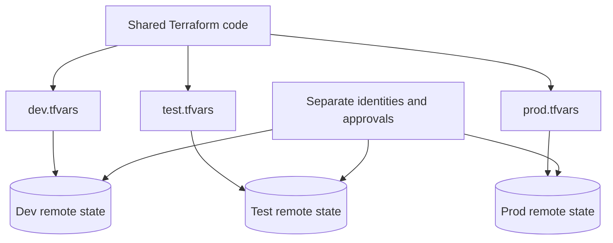
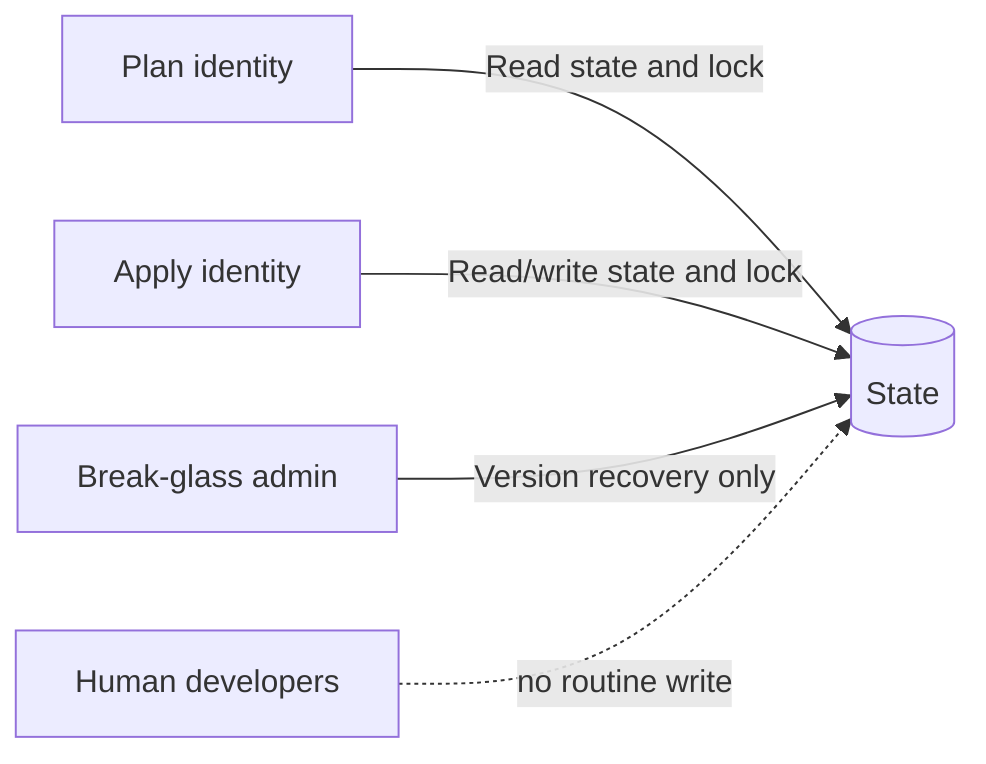

> **Document class:** How-to Guides implementation guide
> **Normative terms:** **MUST**, **MUST NOT**, **SHOULD**, **SHOULD NOT**, and **MAY** are requirements levels.
> **Applicability:** Terraform or OpenTofu state isolation, locking, encryption, environment configuration, access control, and recovery across clouds.
> **Exception process:** Deviations require a documented risk assessment, compensating controls, named risk owner, and expiry date.

| Control field | Value |
|---|---|
| Document ID | `HTG-05` |
| Owner | Cloud Center of Excellence |
| Review cycle | At least annually and after material IaC, backend, or identity changes |
| Evidence | Backend configuration, lock and access tests, secret-source mapping, plan artifacts, recovery rehearsal, and state audit logs |

# How to Configure Remote State and Environment Files

> **Decision in brief:** Keep state isolated and encrypted per environment, inject configuration through approved sources, and rehearse recovery before relying on the backend.

> **Document type:** Implementation guide
> **Primary examples:** Azure and Terraform
> **Cloud scope:** Azure, AWS, GCP, and Oracle Cloud Infrastructure (OCI)
> **Operating principle:** Use short-lived identity, immutable artifacts, least privilege, policy-as-code, and automated validation.


## Objective

Store Terraform state remotely, protect it as sensitive operational data, enforce locking, and separate environment configuration without copying entire codebases.

State is not a harmless cache. It can contain resource identifiers, network details, generated values, and secrets returned by providers.

## Architecture



Each environment must have a unique state key or backend, unique access boundary, and explicit variable file.

## Select a backend

| Cloud | Terraform backend | Storage service | Locking approach |
|---|---|---|---|
| Azure | `azurerm` | Azure Blob Storage | Blob lease-based locking |
| AWS | `s3` | Amazon S3 | Use backend-supported locking for the tested Terraform version; validate configuration explicitly |
| GCP | `gcs` | GCP Storage | Backend-managed state locking |
| OCI | `oci` | OCI Object Storage | Backend supports shared remote state and locking |
| Cloud-neutral | HCP Terraform / Terraform Enterprise | Managed state service | Workspace-run locking and RBAC |

Do not assume that object versioning alone prevents concurrent writes. Test locking with two simultaneous plan operations before production use.

## Bootstrap the backend

The state backend cannot manage itself safely on the first run. Use one of these patterns:

1. A dedicated bootstrap repository.
2. A one-time, reviewed bootstrap script.
3. An organization-level landing-zone pipeline.
4. HCP Terraform or Terraform Enterprise.

The backend should have:

- Encryption at rest.
- TLS in transit.
- Object or blob versioning.
- Soft delete or retention where supported.
- Private network access when required.
- Audit logging.
- Deny-public-access controls.
- Separate data-plane permissions for plan and apply.
- Break-glass recovery procedure.

## Use partial backend configuration

`backend.tf`:

```hcl
terraform {
  backend "azurerm" {}
}
```

`environments/prod/backend.hcl`:

```hcl
resource_group_name  = "rg-tfstate-prod"
storage_account_name = "sttfstateprod001"
container_name       = "tfstate"
key                  = "platform/network/prod.tfstate"
use_azuread_auth     = true
```

Initialize:

```bash
terraform init -reconfigure \
  -backend-config=environments/prod/backend.hcl
```

Do not place secrets in backend files. Use workload identity and environment-based authentication.

AWS example:

```hcl
bucket       = "contoso-tfstate-prod"
key          = "platform/network/prod.tfstate"
region       = "ca-central-1"
encrypt      = true
use_lockfile = true
```

Confirm that `use_lockfile` is supported by your pinned Terraform version. Older enterprise baselines can require a different locking configuration.

GCP example:

```hcl
bucket = "contoso-tfstate-prod"
prefix = "platform/network"
```

OCI example:

```hcl
bucket    = "contoso-tfstate-prod"
namespace = "object-storage-namespace"
key       = "platform/network/prod.tfstate"
region    = "ca-toronto-1"
```

## Environment file model

Recommended:

```text
environments/
├── dev/
│   ├── backend.hcl
│   └── environment.tfvars
├── test/
│   ├── backend.hcl
│   └── environment.tfvars
└── prod/
    ├── backend.hcl
    └── environment.tfvars
```

Example `environment.tfvars`:

```hcl
environment = "prod"
location    = "canadacentral"

network = {
  address_space = ["10.20.0.0/16"]
  private_only  = true
}

tags = {
  environment = "prod"
  owner       = "platform-engineering"
  managed_by  = "terraform"
}
```

Do not put credentials or sensitive business data in `.tfvars` committed to source. Retrieve secrets from a secret manager, inject them as sensitive environment variables, or reference secret-resource identifiers.

## Variable precedence

Terraform loads values from several sources. Make the pipeline explicit rather than relying on accidental precedence:

```bash
terraform plan \
  -var-file=environments/prod/environment.tfvars \
  -var="release_id=${BUILD_ID}"
```

Avoid a large collection of `TF_VAR_*` variables because it hides the configuration. Use them only for ephemeral values or secrets that cannot be committed.

## Workspaces versus directories

Use CLI workspaces when all of the following are true:

- Configuration is identical.
- Credentials and approval model are identical.
- State backend and retention model are identical.
- The environments are low risk or ephemeral.
- Operators understand workspace selection.

Use separate directories and states when production differs in access, topology, providers, lifecycle, compliance, or blast radius.

Never rely on the currently selected workspace without checking it:

```bash
terraform workspace show
test "$(terraform workspace show)" = "prod"
```

## State access design



Principles:

- Plan identity: read state, acquire lock, and read target resources.
- Apply identity: read/write state and modify only the target environment.
- Human access: normally read-only or absent.
- Break-glass: monitored, time-limited, and documented.
- Cross-state output access: expose only required outputs; do not give arbitrary state access.

## Migrate local state

```bash
cp terraform.tfstate terraform.tfstate.backup
terraform init -migrate-state \
  -backend-config=environments/prod/backend.hcl
terraform state pull > state-after-migration.json
```

Verify:

```bash
terraform plan -detailed-exitcode \
  -var-file=environments/prod/environment.tfvars
```

Expected result is exit code `0`. A diff means the migration or provider initialization changed behavior and requires investigation.

## Test locking

Start a long-running operation in terminal A:

```bash
terraform apply -refresh-only
```

While the state is locked, run in terminal B:

```bash
terraform plan -lock-timeout=10s
```

Terminal B should wait and then fail with lock information. Never use `force-unlock` until you have confirmed that the owning process is dead and no apply is running.

## Backup and recovery

Recovery order:

1. Stop all Terraform automation.
2. Export current state with `terraform state pull`.
3. Compare the current cloud inventory to state.
4. Restore a prior object version only if state is corrupt.
5. Use `terraform import` or `removed` blocks to reconcile actual resources.
6. Run a refresh-only plan.
7. Run a normal plan.
8. Resume automation after review.

Do not edit state JSON manually unless there is no supported alternative and the operation is reviewed by an expert.

## Troubleshooting

| Symptom | Cause | Resolution |
|---|---|---|
| Backend init fails | Wrong key, identity, endpoint, or backend syntax | Validate backend file and caller identity |
| Public address returned | Private DNS not linked or forwarded | Correct zone association and resolver path |
| Lock remains after job | Runner terminated abruptly | Verify no active process, then controlled force-unlock |
| State changed unexpectedly | Wrong environment or workspace | Stop; inspect backend key and workspace |
| Secret appears in state | Provider stored it | Restrict state access; redesign secret flow where possible |
| Cross-state output denied | State-sharing permission absent | Expose a dedicated configuration interface or grant narrow access |

## Validation

Remote state is complete when every environment has an isolated key and access boundary, locking is verified, encryption and versioning are enabled, public access is blocked where required, authentication is short-lived, environment files contain no secrets, recovery is tested, and pipelines verify the backend before planning.

## Related topics

- [How to Deploy Terraform with Azure DevOps](how-to-deploy-terraform-with-azure-devops.md)
- [How to Deploy Terraform with GitHub Actions](how-to-deploy-terraform-with-github-actions.md)
- [How to Detect and Remediate Infrastructure and Configuration Drift](how-to-detect-and-remediate-infrastructure-and-configuration-drift.md)

## Official references

- Terraform backends: https://developer.hashicorp.com/terraform/language/backend
- AzureRM backend: https://developer.hashicorp.com/terraform/language/backend/azurerm
- S3 backend: https://developer.hashicorp.com/terraform/language/backend/s3
- GCS backend: https://developer.hashicorp.com/terraform/language/backend/gcs
- OCI backend: https://developer.hashicorp.com/terraform/language/backend/oci
- Terraform workspaces: https://developer.hashicorp.com/terraform/cli/workspaces
- State security: https://developer.hashicorp.com/terraform/language/state/sensitive-data

## Related repos

- [andyxuan2010/azure-template](https://github.com/andyxuan2010/azure-template) — Azure Terraform planning and environment patterns that demonstrate standardized backend and environment boundaries.
- [andyxuan2010/oci-template](https://github.com/andyxuan2010/oci-template) — reusable OCI modules for applying the same state-isolation and environment-composition principles outside Azure.
- [andyxuan2010/azure-landingzone](https://github.com/andyxuan2010/azure-landingzone) — enterprise foundation implementation where remote state, network isolation, shared services, and environment controls are applied together.
