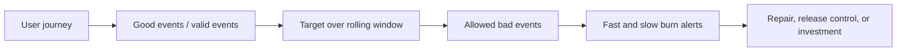

> **Document class:** How-to Guides implementation guide
> **Normative terms:** **MUST**, **MUST NOT**, **SHOULD**, **SHOULD NOT**, and **MAY** are requirements levels.
> **Applicability:** Customer-journey SLI and SLO definition, error-budget policy, alerting, release decisions, and service ownership across cloud platforms.
> **Exception process:** Deviations require a documented risk assessment, compensating controls, named risk owner, and expiry date.

| Control field | Value |
|---|---|
| Document ID | `HTG-24` |
| Owner | Cloud Center of Excellence |
| Review cycle | At least annually and after material service, reliability, or measurement changes |
| Evidence | SLI query definitions, target rationale, burn-rate alerts, budget reports, release decisions, incident links, and review records |

# How to Define SLOs and Error Budgets

> **Decision in brief:** Choose user-centered indicators, set achievable targets, and let measured error-budget consumption guide change decisions.

> **Document type:** Reliability implementation guide  
> **Operating principle:** Measure what users experience, set an achievable target below perfection, and use budget consumption to balance reliability and change.

## Objective

Define service-level objectives that guide engineering action rather than produce decorative dashboards. An SLO combines a service-level indicator, target, rolling window, scope, exclusions, data source, owner, and consequence when the error budget is consumed.

## Model the user journey

Start with critical actions such as sign in, submit order, retrieve document, deploy workload, or resolve DNS. Identify the entry point, successful outcome, maximum acceptable latency, dependencies, traffic classes, and business impact. Resource uptime is not a substitute for journey success.

## Define useful indicators

| Reliability dimension | Example SLI |
|---|---|
| Availability | Successful valid requests divided by valid requests |
| Latency | Proportion of successful requests below the journey threshold |
| Correctness | Valid outputs divided by evaluated outputs |
| Freshness | Records updated within the promised delay |
| Durability | Objects retained and recoverable as promised |
| Pipeline reliability | Deployments completing correctly within the target duration |

Define what counts as a valid event. Exclude synthetic probes, customer-caused invalid requests, or maintenance only when the policy is explicit and does not hide provider or operator failure.

## Set the objective

Use historical performance, customer expectations, dependency limits, and engineering cost. For a 99.9% availability SLO over 30 days, the theoretical error budget is approximately 43.2 minutes, but event-based SLIs should calculate budget from valid events rather than convert blindly to time.

Avoid a target stricter than the weakest critical dependency unless the architecture masks that dependency. Separate tiers or journeys when customer commitments differ.

## Configure burn-rate alerting

Use multiple windows: a fast-burn alert detects severe incidents quickly; a slow-burn alert catches sustained degradation. Require both a short and long window before paging to reduce noise. Ticket on lower burn rates that threaten the budget but do not require immediate interruption.

## Error-budget policy

- More than 50% remaining: normal delivery with standard controls.
- Between 20% and 50%: prioritize known reliability risks and review risky releases.
- Below 20%: require explicit service-owner approval for material risk.
- Exhausted: pause nonessential change, correct measurement faults, and execute the reliability recovery plan.

Security patches and emergency risk reductions may proceed under an exception; record the decision. The budget is not permission to intentionally cause failures.

## Validation

- [ ] SLI queries reproduce known good, slow, failed, and excluded test events.
- [ ] The SLO dashboard identifies owner, window, target, remaining budget, and major consumers.
- [ ] Fast- and slow-burn tests route to the correct response path.
- [ ] Provider, region, tenant, and version dimensions expose localized failures without unbounded cardinality.
- [ ] Release and incident processes use the documented budget policy.
- [ ] SLOs are reviewed after architecture, traffic, or customer-contract changes.

## Related topics

- [Cloud Operations and Reliability Model](../operations-reliability-finops/cloud-operations-and-reliability-model.md)
- [How to Build Centralized Multi-Cloud Observability](how-to-build-centralized-multicloud-observability.md)
- [Validation, Testing, and Operational Readiness](../operations-reliability-finops/validation-testing-and-operational-readiness.md)

## Related repos

- [andyxuan2010/medp-wl-notification](https://github.com/andyxuan2010/medp-wl-notification) — offers scheduled notification patterns that can be adapted for error-budget reporting and non-paging reliability notifications.
