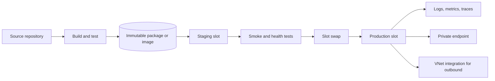
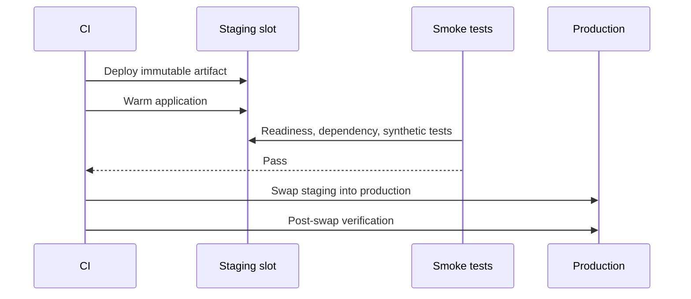
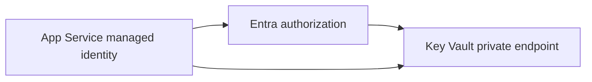

> **文档类型：** 操作指南
> **规范性术语：** **MUST**、**MUST NOT**、**SHOULD**、**SHOULD NOT** 和 **MAY** 是要求级别。
> **适用范围：** 不可变 App Service 部署、插槽、运行状况验证、私有网络、回滚、身份和云可移植性。
> **例外流程：** 偏离要求需要记录风险评估、补偿控制、指定风险负责人和到期日期。

|控制领域|价值|
|---|---|
|文件编号 | `HTG-07` |
|负责人|云卓越中心 |
|审核周期|至少每年一次，并且在发生重大 App Service、运行时或部署更改之后 |
|证据|制品摘要、IaC 计划、插槽和运行状况检查、身份和网络测试、部署日志、回滚结果和清理证据 |

# 如何将应用部署到 Azure App Service

> **决策简述：** 通过受保护的插槽部署一个已识别的制品，验证运行状况和依赖关系，然后使用记录在案的证据进行升级或回滚。

> **文件类型：** 实施指南
> **主要示例：** Azure 和 Terraform
> **云范围：** Azure、AWS、GCP 和 Oracle Cloud Infrastructure (OCI)
> **操作原则：** 使用短期身份、不可变制品、最小权限、策略即代码和自动验证。


## 目标

使用可重复的构建制品、部署槽、运行状况检查、配置分离和受控升级将 Web 应用部署到 Azure App Service。该过程有利于不可变的包或容器部署，而不是复制未跟踪的工作目录。

## 参考架构

私有端点控制入站访问。 VNet 集成控制来自应用的出站访问。他们解决不同的问题。

## 云服务映射

|能力|Azure|AWS | GCP |OCI |
|---|---|---|---|---|
|托管网络应用 |App Service| App Runner 或 Elastic Beanstalk | Cloud Run 或 App Engine |Container Instances、函数或 OKE，具体取决于工作负载 |
|修订/槽模式|部署槽位|版本/环境或蓝绿目标群体 | Cloud Run revisions 和流量划分 |镜像版本和负载均衡器后端集 |
|私有入口 |App Service 私有端点 |按服务划分的 VPC 入口/私有连接模式 |内部入口/私有服务连接模式|私有子网和负载均衡器 |
|出站 VPC 访问 | VNet 集成 | VPC 连接器或原生 VPC 连接器 |无服务器 VPC 访问/直接 VPC 出口 | VCN 附件|

这些服务在功能上并不相同。根据运行时、网络、扩展、可移植性和操作要求进行选择。

## 先决条件

- 具有所需运行时间和规模的 App Service 计划。
- 网络应用和可选的暂存槽。
- 启用托管身份。
- 应用配置和机密存储在构建制品之外。
- Log Analytics/Application Insights 或等效遥测。
- 需要时私有端点和 VNet 集成。
- 生成版本化 ZIP、JAR/WAR 或容器镜像的构建流水线。
- 一个健康端点，可在不泄露机密的情况下检查运营就绪情况。

## 构建一次

Node.js 应用示例：
```bash
set -euo pipefail
npm ci
npm test
npm run build
mkdir -p package
cp -R dist package/
cp package.json package-lock.json package/
cd package
zip -r ../webapp-${GIT_SHA}.zip .
```
存档根必须与运行时的预期布局匹配。除非部署方法需要，否则请勿将应用放置在额外的父目录中。

生成元数据：
```json
{
  "commit": "0123456789abcdef",
  "build": "2026.08.01.42",
  "artifact": "webapp-0123456789abcdef.zip"
}
```
## 使用 Terraform 配置核心资源
```hcl
resource "azurerm_linux_web_app" "app" {
  name                = var.app_name
  location            = var.location
  resource_group_name = var.resource_group_name
  service_plan_id     = azurerm_service_plan.app.id
  https_only          = true

  identity {
    type = "SystemAssigned"
  }

  site_config {
    always_on = true

    application_stack {
      node_version = "22-lts"
    }

    health_check_path = "/health/ready"
  }

  app_settings = {
    "WEBSITE_RUN_FROM_PACKAGE" = "1"
    "APP_ENVIRONMENT"          = var.environment
  }
}
```
运行时值随时间变化。查询支持的堆栈并测试所选的运行时，而不是盲目复制此示例。

## 选择部署方式

### ZIP 部署
```bash
az webapp deploy \
  --resource-group "$RESOURCE_GROUP" \
  --name "$APP_NAME" \
  --slot staging \
  --src-path "webapp-${GIT_SHA}.zip" \
  --type zip
```
### 从包中运行

设置 `WEBSITE_RUN_FROM_PACKAGE=1`并部署 ZIP 包。App Service 以只读方式安装包，从而减少文件锁定和部分复制问题。

不要将“从包运行”用于需要对应用目录进行写访问的运行时。当前的 Microsoft 指南特别指出，内置 Java App Service 运行时需要写入访问权限，并且不支持此模式。

### 容器部署

通过摘要推送镜像：
```text
registry.example.com/webapp@sha256:<digest>
```
避免在生产中使用可变的 `latest` 标签。在支持的情况下为注册表拉取配置托管标识。

## 配置槽位

创建 `staging` 并将特定于环境的设置标记为插槽设置：
```hcl
resource "azurerm_linux_web_app_slot" "staging" {
  name           = "staging"
  app_service_id = azurerm_linux_web_app.app.id

  app_settings = {
    "APP_ENVIRONMENT" = "staging"
  }

  site_config {
    health_check_path = "/health/ready"
  }
}
```
当机密、连接字符串和环境端点在交换期间不得移动时，请保持它们的粘性。

插槽工作流程：

## 私有网络

入境：

- 创建 App Service 私有端点。
- 链接所需的 `privatelink.azurewebsites.net` 私有 DNS 区域。
- 确保应用和 SCM/Kudu 主机名私下解析以进行私有部署。
- 仅在部署代理和客户端进行测试后才禁用公共网络访问。

出境：

- 配置区域 VNet 集成。
- 通过预期的防火墙或 NAT 路由流量。
- 为依赖项启用私有 DNS 解析。
- 不要假设入站私有端点提供出站 VNet 访问。

专用 SCM 端点意味着流水线代理必须在私有网络中运行或到达私有网络。

## 配置和机密

使用托管身份访问 Key Vault 或其他 Secret Manager。仅在 App Service 设置中存储引用或非机密配置。

避免在 CI 中发布配置文件。发布配置文件是一种长期存在的部署凭据，通常比基于 OIDC 的部署授予更广泛的访问权限。

## 交换前验证
```bash
curl --fail --silent --show-error \
  "https://${APP_NAME}-staging.azurewebsites.net/health/ready"

curl --fail --silent --show-error \
  "https://${APP_NAME}-staging.azurewebsites.net/version"
```
验证：

- 正确的提交和制品版本。
- 就绪端点。
- 依赖关系连接。
- 数据库迁移兼容性。
- 身份验证和授权。
- TLS 和自定义域。
- 日志记录和跟踪输出。
- 没有新的高严重性错误。
- 部署窗口内的启动时间。

## 交换并验证
```bash
az webapp deployment slot swap \
  --resource-group "$RESOURCE_GROUP" \
  --name "$APP_NAME" \
  --slot staging \
  --target-slot production
```
交换后：
```bash
curl --fail "https://app.example.com/health/ready"
curl --fail "https://app.example.com/version"
```
监视错误率、延迟、重新启动计数、失败的请求、依赖项失败和饱和度。

## 回滚

快速回滚：
```bash
az webapp deployment slot swap \
  --resource-group "$RESOURCE_GROUP" \
  --name "$APP_NAME" \
  --slot staging \
  --target-slot production
```
仅当数据库和外部更改保持向后兼容时，换回才是安全的。使用扩展和收缩数据库迁移：

1. 添加兼容架构。
2. 部署支持新旧模式的代码。
3. 迁移数据。
4. 在后续版本中删除旧架构。

## 故障排除

|症状|原因 |更正|
|---|---|---|
|部署超时 | SCM 端点专用或 DNS 丢失 |使用私有代理并解析应用和 SCM 名称 |
|应用启动但返回 500 |运行时、启动命令或缺少配置 |检查 App Service 日志和容器标准输出 |
| ZIP 部署到错误路径 |存档有一个额外的目录 |使用根目录下的应用文件重建存档 |
|交换导致中断 |就绪探针弱或配置已移动 |加强测试并正确标记插槽设置 |
|无法访问数据库 | VNet 集成、路由、DNS 或防火墙 |跟踪出站 DNS 和 TCP 路径 |
|证书错误 |自定义域或私有 DNS 指向错误的端点 |验证 SNI、主机名和证书绑定 |

## 验证

当制品不可变且可追踪、登台通过运行状况和冒烟测试、配置外部化、身份认证采用无密钥方式、私有入站和出站路径经过验证、生产升级受到控制、遥测处于活动状态并且测试回滚时，部署就完成了。

## 相关主题

- [如何构建私有端点和私有 DNS](how-to-build-private-endpoints-and-private-dns.md)
- [如何部署和升级 AKS 工作负载](how-to-deploy-and-upgrade-an-aks-workload.md)
- [如何使用 Azure DevOps 部署 Terraform](how-to-deploy-terraform-with-azure-devops.md)

## 官方参考文档

- App Service ZIP 部署：https://learn.microsoft.com/en-us/azure/app-service/deploy-zip
- 从包运行：https://learn.microsoft.com/en-us/azure/app-service/deploy-run-package
- 部署槽：https://learn.microsoft.com/en-us/azure/app-service/deploy-staging-slots
- App Service 私有端点：https://learn.microsoft.com/en-us/azure/app-service/overview-private-endpoint
- App Service VNet 集成：https://learn.microsoft.com/en-us/azure/app-service/overview-vnet-integration

## 相关仓库

- [andyxuan2010/web-ccoedemo-dotnet](https://github.com/andyxuan2010/web-ccoedemo-dotnet) — 具有 Entra 身份验证、Easy Auth、GitHub Actions 和 Azure DevOps 部署的 ASP.NET Core App Service 参考。
- [andyxuan2010/web-ccoedemo-python](https://github.com/andyxuan2010/web-ccoedemo-python) — Python Flask App Service 实现，演示身份和自动部署模式。
- [andyxuan2010/web-ccoedemo-node](https://github.com/andyxuan2010/web-ccoedemo-node) — Node.js 和 Express App Service 参考以及 MSAL/Easy Auth 和 Azure Pipelines 交付示例。
