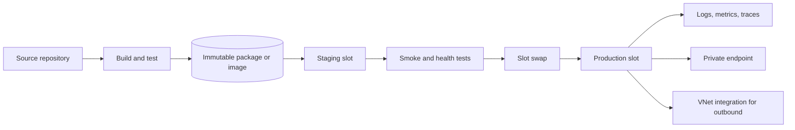
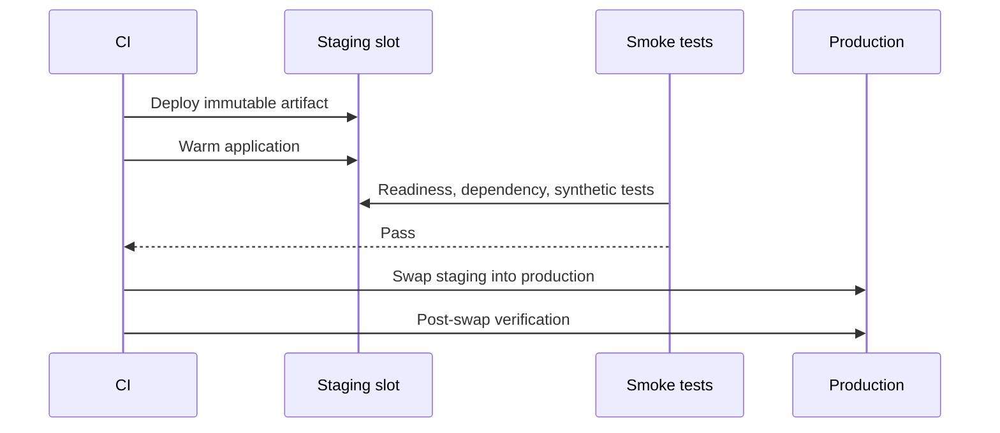
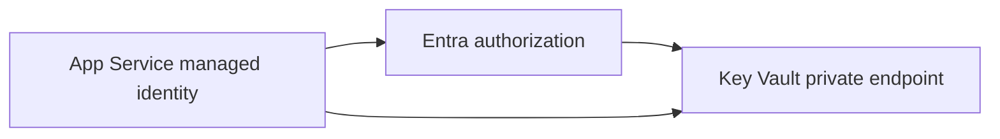

> **Document class:** How-to Guides implementation guide
> **Normative terms:** **MUST**, **MUST NOT**, **SHOULD**, **SHOULD NOT**, and **MAY** are requirements levels.
> **Applicability:** Immutable App Service deployments, slots, health validation, private networking, rollback, identity, and cloud portability.
> **Exception process:** Deviations require a documented risk assessment, compensating controls, named risk owner, and expiry date.

| Control field | Value |
|---|---|
| Document ID | `HTG-07` |
| Owner | Cloud Center of Excellence |
| Review cycle | At least annually and after material App Service, runtime, or deployment changes |
| Evidence | Artifact digest, IaC plan, slot and health checks, identity and network tests, deployment logs, rollback result, and cleanup evidence |

# How to Deploy an Application to Azure App Service

> **Decision in brief:** Deploy one identified artifact through a protected slot, validate health and dependencies, then promote or roll back using recorded evidence.

> **Document type:** Implementation guide
> **Primary examples:** Azure and Terraform
> **Cloud scope:** Azure, AWS, GCP, and Oracle Cloud Infrastructure (OCI)
> **Operating principle:** Use short-lived identity, immutable artifacts, least privilege, policy-as-code, and automated validation.


## Objective

Deploy a web application to Azure App Service using a repeatable build artifact, deployment slot, health checks, configuration separation, and controlled promotion. The procedure favors immutable package or container deployment over copying an untracked working directory.

## Reference architecture



Private Endpoint controls inbound access. VNet Integration controls outbound access from the app. They solve different problems.

## Cloud service mapping

| Capability | Azure | AWS | GCP | OCI |
|---|---|---|---|---|
| Managed web application | App Service | App Runner or Elastic Beanstalk | Cloud Run or App Engine | Container Instances, Functions, or OKE depending workload |
| Revision/slot pattern | Deployment slots | Versions/environments or blue-green target groups | Cloud Run revisions and traffic splits | Image versions and load-balancer backend sets |
| Private ingress | App Service Private Endpoint | VPC ingress/private connectivity pattern by service | Internal ingress / Private Service Connect pattern | Private subnet and load balancer |
| Outbound VPC access | VNet Integration | VPC connector or native VPC attachment | Serverless VPC Access / direct VPC egress | VCN attachment |

The services are not functionally identical. Select by runtime, networking, scaling, portability, and operational requirements.

## Prerequisites

- An App Service plan with the required runtime and scale.
- A web app and optional staging slot.
- Managed identity enabled.
- Application configuration and secrets stored outside the build artifact.
- Log Analytics/Application Insights or equivalent telemetry.
- Private endpoint and VNet Integration when required.
- A build pipeline that produces a versioned ZIP, JAR/WAR, or container image.
- A health endpoint that checks application readiness without exposing secrets.

## Build once

Example for a Node.js application:

```bash
set -euo pipefail
npm ci
npm test
npm run build
mkdir -p package
cp -R dist package/
cp package.json package-lock.json package/
cd package
zip -r ../webapp-${GIT_SHA}.zip .
```

The archive root must match the runtime's expected layout. Do not place the application inside an extra parent directory unless the deployment method expects it.

Generate metadata:

```json
{
  "commit": "0123456789abcdef",
  "build": "2026.08.01.42",
  "artifact": "webapp-0123456789abcdef.zip"
}
```

## Provision core resources with Terraform

```hcl
resource "azurerm_linux_web_app" "app" {
  name                = var.app_name
  location            = var.location
  resource_group_name = var.resource_group_name
  service_plan_id     = azurerm_service_plan.app.id
  https_only          = true

  identity {
    type = "SystemAssigned"
  }

  site_config {
    always_on = true

    application_stack {
      node_version = "22-lts"
    }

    health_check_path = "/health/ready"
  }

  app_settings = {
    "WEBSITE_RUN_FROM_PACKAGE" = "1"
    "APP_ENVIRONMENT"          = var.environment
  }
}
```

Runtime values change over time. Query supported stacks and test the selected runtime rather than copying this example blindly.

## Choose a deployment method

### ZIP deploy

```bash
az webapp deploy \
  --resource-group "$RESOURCE_GROUP" \
  --name "$APP_NAME" \
  --slot staging \
  --src-path "webapp-${GIT_SHA}.zip" \
  --type zip
```

### Run from package

Set `WEBSITE_RUN_FROM_PACKAGE=1` and deploy a ZIP package. App Service mounts the package read-only, reducing file-lock and partial-copy problems.

Do not use Run from Package for a runtime that requires write access to the application directory. Current Microsoft guidance specifically states that built-in Java App Service runtimes require write access and do not support this mode.

### Container deployment

Push an image by digest:

```text
registry.example.com/webapp@sha256:<digest>
```

Avoid mutable `latest` tags in production. Configure managed identity for registry pull where supported.

## Configure slots

Create `staging` and mark environment-specific settings as slot settings:

```hcl
resource "azurerm_linux_web_app_slot" "staging" {
  name           = "staging"
  app_service_id = azurerm_linux_web_app.app.id

  app_settings = {
    "APP_ENVIRONMENT" = "staging"
  }

  site_config {
    health_check_path = "/health/ready"
  }
}
```

Keep secrets, connection strings, and environment endpoints sticky when they must not move during a swap.

Slot workflow:



## Private networking

Inbound:

- Create an App Service Private Endpoint.
- Link the required `privatelink.azurewebsites.net` private DNS zone.
- Ensure both app and SCM/Kudu hostnames resolve privately for private deployments.
- Disable public network access only after testing from deployment agents and clients.

Outbound:

- Configure regional VNet Integration.
- Route traffic through the intended firewall or NAT.
- Enable private DNS resolution for dependencies.
- Do not assume inbound Private Endpoint provides outbound VNet access.

A private SCM endpoint means the pipeline agent must run in or reach the private network.

## Configuration and secrets

Use managed identity to access Key Vault or another secret manager. Store only references or non-secret configuration in App Service settings.



Avoid publish profiles in CI. A publish profile is a long-lived deployment credential and usually grants broader access than OIDC-based deployment.

## Validate before swap

```bash
curl --fail --silent --show-error \
  "https://${APP_NAME}-staging.azurewebsites.net/health/ready"

curl --fail --silent --show-error \
  "https://${APP_NAME}-staging.azurewebsites.net/version"
```

Validate:

- Correct commit and artifact version.
- Readiness endpoint.
- Dependency connectivity.
- Database migration compatibility.
- Authentication and authorization.
- TLS and custom domain.
- Log and trace emission.
- No new high-severity errors.
- Startup time within the deployment window.

## Swap and verify

```bash
az webapp deployment slot swap \
  --resource-group "$RESOURCE_GROUP" \
  --name "$APP_NAME" \
  --slot staging \
  --target-slot production
```

After swap:

```bash
curl --fail "https://app.example.com/health/ready"
curl --fail "https://app.example.com/version"
```

Monitor error rate, latency, restart count, failed requests, dependency failures, and saturation.

## Rollback

Fast rollback:

```bash
az webapp deployment slot swap \
  --resource-group "$RESOURCE_GROUP" \
  --name "$APP_NAME" \
  --slot staging \
  --target-slot production
```

A swap-back is safe only when database and external changes remain backward compatible. Use expand-and-contract database migrations:

1. Add compatible schema.
2. Deploy code that supports old and new schema.
3. Migrate data.
4. Remove old schema in a later release.

## Troubleshooting

| Symptom | Cause | Correction |
|---|---|---|
| Deployment times out | SCM endpoint private or DNS missing | Use a private agent and resolve both app and SCM names |
| App starts but returns 500 | Runtime, startup command, or missing config | Inspect App Service logs and container stdout |
| ZIP deployed into wrong path | Archive has an extra directory | Rebuild archive with app files at root |
| Swap causes outage | Readiness probe weak or config moved | Strengthen tests and mark slot settings correctly |
| Cannot reach database | VNet Integration, route, DNS, or firewall | Trace outbound DNS and TCP path |
| Certificate error | Custom domain or private DNS points to wrong endpoint | Validate SNI, hostname, and certificate binding |

## Validation

Deployment is complete when the artifact is immutable and traceable, staging passes health and smoke tests, configuration is externalized, identity is secretless, private inbound and outbound paths are validated, production promotion is controlled, telemetry is active, and swap-back is tested.

## Related topics

- [How to Build Private Endpoints and Private DNS](how-to-build-private-endpoints-and-private-dns.md)
- [How to Deploy and Upgrade an AKS Workload](how-to-deploy-and-upgrade-an-aks-workload.md)
- [How to Deploy Terraform with Azure DevOps](how-to-deploy-terraform-with-azure-devops.md)

## Official references

- App Service ZIP deployment: https://learn.microsoft.com/en-us/azure/app-service/deploy-zip
- Run from package: https://learn.microsoft.com/en-us/azure/app-service/deploy-run-package
- Deployment slots: https://learn.microsoft.com/en-us/azure/app-service/deploy-staging-slots
- App Service private endpoints: https://learn.microsoft.com/en-us/azure/app-service/overview-private-endpoint
- App Service VNet Integration: https://learn.microsoft.com/en-us/azure/app-service/overview-vnet-integration

## Related repos

- [andyxuan2010/web-ccoedemo-dotnet](https://github.com/andyxuan2010/web-ccoedemo-dotnet) — ASP.NET Core App Service reference with Entra authentication, Easy Auth, GitHub Actions, and Azure DevOps deployment.
- [andyxuan2010/web-ccoedemo-python](https://github.com/andyxuan2010/web-ccoedemo-python) — Python Flask App Service implementation demonstrating identity and automated deployment patterns.
- [andyxuan2010/web-ccoedemo-node](https://github.com/andyxuan2010/web-ccoedemo-node) — Node.js and Express App Service reference with MSAL/Easy Auth and Azure Pipelines delivery examples.
