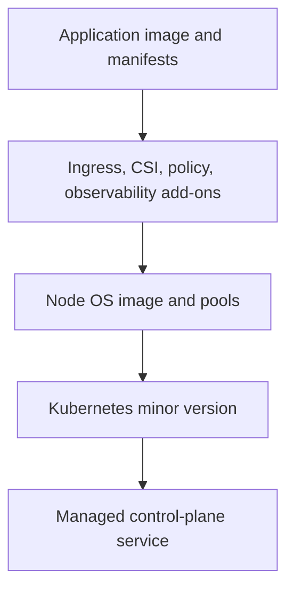
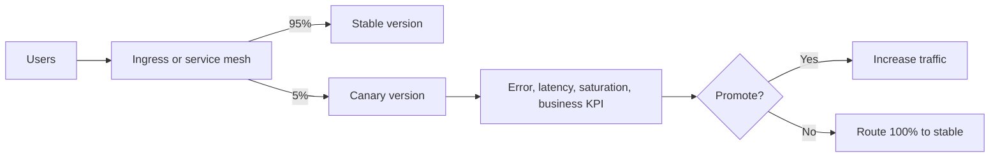
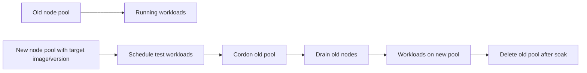

> **文档类型：** 操作指南
> **规范性术语：** **MUST**、**MUST NOT**、**SHOULD**、**SHOULD NOT** 和 **MAY** 是要求级别。
> **适用范围：** AKS 工作负载交付、Helm 打包、运行状况门、中断控制、渐进式部署、回滚和多云可移植性。
> **例外流程：** 偏离要求需要记录风险评估、补偿控制、指定风险负责人和到期日期。

|控制领域|价值|
|---|---|
|文件编号 | `HTG-08` |
|负责人|云卓越中心 |
|审核周期|至少每年一次，并且在 Kubernetes、平台或版本发生重大变化之后 |
|证据|图表和镜像来源、策略检查、推出指标、中断测试、服务运行状况、回滚结果和审计跟踪 |

# 如何部署和升级 AKS 工作负载

> **简要决定：** 通过具有明确中断预算和预演的回滚路径的健康门控发布来晋级不可变镜像。

> **文件类型：** 实施指南
> **主要示例：** Azure 和 Terraform
> **云范围：** Azure、AWS、GCP 和 Oracle Cloud Infrastructure (OCI)
> **操作原则：** 使用短期身份、不可变制品、最小权限、策略即代码和自动验证。


## 目标

在 Azure Kubernetes Service (AKS) 上部署和升级应用工作负载，无需合并应用版本、节点镜像更新和 Kubernetes 控制平面升级。这些是具有不同风险的单独变更类型。

工作负载实践也应用于 Amazon EKS、Google Kubernetes Engine (GKE) 和 Oracle Kubernetes Engine (OKE)。

## 改变图层

一次升级和验证一层，除非经过测试的紧急程序明确地将它们结合起来。

## 先决条件

- 通过 Entra 集成或工作负载批准的身份进行集群访问。
- 命名空间 RBAC 和最小权限。
- 由摘要固定的容器镜像。
- Helm Chart或 Kustomize 覆盖存储在源中。
- 准备情况、活跃度和启动探测。
- 资源请求和限制。
- PodDisruptionBudget (PDB)。
- 跨拓扑区域或节点的多个副本。
- 可观测性和告警。
- 持久数据的备份或恢复计划。
- Kubernetes 升级之前进行 API 弃用扫描。

## 云映射

|能力| AKS | EKS | GKE |无完全等效项|
|---|---|---|---|---|
|托管 Kubernetes | Azure Kubernetes Service |Amazon EKS |Google Kubernetes Engine | Oracle Kubernetes Engine |
|工作负载身份| Microsoft Entra 工作负载 ID |服务账户/Pod 身份的 IAM 角色 | GKE 的工作负载身份联合 |按受支持模式划分的 OCI 工作负载身份或实例主体 |
|镜像注册| Azure Container Registry |Amazon ECR |Artifact Registry | OCI Container Registry |
|升级渠道| AKS 自动升级通道 | EKS 版本和托管节点组更新 | GKE 发布渠道 | OKE 控制平面和节点池升级 |
|私有 API |私有 AKS 集群 | EKS 私有端点 | GKE 专用/DNS 端点 | OKE 私有端点 |

## 基线工作负载清单
```yaml
apiVersion: apps/v1
kind: Deployment
metadata:
  name: orders-api
  namespace: orders
spec:
  replicas: 3
  strategy:
    type: RollingUpdate
    rollingUpdate:
      maxUnavailable: 0
      maxSurge: 1
  selector:
    matchLabels:
      app: orders-api
  template:
    metadata:
      labels:
        app: orders-api
    spec:
      serviceAccountName: orders-api
      containers:
        - name: api
          image: contoso.azurecr.io/orders-api@sha256:REPLACE
          ports:
            - containerPort: 8080
          readinessProbe:
            httpGet:
              path: /health/ready
              port: 8080
            periodSeconds: 5
            failureThreshold: 6
          livenessProbe:
            httpGet:
              path: /health/live
              port: 8080
            periodSeconds: 10
          startupProbe:
            httpGet:
              path: /health/startup
              port: 8080
            periodSeconds: 5
            failureThreshold: 30
          resources:
            requests:
              cpu: 200m
              memory: 256Mi
            limits:
              cpu: "1"
              memory: 1Gi
```
PDB：
```yaml
apiVersion: policy/v1
kind: PodDisruptionBudget
metadata:
  name: orders-api
  namespace: orders
spec:
  minAvailable: 2
  selector:
    matchLabels:
      app: orders-api
```
PDB 不能防止应用错误或所有节点故障。它仅限制自愿中断。

## 部署前验证
```bash
kubectl version
kubectl auth can-i create deployments -n orders
kubectl get nodes
kubectl get pods -A
kubectl get events -A --sort-by=.lastTimestamp | tail -50
helm lint ./charts/orders-api
helm template orders-api ./charts/orders-api \
  -f environments/prod/values.yaml > rendered.yaml
kubectl apply --dry-run=server -f rendered.yaml
```
另请扫描：
```bash
kubeconform -strict rendered.yaml
trivy config rendered.yaml
```
使用服务器端试运行，因为客户端架构验证无法检测准入策略和特定于集群的 API 行为。

## 使用 Helm 进行部署
```bash
helm upgrade --install orders-api ./charts/orders-api \
  --namespace orders \
  --create-namespace \
  --values environments/prod/values.yaml \
  --set image.digest="$IMAGE_DIGEST" \
  --atomic \
  --wait \
  --timeout 10m \
  --history-max 20
```
`--atomic` 在升级失败时回滚 Helm 版本，但无法逆转外部数据库迁移或不可逆转的副作用。

观看推出：
```bash
kubectl rollout status deployment/orders-api \
  -n orders \
  --timeout=10m

kubectl get pods -n orders -o wide
kubectl get events -n orders --sort-by=.lastTimestamp
```
## 渐进式交付

对于高风险服务，使用金丝雀或蓝绿发布控制：

晋级门应包括技术和业务指标。 pod 为 `Ready` 并不能证明发布是正确的。

## 应用回滚

头盔：
```bash
helm history orders-api -n orders
helm rollback orders-api <revision> \
  -n orders \
  --wait \
  --timeout 10m
```
Kubernetes 部署：
```bash
kubectl rollout history deployment/orders-api -n orders
kubectl rollout undo deployment/orders-api -n orders
```
回滚需要向后兼容的数据和 API。使用扩展和收缩数据库更改。

## 安全升级 AKS

动态发现支持的版本：
```bash
az aks get-upgrades \
  --resource-group "$RESOURCE_GROUP" \
  --name "$CLUSTER_NAME" \
  --output table
```
Kubernetes 版本升级前：

- 扫描清单和 Helm Chart以查找已删除的 API。
- 验证附加组件的兼容性。
- 确认 PDB 不会阻塞节点排空。
- 确认增援能力和配额。
- 检查节点操作系统支持。
- 在代表性的非生产集群中进行测试。
- 定义维护窗口。
- 备份持久工作负载。
- 验证私有集群访问路径。

升级控制平面：
```bash
az aks upgrade \
  --resource-group "$RESOURCE_GROUP" \
  --name "$CLUSTER_NAME" \
  --kubernetes-version "$TARGET_VERSION" \
  --control-plane-only
```
然后刻意升级节点池：
```bash
az aks nodepool upgrade \
  --resource-group "$RESOURCE_GROUP" \
  --cluster-name "$CLUSTER_NAME" \
  --name "$NODE_POOL" \
  --kubernetes-version "$TARGET_VERSION"
```
使用当前的 AKS 文档来了解支持的倾斜和序列。不要从旧指南中硬编码目标版本。

## 节点镜像升级

节点镜像升级可提供操作系统和运行时修复，而无需更改 Kubernetes 次要版本。
```bash
az aks nodepool upgrade \
  --resource-group "$RESOURCE_GROUP" \
  --cluster-name "$CLUSTER_NAME" \
  --name "$NODE_POOL" \
  --node-image-only
```
查看：
```bash
kubectl get nodes \
  -o custom-columns=NAME:.metadata.name,VERSION:.status.nodeInfo.kubeletVersion,IMAGE:.status.nodeInfo.osImage
```
AKS 目前发布 Linux 节点镜像的频率高于 Windows 镜像，并建议使用自动渠道进行定期安全更新。在启用自动推出之前验证维护时段、PDB 行为和激增配额。

## 蓝绿节点池升级

此模式比就地替换提供更多控制，但需要备用配额并仔细处理拓扑、守护程序集、本地存储和节点选择器。

## 故障排除

|症状|原因 |解决方案|
|---|---|---|
|推出卡住了 |准备失败或无法拉取镜像 |检查 pod 事件、探测、注册表身份和 DNS |
|节点排空受阻 | PDB 过于严格或单例工作负载 |增加容量或纠正中断策略 |
|无法升级 |不支持的版本路径或区域部署 |查询 `az aks get-upgrades` 并发布跟踪器 |
| Pod 激增后待处理 | CPU、内存、IP 或配额耗尽 |检查调度程序事件和子网容量 |
| API 已删除 | Manifest 使用已弃用的 Kubernetes API |集群之前升级图表/清单 |
|私有集群无法访问|运行器缺乏私有 DNS/路由 |使用私有运行器、堡垒、VPN 或批准的访问路径 |
| Helm 回滚失败 |挂钩或外部迁移不可逆 |使用特定于应用的恢复过程 |

## 更改后验证
```bash
kubectl get --raw='/readyz?verbose'
kubectl get nodes
kubectl get pods -A
kubectl get pdb -A
kubectl top nodes
kubectl top pods -A
```
运行综合事务、检查 SLO、验证工作负载身份、测试自动扩展并确认没有意外的准入策略违规。

## 验证

当清单通过服务器端验证、镜像不可变、探针和 PDB 有效、推出指标通过、回滚经过测试、数据更改兼容、集群/节点升级遵循受支持的序列（包括弃用、容量和中断检查）时，工作负载即可安全部署。

## 相关主题

- [如何将应用部署到 Azure App Service](how-to-deploy-an-application-to-azure-app-service.md)
- [如何使用 Azure DevOps 部署 Terraform](how-to-deploy-terraform-with-azure-devops.md)
- [如何使用 GitHub Actions 部署 Terraform](how-to-deploy-terraform-with-github-actions.md)

## 官方参考文档

- AKS 升级选项：https://learn.microsoft.com/en-us/azure/aks/upgrade-options
- AKS 升级做法：https://learn.microsoft.com/en-us/azure/architecture/operator-guides/aks/aks-upgrade-practices
- AKS 节点镜像升级：https://learn.microsoft.com/en-us/azure/aks/upgrade-node-image
- Kubernetes 部署：https://kubernetes.io/docs/concepts/workloads/controllers/deployment/
- Kubernetes PDB：https://kubernetes.io/docs/tasks/run-application/configure-pdb/
- 头盔升级：https://helm.sh/docs/helm/helm_upgrade/

## 相关仓库

- [andyxuan2010/AIonK8sDemo](https://github.com/andyxuan2010/AIonK8sDemo) — Terraform 和 Kubernetes 示例，通过网络、脚本和操作基础架构将 AI 模型 API 部署到 AKS。
- [andyxuan2010/AksIngressControllerDemo](https://github.com/andyxuan2010/AksIngressControllerDemo) — 使用 Terraform、Helm、Kubernetes、Azure Container Registry 和 Azure Pipelines 的私有 AKS 入口实验室。
- [andyxuan2010/azure-landingzone](https://github.com/andyxuan2010/azure-landingzone) — 共享 Azure 平台基础，为生产 AKS 环境提供受管网络和服务。
