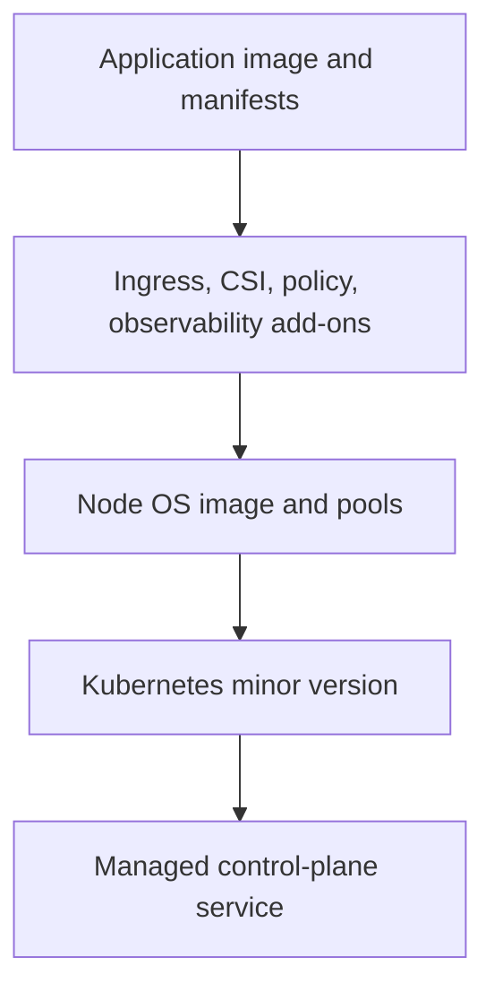
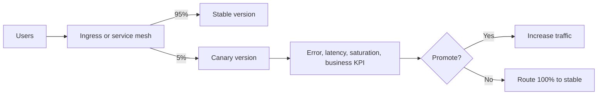
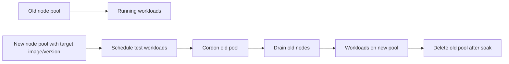

> **Document class:** How-to Guides implementation guide
> **Normative terms:** **MUST**, **MUST NOT**, **SHOULD**, **SHOULD NOT**, and **MAY** are requirements levels.
> **Applicability:** AKS workload delivery, Helm packaging, health gates, disruption controls, progressive rollout, rollback, and multi-cloud portability.
> **Exception process:** Deviations require a documented risk assessment, compensating controls, named risk owner, and expiry date.

| Control field | Value |
|---|---|
| Document ID | `HTG-08` |
| Owner | Cloud Center of Excellence |
| Review cycle | At least annually and after material Kubernetes, platform, or release changes |
| Evidence | Chart and image provenance, policy checks, rollout metrics, disruption tests, service health, rollback result, and audit trail |

# How to Deploy and Upgrade an AKS Workload

> **Decision in brief:** Promote immutable images through health-gated releases with explicit disruption budgets and a rehearsed rollback path.

> **Document type:** Implementation guide
> **Primary examples:** Azure and Terraform
> **Cloud scope:** Azure, AWS, GCP, and Oracle Cloud Infrastructure (OCI)
> **Operating principle:** Use short-lived identity, immutable artifacts, least privilege, policy-as-code, and automated validation.


## Objective

Deploy and upgrade an application workload on Azure Kubernetes Service (AKS) without conflating application releases, node-image updates, and Kubernetes control-plane upgrades. These are separate change types with different risks.

The workload practices also apply to Amazon EKS, Google Kubernetes Engine (GKE), and Oracle Kubernetes Engine (OKE).

## Change layers



Upgrade and validate one layer at a time unless a tested emergency procedure explicitly combines them.

## Prerequisites

- Cluster access through Entra integration or workload-approved identity.
- Namespaced RBAC and least privilege.
- Container image pinned by digest.
- Helm chart or Kustomize overlays stored in source.
- Readiness, liveness, and startup probes.
- Resource requests and limits.
- PodDisruptionBudget (PDB).
- Multiple replicas across topology zones or nodes.
- Observability and alerting.
- Backup or restore plan for persistent data.
- API-deprecation scan before Kubernetes upgrades.

## Cloud mapping

| Capability | AKS | EKS | GKE | OKE |
|---|---|---|---|---|
| Managed Kubernetes | Azure Kubernetes Service | Amazon Elastic Kubernetes Service | Google Kubernetes Engine | Oracle Kubernetes Engine |
| Workload identity | Microsoft Entra Workload ID | IAM Roles for Service Accounts / Pod Identity | Workload Identity Federation for GKE | OCI workload identity or instance principals by supported pattern |
| Image registry | Azure Container Registry | Amazon ECR | Artifact Registry | OCI Container Registry |
| Upgrade channels | AKS auto-upgrade channels | EKS version and managed node-group updates | GKE release channels | OKE control-plane and node-pool upgrades |
| Private API | Private AKS cluster | EKS private endpoint | GKE private/DNS endpoint | OKE private endpoint |

## Baseline workload manifest

```yaml
apiVersion: apps/v1
kind: Deployment
metadata:
  name: orders-api
  namespace: orders
spec:
  replicas: 3
  strategy:
    type: RollingUpdate
    rollingUpdate:
      maxUnavailable: 0
      maxSurge: 1
  selector:
    matchLabels:
      app: orders-api
  template:
    metadata:
      labels:
        app: orders-api
    spec:
      serviceAccountName: orders-api
      containers:
        - name: api
          image: contoso.azurecr.io/orders-api@sha256:REPLACE
          ports:
            - containerPort: 8080
          readinessProbe:
            httpGet:
              path: /health/ready
              port: 8080
            periodSeconds: 5
            failureThreshold: 6
          livenessProbe:
            httpGet:
              path: /health/live
              port: 8080
            periodSeconds: 10
          startupProbe:
            httpGet:
              path: /health/startup
              port: 8080
            periodSeconds: 5
            failureThreshold: 30
          resources:
            requests:
              cpu: 200m
              memory: 256Mi
            limits:
              cpu: "1"
              memory: 1Gi
```

PDB:

```yaml
apiVersion: policy/v1
kind: PodDisruptionBudget
metadata:
  name: orders-api
  namespace: orders
spec:
  minAvailable: 2
  selector:
    matchLabels:
      app: orders-api
```

A PDB does not protect against application bugs or all node failures. It only constrains voluntary disruptions.

## Pre-deployment validation

```bash
kubectl version
kubectl auth can-i create deployments -n orders
kubectl get nodes
kubectl get pods -A
kubectl get events -A --sort-by=.lastTimestamp | tail -50
helm lint ./charts/orders-api
helm template orders-api ./charts/orders-api \
  -f environments/prod/values.yaml > rendered.yaml
kubectl apply --dry-run=server -f rendered.yaml
```

Also scan:

```bash
kubeconform -strict rendered.yaml
trivy config rendered.yaml
```

Use server-side dry run because client-side schema validation cannot detect admission policies and cluster-specific API behavior.

## Deploy with Helm

```bash
helm upgrade --install orders-api ./charts/orders-api \
  --namespace orders \
  --create-namespace \
  --values environments/prod/values.yaml \
  --set image.digest="$IMAGE_DIGEST" \
  --atomic \
  --wait \
  --timeout 10m \
  --history-max 20
```

`--atomic` rolls the Helm release back when the upgrade fails, but it cannot reverse external database migrations or irreversible side effects.

Watch rollout:

```bash
kubectl rollout status deployment/orders-api \
  -n orders \
  --timeout=10m

kubectl get pods -n orders -o wide
kubectl get events -n orders --sort-by=.lastTimestamp
```

## Progressive delivery

For high-risk services, use canary or blue-green release control:



Promotion gates should include technical and business metrics. A pod being `Ready` does not prove the release is correct.

## Application rollback

Helm:

```bash
helm history orders-api -n orders
helm rollback orders-api <revision> \
  -n orders \
  --wait \
  --timeout 10m
```

Kubernetes Deployment:

```bash
kubectl rollout history deployment/orders-api -n orders
kubectl rollout undo deployment/orders-api -n orders
```

Rollback requires backward-compatible data and APIs. Use expand-and-contract database changes.

## Upgrade AKS safely

Discover supported versions dynamically:

```bash
az aks get-upgrades \
  --resource-group "$RESOURCE_GROUP" \
  --name "$CLUSTER_NAME" \
  --output table
```

Before a Kubernetes version upgrade:

- Scan manifests and Helm charts for removed APIs.
- Verify add-on compatibility.
- Confirm PDBs will not block drains.
- Confirm surge capacity and quota.
- Check node OS support.
- Test in a representative non-production cluster.
- Define maintenance windows.
- Back up persistent workloads.
- Validate private cluster access path.

Upgrade control plane:

```bash
az aks upgrade \
  --resource-group "$RESOURCE_GROUP" \
  --name "$CLUSTER_NAME" \
  --kubernetes-version "$TARGET_VERSION" \
  --control-plane-only
```

Then upgrade node pools deliberately:

```bash
az aks nodepool upgrade \
  --resource-group "$RESOURCE_GROUP" \
  --cluster-name "$CLUSTER_NAME" \
  --name "$NODE_POOL" \
  --kubernetes-version "$TARGET_VERSION"
```

Use the current AKS documentation for supported skew and sequence. Do not hard-code a target version from an old guide.

## Node image upgrades

Node-image upgrades deliver OS and runtime fixes without necessarily changing the Kubernetes minor version.

```bash
az aks nodepool upgrade \
  --resource-group "$RESOURCE_GROUP" \
  --cluster-name "$CLUSTER_NAME" \
  --name "$NODE_POOL" \
  --node-image-only
```

Check:

```bash
kubectl get nodes \
  -o custom-columns=NAME:.metadata.name,VERSION:.status.nodeInfo.kubeletVersion,IMAGE:.status.nodeInfo.osImage
```

AKS currently publishes Linux node images more frequently than Windows images and recommends automated channels for regular security updates. Validate maintenance windows, PDB behavior, and surge quota before enabling automatic rollout.

## Blue-green node pool upgrade



This pattern gives more control than in-place replacement but requires spare quota and careful handling of topology, daemonsets, local storage, and node selectors.

## Troubleshooting

| Symptom | Cause | Resolution |
|---|---|---|
| Rollout stuck | Readiness fails or image cannot pull | Inspect pod events, probes, registry identity, and DNS |
| Node drain blocked | PDB too strict or singleton workload | Add capacity or correct disruption policy |
| Upgrade unavailable | Unsupported version path or regional rollout | Query `az aks get-upgrades` and release tracker |
| Pods pending after surge | CPU, memory, IP, or quota exhaustion | Inspect scheduler events and subnet capacity |
| API removed | Manifest uses deprecated Kubernetes API | Upgrade chart/manifests before cluster |
| Private cluster inaccessible | Runner lacks private DNS/route | Use private runner, bastion, VPN, or approved access path |
| Helm rollback fails | Hook or external migration is irreversible | Use application-specific recovery procedure |

## Post-change validation

```bash
kubectl get --raw='/readyz?verbose'
kubectl get nodes
kubectl get pods -A
kubectl get pdb -A
kubectl top nodes
kubectl top pods -A
```

Run synthetic transactions, inspect SLOs, verify workload identity, test autoscaling, and confirm no unexpected admission-policy violations.

## Validation

The workload is safely deployed when manifests pass server-side validation, images are immutable, probes and PDBs are effective, rollout metrics pass, rollback is tested, data changes are compatible, and cluster/node upgrades follow a supported sequence with deprecation, capacity, and disruption checks.

## Related topics

- [How to Deploy an Application to Azure App Service](how-to-deploy-an-application-to-azure-app-service.md)
- [How to Deploy Terraform with Azure DevOps](how-to-deploy-terraform-with-azure-devops.md)
- [How to Deploy Terraform with GitHub Actions](how-to-deploy-terraform-with-github-actions.md)

## Official references

- AKS upgrade options: https://learn.microsoft.com/en-us/azure/aks/upgrade-options
- AKS upgrade practices: https://learn.microsoft.com/en-us/azure/architecture/operator-guides/aks/aks-upgrade-practices
- AKS node image upgrades: https://learn.microsoft.com/en-us/azure/aks/upgrade-node-image
- Kubernetes deployments: https://kubernetes.io/docs/concepts/workloads/controllers/deployment/
- Kubernetes PDBs: https://kubernetes.io/docs/tasks/run-application/configure-pdb/
- Helm upgrade: https://helm.sh/docs/helm/helm_upgrade/

## Related repos

- [andyxuan2010/AIonK8sDemo](https://github.com/andyxuan2010/AIonK8sDemo) — Terraform and Kubernetes example that deploys an AI model API to AKS with networking, scripts, and operational infrastructure.
- [andyxuan2010/AksIngressControllerDemo](https://github.com/andyxuan2010/AksIngressControllerDemo) — private AKS ingress lab using Terraform, Helm, Kubernetes, Azure Container Registry, and Azure Pipelines.
- [andyxuan2010/azure-landingzone](https://github.com/andyxuan2010/azure-landingzone) — shared Azure platform foundation that supplies governed networking and services for production AKS environments.
