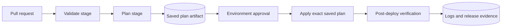
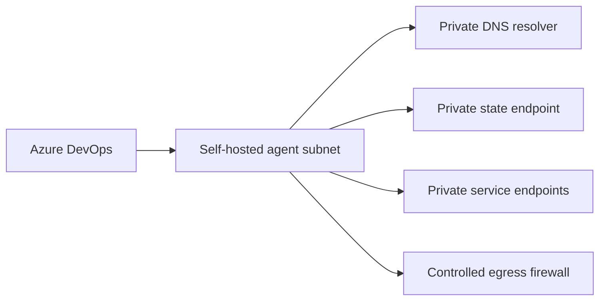

> **文档类型：** 操作指南
> **规范性术语：** **MUST**、**MUST NOT**、**SHOULD**、**SHOULD NOT** 和 **MAY** 是要求级别。
> **适用范围：** Azure Pipelines Terraform 验证、规划、批准、部署、证据、联邦身份和多云身份验证。
> **例外流程：** 偏离要求需要记录风险评估、补偿控制、指定风险负责人和到期日期。

|控制领域|价值|
|---|---|
|文件编号 | `HTG-03` |
|负责人|云卓越中心 |
|审核周期|至少每年一次，并且在重大流水线、提供程序或身份发生变化之后 |
|证据|提交和提供程序版本、验证日志、保存的计划、批准历史记录、部署结果、身份审核和状态证据 |

# 如何使用 Azure DevOps 部署 Terraform

> **决策简述：** 分开验证、规划、批准和应用阶段，并仅部署具有短期凭据的已审核计划。

> **文件类型：** 实施指南
> **主要示例：** Azure 和 Terraform
> **云范围：** Azure、AWS、GCP 和 Oracle Cloud Infrastructure (OCI)
> **操作原则：** 使用短期身份、不可变制品、最小权限、策略即代码和自动验证。


## 目标

使用确定性工具、短期凭据、保存的计划、受保护的批准和可追踪的证据，通过 Azure Pipelines 部署 Terraform。 Azure DevOps 是编排器；目标可以是 Azure、AWS、GCP、OCI 或多个云。

## 流水线架构

切勿针对生产中新生成的计划运行 `terraform apply -auto-approve`。应用精确审查的计划文件，遵守到期规则并检查源提交是否未更改。

## 先决条件

- Azure DevOps 项目和仓库。
- 为每个部署环境提供受保护的 Azure DevOps 环境。
- 远程状态后端。
- 目标云的工作负载身份或服务连接。
- 变量组或安全文件仅用于无法通过联邦身份验证处理的配置。
- 当私有端点阻止 Microsoft 托管代理时，使用自托管代理。
- 由流水线参数、工具缓存或容器镜像固定的 Terraform 版本。

## 认证模型

Azure 目标：

- 使用为工作负载身份联合配置的 Azure Resource Manager 服务连接。
- 在最窄的范围内仅授予服务主体所需的角色。
- 授予单独的状态容器权限。

其他云：

|目标|推荐的 Azure DevOps 模式 |
|---|---|
|AWS |在支持的情况下，将 Azure DevOps 颁发的或企业 OIDC 身份交换为 IAM 角色；否则使用严格控制的代理或自托管代理角色 |
| GCP |使用工作负载身份联合和服务账户模拟 |
|OCI |首选自托管 OCI 运行器或受控机密代理上的实例/资源主体；不要广泛分发用户 API 私钥 |

确切的联合机制取决于组织身份架构。不可协商的控制是短期凭证，具有受众、主题、仓库、分支和环境限制。

## 变量和文件

将非机密配置存储在源中：
```yaml
variables:
  terraformVersion: "1.10.5"
  workingDirectory: "$(Build.SourcesDirectory)"
  environmentName: "prod"
  backendConfig: "environments/prod/backend.hcl"
  variableFile: "environments/prod/environment.tfvars"
```
将上面的版本视为示例基线，而不是声称它是最新版本。通过经过测试的依赖过程更新它。

机密应通过联邦身份、Azure Key Vault 链接变量组或专用 Secret Manager 进入流程。标记机密变量并且从不打印环境转储。

## 验证
```yaml
trigger:
  branches:
    include:
      - main

pr:
  branches:
    include:
      - main

pool:
  vmImage: ubuntu-latest

variables:
  terraformVersion: "1.10.5"
  workingDirectory: "$(Build.SourcesDirectory)"

stages:
- stage: Validate
  jobs:
  - job: TerraformValidation
    steps:
    - checkout: self
      clean: true
      fetchDepth: 0

    - bash: |
        set -euo pipefail
        curl -fsSLo terraform.zip \
          "https://releases.hashicorp.com/terraform/${TERRAFORM_VERSION}/terraform_${TERRAFORM_VERSION}_linux_amd64.zip"
        unzip -q terraform.zip
        sudo install terraform /usr/local/bin/terraform
        terraform version
      env:
        TERRAFORM_VERSION: $(terraformVersion)
      displayName: Install pinned Terraform

    - bash: |
        set -euo pipefail
        terraform fmt -recursive -check
        terraform init -backend=false
        terraform validate
        terraform test
      workingDirectory: $(workingDirectory)
      displayName: Format, validate, and test
```
为了加强供应链控制，请使用内部维护的构建镜像以及经过验证的 Terraform、TFLint、策略工具和校验和。

## 计划阶段
```yaml
- stage: Plan
  dependsOn: Validate
  jobs:
  - job: TerraformPlan
    steps:
    - checkout: self
      clean: true

    - task: AzureCLI@2
      displayName: Terraform plan
      inputs:
        azureSubscription: "sc-azure-prod-plan"
        scriptType: bash
        scriptLocation: inlineScript
        workingDirectory: $(workingDirectory)
        inlineScript: |
          set -euo pipefail
          terraform init -reconfigure \
            -backend-config="$(backendConfig)"

          terraform plan \
            -input=false \
            -lock-timeout=5m \
            -var-file="$(variableFile)" \
            -out="$(Build.ArtifactStagingDirectory)/prod.tfplan"

          terraform show -no-color \
            "$(Build.ArtifactStagingDirectory)/prod.tfplan" \
            > "$(Build.ArtifactStagingDirectory)/prod-plan.txt"

    - publish: $(Build.ArtifactStagingDirectory)
      artifact: terraform-plan
```
不要将计划发布到未经授权的用户可以访问的制品存储中。即使终端输出对计划文件进行了脱敏，计划文件也可能包含敏感值。

## 环境审批应用阶段

在名为 `prod` 的 Azure DevOps 环境上配置审批和检查。然后：
```yaml
- stage: Apply
  dependsOn: Plan
  condition: and(succeeded(), eq(variables['Build.SourceBranch'], 'refs/heads/main'))
  jobs:
  - deployment: TerraformApply
    environment: prod
    strategy:
      runOnce:
        deploy:
          steps:
          - checkout: self
            clean: true

          - download: current
            artifact: terraform-plan

          - task: AzureCLI@2
            displayName: Apply reviewed plan
            inputs:
              azureSubscription: "sc-azure-prod-apply"
              scriptType: bash
              scriptLocation: inlineScript
              workingDirectory: $(workingDirectory)
              inlineScript: |
                set -euo pipefail
                terraform init -reconfigure \
                  -backend-config="$(backendConfig)"
                terraform apply \
                  -input=false \
                  "$(Pipeline.Workspace)/terraform-plan/prod.tfplan"
```
使用与拉取请求计划不同的服务连接进行应用。应用应该只从受保护的默认分支运行。

## 多云身份验证片段

AWS 在准备好的运行器上下文中承担角色：
```bash
export AWS_ROLE_ARN="arn:aws:iam::<account-id>:role/terraform-prod"
# Acquire short-lived credentials through the approved federation mechanism.
aws sts get-caller-identity
terraform plan
```
通用控制点：
```bash
gcloud auth login --cred-file="$GOOGLE_APPLICATION_CREDENTIALS"
gcloud auth list
terraform plan
```
具有实例主体的 OCI 自托管代理：
```bash
export OCI_CLI_AUTH=instance_principal
oci iam region list
terraform plan
```
示例显示了验证步骤。信任关系必须在流水线外部配置，并将范围限定为确切的项目、分支和环境。

## 私有网络部署

Microsoft 托管的代理无法到达私有端点，除非该端点通过批准的路径公开。在具有以下功能的子网中使用自托管代理：

- 私有 DNS 解析。
- 到目标私有端点的路由。
- 控制提供程序、模块注册表和包仓库的出站访问。
- 无入境管理风险。
- 如果可能，使用临时工作节点，或定期重新生成镜像的工作节点。

## 失败处理

使用`set -euo pipefail`。始终发布诊断日志，但要对其进行清理。常见故障：

|失败|原因 |解决方案|
|---|---|---|
|后台授权|状态身份缺乏数据平面许可|正确的后端角色；不授予广泛订阅所有者|
|状态锁超时|另一个运行是活动的还是陈旧的 |识别所有者；切勿在未确认的情况下强制解锁 |
|保存的计划被拒绝 |提供程序或变量在 apply | 时不同使用相同的提交、工具、工作目录和初始化 |
|私有端点超时 |代理 DNS 或路由错误 |测试 FQDN、解析的 IP、路由、NSG/防火墙和 TLS |
|审批从未开始 |环境名称或权限不匹配 |预创建环境并授权流水线 |
|计划包含更换|提供程序/模块更改了 ForceNew 字段 |停下来回顾一下；不要把更换当成常规|

## 部署后验证

运行只读验证作业：
```bash
terraform output -json > outputs.json
terraform plan -detailed-exitcode -input=false \
  -var-file=environments/prod/environment.tfvars
```
退出代码 `0` 表示没有更改，`2` 表示差异，`1` 表示错误。不要自动应用部署后差异；将其视为漂移或非决定论。

## 回滚

1. 禁用进一步的流水线运行。
2. 保留计划、提交、日志和状态版本。
3. 评估目标云中的部分变化。
4. 创建修复提交并生成计划。
5. 仅当基础设施契约支持时才使用以前的应用制品。
6. 恢复状态仅针对状态损坏，而不是反转真实资源。
7.记录失败并添加验证。

## 完成的定义

当计划和应用身份分离、工具被固定、状态被锁定和私有、计划可审查和保护、应用使用保存的计划、强制执行生产批准、测试私有连接并保留证据时，流水线已做好生产准备。

## 相关主题

- [如何使用 GitHub Actions 部署 Terraform](how-to-deploy-terraform-with-github-actions.md)
- [如何配置远程状态和环境文件](how-to-configure-remote-state-and-environment-files.md)
- [如何启动新的基础设施仓库](how-to-start-a-new-infrastructure-repository.md)

## 官方参考文档

- Azure Pipelines 文档：https://learn.microsoft.com/en-us/azure/devops/pipelines/
- Azure DevOps 环境：https://learn.microsoft.com/en-us/azure/devops/pipelines/process/environments
- Azure Pipelines 任务：https://learn.microsoft.com/en-us/azure/devops/pipelines/process/tasks
- Terraform CLI 计划：https://developer.hashicorp.com/terraform/cli/commands/plan
- Terraform 自动化指导：https://developer.hashicorp.com/terraform/tutorials/automation/automate-terraform

## 相关仓库

- [andyxuan2010/azure-template](https://github.com/andyxuan2010/azure-template) — 包括 Azure DevOps 流水线模式、Terraform 规划工具、可复用模块、示例和验证。
- [andyxuan2010/azure-landingzone](https://github.com/andyxuan2010/azure-landingzone) — 具有流水线模板、受控部署模式、运行手册和共享平台服务的 Enterprise Landing Zone 实施。
- [andyxuan2010/ci-cd-template](https://github.com/andyxuan2010/ci-cd-template) — 专注于 Azure 的 CI/CD 入门工具，具有环境设置指南以及 PowerShell、Bash 和 GitHub Actions 自动化，可补充 Azure Pipelines 设计。
