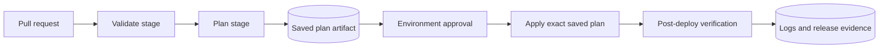
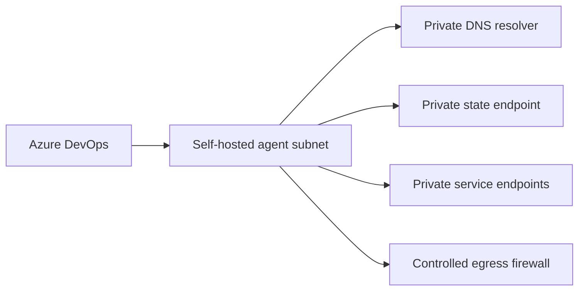

> **Document class:** How-to Guides implementation guide
> **Normative terms:** **MUST**, **MUST NOT**, **SHOULD**, **SHOULD NOT**, and **MAY** are requirements levels.
> **Applicability:** Azure Pipelines Terraform validation, planning, approvals, deployment, evidence, federated identity, and multi-cloud authentication.
> **Exception process:** Deviations require a documented risk assessment, compensating controls, named risk owner, and expiry date.

| Control field | Value |
|---|---|
| Document ID | `HTG-03` |
| Owner | Cloud Center of Excellence |
| Review cycle | At least annually and after material pipeline, provider, or identity changes |
| Evidence | Commit and provider versions, validation logs, saved plan, approval history, deployment result, identity audit, and state evidence |

# How to Deploy Terraform with Azure DevOps

> **Decision in brief:** Separate validation, planning, approval, and apply stages, and deploy only the reviewed plan with short-lived credentials.

> **Document type:** Implementation guide
> **Primary examples:** Azure and Terraform
> **Cloud scope:** Azure, AWS, GCP, and Oracle Cloud Infrastructure (OCI)
> **Operating principle:** Use short-lived identity, immutable artifacts, least privilege, policy-as-code, and automated validation.


## Objective

Deploy Terraform through Azure Pipelines with deterministic tools, short-lived credentials, a saved plan, protected approvals, and traceable evidence. Azure DevOps is the orchestrator; the target can be Azure, AWS, GCP, OCI, or several clouds.

## Pipeline architecture



Never run `terraform apply -auto-approve` against a newly generated plan in production. Apply the exact reviewed plan file, subject to an expiry rule and a check that the source commit has not changed.

## Prerequisites

- Azure DevOps project and repository.
- Protected Azure DevOps Environment for each deployment environment.
- Remote state backend.
- Workload identity or service connection for the target cloud.
- Variable group or secure file only for non-federatable configuration.
- A self-hosted agent when private endpoints block Microsoft-hosted agents.
- Terraform version pinned by pipeline parameter, tool cache, or container image.

## Authentication model

Azure target:

- Use an Azure Resource Manager service connection configured for workload identity federation.
- Grant the service principal only the required role at the narrowest scope.
- Grant separate state-container permissions.

Other clouds:

| Target | Recommended Azure DevOps pattern |
|---|---|
| AWS | Exchange an Azure DevOps-issued or enterprise OIDC identity for an IAM role where supported; otherwise use a tightly controlled broker or self-hosted agent role |
| GCP | Use Workload Identity Federation and service-account impersonation |
| OCI | Prefer instance/resource principals on a self-hosted OCI runner, or a controlled secret broker; do not distribute user API private keys broadly |

The exact federation mechanics depend on organizational identity architecture. The non-negotiable control is short-lived credentials with audience, subject, repository, branch, and environment restrictions.

## Variables and files

Store non-secret configuration in source:

```yaml
variables:
  terraformVersion: "1.10.5"
  workingDirectory: "$(Build.SourcesDirectory)"
  environmentName: "prod"
  backendConfig: "environments/prod/backend.hcl"
  variableFile: "environments/prod/environment.tfvars"
```

Treat the version above as an example baseline, not a claim that it is current. Update it through a tested dependency process.

Secrets should enter the process through federated identity, Azure Key Vault-linked variable groups, or a dedicated secret manager. Mark secret variables and never print environment dumps.

## Validation

```yaml
trigger:
  branches:
    include:
      - main

pr:
  branches:
    include:
      - main

pool:
  vmImage: ubuntu-latest

variables:
  terraformVersion: "1.10.5"
  workingDirectory: "$(Build.SourcesDirectory)"

stages:
- stage: Validate
  jobs:
  - job: TerraformValidation
    steps:
    - checkout: self
      clean: true
      fetchDepth: 0

    - bash: |
        set -euo pipefail
        curl -fsSLo terraform.zip \
          "https://releases.hashicorp.com/terraform/${TERRAFORM_VERSION}/terraform_${TERRAFORM_VERSION}_linux_amd64.zip"
        unzip -q terraform.zip
        sudo install terraform /usr/local/bin/terraform
        terraform version
      env:
        TERRAFORM_VERSION: $(terraformVersion)
      displayName: Install pinned Terraform

    - bash: |
        set -euo pipefail
        terraform fmt -recursive -check
        terraform init -backend=false
        terraform validate
        terraform test
      workingDirectory: $(workingDirectory)
      displayName: Format, validate, and test
```

For stronger supply-chain control, use an internally maintained build image with verified Terraform, TFLint, policy tools, and checksums.

## Plan stage

```yaml
- stage: Plan
  dependsOn: Validate
  jobs:
  - job: TerraformPlan
    steps:
    - checkout: self
      clean: true

    - task: AzureCLI@2
      displayName: Terraform plan
      inputs:
        azureSubscription: "sc-azure-prod-plan"
        scriptType: bash
        scriptLocation: inlineScript
        workingDirectory: $(workingDirectory)
        inlineScript: |
          set -euo pipefail
          terraform init -reconfigure \
            -backend-config="$(backendConfig)"

          terraform plan \
            -input=false \
            -lock-timeout=5m \
            -var-file="$(variableFile)" \
            -out="$(Build.ArtifactStagingDirectory)/prod.tfplan"

          terraform show -no-color \
            "$(Build.ArtifactStagingDirectory)/prod.tfplan" \
            > "$(Build.ArtifactStagingDirectory)/prod-plan.txt"

    - publish: $(Build.ArtifactStagingDirectory)
      artifact: terraform-plan
```

Do not publish a plan to an artifact store accessible by unauthorized users. Plan files can contain sensitive values even when terminal output redacts them.

## Apply stage with environment approval

Configure approval and checks on the Azure DevOps Environment named `prod`. Then:

```yaml
- stage: Apply
  dependsOn: Plan
  condition: and(succeeded(), eq(variables['Build.SourceBranch'], 'refs/heads/main'))
  jobs:
  - deployment: TerraformApply
    environment: prod
    strategy:
      runOnce:
        deploy:
          steps:
          - checkout: self
            clean: true

          - download: current
            artifact: terraform-plan

          - task: AzureCLI@2
            displayName: Apply reviewed plan
            inputs:
              azureSubscription: "sc-azure-prod-apply"
              scriptType: bash
              scriptLocation: inlineScript
              workingDirectory: $(workingDirectory)
              inlineScript: |
                set -euo pipefail
                terraform init -reconfigure \
                  -backend-config="$(backendConfig)"
                terraform apply \
                  -input=false \
                  "$(Pipeline.Workspace)/terraform-plan/prod.tfplan"
```

Use a different service connection for apply than for pull-request planning. Apply should only run from the protected default branch.

## Multi-cloud authentication snippets

AWS with an assumed role in a prepared runner context:

```bash
export AWS_ROLE_ARN="arn:aws:iam::<account-id>:role/terraform-prod"
# Acquire short-lived credentials through the approved federation mechanism.
aws sts get-caller-identity
terraform plan
```

GCP:

```bash
gcloud auth login --cred-file="$GOOGLE_APPLICATION_CREDENTIALS"
gcloud auth list
terraform plan
```

OCI self-hosted agent with instance principals:

```bash
export OCI_CLI_AUTH=instance_principal
oci iam region list
terraform plan
```

The examples show the verification step. The trust relationship must be configured outside the pipeline and scoped to the exact project, branch, and environment.

## Private network deployments

A Microsoft-hosted agent cannot reach a private endpoint unless the endpoint is exposed through an approved path. Use a self-hosted agent in a subnet that has:

- Private DNS resolution.
- Routes to target private endpoints.
- Controlled outbound access for providers, module registries, and package repositories.
- No inbound administrative exposure.
- Ephemeral or regularly reimaged workers where possible.



## Failure handling

Use `set -euo pipefail`. Always publish diagnostic logs, but sanitize them. Common failures:

| Failure | Cause | Resolution |
|---|---|---|
| Backend authorization | State identity lacks data-plane permission | Correct backend role; do not grant broad subscription owner |
| State lock timeout | Another run is active or stale | Identify owner; never force-unlock without confirming |
| Saved plan rejected | Provider or variables differ at apply | Use same commit, tools, working directory, and initialization |
| Private endpoint timeout | Agent DNS or route is wrong | Test FQDN, resolved IP, route, NSG/firewall, and TLS |
| Approval never starts | Environment name or permissions mismatch | Pre-create environment and authorize pipeline |
| Plan contains replacement | Provider/module change altered ForceNew field | Stop and review; do not treat replacement as routine |

## Post-deployment verification

Run a read-only verification job:

```bash
terraform output -json > outputs.json
terraform plan -detailed-exitcode -input=false \
  -var-file=environments/prod/environment.tfvars
```

Exit code `0` means no changes, `2` means a diff, and `1` means an error. Do not automatically apply a post-deploy diff; investigate it as drift or nondeterminism.

## Rollback

1. Disable further pipeline runs.
2. Preserve the plan, commit, logs, and state version.
3. Assess partial changes in the target cloud.
4. Create a corrective commit and plan.
5. Use a previous application artifact only when the infrastructure contract supports it.
6. Restore state only for state corruption, not to reverse real resources.
7. Record the failure and add validation.

## Definition of done

The pipeline is production-ready when plan and apply identities are separated, tools are pinned, state is locked and private, plans are reviewable and protected, apply uses the saved plan, production approval is enforced, private connectivity is tested, and evidence is retained.

## Related topics

- [How to Deploy Terraform with GitHub Actions](how-to-deploy-terraform-with-github-actions.md)
- [How to Configure Remote State and Environment Files](how-to-configure-remote-state-and-environment-files.md)
- [How to Start a New Infrastructure Repository](how-to-start-a-new-infrastructure-repository.md)

## Official references

- Azure Pipelines documentation: https://learn.microsoft.com/en-us/azure/devops/pipelines/
- Azure DevOps environments: https://learn.microsoft.com/en-us/azure/devops/pipelines/process/environments
- Azure Pipelines tasks: https://learn.microsoft.com/en-us/azure/devops/pipelines/process/tasks
- Terraform CLI plan: https://developer.hashicorp.com/terraform/cli/commands/plan
- Terraform automation guidance: https://developer.hashicorp.com/terraform/tutorials/automation/automate-terraform

## Related repos

- [andyxuan2010/azure-template](https://github.com/andyxuan2010/azure-template) — includes Azure DevOps pipeline patterns, Terraform planning harnesses, reusable modules, examples, and validation.
- [andyxuan2010/azure-landingzone](https://github.com/andyxuan2010/azure-landingzone) — enterprise landing-zone implementation with pipeline templates, governed deployment patterns, runbooks, and shared platform services.
- [andyxuan2010/ci-cd-template](https://github.com/andyxuan2010/ci-cd-template) — Azure-focused CI/CD starter with environment setup guidance and PowerShell, Bash, and GitHub Actions automation that complements the Azure Pipelines design.
