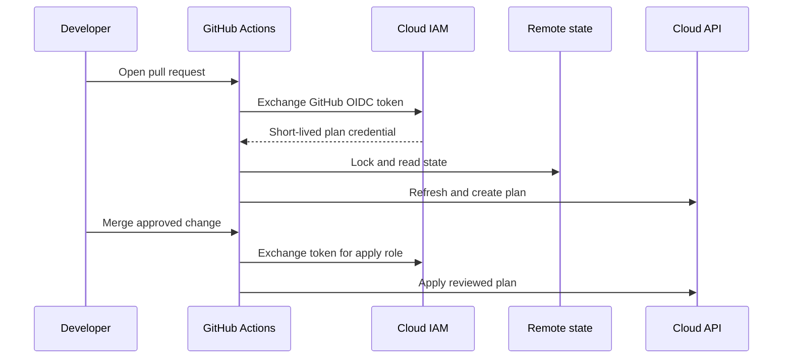
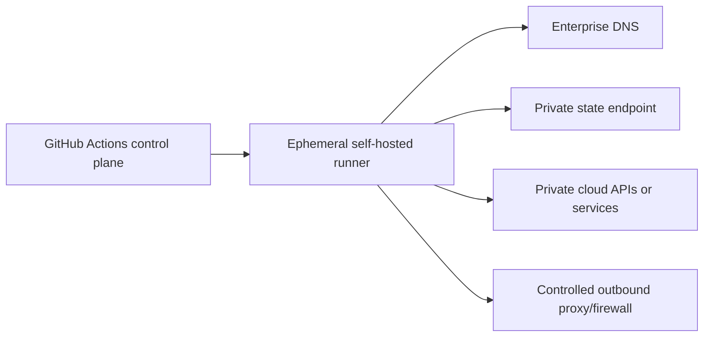

> **文档类型：** 操作指南
> **规范性术语：** **MUST**、**MUST NOT**、**SHOULD**、**SHOULD NOT** 和 **MAY** 是要求级别。
> **适用范围：** GitHub Actions Terraform 验证、OIDC 身份验证、受保护环境、可复用工作流程、计划和多云控件。
> **例外流程：** 偏离要求需要记录风险评估、补偿控制、指定风险负责人和到期日期。

|控制领域|价值|
|---|---|
|文件编号 | `HTG-04` |
|负责人|云卓越中心 |
|审核周期|至少每年一次并在重大行动、提供程序或身份发生变化之后 |
|证据|提交和工作流程修订、OIDC 声明、验证日志、保存的计划、环境批准、部署结果和状态证据 |

# 如何使用 GitHub Actions 部署 Terraform

> **决策简述：** 使用 GitHub Actions 验证并晋级具有 OIDC 凭证和受保护环境边界的已保存 Terraform 计划。

> **文件类型：** 实施指南
> **主要示例：** Azure 和 Terraform
> **云范围：** Azure、AWS、GCP 和 Oracle Cloud Infrastructure (OCI)
> **操作原则：** 使用短期身份、不可变制品、最小权限、策略即代码和自动验证。


## 目标

创建一个 GitHub Actions 工作流程，用于验证每个拉取请求的 Terraform、生成可审查的计划，并且仅应用于受保护的分支和环境。身份验证应使用 OpenID Connect (OIDC) 和短期云凭据。

## 参考流程

## 仓库设置

配置：

- `main` 上的分支保护。
- 所需的状态检查。
- 需要 `CODEOWNERS` 的审核。
- 名为 `dev`、`test` 和 `prod` 的 GitHub 环境。
- `prod` 所需的审阅者。
- 账户、订阅、项目、区域和状态位置的环境范围变量。
- 仅当值无法联合时才使用环境范围的机密。

明确设置工作流程权限。该工作流程需要 `id-token: write` 来请求 OIDC 令牌，并需要 `contents: read` 来签出代码。

## Azure OIDC 信任

使用联合凭据创建 Entra 应用或用户分配的托管身份，该联合凭据的主题限制对预期仓库和环境的访问。典型的主题是环境范围的：
```text
repo:contoso/platform-infra:environment:prod
```
然后授予身份：

- 拉取请求规划的读取或规划权限。
- 缩小应用的部署权限。
- 状态数据平面访问。
- 除非不可避免，否则没有目录范围的角色。

## 拉取请求工作流程
```yaml
name: terraform-pr

on:
  pull_request:
    branches: [main]
    paths:
      - "**/*.tf"
      - "**/*.tfvars"
      - ".github/workflows/terraform-*.yml"

permissions:
  contents: read
  id-token: write
  pull-requests: write

concurrency:
  group: terraform-${{ github.event.pull_request.number }}
  cancel-in-progress: true

jobs:
  validate-and-plan:
    runs-on: ubuntu-latest
    environment: dev-plan

    steps:
      - uses: actions/checkout@v4

      - uses: hashicorp/setup-terraform@v3
        with:
          terraform_version: 1.10.5
          terraform_wrapper: false

      - name: Authenticate to Azure
        uses: azure/login@v2
        with:
          client-id: ${{ vars.AZURE_CLIENT_ID }}
          tenant-id: ${{ vars.AZURE_TENANT_ID }}
          subscription-id: ${{ vars.AZURE_SUBSCRIPTION_ID }}

      - name: Validate
        shell: bash
        run: |
          set -euo pipefail
          terraform fmt -recursive -check
          terraform init -backend=false
          terraform validate
          terraform test

      - name: Plan
        shell: bash
        run: |
          set -euo pipefail
          terraform init -reconfigure \
            -backend-config=environments/dev/backend.hcl
          terraform plan \
            -input=false \
            -lock-timeout=5m \
            -var-file=environments/dev/environment.tfvars \
            -out=dev.tfplan
          terraform show -no-color dev.tfplan > dev-plan.txt

      - name: Upload plan
        uses: actions/upload-artifact@v4
        with:
          name: terraform-dev-plan
          path: |
            dev.tfplan
            dev-plan.txt
          retention-days: 5
```
在高保证环境中，将第三方 Actions 固定到完整提交 SHA。版本标签易读但可变，除非发布者另有保证。

## 生产部署工作流程

更安全的生产工作流程是在提交通过验证后手动分派或由发布触发的。
```yaml
name: terraform-prod

on:
  workflow_dispatch:
    inputs:
      confirm:
        description: "Type deploy-prod"
        required: true

permissions:
  contents: read
  id-token: write

concurrency:
  group: terraform-prod
  cancel-in-progress: false

jobs:
  plan:
    if: ${{ inputs.confirm == 'deploy-prod' }}
    runs-on: ubuntu-latest
    environment: prod-plan
    steps:
      - uses: actions/checkout@v4
      - uses: hashicorp/setup-terraform@v3
        with:
          terraform_version: 1.10.5
          terraform_wrapper: false
      - uses: azure/login@v2
        with:
          client-id: ${{ vars.AZURE_PLAN_CLIENT_ID }}
          tenant-id: ${{ vars.AZURE_TENANT_ID }}
          subscription-id: ${{ vars.AZURE_SUBSCRIPTION_ID }}
      - run: |
          set -euo pipefail
          terraform init -reconfigure \
            -backend-config=environments/prod/backend.hcl
          terraform plan \
            -input=false \
            -lock-timeout=5m \
            -var-file=environments/prod/environment.tfvars \
            -out=prod.tfplan
      - uses: actions/upload-artifact@v4
        with:
          name: prod-plan
          path: prod.tfplan
          retention-days: 1

  apply:
    needs: plan
    runs-on: ubuntu-latest
    environment: prod
    steps:
      - uses: actions/checkout@v4
      - uses: hashicorp/setup-terraform@v3
        with:
          terraform_version: 1.10.5
          terraform_wrapper: false
      - uses: actions/download-artifact@v4
        with:
          name: prod-plan
      - uses: azure/login@v2
        with:
          client-id: ${{ vars.AZURE_APPLY_CLIENT_ID }}
          tenant-id: ${{ vars.AZURE_TENANT_ID }}
          subscription-id: ${{ vars.AZURE_SUBSCRIPTION_ID }}
      - run: |
          set -euo pipefail
          terraform init -reconfigure \
            -backend-config=environments/prod/backend.hcl
          terraform apply -input=false prod.tfplan
```
`prod` 环境应该需要审阅者。应用身份应仅信任 `prod` 环境主体。

## 多云 OIDC 映射

AWS：
```yaml
permissions:
  id-token: write
  contents: read

steps:
  - uses: aws-actions/configure-aws-credentials@v4
    with:
      role-to-assume: arn:aws:iam::123456789012:role/terraform-prod
      aws-region: ca-central-1
```
IAM 信任策略必须将 GitHub `sub` 声明限制为组织、仓库、分支或环境。

通用控制点：
```yaml
- uses: google-github-actions/auth@v2
  with:
    workload_identity_provider: ${{ vars.GCP_WIF_PROVIDER }}
    service_account: ${{ vars.GCP_SERVICE_ACCOUNT }}
```
OCI：

GitHub 托管的运行器不提供原生 OCI resource principals。使用经批准的联合或凭证代理模式，或使用实例主体的 OCI 中的自托管运行器。不要将具有广泛特权的用户私钥放入仓库机密中。

## 可复用的工作流程

集中策略密集型部署逻辑：
```yaml
jobs:
  terraform:
    uses: contoso/platform-workflows/.github/workflows/terraform.yml@v2
    with:
      environment: prod
      working-directory: infrastructure
    secrets: inherit
```
为了获取更强的不变性，请引用提交 SHA 而不是可变标签。可复用的工作流程可以一致地执行 OIDC、工具版本、所需检查、计划制品处理和证据收集。

## 安全控制

- 在工作流程或组织级别使用 `permissions: {}`，然后为每个作业授予最低权限。
- 不要使用 `pull_request_target` 执行带有机密的不受信任的拉取请求代码。
- 限制环境和 OIDC 主题。
- 固定 Actions 版本。
- 查看生成的脚本和复合 Action。
- 避免在信任区域之间共享自托管运行器。
- 将临时自托管运行器用于私有网络。
- 屏蔽敏感输出并避免 `set -x`。
- 将计划制品视为敏感信息。
- 需要对 Action 变更进行依赖项审查。

## 私有端点运行器

私有运行器必须解析私有 DNS 区域并具有到达目标的路由。证实：
```bash
getent hosts <state-fqdn>
curl -I https://<state-fqdn>/
openssl s_client -connect <state-fqdn>:443 -servername <state-fqdn>
```
HTTP 授权错误证明网络和 TLS 连接；超时或公共 IP 响应表示 DNS 或路由故障。

## 故障排除

|症状|原因 |解决方案|
|---|---|---|
| OIDC 令牌被拒绝 |主题、受众、发布者或环境不匹配 |检查声明和云信任条件 |
| `id-token` 不可用 |缺少 `id-token: write` |添加明确的作业或工作流程权限 |
|批准流程未启动 |所需的审阅者或保护规则待定 |审核环境部署 |
|制品失踪|计划和应用必须分开运行，否则保留已过期 |使用一次运行或显式运行 ID 和短期到期 |
|状态锁冲突|并发运行|添加并发组并检查锁所有者 |
| Fork PR 无法验证 |机密和受保护的 OIDC 故意不可用 |仅对分叉运行静态验证 |
|私有端点未解决 |运行器缺少私有 DNS 链接/转发器 |正确的 DNS 区域关联和转发 |

## 验证

当 OIDC 信任范围狭窄、拉取请求能够触发确定性验证并生成计划、生产环境受到 GitHub 环境保护、应用使用经过审查的已保存计划、Action 已固定、状态和制品受到保护、并发控制可防止应用冲突且专用运行器已隔离时，工作流就准备好了。

## 相关主题

- [如何使用 Azure DevOps 部署 Terraform](how-to-deploy-terraform-with-azure-devops.md)
- [如何配置远程状态和环境文件](how-to-configure-remote-state-and-environment-files.md)
- [如何使用 Terraform 模块目录](how-to-use-the-terraform-module-catalog.md)

## 官方参考文档

- GitHub OIDC 概述：https://docs.github.com/en/actions/concepts/security/openid-connect
- 与云提供程序的 OIDC：https://docs.github.com/en/actions/how-tos/secure-your-work/security-harden-deployments/oidc-in-cloud-providers
- GitHub 环境部署：https://docs.github.com/en/actions/deployment/targeting-different-environments/managing-environments-for-deployment
- 可复用的工作流程：https://docs.github.com/en/actions/sharing-automations/reusing-workflows
- AWS OIDC 与 GitHub：https://docs.github.com/en/actions/how-tos/secure-your-work/security-harden-deployments/oidc-in-aws
- GCP OIDC 与 GitHub：https://docs.github.com/en/actions/how-tos/secure-your-work/security-harden-deployments/oidc-in-google-cloud-platform

## 相关仓库

- [andyxuan2010/ci-cd-template](https://github.com/andyxuan2010/ci-cd-template) — CI/CD 入门仓库包含 GitHub Actions 和支持环境设置实用程序。
- [andyxuan2010/azure-template](https://github.com/andyxuan2010/azure-template) — 可复用的 Terraform 模块、测试、示例和验证模式，可供受保护的 GitHub Actions 工作流程使用。
- [andyxuan2010/azure-landingzone](https://github.com/andyxuan2010/azure-landingzone) — 受治理的 Terraform Landing Zone 实现，适合应用本指南中描述的工作流程控制。
