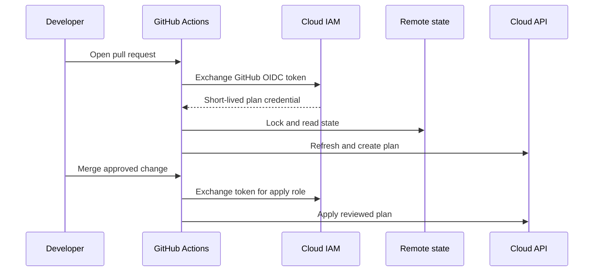
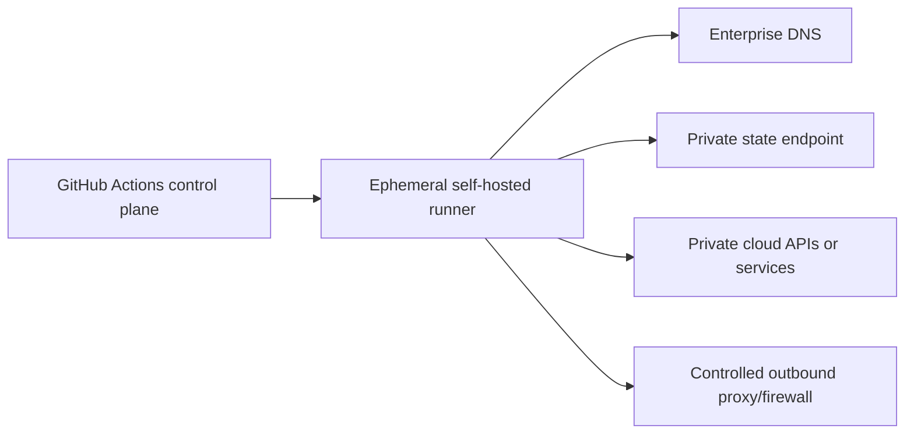

> **Document class:** How-to Guides implementation guide
> **Normative terms:** **MUST**, **MUST NOT**, **SHOULD**, **SHOULD NOT**, and **MAY** are requirements levels.
> **Applicability:** GitHub Actions Terraform validation, OIDC authentication, protected environments, reusable workflows, plans, and multi-cloud controls.
> **Exception process:** Deviations require a documented risk assessment, compensating controls, named risk owner, and expiry date.

| Control field | Value |
|---|---|
| Document ID | `HTG-04` |
| Owner | Cloud Center of Excellence |
| Review cycle | At least annually and after material Actions, provider, or identity changes |
| Evidence | Commit and workflow revision, OIDC claims, validation logs, saved plan, environment approvals, deployment result, and state evidence |

# How to Deploy Terraform with GitHub Actions

> **Decision in brief:** Use GitHub Actions to validate and promote a saved Terraform plan with OIDC credentials and protected environment boundaries.

> **Document type:** Implementation guide
> **Primary examples:** Azure and Terraform
> **Cloud scope:** Azure, AWS, GCP, and Oracle Cloud Infrastructure (OCI)
> **Operating principle:** Use short-lived identity, immutable artifacts, least privilege, policy-as-code, and automated validation.


## Objective

Create a GitHub Actions workflow that validates Terraform on every pull request, generates a reviewable plan, and applies only from a protected branch and environment. Authentication should use OpenID Connect (OIDC) and short-lived cloud credentials.

## Reference flow



## Repository settings

Configure:

- Branch protection on `main`.
- Required status checks.
- Required review from `CODEOWNERS`.
- GitHub Environments named `dev`, `test`, and `prod`.
- Required reviewers for `prod`.
- Environment-scoped variables for account, subscription, project, region, and state location.
- Environment-scoped secrets only when a value cannot be federated.

Set workflow permissions explicitly. The workflow needs `id-token: write` to request an OIDC token and `contents: read` to check out code.

## Azure OIDC trust

Create an Entra application or user-assigned managed identity with a federated credential whose subject restricts access to the intended repository and environment. A typical subject is environment-scoped:

```text
repo:contoso/platform-infra:environment:prod
```

Then grant the identity:

- Read or plan permissions for pull-request planning.
- Narrow deployment permissions for apply.
- State data-plane access.
- No directory-wide role unless unavoidable.

## Pull-request workflow

```yaml
name: terraform-pr

on:
  pull_request:
    branches: [main]
    paths:
      - "**/*.tf"
      - "**/*.tfvars"
      - ".github/workflows/terraform-*.yml"

permissions:
  contents: read
  id-token: write
  pull-requests: write

concurrency:
  group: terraform-${{ github.event.pull_request.number }}
  cancel-in-progress: true

jobs:
  validate-and-plan:
    runs-on: ubuntu-latest
    environment: dev-plan

    steps:
      - uses: actions/checkout@v4

      - uses: hashicorp/setup-terraform@v3
        with:
          terraform_version: 1.10.5
          terraform_wrapper: false

      - name: Authenticate to Azure
        uses: azure/login@v2
        with:
          client-id: ${{ vars.AZURE_CLIENT_ID }}
          tenant-id: ${{ vars.AZURE_TENANT_ID }}
          subscription-id: ${{ vars.AZURE_SUBSCRIPTION_ID }}

      - name: Validate
        shell: bash
        run: |
          set -euo pipefail
          terraform fmt -recursive -check
          terraform init -backend=false
          terraform validate
          terraform test

      - name: Plan
        shell: bash
        run: |
          set -euo pipefail
          terraform init -reconfigure \
            -backend-config=environments/dev/backend.hcl
          terraform plan \
            -input=false \
            -lock-timeout=5m \
            -var-file=environments/dev/environment.tfvars \
            -out=dev.tfplan
          terraform show -no-color dev.tfplan > dev-plan.txt

      - name: Upload plan
        uses: actions/upload-artifact@v4
        with:
          name: terraform-dev-plan
          path: |
            dev.tfplan
            dev-plan.txt
          retention-days: 5
```

Pin third-party actions to full commit SHAs in high-assurance environments. Version tags are readable but mutable unless the publisher guarantees otherwise.

## Production deployment workflow

A safer production workflow is manually dispatched or triggered by a release after the commit has passed validation.

```yaml
name: terraform-prod

on:
  workflow_dispatch:
    inputs:
      confirm:
        description: "Type deploy-prod"
        required: true

permissions:
  contents: read
  id-token: write

concurrency:
  group: terraform-prod
  cancel-in-progress: false

jobs:
  plan:
    if: ${{ inputs.confirm == 'deploy-prod' }}
    runs-on: ubuntu-latest
    environment: prod-plan
    steps:
      - uses: actions/checkout@v4
      - uses: hashicorp/setup-terraform@v3
        with:
          terraform_version: 1.10.5
          terraform_wrapper: false
      - uses: azure/login@v2
        with:
          client-id: ${{ vars.AZURE_PLAN_CLIENT_ID }}
          tenant-id: ${{ vars.AZURE_TENANT_ID }}
          subscription-id: ${{ vars.AZURE_SUBSCRIPTION_ID }}
      - run: |
          set -euo pipefail
          terraform init -reconfigure \
            -backend-config=environments/prod/backend.hcl
          terraform plan \
            -input=false \
            -lock-timeout=5m \
            -var-file=environments/prod/environment.tfvars \
            -out=prod.tfplan
      - uses: actions/upload-artifact@v4
        with:
          name: prod-plan
          path: prod.tfplan
          retention-days: 1

  apply:
    needs: plan
    runs-on: ubuntu-latest
    environment: prod
    steps:
      - uses: actions/checkout@v4
      - uses: hashicorp/setup-terraform@v3
        with:
          terraform_version: 1.10.5
          terraform_wrapper: false
      - uses: actions/download-artifact@v4
        with:
          name: prod-plan
      - uses: azure/login@v2
        with:
          client-id: ${{ vars.AZURE_APPLY_CLIENT_ID }}
          tenant-id: ${{ vars.AZURE_TENANT_ID }}
          subscription-id: ${{ vars.AZURE_SUBSCRIPTION_ID }}
      - run: |
          set -euo pipefail
          terraform init -reconfigure \
            -backend-config=environments/prod/backend.hcl
          terraform apply -input=false prod.tfplan
```

The `prod` environment should require reviewers. The apply identity should trust only the `prod` environment subject.

## Multi-cloud OIDC mappings

AWS:

```yaml
permissions:
  id-token: write
  contents: read

steps:
  - uses: aws-actions/configure-aws-credentials@v4
    with:
      role-to-assume: arn:aws:iam::123456789012:role/terraform-prod
      aws-region: ca-central-1
```

The IAM trust policy must restrict the GitHub `sub` claim to the organization, repository, branch or environment.

GCP:

```yaml
- uses: google-github-actions/auth@v2
  with:
    workload_identity_provider: ${{ vars.GCP_WIF_PROVIDER }}
    service_account: ${{ vars.GCP_SERVICE_ACCOUNT }}
```

OCI:

GitHub-hosted runners do not provide a native OCI resource principal. Use an approved federation or credential-broker pattern, or a self-hosted runner in OCI using instance principals. Do not place a broadly privileged user private key in repository secrets.

## Reusable workflows

Centralize the policy-heavy deployment logic:

```yaml
jobs:
  terraform:
    uses: contoso/platform-workflows/.github/workflows/terraform.yml@v2
    with:
      environment: prod
      working-directory: infrastructure
    secrets: inherit
```

For stronger immutability, reference a commit SHA instead of a mutable tag. Reusable workflows can enforce OIDC, tool versions, required checks, plan artifact handling, and evidence collection consistently.

## Security controls

- Use `permissions: {}` at workflow or organization level, then grant minimum permissions per job.
- Do not use `pull_request_target` to execute untrusted pull-request code with secrets.
- Restrict environments and OIDC subjects.
- Pin actions.
- Review generated scripts and composite actions.
- Avoid self-hosted runners shared between trust zones.
- Use ephemeral self-hosted runners for private networks.
- Mask sensitive output and avoid `set -x`.
- Treat plan artifacts as sensitive.
- Require dependency review for action changes.

## Private endpoint runners



A private runner must resolve private DNS zones and have routes to the target. Validate:

```bash
getent hosts <state-fqdn>
curl -I https://<state-fqdn>/
openssl s_client -connect <state-fqdn>:443 -servername <state-fqdn>
```

An HTTP authorization error proves network and TLS connectivity; a timeout or public IP response indicates DNS or routing failure.

## Troubleshooting

| Symptom | Cause | Resolution |
|---|---|---|
| OIDC token denied | Subject, audience, issuer, or environment mismatch | Inspect claims and cloud trust condition |
| `id-token` unavailable | Missing `id-token: write` | Add explicit job or workflow permission |
| Apply environment never starts | Required reviewer or protection rule pending | Review environment deployment |
| Artifact missing | Plan and apply are separate runs or retention expired | Use one run or explicit run ID and short expiry |
| State lock conflict | Concurrent run | Add concurrency group and inspect lock owner |
| Fork PR cannot authenticate | Secrets and protected OIDC intentionally unavailable | Run static validation only for forks |
| Private endpoint unresolved | Runner lacks private DNS link/forwarder | Correct DNS zone association and forwarding |

## Validation

The workflow is ready when OIDC trust is narrowly scoped, pull requests receive deterministic validation and plans, production is protected by a GitHub Environment, apply uses a reviewed saved plan, actions are pinned, state and artifacts are protected, concurrency prevents conflicting applies, and private runners are isolated.

## Related topics

- [How to Deploy Terraform with Azure DevOps](how-to-deploy-terraform-with-azure-devops.md)
- [How to Configure Remote State and Environment Files](how-to-configure-remote-state-and-environment-files.md)
- [How to Use the Terraform Module Catalog](how-to-use-the-terraform-module-catalog.md)

## Official references

- GitHub OIDC overview: https://docs.github.com/en/actions/concepts/security/openid-connect
- OIDC with cloud providers: https://docs.github.com/en/actions/how-tos/secure-your-work/security-harden-deployments/oidc-in-cloud-providers
- GitHub environment deployments: https://docs.github.com/en/actions/deployment/targeting-different-environments/managing-environments-for-deployment
- Reusable workflows: https://docs.github.com/en/actions/sharing-automations/reusing-workflows
- AWS OIDC with GitHub: https://docs.github.com/en/actions/how-tos/secure-your-work/security-harden-deployments/oidc-in-aws
- GCP OIDC with GitHub: https://docs.github.com/en/actions/how-tos/secure-your-work/security-harden-deployments/oidc-in-google-cloud-platform

## Related repos

- [andyxuan2010/ci-cd-template](https://github.com/andyxuan2010/ci-cd-template) — CI/CD starter repository containing GitHub Actions and supporting environment-setup utilities.
- [andyxuan2010/azure-template](https://github.com/andyxuan2010/azure-template) — reusable Terraform modules, tests, examples, and validation patterns that can be consumed by protected GitHub Actions workflows.
- [andyxuan2010/azure-landingzone](https://github.com/andyxuan2010/azure-landingzone) — governed Terraform landing-zone implementation suitable for applying the workflow controls described in this guide.
