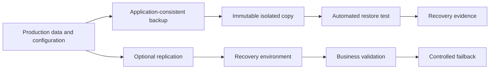

> **文档类型：** 操作指南
> **规范性术语：** **MUST**、**MUST NOT**、**SHOULD**、**SHOULD NOT** 和 **MAY** 是要求级别。
> **适用范围：** 跨云和工作负载边界的备份、还原、复制、故障转移、故障恢复、保留和恢复测试。
> **例外流程：** 偏离要求需要记录风险评估、补偿控制、指定风险负责人和到期日期。

|控制领域|价值|
|---|---|
|文件编号 | `HTG-25` |
|负责人|云卓越中心 |
|审核周期|至少每年一次，并且在重大工作负载、数据或恢复要求发生变化之后 |
|证据|业务影响分析、RPO 和 RTO、备份策略、恢复日志、故障转移测试、数据验证、通信日志记录和经验教训 |

# 如何设计备份和灾难恢复

> **决策简述：** 根据业务影响目标设计恢复，然后用经过测试的证据证明恢复和故障转移，而不是假设备份成功。

> **文档类型：** 弹性实施指南  
> **主要示例：** Azure Backup 和区域恢复  
> **操作原则：** 只有当干净、授权的恢复满足服务 RPO 和 RTO 时，备份才有价值。

## 目标

保护数据和服务功能免受删除、损坏、勒索软件、操作员错误、区域中断、身份泄露和提供商服务故障的影响。备份、高可用性、复制、灾难恢复和业务连续性是不同的控制，不得视为同义词。

## 将影响转换为需求

对于每个服务，记录数据集、依赖关系、一致性组、RPO、RTO、最大可容忍中断、保留、合法保留、恢复区域/账户、最低服务级别、故障转移权限和通信所有者。对不能离开管辖区或提供商的数据进行分类。

## 参考恢复流程

## 设计保护层

1. 使用原生时间点恢复来应对快速操作错误。
2. 将备份存储在具有独立授权的单独账户、订阅、项目或租户中。
3. 在支持的情况下启用不变性、软删除、保留锁和受保护的删除。
4、采用可恢复密钥设计进行加密；不要使恢复仅依赖于故障环境的 Vault。
5. 备份配置、IaC 版本、证书、DNS、身份依赖项、运行手册以及数据。
6. 仅在 RPO 需要时进行复制，并防止复制损坏。
7. 预定义恢复网络、配额、依赖关系、容量和访问权限。
8. 自动执行恢复测试并保留已实现的 RPO 和 RTO 的证据。

## 提供商映射

|能力|Azure|AWS | GCP |OCI |
|---|---|---|---|---|
|备份编排| Azure Backup | AWS Backup |Backup and DR Service |Recovery Service / service-native backup|
|对象不变性 | Blob 不可变存储 | S3 对象锁 |存储桶保留策略 |对象存储保留规则 |
|虚拟机恢复|Site Recovery 和快照|Elastic Disaster Recovery/快照|Backup and DR / snapshots|Full Stack DR / boot volume backups|
|数据库恢复|服务原生 PITR 和地理选项 |服务原生 PITR 和副本 |服务原生 PITR 和副本 |服务原生备份和 Data Guard 选项 |

## 恢复操作手册

声明事件、冻结破坏性自动化、验证恢复权限、选择干净的恢复点、恢复身份和网络先决条件、按依赖顺序恢复数据、验证完整性和安全性、路由受控流量、传达状态并记录实际 RPO/RTO。故障恢复需要另一个经批准的计划；它不是故障转移的逆过程。

## 验证

- [ ] 备份涵盖所有关键数据和配置依赖性。
- [ ] 受损的生产管理员无法删除受保护的恢复副本。
- [ ] 恢复测试使用隔离环境并验证应用级一致性。
- [ ] 表示区域、身份提供商、KMS/Vault、DNS、网络和配额故障。
- [ ] 恢复符合指定决策机构测量的 RPO 和 RTO。
- [ ] 在恢复窗口丢失之前失败和部分备份发出告警。
- [ ] 保留、删除和合法保留控制符合策略。

## 相关主题

- [备份、恢复和业务连续性](../operations-reliability-finops/backup-recovery-and-business-continuity.md)
- [备份、恢复和弹性标准](../standards-best-practices/backup-recovery-and-resilience-standard.md)
- [验证、测试和运营就绪](../operations-reliability-finops/validation-testing-and-operational-readiness.md)

## 相关仓库

- [andyxuan2010/ARO-management](https://github.com/andyxuan2010/ARO-management) — 包含 Azure Red Hat OpenShift 操作脚本，包括面向备份的集群管理模式。
- [andyxuan2010/azure-azcopy](https://github.com/andyxuan2010/azure-azcopy) — 用于受控备份复制工作流程的 Blob 存储传输自动化。
- [andyxuan2010/azcopy-bulk](https://github.com/andyxuan2010/azcopy-bulk) — 演示 Azure Storage 恢复和迁移方案的批量数据传输自动化。
