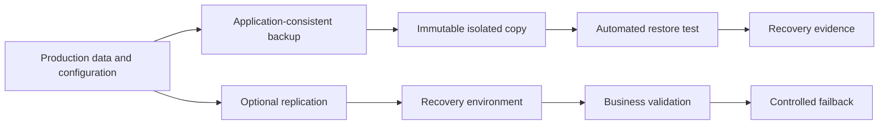

> **Document class:** How-to Guides implementation guide
> **Normative terms:** **MUST**, **MUST NOT**, **SHOULD**, **SHOULD NOT**, and **MAY** are requirements levels.
> **Applicability:** Backup, restore, replication, failover, failback, retention, and recovery testing across cloud and workload boundaries.
> **Exception process:** Deviations require a documented risk assessment, compensating controls, named risk owner, and expiry date.

| Control field | Value |
|---|---|
| Document ID | `HTG-25` |
| Owner | Cloud Center of Excellence |
| Review cycle | At least annually and after material workload, data, or recovery requirement changes |
| Evidence | Business impact analysis, RPO and RTO, backup policy, restore logs, failover test, data validation, communications record, and lessons learned |

# How to Design Backup and Disaster Recovery

> **Decision in brief:** Design recovery from business impact targets, then prove restores and failover with dated evidence rather than assuming backup success.

> **Document type:** Resilience implementation guide  
> **Primary example:** Azure Backup and regional recovery  
> **Operating principle:** A backup is valuable only when a clean, authorized restore meets the service RPO and RTO.

## Objective

Protect data and service capability from deletion, corruption, ransomware, operator error, regional outage, identity compromise, and provider-service failure. Backup, high availability, replication, disaster recovery, and business continuity are distinct controls and must not be treated as synonyms.

## Translate impact into requirements

For every service, document data sets, dependencies, consistency groups, RPO, RTO, maximum tolerable outage, retention, legal holds, recovery region/account, minimum service level, failover authority, and communication owner. Classify data that cannot leave a jurisdiction or provider.

## Reference recovery flow

## Design protection layers

1. Use native point-in-time recovery for rapid operational mistakes.
2. Store backups in a separate account, subscription, project, or tenancy with independent authorization.
3. Enable immutability, soft delete, retention lock, and protected deletion where supported.
4. Encrypt with a recoverable key design; do not make restoration depend on the failed environment's vault alone.
5. Back up configuration, IaC versions, certificates, DNS, identity dependencies, and runbooks as well as data.
6. Replicate only when RPO requires it and protect against replicated corruption.
7. Predefine recovery networking, quotas, dependencies, capacity, and access.
8. Automate restore tests and retain evidence of achieved RPO and RTO.

## Provider mapping

| Capability | Azure | AWS | GCP | OCI |
|---|---|---|---|---|
| Backup orchestration | Azure Backup | AWS Backup | Backup and DR Service | Recovery Service / service-native backup |
| Object immutability | Blob immutable storage | S3 Object Lock | Bucket retention policy | Object Storage retention rules |
| VM recovery | Site Recovery and snapshots | Elastic Disaster Recovery / snapshots | Backup and DR / snapshots | Full Stack DR / boot volume backups |
| Database recovery | Service-native PITR and geo options | Service-native PITR and replicas | Service-native PITR and replicas | Service-native backup and Data Guard options |

## Recovery runbook

Declare the incident, freeze destructive automation, verify recovery authority, select a clean recovery point, restore identity and network prerequisites, restore data in dependency order, validate integrity and security, route controlled traffic, communicate status, and record actual RPO/RTO. Failback requires another approved plan; it is not the reverse of failover.

## Validation

- [ ] Backups cover every critical data and configuration dependency.
- [ ] A compromised production administrator cannot delete protected recovery copies.
- [ ] Restore tests use an isolated environment and validate application-level consistency.
- [ ] Region, identity provider, KMS/vault, DNS, network, and quota failures are represented.
- [ ] Recovery meets measured RPO and RTO with named decision authority.
- [ ] Failed and partial backups alert before the recovery window is lost.
- [ ] Retention, deletion, and legal-hold controls match policy.

## Related topics

- [Backup, Recovery, and Business Continuity](../operations-reliability-finops/backup-recovery-and-business-continuity.md)
- [Backup, Recovery, and Resilience Standard](../standards-best-practices/backup-recovery-and-resilience-standard.md)
- [Validation, Testing, and Operational Readiness](../operations-reliability-finops/validation-testing-and-operational-readiness.md)

## Related repos

- [andyxuan2010/ARO-management](https://github.com/andyxuan2010/ARO-management) — contains Azure Red Hat OpenShift operational scripts, including backup-oriented cluster administration patterns.
- [andyxuan2010/azure-azcopy](https://github.com/andyxuan2010/azure-azcopy) — provides Blob Storage transfer automation applicable to controlled backup-copy workflows.
- [andyxuan2010/azcopy-bulk](https://github.com/andyxuan2010/azcopy-bulk) — demonstrates bulk data-transfer automation for Azure storage recovery and migration scenarios.
