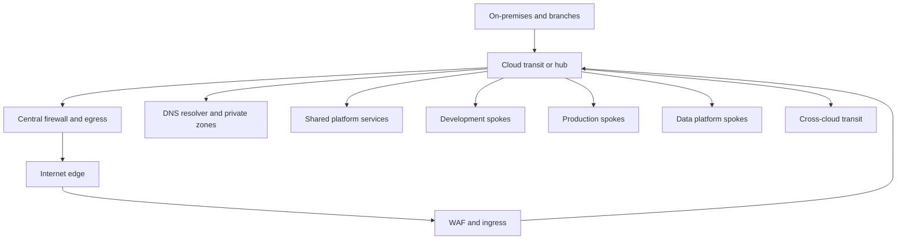

> **文档类型：** 操作指南
> **规范性术语：** **MUST**、**MUST NOT**、**SHOULD**、**SHOULD NOT** 和 **MAY** 是要求级别。
> **适用范围：** 跨四个云的中心、分支、传输、集中式路由、防火墙检查、DNS、混合链接以及订阅或账户边界。
> **例外流程：** 偏离要求需要记录风险评估、补偿控制、指定风险负责人和到期日期。

|控制领域|价值|
|---|---|
|文件编号 | `HTG-16` |
|负责人|云卓越中心 |
|审核周期|至少每年一次，并且在重大网络、路由或 Landing Zone 发生变化之后 |
|证据|拓扑和路由表、分段测试、检查日志、DNS 测试、连接结果、变更批准和故障演习 |

# 如何设计具有集中路由的中心辐射式网络

> **简要决定：** 集中共享路由和检查，同时保留工作负载所有权，并在加入之前测试正常和失败的路径。

> **文件类型：** 实施指南
> **主要示例：** Azure Virtual WAN 或中心虚拟网络
> **云范围：** Azure、AWS、GCP 和 Oracle Cloud Infrastructure (OCI)
> **操作原则：** 集中共享连接和策略，同时保持工作负载所有权和故障域明确。

## 目标

设计一种可扩展网络，将工作负载分支连接到共享入口、出口、DNS、检查、混合和跨云服务，而无需创建重叠地址空间、意外传递路径、非对称路由或不受限制的信任区域。

## 收集需求

选择产品前的文件：

- 工作负载区域、环境、所有者、重要性和预期增长；
- 本地、合作伙伴、互联网、提供商服务和跨云流；
- 地址系列、IP 地址使用量、Kubernetes 范围和获取限制；
- 带宽、延迟、可用性、加密和恢复目标；
- 检查、数据驻留、分段、日志记录和监管要求；
- 运营所有权、路由变更流程、配额和成本模型。

构建包含源、目的地、协议、端口、方向、企业所有者、检查要求、DNS 名称和到期日期的流矩阵。

## 参考拓扑

该图是合乎逻辑的。必须根据恢复目标添加高可用性实例、区域分布、区域中心和冗余电路。

## 使用 IPAM 分配地址

1、集中预留不重叠的区域和环境区块。
2. 包括增长、托管服务委托、私有端点、负载均衡器和 Kubernetes Pod/服务范围。
3. 通过策略和配置工作流程防止临时分配。
4. 在 IPAM 中记录每个前缀、所有者、用途、路由域和生命周期状态。
5. 在部署之前验证本地、合作伙伴、收购和所有连接云的重叠。

IPv4 转换可以解决临时合并限制，但不能替代可持续解决。谨慎规划 IPv6，而不是假设每个依赖项都支持它。

## 选择公交模式

|要求 |首选模式|
|---|---|
|小庄园、一区域、简单路由 |客户管理的中心网络|
|多个地区或分支机构，托管路由交换 |提供商管理的 WAN 或中转服务 |
|严格的工作负载隔离|单独的路由表/域和显式共享服务路径 |
|东西向流量大 |区域化服务并避免不必要的集中发夹 |
|跨云连接 |通过受控传输的冗余专用电路或加密隧道|

不要使用默认网络资源进行生产。当爆炸半径或策略需要时，将生产和非生产路由域分开。

## 配置路由

- 建立一个权威的路由意图来源。
- 仅传播批准的前缀；汇总路由，而不隐藏所有权或实现不需要的可达性。
- 有意使用最长前缀和路由偏好行为。
- 通过所需的检查点强制受管制的进出。
- 使用有状态防火墙或 NAT 时保持返回路径对称。
- 防止辐条在未经批准的情况下通告默认路由或传递路径。
- 为禁止的网络定义黑洞路由或策略。
- 将控制平面权限限制给网络平台团队，并通过经过审查的 IaC 自动进行更改。

模型故障路径。具有更首选路由的辅助隧道可以默默地成为主要路径，如果流量通过不同的设备返回，主动/主动路由可能会破坏状态检查。

## 集成 DNS

部署冗余的入站和出站解析器。仅将私有区域链接到授权网络，集中条件转发，并定义重叠命名空间的权限。根据隐私策略允许日志记录查询并监控解析器可用性和延迟。

测试每个受支持来源的 DNS 解析。在其名称通过完整客户端路径解析为预期私有地址之前，私有端点是不完整的。

## 提供商服务映射

|能力|Azure|AWS | GCP |OCI |
|---|---|---|---|---|
|交通 |Virtual WAN 中心或中心 VNet |Transit Gateway 或 Cloud WAN |Network Connectivity Center 和 VPC | DRG |
|专用电路|ExpressRoute |Direct Connect |Cloud Interconnect|FastConnect|
|加密隧道| VPN 网关|站点到站点 VPN |Cloud VPN |站点到站点 VPN |
| DNS 解析器 | Azure DNS Private Resolver | Route 53 Resolver |Cloud DNS forwarding| DNS resolver endpoints |
|流量遥测| NSG 流日志和网络监控 | VPC 流日志 | VPC 流日志 | VCN 流日志 |

提供商路由语义不同。规范意图和证据，而不是实现语法。

## 使用基础设施即代码进行构建

用于 IPAM 分配、传输、分支连接、路由策略、DNS、检查和混合连接的单独模块。公开稳定的标识符和路由域契约。验证地址重叠、广泛路由、缺失日志、未经批准的对等互连、公共地址和共享中转删除的计划。

使用分阶段部署：中心基础、可观测性、检查、DNS、混合链接、测试分支，然后是生产分支。切勿在一项未经测试的变更中对所有网络进行集中检查。

## 验证连接和故障行为

- [ ] IPAM 报告连接的网络和 Kubernetes 范围之间没有重叠。
- [ ] 批准的流矩阵通过，但显式的负面测试仍然受阻。
- [ ] 入口和出口使用所需的边缘、NAT 和防火墙路径。
- [ ] 返回流量通过状态检查是对称的。
- [ ] DNS 正确解析每个受支持源的公共和私有名称。
- [ ] 路由表不包含未经授权的默认、可传递或更具体的路由。
- [ ] 丢失一个隧道、电路、区域、设备或中心实例可满足恢复目标。
- [ ] 流量、路由、DNS、防火墙、电路和网关遥测达到集中监控。
- [ ] 成本和吞吐量是在实际的东西向和混合流量下测量的。

## 操作注意事项

监控隧道和电路状态、BGP 会话、学习路由更改、数据包丢失、延迟、丢弃的流量、SNAT 利用率、DNS 错误、防火墙容量和提供商配额。维护路由所有者的联系并为每次路由更改进行经过测试的回滚。定期检查过时的对等互连、未使用的前缀、过期的规则以及跨可用区或跨区域的传输成本。

## 验证

当寻址不重叠且受监管、路由意图明确、共享服务具有弹性、所需的流程和负面测试得到验证、检查具有对称路径、DNS 端到端工作、故障满足恢复目标以及所有权和成本可度量时，设计就已准备就绪。

## 相关主题

- [中心辐射式和中转网络设计](../networking-identity-security/nis-hub-and-spoke-and-transit-network-design.md)
- [企业云网络架构](../networking-identity-security/nis-enterprise-cloud-network-architecture.md)
- [网络和私有连接标准](../standards-best-practices/network-and-private-connectivity-standard.md)
- [如何构建私有端点和私有 DNS](how-to-build-private-endpoints-and-private-dns.md)
