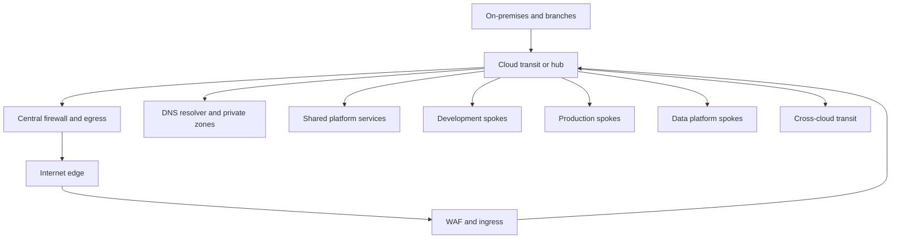

> **Document class:** How-to Guides implementation guide
> **Normative terms:** **MUST**, **MUST NOT**, **SHOULD**, **SHOULD NOT**, and **MAY** are requirements levels.
> **Applicability:** Hub, spoke, transit, centralized routing, firewall inspection, DNS, hybrid links, and subscription or account boundaries across four clouds.
> **Exception process:** Deviations require a documented risk assessment, compensating controls, named risk owner, and expiry date.

| Control field | Value |
|---|---|
| Document ID | `HTG-16` |
| Owner | Cloud Center of Excellence |
| Review cycle | At least annually and after material network, routing, or landing-zone changes |
| Evidence | Topology and route tables, segmentation tests, inspection logs, DNS tests, connectivity results, change approvals, and failure drills |

# How to Design Hub-and-Spoke Networking with Centralized Routing

> **Decision in brief:** Centralize shared routing and inspection while preserving workload ownership, and test both normal and failed paths before onboarding.

> **Document type:** Implementation guide
> **Primary examples:** Azure Virtual WAN or hub virtual network
> **Cloud scope:** Azure, AWS, GCP, and Oracle Cloud Infrastructure (OCI)
> **Operating principle:** Centralize shared connectivity and policy while keeping workload ownership and failure domains explicit.

## Objective

Design a scalable network that connects workload spokes to shared ingress, egress, DNS, inspection, hybrid, and cross-cloud services without creating overlapping address space, unintended transitive paths, asymmetric routing, or one unrestricted trust zone.

## Gather requirements

Document before selecting products:

- workload regions, environments, owners, criticality, and expected growth;
- on-premises, partner, internet, provider-service, and cross-cloud flows;
- address families, IP consumption, Kubernetes ranges, and acquisition constraints;
- bandwidth, latency, availability, encryption, and recovery objectives;
- inspection, data residency, segmentation, logging, and regulatory requirements;
- operational ownership, routing-change process, quotas, and cost model.

Build a flow matrix with source, destination, protocol, port, direction, business owner, inspection requirement, DNS name, and expiry date.

## Reference topology

The diagram is logical. High-availability instances, zone distribution, regional hubs, and redundant circuits must be added according to recovery objectives.

## Allocate addresses with IPAM

1. Reserve non-overlapping regional and environment blocks centrally.
2. Include growth, managed-service delegation, private endpoints, load balancers, and Kubernetes pod/service ranges.
3. Prevent ad hoc allocation through policy and the provisioning workflow.
4. Record every prefix, owner, purpose, route domain, and lifecycle state in IPAM.
5. Validate overlap against on-premises, partners, acquisitions, and all connected clouds before deployment.

IPv4 translation can address a temporary merger constraint but is not a substitute for sustainable addressing. Plan IPv6 deliberately rather than assuming every dependency supports it.

## Select the transit pattern

| Requirement | Preferred pattern |
|---|---|
| Small estate, one region, simple routing | Customer-managed hub network |
| Many regions or branches, managed route exchange | Provider-managed WAN or transit service |
| Strict workload isolation | Separate route tables/domains and explicit shared-service paths |
| High-volume east-west traffic | Regionalize services and avoid unnecessary central hairpinning |
| Cross-cloud connectivity | Redundant private circuits or encrypted tunnels through controlled transit |

Do not use default network resources for production. Separate production and non-production route domains when blast radius or policy requires it.

## Configure routing

- Establish one authoritative source for route intent.
- Propagate only approved prefixes; summarize routes without hiding ownership or enabling unwanted reachability.
- Use longest-prefix and route-preference behavior deliberately.
- Force regulated ingress and egress through required inspection points.
- Keep return paths symmetric when stateful firewalls or NAT are used.
- Prevent spokes from advertising default routes or transitive paths without approval.
- Define blackhole routes or policy for prohibited networks.
- Limit control-plane permissions to the network platform team and automate changes through reviewed IaC.

Model failure paths. A secondary tunnel with a more preferred route can silently become the primary path, and active/active routing can break stateful inspection if flows return through a different appliance.

## Integrate DNS

Deploy redundant inbound and outbound resolvers. Link private zones only to authorized networks, centralize conditional forwarding, and define authority for overlapping namespaces. Log queries as permitted by privacy policy and monitor resolver availability and latency.

Test resolution from every supported source. A private endpoint is incomplete until its name resolves to the intended private address through the full client path.

## Map provider services

| Capability | Azure | AWS | GCP | OCI |
|---|---|---|---|---|
| Transit | Virtual WAN hub or hub VNet | Transit Gateway or Cloud WAN | Network Connectivity Center and VPC | DRG |
| Private circuit | ExpressRoute | Direct Connect | Cloud Interconnect | FastConnect |
| Encrypted tunnel | VPN Gateway | Site-to-Site VPN | Cloud VPN | Site-to-Site VPN |
| DNS resolver | Azure DNS Private Resolver | Route 53 Resolver | Cloud DNS forwarding | DNS resolver endpoints |
| Flow telemetry | NSG flow logs and network monitoring | VPC Flow Logs | VPC Flow Logs | VCN Flow Logs |

Provider route semantics differ. Normalize intent and evidence, not implementation syntax.

## Build with Infrastructure as Code

Separate modules for IPAM allocation, transit, spoke attachment, route policy, DNS, inspection, and hybrid connectivity. Expose stable identifiers and route-domain contracts. Validate plans for address overlap, broad routes, missing logging, unapproved peerings, public addresses, and deletion of shared transit.

Use staged deployment: hub foundations, observability, inspection, DNS, hybrid links, test spoke, then production spokes. Never introduce centralized inspection to all networks in one untested change.

## Validate connectivity and failure behavior

- [ ] IPAM reports no overlap across connected networks and Kubernetes ranges.
- [ ] The approved flow matrix passes, while explicit negative tests remain blocked.
- [ ] Ingress and egress use the required edge, NAT, and firewall path.
- [ ] Return traffic is symmetric through stateful inspection.
- [ ] DNS resolves public and private names correctly from every supported source.
- [ ] Route tables contain no unauthorized default, transitive, or more-specific routes.
- [ ] Loss of one tunnel, circuit, zone, appliance, or hub instance meets recovery objectives.
- [ ] Flow, route, DNS, firewall, circuit, and gateway telemetry reaches central monitoring.
- [ ] Cost and throughput are measured under realistic east-west and hybrid traffic.

## Operational considerations

Monitor tunnel and circuit state, BGP sessions, learned-route changes, packet loss, latency, dropped flows, SNAT utilization, DNS errors, firewall capacity, and provider quotas. Maintain route-owner contacts and a tested rollback for every routing change. Review stale peerings, unused prefixes, expired rules, and cross-zone or cross-region transfer costs regularly.

## Validation

The design is ready when addressing is non-overlapping and governed, route intent is explicit, shared services are resilient, required flows and negative tests are proven, inspection has symmetric paths, DNS works end to end, failures meet recovery objectives, and ownership and cost are measurable.

## Related topics

- [Hub-and-Spoke and Transit Network Design](../networking-identity-security/nis-hub-and-spoke-and-transit-network-design.md)
- [Enterprise Cloud Network Architecture](../networking-identity-security/nis-enterprise-cloud-network-architecture.md)
- [Network and Private-Connectivity Standard](../standards-best-practices/network-and-private-connectivity-standard.md)
- [How to Build Private Endpoints and Private DNS](how-to-build-private-endpoints-and-private-dns.md)
