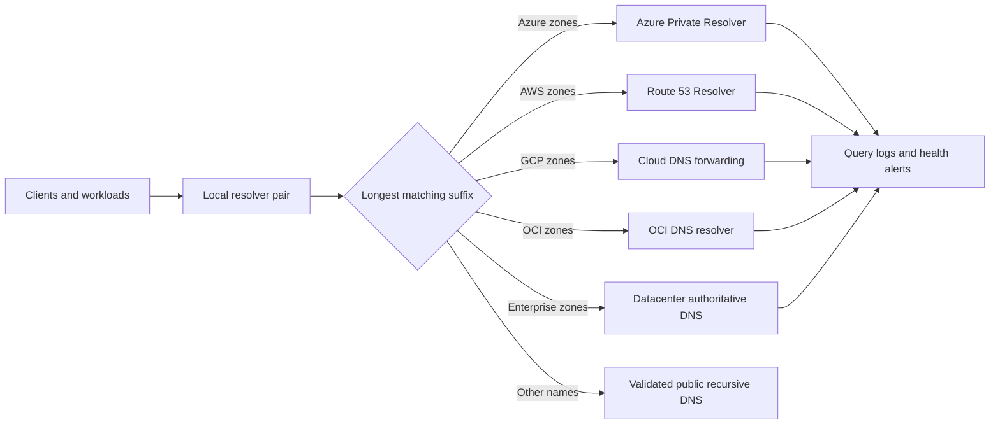

> **文档类型：** 操作指南
> **规范性术语：** **MUST**、**MUST NOT**、**SHOULD**、**SHOULD NOT** 和 **MAY** 是要求级别。
> **适用范围：** 混合和多云公共和私有 DNS 区域、转发、水平分割行为、委派和循环预防。
> **例外流程：** 偏离要求需要记录风险评估、补偿控制、指定风险负责人和到期日期。

|控制领域|价值|
|---|---|
|文件编号 | `HTG-20` |
|负责人|云卓越中心 |
|审核周期|至少每年一次，并且在 DNS、网络或提供商发生重大变化之后 |
|证据|区域所有权图、转发图、解析测试、TTL 计划、查询日志、故障转移测试和变更记录 |

# 如何设计混合和多云 DNS

> **简要决策：** 每个区域定义一个权威所有者，仅向该权威转发，并验证每个客户端解析路径。

> **文档类型：** 架构和实施指南
> **主要示例：** Azure DNS Private Resolver
> **操作原则：** 创建区域一次，仅转发到权威目的地，并使每个解决路径都可监控。

## 目标

为跨云和数据中心的用户、工作负载、托管私有端点以及共享服务提供可预测的公共和私有 DNS 解析。该设计必须防止所有权重叠、转发循环、意外的公开答案以及对一个设备或区域的隐藏依赖。

## 建立命名契约

盘点每个命名空间、权威所有者、记录源、消费者网络、数据分类、TTL、恢复目标和注册工作流程。保持公共和私有权威的明确。优先选择委托子域（例如 `azure.corp.example`、`aws.corp.example` 和 `gcp.corp.example`），而不是将同一区域复制到多个提供商中。

不要将 `.local`、未授权的单标签后缀或由另一方管理的公共域设置为企业私有命名空间。定义私有端点是否使用提供商生成的区域或企业别名，并禁止应用团队创建竞争副本。

## 参考架构

每个网络都指向附近的冗余解析器。条件规则使用最具体的后缀。提供商解析器仅回答他们管理的区域；他们不会将相同的后缀转发回调用者。

## 实现设计

1. 分配不重叠的委派子域并在服务目录中记录所有权。
2. 在每个生产区域至少两个故障域中部署解析器端点。
3. 仅允许经批准的解析器地址之间的 DNS 流量；工作负载不得查询任意互联网解析器。
4. 为每个后缀配置从数据中心和云到权威解析器的条件转发。
5. 仅将私有区域链接到需要它们的网络并使用集中式注册自动化。
6. 在大规模部署端点之前，将私有端点区域与共享解析器路径集成。
7. 日志记录查询、转发失败、响应代码、延迟和配置更改。
8. 在投入生产之前测试否定答案、故障转移、缓存过期和恢复。

## 提供商映射

|能力|Azure|AWS | GCP |OCI |
|---|---|---|---|---|
|私有区域 |私有 DNS 区域 | Route 53 private hosted zones |Cloud DNS private zones |私有 DNS 区域 |
|混合 DNS 解析器 | DNS Private Resolver | Route 53 Resolver endpoints |Inbound and outbound forwarding policies | DNS resolver endpoints and rules |
|网络协会|虚拟网络链接| VPC 关联和配置文件 |授权网络|查看与 VCN 关联|
|查询遥测| DNS 解析器日志 |Resolver query logging |Cloud DNS logging |DNS query logs where enabled |

在实施之前确认当前配额、规则优先级、跨账户共享、DNSSEC 支持和区域可用性。

## 安全地处理私有端点

集中创建提供商推荐的私有区域，并通过策略或批准的模块将它们链接起来。应用日志记录通常应该是提供商服务名称的 CNAME，允许提供商区域返回私有地址。避免手动固定可能在重新创建或故障转移期间发生更改的服务 IP。

当企业内部和外部的名称必须以不同方式解析时，请记录水平分割所有者并测试这两个视图。切勿依赖无法访问的私有答案作为唯一的访问控制。

## 弹性和恢复

- 跨区域运行解析器端点并使客户端使用多个地址。
- 将转发规则和区域链接保留在版本控制的基础设施中作为代码。
- 根据变更和恢复要求选择 TTL；非常低的 TTL 会增加解析器负载。
- 备份记录源或保留可重现的区域声明和更改历史记录。
- 为平台中断提供受控的 break-glass 解析器路径。
- 避免企业解析器之后的跨云链长于一转发跳。

## 验证

- [ ] 每个私有后缀都有一个权威所有者和一个记录在案的委托。
- [ ] 来自每个环境的查询都会返回预期的私有或公共答案。
- [ ] NXDOMAIN、SERVFAIL、超时和转发循环测试产生可操作的遥测。
- [ ] 解析器或区域故障符合记录在案的 RTO。
- [ ] 私有端点名称仅解析为来自授权网络的私有地址。
- [ ] 拒绝并记录未经批准的 DNS 出口。
- [ ] 记录创建、删除、TTL 更改和过时日志记录清理都是自动化的。

## 相关主题

- [私有端点和私有 DNS](../networking-identity-security/nis-private-endpoints-and-private-dns.md)
- [如何构建私有端点和私有 DNS](how-to-build-private-endpoints-and-private-dns.md)
- [中心辐射式及中转网络设计](../networking-identity-security/nis-hub-and-spoke-and-transit-network-design.md)

## 相关仓库

- [andyxuan2010/azure-landingzone](https://github.com/andyxuan2010/azure-landingzone) — 包含此设计的 Azure 端的中心辐射式、私有 DNS 和共享服务模式。
- [andyxuan2010/oci-landingzone](https://github.com/andyxuan2010/oci-landingzone) — 提供适合实施委托私有 DNS 和解析器规则的 OCI 网络基础。
- [andyxuan2010/cloudflare-ddns-updater](https://github.com/andyxuan2010/cloudflare-ddns-updater) — 演示公共 DNS 提供商的受控 DNS 记录自动化。
