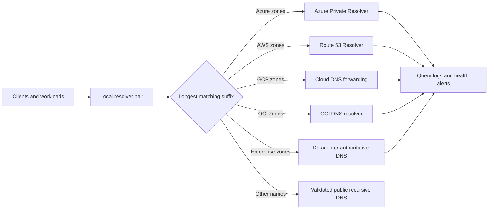

> **Document class:** How-to Guides implementation guide
> **Normative terms:** **MUST**, **MUST NOT**, **SHOULD**, **SHOULD NOT**, and **MAY** are requirements levels.
> **Applicability:** Hybrid and multi-cloud public and private DNS zones, forwarding, split-horizon behavior, delegation, and loop prevention.
> **Exception process:** Deviations require a documented risk assessment, compensating controls, named risk owner, and expiry date.

| Control field | Value |
|---|---|
| Document ID | `HTG-20` |
| Owner | Cloud Center of Excellence |
| Review cycle | At least annually and after material DNS, network, or provider changes |
| Evidence | Zone ownership map, forwarding graph, resolution tests, TTL plan, query logs, failover test, and change record |

# How to Design Hybrid and Multi-Cloud DNS

> **Decision in brief:** Define one authoritative owner per zone, forward only toward that authority, and verify every client resolution path.

> **Document type:** Architecture and implementation guide  
> **Primary example:** Azure DNS Private Resolver  
> **Operating principle:** Author zones once, forward only toward an authoritative destination, and make every resolution path observable.

## Objective

Provide predictable public and private resolution for users, workloads, managed private endpoints, and shared services across clouds and datacenters. The design must prevent overlapping ownership, forwarding loops, accidental public answers, and hidden dependencies on one appliance or region.

## Establish the naming contract

Inventory every namespace, authoritative owner, record source, consumer network, data classification, TTL, recovery objective, and registration workflow. Keep public and private authority explicit. Prefer delegated subdomains such as `azure.corp.example`, `aws.corp.example`, and `gcp.corp.example` over copying the same zone into multiple providers.

Do not make `.local`, an undelegated single-label suffix, or a public domain owned by another party the enterprise private namespace. Define whether private endpoints use provider-generated zones or enterprise aliases and prohibit application teams from creating competing copies.

## Reference architecture

Each network points to a nearby redundant resolver. Conditional rules use the most specific suffix. Provider resolvers answer only the zones they own; they do not forward the same suffix back to the caller.

## Implement the design

1. Allocate non-overlapping delegated subdomains and record ownership in the service catalog.
2. Deploy resolver endpoints in at least two failure domains per production region.
3. Permit DNS traffic only between approved resolver addresses; workloads must not query arbitrary internet resolvers.
4. Configure conditional forwarding from datacenters and clouds to the authoritative resolver for each suffix.
5. Link private zones only to networks that require them and use centralized registration automation.
6. Integrate private-endpoint zones with the shared resolver path before deploying endpoints at scale.
7. Log queries, forwarding failures, response codes, latency, and configuration changes.
8. Test negative answers, failover, cache expiry, and restoration before onboarding production.

## Provider mapping

| Capability | Azure | AWS | GCP | OCI |
|---|---|---|---|---|
| Private zones | Private DNS zones | Route 53 private hosted zones | Cloud DNS private zones | Private DNS zones |
| Hybrid resolver | DNS Private Resolver | Route 53 Resolver endpoints | Inbound and outbound forwarding policies | DNS resolver endpoints and rules |
| Network association | Virtual network link | VPC association and profiles | Authorized networks | View and VCN association |
| Query telemetry | DNS resolver logs | Resolver query logging | Cloud DNS logging | DNS query logs where enabled |

Confirm current quotas, rule precedence, cross-account sharing, DNSSEC support, and regional availability before implementation.

## Handle private endpoints safely

Create provider-recommended private zones centrally and link them through policy or an approved module. Application records should usually be CNAMEs to the provider service name, allowing the provider zone to return the private address. Avoid manually pinning service IPs that can change during recreation or failover.

When a name must resolve differently inside and outside the enterprise, document the split-horizon owner and test both views. Never rely on a private answer being unreachable as the only access control.

## Resilience and recovery

- Run resolver endpoints across zones and make clients use more than one address.
- Keep forwarding rules and zone links in version-controlled infrastructure as code.
- Choose TTLs based on change and recovery requirements; very low TTLs increase resolver load.
- Back up record sources or retain a reproducible zone declaration and change history.
- Provide a controlled break-glass resolver path for a platform outage.
- Avoid cross-cloud chains longer than one forwarding hop after the enterprise resolver.

## Validation

- [ ] Every private suffix has one authoritative owner and a documented delegation.
- [ ] Queries from every environment return the intended private or public answer.
- [ ] NXDOMAIN, SERVFAIL, timeout, and forwarding-loop tests produce actionable telemetry.
- [ ] Resolver or zone failure meets the documented RTO.
- [ ] Private-endpoint names resolve to private addresses only from authorized networks.
- [ ] Unapproved DNS egress is denied and logged.
- [ ] Record creation, deletion, TTL changes, and stale-record cleanup are automated.

## Related topics

- [Private Endpoints and Private DNS](../networking-identity-security/nis-private-endpoints-and-private-dns.md)
- [How to Build Private Endpoints and Private DNS](how-to-build-private-endpoints-and-private-dns.md)
- [Hub-and-Spoke and Transit Network Design](../networking-identity-security/nis-hub-and-spoke-and-transit-network-design.md)

## Related repos

- [andyxuan2010/azure-landingzone](https://github.com/andyxuan2010/azure-landingzone) — contains hub-and-spoke, private DNS, and shared-services patterns for the Azure side of this design.
- [andyxuan2010/oci-landingzone](https://github.com/andyxuan2010/oci-landingzone) — provides OCI networking foundations suitable for implementing delegated private DNS and resolver rules.
- [andyxuan2010/cloudflare-ddns-updater](https://github.com/andyxuan2010/cloudflare-ddns-updater) — demonstrates controlled DNS record automation for a public DNS provider.
