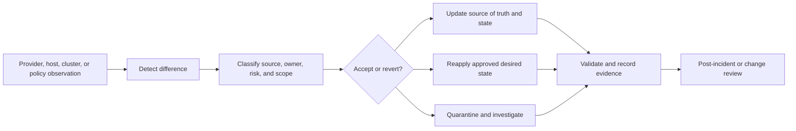

> **文档类型：** 操作指南
> **规范性术语：** **MUST**、**MUST NOT**、**SHOULD**、**SHOULD NOT** 和 **MAY** 是要求级别。
> **适用范围：** Terraform 或 OpenTofu、Ansible、Kubernetes 和提供商治理漂移检测、所有权、协调、接受和证据。
> **例外流程：** 偏离要求需要记录风险评估、补偿控制、指定风险负责人和到期日期。

|控制领域|价值|
|---|---|
|文件编号 | `HTG-32` |
|负责人|云卓越中心 |
|审核周期|至少每年一次，并且在重大真实来源、提供商或自动化发生变化之后 |
|证据|检测到的差异、权威来源决策、批准或例外、协调计划、执行日志和更改后验证 |

# 如何检测和修复基础设施和配置漂移

> **决策简述：** 在更改任何内容之前确定权威所有者，然后通过到期和补偿控制来协调或正式接受漂移。

## 目的

当基础设施或服务器配置不再与声明的事实来源匹配时，请使用此过程。它应用于 Terraform 或 OpenTofu 管理的资源、Ansible 管理的操作系统配置、Kubernetes 所需状态和提供商治理控制。

漂移是一个状态管理问题，而不是自动的修复命令。首先确定更改的内容、是否经过授权、哪个系统负责受影响的字段以及接受更改还是恢复更改是否更安全。错误的协调可能会破坏有效的紧急修复、覆盖工作负载管理的设置或造成中断。

## 漂移运营模式

## 步骤1：建立权威所有者

在更改任何内容之前创建所有权映射：

|资源或设置|权威负责人|检测来源|正常修复|
|---|---|---|---|
| Azure 资源拓扑 | Terraform 或 Bicep |仅限刷新计划 |更新代码或应用批准的计划 |
| Azure Policy 分配 |治理仓库 |策略状态和计划|协调策略即代码 |
|服务器包/配置 |Ansible |检查模式或合规性作业 |更新代码或运行批准的 Playbook |
| Kubernetes 工作负载 | GitOps 仓库 |协调器和集群状态 |安全地更改 Git 或暂停协调 |
|紧急事件设置|事件临时所有者 |变更日志和票证 |审核后保留、编纂或恢复 |

如果两个系统管理同一字段，请停止并解决冲突。在运行自动修复之前按资源或属性分割所有权。

## 步骤2：收集没有突变的证据

采集：

- 资源或主机身份；
- 监控值和期望值；
- 时间戳和监控源；
- 执行者或变更操作（如果有）；
- 相关部署、票据、事件或发布；
- 受影响的环境、服务、所有者和数据类；
- 依赖性和可用性影响；和
- 当前备份或回滚点。

对于 Azure，使用活动日志、Resource Graph 变更记录、特定于提供程序的诊断日志和 IaC 状态。对于服务器，使用 Ansible 检查模式、配置报告、包清单和操作系统审计日志。对于 Kubernetes，使用 API 对象、控制器事件、GitOps 状态以及准入或审计日志。

不要将正常的 `apply`、变异 playbook 或删除命令作为第一个检测操作运行。

## 步骤 3：安全检测 Terraform 漂移

使用仅刷新计划来检查状态资源和远程资源之间的差异：
```bash
terraform init
terraform plan -refresh-only -out=drift.tfplan
terraform show -no-color drift.tfplan > drift.txt
```
查看 Terraform 之外所做的更改的计划。仅刷新计划不会更改远程基础设施。如果更改已获取授权并且应保留，请更新配置并通过批准的工作流程应用状态更新。如果未经授权或不安全，请制定恢复声明配置的正常计划。

不要使用 `-target` 作为常规漂移修复。有针对性的操作可能会隐藏依赖性并产生不完整的协调。如果某个资源在代码中缺失，但环境中存在，不要盲目销毁；将其视为所有权和导入决定。

## 步骤 4：使用 Ansible 检测配置漂移

针对明确的、批准的目标范围运行非变异检查：
```bash
ansible-playbook \
  -i inventories/prod \
  playbooks/baseline.yml \
  --check \
  --diff \
  --limit "service_orders:&production"
```
在信任 `--check` 之前检查模块行为；有些模块无法预测变化，或者可能调用有副作用的 API。保护机密和敏感差异。将结果与批准的基线、维护时段和最近的事件日志记录进行比较。

对于故意不同的配置，请更新角色或声明的异常。对于未经授权的漂移，请使用金丝雀、串行波和后检查运行批准的修复工作流程。如果目标不稳定，请将其隔离，而不是重复应用基线。

## 步骤 5：对漂移进行分类

使用这些分类：

- **预期：**已知的提供程序默认值、自动扩缩容效果或记录在案的生命周期值。
- **授权：** 已批准但尚未编纂的变更。
- **紧急情况：** 需要采取后续行动的临时事件行动。
- **未经授权：** 批准的工作流程之外的更改。
- **提供商规范化：** 后端值仅因规范化或计算行为而不同。
- **所有权冲突：** 多个系统声称负责该字段。
- **未知：**证据不足；隔离并调查。

分类决定了下一步的行动。预期的计算值不应产生嘈杂的告警。未经授权的公开曝光不应等待每月的对账窗口。

## 步骤 6：选择接受、恢复或保留

### 接受并编码

当观测到的状态有效且变更所有者批准时使用。更新配置、变量、策略、清单或角色；检查差异；运行验证；并通过正常工作流程更新状态。

### 恢复到所需状态

当声明的配置仍然具有权威性并且观测到的更改未经授权、不安全或超出服务契约时使用。创建计划、审查爆炸半径、获取批准（如果需要）并通过受控路径应用。

### 扣留并调查

当资源不稳定、参与者未知、所有权冲突、可能丢失数据或所需状态不完整时使用。限制进一步的突变、保留证据、指定所有者并定义有时限的决策。

## 步骤 7：分批修复

对于广泛的修复：

1. 选择金丝雀目标或风险最低的资源。
2. 验证依赖关系、备份、运行状况和维护时段。
3. 应用最小的安全更改。
4. 验证服务运行状况和状态收敛。
5. 继续以有界波次浪的方式前进。
6. 在出现故障阈值或违反 SLO 时停止。
7. 记录已完成和剩余范围。

云资源可能需要最终一致性轮询。服务器配置可能需要重新启动或打包事务。 Kubernetes 协调可能是持续的。 Runbook 必须说明如何在重试之前确定操作是否完成。

## 步骤8：关闭漂移事件

仅在以下情况下关闭：

- 资源或配置与批准的事实来源匹配，或者存在批准的例外情况；
- 更新所有者和变更记录；
- 漂移检测器不再报告差异；
- 健康和安全检查通过；
- 证据被保留；和
- 如果漂移再次出现，则采取后续行动解决原因。
反复出现的偏差通常表示不受管理的控制平面、过于宽泛的管理员路径、未建模的自动扩展或提供程序行为，或者事实来源冲突。修复系统而不是手动关闭重复的告警。

## 常见故障模式

|失败|为什么不安全 |更安全的响应 |
|---|---|---|
|检测到漂移后立即应用 |可能会覆盖已批准的紧急变更|先分类再审查|
|刷新状态而不更新代码 |状态和配置不一致 |仅接受编码计划 |
|在整个清单上运行 Ansible |将爆炸范围扩大到事件之外 |使用明确的范围和波 |
|忽略计算/提供商字段 |产生噪音或误导性的漂移 |日志记录生命周期并狭隘地忽略规则 |
|使用广泛的策略豁免 |掩盖问题削弱管控 |豁免范围、到期和审查 |
|盲目超时重试 |重复突变或冲突运行 |重试前协调作业状态 |

## 验证

- [ ] 检测是非变异的，并采集足够的证据来对事件进行分类。
- [ ] 每个受影响的资源或领域的权威所有者都是已知的。
- [ ] Terraform 使用仅刷新计划进行调查。
- [ ] Ansible 检查模式已确定范围并了解其模块限制。
- [ ] 接受、恢复和保留决定需要适当的所有者。
- [ ] 修复使用金丝雀、波次、运行状况门和停止条件。
- [ ] 在重试之前协调未知状态和超时。
- [ ] 事实、状态、策略和配置的最终来源一致。
- [ ] 反复出现的漂移会产生预防性工程行动。

## 相关主题

- [IaC 漂移检测、协调安全导入](../infrastructure-as-code/iac-drift-detection-reconciliation-and-safe-import.md)
- [基础设施作为代码工程标准](../standards-best-practices/infrastructure-as-code-engineering-standard.md)
- [基础设施即代码工程标准](../infrastructure-as-code/iac-infrastructure-as-code-engineering-standards.md)
- [资源清单、报告和合规证据](../operations-reliability-finops/resource-inventory-reporting-and-compliance-evidence.md)
- [如何实现策略即代码](how-to-implement-policy-as-code.md)
- [如何在发布前验证基础设施](how-to-validate-infrastructure-before-release.md)

## 参考文档

- [使用 Terraform 管理资源漂移](https://developer.hashicorp.com/terraform/tutorials/state/resource-drift)
- [运行仅刷新 Terraform 操作](https://developer.hashicorp.com/terraform/tutorials/cloud-get-started/cloud-refresh-only)
- [Terraform 规划命令](https://developer.hashicorp.com/terraform/cli/commands/plan)
- [使用 Azure Resource Graph 获取资源更改](https://learn.microsoft.com/en-us/azure/governance/resource-graph/changes/get-resource-changes)
