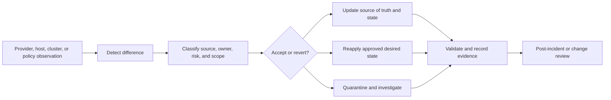

> **Document class:** How-to Guides implementation guide
> **Normative terms:** **MUST**, **MUST NOT**, **SHOULD**, **SHOULD NOT**, and **MAY** are requirements levels.
> **Applicability:** Terraform or OpenTofu, Ansible, Kubernetes, and provider governance drift detection, ownership, reconciliation, acceptance, and evidence.
> **Exception process:** Deviations require a documented risk assessment, compensating controls, named risk owner, and expiry date.

| Control field | Value |
|---|---|
| Document ID | `HTG-32` |
| Owner | Cloud Center of Excellence |
| Review cycle | At least annually and after material source-of-truth, provider, or automation changes |
| Evidence | Detected diff, authoritative-source decision, approval or exception, reconciliation plan, execution log, and post-change verification |

# How to Detect and Remediate Infrastructure and Configuration Drift

> **Decision in brief:** Identify the authoritative owner before changing anything, then reconcile or formally accept drift with an expiry and compensating controls.

## Purpose

Use this procedure when infrastructure or server configuration no longer matches the declared source of truth. It applies to Terraform or OpenTofu-managed resources, Ansible-managed operating-system configuration, Kubernetes desired state, and provider governance controls.

Drift is a state-management problem, not automatically a remediation command. First determine what changed, whether it was authorized, which system owns the affected field, and whether accepting or reverting the change is safer. The wrong reconciliation can destroy a valid emergency fix, overwrite a workload-owned setting, or create an outage.

## Drift operating model



## Step 1: Establish the authoritative owner

Create an ownership map before changing anything:

| Resource or setting | Authoritative owner | Detection source | Normal remediation |
|---|---|---|---|
| Azure resource topology | Terraform or Bicep | Refresh-only plan | Update code or apply approved plan |
| Azure policy assignment | Governance repository | Policy state and plan | Reconcile policy code |
| Server package/configuration | Ansible | Check mode or compliance job | Update code or run approved playbook |
| Kubernetes workload | GitOps repository | Reconciler and cluster state | Change Git or suspend reconciliation safely |
| Emergency incident setting | Incident owner temporarily | Change log and ticket | Preserve, codify, or revert after review |

If two systems manage the same field, stop and resolve the conflict. Split ownership by resource or attribute before running an automated remediation.

## Step 2: Collect evidence without mutation

Capture:

- resource or host identity;
- observed value and expected value;
- timestamp and observation source;
- actor or change operation where available;
- related deployment, ticket, incident, or release;
- affected environment, service, owner, and data class;
- dependency and availability impact; and
- current backup or rollback point.

For Azure, use activity logs, Resource Graph change records, provider-specific diagnostic logs, and the IaC state. For servers, use Ansible check mode, configuration reports, package inventory, and operating-system audit logs. For Kubernetes, use the API object, controller events, GitOps status, and admission or audit logs.

Do not run a normal `apply`, mutating playbook, or delete command as the first detection action.

## Step 3: Detect Terraform drift safely

Use a refresh-only plan to inspect differences between state and remote resources:

```bash
terraform init
terraform plan -refresh-only -out=drift.tfplan
terraform show -no-color drift.tfplan > drift.txt
```

Review the plan for changes made outside Terraform. A refresh-only plan does not change remote infrastructure. If the change was authorized and should remain, update the configuration and apply the state update through the approved workflow. If it was unauthorized or unsafe, produce a normal plan that restores the declared configuration.

Do not use `-target` as a routine drift fix. Targeted operations can hide dependencies and produce an incomplete reconciliation. If a resource is missing from code but exists in the environment, do not destroy it blindly; treat it as an ownership and import decision.

## Step 4: Detect configuration drift with Ansible

Run a non-mutating check against an explicit, approved target scope:

```bash
ansible-playbook \
  -i inventories/prod \
  playbooks/baseline.yml \
  --check \
  --diff \
  --limit "service_orders:&production"
```

Review module behavior before trusting `--check`; some modules cannot predict changes or may call APIs with side effects. Protect secrets and sensitive diffs. Compare the result with the approved baseline, maintenance window, and recent incident records.

For configuration that is intentionally different, update the role or declared exception. For unauthorized drift, run the approved remediation workflow with a canary, serial waves, and postchecks. If the target is unstable, quarantine it instead of repeatedly applying the baseline.

## Step 5: Classify the drift

Use these classifications:

- **Expected:** a known provider default, autoscale effect, or documented lifecycle value.
- **Authorized:** an approved change that has not yet been codified.
- **Emergency:** a temporary incident action requiring follow-up.
- **Unauthorized:** a change outside the approved workflow.
- **Provider-normalized:** a backend value differs only by canonicalization or computed behavior.
- **Ownership conflict:** more than one system claims the field.
- **Unknown:** evidence is insufficient; quarantine and investigate.

The classification determines the next action. An expected computed value should not create a noisy alert. An unauthorized public exposure should not wait for a monthly reconciliation window.

## Step 6: Choose acceptance, reversion, or hold

### Accept and codify

Use when the observed state is valid and the change owner approves it. Update the configuration, variables, policy, inventory, or role; review the diff; run validation; and update state through the normal workflow.

### Revert to desired state

Use when the declared configuration remains authoritative and the observed change is unauthorized, unsafe, or outside the service contract. Create a plan, review blast radius, obtain approval if required, and apply through the controlled path.

### Hold and investigate

Use when the resource is unstable, the actor is unknown, ownership conflicts, data loss is possible, or the desired state is incomplete. Restrict further mutation, preserve evidence, assign an owner, and define a time-bound decision.

## Step 7: Remediate in waves

For a broad remediation:

1. Select a canary target or lowest-risk resource.
2. Validate dependencies, backup, health, and maintenance window.
3. Apply the smallest safe change.
4. Verify service health and state convergence.
5. Continue in bounded waves.
6. Stop on a failure threshold or SLO breach.
7. Record completed and remaining scope.

Cloud resources may require eventual-consistency polling. Server configuration may require a restart or package transaction. Kubernetes reconciliation may be continuous. The runbook must state how to determine whether the operation completed before a retry.

## Step 8: Close the drift event

Close only when:

- the resource or configuration matches the approved source of truth, or an approved exception exists;
- the owner and change record are updated;
- the drift detector no longer reports the difference;
- health and security checks pass;
- evidence is retained; and
- a follow-up action addresses the cause if the drift was recurring.

Recurring drift usually indicates an unmanaged control plane, an overly broad administrator path, an autoscaling or provider behavior that was not modeled, or a source-of-truth conflict. Fix the system rather than closing repeated alerts manually.

## Common failure modes

| Failure | Why it is unsafe | Safer response |
|---|---|---|
| Apply immediately after detecting drift | May overwrite an approved emergency change | Classify and review first |
| Refresh state without updating code | State and configuration remain inconsistent | Accept only with a codification plan |
| Run Ansible over the entire inventory | Expands blast radius beyond the event | Use explicit scope and waves |
| Ignore computed/provider fields | Creates noisy or misleading drift | Document lifecycle and ignore rules narrowly |
| Use broad policy exemptions | Hides the problem and weakens controls | Scope, expire, and review exemptions |
| Retry after timeout blindly | Duplicate mutation or conflicting runs | Reconcile job state before retry |

## Validation

- [ ] Detection is non-mutating and captures enough evidence to classify the event.
- [ ] The authoritative owner is known for every affected resource or field.
- [ ] Terraform uses refresh-only plans for investigation.
- [ ] Ansible check mode is scoped and its module limitations are understood.
- [ ] Acceptance, reversion, and hold decisions require the appropriate owner.
- [ ] Remediation uses canary, waves, health gates, and stop conditions.
- [ ] Unknown state and timeouts are reconciled before retry.
- [ ] The final source of truth, state, policy, and configuration agree.
- [ ] Recurring drift produces a preventive engineering action.

## Related topics

- [IaC Drift Detection, Reconciliation, and Safe Import](../infrastructure-as-code/iac-drift-detection-reconciliation-and-safe-import.md)
- [Infrastructure as Code Engineering Standard](../standards-best-practices/infrastructure-as-code-engineering-standard.md)
- [Infrastructure as Code Engineering Standards](../infrastructure-as-code/iac-infrastructure-as-code-engineering-standards.md)
- [Resource Inventory, Reporting, and Compliance Evidence](../operations-reliability-finops/resource-inventory-reporting-and-compliance-evidence.md)
- [How to Implement policy-as-code](how-to-implement-policy-as-code.md)
- [How to Validate Infrastructure Before Release](how-to-validate-infrastructure-before-release.md)

## References

- [Manage resource drift with Terraform](https://developer.hashicorp.com/terraform/tutorials/state/resource-drift)
- [Run a refresh-only Terraform operation](https://developer.hashicorp.com/terraform/tutorials/cloud-get-started/cloud-refresh-only)
- [Terraform plan command](https://developer.hashicorp.com/terraform/cli/commands/plan)
- [Get resource changes with Azure Resource Graph](https://learn.microsoft.com/en-us/azure/governance/resource-graph/changes/get-resource-changes)
