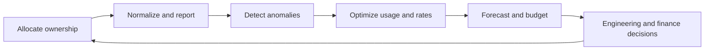

> **文档类型：** 操作指南
> **规范性术语：** **MUST**、**MUST NOT**、**SHOULD**、**SHOULD NOT** 和 **MAY** 是要求级别。
> **适用范围：** 跨四个云的云分配、预算、异常检测、预测、优化、问责和权衡决策。
> **例外流程：** 偏离要求需要记录风险评估、补偿控制、指定风险负责人和到期日期。

|控制领域|价值|
|---|---|
|文件编号 | `HTG-28` |
|负责人|云卓越中心 |
|审核周期|至少每年一次，并且在重大定价、分配或服务发生变化之后 |
|证据|成本分配模型、预算、异常告警、预测、优化积压、负责人审查和批准的权衡日志记录|

# 如何建立 FinOps 护栏

> **简要决策：** 使支出归属于所有者且对所有者可见，然后在明确的可靠性和安全护栏内进行优化。

> **文件类型：** 成本治理实施指南  
> **操作原则：** 在优化之前让所有者了解成本，并且在没有明确的风险决策的情况下决不要牺牲可靠性或安全性。

## 目标

提供及时、标准化的成本数据和决策控制，以便团队了解支出、检测异常、预测需求、消除浪费并安全地选择承诺。护栏应该在不阻碍合理消费的情况下塑造架构和交付。

## 操作循环

## 创建分配模型

使用提供商账户层次结构以及服务、所有者、成本中心、环境、产品和生命周期的强制元数据。定义共享网络、安全性、支持、可观测性、市场、折扣、税收和数据传输费用的处理方式。跟踪分配覆盖范围，不要将未分配的支出隐藏在通用平台存储桶中。

## 实施控制

1. 每天将详细的账单数据导出到受管理的分析存储。
2. 标准化提供商、货币、日期、服务、区域、定价模型、摊销承诺和所有权维度。
3. 发布团队和产品视图，包括当前支出、预测、单位成本、预算差异和主要驱动因素。
4. 在组织、账户、服务和产品级别配置异常检测。
5. 应用预算作为通知和批准触发器；不要假设预算会自动限制使用量。
6. 安排调整规模、闲置资源、存储层、许可和数据传输审核。
7. 仅根据负责任的所有者的稳定、可度量的基准做出购买承诺。
8. 针对重大基础设施变更的拉取请求提供成本估算和策略检查。

## 提供商映射

|能力|Azure|AWS | GCP |OCI |
|---|---|---|---|---|
|成本分析|Cost Management exports|Cost Explorer and CUR |Cloud Billing export|Cost Analysis and usage reports|
|预算|Budgets and alerts| AWS Budgets |Budgets and alerts|Budgets|
|优化|Advisor|Compute Optimizer / Trusted Advisor |Recommender |Cloud Advisor |
|承诺|预订/储蓄计划 |预留实例/节省计划 | CUD |通用积分/承诺模型|

## 自动化边界

安全自动化包括通知所有者、停止过期的沙箱资源、验证后删除未连接的临时磁盘以及强制执行批准的 SKU 或区域目录。不要仅根据建议自动调整生产数据库大小、删除快照、更改冗余或终止未知工作负载。

## 单位经济效益

度量每个有意义的单位的成本，例如活跃客户、交易、部署、模型推理、千兆字节处理或受保护的工作负载。当需求下降时，较低的总费用可以掩盖效率下降的情况；单位指标揭示了架构趋势。

## 验证

- [ ] 至少 95% 的支出分配给负责任的所有者或批准的共享服务。
- [ ] 计费导出在记录在案的容差范围内与提供商发票进行核对。
- [ ] 异常模拟在目标时间内到达正确的所有者。
- [ ] 定期审查预测差异、承诺利用率、浪费和单位成本。
- [ ] 优化操作包括可靠性、安全性、许可和性能检查。
- [ ] 离开的团队和过期的项目不会保留活跃的资源或承诺。

## 相关主题

- [云成本管理和 FinOps](../operations-reliability-finops/cloud-cost-management-and-finops.md)
- [成本管理和 FinOps 最佳实践](../standards-best-practices/cost-management-and-finops-best-practices.md)
- [资源命名、标签和元数据标准](../cloud-foundations-governance/resource-naming-tagging-and-metadata-standards.md)

## 相关仓库

- [andyxuan2010/azure-landingzone](https://github.com/andyxuan2010/azure-landingzone) — 提供成本分配和策略控制所需的受管理的 Azure 层次结构和标记基础。
- [andyxuan2010/aws-landingzone](https://github.com/andyxuan2010/aws-landingzone) — 为所有权、预算和成本分配边界提供 AWS 多账户结构。
- [andyxuan2010/oci-landingzone](https://github.com/andyxuan2010/oci-landingzone) — 提供 OCI 隔间和标记基础，以实现等效成本治理。
