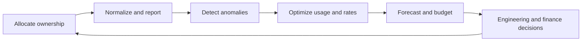

> **Document class:** How-to Guides implementation guide
> **Normative terms:** **MUST**, **MUST NOT**, **SHOULD**, **SHOULD NOT**, and **MAY** are requirements levels.
> **Applicability:** Cloud allocation, budgets, anomaly detection, forecasting, optimization, accountability, and tradeoff decisions across four clouds.
> **Exception process:** Deviations require a documented risk assessment, compensating controls, named risk owner, and expiry date.

| Control field | Value |
|---|---|
| Document ID | `HTG-28` |
| Owner | Cloud Center of Excellence |
| Review cycle | At least annually and after material pricing, allocation, or service changes |
| Evidence | Cost allocation model, budgets, anomaly alerts, forecast, optimization backlog, owner review, and approved tradeoff records |

# How to Establish FinOps Guardrails

> **Decision in brief:** Make spend attributable and visible to owners, then optimize within explicit reliability and security guardrails.

> **Document type:** Cost-governance implementation guide  
> **Operating principle:** Make cost visible to the owner before optimizing it, and never trade away reliability or security without an explicit risk decision.

## Objective

Provide timely, normalized cost data and decision controls so teams understand spend, detect anomalies, forecast demand, remove waste, and choose commitments safely. Guardrails should shape architecture and delivery without blocking justified consumption.

## Operating loop

## Create the allocation model

Use provider account hierarchy plus mandatory metadata for service, owner, cost center, environment, product, and lifecycle. Define treatment for shared networking, security, support, observability, marketplace, discounts, taxes, and data-transfer charges. Track allocation coverage and do not hide unallocated spend in a generic platform bucket.

## Implement controls

1. Export detailed billing data to a governed analytical store each day.
2. Normalize provider, currency, date, service, region, pricing model, amortized commitments, and ownership dimensions.
3. Publish team and product views with current spend, forecast, unit cost, budget variance, and top drivers.
4. Configure anomaly detection at organization, account, service, and product levels.
5. Apply budgets as notifications and approval triggers; do not assume a budget automatically caps usage.
6. Schedule rightsizing, idle-resource, storage-tier, licensing, and data-transfer reviews.
7. Purchase commitments only against stable, measured baselines with an accountable owner.
8. feed cost estimates and policy checks into pull requests for material infrastructure changes.

## Provider mapping

| Capability | Azure | AWS | GCP | OCI |
|---|---|---|---|---|
| Cost analysis | Cost Management exports | Cost Explorer and CUR | Cloud Billing export | Cost Analysis and usage reports |
| Budgets | Budgets and alerts | AWS Budgets | Budgets and alerts | Budgets |
| Optimization | Advisor | Compute Optimizer / Trusted Advisor | Recommender | Cloud Advisor |
| Commitments | Reservations / savings plans | Reserved Instances / Savings Plans | CUDs | Universal credits / committed models |

## Automation boundaries

Safe automation includes notifying owners, stopping expired sandbox resources, removing unattached temporary disks after validation, and enforcing approved SKU or region catalogs. Do not automatically resize production databases, delete snapshots, change redundancy, or terminate unknown workloads from a recommendation alone.

## Unit economics

Measure cost per meaningful unit such as active customer, transaction, deployment, model inference, gigabyte processed, or protected workload. A lower total bill can mask declining efficiency when demand falls; unit metrics expose architectural trends.

## Validation

- [ ] At least 95% of spend is allocated to an accountable owner or approved shared service.
- [ ] Billing exports reconcile to provider invoices within documented tolerance.
- [ ] Anomaly simulations reach the correct owner within the target time.
- [ ] Forecast variance, commitment utilization, waste, and unit cost are reviewed regularly.
- [ ] Optimization actions include reliability, security, licensing, and performance checks.
- [ ] Departed teams and expired projects do not retain active resources or commitments.

## Related topics

- [Cloud Cost Management and FinOps](../operations-reliability-finops/cloud-cost-management-and-finops.md)
- [Cost Management and FinOps Best Practices](../standards-best-practices/cost-management-and-finops-best-practices.md)
- [Resource Naming, Tagging, and Metadata Standards](../cloud-foundations-governance/resource-naming-tagging-and-metadata-standards.md)

## Related repos

- [andyxuan2010/azure-landingzone](https://github.com/andyxuan2010/azure-landingzone) — offers governed Azure hierarchy and tagging foundations required for cost allocation and policy controls.
- [andyxuan2010/aws-landingzone](https://github.com/andyxuan2010/aws-landingzone) — provides an AWS multi-account structure for ownership, budget, and cost-allocation boundaries.
- [andyxuan2010/oci-landingzone](https://github.com/andyxuan2010/oci-landingzone) — supplies OCI compartment and tagging foundations for equivalent cost governance.
