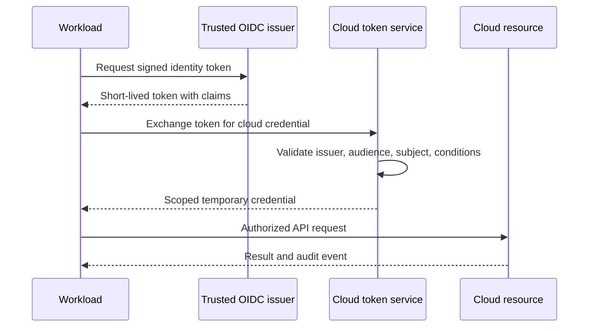

> **文档类型：** 操作指南
> **规范性术语：** **MUST**、**MUST NOT**、**SHOULD**、**SHOULD NOT** 和 **MAY** 是要求级别。
> **适用范围：** CI/CD、Kubernetes、应用和跨云自动化的短期工作负载身份。
> **例外流程：** 偏离要求需要记录风险评估、补偿控制、指定风险负责人和到期日期。

|控制领域|价值|
|---|---|
|文件编号 | `HTG-21` |
|负责人|云卓越中心 |
|审核周期|至少每年一次，并且在重大身份、联盟或提供商发生变化之后 |
|证据|信任策略、声明映射、角色范围、令牌生命周期、拒绝访问测试、审计日志以及轮换或恢复证据 |

# 如何跨云联合工作负载身份

> **决策简述：** 将短期凭证与可验证的工作负载声明绑定，并仅授权该工作负载所需的操作和资源。

> **文档类型：** 安全实施指南  
> **主要示例：** GitHub Actions OIDC 到 Microsoft Entra ID  
> **操作原则：** 使用已签名的短期声明对工作负载进行身份验证，并授权尽可能小的资源范围。

## 目标

使流水线、Kubernetes 服务账户、应用和云到云作业能够获取临时凭证，而无需存储客户端密钥、访问密钥、服务账户密钥或 OCI 用户密钥。联盟减少了机密暴露，但只有当发布者、受众、主体、环境和授权受到严格约束时才是安全的。

## 信任流程

## 定义身份契约

对于每个工作负载，记录其所有者、颁发者、确切的主题模式、受众、仓库或命名空间、环境、云角色、资源范围、最大持续时间、网络上下文和紧急撤销路径。对生产和非生产使用单独的云身份。覆盖组织、集群或所有分支的通配符信任并不是授权的捷径。

## 实施流程

1. 盘点静态凭证，并按权限、年龄、暴露路径和轮换难度对它们进行排名。
2. 选择受支持的颁发者，例如 GitHub Actions、Azure DevOps 工作负载身份联合、Kubernetes 颁发者或中央身份代理。
3. 为每个工作负载边界创建一个目标云身份，并分配最低数据平面或控制平面权限。
4. 为确切的发布者 URL、受众和稳定主题声明配置信任。
5. 限制发布者的受保护环境、分支、服务账户和部署审批。
6. 仅在授权作业或 Pod 内交换令牌，并保持较短的凭证持续时间。
7. 并行验证后删除旧机密；撤销它而不是将其作为后备。
8. 对失败的交换、意外的主题、角色更改、长时间会话以及使用已停用的凭据发出告警。

## 提供商映射

|目标|联邦机制|首选工作负载绑定 |
|---|---|---|
|Azure|内部工作负载身份联合|使用联合凭据和 Azure RBAC 的应用注册或托管身份 |
|AWS | IAM OIDC/SAML 信任和 STS 角色假设 |具有声明条件和权限边界的专用角色 |
| GCP |工作负载身份联合|池/提供商加上服务账户模拟或直接资源角色 |
|OCI |工作负载身份/资源主体或受治理代理 |动态组/资源主体；需要外部 OIDC 时代理联合 |

OCI 支持因工作负载源而异。不要用同样宽泛的代理凭证替换静态机密。

## Kubernetes 模式

将专用的 Kubernetes 服务账户与云身份绑定。将信任主题限制为集群颁发者、命名空间和服务账户名称。将 Kubernetes RBAC 与云 IAM 分开应用，禁用未使用的自动挂载，并防止 pod 选择另一个工作负载的服务账户。

## CI/CD 模式

保护部署环境，要求审查源，并仅将 `id-token: write` 授予执行联合的作业。固定可复用的工作流程和 Actions，将令牌声明限制到仓库、工作流程、分支或环境，并防止拉取请求代码达到生产身份。

## 验证

- [ ] 有效的工作负载可以交换令牌并仅执行其批准的操作。
- [ ] 错误的仓库、分支、环境、命名空间、服务账户、受众或颁发者被拒绝。
- [ ] 令牌过期后重放以及从未经批准的网络进行交换失败。
- [ ] 生产和非生产身份不能互相假定。
- [ ] 静态前任凭据被撤销并且不存在于代码、变量、日志和制品中。
- [ ] 审计日志将发布者声明、假定身份、云操作和部署证据关联起来。

## 操作和响应

至少每季度审查一次信任和角色分配。将颁发者泄露、仓库接管、恶意工作流程更改或服务账户模拟视为凭证事件。禁用联合规则、撤销支持的活动会话、保护日志、检查云更改、恢复可信代码和颁发者控制，然后在新条件下重新启用。

## 相关主题

- [托管身份和工作负载身份联合](../networking-identity-security/nis-managed-identities-and-workload-federation.md)
- [流水线身份和机密处理](../ci-cd-automation/pipeline-identity-and-secret-handling.md)
- [身份、机密和工作负载身份联合标准](../standards-best-practices/identity-secrets-and-workload-federation-standard.md)

## 相关仓库

- [andyxuan2010/ci-cd-template](https://github.com/andyxuan2010/ci-cd-template) — 提供 GitHub Actions 和流水线启动器工作流程，其中声明绑定联合可以替换存储的部署机密。
- [andyxuan2010/azure-template](https://github.com/andyxuan2010/azure-template) — 包括用于 Azure 身份和最低权限部署的 Terraform 和流水线模式。
- [andyxuan2010/aws-template](https://github.com/andyxuan2010/aws-template) — 提供适合 OIDC 信任和范围内 IAM 角色实施的 AWS Terraform 模式。
