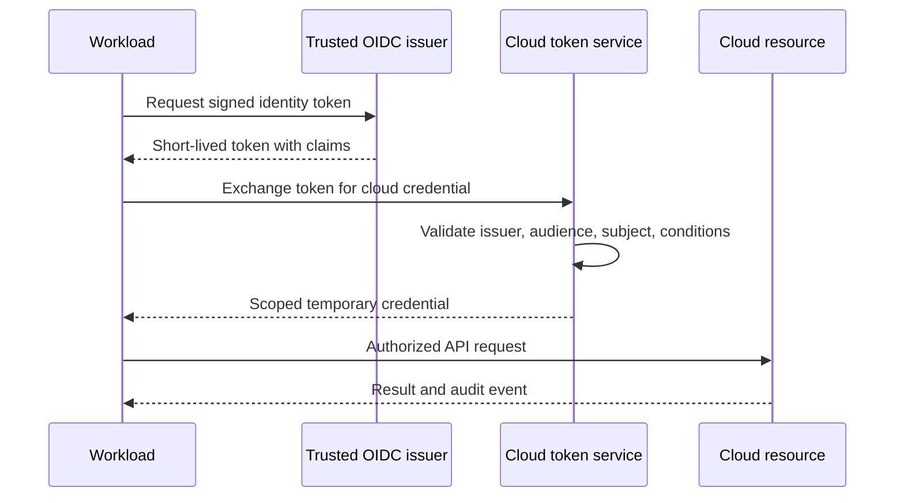

> **Document class:** How-to Guides implementation guide
> **Normative terms:** **MUST**, **MUST NOT**, **SHOULD**, **SHOULD NOT**, and **MAY** are requirements levels.
> **Applicability:** Short-lived workload identity for CI/CD, Kubernetes, applications, and cross-cloud automation.
> **Exception process:** Deviations require a documented risk assessment, compensating controls, named risk owner, and expiry date.

| Control field | Value |
|---|---|
| Document ID | `HTG-21` |
| Owner | Cloud Center of Excellence |
| Review cycle | At least annually and after material identity, federation, or provider changes |
| Evidence | Trust policy, claim mapping, role scope, token lifetime, denied-access tests, audit logs, and rotation or recovery evidence |

# How to Federate Workload Identity Across Clouds

> **Decision in brief:** Bind short-lived credentials to verifiable workload claims and authorize only the actions and resources required by that workload.

> **Document type:** Security implementation guide  
> **Primary example:** GitHub Actions OIDC to Microsoft Entra ID  
> **Operating principle:** Authenticate the workload with signed, short-lived claims and authorize the smallest possible resource scope.

## Objective

Enable pipelines, Kubernetes service accounts, applications, and cloud-to-cloud jobs to obtain temporary credentials without storing client secrets, access keys, service-account keys, or OCI user keys. Federation reduces secret exposure but is safe only when issuer, audience, subject, environment, and authorization are tightly constrained.

## Trust flow

## Define the identity contract

For every workload, record its owner, issuer, exact subject pattern, audience, repository or namespace, environment, cloud role, resource scope, maximum duration, network context, and emergency revocation path. Use a separate cloud identity for production and non-production. A wildcard trust covering an organization, cluster, or all branches is not a shortcut for authorization.

## Implementation procedure

1. Inventory static credentials and rank them by privilege, age, exposure path, and rotation difficulty.
2. Select a supported issuer such as GitHub Actions, Azure DevOps workload federation, a Kubernetes issuer, or a central identity broker.
3. Create one target-cloud identity per workload boundary and assign minimum data-plane or control-plane permissions.
4. Configure trust for the exact issuer URL, audience, and stable subject claims.
5. Restrict protected environments, branches, service accounts, and deployment approvals at the issuer.
6. Exchange the token only inside the authorized job or pod and keep credential duration short.
7. Remove the old secret after parallel validation; revoke it rather than leaving it as fallback.
8. Alert on failed exchanges, unexpected subjects, role changes, long sessions, and use of retired credentials.

## Provider mapping

| Target | Federation mechanism | Preferred workload binding |
|---|---|---|
| Azure | Entra workload identity federation | App registration or managed identity with federated credential and Azure RBAC |
| AWS | IAM OIDC/SAML trust and STS role assumption | Dedicated role with claim conditions and permission boundary |
| GCP | Workload Identity Federation | Pool/provider plus service-account impersonation or direct resource role |
| OCI | Workload identity/resource principals or governed broker | Dynamic group/resource principal; brokered federation when external OIDC is required |

OCI support differs by workload source. Do not replace one static secret with an equally broad broker credential.

## Kubernetes pattern

Bind a dedicated Kubernetes service account to a cloud identity. Limit the trust subject to the cluster issuer, namespace, and service-account name. Apply Kubernetes RBAC separately from cloud IAM, disable automounting where unused, and prevent pods from selecting another workload's service account.

## CI/CD pattern

Protect the deployment environment, require reviewed source, and grant `id-token: write` only to the job that performs federation. Pin reusable workflows and actions, constrain token claims to repository, workflow, branch or environment, and prevent pull-request code from reaching production identity.

## Validation

- [ ] A valid workload can exchange a token and perform only its approved operations.
- [ ] Wrong repository, branch, environment, namespace, service account, audience, or issuer is denied.
- [ ] Token replay after expiry and exchange from an unapproved network fail.
- [ ] Production and non-production identities cannot assume each other.
- [ ] Static predecessor credentials are revoked and absent from code, variables, logs, and artifacts.
- [ ] Audit records correlate issuer claims, assumed identity, cloud action, and deployment evidence.

## Operations and response

Review trust and role assignments at least quarterly. Treat issuer compromise, repository takeover, malicious workflow changes, or service-account impersonation as credential incidents. Disable the federation rule, revoke active sessions where supported, protect logs, inspect cloud changes, restore trusted code and issuer controls, then re-enable with new conditions.

## Related topics

- [Managed Identities and Workload Federation](../networking-identity-security/nis-managed-identities-and-workload-federation.md)
- [Pipeline Identity and Secret Handling](../ci-cd-automation/pipeline-identity-and-secret-handling.md)
- [Identity, Secrets, and Workload-Federation Standard](../standards-best-practices/identity-secrets-and-workload-federation-standard.md)

## Related repos

- [andyxuan2010/ci-cd-template](https://github.com/andyxuan2010/ci-cd-template) — provides GitHub Actions and pipeline starter workflows where claim-bound federation can replace stored deployment secrets.
- [andyxuan2010/azure-template](https://github.com/andyxuan2010/azure-template) — includes Terraform and pipeline patterns for Azure identities and least-privilege deployments.
- [andyxuan2010/aws-template](https://github.com/andyxuan2010/aws-template) — provides AWS Terraform patterns suitable for OIDC trust and scoped IAM-role implementation.
