> **文档类型：** 操作指南
> **规范性术语：** **MUST**、**MUST NOT**、**SHOULD**、**SHOULD NOT** 和 **MAY** 是要求级别。
> **适用范围：** Ansible 内容测试、执行环境构建、制品发布、受控升级、批准和目标感知执行。
> **例外流程：** 偏离要求需要记录风险评估、补偿控制、指定风险负责人和到期日期。

|控制领域|价值|
|---|---|
|文件编号 | `HTG-31` |
|负责人|云卓越中心 |
|审核周期|至少每年一次，并且在重大 Ansible、控制器或流水线发生变化之后 |
|证据|源修订、测试结果、执行环境摘要、升级批准、控制器作业、目标清单和回滚证据 |

# 如何通过受控晋级在 CI/CD 中实现 Ansible 自动化

> **简要决定：** 将 Ansible 内容和执行环境视为不可变的发布制品，并使生产执行落后于目标感知批准。

## 目的

使用此过程通过受保护的 CI/CD 工作流程交付 Ansible Playbook、角色、集合和执行环境。该过程让 CI 负责验证和发布，而控制器或批准的执行服务仍然负责目标感知的生产执行。

结果是一条升级路径，可以证明哪个源修订、运行时、清单、身份、批准和目标范围产生了更改。将流水线语法调整为 Azure DevOps、GitHub Actions、GitLab 或其他 CI 平台；保持控制边界相同。

## 目标工作流程

```mermaid
flowchart LR
    CHANGE[Pull request] --> TEST[Lint, syntax, unit, integration, secret and security tests]
    TEST --> BUILD[Build and scan execution environment]
    BUILD --> PUBLISH[Publish immutable artifact]
    PUBLISH --> DEV[Development controller job]
    DEV --> STAGE[Staging approval and job]
    STAGE --> PROD[Production approval]
    PROD --> CANARY[Canary execution]
    CANARY --> HEALTH[Health gate]
    HEALTH --> WAVE[Serial production waves]
    WAVE --> EVIDENCE[Evidence and change closure]
```

## 先决条件

- 具有受保护的默认分支的 Git 仓库；
- 具有受保护环境的 CI 项目；
- Ansible 控制器或批准的执行服务；
- 执行环境的容器注册表；
- 可以恢复或重新创建的测试目标；
- 经批准的机密提供商；和
- 用于生产晋级的变更记录或发布系统。

## 步骤 1：定义仓库契约

记录支持的 Ansible、Python、集合、操作系统和控制器版本。包括 `collections/requirements.yml`、`execution-environment.yml`、`.ansible-lint`、测试、自述文件和更改日志。

为每个可部署的 playbook 声明：

- 目的和非目标；
- 支持的目标平台和清单组；
- 所需的权限和网络访问权限；
- 变量、类型、默认值和敏感值；
- 检查模式和幂等行为；
- 目标排除和最大范围；
- 健康检查和成功标准；和
- 回滚或前向恢复行为。

不允许流水线从分支名称或自由格式变量推断生产目标。

## 步骤 2：构建 CI 验证

在类似于生产的受控环境中运行检查：
```bash
ansible-lint .
ansible-playbook --syntax-check playbooks/site.yml
ansible-galaxy collection install -r collections/requirements.yml --force-with-deps
pytest -q
```
添加：

- YAML 解析和格式化；
- 依赖性和许可审查；
- 机密扫描；
- 静态安全分析；
- 分子或等效集成测试；
- 检查模式或空运行测试；
- 第二次运行幂等性测试；和
- 执行环境镜像扫描和签名验证。

当所需的检查失败时，使拉取请求失败。仅当记录了所有者、问题和过期时，警告才可用于已知限制。

## 第三步：构建不可变的执行环境

执行环境应从具有固定集合和系统依赖项的版本化定义生成：
```yaml
version: 3
dependencies:
  galaxy: collections/requirements.yml
  python: requirements.txt
images:
  base_image:
    name: registry.example.com/ansible/base:1.0
```
构建一次镜像，扫描它，使用发布标签发布它，并采集它的摘要。生产作业应该使用摘要，而不是移动标签。除非记录了特定于环境的兼容性决策，否则应通过环境晋级相同的摘要。

## 步骤 4：将 CI 连接到控制器

使用具有仅启动预期控制器工作流程权限的短期 CI 身份。流水线应传递发布 ID 和类型化输入文档，而不是任意控制器对象 ID。

控制器工作流程应修复：

- 制定和修订策略；
- Playbook；
- 执行环境；
- 清单或清单组；
- 目标凭证；
- 最大限制和并发数；
- 审批节点；和
- 通知目的地。

验证控制器响应并将作业 URL、作业 ID、状态和输出摘要存储在流水线制品中。将超时视为未知状态，直到查询控制器作业为止；不要在没有重复数据删除的情况下自动重试突变。

## 步骤 5：通过环境进行晋级

使用单独的环境边界进行开发、暂存和生产。每个边界都应该有一个所有者、批准策略、凭证、清单和证据目的地。

晋级应遵循以下顺序：

1. 合并已审核的变更。
2. 构建并发布不可变的执行环境。
3. 针对隔离的目标集运行开发工作流程。
4. 审查作业输出、更改计数、失败和健康证据。
5. 将相同的源和运行时提升到暂存。
6. 获取所需的登台或生产批准。
7. 执行金丝雀或第一个串行波。
8. 评估健康门。
9. 根据结果继续、暂停或恢复。

环境变量可能有所不同，但 playbook 契约和运行时不得默默地重新解释。

## 步骤 6：添加金丝雀和波次控件

对于高风险自动化，请配置：

- 明确的金丝雀清单组；
- 系列批量大小或百分比；
- 最大失败主机数；
- 故障停止行为；
- 预先检查连接、操作系统、维护、磁盘和服务状态；
- 健康状况、版本、配置和遥测的后检查；和
- 恢复动作或操作员切换。

示例 Playbook 控件：
```yaml
- name: Apply platform baseline in controlled waves
  hosts: managed_servers
  serial:
    - 1
    - "25%"
    - "50%"
  max_fail_percentage: 10
  any_errors_fatal: true
  tasks:
    - name: Validate target ownership and maintenance window
      ansible.builtin.assert:
        that:
          - target_environment == approved_environment
          - maintenance_window_open | bool
        fail_msg: "Target is outside the approved execution contract."
```
实际值必须反映服务关键性和恢复能力。广泛的自动化工作不应使用与低风险开发变更相同的波形大小。

## 第 7 步：日志记录证据

存储：

- 仓库和提交；
- 流水线运行和发布标识符；
- 执行环境摘要；
- 控制器工作流程和作业 ID；
- 清单来源和目标范围；
- 凭证身份和批准；
- 开始和结束时间；
- 更改、跳过、失败和无法到达的计数；
- 预检查和后检查结果；和
- 恢复或后续票据。

不要将机密或不受限制的作业输出存储在广泛可读的制品中。对敏感任务输出进行脱敏，同时保留足够的上下文进行调查。

## 步骤 8：处理失败和未知状态

当流水线或控制器请求失败时：

1. 判断作业是否已启动以及是否仍在运行。
2. 重试前查询权威作业状态。
3. 识别完成的靶标和部分突变。
4. 应用记录在案的回滚或前向恢复路径。
5. 根据实际状态重新运行验证。
6. 记录事件并在恢复路径不清楚时更新 Playbook。

在不了解幂等性和目标状态的情况下，切勿通过再次运行整个生产清单来解决部分故障。

## 验证

- [ ] 拉取请求需要所有定义的内容和安全检查。
- [ ] 执行环境可重现、扫描并通过摘要引用。
- [ ] CI 无法选择任意生产凭证或清单。
- [ ] 控制器工作流程修复了 Playbook、修订版、运行时、范围和并发性。
- [ ] 相同的制品在所有环境中得到提升。
- [ ] 金丝雀失败阻止后续波次。
- [ ] 在重试之前协调控制器超时。
- [ ] 证据与发布和变更记录相关。
- [ ] 恢复已在部分故障场景中进行了测试。

## 相关主题

- [CI/CD 和操作的 Ansible 交付模式](../ci-cd-automation/ansible-delivery-patterns-for-cicd-and-operations.md)
- [Ansible 自动化工程标准](../standards-best-practices/ansible-automation-engineering-standard.md)
- [环境晋级、审批、发布控制](../ci-cd-automation/environment-promotion-approval-and-release-controls.md)
- [如何在发布前验证基础设施](how-to-validate-infrastructure-before-release.md)
- [为 Azure 和混合服务器构建企业 Ansible 自动化平台](../hands-on-lab/build-enterprise-ansible-automation-platform-for-azure-and-hybrid-servers.md)

## 参考文档

- [Ansible 执行环境](https://docs.ansible.com/projects/ansible/latest/collections/community/general/docsite/guide_ee.html)
- [Ansible 生成器](https://docs.ansible.com/projects/builder/en/latest/)
- [GitHub Actions 环境](https://docs.github.com/en/actions/deployment/targeting-different-environments/using-environments-for-deployment)
