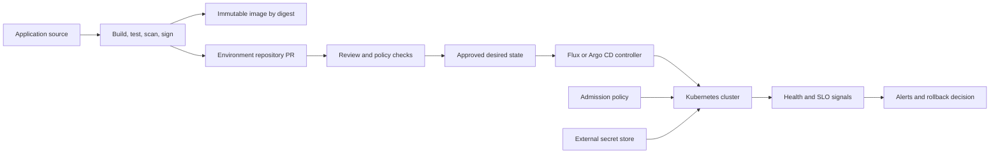

> **文档类型：** 操作指南
> **规范性术语：** **MUST**、**MUST NOT**、**SHOULD**、**SHOULD NOT** 和 **MAY** 是要求级别。
> **适用范围：** AKS、EKS、GKE 和 OKE 的 GitOps 协调、升级、工作负载身份、策略、可观测性和回滚。
> **例外流程：** 偏离要求需要记录风险评估、补偿控制、指定风险负责人和到期日期。

|控制领域|价值|
|---|---|
|文件编号 | `HTG-15` |
|负责人|云卓越中心 |
|审核周期|至少每年一次，并且在 Kubernetes、GitOps 或策略发生重大变化之后 |
|证据|提交和签名、清单差异、策略结果、协调状态、运行状况指标、升级批准和回滚证据 |

# 如何为 Kubernetes 实施 GitOps 交付

> **简要决定：** 使 Git 成为可审核的所需状态，通过受约束的控制器进行协调，并仅通过可逆路径晋级经过验证的提交。

> **文件类型：** 实施指南
> **主要示例：** AKS 与 Flux 或 Argo CD
> **云范围：** Azure、AWS、GCP 和 Oracle Cloud Infrastructure (OCI)
> **工作原则：** Git 日志记录期望的状态；受约束的集群内控制器不断地对其进行协调。

## 目标

以声明方式交付 Kubernetes 配置，无需提供中央流水线广泛、持久的集群凭据。该设计将应用源与环境配置分开，晋级不可变的制品摘要，强制拉取请求控制，检测漂移，并提供经过测试的暂停和恢复过程。

## 前提条件

- 受支持的 Kubernetes 集群，具有私有管理访问权限。
- 具有受保护分支、所需审查以及签名或可归因更改的 Git 服务。
- 不可变的容器和 Helm/OCI Container Registry。
- 一种在 Git 中不存储明文机密的机密传递方法。
- 策略、准入、日志、告警和集群备份基线。
- 平台配置、应用配置和生产审批的指定所有者。

## 建筑学

CI 流水线可能会提出配置更改，但不会直接修改集群。协调器仅读取批准的路径，并且仅具有这些资源所需的权限。

## 设计仓库

使用单独的生命周期边界：
```text
application-repository/
  src/
  Dockerfile
  charts/orders-api/

environment-repository/
  clusters/
    development/
    staging/
    production/
  platform/
  workloads/
    orders-api/
      base/
      overlays/
```
当分支掩盖了升级差异时，请避免使用每个环境的分支模型。受保护的主分支上的环境目录通常提供更清晰的审计跟踪。当团队、权限、保留或变更节奏存在重大差异时，单独的仓库。

## 引导控制器

1. 从固定的、经过验证的版本安装 Flux 或 Argo CD。
2. 将控制器的范围限定为批准的命名空间和资源类型。
3. 使用部署密钥、GitHub 应用或支持的工作负载身份配置只读 Git 身份验证。
4. 限制仓库 URL 并禁止未经批准的 Helm 或清单源。
5. 启用可部署制品的签名或来源验证。
6. 设置协调间隔、超时、重试、运行状况检查和依赖顺序。
7. 将协调、审计和 Kubernetes 事件发送到中央遥测。
8. 从 Git 备份控制器配置和文档重新引导。

不要将 cluster-admin 授予租户控制器。将平台控制器用于集群范围的资源，将命名空间范围的控制器或服务账户用于租户工作负载。

## 规范化清单

每个生产工作负载都应声明：

- 镜像摘要，而不是可变标签；
- 请求、限制、探测、中断预算和自动扩展策略；
- 具有工作负载身份的服务账户，除非需要，否则不安装旧令牌；
- 网络策略和批准的入口/出口路径；
- Pod 安全设置和只读文件系统（如果兼容）；
- 所需可用性目标的拓扑扩展或反亲和力；
- 外部机密引用而不是机密值；
- 所有者、应用、环境、重要性和成本元数据。

一致使用 Helm、Kustomize 或等效模板。在 CI 中渲染并验证最终清单，以便审阅者看到有效的更改。

## 管理机密

将 Azure Key Vault、AWS Secrets Manager、Google Secret Manager 或 OCI Vault 与 CSI 驱动程序或外部密钥控制器结合使用。通过 Kubernetes 工作负载身份进行身份验证。如果 Git 中的加密机密得到批准，请按环境分离解密密钥、限制控制器访问并测试密钥恢复和轮换。

切勿提交 Base64 编码的 Kubernetes Secret 值； base64 不是加密。

## 晋级变革

1. CI 构建并签署一个镜像并记录其摘要。
2. 自动化测试和扫描使制品合格。
3. CI 打开一个拉取请求，将开发清单更改为该摘要。
4. 和解部署它；健康和集成测试创造证据。
5. 新审查的拉取请求将相同的摘要提升到暂存，然后是生产。
6. 生产审批绑定摘要、配置提交、集群和更改窗口。
7. 部署后验证确认部署、应用运行状况、SLO 和业务交易。

不要转发未经审查的环境配置。晋级显式差异并保留特定于环境的值。

## 处理漂移和紧急情况

行动前对漂移进行分类：

|漂移类型|响应 |
|---|---|
|未经授权手动更改|协调、调查身份和审计日志、删除多余的访问权限 |
|紧急批准变更|记录事件/更改、应用临时更改、立即向后移植到 Git |
|控制器缺陷|暂停受影响的协调范围、保存证据、修复和恢复 |
|无效的期望状态 |恢复 Git 提交或提升更正的提交 |
|外部突变|更新准入策略或控制器所有权以防止冲突 |

提供具有时间限制的访问、命名批准、完整审计日志记录以及强制返回 Git 的 break-glass 流程。切勿禁用所有协调来解决一个失败的应用。

## 多云映射

|能力|Azure|AWS | GCP |OCI |
|---|---|---|---|---|
|托管 Kubernetes | AKS | EKS | GKE |无完全等效项|
|工作负载身份|内部工作负载身份 |服务账户或 Pod Identity 的 IAM 角色 | GKE 的工作负载身份联合 | OKE 工作负载身份 |
|机密存储|Key Vault |Secrets Manager |Secrets Manager|Vault |
|Artifact Registry | ACR |ECR |Artifact Registry | OCIR |
|托管 GitOps 选项 | AKS 通量扩展 | EKS 上的控制器 | GKE 上的 Config Sync 或控制器 | OKE 上的控制器 |

即使控制器安装和身份绑定是特定于提供商的，也应保持仓库契约和升级证据提供商中立。

## 验证

- [ ] Git 更改会在服务目标内创建预期的集群更改。
- [ ] 检测到手动托管资源更改并进行协调或发出告警。
- [ ] 拒绝未经批准的仓库、未签名的制品、可变标签或纯文本机密。
- [ ] 租户协调无法创建集群范围的资源或修改其他命名空间。
- [ ] 失败的推出会停止晋级并暴露有用的健康证据。
- [ ] 恢复配置提交可恢复已知良好的摘要。
- [ ] 控制器丢失可以从 Git 和记录在案的引导信息中恢复。
- [ ] Break-glass 访问权限过期，并且每个紧急更改都会向后移植。

## 完成标准

当批准的 Git 状态是权威的、协调权限是有限的、制品是不可变的且经过验证的、机密保持在外部、环境升级是基于证据的、漂移和控制器运行状况是可监控的、并且回滚和重新引导经过测试时，GitOps 就准备好了。

## 相关主题

- [GitOps 交付模式](../ci-cd-automation/gitops-delivery-patterns.md)
- [交付和操作 AKS 工作负载](../applications-kubernetes/app-delivering-and-operating-aks-workloads.md)
- [如何部署和升级 AKS 工作负载](how-to-deploy-and-upgrade-an-aks-workload.md)
- [如何跨环境晋级不可变制品](how-to-promote-immutable-artifacts-across-environments.md)
