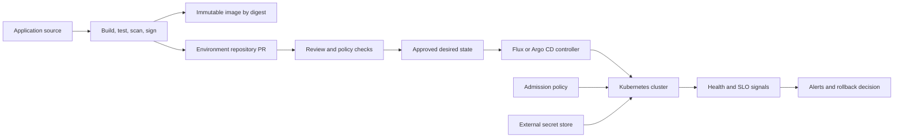

> **Document class:** How-to Guides implementation guide
> **Normative terms:** **MUST**, **MUST NOT**, **SHOULD**, **SHOULD NOT**, and **MAY** are requirements levels.
> **Applicability:** GitOps reconciliation, promotion, workload identity, policy, observability, and rollback for AKS, EKS, GKE, and OKE.
> **Exception process:** Deviations require a documented risk assessment, compensating controls, named risk owner, and expiry date.

| Control field | Value |
|---|---|
| Document ID | `HTG-15` |
| Owner | Cloud Center of Excellence |
| Review cycle | At least annually and after material Kubernetes, GitOps, or policy changes |
| Evidence | Commit and signature, manifest diff, policy results, reconciliation status, health metrics, promotion approval, and rollback evidence |

# How to Implement GitOps Delivery for Kubernetes

> **Decision in brief:** Make Git the auditable desired state, reconcile through a constrained controller, and promote only verified commits with a reversible path.

> **Document type:** Implementation guide
> **Primary examples:** AKS with Flux or Argo CD
> **Cloud scope:** Azure, AWS, GCP, and Oracle Cloud Infrastructure (OCI)
> **Operating principle:** Git records desired state; a constrained in-cluster controller continuously reconciles it.

## Objective

Deliver Kubernetes configuration declaratively without giving a central pipeline broad, persistent cluster credentials. The design separates application source from environment configuration, promotes immutable artifact digests, enforces pull-request controls, detects drift, and provides a tested suspension and recovery procedure.

## Preconditions

- A supported Kubernetes cluster with private administrative access.
- A Git service with protected branches, required review, and signed or attributable changes.
- An immutable container and Helm/OCI registry.
- A secrets-delivery method that stores no plaintext secret in Git.
- Policy, admission, logging, alerting, and cluster backup baselines.
- Named owners for platform configuration, application configuration, and production approval.

## Architecture



The CI pipeline may propose a configuration change but does not directly modify the cluster. The reconciler reads only approved paths and has only the permissions required for those resources.

## Design the repositories

Use separate lifecycle boundaries:

```text
application-repository/
  src/
  Dockerfile
  charts/orders-api/

environment-repository/
  clusters/
    development/
    staging/
    production/
  platform/
  workloads/
    orders-api/
      base/
      overlays/
```

Avoid a branch-per-environment model when branches obscure the promotion diff. Environment directories on a protected main branch usually provide a clearer audit trail. Separate repositories when teams, privileges, retention, or change cadence materially differ.

## Bootstrap the controller

1. Install Flux or Argo CD from a pinned, verified release.
2. Scope the controller to approved namespaces and resource types.
3. Configure read-only Git authentication using a deploy key, GitHub App, or workload identity where supported.
4. Restrict repository URLs and disallow unapproved Helm or manifest sources.
5. Enable signature or provenance verification for deployable artifacts.
6. Set reconciliation intervals, timeouts, retries, health checks, and dependency order.
7. Send reconciliation, audit, and Kubernetes events to central telemetry.
8. Back up controller configuration and document re-bootstrap from Git.

Do not grant cluster-admin to tenant controllers. Use a platform controller for cluster-scoped resources and namespace-scoped controllers or service accounts for tenant workloads.

## Normalize manifests

Every production workload should declare:

- image by digest, not a mutable tag;
- requests, limits, probes, disruption budget, and autoscaling policy;
- service account with workload identity and no mounted legacy token unless required;
- network policy and approved ingress/egress paths;
- pod security settings and read-only filesystem where compatible;
- topology spread or anti-affinity for the required availability objective;
- external secret references rather than secret values;
- owner, application, environment, criticality, and cost metadata.

Use Helm, Kustomize, or equivalent templating consistently. Render and validate the final manifests in CI so reviewers see effective changes.

## Manage secrets

Use Azure Key Vault, AWS Secrets Manager, Google Secret Manager, or OCI Vault with a CSI driver or external-secrets controller. Authenticate through Kubernetes workload identity. If encrypted secrets in Git are approved, separate decryption keys by environment, restrict controller access, and test key recovery and rotation.

Never commit base64-encoded Kubernetes Secret values; base64 is not encryption.

## Promote changes

1. CI builds and signs one image and records its digest.
2. Automated tests and scans qualify the artifact.
3. CI opens a pull request changing the development manifest to that digest.
4. Reconciliation deploys it; health and integration tests create evidence.
5. A new reviewed pull request promotes the same digest to staging, then production.
6. Production approval binds the digest, configuration commit, cluster, and change window.
7. Post-deploy verification confirms rollout, application health, SLOs, and business transactions.

Do not copy unreviewed environment configuration forward. Promote an explicit diff and retain environment-specific values.

## Handle drift and emergencies

Classify drift before acting:

| Drift type | Response |
|---|---|
| Unauthorized manual change | Reconcile, investigate identity and audit logs, remove excess access |
| Emergency approved change | Record incident/change, apply temporary change, back-port immediately to Git |
| Controller defect | Suspend affected reconciliation scope, preserve evidence, fix and resume |
| Invalid desired state | Revert the Git commit or promote a corrected commit |
| External mutation | Update admission policy or controller ownership to prevent conflict |

Provide a break-glass process with time-limited access, named approval, full audit logging, and mandatory reconciliation back to Git. Never disable all reconciliation to resolve one failing application.

## Multi-cloud mapping

| Capability | Azure | AWS | GCP | OCI |
|---|---|---|---|---|
| Managed Kubernetes | AKS | EKS | GKE | OKE |
| Workload identity | Entra workload identity | IAM roles for service accounts or Pod Identity | Workload Identity Federation for GKE | OKE workload identity |
| Secret store | Key Vault | Secrets Manager | Secret Manager | Vault |
| Artifact registry | ACR | ECR | Artifact Registry | OCIR |
| Managed GitOps option | AKS Flux extension | Controllers on EKS | Config Sync or controllers on GKE | Controllers on OKE |

Keep the repository contract and promotion evidence provider-neutral even when controller installation and identity bindings are provider-specific.

## Validation

- [ ] A Git change creates the expected cluster change within the service objective.
- [ ] A manual managed-resource change is detected and reconciled or alerted.
- [ ] An unapproved repository, unsigned artifact, mutable tag, or plaintext secret is rejected.
- [ ] Tenant reconciliation cannot create cluster-scoped resources or modify another namespace.
- [ ] A failed rollout stops promotion and exposes useful health evidence.
- [ ] Reverting the configuration commit restores the known-good digest.
- [ ] Controller loss can be recovered from Git and documented bootstrap material.
- [ ] Break-glass access expires and every emergency change is back-ported.

## Completion criteria

GitOps is ready when approved Git state is authoritative, reconciliation permissions are bounded, artifacts are immutable and verified, secrets remain external, environment promotion is evidence-based, drift and controller health are observable, and rollback and re-bootstrap are tested.

## Related topics

- [GitOps Delivery Patterns](../ci-cd-automation/gitops-delivery-patterns.md)
- [Delivering and Operating AKS Workloads](../applications-kubernetes/app-delivering-and-operating-aks-workloads.md)
- [How to Deploy and Upgrade an AKS Workload](how-to-deploy-and-upgrade-an-aks-workload.md)
- [How to Promote Immutable Artifacts Across Environments](how-to-promote-immutable-artifacts-across-environments.md)
