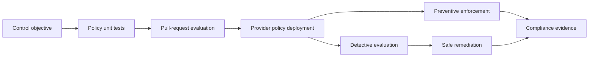

> **文档类型：** 操作指南
> **规范性术语：** **MUST**、**MUST NOT**、**SHOULD**、**SHOULD NOT** 和 **MAY** 是要求级别。
> **适用范围：** 版本化策略定义、测试、预防、检测和部署实施、参数、异常和多云映射。
> **例外流程：** 偏离要求需要记录风险评估、补偿控制、指定风险负责人和到期日期。

|控制领域|价值|
|---|---|
|文件编号 | `HTG-27` |
|负责人|云卓越中心 |
|审核周期|至少每年一次以及在重大策略、提供商或合规性变更之后 |
|证据|策略来源、测试矩阵、分配状态、合规结果、修复日志、异常日志记录和审核日期 |

# 如何实现策略即代码

> **简要决定：** 将一个控制目标表达为版本化测试和特定于提供商的实施，但明确、有负责人且有到期时间的例外情况除外。

> **文件类型：** 治理实施指南  
> **主要示例：** 具有 Terraform 和 CI 验证的 Azure Policy  
> **操作原则：** 标准化控制目标，然后实施每个云中可用的最强安全执行。

## 目标

将架构、安全性、成本、驻留和操作要求转换为可审查、测试、部署、测量和安全更改的策略。策略即代码包括提供商原生控制、IaC 扫描、准入策略、合规性查询、异常工作流程和修复证据。

## 执行模型

## 构建策略目录

对于每个策略，定义稳定的控制 ID、要求、基本原则、范围、严重性、模式、参数、提供商映射、排除、所有者、修复、证据、版本和弃用计划。将策略分组为经批准的举措或与 Landing Zone 配置文件一致的捆绑包。

## 实施流程

1. 优先考虑防止公开曝光、过多特权、未加密数据、丢失日志、不受支持的区域和无主资源的控制。
2. 编写正向、负向、边界、豁免和向后兼容性测试。
3. 在提供程序部署之前评估拉取请求中的 Terraform 或其他 IaC。
4. 在审核模式下推出提供商策略并建立当前合规基线。
5. 纠正误报并缩小策略参数；切勿使用广泛排除来解决一个工作负载问题。
6. 强制使用新资源，然后通过批准的计划修复现有资源。
7. 监控评估失败、拒绝部署、豁免、偏差和策略变化。
8. 通过具有回滚制品的受保护环境晋级策略发布。

## 提供商映射

|能力|Azure|AWS | GCP |OCI |
|---|---|---|---|---|
|组织护栏| Azure Policy / management groups | SCPs、Config、Control Tower controls |Organization Policy and custom constraints|Security Zones 和 Cloud Guard|
| IaC 评估 | OPA/Conftest 或扫描仪 | OPA/Conftest 或扫描仪 | OPA/Conftest 或扫描仪 | OPA/Conftest 或扫描仪 |
| Kubernetes 准入 | Gatekeeper、Kyverno 或托管策略 |Gatekeeper/Kyverno |Policy Controller/Gatekeeper|Gatekeeper/Kyverno |
|证据|Resource Graph 和合规状态 |Config 聚合器和 Security Hub |Asset Inventory 和 SCC |Search、Cloud Guard 和 Audit |

## 异常生命周期

要求请求者、业务原因、受影响的资源、补偿控制、风险负责人、批准、问题参考、开始日期、到期时间和审核节奏。在最窄的范围内对豁免进行编码。到期前发出告警，除非续订获取批准，否则将失败关闭。永久豁免表明必须重新设计策略或架构。

## 安全修复

仅当操作幂等、低风险、有界且经过测试时才进行自动修复。添加所需的标签可能是安全的；更改路由、加密密钥、身份分配或公共访问可能会导致中断或数据丢失。使用经过审查的变更工作流程进行高影响力的纠正。

## 验证

- [ ] 策略测试涵盖合规、不合规、边界和豁免资源。
- [ ] 拉取请求失败，并显示可操作的控制 ID 和修复消息。
- [ ] 正常工作负载身份无法绕过提供程序强制执行。
- [ ] 合规状态汇总每个账户边界并报告过时的评估。
- [ ] 例外情况会自动确定范围、批准、监控并自动过期。
- [ ] 在生产推出之前测试策略回滚和修复逆转。

## 相关主题

- [策略护栏与合规性](../cloud-foundations-governance/policy-guardrails-and-compliance.md)
- [基础设施作为代码工程标准](../standards-best-practices/infrastructure-as-code-engineering-standard.md)
- [如何在发布前验证基础设施](how-to-validate-infrastructure-before-release.md)

## 相关仓库

- [andyxuan2010/azure-landingzone](https://github.com/andyxuan2010/azure-landingzone) — 提供 Azure 落地工作区实现，可以在其中应用管理组策略捆绑包和合规性控制。
- [andyxuan2010/aws-landingzone](https://github.com/andyxuan2010/aws-landingzone) — 用于 SCP 和 Config 护栏的 AWS 多账户基础。
- [andyxuan2010/oci-landingzone](https://github.com/andyxuan2010/oci-landingzone) — 为受管理的隔间、网络和策略实施提供 OCI 基础代码。
