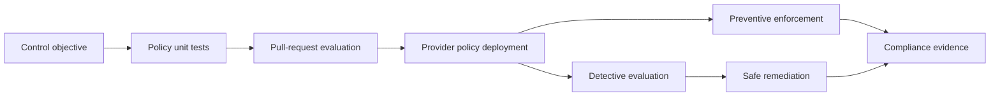

> **Document class:** How-to Guides implementation guide
> **Normative terms:** **MUST**, **MUST NOT**, **SHOULD**, **SHOULD NOT**, and **MAY** are requirements levels.
> **Applicability:** Versioned policy definitions, testing, preventive, detective, and deployment enforcement, parameters, exceptions, and multi-cloud mapping.
> **Exception process:** Deviations require a documented risk assessment, compensating controls, named risk owner, and expiry date.

| Control field | Value |
|---|---|
| Document ID | `HTG-27` |
| Owner | Cloud Center of Excellence |
| Review cycle | At least annually and after material policy, provider, or compliance changes |
| Evidence | Policy source, test matrix, assignment state, compliance results, remediation logs, exception record, and review date |

# How to Implement policy-as-code

> **Decision in brief:** Express one control objective as versioned tests and provider-specific enforcement, with exceptions explicit, owned, and expiring.

> **Document type:** Governance implementation guide  
> **Primary example:** Azure Policy with Terraform and CI validation  
> **Operating principle:** Normalize the control objective, then implement the strongest safe enforcement available in each cloud.

## Objective

Convert architecture, security, cost, residency, and operational requirements into policies that are reviewed, tested, deployed, measured, and safely changed. policy-as-code includes provider-native controls, IaC scanning, admission policy, compliance queries, exception workflow, and remediation evidence.

## Enforcement model

## Build the policy catalog

For every policy, define a stable control ID, requirement, rationale, scope, severity, mode, parameters, provider mappings, exclusions, owner, remediation, evidence, version, and deprecation plan. Group policies into approved initiatives or bundles aligned to landing-zone archetypes.

## Implementation procedure

1. Prioritize controls that prevent public exposure, excessive privilege, unencrypted data, missing logs, unsupported regions, and unowned resources.
2. Write positive, negative, boundary, exemption, and backward-compatibility tests.
3. Evaluate Terraform or other IaC in pull requests before provider deployment.
4. Roll out provider policy in audit mode and establish the current compliance baseline.
5. Correct false positives and narrow policy parameters; never use a broad exclusion to solve one workload issue.
6. Enforce on new resources, then remediate existing resources through an approved plan.
7. Monitor evaluation failures, denied deployments, exemptions, drift, and policy changes.
8. Promote policy releases through protected environments with rollback artifacts.

## Provider mapping

| Capability | Azure | AWS | GCP | OCI |
|---|---|---|---|---|
| Organization guardrails | Azure Policy / management groups | SCPs, Config, Control Tower controls | Organization Policy and custom constraints | Security Zones and Cloud Guard |
| IaC evaluation | OPA/Conftest or scanners | OPA/Conftest or scanners | OPA/Conftest or scanners | OPA/Conftest or scanners |
| Kubernetes admission | Gatekeeper, Kyverno, or managed policy | Gatekeeper/Kyverno | Policy Controller/Gatekeeper | Gatekeeper/Kyverno |
| Evidence | Resource Graph and compliance state | Config aggregators and Security Hub | Asset Inventory and SCC | Search, Cloud Guard, and Audit |

## Exception lifecycle

Require requester, business reason, affected resources, compensating control, risk owner, approval, issue reference, start date, expiry, and review cadence. Encode exemptions at the narrowest scope. Alert before expiry and fail closed unless renewal is approved. Permanent exemptions indicate that the policy or architecture must be redesigned.

## Safe remediation

Auto-remediate only when the action is idempotent, low risk, bounded, and tested. Adding a required tag may be safe; changing routes, encryption keys, identity assignments, or public access can cause outage or data loss. Use a reviewed change workflow for high-impact correction.

## Validation

- [ ] Policy tests cover compliant, noncompliant, boundary, and exempt resources.
- [ ] Pull requests fail with an actionable control ID and remediation message.
- [ ] Provider enforcement cannot be bypassed by normal workload identities.
- [ ] Compliance state aggregates every account boundary and reports stale evaluation.
- [ ] Exceptions are scoped, approved, monitored, and expire automatically.
- [ ] Policy rollback and remediation reversal are tested before production rollout.

## Related topics

- [Policy Guardrails and Compliance](../cloud-foundations-governance/policy-guardrails-and-compliance.md)
- [Infrastructure as Code Engineering Standard](../standards-best-practices/infrastructure-as-code-engineering-standard.md)
- [How to Validate Infrastructure Before Release](how-to-validate-infrastructure-before-release.md)

## Related repos

- [andyxuan2010/azure-landingzone](https://github.com/andyxuan2010/azure-landingzone) — provides an Azure landing-zone implementation where management-group policy bundles and compliance controls can be applied.
- [andyxuan2010/aws-landingzone](https://github.com/andyxuan2010/aws-landingzone) — provides an AWS multi-account foundation suitable for SCP and Config guardrails.
- [andyxuan2010/oci-landingzone](https://github.com/andyxuan2010/oci-landingzone) — provides OCI foundation code for governed compartments, networking, and policy enforcement.
